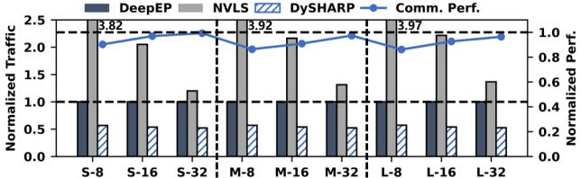
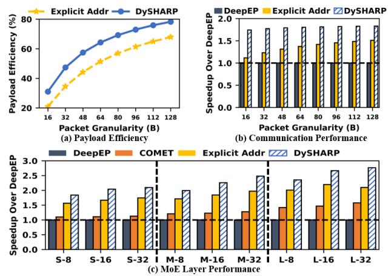
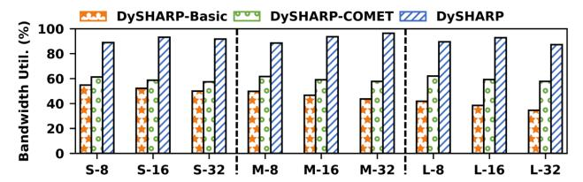

# *B. Detailed Performance Analysis*

In this section, we individually analyze the effectiveness of dynamic multimem addressing and token-centric kernel fusion.

Fig. 18. Traffic volume comparison and DySHARP communication capacity.

Fig. 19. Comparison between DySHARP and explicit addressing on (a) payload efficiency, (b) communication, and (c) MoE layer performance.

*1) Impact of Dynamic Multimem Addressing:* Dynamic multimem addressing reduces redundant data transfers in dynamic communication via in-switch computing, while avoiding useless data transfers present in existing in-switch computing solutions. Fig. 18 compares the data transfer traffic of DeepEP, NVLS, and DySHARP, demonstrating DySHARP's effectiveness in significantly reducing data movement. Due to the substantial volume of useless data transfers, applying NVLS as a workaround results in increased data movement compared to DeepEP. DySHARP reduces traffic by nearly 50% compared to DeepEP by eliminating redundant transfers. To inspect the communication capability of dynamic multimem addressing, we concurrently execute Dispatch and Combine operators without computation to measure the pure communication performance. Fig. 18 demonstrates the pure communication performance normalized to the ideal calculated with traffic volume and bandwidth. DySHARP can, on average, achieve over 90% performance of the ideal, indicating the high performance of such a dynamic multi-destination operation.

We analyze advantage of dynamic multimem addressing compared to straightforward explicit addressing that explicitly encodes all destinations within request packet. Fig. 19(a) compares payload efficiency (the proportion of data flits to total transmitted flits) under different data transfer granularities when targeting 8 destinations. Results demonstrate DySHARP's consistently higher payload efficiency than explicit addressing. Fig. 19(b) further compares performance of pure communication operators, highlighting the gain from high payload efficiency. We also adapt token-centric kernel fusion for explicit addressing and evaluate MoE layer performance. Fig. 19(c) shows results, validating DySHARP's advantage. These results verify discussion in Sec. III-A.

Fig. 20. Bandwidth utilization comparison. Token-centric kernel fusion improves utilization over non-overlap and the SOTA overlap solutions.

*2) Impact of Token-Centric Kernel Fusion:* Token-centric kernel fusion improves overall bandwidth utilization by enabling token-paced pipeline of the Dispatch-Computation-Combine workflow. Fig. 20 compares the bandwidth utilization of full DySHARP against DySHARP-Basic and DySHARP-COMET. Without token-centric kernel fusion, DySHARP-Basic exhibits low bandwidth utilization due to nonoverlapped computation-communication and asymmetric communication. While DySHARP-COMET achieves overlap, isolated Dispatch and Combine are still asymmetric. DySHARP with token-centric kernel fusion merges asymmetric Dispatch and Combine, transforming traffic reduction into speedup.

# *B. Detailed Performance Analysis*

In this section, we individually analyze the effectiveness of dynamic multimem addressing and token-centric kernel fusion.

Fig. 18. Traffic volume comparison and DySHARP communication capacity.

Fig. 19. Comparison between DySHARP and explicit addressing on (a) payload efficiency, (b) communication, and (c) MoE layer performance.

*1) Impact of Dynamic Multimem Addressing:* Dynamic multimem addressing reduces redundant data transfers in dynamic communication via in-switch computing, while avoiding useless data transfers present in existing in-switch computing solutions. Fig. 18 compares the data transfer traffic of DeepEP, NVLS, and DySHARP, demonstrating DySHARP's effectiveness in significantly reducing data movement. Due to the substantial volume of useless data transfers, applying NVLS as a workaround results in increased data movement compared to DeepEP. DySHARP reduces traffic by nearly 50% compared to DeepEP by eliminating redundant transfers. To inspect the communication capability of dynamic multimem addressing, we concurrently execute Dispatch and Combine operators without computation to measure the pure communication performance. Fig. 18 demonstrates the pure communication performance normalized to the ideal calculated with traffic volume and bandwidth. DySHARP can, on average, achieve over 90% performance of the ideal, indicating the high performance of such a dynamic multi-destination operation.

We analyze advantage of dynamic multimem addressing compared to straightforward explicit addressing that explicitly encodes all destinations within request packet. Fig. 19(a) compares payload efficiency (the proportion of data flits to total transmitted flits) under different data transfer granularities when targeting 8 destinations. Results demonstrate DySHARP's consistently higher payload efficiency than explicit addressing. Fig. 19(b) further compares performance of pure communication operators, highlighting the gain from high payload efficiency. We also adapt token-centric kernel fusion for explicit addressing and evaluate MoE layer performance. Fig. 19(c) shows results, validating DySHARP's advantage. These results verify discussion in Sec. III-A.

Fig. 20. Bandwidth utilization comparison. Token-centric kernel fusion improves utilization over non-overlap and the SOTA overlap solutions.

*2) Impact of Token-Centric Kernel Fusion:* Token-centric kernel fusion improves overall bandwidth utilization by enabling token-paced pipeline of the Dispatch-Computation-Combine workflow. Fig. 20 compares the bandwidth utilization of full DySHARP against DySHARP-Basic and DySHARP-COMET. Without token-centric kernel fusion, DySHARP-Basic exhibits low bandwidth utilization due to nonoverlapped computation-communication and asymmetric communication. While DySHARP-COMET achieves overlap, isolated Dispatch and Combine are still asymmetric. DySHARP with token-centric kernel fusion merges asymmetric Dispatch and Combine, transforming traffic reduction into speedup.

