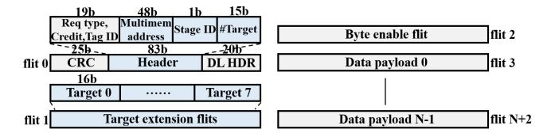
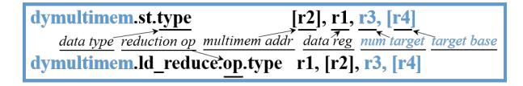
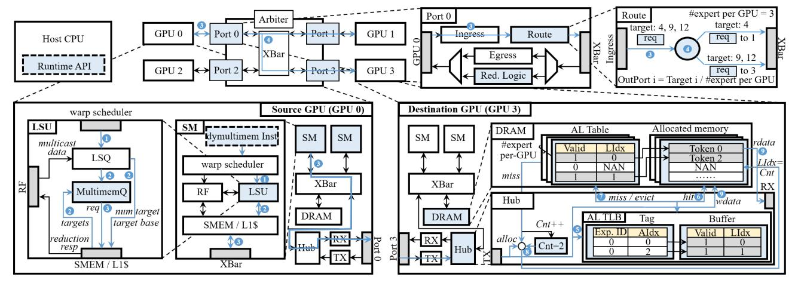

# *B. Packet Format Extension*

As introduced in Sec. III-A, a customized packet format should be supported to carry a single multimem address and an additional target expert list. We extend NVLink data-link

Fig. 7. Our extended data link layer packet format for DySHARP based on the original NVLink packet format. Packet has only a single multimem address and an additional target list.

Fig. 8. ISA extension for dynamic multimem addressing. We derive dymultimem instructions based on multimem instructions, with two additional registers required to specify the target list of the operation.

packet format to support dynamic multimem addressing framework, as shown in Fig. 7. In *flit0*, we replace 64-bit address with: 1) 48-bit multimem address for algebraic index supporting 128TB address space, 2) 1-bit *stage* (Dispatch/Combine), and 3) 15-bit *target count*. Following *flit0*, *target extension* flits encode destination expert IDs (16 bits each, eight per flit). Subsequent byte-enable and payload flits remain unchanged. Compared with explicit addressing that embeds full destination addresses, adopting such a multimem-style format preserves header compactness for near-ideal payload efficiency.

## *C. ISA Extension*

ISA should also be extended to provide a programming interface feasible for our packet extension. Because the request packet carries a single multimem address and a target expert list to support varying targets, ISA should provide this information, enabling source GPU to issue such a request packet.

Therefore, we introduce dymultimem instructions, an extension based on multimem instructions, as illustrated in Fig. 8. Extended instructions include dymultimem.st for multicast in Dispatch and dymultimem.ld\_reduce for reduction in Combine. Similar to original multimem instructions, dymultimem instructions use a register (r2) as multimem address, whose offset is the algebraic index, and another register (r1) to hold the data operand for .st or receive the reduced value for .ld\_reduce. Since NVLS's multimem.ld\_reduce does not support weighted reduction and adding weighting would incur high hardware complexity, our dymultimem.ld\_reduce retains reduction without weighting. Instead, we support weighted sum in Combine by applying weights in the epilogue of the preceding GEMM, before reduction. Concretely, each expert scales its output oi by the gating weight wi in GEMM-2's epilogue, so the subsequent unweighted reduction P i (wi · oi) yields the desired weighted sum.

As extension, to fetch target expert list, each instruction additionally specifies r3 for the target count and r4 for the base address of a contiguous target list. Targets can be fetched from global or shared memory, where list is usually loaded to shared memory in advance to reduce overhead.

Fig. 9. Detailed architectural design and workflow of the dynamic multimem addressing framework. 1) Source GPU includes a new LSU design in SM to fetch targets for dynamic multimem instructions. 2) Switch enhances forwarding and reduction, aware of the target list. 3) Destination GPU introduces a hardware memory manager in the Hub, performing multimem-virtual translation through mapping algebraic index to layout index.

# *B. Packet Format Extension*

As introduced in Sec. III-A, a customized packet format should be supported to carry a single multimem address and an additional target expert list. We extend NVLink data-link

Fig. 7. Our extended data link layer packet format for DySHARP based on the original NVLink packet format. Packet has only a single multimem address and an additional target list.

Fig. 8. ISA extension for dynamic multimem addressing. We derive dymultimem instructions based on multimem instructions, with two additional registers required to specify the target list of the operation.

packet format to support dynamic multimem addressing framework, as shown in Fig. 7. In *flit0*, we replace 64-bit address with: 1) 48-bit multimem address for algebraic index supporting 128TB address space, 2) 1-bit *stage* (Dispatch/Combine), and 3) 15-bit *target count*. Following *flit0*, *target extension* flits encode destination expert IDs (16 bits each, eight per flit). Subsequent byte-enable and payload flits remain unchanged. Compared with explicit addressing that embeds full destination addresses, adopting such a multimem-style format preserves header compactness for near-ideal payload efficiency.

## *C. ISA Extension*

ISA should also be extended to provide a programming interface feasible for our packet extension. Because the request packet carries a single multimem address and a target expert list to support varying targets, ISA should provide this information, enabling source GPU to issue such a request packet.

Therefore, we introduce dymultimem instructions, an extension based on multimem instructions, as illustrated in Fig. 8. Extended instructions include dymultimem.st for multicast in Dispatch and dymultimem.ld\_reduce for reduction in Combine. Similar to original multimem instructions, dymultimem instructions use a register (r2) as multimem address, whose offset is the algebraic index, and another register (r1) to hold the data operand for .st or receive the reduced value for .ld\_reduce. Since NVLS's multimem.ld\_reduce does not support weighted reduction and adding weighting would incur high hardware complexity, our dymultimem.ld\_reduce retains reduction without weighting. Instead, we support weighted sum in Combine by applying weights in the epilogue of the preceding GEMM, before reduction. Concretely, each expert scales its output oi by the gating weight wi in GEMM-2's epilogue, so the subsequent unweighted reduction P i (wi · oi) yields the desired weighted sum.

As extension, to fetch target expert list, each instruction additionally specifies r3 for the target count and r4 for the base address of a contiguous target list. Targets can be fetched from global or shared memory, where list is usually loaded to shared memory in advance to reduce overhead.

Fig. 9. Detailed architectural design and workflow of the dynamic multimem addressing framework. 1) Source GPU includes a new LSU design in SM to fetch targets for dynamic multimem instructions. 2) Switch enhances forwarding and reduction, aware of the target list. 3) Destination GPU introduces a hardware memory manager in the Hub, performing multimem-virtual translation through mapping algebraic index to layout index.

