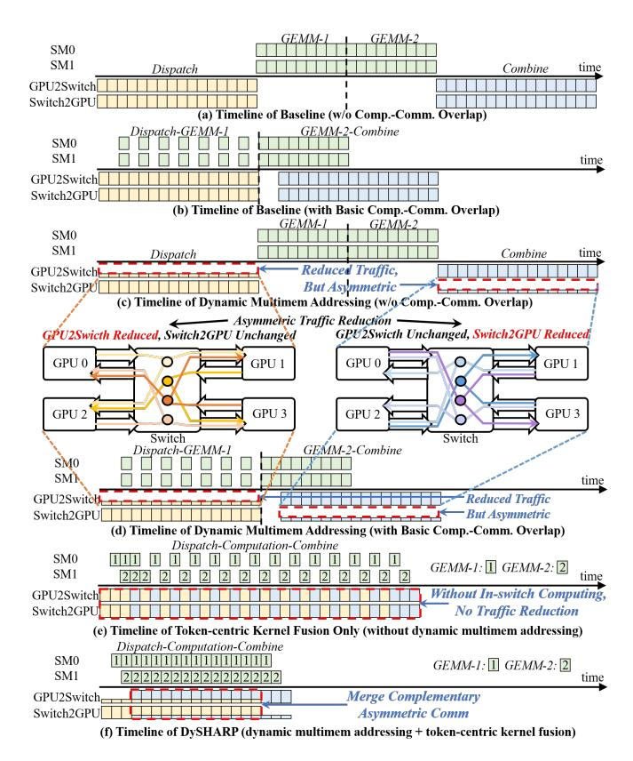
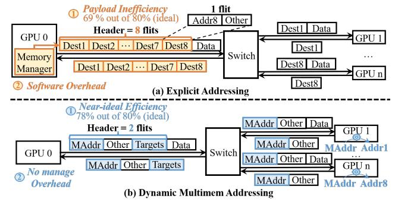
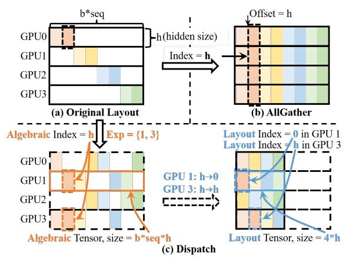

# *C. Opportunity and Limitation of In-Switch Computing*

- *1) Redundancy Elimination with In-Switch Computing:* Theoretically, redundancies introduced in Sec. II-B can be eliminated through in-switch computing [9], [11], [19], [45], [56], which augments interconnect fabric with lightweight processing primitives. Since Hopper [31], NVIDIA has integrated in-switch computing in multi-GPUs interconnected via NVLink/NVSwitch with NVLink SHARP (NVLS) [19]. NVLS introduces *multimem* instructions to utilize in-switch computing for redundant transfer elimination: multimem.st accelerates AllGather through in-switch multicast, and multimem.ld\_reduce speeds up Reduce-Scatter via inswitch reduction. This technique can also potentially address communication redundancy in MoE, as illustrated in Fig. 1(c):
- *In-switch multicast* eliminates the redundancy in the dispatch operator: Only a single copy of the data is transferred from the source GPU to the switch. The switch then multicasts it to all destination GPUs requiring that data. As shown in Fig. 1(c), GPU 0 sends the token to the switch only once. Switch multicasts the token to GPU 2 and 3.
- *In-switch reduction* eliminates the redundancy in the combine operator: The multiple intermediate outputs are accumulated within the switch. Only the final result is transferred from the switch back to the source GPU. The data from GPU 2 and 3 are aggregated within the switch, and only the final accumulated result is transferred to GPU 0.

Therefore, with the capability of multicast and reduction inside the switch, the redundant data transfer can be eliminated. Fig. 2(b) quantifies the ideal acceleration opportunity with redundancy eliminated, indicating a significant ideal communication speedup near 2× with ≥8 activated experts.

*2) Limitation of Existing In-Switch Computing:* While inswitch multicast and reduction are appealing to eliminate this communication redundancy, existing solution (NVLS) is fundamentally static, restricted to static collective operators like AllGather and Reduce-Scatter, and thus incapable of accelerating dynamic communication operators in MoE.

This limitation stems from NVLS's customization for the regularity inherent in static collective operations. As illustrated in Fig. 3(a), this regularity manifests in two forms:

- Fixed target sets: All tokens of the operator always communicate with the same group of GPUs.
- Symmetric addressing: A token resides at identical memory offsets across GPUs.

This regularity enables NVLS to introduce multimem addressing, depicted in Fig. 3(c): Packets carrying only one address and rely on preconfigured target set to determine destinations, minimizing header overhead for high bandwidth efficiency.

However, such a NVLS cannot support the MoE's dynamic communication operators with the irregular pattern. The irregularity is shown in Fig. 3(b):

- Varying targets: each token may be routed to a different subset of experts, e.g., Token A → GPUs {0, 1, 2} while Token B → GPUs {2, 3}.
- Asymmetric addressing: tokens are independently allocated on each GPU in a dynamic approach, leading to divergent memory offsets, e.g., Token A are mapped to offsets {0, 2, 1} across GPUs {0, 1, 2}.

This communication pattern mismatch between dynamic communication in MoE and static collectives NVLS customized for makes NVLS unable to support MoE Dispatch and Combine: Preconfigured target set in switch cannot support varying targets, and carrying only one address in packet cannot determine the destinations under asymmetric addressing.

A na¨ıve workaround reinterprets MoE communication as static collectives: using AllGather to emulate Dispatch and Reduce-Scatter for Combine. However, this forces all GPUs to send/receive data irrespective of actual need, generating useless traffic. Profiling DeepSeek-V3 on a GH200 NVL32-like system reveals that this translation introduces 340% useless traffic, negating the potential benefits of in-switch computing.

## *D. Design Philosophy and Challenges*

To bridge this functionality gap, we propose DySHARP. The core philosophy is to provide a *dynamic* in-switch computing solution to eliminate communication redundancy. However, designing such a system still faces two challenges:

C1: Lack of Top-Down Architectural Support. The existing multi-GPU system design lacks architectural support for such a dynamic in-switch computing. To address this problem, DySHARP introduces dynamic multimem addressing, a dynamic extension to the existing multimem addressing framework. Dynamic multimem addressing introduces topdown enhancement to the existing multi-GPU system, including packet format, ISA, microarchitecture of both GPU and switch, and CUDA runtime. This full-stack extension

Fig. 4. How the two techniques work as an integral solution. Dynamic multimem addressing reduces traffic but inherently introduces asymmetric reduction across directions. Token-centric kernel fusion resolves this asymmetry, translating traffic reduction into overall speedup. Neither alone is sufficient.

enables the functionality of dynamic in-switch computing. By eliminating redundant traffic via in-switch multicast and reduction, dynamic multimem addressing reduces nearly half of the total communication traffic.

C2: Low Utilization of Isolated Dataflow Schedule. Even with architectural support, executing dispatch and combine as isolated operators creates *directional* bandwidth imbalance. Inswitch multicast suppresses GPU→switch traffic but leaves switch→GPU heavy, and vice versa for reduction. The underoptimized direction dominates, resulting in low overall utilization. Overlap schemes [10], [12], [53], [57] can be composed with in-switch computing, but two communication kernels still remain isolated. DySHARP proposes token-centric kernel fusion to pipeline the whole Dispatch-Computation-Combine chain. This enables concurrent Dispatch and Combine, where complementary traffic patterns balance bidirectional bandwidth and significantly improve utilization. Fig. 4 illustrates how the two techniques work as an integral solution. As shown in Fig. 4(b), in-switch computing inherently introduces traffic reduction that is asymmetric between two directions: in-switch multicast reduces GPU-to-switch traffic in Dispatch, while inswitch reduction reduces switch-to-GPU traffic in Combine. When Dispatch and Combine are executed in isolation, the unreduced direction becomes the bottleneck, preventing the traffic reduction from directly translating into speedup. Tokencentric kernel fusion resolves this asymmetry, translating the

Fig. 5. Two potential solutions for dynamic in-switch computing. (a) The straightforward solution is explicit addressing, but it has low payload efficiency and high software overhead. (b) Dynamic multimem addressing that we employ achieves near-ideal payload efficiency and no software overhead.

traffic reduction into end-to-end speedup and achieving complete redundancy elimination, as shown in Fig. 4(d). Neither technique alone is sufficient: without traffic reduction, tokencentric kernel fusion alone offers no improvement over existing techniques, as shown in Fig. 4(c). Detailed analysis is in Sec. IV-A, with quantitative validation in Sec. VI-A3.

## III. DYNAMIC MULTIMEM ADDRESSING

## *A. Key Idea of Dynamic Multimem Addressing*

To enable dynamic in-switch computing that supports the irregular dynamic communication in MoE, there are two potential solutions. The first solution is a straightforward approach that abandons multimem addressing and reverts to general shared-memory in-switch operations, which explicitly embeds all destination addresses, shown as explicit addressing in Fig. 5(a). The second solution is to extend existing multimem addressing, still carrying only one address that represents multiple destinations of a request, which is our proposed dynamic multimem addressing, as shown in Fig. 5(b).

For explicit addressing, while it can support varying targets and asymmetric addressing, it is inefficient: 1) *Payload inefficiency*: explicit destinations inflate packet headers and reduce payload efficiency; e.g., targeting eight GPUs requires eight destination flits in both request and response, dropping efficiency from an ideal 80% to 69%. 2) *Software overhead*: sender must track remote memory states, e.g., per-expert token counters, and precompute destination addresses, causing extra synchronization (over 5% performance loss [59]) and consuming 10-20% of GPU compute resources [6]. In comparison, dynamic multimem addressing is more promising. With only one address in the packet, it achieves high payload efficiency. Without considering detailed addressing in target GPUs, software overhead is also eliminated. Therefore, we employ dynamic multimem addressing in DySHARP.

The core of designing dynamic multimem addressing is *how to define the carried address that can represent the irregular multiple destinations of an operation.* We derive this address based on our understanding that Dispatch and Combine are the dynamic counterparts of AllGather and Reduce-Scatter. As shown in Fig. 6 (one expert per GPU), two properties follow:

Fig. 6. Comparison between Dispatch and AllGather. Dispatch/Combine are dynamic variants of AllGather/Reduce-Scatter, still with identical algebraic index across GPUs but per-GPU managed asymmetric memory layout.

- 1) Algebraic index is identical across GPUs. In AllGather, each token is always broadcast to all GPUs and lands at the same index in the result tensor of each GPU. Algebraically, the only transformation from AllGather to Dispatch is that each token is sent only to a dynamically selected subset. Therefore, the *algebraic index*, i.e., the index in the resulting *algebraic tensor*, is still identical across GPUs.
- 2) Memory layout is per-GPU managed and asymmetric. Because only a subset of GPUs receives a given token, the algebraic tensor is fragmented and must be compacted into a dense *layout tensor* to be stored in memory. This compaction is performed through stacking tokens within each GPU, so the resulting *layout index*, i.e., the index in the layout tensor, is naturally asymmetric across GPUs.

These properties give us the answer to question above, as illustrated in Fig. 5(b): *with a lightweight target expert list and an algebraic-layout mapping, the algebraic index can represent multiple destinations of an operation.* It drives two design points of our proposed dynamic multimem addressing:

- Customized Packet: A customized packet carries a single multimem address, whose offset is the algebraic index, and a target expert list. Packet format, ISA, and microarchitecture of GPU and switch are extended for support.
- Index Managing: A hardware memory manager is proposed in Hub. This manager performs algebraic-layout index mapping to translate multimem address to virtual address, whose offset is layout index, for memory access.

Our design introduces only minor, non-intrusive modifications to the existing hardware and software stack, building upon current datapaths without altering any original functionalities. This ensures low design complexity and minimal overhead, while preserving full support for other workloads. Design details will be introduced in the following subsections.

# *C. Opportunity and Limitation of In-Switch Computing*

- *1) Redundancy Elimination with In-Switch Computing:* Theoretically, redundancies introduced in Sec. II-B can be eliminated through in-switch computing [9], [11], [19], [45], [56], which augments interconnect fabric with lightweight processing primitives. Since Hopper [31], NVIDIA has integrated in-switch computing in multi-GPUs interconnected via NVLink/NVSwitch with NVLink SHARP (NVLS) [19]. NVLS introduces *multimem* instructions to utilize in-switch computing for redundant transfer elimination: multimem.st accelerates AllGather through in-switch multicast, and multimem.ld\_reduce speeds up Reduce-Scatter via inswitch reduction. This technique can also potentially address communication redundancy in MoE, as illustrated in Fig. 1(c):
- *In-switch multicast* eliminates the redundancy in the dispatch operator: Only a single copy of the data is transferred from the source GPU to the switch. The switch then multicasts it to all destination GPUs requiring that data. As shown in Fig. 1(c), GPU 0 sends the token to the switch only once. Switch multicasts the token to GPU 2 and 3.
- *In-switch reduction* eliminates the redundancy in the combine operator: The multiple intermediate outputs are accumulated within the switch. Only the final result is transferred from the switch back to the source GPU. The data from GPU 2 and 3 are aggregated within the switch, and only the final accumulated result is transferred to GPU 0.

Therefore, with the capability of multicast and reduction inside the switch, the redundant data transfer can be eliminated. Fig. 2(b) quantifies the ideal acceleration opportunity with redundancy eliminated, indicating a significant ideal communication speedup near 2× with ≥8 activated experts.

*2) Limitation of Existing In-Switch Computing:* While inswitch multicast and reduction are appealing to eliminate this communication redundancy, existing solution (NVLS) is fundamentally static, restricted to static collective operators like AllGather and Reduce-Scatter, and thus incapable of accelerating dynamic communication operators in MoE.

This limitation stems from NVLS's customization for the regularity inherent in static collective operations. As illustrated in Fig. 3(a), this regularity manifests in two forms:

- Fixed target sets: All tokens of the operator always communicate with the same group of GPUs.
- Symmetric addressing: A token resides at identical memory offsets across GPUs.

This regularity enables NVLS to introduce multimem addressing, depicted in Fig. 3(c): Packets carrying only one address and rely on preconfigured target set to determine destinations, minimizing header overhead for high bandwidth efficiency.

However, such a NVLS cannot support the MoE's dynamic communication operators with the irregular pattern. The irregularity is shown in Fig. 3(b):

- Varying targets: each token may be routed to a different subset of experts, e.g., Token A → GPUs {0, 1, 2} while Token B → GPUs {2, 3}.
- Asymmetric addressing: tokens are independently allocated on each GPU in a dynamic approach, leading to divergent memory offsets, e.g., Token A are mapped to offsets {0, 2, 1} across GPUs {0, 1, 2}.

This communication pattern mismatch between dynamic communication in MoE and static collectives NVLS customized for makes NVLS unable to support MoE Dispatch and Combine: Preconfigured target set in switch cannot support varying targets, and carrying only one address in packet cannot determine the destinations under asymmetric addressing.

A na¨ıve workaround reinterprets MoE communication as static collectives: using AllGather to emulate Dispatch and Reduce-Scatter for Combine. However, this forces all GPUs to send/receive data irrespective of actual need, generating useless traffic. Profiling DeepSeek-V3 on a GH200 NVL32-like system reveals that this translation introduces 340% useless traffic, negating the potential benefits of in-switch computing.

## *D. Design Philosophy and Challenges*

To bridge this functionality gap, we propose DySHARP. The core philosophy is to provide a *dynamic* in-switch computing solution to eliminate communication redundancy. However, designing such a system still faces two challenges:

C1: Lack of Top-Down Architectural Support. The existing multi-GPU system design lacks architectural support for such a dynamic in-switch computing. To address this problem, DySHARP introduces dynamic multimem addressing, a dynamic extension to the existing multimem addressing framework. Dynamic multimem addressing introduces topdown enhancement to the existing multi-GPU system, including packet format, ISA, microarchitecture of both GPU and switch, and CUDA runtime. This full-stack extension

Fig. 4. How the two techniques work as an integral solution. Dynamic multimem addressing reduces traffic but inherently introduces asymmetric reduction across directions. Token-centric kernel fusion resolves this asymmetry, translating traffic reduction into overall speedup. Neither alone is sufficient.

enables the functionality of dynamic in-switch computing. By eliminating redundant traffic via in-switch multicast and reduction, dynamic multimem addressing reduces nearly half of the total communication traffic.

C2: Low Utilization of Isolated Dataflow Schedule. Even with architectural support, executing dispatch and combine as isolated operators creates *directional* bandwidth imbalance. Inswitch multicast suppresses GPU→switch traffic but leaves switch→GPU heavy, and vice versa for reduction. The underoptimized direction dominates, resulting in low overall utilization. Overlap schemes [10], [12], [53], [57] can be composed with in-switch computing, but two communication kernels still remain isolated. DySHARP proposes token-centric kernel fusion to pipeline the whole Dispatch-Computation-Combine chain. This enables concurrent Dispatch and Combine, where complementary traffic patterns balance bidirectional bandwidth and significantly improve utilization. Fig. 4 illustrates how the two techniques work as an integral solution. As shown in Fig. 4(b), in-switch computing inherently introduces traffic reduction that is asymmetric between two directions: in-switch multicast reduces GPU-to-switch traffic in Dispatch, while inswitch reduction reduces switch-to-GPU traffic in Combine. When Dispatch and Combine are executed in isolation, the unreduced direction becomes the bottleneck, preventing the traffic reduction from directly translating into speedup. Tokencentric kernel fusion resolves this asymmetry, translating the

Fig. 5. Two potential solutions for dynamic in-switch computing. (a) The straightforward solution is explicit addressing, but it has low payload efficiency and high software overhead. (b) Dynamic multimem addressing that we employ achieves near-ideal payload efficiency and no software overhead.

traffic reduction into end-to-end speedup and achieving complete redundancy elimination, as shown in Fig. 4(d). Neither technique alone is sufficient: without traffic reduction, tokencentric kernel fusion alone offers no improvement over existing techniques, as shown in Fig. 4(c). Detailed analysis is in Sec. IV-A, with quantitative validation in Sec. VI-A3.

## III. DYNAMIC MULTIMEM ADDRESSING

## *A. Key Idea of Dynamic Multimem Addressing*

To enable dynamic in-switch computing that supports the irregular dynamic communication in MoE, there are two potential solutions. The first solution is a straightforward approach that abandons multimem addressing and reverts to general shared-memory in-switch operations, which explicitly embeds all destination addresses, shown as explicit addressing in Fig. 5(a). The second solution is to extend existing multimem addressing, still carrying only one address that represents multiple destinations of a request, which is our proposed dynamic multimem addressing, as shown in Fig. 5(b).

For explicit addressing, while it can support varying targets and asymmetric addressing, it is inefficient: 1) *Payload inefficiency*: explicit destinations inflate packet headers and reduce payload efficiency; e.g., targeting eight GPUs requires eight destination flits in both request and response, dropping efficiency from an ideal 80% to 69%. 2) *Software overhead*: sender must track remote memory states, e.g., per-expert token counters, and precompute destination addresses, causing extra synchronization (over 5% performance loss [59]) and consuming 10-20% of GPU compute resources [6]. In comparison, dynamic multimem addressing is more promising. With only one address in the packet, it achieves high payload efficiency. Without considering detailed addressing in target GPUs, software overhead is also eliminated. Therefore, we employ dynamic multimem addressing in DySHARP.

The core of designing dynamic multimem addressing is *how to define the carried address that can represent the irregular multiple destinations of an operation.* We derive this address based on our understanding that Dispatch and Combine are the dynamic counterparts of AllGather and Reduce-Scatter. As shown in Fig. 6 (one expert per GPU), two properties follow:

Fig. 6. Comparison between Dispatch and AllGather. Dispatch/Combine are dynamic variants of AllGather/Reduce-Scatter, still with identical algebraic index across GPUs but per-GPU managed asymmetric memory layout.

- 1) Algebraic index is identical across GPUs. In AllGather, each token is always broadcast to all GPUs and lands at the same index in the result tensor of each GPU. Algebraically, the only transformation from AllGather to Dispatch is that each token is sent only to a dynamically selected subset. Therefore, the *algebraic index*, i.e., the index in the resulting *algebraic tensor*, is still identical across GPUs.
- 2) Memory layout is per-GPU managed and asymmetric. Because only a subset of GPUs receives a given token, the algebraic tensor is fragmented and must be compacted into a dense *layout tensor* to be stored in memory. This compaction is performed through stacking tokens within each GPU, so the resulting *layout index*, i.e., the index in the layout tensor, is naturally asymmetric across GPUs.

These properties give us the answer to question above, as illustrated in Fig. 5(b): *with a lightweight target expert list and an algebraic-layout mapping, the algebraic index can represent multiple destinations of an operation.* It drives two design points of our proposed dynamic multimem addressing:

- Customized Packet: A customized packet carries a single multimem address, whose offset is the algebraic index, and a target expert list. Packet format, ISA, and microarchitecture of GPU and switch are extended for support.
- Index Managing: A hardware memory manager is proposed in Hub. This manager performs algebraic-layout index mapping to translate multimem address to virtual address, whose offset is layout index, for memory access.

Our design introduces only minor, non-intrusive modifications to the existing hardware and software stack, building upon current datapaths without altering any original functionalities. This ensures low design complexity and minimal overhead, while preserving full support for other workloads. Design details will be introduced in the following subsections.

