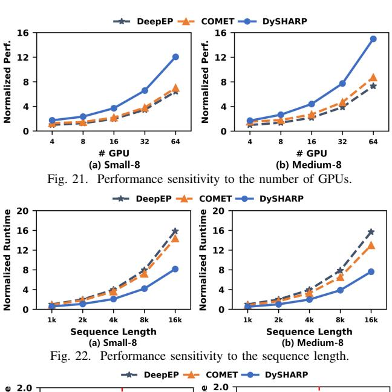
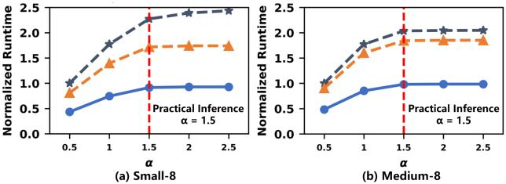

# *C. Sensitivity Analysis*

- *1) Performance of Different Numbers of GPUs:* We evaluate the performance of DySHARP against baselines across different system scales. Using Small-8 and Medium-8 model configurations, we compare DySHARP with DeepEP and COMET across GPU counts of 4-64. Fig. 21 presents our evaluation on MoE layer. We simulate the 64-GPU node as an extension of NVL32, where the only difference is the interconnect. We simulate such a system with doubled number of NVSwitch (18 NVSwitch). Each NVSwitch has 64 ports, and each port is connected to a GPU, providing full bandwidth for the GH200 chip that has 18 ports. The results show that as the number of GPUs increases, DySHARP consistently outperforms both DeepEP and COMET, with the gap progressively widening. This highlights DySHARP's strong scalability and demonstrates its potential for future larger-scale SuperPODs.
- *2) Performance of Different Sequence Lengths:* We further evaluate the performance of DySHARP against baselines across varying sequence lengths. Fig. 22 presents the comparison results on MoE layer under sequence lengths of 1024- 16384. Results demonstrate that DySHARP achieves the shortest execution time regardless of sequence length. As the length increases, the execution times of both DeepEP and COMET rise rapidly, while DySHARP's execution time increases more moderately. This indicates that DySHARP's advantage over baselines becomes more pronounced with longer sequences.
- *3) Performance of Different Token Distribution:* The number of tokens routed to each device is different. Therefore, we evaluate sensitivity to token distribution. Following evaluation setup of ByteDance's COMET [57], we vary standard deviation of token distribution across experts from 0.01 to 0.05, based on normal distribution std = 0.032 for a typical training job as introduced in Sec. V-B. Result demonstrates that DySHARP always achieves remarkable speedups over baselines on MoE layer, regardless of token distribution variations.

Fig. 23. Performance sensitivity to the token distribution for training.

Fig. 24. Performance sensitivity to the token distribution for inference.

We also evaluate token distribution during inference, different from training [22]. Our preliminary study reveals a powerlaw distribution, consistent with recent work [47] showing that inference token distribution can be modeled as power-law with α ≈ 1.5. Accordingly, we model inference token distribution as a power-law with α of 0.5-2.5. Fig. 24 shows that, while imbalance prolongs all methods, DySHARP consistently achieves substantial speedup under inference distributions.

# *C. Sensitivity Analysis*

- *1) Performance of Different Numbers of GPUs:* We evaluate the performance of DySHARP against baselines across different system scales. Using Small-8 and Medium-8 model configurations, we compare DySHARP with DeepEP and COMET across GPU counts of 4-64. Fig. 21 presents our evaluation on MoE layer. We simulate the 64-GPU node as an extension of NVL32, where the only difference is the interconnect. We simulate such a system with doubled number of NVSwitch (18 NVSwitch). Each NVSwitch has 64 ports, and each port is connected to a GPU, providing full bandwidth for the GH200 chip that has 18 ports. The results show that as the number of GPUs increases, DySHARP consistently outperforms both DeepEP and COMET, with the gap progressively widening. This highlights DySHARP's strong scalability and demonstrates its potential for future larger-scale SuperPODs.
- *2) Performance of Different Sequence Lengths:* We further evaluate the performance of DySHARP against baselines across varying sequence lengths. Fig. 22 presents the comparison results on MoE layer under sequence lengths of 1024- 16384. Results demonstrate that DySHARP achieves the shortest execution time regardless of sequence length. As the length increases, the execution times of both DeepEP and COMET rise rapidly, while DySHARP's execution time increases more moderately. This indicates that DySHARP's advantage over baselines becomes more pronounced with longer sequences.
- *3) Performance of Different Token Distribution:* The number of tokens routed to each device is different. Therefore, we evaluate sensitivity to token distribution. Following evaluation setup of ByteDance's COMET [57], we vary standard deviation of token distribution across experts from 0.01 to 0.05, based on normal distribution std = 0.032 for a typical training job as introduced in Sec. V-B. Result demonstrates that DySHARP always achieves remarkable speedups over baselines on MoE layer, regardless of token distribution variations.

Fig. 23. Performance sensitivity to the token distribution for training.

Fig. 24. Performance sensitivity to the token distribution for inference.

We also evaluate token distribution during inference, different from training [22]. Our preliminary study reveals a powerlaw distribution, consistent with recent work [47] showing that inference token distribution can be modeled as power-law with α ≈ 1.5. Accordingly, we model inference token distribution as a power-law with α of 0.5-2.5. Fig. 24 shows that, while imbalance prolongs all methods, DySHARP consistently achieves substantial speedup under inference distributions.

