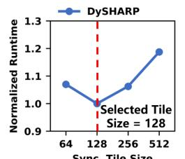
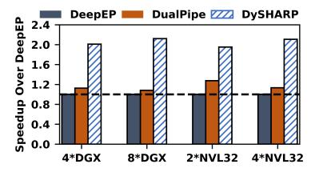

# *D. Extension to Multi-Node System*

InfiniBand (IB) [38] networks with Quantum Switch exhibit similar communication redundancy, making multi-node extension feasible. Motivated by the call for a unified network interface [6], [58], our extension abstracts the whole cluster as a shared memory system: programmers keep using dymultimem.st and dymultimem.ld\_reduce for cross-node in-switch computing, where NVSwitch and Quantum IB Switch coordinate global routing. Taking multicast (dymultimem.st) as an example, the source GPU duplicates the request: one copy goes to NVSwitch for intranode delivery, and the other is sent out-of-node, via extended IBGDA [37] for translation between two communication models, to the IB Switch, which multicasts it to all target nodes. At each remote node, the GPU with the same intranode ID forwards the request via NVSwitch to destination GPUs. dymultimem.ld\_reduce is similar. Small NVLink packets are aggregated before entering IB to improve performance [28]. Details are omitted for space.

We perform preliminary evaluation comparing to DeepEP and DualPipe for end-to-end training (Large-8). We apply expert parallelism across 4/8\*DGX-H100 and 2/4\*NVL32, and also adopt 16-way pipeline parallelism. Nodes are interconnected with IB. Results in Fig. 31 show the benefit of extended DySHARP over multi-node baselines. While DeepEP reduces

Fig. 30. Study on our optimal kernel fusion tile size.

Fig. 31. Evaluation of DySHARP's multinode extension.

inter-node traffic via hierarchical communication *across* intraand inter-node networks, it cannot eliminate redundancy *within* switch-connected networks (Fig. 1) in both intra- and internode networks, which DySHARP effectively eliminates.

## VIII. RELATED WORK

Numerous prior works have proposed leveraging switches to accelerate operations such as AllReduce [5], [8], [9], [19], [23], [24], [45], [56], database queries [21], [50], MapReduce [3], [4], and DLRM communication [11]. However, most efforts focus on traditional inter-node networks. Only NVLS [19], CAIS [56], and TRACI [11] target inter-chip interconnects with memory semantics. Nevertheless, NVLS and CAIS only support static collectives, and TRACI is tailored to DLRM. Crucially, neither supports the dynamic communication inherent in MoE.

An increasing number of works aim to optimize the communication bottleneck in MoE. Some works [20], [30], [46], [59] provide highly optimized libraries. Recent works [12], [29], [44], [59] also consider hierarchical communication. Beyond optimizing the communication operators in isolation, several works [10], [12], [53], [57] explore overlapping computation and communication to reduce exposed communication overhead. FasterMoE [10] and Tutel [12] introduce coarsegrained overlap pipeline. COMET [57] and CCFuser [53] further achieve fine-grained overlap to enhance performance. Some works [2], [15], [42], [54] target overlapping in dense LLM but are inapplicable to MoE. None leverages in-switch computing to reduce communication redundancy in MoE.

## IX. CONCLUSION

We propose DySHARP, an integral dynamic in-switch computing solution for MoE acceleration. It introduces dynamic multimem addressing and token-centric kernel fusion to achieve fully exploited in-switch computing capabilities. With such a full-stack solution, DySHARP achieves up to 1.79× speedup compared to the SOTA solution.

## ACKNOWLEDGEMENT

We sincerely thank the anonymous ISCA'26 reviewers and shepherd for their valuable suggestions. This work is supported by National Natural Science Foundation of China (NSFC) grant (62502305), Natural Science Foundation of Shanghai (NSFS) grant 25ZR1402275, the Shanghai QiYuan Innovation Foundation QY2025-QN-SJTU-011, Hong Kong Research Grants Council (RGC) CRF-YCRG C6003-24Y, and Shanghai Qi Zhi Institute Innovation Program SQZ202316.

## REFERENCES

- [1] ByteDance, "Flux: Fine-grained computation-communication overlapping gpu kernel library." *https://github.com/bytedance/flux*, 2025.
- [2] C. Chen, X. Li, Q. Zhu, J. Duan, P. Sun, X. Zhang, and C. Yang, "Centauri: Enabling efficient scheduling for communication-computation overlap in large model training via communication partitioning," in *Proceedings of the 29th ACM International Conference on Architectural Support for Programming Languages and Operating Systems, Volume 3*, 2024, pp. 178–191.
- [3] G. Chen, G. Zeng, and L. Chen, "P4com: In-network computation with programmable switches," *arXiv preprint arXiv:2107.13694*, 2021.
- [4] L. Chen, G. Chen, J. Lingys, and K. Chen, "Programmable switch as a parallel computing device," *arXiv preprint arXiv:1803.01491*, 2018.
- [5] D. De Sensi, S. Di Girolamo, S. Ashkboos, S. Li, and T. Hoefler, "Flare: Flexible in-network allreduce," in *Proceedings of the International Conference for High Performance Computing, Networking, Storage and Analysis*, 2021, pp. 1–16.
- [6] DeepSeek-AI, A. Liu, B. Feng, B. Xue, B. Wang, B. Wu, C. Lu, C. Zhao, C. Deng, C. Zhang, C. Ruan, D. Dai, D. Guo, D. Yang, D. Chen, D. Ji, E. Li, F. Lin, F. Dai, F. Luo, G. Hao, G. Chen, G. Li, H. Zhang, H. Bao, H. Xu, H. Wang, H. Zhang, H. Ding, H. Xin, H. Gao, H. Li, H. Qu, J. L. Cai, J. Liang, J. Guo, J. Ni, J. Li, J. Wang, J. Chen, J. Chen, J. Yuan, J. Qiu, J. Li, J. Song, K. Dong, K. Hu, K. Gao, K. Guan, K. Huang, K. Yu, L. Wang, L. Zhang, L. Xu, L. Xia, L. Zhao, L. Wang, L. Zhang, M. Li, M. Wang, M. Zhang, M. Zhang, M. Tang, M. Li, N. Tian, P. Huang, P. Wang, P. Zhang, Q. Wang, Q. Zhu, Q. Chen, Q. Du, R. J. Chen, R. L. Jin, R. Ge, R. Zhang, R. Pan, R. Wang, R. Xu, R. Zhang, R. Chen, S. S. Li, S. Lu, S. Zhou, S. Chen, S. Wu, S. Ye, S. Ye, S. Ma, S. Wang, S. Zhou, S. Yu, S. Zhou, S. Pan, T. Wang, T. Yun, T. Pei, T. Sun, W. L. Xiao, W. Zeng, W. Zhao, W. An, W. Liu, W. Liang, W. Gao, W. Yu, W. Zhang, X. Q. Li, X. Jin, X. Wang, X. Bi, X. Liu, X. Wang, X. Shen, X. Chen, X. Zhang, X. Chen, X. Nie, X. Sun, X. Wang, X. Cheng, X. Liu, X. Xie, X. Liu, X. Yu, X. Song, X. Shan, X. Zhou, X. Yang, X. Li, X. Su, X. Lin, Y. K. Li, Y. Q. Wang, Y. X. Wei, Y. X. Zhu, Y. Zhang, Y. Xu, Y. Xu, Y. Huang, Y. Li, Y. Zhao, Y. Sun, Y. Li, Y. Wang, Y. Yu, Y. Zheng, Y. Zhang, Y. Shi, Y. Xiong, Y. He, Y. Tang, Y. Piao, Y. Wang, Y. Tan, Y. Ma, Y. Liu, Y. Guo, Y. Wu, Y. Ou, Y. Zhu, Y. Wang, Y. Gong, Y. Zou, Y. He, Y. Zha, Y. Xiong, Y. Ma, Y. Yan, Y. Luo, Y. You, Y. Liu, Y. Zhou, Z. F. Wu, Z. Z. Ren, Z. Ren, Z. Sha, Z. Fu, Z. Xu, Z. Huang, Z. Zhang, Z. Xie, Z. Zhang, Z. Hao, Z. Gou, Z. Ma, Z. Yan, Z. Shao, Z. Xu, Z. Wu, Z. Zhang, Z. Li, Z. Gu, Z. Zhu, Z. Liu, Z. Li, Z. Xie, Z. Song, Z. Gao, and Z. Pan, "Deepseek-v3 technical report," *arXiv preprint arXiv:2412.19437*, 2024.
- [7] A. Dosovitskiy, L. Beyer, A. Kolesnikov, D. Weissenborn, X. Zhai, T. Unterthiner, M. Dehghani, M. Minderer, G. Heigold, S. Gelly, J. Uszkoreit, and N. Houlsby, "An image is worth 16x16 words: Transformers for image recognition at scale," *arXiv preprint arXiv:2010.11929*, 2020.
- [8] N. Gebara, "In-network aggregation for shared machine learning clusters," *Proceedings of Machine Learning and Systems (MLSys)*, 2021.
- [9] R. L. Graham, D. Bureddy, P. Lui, H. Rosenstock, G. Shainer, G. Bloch, D. Goldenerg, M. Dubman, S. Kotchubievsky, V. Koushnir, L. Levi, A. Margolin, T. Ronen, A. Shpiner, O. Wertheim, and E. Zahavi, "Scalable hierarchical aggregation protocol (sharp): A hardware architecture for efficient data reduction," in *2016 First International Workshop on Communication Optimizations in HPC (COMHPC)*. IEEE, 2016, pp. 1–10.
- [10] J. He, J. Zhai, T. Antunes, H. Wang, F. Luo, S. Shi, and Q. Li, "Fastermoe: modeling and optimizing training of large-scale dynamic pretrained models," in *Proceedings of the 27th ACM SIGPLAN Symposium on Principles and Practice of Parallel Programming*, 2022, pp. 120–134.
- [11] G. Huang, H. Li, L. Qin, J. Huang, Y. Kang, Y. Ding, and Y. Xie, "Traci: Network acceleration of input-dynamic communication for largescale deep learning recommendation model," in *Proceedings of the 52nd Annual International Symposium on Computer Architecture*, 2025, pp. 1880–1893.
- [12] C. Hwang, W. Cui, Y. Xiong, Z. Yang, Z. Liu, H. Hu, Z. Wang, R. Salas, J. Jose, P. Ram, H. Chau, P. Cheng, F. Yang, M. Yang, and Y. Xiong, "Tutel: Adaptive mixture-of-experts at scale," *Proceedings of Machine Learning and Systems*, vol. 5, pp. 269–287, 2023.
- [13] A. Ishii, D. Foley, E. Anderson, B. Dally, G. Dearth, L. Dennison, M. Hummel, and J. Schafer, "Nvswitch and dgx-2," in *Hot Chips*, 2018.

- [14] A. Ishii and R. Wells, "The nvlink-network switch: Nvidia's switch chip for high communication-bandwidth superpods," in *2022 IEEE Hot Chips 34 Symposium (HCS)*. IEEE Computer Society, 2022, pp. 1–23.
- [15] A. Jangda, J. Huang, G. Liu, A. H. N. Sabet, S. Maleki, Y. Miao, M. Musuvathi, T. Mytkowicz, and O. Saarikivi, "Breaking the computation and communication abstraction barrier in distributed machine learning workloads," in *Proceedings of the 27th ACM International Conference on Architectural Support for Programming Languages and Operating Systems*, 2022, pp. 402–416.
- [16] N. Jiang, D. U. Becker, G. Michelogiannakis, J. Balfour, B. Towles, D. E. Shaw, J. Kim, and W. J. Dally, "A detailed and flexible cycle-accurate network-on-chip simulator," in *2013 IEEE international symposium on performance analysis of systems and software (ISPASS)*. IEEE, 2013, pp. 86–96.
- [17] J. Kaplan, S. McCandlish, T. Henighan, T. B. Brown, B. Chess, R. Child, S. Gray, A. Radford, J. Wu, and D. Amodei, "Scaling laws for neural language models," *arXiv preprint arXiv:2001.08361*, 2020.
- [18] M. Khairy, Z. Shen, T. M. Aamodt, and T. G. Rogers, "Accel-sim: An extensible simulation framework for validated gpu modeling," in *2020 ACM/IEEE 47th Annual International Symposium on Computer Architecture (ISCA)*. IEEE, 2020, pp. 473–486.
- [19] B. Klenk, N. Jiang, G. Thorson, and L. Dennison, "An in-network architecture for accelerating shared-memory multiprocessor collectives," in *2020 ACM/IEEE 47th Annual International Symposium on Computer Architecture (ISCA)*. IEEE, 2020, pp. 996–1009.
- [20] D. Lepikhin, H. Lee, Y. Xu, D. Chen, O. Firat, Y. Huang, M. Krikun, N. Shazeer, and Z. Chen, "Gshard: Scaling giant models with conditional computation and automatic sharding," *arXiv preprint arXiv:2006.16668*, 2020.
- [21] A. Lerner, R. Hussein, P. Cudre-Mauroux, and U. eXascale Infolab, "The case for network accelerated query processing." in *CIDR*, 2019.
- [22] J. Li, Y. Jiang, Y. Zhu, C. Wang, and H. Xu, "Accelerating distributed {MoE} training and inference with lina," in *2023 USENIX Annual Technical Conference (USENIX ATC 23)*, 2023, pp. 945–959.
- [23] Y. Li, I.-J. Liu, Y. Yuan, D. Chen, A. Schwing, and J. Huang, "Accelerating distributed reinforcement learning with in-switch computing," in *Proceedings of the 46th International Symposium on Computer Architecture*, 2019, pp. 279–291.
- [24] S. Liu, Q. Wang, J. Zhang, W. Wu, Q. Lin, Y. Liu, M. Xu, M. Canini, R. C. Cheung, and J. He, "In-network aggregation with transport transparency for distributed training," in *Proceedings of the 28th ACM International Conference on Architectural Support for Programming Languages and Operating Systems, Volume 3*, 2023, pp. 376–391.
- [25] Z. Liu, Y. Lin, Y. Cao, H. Hu, Y. Wei, Z. Zhang, S. Lin, and B. Guo, "Swin transformer: Hierarchical vision transformer using shifted windows," in *Proceedings of the IEEE/CVF international conference on computer vision*, 2021, pp. 10 012–10 022.
- [26] L. Ma, Z. Xie, Z. Yang, J. Xue, Y. Miao, W. Cui, W. Hu, F. Yang, L. Zhang, and L. Zhou, "Rammer: Enabling holistic deep learning compiler optimizations with {rTasks}," in *14th USENIX Symposium on Operating Systems Design and Implementation (OSDI 20)*, 2020, pp. 881–897.
- [27] Meta, "The llama 4 herd: The beginning of a new era of natively multimodal ai innovation," *https://ai.meta.com/blog/llama-4-multimodalintelligence*, 2025.
- [28] H. Muthukrishnan, D. Lustig, O. Villa, T. Wenisch, and D. Nellans, "Finepack: Transparently improving the efficiency of fine-grained transfers in multi-gpu systems," in *2023 IEEE International Symposium on High-Performance Computer Architecture (HPCA)*. IEEE, 2023, pp. 516–529.
- [29] X. Nie, P. Zhao, X. Miao, T. Zhao, and B. Cui, "Hetumoe: An efficient trillion-scale mixture-of-expert distributed training system," *arXiv preprint arXiv:2203.14685*, 2022.
- [30] NVIDIA, "Doubling all2all performance with nvidia collective communication library 2.12," *https://developer.nvidia.com/blog/doublingall2all-performance-with/nvidia-collective-communication/library-2- 12/*, 2022.
- [31] NVIDIA, "Nvidia h100 tensor core gpu." *https://www.nvidia.com/enus/data-center/h100*, 2022.
- [32] NVIDIA, "Nvidia h200 tensor core gpu." *https://www.nvidia.com/enus/data-center/h200*, 2023.
- [33] NVIDIA, "One giant superchip for llms, recommenders, and gnns: Introducing nvidia gh200 nvl32." *https://developer.nvidia.com/blog/one-*

- *giant-superchip-for-llms-recommenders-and-gnns-introducing-nvidiagh200-nvl32*, 2023.
- [34] NVIDIA, "Introduction to nvidia dgx h100/h200 systems." *https://docs.nvidia.com/dgx/dgxh100-user-guide/introduction-todgxh100.html*, 2024.
- [35] NVIDIA, "Nvidia blackwell architecture technical brief." *https://resources.nvidia.com/en-us-blackwell-architecture*, 2024.
- [36] NVIDIA, "Nvidia gb200 nvl72." *https://www.nvidia.com/en-us/datacenter/gb200-nvl72/*, 2024.
- [37] NVIDIA, "Improving network performance of hpc systems using nvidia magnum io nvshmem and gpudirect async." *https://developer.nvidia.com/blog/improving-network-performanceof-hpc-systems-using-nvidia-magnum-io-nvshmem-and-gpudirect-async*, 2025.
- [38] NVIDIA, "The nvidia quantum infiniband platform." *https://www.nvidia.com/en-us/networking/products/infiniband*, 2025.
- [39] NVIDIA, "Inside the nvidia rubin platform: Six new chips, one ai supercomputer." *https://developer.nvidia.com/blog/inside-the-nvidia-rubinplatform-six-new-chips-one-ai-supercomputer*, 2026.
- [40] OpenAI, "Gpt-oss." *https://github.com/openai/gpt-oss*, 2025.
- [41] OpenAI, "Introducing gpt-5." *https://openai.com/index/introducing-gpt-5*, 2025.
- [42] S. Pati, S. Aga, M. Islam, N. Jayasena, and M. D. Sinclair, "T3: Transparent tracking & triggering for fine-grained overlap of compute & collectives," in *Proceedings of the 29th ACM International Conference on Architectural Support for Programming Languages and Operating Systems, Volume 2*, 2024, pp. 1146–1164.
- [43] S. Rajbhandari, C. Li, Z. Yao, M. Zhang, R. Y. Aminabadi, A. A. Awan, J. Rasley, and Y. He, "Deepspeed-moe: Advancing mixtureof-experts inference and training to power next-generation ai scale," in *International conference on machine learning*. PMLR, 2022, pp. 18 332–18 346.
- [44] J. Rasley, S. Rajbhandari, O. Ruwase, and Y. He, "Deepspeed: System optimizations enable training deep learning models with over 100 billion parameters," in *Proceedings of the 26th ACM SIGKDD international conference on knowledge discovery & data mining*, 2020, pp. 3505– 3506.
- [45] A. Sapio, M. Canini, C.-Y. Ho, J. Nelson, P. Kalnis, C. Kim, A. Krishnamurthy, M. Moshref, D. Ports, and P. Richtarik, "Scaling distributed ´ machine learning with {In-Network} aggregation," in *18th USENIX Symposium on Networked Systems Design and Implementation (NSDI 21)*, 2021, pp. 785–808.
- [46] L. Shen, Z. Wu, W. Gong, H. Hao, Y. Bai, H. Wu, X. Wu, J. Bian, H. Xiong, D. Yu, and Y. Ma, "Se-moe: A scalable and efficient mixtureof-experts distributed training and inference system," *arXiv e-prints*, pp. arXiv–2205, 2022.
- [47] Z. Su, Q. Li, H. Zhang, W. Ye, Q. Xue, Y. Qian, Y. Xie, N. Wong, and K. Yuan, "Unveiling super experts in mixture-of-experts large language models," *arXiv preprint arXiv:2507.23279*, 2025.
- [48] Synopsys, "Design compiler® rtl synthesis." *https://www.synopsys.com/implementation-and-signoff/rtl-synthesistest/design-compiler-nxt.html*, 2021.
- [49] Y. Tang, Y. Yin, Y. Wang, H. Zhou, Y. Pan, W. Guo, Z. Zhang, M. Rang, F. Liu, N. Zhang, B. Li, Y. Dong, X. Meng, Y. Wang, D. Li, Y. Li, D. Tu, C. Chen, Y. Yan, F. Yu, R. Tang, Y. Wang, B. Huang, B. Wang, B. Liu, C. Zhang, D. Kuang, F. Liu, G. Huang, J. Wei, J. Qin, J. Ran, J. Li, J. Zhao, L. Dai, L. Li, L. Deng, P. Qin, P. Zeng, Q. Gu, S. Tang, S. Cheng, T. Gao, T. Yu, T. Li, T. Bi, W. He, W. Mao, W. Huang, W. Liu, X. Li, X. Yu, X. Wu, X. He, Y. Du, Y. Xu, Y. Tian, Y. Wu, Y. Huang, Y. Tian, Y. Zhu, Y. Li, Y. Wang, Y. Gai, Y. Li, Y. Luo, Y. Ni, Y. Sun, Z. Chen, Z. Liu, Z. Liu, Z. Tu, Z. Ding, and Z. Zhan, "Pangu ultra moe: How to train your big moe on ascend npus," *arXiv preprint arXiv:2505.04519*, 2025.
- [50] M. Tirmazi, R. Ben Basat, J. Gao, and M. Yu, "Cheetah: Accelerating database queries with switch pruning," in *Proceedings of the 2020 ACM SIGMOD International Conference on Management of Data*, 2020, pp. 2407–2422.
- [51] TSMC, "Tsmc 16nm and 12nm process technologies." *https://www.tsmc.com/english/dedicatedFoundry/technology/logic/l 16 12nm*, 2017.
- [52] A. Vaswani, N. Shazeer, N. Parmar, J. Uszkoreit, L. Jones, A. N. Gomez, Ł. Kaiser, and I. Polosukhin, "Attention is all you need," *Advances in neural information processing systems*, vol. 30, 2017.

- [53] H. Wang, Y. Xia, D. Yang, X. Zhou, and D. Cheng, "Harnessing inter-gpu shared memory for seamless moe communication-computation fusion," in *Proceedings of the 30th ACM SIGPLAN Annual Symposium on Principles and Practice of Parallel Programming*, 2025, pp. 170–182.
- [54] S. Wang, J. Wei, A. Sabne, A. Davis, B. Ilbeyi, B. Hechtman, D. Chen, K. S. Murthy, M. Maggioni, Q. Zhang, S. Kumar, T. Guo, Y. Xu, and Z. Zhou, "Overlap communication with dependent computation via decomposition in large deep learning models," in *Proceedings of the 28th ACM International Conference on Architectural Support for Programming Languages and Operating Systems, Volume 1*, 2022, pp. 93–106.
- [55] A. Yang, A. Li, B. Yang, B. Zhang, B. Hui, B. Zheng, B. Yu, C. Gao, C. Huang, C. Lv, C. Zheng, D. Liu, F. Zhou, F. Huang, F. Hu, H. Ge, H. Wei, H. Lin, J. Tang, J. Yang, J. Tu, J. Zhang, J. Yang, J. Yang, J. Zhou, J. Zhou, J. Lin, K. Dang, K. Bao, K. Yang, L. Yu, L. Deng, M. Li, M. Xue, M. Li, P. Zhang, P. Wang, Q. Zhu, R. Men, R. Gao, S. Liu, S. Luo, T. Li, T. Tang, W. Yin, X. Ren, X. Wang, X. Zhang, X. Ren, Y. Fan, Y. Su, Y. Zhang, Y. Zhang, Y. Wan, Y. Liu, Z. Wang, Z. Cui, Z. Zhang, Z. Zhou, and Z. Qiu, "Qwen3 technical report," *arXiv preprint arXiv:2505.09388*, 2025.
- [56] C. Zhang, Q. Zhang, Z. Zhou, Y. Diao, H. Wang, Z. Zhou, Z. Tu, Z. Li, G. Sun, Z. Song *et al.*, "Towards compute-aware in-switch computing for llms tensor-parallelism on multi-gpu systems," in *2026 IEEE International Symposium on High Performance Computer Architecture (HPCA)*. IEEE, 2026, pp. 1–15.
- [57] S. Zhang, N. Zheng, H. Lin, Z. Jiang, W. Bao, C. Jiang, Q. Hou, W. Cui, S. Zheng, L.-W. Chang, Q. Chen, and X. Liu, "Comet: Fine-grained computation-communication overlapping for mixture-of-experts," *arXiv preprint arXiv:2502.19811*, 2025.
- [58] C. Zhao, C. Deng, C. Ruan, D. Dai, H. Gao, J. Li, L. Zhang, P. Huang, S. Zhou, S. Ma, W. Liang, Y. He, Y. Wang, Y. Liu, and Y. Wei, "Insights into deepseek-v3: Scaling challenges and reflections on hardware for ai architectures," in *2025 ACM/IEEE 52nd Annual International Symposium on Computer Architecture (ISCA)*. ACM, 2025, p. 1731–1745.
- [59] C. Zhao, S. Zhou, L. Zhang, C. Deng, Z. Xu, Y. Liu, K. Yu, J. Li, and L. Zhao, "Deepep: an efficient expert-parallel communication library," https://github.com/deepseek-ai/DeepEP, 2025.# *D. Extension to Multi-Node System*

InfiniBand (IB) [38] networks with Quantum Switch exhibit similar communication redundancy, making multi-node extension feasible. Motivated by the call for a unified network interface [6], [58], our extension abstracts the whole cluster as a shared memory system: programmers keep using dymultimem.st and dymultimem.ld\_reduce for cross-node in-switch computing, where NVSwitch and Quantum IB Switch coordinate global routing. Taking multicast (dymultimem.st) as an example, the source GPU duplicates the request: one copy goes to NVSwitch for intranode delivery, and the other is sent out-of-node, via extended IBGDA [37] for translation between two communication models, to the IB Switch, which multicasts it to all target nodes. At each remote node, the GPU with the same intranode ID forwards the request via NVSwitch to destination GPUs. dymultimem.ld\_reduce is similar. Small NVLink packets are aggregated before entering IB to improve performance [28]. Details are omitted for space.

We perform preliminary evaluation comparing to DeepEP and DualPipe for end-to-end training (Large-8). We apply expert parallelism across 4/8\*DGX-H100 and 2/4\*NVL32, and also adopt 16-way pipeline parallelism. Nodes are interconnected with IB. Results in Fig. 31 show the benefit of extended DySHARP over multi-node baselines. While DeepEP reduces

Fig. 30. Study on our optimal kernel fusion tile size.

Fig. 31. Evaluation of DySHARP's multinode extension.

inter-node traffic via hierarchical communication *across* intraand inter-node networks, it cannot eliminate redundancy *within* switch-connected networks (Fig. 1) in both intra- and internode networks, which DySHARP effectively eliminates.

## VIII. RELATED WORK

Numerous prior works have proposed leveraging switches to accelerate operations such as AllReduce [5], [8], [9], [19], [23], [24], [45], [56], database queries [21], [50], MapReduce [3], [4], and DLRM communication [11]. However, most efforts focus on traditional inter-node networks. Only NVLS [19], CAIS [56], and TRACI [11] target inter-chip interconnects with memory semantics. Nevertheless, NVLS and CAIS only support static collectives, and TRACI is tailored to DLRM. Crucially, neither supports the dynamic communication inherent in MoE.

An increasing number of works aim to optimize the communication bottleneck in MoE. Some works [20], [30], [46], [59] provide highly optimized libraries. Recent works [12], [29], [44], [59] also consider hierarchical communication. Beyond optimizing the communication operators in isolation, several works [10], [12], [53], [57] explore overlapping computation and communication to reduce exposed communication overhead. FasterMoE [10] and Tutel [12] introduce coarsegrained overlap pipeline. COMET [57] and CCFuser [53] further achieve fine-grained overlap to enhance performance. Some works [2], [15], [42], [54] target overlapping in dense LLM but are inapplicable to MoE. None leverages in-switch computing to reduce communication redundancy in MoE.

## IX. CONCLUSION

We propose DySHARP, an integral dynamic in-switch computing solution for MoE acceleration. It introduces dynamic multimem addressing and token-centric kernel fusion to achieve fully exploited in-switch computing capabilities. With such a full-stack solution, DySHARP achieves up to 1.79× speedup compared to the SOTA solution.

## ACKNOWLEDGEMENT

We sincerely thank the anonymous ISCA'26 reviewers and shepherd for their valuable suggestions. This work is supported by National Natural Science Foundation of China (NSFC) grant (62502305), Natural Science Foundation of Shanghai (NSFS) grant 25ZR1402275, the Shanghai QiYuan Innovation Foundation QY2025-QN-SJTU-011, Hong Kong Research Grants Council (RGC) CRF-YCRG C6003-24Y, and Shanghai Qi Zhi Institute Innovation Program SQZ202316.

## REFERENCES

- [1] ByteDance, "Flux: Fine-grained computation-communication overlapping gpu kernel library." *https://github.com/bytedance/flux*, 2025.
- [2] C. Chen, X. Li, Q. Zhu, J. Duan, P. Sun, X. Zhang, and C. Yang, "Centauri: Enabling efficient scheduling for communication-computation overlap in large model training via communication partitioning," in *Proceedings of the 29th ACM International Conference on Architectural Support for Programming Languages and Operating Systems, Volume 3*, 2024, pp. 178–191.
- [3] G. Chen, G. Zeng, and L. Chen, "P4com: In-network computation with programmable switches," *arXiv preprint arXiv:2107.13694*, 2021.
- [4] L. Chen, G. Chen, J. Lingys, and K. Chen, "Programmable switch as a parallel computing device," *arXiv preprint arXiv:1803.01491*, 2018.
- [5] D. De Sensi, S. Di Girolamo, S. Ashkboos, S. Li, and T. Hoefler, "Flare: Flexible in-network allreduce," in *Proceedings of the International Conference for High Performance Computing, Networking, Storage and Analysis*, 2021, pp. 1–16.
- [6] DeepSeek-AI, A. Liu, B. Feng, B. Xue, B. Wang, B. Wu, C. Lu, C. Zhao, C. Deng, C. Zhang, C. Ruan, D. Dai, D. Guo, D. Yang, D. Chen, D. Ji, E. Li, F. Lin, F. Dai, F. Luo, G. Hao, G. Chen, G. Li, H. Zhang, H. Bao, H. Xu, H. Wang, H. Zhang, H. Ding, H. Xin, H. Gao, H. Li, H. Qu, J. L. Cai, J. Liang, J. Guo, J. Ni, J. Li, J. Wang, J. Chen, J. Chen, J. Yuan, J. Qiu, J. Li, J. Song, K. Dong, K. Hu, K. Gao, K. Guan, K. Huang, K. Yu, L. Wang, L. Zhang, L. Xu, L. Xia, L. Zhao, L. Wang, L. Zhang, M. Li, M. Wang, M. Zhang, M. Zhang, M. Tang, M. Li, N. Tian, P. Huang, P. Wang, P. Zhang, Q. Wang, Q. Zhu, Q. Chen, Q. Du, R. J. Chen, R. L. Jin, R. Ge, R. Zhang, R. Pan, R. Wang, R. Xu, R. Zhang, R. Chen, S. S. Li, S. Lu, S. Zhou, S. Chen, S. Wu, S. Ye, S. Ye, S. Ma, S. Wang, S. Zhou, S. Yu, S. Zhou, S. Pan, T. Wang, T. Yun, T. Pei, T. Sun, W. L. Xiao, W. Zeng, W. Zhao, W. An, W. Liu, W. Liang, W. Gao, W. Yu, W. Zhang, X. Q. Li, X. Jin, X. Wang, X. Bi, X. Liu, X. Wang, X. Shen, X. Chen, X. Zhang, X. Chen, X. Nie, X. Sun, X. Wang, X. Cheng, X. Liu, X. Xie, X. Liu, X. Yu, X. Song, X. Shan, X. Zhou, X. Yang, X. Li, X. Su, X. Lin, Y. K. Li, Y. Q. Wang, Y. X. Wei, Y. X. Zhu, Y. Zhang, Y. Xu, Y. Xu, Y. Huang, Y. Li, Y. Zhao, Y. Sun, Y. Li, Y. Wang, Y. Yu, Y. Zheng, Y. Zhang, Y. Shi, Y. Xiong, Y. He, Y. Tang, Y. Piao, Y. Wang, Y. Tan, Y. Ma, Y. Liu, Y. Guo, Y. Wu, Y. Ou, Y. Zhu, Y. Wang, Y. Gong, Y. Zou, Y. He, Y. Zha, Y. Xiong, Y. Ma, Y. Yan, Y. Luo, Y. You, Y. Liu, Y. Zhou, Z. F. Wu, Z. Z. Ren, Z. Ren, Z. Sha, Z. Fu, Z. Xu, Z. Huang, Z. Zhang, Z. Xie, Z. Zhang, Z. Hao, Z. Gou, Z. Ma, Z. Yan, Z. Shao, Z. Xu, Z. Wu, Z. Zhang, Z. Li, Z. Gu, Z. Zhu, Z. Liu, Z. Li, Z. Xie, Z. Song, Z. Gao, and Z. Pan, "Deepseek-v3 technical report," *arXiv preprint arXiv:2412.19437*, 2024.
- [7] A. Dosovitskiy, L. Beyer, A. Kolesnikov, D. Weissenborn, X. Zhai, T. Unterthiner, M. Dehghani, M. Minderer, G. Heigold, S. Gelly, J. Uszkoreit, and N. Houlsby, "An image is worth 16x16 words: Transformers for image recognition at scale," *arXiv preprint arXiv:2010.11929*, 2020.
- [8] N. Gebara, "In-network aggregation for shared machine learning clusters," *Proceedings of Machine Learning and Systems (MLSys)*, 2021.
- [9] R. L. Graham, D. Bureddy, P. Lui, H. Rosenstock, G. Shainer, G. Bloch, D. Goldenerg, M. Dubman, S. Kotchubievsky, V. Koushnir, L. Levi, A. Margolin, T. Ronen, A. Shpiner, O. Wertheim, and E. Zahavi, "Scalable hierarchical aggregation protocol (sharp): A hardware architecture for efficient data reduction," in *2016 First International Workshop on Communication Optimizations in HPC (COMHPC)*. IEEE, 2016, pp. 1–10.
- [10] J. He, J. Zhai, T. Antunes, H. Wang, F. Luo, S. Shi, and Q. Li, "Fastermoe: modeling and optimizing training of large-scale dynamic pretrained models," in *Proceedings of the 27th ACM SIGPLAN Symposium on Principles and Practice of Parallel Programming*, 2022, pp. 120–134.
- [11] G. Huang, H. Li, L. Qin, J. Huang, Y. Kang, Y. Ding, and Y. Xie, "Traci: Network acceleration of input-dynamic communication for largescale deep learning recommendation model," in *Proceedings of the 52nd Annual International Symposium on Computer Architecture*, 2025, pp. 1880–1893.
- [12] C. Hwang, W. Cui, Y. Xiong, Z. Yang, Z. Liu, H. Hu, Z. Wang, R. Salas, J. Jose, P. Ram, H. Chau, P. Cheng, F. Yang, M. Yang, and Y. Xiong, "Tutel: Adaptive mixture-of-experts at scale," *Proceedings of Machine Learning and Systems*, vol. 5, pp. 269–287, 2023.
- [13] A. Ishii, D. Foley, E. Anderson, B. Dally, G. Dearth, L. Dennison, M. Hummel, and J. Schafer, "Nvswitch and dgx-2," in *Hot Chips*, 2018.

- [14] A. Ishii and R. Wells, "The nvlink-network switch: Nvidia's switch chip for high communication-bandwidth superpods," in *2022 IEEE Hot Chips 34 Symposium (HCS)*. IEEE Computer Society, 2022, pp. 1–23.
- [15] A. Jangda, J. Huang, G. Liu, A. H. N. Sabet, S. Maleki, Y. Miao, M. Musuvathi, T. Mytkowicz, and O. Saarikivi, "Breaking the computation and communication abstraction barrier in distributed machine learning workloads," in *Proceedings of the 27th ACM International Conference on Architectural Support for Programming Languages and Operating Systems*, 2022, pp. 402–416.
- [16] N. Jiang, D. U. Becker, G. Michelogiannakis, J. Balfour, B. Towles, D. E. Shaw, J. Kim, and W. J. Dally, "A detailed and flexible cycle-accurate network-on-chip simulator," in *2013 IEEE international symposium on performance analysis of systems and software (ISPASS)*. IEEE, 2013, pp. 86–96.
- [17] J. Kaplan, S. McCandlish, T. Henighan, T. B. Brown, B. Chess, R. Child, S. Gray, A. Radford, J. Wu, and D. Amodei, "Scaling laws for neural language models," *arXiv preprint arXiv:2001.08361*, 2020.
- [18] M. Khairy, Z. Shen, T. M. Aamodt, and T. G. Rogers, "Accel-sim: An extensible simulation framework for validated gpu modeling," in *2020 ACM/IEEE 47th Annual International Symposium on Computer Architecture (ISCA)*. IEEE, 2020, pp. 473–486.
- [19] B. Klenk, N. Jiang, G. Thorson, and L. Dennison, "An in-network architecture for accelerating shared-memory multiprocessor collectives," in *2020 ACM/IEEE 47th Annual International Symposium on Computer Architecture (ISCA)*. IEEE, 2020, pp. 996–1009.
- [20] D. Lepikhin, H. Lee, Y. Xu, D. Chen, O. Firat, Y. Huang, M. Krikun, N. Shazeer, and Z. Chen, "Gshard: Scaling giant models with conditional computation and automatic sharding," *arXiv preprint arXiv:2006.16668*, 2020.
- [21] A. Lerner, R. Hussein, P. Cudre-Mauroux, and U. eXascale Infolab, "The case for network accelerated query processing." in *CIDR*, 2019.
- [22] J. Li, Y. Jiang, Y. Zhu, C. Wang, and H. Xu, "Accelerating distributed {MoE} training and inference with lina," in *2023 USENIX Annual Technical Conference (USENIX ATC 23)*, 2023, pp. 945–959.
- [23] Y. Li, I.-J. Liu, Y. Yuan, D. Chen, A. Schwing, and J. Huang, "Accelerating distributed reinforcement learning with in-switch computing," in *Proceedings of the 46th International Symposium on Computer Architecture*, 2019, pp. 279–291.
- [24] S. Liu, Q. Wang, J. Zhang, W. Wu, Q. Lin, Y. Liu, M. Xu, M. Canini, R. C. Cheung, and J. He, "In-network aggregation with transport transparency for distributed training," in *Proceedings of the 28th ACM International Conference on Architectural Support for Programming Languages and Operating Systems, Volume 3*, 2023, pp. 376–391.
- [25] Z. Liu, Y. Lin, Y. Cao, H. Hu, Y. Wei, Z. Zhang, S. Lin, and B. Guo, "Swin transformer: Hierarchical vision transformer using shifted windows," in *Proceedings of the IEEE/CVF international conference on computer vision*, 2021, pp. 10 012–10 022.
- [26] L. Ma, Z. Xie, Z. Yang, J. Xue, Y. Miao, W. Cui, W. Hu, F. Yang, L. Zhang, and L. Zhou, "Rammer: Enabling holistic deep learning compiler optimizations with {rTasks}," in *14th USENIX Symposium on Operating Systems Design and Implementation (OSDI 20)*, 2020, pp. 881–897.
- [27] Meta, "The llama 4 herd: The beginning of a new era of natively multimodal ai innovation," *https://ai.meta.com/blog/llama-4-multimodalintelligence*, 2025.
- [28] H. Muthukrishnan, D. Lustig, O. Villa, T. Wenisch, and D. Nellans, "Finepack: Transparently improving the efficiency of fine-grained transfers in multi-gpu systems," in *2023 IEEE International Symposium on High-Performance Computer Architecture (HPCA)*. IEEE, 2023, pp. 516–529.
- [29] X. Nie, P. Zhao, X. Miao, T. Zhao, and B. Cui, "Hetumoe: An efficient trillion-scale mixture-of-expert distributed training system," *arXiv preprint arXiv:2203.14685*, 2022.
- [30] NVIDIA, "Doubling all2all performance with nvidia collective communication library 2.12," *https://developer.nvidia.com/blog/doublingall2all-performance-with/nvidia-collective-communication/library-2- 12/*, 2022.
- [31] NVIDIA, "Nvidia h100 tensor core gpu." *https://www.nvidia.com/enus/data-center/h100*, 2022.
- [32] NVIDIA, "Nvidia h200 tensor core gpu." *https://www.nvidia.com/enus/data-center/h200*, 2023.
- [33] NVIDIA, "One giant superchip for llms, recommenders, and gnns: Introducing nvidia gh200 nvl32." *https://developer.nvidia.com/blog/one-*

- *giant-superchip-for-llms-recommenders-and-gnns-introducing-nvidiagh200-nvl32*, 2023.
- [34] NVIDIA, "Introduction to nvidia dgx h100/h200 systems." *https://docs.nvidia.com/dgx/dgxh100-user-guide/introduction-todgxh100.html*, 2024.
- [35] NVIDIA, "Nvidia blackwell architecture technical brief." *https://resources.nvidia.com/en-us-blackwell-architecture*, 2024.
- [36] NVIDIA, "Nvidia gb200 nvl72." *https://www.nvidia.com/en-us/datacenter/gb200-nvl72/*, 2024.
- [37] NVIDIA, "Improving network performance of hpc systems using nvidia magnum io nvshmem and gpudirect async." *https://developer.nvidia.com/blog/improving-network-performanceof-hpc-systems-using-nvidia-magnum-io-nvshmem-and-gpudirect-async*, 2025.
- [38] NVIDIA, "The nvidia quantum infiniband platform." *https://www.nvidia.com/en-us/networking/products/infiniband*, 2025.
- [39] NVIDIA, "Inside the nvidia rubin platform: Six new chips, one ai supercomputer." *https://developer.nvidia.com/blog/inside-the-nvidia-rubinplatform-six-new-chips-one-ai-supercomputer*, 2026.
- [40] OpenAI, "Gpt-oss." *https://github.com/openai/gpt-oss*, 2025.
- [41] OpenAI, "Introducing gpt-5." *https://openai.com/index/introducing-gpt-5*, 2025.
- [42] S. Pati, S. Aga, M. Islam, N. Jayasena, and M. D. Sinclair, "T3: Transparent tracking & triggering for fine-grained overlap of compute & collectives," in *Proceedings of the 29th ACM International Conference on Architectural Support for Programming Languages and Operating Systems, Volume 2*, 2024, pp. 1146–1164.
- [43] S. Rajbhandari, C. Li, Z. Yao, M. Zhang, R. Y. Aminabadi, A. A. Awan, J. Rasley, and Y. He, "Deepspeed-moe: Advancing mixtureof-experts inference and training to power next-generation ai scale," in *International conference on machine learning*. PMLR, 2022, pp. 18 332–18 346.
- [44] J. Rasley, S. Rajbhandari, O. Ruwase, and Y. He, "Deepspeed: System optimizations enable training deep learning models with over 100 billion parameters," in *Proceedings of the 26th ACM SIGKDD international conference on knowledge discovery & data mining*, 2020, pp. 3505– 3506.
- [45] A. Sapio, M. Canini, C.-Y. Ho, J. Nelson, P. Kalnis, C. Kim, A. Krishnamurthy, M. Moshref, D. Ports, and P. Richtarik, "Scaling distributed ´ machine learning with {In-Network} aggregation," in *18th USENIX Symposium on Networked Systems Design and Implementation (NSDI 21)*, 2021, pp. 785–808.
- [46] L. Shen, Z. Wu, W. Gong, H. Hao, Y. Bai, H. Wu, X. Wu, J. Bian, H. Xiong, D. Yu, and Y. Ma, "Se-moe: A scalable and efficient mixtureof-experts distributed training and inference system," *arXiv e-prints*, pp. arXiv–2205, 2022.
- [47] Z. Su, Q. Li, H. Zhang, W. Ye, Q. Xue, Y. Qian, Y. Xie, N. Wong, and K. Yuan, "Unveiling super experts in mixture-of-experts large language models," *arXiv preprint arXiv:2507.23279*, 2025.
- [48] Synopsys, "Design compiler® rtl synthesis." *https://www.synopsys.com/implementation-and-signoff/rtl-synthesistest/design-compiler-nxt.html*, 2021.
- [49] Y. Tang, Y. Yin, Y. Wang, H. Zhou, Y. Pan, W. Guo, Z. Zhang, M. Rang, F. Liu, N. Zhang, B. Li, Y. Dong, X. Meng, Y. Wang, D. Li, Y. Li, D. Tu, C. Chen, Y. Yan, F. Yu, R. Tang, Y. Wang, B. Huang, B. Wang, B. Liu, C. Zhang, D. Kuang, F. Liu, G. Huang, J. Wei, J. Qin, J. Ran, J. Li, J. Zhao, L. Dai, L. Li, L. Deng, P. Qin, P. Zeng, Q. Gu, S. Tang, S. Cheng, T. Gao, T. Yu, T. Li, T. Bi, W. He, W. Mao, W. Huang, W. Liu, X. Li, X. Yu, X. Wu, X. He, Y. Du, Y. Xu, Y. Tian, Y. Wu, Y. Huang, Y. Tian, Y. Zhu, Y. Li, Y. Wang, Y. Gai, Y. Li, Y. Luo, Y. Ni, Y. Sun, Z. Chen, Z. Liu, Z. Liu, Z. Tu, Z. Ding, and Z. Zhan, "Pangu ultra moe: How to train your big moe on ascend npus," *arXiv preprint arXiv:2505.04519*, 2025.
- [50] M. Tirmazi, R. Ben Basat, J. Gao, and M. Yu, "Cheetah: Accelerating database queries with switch pruning," in *Proceedings of the 2020 ACM SIGMOD International Conference on Management of Data*, 2020, pp. 2407–2422.
- [51] TSMC, "Tsmc 16nm and 12nm process technologies." *https://www.tsmc.com/english/dedicatedFoundry/technology/logic/l 16 12nm*, 2017.
- [52] A. Vaswani, N. Shazeer, N. Parmar, J. Uszkoreit, L. Jones, A. N. Gomez, Ł. Kaiser, and I. Polosukhin, "Attention is all you need," *Advances in neural information processing systems*, vol. 30, 2017.

- [53] H. Wang, Y. Xia, D. Yang, X. Zhou, and D. Cheng, "Harnessing inter-gpu shared memory for seamless moe communication-computation fusion," in *Proceedings of the 30th ACM SIGPLAN Annual Symposium on Principles and Practice of Parallel Programming*, 2025, pp. 170–182.
- [54] S. Wang, J. Wei, A. Sabne, A. Davis, B. Ilbeyi, B. Hechtman, D. Chen, K. S. Murthy, M. Maggioni, Q. Zhang, S. Kumar, T. Guo, Y. Xu, and Z. Zhou, "Overlap communication with dependent computation via decomposition in large deep learning models," in *Proceedings of the 28th ACM International Conference on Architectural Support for Programming Languages and Operating Systems, Volume 1*, 2022, pp. 93–106.
- [55] A. Yang, A. Li, B. Yang, B. Zhang, B. Hui, B. Zheng, B. Yu, C. Gao, C. Huang, C. Lv, C. Zheng, D. Liu, F. Zhou, F. Huang, F. Hu, H. Ge, H. Wei, H. Lin, J. Tang, J. Yang, J. Tu, J. Zhang, J. Yang, J. Yang, J. Zhou, J. Zhou, J. Lin, K. Dang, K. Bao, K. Yang, L. Yu, L. Deng, M. Li, M. Xue, M. Li, P. Zhang, P. Wang, Q. Zhu, R. Men, R. Gao, S. Liu, S. Luo, T. Li, T. Tang, W. Yin, X. Ren, X. Wang, X. Zhang, X. Ren, Y. Fan, Y. Su, Y. Zhang, Y. Zhang, Y. Wan, Y. Liu, Z. Wang, Z. Cui, Z. Zhang, Z. Zhou, and Z. Qiu, "Qwen3 technical report," *arXiv preprint arXiv:2505.09388*, 2025.
- [56] C. Zhang, Q. Zhang, Z. Zhou, Y. Diao, H. Wang, Z. Zhou, Z. Tu, Z. Li, G. Sun, Z. Song *et al.*, "Towards compute-aware in-switch computing for llms tensor-parallelism on multi-gpu systems," in *2026 IEEE International Symposium on High Performance Computer Architecture (HPCA)*. IEEE, 2026, pp. 1–15.
- [57] S. Zhang, N. Zheng, H. Lin, Z. Jiang, W. Bao, C. Jiang, Q. Hou, W. Cui, S. Zheng, L.-W. Chang, Q. Chen, and X. Liu, "Comet: Fine-grained computation-communication overlapping for mixture-of-experts," *arXiv preprint arXiv:2502.19811*, 2025.
- [58] C. Zhao, C. Deng, C. Ruan, D. Dai, H. Gao, J. Li, L. Zhang, P. Huang, S. Zhou, S. Ma, W. Liang, Y. He, Y. Wang, Y. Liu, and Y. Wei, "Insights into deepseek-v3: Scaling challenges and reflections on hardware for ai architectures," in *2025 ACM/IEEE 52nd Annual International Symposium on Computer Architecture (ISCA)*. ACM, 2025, p. 1731–1745.
- [59] C. Zhao, S. Zhou, L. Zhang, C. Deng, Z. Xu, Y. Liu, K. Yu, J. Li, and L. Zhao, "Deepep: an efficient expert-parallel communication library," https://github.com/deepseek-ai/DeepEP, 2025.