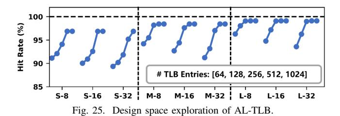
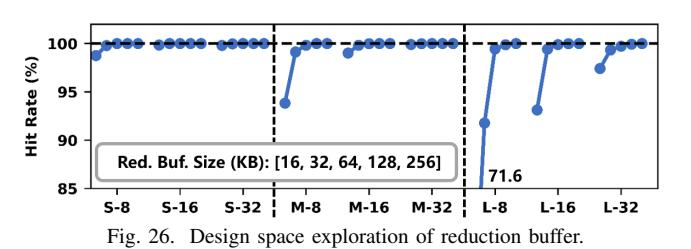
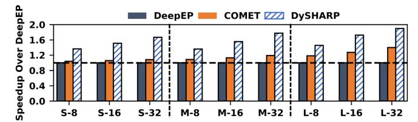
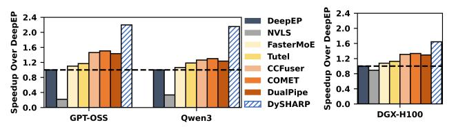

# *D. Hardware Overhead*

We evaluate the hardware overhead of our architectural supports under TSMC 12nm technology [51]. To evaluate hardware overhead, we implement our components in RTL and synthesize them using Synopsys Design Compiler® [48]. SRAM macros are generated with the Memory Compiler of library [51]. The tables are implemented as 16-bank dual-port SRAM (1R1W) to meet DySHARP's concurrent read/write requirements. For the switch, by building upon the datapath of existing NVLS, our extension is a lightweight control

logic for routing calculation. This enhancement negligibly adds only one cycle to the datapath, without affecting data forwarding. Area overhead of this logic is less than 0.01mm2 . This overhead is less than 0.1% of NVSwitch die [13], [19]. For the GPU, the additional architectural supports require only 0.198mm2 , which is about 0.024% of the H100 GPU die area. The evaluation indicates that our architectural supports are feasible for hardware implementation.

We further explore design space of DySHARP by evaluating hit rates of AL-TLB in Hub and reduction buffer in switch under different sizes. For reduction buffer, a hit means a packet does not trigger eviction. Fig. 25 and 26 show the hit rates of AL-TLB and reduction buffer when varying the sizes. It indicates that 512-entry is a sweet spot for AL-TLB, which can achieve near-ideal hit rates while maintaining small overhead. For the reduction buffer, the sweet spot is 64KB, guaranteeing almost no eviction that increases traffic.

## VII. DISCUSSION

## *A. Evaluation of End-to-end Inference*

We further evaluate DySHARP for end-to-end inference, covering both prefill and decode stages. Prefill, like training, is communication-intensive and benefits from DySHARP traffic reduction. Although decode is memory-bound with small batches, its latency sensitivity makes DySHARP's fine-grained synchronization and reduced software control cost impactful. Results in Fig. 27, where LLM decodes 512 tokens after prefill, confirm DySHARP's superior inference performance.

## *B. Evaluation on Other Models and Other Platform*

| Name         | Hidden Size | MoE Hidden Size | Attention Heads | Sequence Length | Number of Experts | topk |
|--------------|----------------|--------------------|--------------------|--------------------|----------------------|------|
| GPT-OSS-120B | 2880           | 2880               | 64                 | 4096               | 64                   | 4    |
| Qwen3-235B   | 4096           | 1536               | 128                | 4096               | 128                  | 8    |

We evaluate DySHARP for other leading MoE models, including GPT-OSS-120B [40] and Qwen3-235B [55], as shown in table. Results in Fig. 28 demonstrate DySHARP's superior end-to-end performance on diverse models.

We evaluate on GH200 NVL32 because single-node systems integrate an increasing number of GPUs [33], [36], [39] [33],

Fig. 27. End-to-end speedup for inference.

Fig. 28. Evaluation of other leading MoE models.

Fig. 29. Evaluation on other platform.

[36], [39]. DySHARP also applies to regular small nodes like DGX-H100 (8 GPUs). We perform end-to-end evaluation of Large-8 configuration on DGX-H100. Results in Fig. 29 confirm DySHARP's advantage on regular small nodes.

## *C. Study on Tile Size Choice for Kernel Fusion*

Token-centric kernel fusion adopts the synchronization tile size of 128, the minimum granularity that preserves computation utilization, as it matches the GEMM tile size of 128. A smaller tile would force a suboptimal GEMM tile size and increase synchronization overhead, while a larger tile would coarsen overlap. We validate this on the Small-8 configuration, where smaller models are more sensitive to synchronization granularity. Results in Fig. 30 confirm our choice.

# *D. Hardware Overhead*

We evaluate the hardware overhead of our architectural supports under TSMC 12nm technology [51]. To evaluate hardware overhead, we implement our components in RTL and synthesize them using Synopsys Design Compiler® [48]. SRAM macros are generated with the Memory Compiler of library [51]. The tables are implemented as 16-bank dual-port SRAM (1R1W) to meet DySHARP's concurrent read/write requirements. For the switch, by building upon the datapath of existing NVLS, our extension is a lightweight control

logic for routing calculation. This enhancement negligibly adds only one cycle to the datapath, without affecting data forwarding. Area overhead of this logic is less than 0.01mm2 . This overhead is less than 0.1% of NVSwitch die [13], [19]. For the GPU, the additional architectural supports require only 0.198mm2 , which is about 0.024% of the H100 GPU die area. The evaluation indicates that our architectural supports are feasible for hardware implementation.

We further explore design space of DySHARP by evaluating hit rates of AL-TLB in Hub and reduction buffer in switch under different sizes. For reduction buffer, a hit means a packet does not trigger eviction. Fig. 25 and 26 show the hit rates of AL-TLB and reduction buffer when varying the sizes. It indicates that 512-entry is a sweet spot for AL-TLB, which can achieve near-ideal hit rates while maintaining small overhead. For the reduction buffer, the sweet spot is 64KB, guaranteeing almost no eviction that increases traffic.

## VII. DISCUSSION

## *A. Evaluation of End-to-end Inference*

We further evaluate DySHARP for end-to-end inference, covering both prefill and decode stages. Prefill, like training, is communication-intensive and benefits from DySHARP traffic reduction. Although decode is memory-bound with small batches, its latency sensitivity makes DySHARP's fine-grained synchronization and reduced software control cost impactful. Results in Fig. 27, where LLM decodes 512 tokens after prefill, confirm DySHARP's superior inference performance.

## *B. Evaluation on Other Models and Other Platform*

| Name         | Hidden Size | MoE Hidden Size | Attention Heads | Sequence Length | Number of Experts | topk |
|--------------|----------------|--------------------|--------------------|--------------------|----------------------|------|
| GPT-OSS-120B | 2880           | 2880               | 64                 | 4096               | 64                   | 4    |
| Qwen3-235B   | 4096           | 1536               | 128                | 4096               | 128                  | 8    |

We evaluate DySHARP for other leading MoE models, including GPT-OSS-120B [40] and Qwen3-235B [55], as shown in table. Results in Fig. 28 demonstrate DySHARP's superior end-to-end performance on diverse models.

We evaluate on GH200 NVL32 because single-node systems integrate an increasing number of GPUs [33], [36], [39] [33],

Fig. 27. End-to-end speedup for inference.

Fig. 28. Evaluation of other leading MoE models.

Fig. 29. Evaluation on other platform.

[36], [39]. DySHARP also applies to regular small nodes like DGX-H100 (8 GPUs). We perform end-to-end evaluation of Large-8 configuration on DGX-H100. Results in Fig. 29 confirm DySHARP's advantage on regular small nodes.

## *C. Study on Tile Size Choice for Kernel Fusion*

Token-centric kernel fusion adopts the synchronization tile size of 128, the minimum granularity that preserves computation utilization, as it matches the GEMM tile size of 128. A smaller tile would force a suboptimal GEMM tile size and increase synchronization overhead, while a larger tile would coarsen overlap. We validate this on the Small-8 configuration, where smaller models are more sensitive to synchronization granularity. Results in Fig. 30 confirm our choice.

