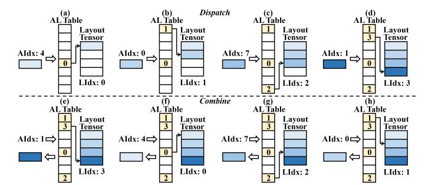

# *D. Microarchitecture Extension*

As illustrated in Fig. 9, DySHARP introduces three components for the two design points, as introduced in Sec. III-A.

- For the customized packet, 1) source GPU1 includes new LSU design in SM to support target fetching for dynamic multimem instructions. 2) Switch enhances the forwarding and reduction, aware of the target list.
- For the index managing, 3) destination GPU introduces a hardware memory manager in the Hub. This manager performs multimem-virtual translation through mapping algebraic index to layout index locally within each GPU.
- *1) Architectural Support in Source GPU:* We extend the SM's LSU to fetch the target expert list and assemble dymultimem requests. Unlike regular memory instructions that read operands and immediately issue, a dymultimem.\* first fetches its targets from memory. LSU uses target count and base pointer encoded in instruction to read the contiguous target list from shared or global memory. As shown in Fig. 9, we introduce a small *MultimemQ* separate from original LSQ to hold instructions that have issued their target fetching request. Once target list is ready, LSU issues the complete request packet to on-chip network and then to inter-GPU network.
- *2) Architectural Support in Switch:* Within the switch, the *Route* module is augmented to forward dymultimem packets by their targets as shown in Fig. 9. For each target i, the output port is computed as OutPorti = Targeti /#expert per GPU. Switch replicates the request per output port and trims each replica to include only the targets to the port. For dymultimem.ld\_reduce (Combine), the Reduction Logic records the number of targets associated with the request and decrements this counter as partial responses arrive; completion is detected when it reaches zero, which then returns the reduced result to the source GPU. This target-aware replication and completion tracking match the packet format in Sec. III-B.

Fig. 10. Illustration of hardware memory manager workflow for Dispatch and Combine, where AIdx is algebraic block index and LIdx is layout block index. Manager allocates a layout block to a new algebraic block during Dispatch, and then shares the same algebraic-layout mapping for Combine.

*3) Architectural Support in Destination GPU:* At the destination GPU, a hardware memory manager performs algebraiclayout index mapping to translate the multimem address to a virtual address. This translation is performed before virtualphysical translation in GPU's Link MMU [14], [19].

This manager performs translation with the token vector as its granularity. *Dispatch:* During Dispatch, the manager dynamically allocates the layout block to the algebraic block for arriving tokens sent by dymultimem.st request packets. The layout block is allocated in an accumulative approach, ensuring the fragmented algebraic tensor to be stored in a dense layout tensor. *Combine:* During Combine, with the algebraiclayout mapping built during Dispatch, the manager translates the algebraic index of dymultimem.ld\_reduce request packets to the layout index to load the data as responses.

AL Management with AL Table. The hardware memory manager performs algebraic-layout mapping (AL) management with an AL Table in GPU's DRAM. AL Table is depicted in Fig. 9, with each entry representing a mapping from an algebraic block to a layout block. The entry contains a Valid field to indicate whether a layout block has been allocated for this algebraic block, and a LIdx field to store the layout block index (LIdx). To find the layout block for an algebraic block, algebraic block index (AIdx) is used to index AL Table to

1We call the GPU that a token resides on before Dispatch as source GPU of a token, and the GPU that a token is dispatched to as destination GPU.

get its LIdx. When multiple experts reside on a single GPU, the AL Table incorporates multiple independent sub-tables, with each sub-table separately managing the layout tensor of a distinct expert. Each AL Table entry is 4B (1b Valid + 31b LIdx), resulting in a table size of 4×nToken bytes. Even when processing 1M tokens, this consumption is only 4MB per layer, which is small compared to GPU DRAM (40s-100s GB).

Fig. 10 illustrates how AL management is performed. *Dispatch:* Fig. 10(a)-(d) show the layout block allocation during Dispatch. When a new token, with an unseen AIdx of the dymultimem.st request packet, arrives, the manager allocates the next available layout block for it. The mapping is registered by writing the LIdx to the AIdx-th entry of the AL Table. A counter is adopted to track the next available layout block. *Combine:* Fig. 10(e)-(h) show the algebraiclayout mapping used by the Combine. Because the expert computation does not change the token order, the algebraic-layout mapping is unchanged before and after expert computation, leading the Combine to share the same AL Table as Dispatch. When a dymultimem.ld\_reduce request packet arrives, the manager looks up the AL Table to get LIdx to be accessed.

MV Translation. Hardware memory manager performs multimem-virtual address (MV) translation based on algebraic-layout mapping. For multimem address MAddr, AIdx is (MAddr − MBase)/bsize. After AL management resolves LIdx, virtual address V Addr is V Base+ LIdx ∗ bsize + MAddr % bsize, where MBase and V Base are base addresses of multimem and virtual spaces. MV Translation is decoupled from AL management because Dispatch and Combine share the same algebraic-layout mapping but operate on different virtual address spaces.

AL TLB. Analogous to a conventional TLB, we introduce AL TLB to accelerate AL Table lookups. As shown in Fig. 9, AL TLB uses the concatenation of Expert ID and AIdx as its tag. Each entry stores this tag along with its AL Table entry. The tag section employs Content-Addressable Memory (CAM) for fast lookup. The resulting index from tag matching accesses the buffer section implemented with SRAM. During access, 1) on a hit, the LIdx is directly got. 2) On a miss, the AL Table is accessed and the entry is brought into the AL TLB. In our software implementation for Dispatch and Combine, elements within the same token vector are typically accessed contiguously. This access pattern has strong temporal locality for AL TLB lookups, enabling a high AL TLB hit rate.

*4) Architectural Workflow:* The workflow is depicted as Step 1 – 9 in Fig. 9. On source GPU, 1 a dymultimem instruction enters LSQ, then 2 LSU fetches its target list from memory and 3 issues complete dymultimem request through on-chip and inter-GPU networks to switch. 4 Switch computes output ports per target and forwards replicated packets. At destination GPU, 5 the request queries AL TLB: 6 on a hit, MV translation directly yields the virtual address; 7 on a miss, AL Table is accessed, with 8 new layout blocks allocated on first touch during Dispatch. 9 The translated

Fig. 11. Code snippet with our extended CUDA Runtime API. We extend the existing CUDA Runtime API to support dynamic multimem addressing.

virtual address is used for memory access: dymultimem.st writes data, and dymultimem.ld\_reduce reads and returns a response that is aggregated in the switch.

## *E. Runtime Extension*

We also extend the existing CUDA Runtime API for multicast object management to support the dynamic multimem addressing. Fig. 11 shows a CUDA code snippet utilizing the extended Runtime API. We introduce CUDymulticastObjectProp and its cuDyMulticastCreate function. The extension specifies the block size bsize and stage, the number of multimem region sets sharing the same algebraic-layout index mapping, as the vector length hsize and 2 (Dispatch and Combine), respectively. We also extend the API with cuDyMulticastBindAddr to specify the sizes of the multimem and virtual address space, as ntoken and nactive[expert] in our example. The nactive[expert] represents the number of tokens to be dispatched to a given expert. This value is determined by token routing, which is generated by gating network *before* Dispatch.

## IV. TOKEN-CENTRIC KERNEL FUSION

Building on dynamic multimem addressing, we address low bandwidth utilization under isolated dataflow scheduling, as introduced in Sec. II-D, with *token-centric kernel fusion*, which co-schedules the full *Dispatch-Computation-Combine* pipeline to co-execute Dispatch and Combine that have complementary communication patterns. Sec. IV-A outlines the key idea. Sec. IV-B2 presents a *token tracker* that captures finegrained, token-level dependencies across operators. Sec. IV-C introduces a *token-centric scheduler* that exploits these dependencies to pipeline operators, improving bandwidth utilization.

# *D. Microarchitecture Extension*

As illustrated in Fig. 9, DySHARP introduces three components for the two design points, as introduced in Sec. III-A.

- For the customized packet, 1) source GPU1 includes new LSU design in SM to support target fetching for dynamic multimem instructions. 2) Switch enhances the forwarding and reduction, aware of the target list.
- For the index managing, 3) destination GPU introduces a hardware memory manager in the Hub. This manager performs multimem-virtual translation through mapping algebraic index to layout index locally within each GPU.
- *1) Architectural Support in Source GPU:* We extend the SM's LSU to fetch the target expert list and assemble dymultimem requests. Unlike regular memory instructions that read operands and immediately issue, a dymultimem.\* first fetches its targets from memory. LSU uses target count and base pointer encoded in instruction to read the contiguous target list from shared or global memory. As shown in Fig. 9, we introduce a small *MultimemQ* separate from original LSQ to hold instructions that have issued their target fetching request. Once target list is ready, LSU issues the complete request packet to on-chip network and then to inter-GPU network.
- *2) Architectural Support in Switch:* Within the switch, the *Route* module is augmented to forward dymultimem packets by their targets as shown in Fig. 9. For each target i, the output port is computed as OutPorti = Targeti /#expert per GPU. Switch replicates the request per output port and trims each replica to include only the targets to the port. For dymultimem.ld\_reduce (Combine), the Reduction Logic records the number of targets associated with the request and decrements this counter as partial responses arrive; completion is detected when it reaches zero, which then returns the reduced result to the source GPU. This target-aware replication and completion tracking match the packet format in Sec. III-B.

Fig. 10. Illustration of hardware memory manager workflow for Dispatch and Combine, where AIdx is algebraic block index and LIdx is layout block index. Manager allocates a layout block to a new algebraic block during Dispatch, and then shares the same algebraic-layout mapping for Combine.

*3) Architectural Support in Destination GPU:* At the destination GPU, a hardware memory manager performs algebraiclayout index mapping to translate the multimem address to a virtual address. This translation is performed before virtualphysical translation in GPU's Link MMU [14], [19].

This manager performs translation with the token vector as its granularity. *Dispatch:* During Dispatch, the manager dynamically allocates the layout block to the algebraic block for arriving tokens sent by dymultimem.st request packets. The layout block is allocated in an accumulative approach, ensuring the fragmented algebraic tensor to be stored in a dense layout tensor. *Combine:* During Combine, with the algebraiclayout mapping built during Dispatch, the manager translates the algebraic index of dymultimem.ld\_reduce request packets to the layout index to load the data as responses.

AL Management with AL Table. The hardware memory manager performs algebraic-layout mapping (AL) management with an AL Table in GPU's DRAM. AL Table is depicted in Fig. 9, with each entry representing a mapping from an algebraic block to a layout block. The entry contains a Valid field to indicate whether a layout block has been allocated for this algebraic block, and a LIdx field to store the layout block index (LIdx). To find the layout block for an algebraic block, algebraic block index (AIdx) is used to index AL Table to

1We call the GPU that a token resides on before Dispatch as source GPU of a token, and the GPU that a token is dispatched to as destination GPU.

get its LIdx. When multiple experts reside on a single GPU, the AL Table incorporates multiple independent sub-tables, with each sub-table separately managing the layout tensor of a distinct expert. Each AL Table entry is 4B (1b Valid + 31b LIdx), resulting in a table size of 4×nToken bytes. Even when processing 1M tokens, this consumption is only 4MB per layer, which is small compared to GPU DRAM (40s-100s GB).

Fig. 10 illustrates how AL management is performed. *Dispatch:* Fig. 10(a)-(d) show the layout block allocation during Dispatch. When a new token, with an unseen AIdx of the dymultimem.st request packet, arrives, the manager allocates the next available layout block for it. The mapping is registered by writing the LIdx to the AIdx-th entry of the AL Table. A counter is adopted to track the next available layout block. *Combine:* Fig. 10(e)-(h) show the algebraiclayout mapping used by the Combine. Because the expert computation does not change the token order, the algebraic-layout mapping is unchanged before and after expert computation, leading the Combine to share the same AL Table as Dispatch. When a dymultimem.ld\_reduce request packet arrives, the manager looks up the AL Table to get LIdx to be accessed.

MV Translation. Hardware memory manager performs multimem-virtual address (MV) translation based on algebraic-layout mapping. For multimem address MAddr, AIdx is (MAddr − MBase)/bsize. After AL management resolves LIdx, virtual address V Addr is V Base+ LIdx ∗ bsize + MAddr % bsize, where MBase and V Base are base addresses of multimem and virtual spaces. MV Translation is decoupled from AL management because Dispatch and Combine share the same algebraic-layout mapping but operate on different virtual address spaces.

AL TLB. Analogous to a conventional TLB, we introduce AL TLB to accelerate AL Table lookups. As shown in Fig. 9, AL TLB uses the concatenation of Expert ID and AIdx as its tag. Each entry stores this tag along with its AL Table entry. The tag section employs Content-Addressable Memory (CAM) for fast lookup. The resulting index from tag matching accesses the buffer section implemented with SRAM. During access, 1) on a hit, the LIdx is directly got. 2) On a miss, the AL Table is accessed and the entry is brought into the AL TLB. In our software implementation for Dispatch and Combine, elements within the same token vector are typically accessed contiguously. This access pattern has strong temporal locality for AL TLB lookups, enabling a high AL TLB hit rate.

*4) Architectural Workflow:* The workflow is depicted as Step 1 – 9 in Fig. 9. On source GPU, 1 a dymultimem instruction enters LSQ, then 2 LSU fetches its target list from memory and 3 issues complete dymultimem request through on-chip and inter-GPU networks to switch. 4 Switch computes output ports per target and forwards replicated packets. At destination GPU, 5 the request queries AL TLB: 6 on a hit, MV translation directly yields the virtual address; 7 on a miss, AL Table is accessed, with 8 new layout blocks allocated on first touch during Dispatch. 9 The translated

Fig. 11. Code snippet with our extended CUDA Runtime API. We extend the existing CUDA Runtime API to support dynamic multimem addressing.

virtual address is used for memory access: dymultimem.st writes data, and dymultimem.ld\_reduce reads and returns a response that is aggregated in the switch.

## *E. Runtime Extension*

We also extend the existing CUDA Runtime API for multicast object management to support the dynamic multimem addressing. Fig. 11 shows a CUDA code snippet utilizing the extended Runtime API. We introduce CUDymulticastObjectProp and its cuDyMulticastCreate function. The extension specifies the block size bsize and stage, the number of multimem region sets sharing the same algebraic-layout index mapping, as the vector length hsize and 2 (Dispatch and Combine), respectively. We also extend the API with cuDyMulticastBindAddr to specify the sizes of the multimem and virtual address space, as ntoken and nactive[expert] in our example. The nactive[expert] represents the number of tokens to be dispatched to a given expert. This value is determined by token routing, which is generated by gating network *before* Dispatch.

## IV. TOKEN-CENTRIC KERNEL FUSION

Building on dynamic multimem addressing, we address low bandwidth utilization under isolated dataflow scheduling, as introduced in Sec. II-D, with *token-centric kernel fusion*, which co-schedules the full *Dispatch-Computation-Combine* pipeline to co-execute Dispatch and Combine that have complementary communication patterns. Sec. IV-A outlines the key idea. Sec. IV-B2 presents a *token tracker* that captures finegrained, token-level dependencies across operators. Sec. IV-C introduces a *token-centric scheduler* that exploits these dependencies to pipeline operators, improving bandwidth utilization.

