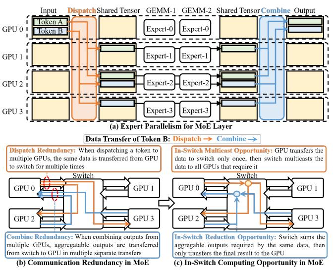
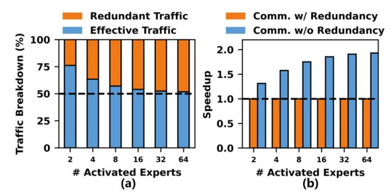

# I. INTRODUCTION

In recent years, the development of large language models has brought groundbreaking advances to many fields, including natural language processing [27], [52], computer vision [7], [25], and reasoning [6], [55]. To enhance model capabilities, the parameter count of models has been continuously scaling up [17], leading to a significant surge in the computational demands required for model training. To reduce these computational requirements, many leading large models, including DeepSeek [6], GPT [40], [41], Llama [27], Qwen [55], and Pangu [49], have opted to adopt Mixture-of-Experts (MoE) architecture [20] for model parameter scaling. Compared to the dense Transformer [52], MoE splits Feed-Forward Network (FFN) layer into multiple experts. Each token dynamically activates only a small subset of experts, enabling a substantial reduction in computational overhead.

With the ever-increasing computational and memory demands, *expert parallelism* (EP) [20] that distributes experts across GPUs is proposed to train MoE on multi-GPU systems. However, since a token may activate experts on remote GPUs, EP requires frequent inter-GPU communication, including *Dispatch* and *Combine* communication operators. This

Fig. 1. In-switch computing opportunity in MoE. MoE has significant redundant transfer that can be potentially addressed with in-switch computing.

frequent inter-GPU communication becomes a performance bottleneck in MoE execution [10], [12], [43], [46], [53], [57], consuming 50-80% execution time [57].

We observe that both the Dispatch and Combine involve a fundamental communication inefficiency that no existing work tackles: redundant data movement across GPUs. As illustrated in Fig. 1(b), 1) When dispatching a token to multiple GPUs, the same data is transferred from GPU to switch multiple times. 2) When combining outputs from multiple GPUs, aggregatable outputs required by the same data are transferred from switch to GPU as multiple separate transfers. Profiling DeepSeek-v3 on a simulated GH200 NVL32 [33] shows a near 50% communication redundancy out of total traffic.

In-switch computing, which has been integrated in NVLink/ NVSwitch interconnection [33], [36] through NVLink SHARP (NVLS) [19], can potentially address these redundancies through in-switch multicast and in-switch reduction, as illustrated in Fig. 1(c). 1) With in-switch multicast, the GPU can only transfer the data to the switch once, then the switch multicasts the data to all GPUs, eliminating the dispatch redundancy. 2) With in-switch reduction, the switch can sum aggregable outputs and only transfer the final result to the GPU, eliminating the combine redundancy. However, despite

\* Chen Zhang is the corresponding author.

the promising opportunity, the existing NVLS design is fundamentally static, restricted to the static collectives with regular communication patterns where the target sets are fixed and addresses are symmetric. Such a static NVLS design is thus incapable of accelerating dynamic operators with irregular communication patterns in MoE, with varying target sets and asymmetric addressing. A software-based workaround reinterpreting MoE communication as static collectives generates substantial useless traffic, which reaches 340% in our profiling, negating the benefits of in-switch computing.

This functionality gap motivates us to propose a *dynamic* in-switch computing solution to eliminate this communication redundancy in MoE. Achieving this requires not only communication primitives to reduce redundant traffic but also communication-aware scheduling to translate the reduction into actual speedup. However, designing such a solution faces two challenges: 1 The existing multi-GPU system design lacks top-down architectural support to enable the dynamic in-switch computing. 2 Isolated dataflow schedule, where Dispatch and Combine are executed in isolation, incurs directional bandwidth imbalance, causing low overall bandwidth utilization. To address these challenges, DySHARP proposes an integral solution encompassing both communication primitives and communication-aware scheduling: 1 Dynamic multimem addressing, a dynamic extension of NVLS's multimem addressing. Packet carries a single multimem address and a lightweight target list, with each GPU managing its memory locally. This supports irregularity of dynamic communication with high efficiency. 2 Token-centric kernel fusion to co-schedule operators. It utilizes token-level data dependency to pipeline the whole Dispatch-Computation-Combine chain. This token-paced pipeline merges complementary asymmetric communication patterns to improve bandwidth utilization. The two techniques work as an *integral* solution, where neither alone is sufficient: through dynamic multimem addressing, DySHARP eliminates nearly half of the total traffic, but the resulting reduction is inherently asymmetric between two directions, preventing it from directly translating into speedup. Token-centric kernel fusion resolves this asymmetry, translating the traffic reduction into actual speedup and achieving complete redundancy elimination. To the best of our knowledge, this is the first work to accelerate dynamic communication in MoE with in-switch computing.

In summary, this paper makes the following contributions:

- We conduct an in-depth analysis of the opportunity of leveraging in-switch computing to accelerate MoE's dynamic communication and the limitations of existing NVLS.
- We propose DySHARP, the first dynamic in-switch computing framework that introduces dynamic multimem addressing and token-centric kernel fusion to accelerate dynamic communication operators with fully exploited in-switch computing capabilities.
- We evaluate DySHARP extensively under diverse workload configurations on a simulated GH200 NVL32 systems, demonstrating up to 1.79× speedup compared to the SOTA MoE acceleration solution.

Fig. 2. The quantification of (a) redundant data transfer and (b) acceleration opportunity of redundancy elimination of DeepSeek-V3 on a simulated GH200 NVL32-like 32-GPU system. It demonstrates significant potential for eliminating redundancy with in-switch computing.

# I. INTRODUCTION

In recent years, the development of large language models has brought groundbreaking advances to many fields, including natural language processing [27], [52], computer vision [7], [25], and reasoning [6], [55]. To enhance model capabilities, the parameter count of models has been continuously scaling up [17], leading to a significant surge in the computational demands required for model training. To reduce these computational requirements, many leading large models, including DeepSeek [6], GPT [40], [41], Llama [27], Qwen [55], and Pangu [49], have opted to adopt Mixture-of-Experts (MoE) architecture [20] for model parameter scaling. Compared to the dense Transformer [52], MoE splits Feed-Forward Network (FFN) layer into multiple experts. Each token dynamically activates only a small subset of experts, enabling a substantial reduction in computational overhead.

With the ever-increasing computational and memory demands, *expert parallelism* (EP) [20] that distributes experts across GPUs is proposed to train MoE on multi-GPU systems. However, since a token may activate experts on remote GPUs, EP requires frequent inter-GPU communication, including *Dispatch* and *Combine* communication operators. This

Fig. 1. In-switch computing opportunity in MoE. MoE has significant redundant transfer that can be potentially addressed with in-switch computing.

frequent inter-GPU communication becomes a performance bottleneck in MoE execution [10], [12], [43], [46], [53], [57], consuming 50-80% execution time [57].

We observe that both the Dispatch and Combine involve a fundamental communication inefficiency that no existing work tackles: redundant data movement across GPUs. As illustrated in Fig. 1(b), 1) When dispatching a token to multiple GPUs, the same data is transferred from GPU to switch multiple times. 2) When combining outputs from multiple GPUs, aggregatable outputs required by the same data are transferred from switch to GPU as multiple separate transfers. Profiling DeepSeek-v3 on a simulated GH200 NVL32 [33] shows a near 50% communication redundancy out of total traffic.

In-switch computing, which has been integrated in NVLink/ NVSwitch interconnection [33], [36] through NVLink SHARP (NVLS) [19], can potentially address these redundancies through in-switch multicast and in-switch reduction, as illustrated in Fig. 1(c). 1) With in-switch multicast, the GPU can only transfer the data to the switch once, then the switch multicasts the data to all GPUs, eliminating the dispatch redundancy. 2) With in-switch reduction, the switch can sum aggregable outputs and only transfer the final result to the GPU, eliminating the combine redundancy. However, despite

\* Chen Zhang is the corresponding author.

the promising opportunity, the existing NVLS design is fundamentally static, restricted to the static collectives with regular communication patterns where the target sets are fixed and addresses are symmetric. Such a static NVLS design is thus incapable of accelerating dynamic operators with irregular communication patterns in MoE, with varying target sets and asymmetric addressing. A software-based workaround reinterpreting MoE communication as static collectives generates substantial useless traffic, which reaches 340% in our profiling, negating the benefits of in-switch computing.

This functionality gap motivates us to propose a *dynamic* in-switch computing solution to eliminate this communication redundancy in MoE. Achieving this requires not only communication primitives to reduce redundant traffic but also communication-aware scheduling to translate the reduction into actual speedup. However, designing such a solution faces two challenges: 1 The existing multi-GPU system design lacks top-down architectural support to enable the dynamic in-switch computing. 2 Isolated dataflow schedule, where Dispatch and Combine are executed in isolation, incurs directional bandwidth imbalance, causing low overall bandwidth utilization. To address these challenges, DySHARP proposes an integral solution encompassing both communication primitives and communication-aware scheduling: 1 Dynamic multimem addressing, a dynamic extension of NVLS's multimem addressing. Packet carries a single multimem address and a lightweight target list, with each GPU managing its memory locally. This supports irregularity of dynamic communication with high efficiency. 2 Token-centric kernel fusion to co-schedule operators. It utilizes token-level data dependency to pipeline the whole Dispatch-Computation-Combine chain. This token-paced pipeline merges complementary asymmetric communication patterns to improve bandwidth utilization. The two techniques work as an *integral* solution, where neither alone is sufficient: through dynamic multimem addressing, DySHARP eliminates nearly half of the total traffic, but the resulting reduction is inherently asymmetric between two directions, preventing it from directly translating into speedup. Token-centric kernel fusion resolves this asymmetry, translating the traffic reduction into actual speedup and achieving complete redundancy elimination. To the best of our knowledge, this is the first work to accelerate dynamic communication in MoE with in-switch computing.

In summary, this paper makes the following contributions:

- We conduct an in-depth analysis of the opportunity of leveraging in-switch computing to accelerate MoE's dynamic communication and the limitations of existing NVLS.
- We propose DySHARP, the first dynamic in-switch computing framework that introduces dynamic multimem addressing and token-centric kernel fusion to accelerate dynamic communication operators with fully exploited in-switch computing capabilities.
- We evaluate DySHARP extensively under diverse workload configurations on a simulated GH200 NVL32 systems, demonstrating up to 1.79× speedup compared to the SOTA MoE acceleration solution.

Fig. 2. The quantification of (a) redundant data transfer and (b) acceleration opportunity of redundancy elimination of DeepSeek-V3 on a simulated GH200 NVL32-like 32-GPU system. It demonstrates significant potential for eliminating redundancy with in-switch computing.

