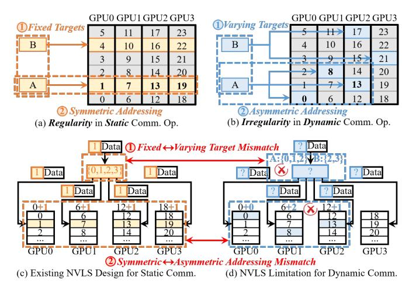

# II. BACKGROUND AND MOTIVATION

## *A. MoE Structure and Expert Parallelism*

MoE layer consists of multiple small FFNs each referred to as an expert, where each token only dynamically activates topk experts selected by the gate network for computation, reducing computational cost. As illustrated in Fig. 1(a), each token is assigned to topk experts, the assigned experts execute FFN computations (GEMM-1 and GEMM-2), and the topk outputs are aggregated to produce the final result.

To train MoE on multi-GPU systems, expert parallelism (EP) distributes experts across GPUs, introducing two inter-GPU communication operations as shown in Fig. 1(a): *Dispatch* sends tokens to GPUs hosting their activated experts, and *Combine* aggregates expert outputs back. This frequent communication becomes a performance bottleneck, accounting for 50-80% of MoE layer execution [57]. Our experiment shows communication consumes 70.4% of MoE layer execution in DeepSeek-V3 on simulated GH200 NVL32. Newer GPUs like NVIDIA Blackwell [35] and Rubin [39] are expected to see computational capacity outpace growth in communication, exacerbating this ratio.

## *B. Communication Redundancy in MoE*

A fundamental inefficiency of MoE communication lies in the large amount of redundant data movement across GPUs. In Dispatch, a single token often needs to reach multiple GPUs, where the same data is transmitted multiple times from source GPU to switch. For example, in Fig. 1(b), Token B on GPU0 must be sent to GPU 2 and 3, causing two identical but separate transfers over the GPU0-switch link. Similarly, in Combine, aggregatable expert outputs of a token from multiple GPUs are individually sent back, creating multiple separate transfers from switch to source GPU that the token originally resides. Intermediate outputs from both GPU 2 and 3 contribute to the output of Token B, causing two aggregatable but separate transfers over the switch-GPU0 link. Fig. 2(a) quantifies the redundant data transfer of DeepSeek-v3 with different numbers of activated experts on a 32-GPU system similar to the GH200 NVL32 [33]. It shows that there is significant redundant data transfer that accounts for nearly 50% of the total traffic when the number of activated experts is over 8.

Fig. 3. Communication pattern and NVLS applicability for static and dynamic communications. NVLS's customization for the regularity of static collectives leads to limitations for supporting dynamic communications with irregularity.

Prior works [10], [12], [20], [30], [46], [53], [57], [59] mitigate MoE's communication overhead through optimized libraries or computation-communication overlap, but none tackle the fundamental problem: redundant transfers of identical or aggregatable data.

# II. BACKGROUND AND MOTIVATION

## *A. MoE Structure and Expert Parallelism*

MoE layer consists of multiple small FFNs each referred to as an expert, where each token only dynamically activates topk experts selected by the gate network for computation, reducing computational cost. As illustrated in Fig. 1(a), each token is assigned to topk experts, the assigned experts execute FFN computations (GEMM-1 and GEMM-2), and the topk outputs are aggregated to produce the final result.

To train MoE on multi-GPU systems, expert parallelism (EP) distributes experts across GPUs, introducing two inter-GPU communication operations as shown in Fig. 1(a): *Dispatch* sends tokens to GPUs hosting their activated experts, and *Combine* aggregates expert outputs back. This frequent communication becomes a performance bottleneck, accounting for 50-80% of MoE layer execution [57]. Our experiment shows communication consumes 70.4% of MoE layer execution in DeepSeek-V3 on simulated GH200 NVL32. Newer GPUs like NVIDIA Blackwell [35] and Rubin [39] are expected to see computational capacity outpace growth in communication, exacerbating this ratio.

## *B. Communication Redundancy in MoE*

A fundamental inefficiency of MoE communication lies in the large amount of redundant data movement across GPUs. In Dispatch, a single token often needs to reach multiple GPUs, where the same data is transmitted multiple times from source GPU to switch. For example, in Fig. 1(b), Token B on GPU0 must be sent to GPU 2 and 3, causing two identical but separate transfers over the GPU0-switch link. Similarly, in Combine, aggregatable expert outputs of a token from multiple GPUs are individually sent back, creating multiple separate transfers from switch to source GPU that the token originally resides. Intermediate outputs from both GPU 2 and 3 contribute to the output of Token B, causing two aggregatable but separate transfers over the switch-GPU0 link. Fig. 2(a) quantifies the redundant data transfer of DeepSeek-v3 with different numbers of activated experts on a 32-GPU system similar to the GH200 NVL32 [33]. It shows that there is significant redundant data transfer that accounts for nearly 50% of the total traffic when the number of activated experts is over 8.

Fig. 3. Communication pattern and NVLS applicability for static and dynamic communications. NVLS's customization for the regularity of static collectives leads to limitations for supporting dynamic communications with irregularity.

Prior works [10], [12], [20], [30], [46], [53], [57], [59] mitigate MoE's communication overhead through optimized libraries or computation-communication overlap, but none tackle the fundamental problem: redundant transfers of identical or aggregatable data.

