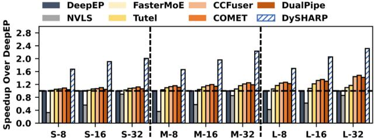
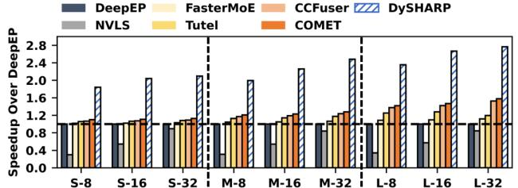
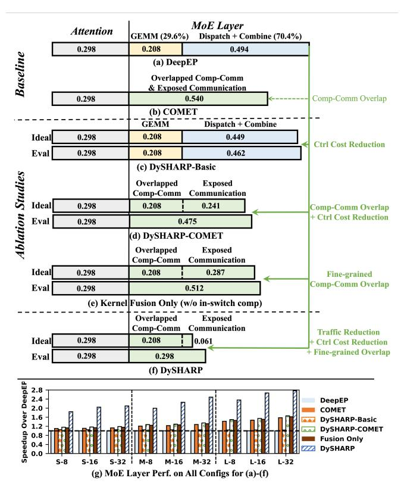
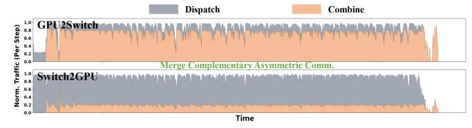

# VI. EXPERIMENTAL RESULTS

## A. End-to-End and MoE-Layer Performance

1) End-to-End and MoE-Layer Speedup: Fig. 14 presents end-to-end model training speedup achieved by DySHARP compared with baselines across various model configurations and topk. This evaluation includes both attention and MoE layer, and covers both forward and backward propagation. We denote configuration Config with topk = k as Config-k. DySHARP achieves speedups of up to  $2.31\times$ ,  $5.12\times$ ,  $2.11\times$ ,  $1.98\times$ ,  $1.85\times$ ,  $1.79\times$ , and  $1.88\times$  over DeepEP, NVLS, Faster-MoE, Tutel, CCFuser, COMET, and DualPipe respectively,

Fig. 14. End-to-end model training speedup across different configurations.

Fig. 15. MoE layer speedup across different model configurations. (DualPipe is excluded because it is model-level cross-layer optimization.)

with geometric means of 1.93×, 3.38×, 1.84×, 1.72×, 1.63×, 1.59×, and 1.66×. Fig. 15 further isolates performance comparison for communication-intensive MoE layer, encompassing Dispatch-Computation-Combine. DualPipe is excluded because it is model-level cross-layer optimization. Compared with other six baselines, DySHARP achieves speedups of up to 2.77×, 6.93×, 2.48×, 2.32×, 2.01×, and 1.94×, respectively, with geometric means of 2.26×, 4.25×, 2.14×, 1.96×, 1.84×, and 1.78×. This demonstrates DySHARP's significant performance advantage, attributed to dynamic multimem addressing for redundant data transfer elimination and token-centric kernel fusion to merge asymmetric communication.

*2) Discussions and Analysis:* DySHARP outperforms DeepEP, FasterMoE, Tutel, CCFuser, COMET, and DualPipe primarily by eliminating redundant data transfers and reducing memory management overhead. Unlike these baselines with communication redundancy discussed in Sec. II-B, DySHARP leverages dynamic in-switch multicast and reduction to eliminate this redundancy, boosting performance. It also avoids software-controlled memory management and associated metadata transmission, e.g., token arrival counts, further reducing overhead. Fine-grained computation–communication overlap is also an advantage over baselines.

DySHARP's performance advantage over the existing inswitch computing solution, NVLS, is from eliminating useless data transfers. This approach of replacing dynamic communication with static counterparts incurs large amounts of useless data transfer. In contrast, DySHARP can natively support dynamic communication without useless transfer.

*3) Ablation Studies for Speedup Source Analysis:* We quantitatively validate the speedup sources analyzed in Fig. 4(a)–(f). In addition to DeepEP, COMET, and DySHARP, we further implement three variants for ablation study: 1) DySHARP-Basic (Fig. 4(c)): dynamic multimem addressing without computation–communication overlap; 2) DySHARP-COMET (Fig. 4(d)): DySHARP-Basic with COMET's overlap; and 3) kernel fusion only (Fig. 4(e)): token-centric fusion

Fig. 16. Quantitative time breakdown (normalized to DeepEP) and ablation studies on official DeepSeek-V3 configuration (L-8), validating Fig. 4(a)-(f).

Fig. 17. Illustration of merging complementary asymmetric communication. without dynamic multimem addressing.

Fig. 16(a)–(f) shows the time breakdown on DeepSeek-V3 (Large-8). In Fig. 16(a)(b), DeepEP and COMET exhibit a severe communication bottleneck. With dynamic multimem addressing, DySHARP-Basic and DySHARP-COMET reduce traffic but do not directly lead to speedup as shown in Fig. 16(c)(d). This problem is due to asymmetric traffic reduction between the two directions. As an integral solution, DySHARP in Fig. 16(f) utilizes token-centric kernel fusion to merge complementary asymmetric communication by coexecuting Dispatch and Combine concurrently, transforming traffic reduction enabled by dynamic multimem addressing into speedup. This merging of complementary communication can be observed in Fig. 17. Moreover, kernel fusion *alone* in Fig. 16(e) *cannot* provide speedup over the SOTA baseline COMET, it must be integrated together with in-switch computing to unlock full potential. We also evaluate on all configurations, with results shown in Fig. 16(g).

# VI. EXPERIMENTAL RESULTS

## A. End-to-End and MoE-Layer Performance

1) End-to-End and MoE-Layer Speedup: Fig. 14 presents end-to-end model training speedup achieved by DySHARP compared with baselines across various model configurations and topk. This evaluation includes both attention and MoE layer, and covers both forward and backward propagation. We denote configuration Config with topk = k as Config-k. DySHARP achieves speedups of up to  $2.31\times$ ,  $5.12\times$ ,  $2.11\times$ ,  $1.98\times$ ,  $1.85\times$ ,  $1.79\times$ , and  $1.88\times$  over DeepEP, NVLS, Faster-MoE, Tutel, CCFuser, COMET, and DualPipe respectively,

Fig. 14. End-to-end model training speedup across different configurations.

Fig. 15. MoE layer speedup across different model configurations. (DualPipe is excluded because it is model-level cross-layer optimization.)

with geometric means of 1.93×, 3.38×, 1.84×, 1.72×, 1.63×, 1.59×, and 1.66×. Fig. 15 further isolates performance comparison for communication-intensive MoE layer, encompassing Dispatch-Computation-Combine. DualPipe is excluded because it is model-level cross-layer optimization. Compared with other six baselines, DySHARP achieves speedups of up to 2.77×, 6.93×, 2.48×, 2.32×, 2.01×, and 1.94×, respectively, with geometric means of 2.26×, 4.25×, 2.14×, 1.96×, 1.84×, and 1.78×. This demonstrates DySHARP's significant performance advantage, attributed to dynamic multimem addressing for redundant data transfer elimination and token-centric kernel fusion to merge asymmetric communication.

*2) Discussions and Analysis:* DySHARP outperforms DeepEP, FasterMoE, Tutel, CCFuser, COMET, and DualPipe primarily by eliminating redundant data transfers and reducing memory management overhead. Unlike these baselines with communication redundancy discussed in Sec. II-B, DySHARP leverages dynamic in-switch multicast and reduction to eliminate this redundancy, boosting performance. It also avoids software-controlled memory management and associated metadata transmission, e.g., token arrival counts, further reducing overhead. Fine-grained computation–communication overlap is also an advantage over baselines.

DySHARP's performance advantage over the existing inswitch computing solution, NVLS, is from eliminating useless data transfers. This approach of replacing dynamic communication with static counterparts incurs large amounts of useless data transfer. In contrast, DySHARP can natively support dynamic communication without useless transfer.

*3) Ablation Studies for Speedup Source Analysis:* We quantitatively validate the speedup sources analyzed in Fig. 4(a)–(f). In addition to DeepEP, COMET, and DySHARP, we further implement three variants for ablation study: 1) DySHARP-Basic (Fig. 4(c)): dynamic multimem addressing without computation–communication overlap; 2) DySHARP-COMET (Fig. 4(d)): DySHARP-Basic with COMET's overlap; and 3) kernel fusion only (Fig. 4(e)): token-centric fusion

Fig. 16. Quantitative time breakdown (normalized to DeepEP) and ablation studies on official DeepSeek-V3 configuration (L-8), validating Fig. 4(a)-(f).

Fig. 17. Illustration of merging complementary asymmetric communication. without dynamic multimem addressing.

Fig. 16(a)–(f) shows the time breakdown on DeepSeek-V3 (Large-8). In Fig. 16(a)(b), DeepEP and COMET exhibit a severe communication bottleneck. With dynamic multimem addressing, DySHARP-Basic and DySHARP-COMET reduce traffic but do not directly lead to speedup as shown in Fig. 16(c)(d). This problem is due to asymmetric traffic reduction between the two directions. As an integral solution, DySHARP in Fig. 16(f) utilizes token-centric kernel fusion to merge complementary asymmetric communication by coexecuting Dispatch and Combine concurrently, transforming traffic reduction enabled by dynamic multimem addressing into speedup. This merging of complementary communication can be observed in Fig. 17. Moreover, kernel fusion *alone* in Fig. 16(e) *cannot* provide speedup over the SOTA baseline COMET, it must be integrated together with in-switch computing to unlock full potential. We also evaluate on all configurations, with results shown in Fig. 16(g).

