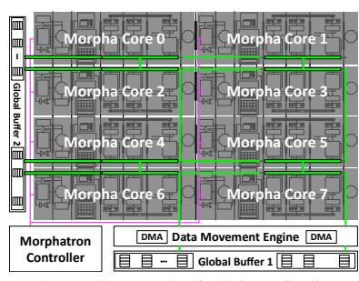
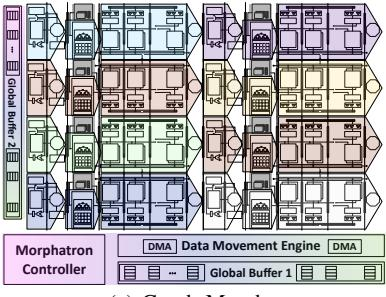
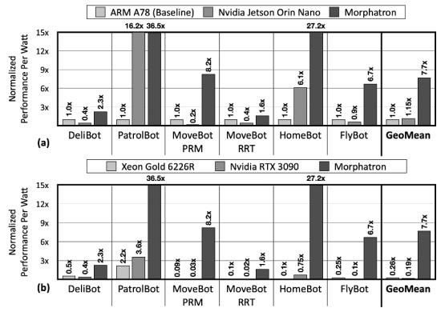
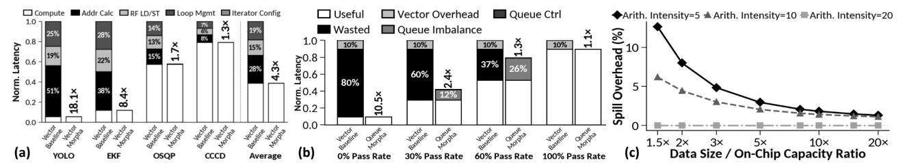
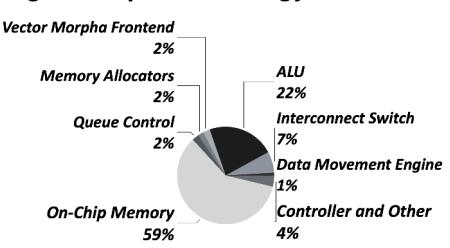
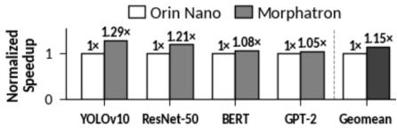

# C. Morpha Core Microarchitecture Design for Queues

We propose a block-structured loop-based SIMD ISA (§IV-B) that elevates queues to first-class, hardware-managed operands to enable the queue-centric execution model. The architecture manages a set of queues, the total count of which is a microarchitecture parameter (256 in the evaluated design), and the queue ID is encoded in the instruction word. The number of sub-queues is determined by the number of execution stages,

since each stage operates on a distinct sub-queue. To adhere to the SIMD execution, all sub-queues belonging to the same logical queue share a common queue ID. Operands are associated directly with these queues through explicitly encoded queue ID in the instruction word: source values may be poped or peeked, while destination values may be pushed. For example, the following code adds "1" to every element of a queue.

```
Q_LOOP_UNTIL_EMPTY, Q.ID[#0], 1:
 ADD, Q.ID[#1].PUSH, Q.ID[#0].POP, 0x01
```

While the ADD instruction pops the head of the queue "#0", adds the hexadecimal literal "#0x01", and pushes the result into the queue "#1", the Q\_LOOP\_UNTIL\_EMPTY instruction repeatedly issues this addition. As Fig. 2 illustrates, each Morpha Core execution stage pairs an ALU, a scratchpad sub-bank, and a Queue Manager that manages sub-queues per SIMD execution semantics discussed in §III-B. Thus, when this ADD instruction reaches an execution stage, the stage's Queue Manager uses the queue ID to index its local queue table, which stores the up-to-date state of each active sub-queue, including its head address, tail address, and size. On a pop or peek, the Queue Manager uses the head pointer to access the scratchpad sub-bank and feed the corresponding operand directly to the ALU; on a push, it uses the tail pointer to place the result and then advances the tail accordingly. The Queue Manager is implemented efficiently as combinational logic, adding minimal area and latency to the pipeline (§VI-C). This registerless pipeline design eliminates both the load/store address calculation and explicit register-file loads that are essential in conventional vector execution. Besides, it alleviates the overhead of instructions that maintain queue head/tail pointers and check for empty/full that need to be executed repeatedly. In addition, decoupling queue management logic (Queue Manager) from the data storage itself (scratchpad sub-banks) enables the scratchpad to be repurposed in other morphas (e.g., a systolic weight buffer), which in turn enables dynamic polymorphic acceleration on the same substrate (§IV-A).

In-pipeline dynamic memory allocation. Because queues are dynamically sized, the scratchpad storage allocated to each subqueue must grow and shrink at the same speed as the SIMD execution. Relying on the operating system or runtime would curtail performance and negate the benefits of specialization. Thus, Morpha Core integrates low-overhead buddy tree memory allocators [70, 71] directly as an integral part of the processor pipeline to allocate dynamic memory for queue-centric SIMD execution. As Fig. 2 depicts, the allocator is located at the third pipeline stage (Memory Allocation Stage), which allocates variable-length memory regions in units of 256-byte slices. This slice size is an architectural parameter that can be tuned to balance internal fragmentation and allocation efficiency. When an INIT\_Q, Q\_ID instruction reaches this stage, it triggers the allocator to activate the identified queue from the 256 architecturally available queues. Eight buddy trees, one per execution stage, allocate memory for the corresponding sub-queue partitions in parallel. The allocated slice indices, which may differ across execution stages, propagate along the pipeline registers

as the INIT\_Q, Q\_ID instruction flows through subsequent stages and is registered by each stage's Queue Manager under the same Q\_ID for SIMD execution. We choose buddy trees because, as Fig. 4(a) depicts, it only comprises a compact OR tree and require little metadata to track allocation status per memory slice (256 B). As such, it is practical and efficient to dedicate a buddy tree for each execution stage. In our design, which designates 8 KB for each sub-bank, each buddy tree has depth 6 with 32 leaves, connected through a 32-to-5 priority encoder that outputs the index of the first available slice. Operating in parallel, the eight trees enable deterministic one-cycle allocation.

In-pipeline memory management. While memory allocation is handled by the in-pipeline allocator, the allocator itself does not track which memory slice belongs to which queue. Instead, it delegates per-queue tracking of allocated slice to each execution stage's own dedicated Queue Manager. The distribution of the responsibility to each individual stage prevents complicating the allocator design and creating an imbalance across the pipeline stages. A naive, high-overhead approach would have been maintaining a table, mapping each Q\_ID to its list of allocated slices. Instead, we re-purpose the last word of each slice as a pointer to the next slice in the sub-queue. This naturally takes advantage of the FIFO ordering between slices in a queue to manage their linked-list behavior and dynamic sizing. As such, the third stage of the pipeline, which was in charge of the allocation, is relieved from this management task, and each execution stage manages its sub-queue with minimal overhead. Spills to off-chip memory. When a queue grows beyond the available on-chip memory, Morpha Core spills the queue to off-chip memory, retaining only the head slice on-chip and repurposing the last word as an off-chip pointer. For fair sharing of memory, a field in Q\_ID instruction sets a maximum number of on-chip slices per queue, after which spills are enforced. Stacks and sets. Stacks and sets share similar semantics with queues, but only differ in access order. Because our pipelined SIMD approach to queues does not change the operation order, we can support stacks and sets by extending the queue ISA. Queues as efficient control flow mechanism. Conventional vector processors manage control flow through predication, which leads to branch divergence and wasted computation. In contrast, Morpha Core uses queues as control flow structures, where execution is implicitly regulated through *data availability in sub-queues*. At the program level, the Q\_LOOP\_UNTIL\_EMPTY instruction, as shown in the earlier example, repeatedly issues a loop body that is managed entirely by the Morpha Core frontend (stage 1–3 in Fig. 2), eliminating software loop control. The program counter advances only after all Queue Managers report that their respective sub-queues are empty. At the data level, control flow (e.g., if-else) is implemented by selectively Pushing elements into different output queues based on the result of the condition. Each resulting queue contains the elements that satisfy (or do not satisfy) the condition.

## *D. Vector Processing Morpha*

While queues are central to many robotics workloads, contiguous tensors remain important. Rather than including






(a) Morphatron Physical Organization.

(b) Systolic Morpha.

(c) Graph Morpha.

Fig. 3: Accelerator polymorphism in Morphatron, a multi-core accelerator.

a dedicated vector processor, Morpha Core reshapes the same pipelined SIMD substrate into a vector morpha. Vector processing exhibits data-independent regular accesses that are strided, affine walks over data. These access patterns correspond to nested loops over multi-dimensional tensors, where each loop dimension contributes a stride in the resulting data address. To capture this structure directly in hardware, the Static Addressing Unit uses iterator tables that encode affine walks over tensors in memory, indexed by Vector\_ID and configured through SET\_ITER, SET\_STRIDE, and SET\_BASE\_ADDR. Compute instructions reference tensors by Vector\_ID, and the Static Addressing Unit generates the corresponding scratchpad addresses, which are carried with the instruction through the pipeline and used directly to access each execution stage's scratchpad sub-bank. The scratchpad sub-banks are reused as operand storage in this morpha, while queue management logic and the buddy tree allocator are power-gated. As a result, vector morpha avoids three sources of overhead in conventional load/store vector ISAs: address generation is handled directly by hardware iterators, operands are sourced from scratchpad storage without explicit registerfile transfers, and software loop control is replaced by the hardware loop-management unit in the Morpha Core frontend.

#### IV. MULTI-CORE MORPHATRON ARCHITECTURE

## A. Architecture Design for Morphatron

A two-dimensional grid of Morpha Cores constitutes the polymorphic Morphatron accelerator as illustrated in Fig. 3(a). Morphatron incarnates Accelerator Polymorphism by reshaping a single physical substrate into five instruction-driven, standalone execution morphas—queue-centric SIMD, multi-core graph, single-core tree traversal, vector, and systolic as Fig. 3(b-c) exemplify. Each morpha is specialized to a distinct computational structure in robotics and is guided by the access schemas and forms of parallelism identified in Section II. As such, Morphatron requires only the fixed routing patterns and control needed for these morphas, rather than the arbitrary spatial mappings required by spatially reconfigurable architectures.

**Morphatron Organization.** As highlighted by green in Fig. 3(a), all Morpha Cores are connected through a 32-byte-wide circuit-switched interconnect. A Data Movement Engine at the bottom provides DMA units, each connected to the interconnect through its own switch. Two global buffers


Fig. 4: Circuitry for (a) buddy tree allocator; (b) switch.

serve as additional on-chip storage and a data staging area. The Morphatron Controller (bottom left) manages morpha switching and synchronization through a dedicated 32-bit control network highlighted by pink. Below, we describe how this one physical design shape-shifts into different morphas. **Systolic morpha.** Morphatron uses all of its Morpha Core's pipelined execution stages to shape-shift into a systolic array. It

pipelined execution stages to shape-shift into a systolic array. It leverages the fact that each Morpha Core's pipeline of execution stages—an ALU coupled with a memory sub-bank per stage, connected through pipeline registers—is structurally identical to a row of a systolic array. A vertically aligned column of Morpha Cores therefore directly forms a systolic array, as shown in Fig. 3(b). Horizontal dataflow in systolic execution is carried by the existing pipeline registers, while the global interconnect handles inter-Morpha Core systolic traffic—both vertically between rows and horizontally between two Morpha Cores. Morpha Cores frontends and queue management logic are power-gated, with Global Buffer 2 serving as the input buffer and Global Buffer 1 as the output buffer.

Wider queue and vector morphas. Queue-centric SIMD and vector morphas can be extended horizontally by chaining Morpha Cores within the same row, reusing the same mechanism as systolic morpha without the vertical connection. This supports vector operations whose computational demand exceeds the resources of a single Morpha Core. In our evaluated 4×8 design, a row of four Morpha Cores forms a 32-wide SIMD pipeline. **Graph morpha.** Morphatron shape shifts to a standalone multi-core graph accelerator by leveraging Morpha Core's queue-centric SIMD execution. Graph algorithms in robotics, including breadth-first search and single-source shortest path, naturally fit the vertex-centric model that operates on queues. The vertex-centric model is a two-phase iterative process where each vertex first processes a queue of outgoing edges to produce updates for its neighbors, then, in a second phase, reads its inbound update queues from its predecessors to

update its own state. Both the per-vertex computation and the inter-vertex update propagation are operations over queues, which map directly to the Morpha Core's queue-centric SIMD execution. Section IV-B showcases a code implementation of the first phase in Morphatron's queue-based instructions.

In graph morpha, Morphatron operates in a MIMD over SIMD mode. As shown in Fig. 3(c), each Morpha Core executes its own SIMD instruction stream over an assigned subset of vertices, performing the per-vertex computation through its internal queue-centric SIMD pipeline. Cross-core vertex updates traverse the global interconnect. Because vertex-to-Morpha Core mapping is static, the interconnect's circuit-switched routing is sufficient. The Morpha Cores collectively execute the first phase, then they stand by while the interconnect propagates updates, then they re-engage for the second phase. Between phases when the Morpha Cores stand by, Morphatron effectively acts as a two-dimensional collection of memory sub-banks that the updates are written and propagated through—a property tree morpha exploits next. Tree morpha. Tree morpha targets irregular, data-dependent traversals that involve pointer chasing across memory structures, such as occupancy maps and nearest-neighbor search in robotics. These workloads exhibit minimal computation but require frequent, data-dependent memory accesses. To support this access pattern, the Morphatron shape-shift into a singlethreaded tree morpha. Only one Morpha Core actively performs computations—since tree traversal involves minimal compute while all other Morpha Cores power-gate their logic, keeping only their memory sub-banks and interconnect switches active. This configuration effectively transforms the entire Morphatron into a large memory available to a single compute core.

Programmable interconnect. Fig. 4(b) shows the switch for the programmable circuit-switched interconnect. Each switch has five ports (N, S, W, E, Local) with a 5×5 crossbar, an address decoder for graph/tree morpha routing, and configurable input buffers for contention—routes are configured per morpha, but concurrent accesses to the same output port still may arise. We added a minimal set of wires and muxes (L\_sys\_in/out) that resolve crossbar conflicts when systolic morpha requires multiple simultaneous port pairs. The complete static routing paths for systolic morpha are highlighted in green. Since Morphatron supports exactly four routing patterns, only two configuration bits determine the routing mode of the entire switch. The crossbar is the only physical datapath between the Morpha Cores, and there is no separate layer for different morphas. When shape shifting, the global Morphatron Controller uses the dedicated 32-bit control network to configure the switches according to the desired morpha while power-gating the unused ports.

Programmable data movement engine. Besides the interconnection for the on-chip data traffic, Morphatron harbors a programmable Data Movement Engine that uses multiple DMAs for off-chip memory traffic. To broadcast inputs to Morpha Cores and collect results from them, the Data Movement Engine implements two collective communication

| Instruct.Group                        | Instruct.Name/Bits | 31-27          | 26-23                            |                                     | 22-16                            |          |                      | 15-0                                         |  |                      |
|---------------------------------------|--------------------|----------------|----------------------------------|-------------------------------------|----------------------------------|----------|----------------------|----------------------------------------------|--|----------------------|
| For	Polymorphic                       | Sta*c	Config       |                |                                  | Opcode Type MorphraCore	Coord	(X,Y) |                                  |          |                      | Input	Port	Config	x	5                        |  |                      |
| Exec	Config                           | Dynamic	Config     |                |                                  | Opcode Type MorphraCore	Coord	(X,Y) |                                  |          |                      | Output	Port,	Lower_Range,	Upper_Range        |  |                      |
| For	Queue	Morpha                      | Queue	Opts         | Opcode Func*on |                                  |                                     |                                  | Queue	ID |                      | Config_bits	(Shared,	Instruc*on	Count,	etc.) |  |                      |
| For	Graph/Tree                        | Remote	Store       |                |                                  |                                     | Opcode ST Morpha	Config POP      |          |                      | Data/Queue	ID                                |  | Remote	Queue	ID/Addr |
| Morpha                                | Remote	Read        |                |                                  |                                     |                                  |          |                      | Opcode RD Morpha	Config PUSH Data/Queue	ID   |  | Remote	Queue	ID/Addr |
| For	Vector                            | Iterator	Config    |                |                                  |                                     | Opcode SET_LOOP Loop	ID Index	ID |          | Itera*on/Stride/Base |                                              |  |                      |
| Morpha                                | Loop	Control       |                |                                  | Opcode Loop	Start Loop	ID           |                                  | X        |                      |                                              |  |                      |
| For	Unified	Compute<br>across	Morphas | Namespace	Config   | Opcode SET_NS  |                                  |                                     | DST	Namespace                    |          |                      | SRC_1	Namespace                              |  | SRC_2	Namespace      |
|                                       | Compute	Opts       |                | Opcode Func*ons                  |                                     | DST	ID                           |          |                      | SRC_1	ID                                     |  | SRC_2	ID             |
| For	Data	Movement                     | DMA	Config         |                | Opcode SET_LOOP Loop	ID Index	ID |                                     |                                  |          |                      | Itera*on/Stride/Base                         |  |                      |
|                                       | Collec*ve	Config   |                | Opcode Collec*ve TYPE            |                                     |                                  |          | X                    |                                              |  |                      |
| For	SynchornizaDon                    | Synchronizaiton    |                | Opcode Func*ons Exec	Mode        |                                     |                                  | X        |                      |                                              |  |                      |

**Fig. 5: ISA for Polymorphic Acceleration.**

patterns: BROADCAST and COLUMN\_REDUCE. These collectives are realized through the control network that connects the Data Movement Engine to each interconnect switch to route control and synchronization signals, while reusing the existing data paths. The compiler issues barrier instructions to ensure the correct ordering of these operations. Moreover, the DMA units are programmed statically by the compiler to enact optimization such as prefetching and double-buffering for vector and systolic morphas. However, during queue-centric execution, the same DMA units are programmed dynamically using small instruction templates whose parameters are filled using queue statistics stored in the Queue Managers.

## *B. Instruction Set Architecture for Polymorphic Acceleration*

To expose polymorphic execution to the compiler and efficiently program Morphatron across diverse robotic applications, we propose an ISA that exposes polymorphic acceleration primitives. This ISA implements Accelerator Polymorphism at the instruction level through three coordinated mechanisms: (1) morpha selection and reconfiguration instructions, (2) queuebased SIMD instructions that elevate queues to first-class hardware-managed operands, and (3) a unified Namespace-ID operand model that unifies compute instructions across morphas without exposing morpha-specific storage layouts. Together, these mechanisms enable a single instruction stream to operate across different execution morphas while preserving a consistent programming model. Fig. 5 shows the 32-bit instruction formats. Each instruction contains an Opcode field that specifies its instruction group, with the remaining fields determining the instruction type. Below, we detail the key features of the ISA. Instructions for abstracting polymorphic execution. The first step in activating a morpha is to configure the participating Morpha Cores accordingly. A Polymorphic\_Exec\_Config instruction specifies the XY coordinates of each core and indicates which morpha it should enter. The next configuration step defines the connectivity among Morpha Cores for a given morpha. As shown in Fig. 5, this connectivity is programmed using two instructions depending on the target morpha. For Graph and Tree Morpha, where routing directions are dynamically determined by the data and its fixed mapping to Morpha Core, the dynamic morpha-configuration instruction (Fig. 5 row 1) programs the address comparators in the interconnect switch with the address ranges corresponding to each routing direction. For Systolic Morpha, Vector Morpha, and Queue Morpha, where the dataflow between Morpha Cores is deterministic, the

static morpha-configuration instruction (Fig. 5 row 2) programs cores and the crossbar direction bits in the circuit switches with fixed routes. The code below shows both instruction formats:

```
MORPHA_DYN_CONFIG,Graph,(2, 5),North,0000000,0000001
MORPHA_STATIC_CONFIG,Systolic,(3, 2),0001,0000,0010,0000,0000
```

The instructions specify the morpha type (e.g., Graph or Systolic), the X and the Y coordinates (e.g., (2, 5) in the dynamic case and (3, 2) in the static case) of the target Morpha Core. In the dynamic case, the remaining fields specify the output port being configured (e.g., North) along with the lower and upper bounds of the address range that should be routed to that port. In the static case, the remaining fields encode the crossbar direction bits in the fixed input-port order N, S, W, E, Local. Instructions for queue-centric SIMD execution. Besides polymorphic configuration, Morphatron establishes hardwaremanaged queues as first-class SIMD operands (§III). As Fig. 5 row 3 shows, the ISA exposes these queues through instructions that implement standard FIFO queue semantics, including POP\_Q, PEEK\_Q, PUSH\_Q, IS\_EMPTY\_Q, and SIZE\_Q, while abstracting away the hardware implementation details. The Function field specifies which exact queue functionality is intended. INIT\_Q and FREE\_Q (de)allocate queue instances, abstracting away all memory management and queue table updates in hardware. To support queue-driven control flow, the ISA provides Q\_CONDITIONAL\_PUSH, which conditionally pushes an element into a queue. Finally, the ISA includes Q\_LOOP\_UNTIL\_EMPTY, which indicates that the following block iterates over a queue and carries an INSTRUCTION\_COUNT field to inform the hardware of the loop-body size for efficient implementation. Below is a simplified queue-based implementation of the processEdges function in Single-Source Shortest Path algorithm.

```
1. processEdges(src_queue, offset_queue, edges_addr)
2 SYNC, exe_start, SCALAR
3. INIT_Q, q0, FALSE
4. INIT_Q, q1, FALSE
5. INIT_Q, q2, TRUE
6. ADD, edge_load_offset, offset_queue.PEEK(), edges_addr
7. LD_Q, q0, edge_load_offset, offset_queue.POP()
8. SYNC, code_block_end
9. SYNC, exe_start, SIMD
10. Q_LOOP_UNTIL_EMPTY, q0, 3
11. POP_Q, src_queue, src
12. ADD, new_val, src.val, q0.POP()
13. PUSH_Q, q1, (src.dst, new_val)
14. SYNC, code_block_end
15. Q_LOOP_UNTIL_EMPTY, q1, 1
16. REMOTE_STORE, graph, q1.POP(), q2
17. SYNC, exe_end
```

Instructions for graph and tree morphas. The example program illustrates how graph traversal can be expressed using queue instructions—initializing work queues (Lines 3–5), performing vertex-update computation (Lines 10–12), and buffering the resulting updates for the next phase (Line 13). Beyond local queue operations, Graph and Tree workloads also require communication across Morpha Cores. This is enabled by defining *shared* queues through the third field of INIT\_Q (Lines 3–5) and by the REMOTE\_STORE/READ (Fig. 5 rows 4 and 5) instructions (Line 16), which specify the data to

be transferred and the target shared queue instance. Combined with the dynamic morpha-configuration instructions described above, these extensions enable the same queue-based execution model to support both graph and tree workloads.

Unified instructions for compute across morphas. Compute instructions operate on one or two input operands and produce a single output. Rather than designating morpha-specific compute instructions which would have complicated the ISA significantly, we design a unified set of compute instructions. To that end, Morphatron does not use registers as operands, instead each operand is encoded as a Namespace–ID pair. The Namespace selects the underlying data structure (e.g., tensor, queue, or scalar variable) and the ID identifies a specific instance. The queue manager and the iterator tables keep track of the Namespace mappings. Thus, the Namespace–ID pairs locate the actual data (e.g., a queue/tensor element) from the queue tables or the iterator tables. As in Line 12 of example above, ADD operates directly on q0 by referencing it through its queue namespace and ID. This unified operand encoding enables the same compute instruction formats to operate across queue-based, vector/tensor, and graph/tree morphas without exposing their underlying storage layouts.

Instructions for data movement. Besides compute, for offchip transfers, the programmable Data Movement Engine's DMAs bring contiguous blocks of data through instructions (Fig. 5 row 10) by specifying the LD\_CONFIG\_BASE, LD\_CONFIG\_STRIDE, and LD\_CONFIG\_ITER corresponding to the data dimension. Similar to tensors, this scheme works across all morphas since the underlying data structure for graphs and trees are queues and they also occupy contiguous memory spaces. For sending data to or receiving data from a collection of Morpha Cores, Morphatron also includes two collective data delivery (Fig. 5 row 11) instructions: BROADCAST and COLUMN\_REDUCE. Each instruction configures a two-bit mode register in the interconnect switches to activate the corresponding collective pattern, reusing the existing global interconnect. Instructions for synchronization. The processEdges example also illustrates the synchronization support. Within the block, code\_block\_end (Line 14) defines the synchronization barriers between the morphas. This instruction enforces that the next execution morpha can not proceed until all the involved Morpha Cores finish executing the current code.

Compilation for Morphatron. We re-purpose our in-house tensor compiler [60, 72] to compile workloads that follow the dataindependent regular access schema, which implements standard tensor optimizations such as prefetching, memory tiling, and operator fusion. For workloads that require queue-centric SIMD execution, we first re-implement the workloads in *software*, following the same queue-based execution semantics for Morpha Core, and perform a functional validation for correctness for the RoWild benchmarks. As the Morphatron provides queue instructions directly in its ISA, we develop a compiler that directly maps the software queue functions to Morphatron instructions. Compilation for accelerators remains an open problem: even neural acceleration, which covers only a subset of robotic work-

TABLE I: Benchmarks and their algorithmic domains.

| Benchmark      | Algorithms and Libraries                                                                                                 | Algorithm Domains                                       |
|----------------|--------------------------------------------------------------------------------------------------------------------------|---------------------------------------------------------|
| DeliBot        | Localization: Particle Filter [76],<br>Raycast[63]                                                                       | Probability Theory<br>Computer Vision                   |
| PatrolBot      | Localization: Kalman Filter [77, 78]<br>Object Detection: YoloV10 [79]                                                   | Neural Networks<br>Probability Theory                   |
| MoveBot<br>PRM | Graph: Gunrock [80], Ligra [81] Nearest Neigbour: nanoflann [82] Motion Planning: PRM [83] Collsion Detection: CCCD [84] | Graph Processing Probability Theory Dynamics/Kinematics |
| MoveBot<br>RRT | Nearest Neighbor: nanoflann [82]<br>  Motion Planning: RRT [85]<br>  Collsion Detection: CCCD [84]                       | Graph Processing Probability Theory Dynamics/Kinematics |
| HomeBot        | Point Cloud-based SLAM[64, 65]                                                                                           | Computer Vision<br>  Numeral Optimization               |
| FlyBot         | Collision Detection: Octree [86]<br>  MPC: OSQP [67]<br>  Path Planning: A* [69]                                         | Optimization<br>Control Theory<br>Graph Processing      |

TABLE II: Baseline CPUs and GPUs.

|           | ARM Cortex | Intel Xeon | NVIDIA Jetson | NVIDIA RTX   | Morphatron |
|-----------|------------|------------|---------------|--------------|------------|
|           | A78AE CPU  | 6226R CPU  | Orin Nano GPU | 3090 GPU     |            |
| Cores     | 6          | 32         | 1024          | 10496        | 1056       |
|           | L1: 768 KB | L1: 1 MB   | L1: 1.5 MB    | L1: 10.25 MB | 16 MB      |
| On-Chip   | L2: 1.5 MB | L2: 16 MB  | L2: 4 MB      | L2: 6 MB     |            |
| Memory    | L3: 4 MB   | L3: 22 MB  | L3: 4 MB      |              |            |
|           | L4: 4 MB   |            |               |              |            |
| DRAM      | 68 GB/s    | 176 GB/s   | 68 GB/s       | 936.2 GB/s   | 68 GB/s    |
| Frequency | 1.5 GHz    | 3.9 GHz    | 625 MHz       | 1.395 GHz    | 625 Mhz    |
| Power     | 10 watt    | 150 watt   | 12 watt       | 350 watt     | 10 watt    |

TABLE III: Polymorphic shape-shifting latencies.

| Overheads                             | Latency (cycles) |
|---------------------------------------|------------------|
| Systolic/Queue Morpha Reconfiguration | 165              |
| Graph/Tree Morpha Reconfiguration     | 288              |
| On-Chip Collective Configuration      | 129              |
| Queue Allocation                      | 3                |
| Queue Deallocation                    | 2                |

loads and Morphatron's execution, requires dedicated compiler teams. Compilation for polymorphic acceleration opens an exciting opportunity for research. One such emerging direction is queue-based abstractions [73–75]: STeP [73] elevates queues to a first-class program-level construct for dynamic tensor workloads. While STeP targets spatial dataflow accelerators, Morphatron's queue-as-operand ISA provides a natural hardware substrate for the same abstraction. This suggests a promising path toward higher-level programming of Morphatron.

#### V. EXPERIMENTAL METHODOLOGY

**Benchmark.** We use RoWild [1], a benchmark suite consisting of six end-to-end robotics applications. RoWild's CPU and GPU baselines use platform-optimized, state-of-art implementations. Table I summarizes these applications.

Baselines. As summarized in Table II, the synthesis results for Morphatron indicate a total TDP of 10 W. Nonetheless, we compare it to both low power and high-performance CPUs and GPUs. We use the Arm Cortex-A78AE [87] as the Low-Power CPU baseline and Intel Xeon Gold 6226R [88] as the High-Performance CPU baseline. The benchmarks on CPU are compiled with OpenMP [89] and gcc's automatic AVX512 [90] vectorization on Xeon, and NEON [91] on ARM, following the methodology in [1, 92]. Furthermore, we use NVIDIA Jetson Orin Nano [87] as the Low-Power GPU baseline and NVIDIA RTX 3090 [93] as the High-Performance GPU baseline. For GPU baselines, the workloads are compiled with CUDA 12.1 [94]. We use Intel VTune Profiler [95] on

the Xeon to analyze workload performance, and NVIDIA Nsight [96, 97] on all other baseline systems. For power measurement, we use RAPL [98] on the Xeon, nvidia-smi on the RTX 3090, and tegrastats[99] on ARM and Jetson Orin.

Morphatron configuration and implementation. The evaluated Morphatron comprises a  $32 \times 4$  grid of Morpha Cores. Each Morpha Core contains eight execution stages, and each stage consists of an ALU and 8 KB memory subbank, yielding 64 KB of on-chip memory per core. All Morpha Cores are connected via a 32-byte-wide global circuit-switched interconnect. We implement the full Morphatron architecture in Verilog RTL, including the instruction-issuing frontend, perexecution stage queue managers, buddy-tree memory allocators, iterator tables, off-chip spill logic, and circuit switches.

Hardware synthesis and simulation infrastructure. We synthesize Morphatron's RTL using Synopsys Design Compiler with the ASAP7 7nm library [100] at 625 MHz. Our units work in Verilog simulation and synthesize seamlessly. To enable quick design space exploration of the Morphatron configurations, we develop a cycle-level simulator that models all the microarchitectural details of Morphatron and its overheads to measure the end-to-end latency and energy using synthesis results. Table III reports the latency overheads of accelerator polymorphism, all of which are taken into account in the simulator. For energy and area measurements, we used a combination of the synthesis results for logic components and CACTI [101].

#### VI. EXPERIMENTAL RESULTS

#### A. Speedup over Low-Power CPU and GPU

Fig. 6(a) shows the speedup comparison between Morphatron and Jetson Orin GPU across the RoWild benchmarks, normalized to the ARM A78 CPU. We use end-to-end latency as the performance metric. On average, Morphatron achieves a  $7.7\times$  speedup over the ARM and a  $5.5\times$  speedup over Jetson Orin, while Jetson Orin is  $1.4\times$  faster than ARM.

Comparison to ARM CPU. Morphatron achieves on average 15.3× speedup in four of six benchmarks since Morphatron's hybrid-queue-centric SIMD execution and accelerator polymorphism efficiently accelerate these diverse workloads. However, Morphatron achieves only 2.3× for DeliBot. That is because DeliBot's Particle Filter exhibits high temporal memory locality, especially near convergence which benefits the ARM's cache hierarchy, reducing the performance gap. Nevertheless, Morphatron's tree morpha yields a 2.3× speedup by accelerating structured walks over the memory efficiently. For MoveBot-RRT, Morphatron provides a relatively modest speedup of 1.64×. This is because MoveBot-RRT exhibits inherently sequential control flow and small-scale coarse-grained parallelism, which serializes the execution and limits the opportunities for parallelization for Morphatron.

Comparison to Jetson Orin GPU. Unlike in deep learning where GPUs uniformly dominate, robotic workloads exhibit far greater algorithmic diversity. Thus, GPUs do not always rule supreme. In our evaluation, although Jetson Orin is on average faster than ARM, it underperforms ARM in four out


**Fig. 6: Speedup normalized to ARM: Morphatron vs (a) low-power; (b) high-performance CPU/GPU.**



**Fig. 7: Performance/Watt normalized to ARM: Morphatron vs (a) low-power; (b) high-performance CPU/GPU.**

of six benchmarks. This behavior stems from: (1) workloads (MoveBot-RRT, FlyBot) with more sequential phases and limited fine-grained parallelism do not saturate the GPU's wide parallel resources, whereas ARM's higher frequency and efficient SIMD are better suited; (2) structured but non-consecutive memory access in DeliBot favors the CPU's deeper caches over the GPU's smaller, streaming-oriented caches; and (3) coarse-grained tasks with large per-thread working sets and warp divergence in MoveBot-PRM reduces occupancy. In contrast, Morphatron delivers speedups across the four benchmarks, achieving on average 7.9× over the GPU. These gains are due to Morphatron's ability to adapt its execution morphas to the algorithm, efficiently accelerating coarse-grained, structured, and irregular parallelism (§IV-A).

Nonetheless, for PatrolBot and HomeBot the GPU achieves 19.4× and 7.4× speedup over ARM, respectively. In these benchmarks, GPU is able to benefit from ample fine-grained parallelism. Nevertheless, Morphatron still outperforms Jetson Orin by 1.9× and 3.7× respectively. These gains stem from Morphatron 's ability to adapt the entire substrate to the appropriate morpha —vector, systolic, or queue-based SIMD—so that all on-chip compute and memory resources contribute to the current algorithmic phase. Furthermore, the Vector morpha supplies low-overhead affine addressing (§III-D) for dense parallel loops, while the queue-based SIMD morpha uses efficient in-pipeline queue management to handle

semi-regular and data-dependent parallelism (§III-B). Together, these mechanisms enable Morphatron to fully exploit the diverse forms of parallelism present in PatrolBot and HomeBot. Moreover, the Jetson Orin board contains both the GPU and the ARM CPU. Even when we optimistically assign each phase of the benchmarks to the most suitable unit—running parts on the CPU and others on the GPU, while *ignoring data movement overheads* between them—Morphatron still delivers a 3.4× speedup over this idealized Jetson Orin configuration.

## *B. Speedup over High-Performance CPU and GPU*

Fig. 6 (b) compares Morphatron to a 150 Watt Xeon CPU and a 350 Watt RTX 3090, normalized to ARM. At 10 Watt TDP, Morphatron provides, on average, a 1.9× speedup over Xeon and attains performance comparable to the RTX 3090 (0.9×). Relative to Xeon, Morphatron is particularly effective on workloads that expose both coarse- and fine-grained parallelism, achieving 5.7×, 18.1×, and 1.3× speedup in MoveBot-PRM, HomeBot, and FlyBot, respectively. In contrast, Xeon performs better on cache-sensitive DeliBot and inherently sequential MoveBot-RRT, albeit at substantially higher power (150 Watts). Compared to the RTX 3090, Morphatron achieves 6.9× speedup in MoveBot-PRM and 1.7× in FlyBot. In these cases, small-scale, coarse-grained algorithms suffer from granularity mismatch, warp divergence, and undersubscription on a large GPU, but map efficiently onto queue-based SIMD and systolic morphas. On the other hand, the RTX 3090 outperforms Morphatron on workloads with abundant fine-grained parallelism (3.4× in PatrolBot) and large memory footprints (5.9× in Deli-Bot), where its large core count and cache hierarchy are well utilized—albeit at approximately 35× higher power (350 Watts).

## *C. Energy and Area analysis*

We evaluate the Morphatron energy efficiency against baselines using performance-per-watt (PPW) and provide a detailed Morphatron power and area breakdown. Fig. 7(a) shows that Morphatron (10 Watts) achieves 7.7× and 6.6× higher PPW than ARM (10 Watts) and Jetson Orin (12 Watts) respectively, while Jetson Orin achieves 1.2× over ARM. Additionally, over the aforementioned idealized Jetson Orin configuration, Morphatron achieves 3.6× improvement. Fig. 7(b) shows that Morphatron achieves 28.9× and 39.6× higher PPW compared to Xeon (150 watts) and RTX 3090 (350 watts), respectively, while RTX 3090 trails Xeon in PPW at 0.7×.

Energy breakdown. To understand the source of energy efficiency, Fig. 9 shows the energy consumption of Morphatron components across the six benchmarks. On average, on-chip memory (33%), ALUs (28%), and interconnect switches (7%) consume the most energy. The queue-based SIMD execution control logic and hardware memory allocator together account for only 5% of total energy, while the frontend and vector morpha control together contribute just 8%. As such, energy consumption on Morphatron is concentrated on productive computation and data movement rather than control, instruction scheduling, load/store indirection, or complex cache hierarchies as in CPUs and GPUs [102–105]. As such,



**Fig. 8: Morpha Core ablations: (a) vector morpha vs. conventional vector processor on RoWild vector kernels; (b) queue-based vs. conventional predication on SLAM filtering; (c) off-chip queue spill overhead vs. cache.**


**Fig. 9: Morphatron energy breakdown.**



**Fig. 10: Morphatron area breakdown.**

Morphatron achieves better performance-per-watt compared to Xeon and matches RTX 3090's performance at a fraction of their power budget, delivering better energy efficiency.

Area analysis. Fig. 10 shows the Morphatron area breakdown. Morphatron area is dominated by productive compute (22%) and memory (59%). The polymorphism-enabling mechanisms interconnect switches and controller—contribute only 11%, owing to the circuit-switched design that supports exactly four routing patterns rather than a general-purpose packet-switched network. The queue/vector morpha frontend—queue managers, buddy-tree allocators, and iterator tables—accounts for just 6%, as the allocators are hardware-efficient combinational logic and queue control requires only per-lane head/tail tracking.

## *D. Ablation Studies*

We isolate each Morphatron innovation by replacing it with conventional vector-processor mechanisms on the same hardware and measuring the resulting performance impact.

Vector morpha. Fig. 8(a) compares Morphatron's vector morpha against a variant that models conventional vector processor on the SIMD portion of four RoWild kernels (YOLO, EKF, OSQP, CCCD). The conventional vector processor incurs three overheads: (1) address calculation—pointer bump and data address computation per operand per iteration; (2) register file load/store instructions to move data to the register file; (3) loop management—sub+bnez per iteration. Morphatron eliminates all three through hardware loop management in the frontend (§III-D), and direct execution on scratchpad operand, incurring

only a one-time morpha configuration cost per loop. Across four kernels, vector processor's address calculation incurs 28% average runtime overhead, register file load/store incurs 15% overhead, and loop management incurs 19% overhead. The overheads in YOLO and EKF (18× and 8.4× speedup) are prominent due to deep multi-level tiled loop nests. The reason being address calculation and loop management both compound with nesting depth. OSQP and CCCD (1.74× and 1.27×) are dominated by loops with shallow loop nests, where fewer loop levels yield less accumulated overhead. Morphatron one-time per-kernel configuration cost: at most 0.29% of conventional execution time (EKF), with a 0.01% average across four kernels. Queue morpha. Fig. 8(b) compares queue-based predication against conventional predication on the point-cloud filtering stage of SLAM. Queue Morpha uses Q\_CONDITIONAL\_PUSH to route qualifying elements. The baseline uses conventional loop instructions with predication, where each lanes execute every instruction, including masked lanes. We sweep the filter pass rate from 0% to 100% at 1.6x sub-queue imbalance, where the most-loaded lane has 1.6× more qualified elements than the average—reflecting realistic point cloud uneven distribution across lanes. At 100% filter pass rate, both models process the same amount of data. The 1.11× gap is the same vector processor overhead discussed above minus queue morpha's one-time queue initialization overhead. As the filter pass rate decreases, queue morphaskips downstream filtering stages entirely for masked points, while in predication, masked lanes still occupy the pipeline for the full instruction latency. This wasted compute dominates: at 30% pass rate, 70% of Phase 2 and Phase 3 cycles are wasted, yielding 2.4× Morphatron speedup. Queue Morpha's overhead comes from sub-queue imbalance: Morphatron waits for the busiest lane, leaving lighter lanes idle. At 1.6× imbalance, the impact results in 12% overhead at 30% pass rate and 26% overhead at 60% pass rate. Impact of off-chip queue spill. Fig. 8(c) compares Morphatron's off-chip Queue Spill mechanism against an ideal cache with prefetching on a generic vector kernel whose input and output data exceed on-chip memory capacity. We sweep data size from 1.5× to 20× on-chip capacity at arithmetic intensity of 5, 10, and 20 FLOP/B, reporting per-element latency normalized to the ideal cache baseline. Caches is ideal here due to the spatial and temporal locality that naturally exists in queues. Morphatron exploits the same insight that queue load/store operations follow strict FIFO order, enabling efficient automatic prefetch and double buffering without the complex logic of a


**Fig. 11: Morphatron ablations on (a) contribution of each morphas to end-to-end speedup; (b) per-morpha utilization breakdown across RoWild; (c) polymorphism vs. fixed-partition variants across RoWild.**



**Fig. 12: Morphatron vs Orin Nano on neural workloads.**

cache hierarchy. At worst case (1.5× on-chip capacity, arithmetic intensity of 5 FLOP/B), the FIFO spill mechanism incurs 12.7% runtime overhead; this drops to 6.6% at 3× capacity. At an arithmetic intensity of 10 FLOP/B, where execution remains memory-bound, the overhead is only 6.2% at 1.5× capacity. The overhead diminishes with both larger footprints and higher arithmetic intensity, as the fixed spill cost amortizes over more data and compute. This overhead is modest compared to the 30% [106, 107] area and energy savings from using scratchpad instead of cache memory alone, not to mention the additional savings from eliminating cache control logic [108, 109].

Per-morpha performance contribution. Fig. 11 (a) quantifies the performance contribution of each morpha (Section IV-A) across the benchmarks normalized to ARM CPU. First, we enable only the Systolic/Vector morpha on Morphatron, which resembles a TPU-like [110] accelerator and includes a single vector engine (vector morpha) analogous to TPU's vector unit. On average, this morpha alone provides little benefit (0.7×) because robotics pipelines contain diverse algorithms far beyond tensor computation. Next, we enable the Queue morpha that allows the same on-chip resources to reconfigure as a collection of queue-centric SIMD processors. Enabling Queue morpha delivers a significant speedup (5.2× on average) as most of robotic workloads spend significant time in semi-regular, computeintensive algorithms. Next, we enable the Graph morpha (e.g., to accelerate the shortest-path algorithm in MoveBot-PRM) and it accelerates the graph processing algorithms by 3.3×. Finally, the Tree morpha accelerates pointer-chasing and memoryintensive algorithms by fusing all memory sub-banks as a single large memory, improving performance by 2.2× on average.

In DeliBot and FlyBot, enabling the Tree morpha has the most significant impact, while in PatrolBot and HomeBot, enabling the Queue morpha shows the most significant impact. Reusing a TPU-like configuration is not at all effective and does not leverage the full potential for speedup with acceleration in robotic workloads due to their cross-domain nature and variety of memory access schemas. In contrast, Morphatron dynamically reconfigures its *entire* substrate to match each algorithm's access schema and forms of parallelism.

Per-morpha utilization. Fig. 11(b) reports execution time breakdown of each morpha across RoWild benchmarks. The

geomean morpha runtime is: Vector (38.6%), Queue (19.8%), Tree (17.0%), Systolic (15.6%), and Graph (7.7%), with morpha switching accounting for only 1.3%. No single morpha dominates, confirming that robotics workloads require all five execution morphas and motivating a polymorphic design. The low switching overhead indicates that supporting exactly four routing patterns reduces interconnection configuration overhead, and morpha granularity is well-matched to robotic algorithmic phases. The worst case is MoveBot-RRT at 7.5%, where sequential loop requires two morpha switches per iteration; Even with this high-frequency switching, useful compute still dominates. Polymorphic design performance contribution. Fig. 11(c) compares polymorphic Morphatron against five fixed-partition variants that permanently assign Morpha Cores to specific morphas. The even partition splits Morpha Cores equally (25% to each morpha). The other four fixed partitions each dedicate 50% to one morpha and distribute the remainder equally among the other three—favoring systolic, vector/queue, tree, or graph, respectively. Workloads are mapped to the partition that best matches their algorithmic needs, and other partitions sit idle when not used, reflecting the reality of current SoC design. Full Morphatron outperforms every fixed-partition configuration across all six robots. The best fixed partition varies per robot—PatrolBot favors 50% Systolic (0.58×), HomeBot favors 50% Queue (0.83×)—yet no single fixed partition performs better than Morphatron. The polymorphic design enables each algorithmic phase to use all Morpha Cores with minimal 1.3% switching overhead. (Fig. 11(b)). Neural network inference Robotics uses neural networks extensively [111–115], and end-to-end neural network-based approaches are a promising direction [116, 117]. Fig. 12 compares Morphatron against Orin Nano running TensorRT on four models, including two transformers (BERT, GPT-2) to reflect this trend. Morphatron achieves 1.15× geomean speedup, maintaining its inference capability despite added flexibility.

## VII. PERSPECTIVES ON ACCELERATING ROBOTICS

Real-world systems: coverage and limitations. Morphatron's design is driven by insights into robotic access patterns, forms of parallelism, and common data structures, and is therefore applicable to a broad set of real-world robots. We discuss three examples across embodiment and task. *Unmanned Aerial Vehicle MRS-UAV [118]* performs search and rescue in underground environments, employing LiDAR-based SLAM [119], CNN/filter-based artifact detection/tracking [120, 121], tree-based environment representations [66, 122], graph-based long-distance planning [69, 123], and MPC trajectory

tracking [124]; *Surgical Robot da Vinci-SuPer [125, 126]* performs autonomous surgery on tissue using particle-filter localization based on visual features [127, 128], stereo depth reconstruction [129], deformable tissue tracking combining surfel-based reconstruction [130] with an Embedded Deformation graph [131] solved via Levenberg-Marquardt optimization [132], and inverse kinematics for control [125]; *Warehouse Robot Amazon Vulcan [133]* picks items from packed shelves, employing CNN- and transformer-based scene understanding and target identification [114, 134–136], and grasp planning with volumetric collision filtering [137].

The majority of algorithms within these robots align with Morphatron's execution morphas. Perception methods such as neural network inference [114, 120, 134–136] and classical vision algorithms [127, 128, 138], optimization methods [119, 132], control [124, 125] are characterized by regular access patterns and fine-grained data parallelism, and therefore align with the vector and systolic morphas. Spatial data structures such as OctoMap and k-d trees [66, 69, 122, 131] exhibit irregular access pattern which map naturally to the tree and graph morpha. Finally, computations that maintain dynamically changing collections of candidates or hypotheses over large sets of grasp or motion candidates [121, 123, 137] align with the queue morpha.

Morphatron does not intend to accelerate robotic systems entirely on chip. Three aspects fall outside the scope. First, system orchestration and inter-module communication [139] introduce overheads in scheduling and message-passing [140, 141], and addressing them requires rethinking the interface between accelerator and runtime [142–144]. Second, multi-robot communication and coordination [145, 146] rely on networking and distributed coordination outside Morphatron's scope. Third, low-level control [147–149] operates within tightly coupled, high-frequency feedback loops better suited to microcontrollers.

These real-world systems also highlight limitations of benchmarks such as RoWild, which includes only a subset of the

algorithms in robotics, operates at a moderate scale, and does not fully represent the growing role of learning-based methods. We chose RoWild as it captures the end-to-end structure of robotics pipelines and is reflective of the cross-domain nature of robotics. Constructing more representative benchmarks remains an important direction for future community efforts. Emerging learning-based robotics. Learning-based robotics has progressed from being primarily used in perception to planning [150–152], control [153–155], and end-to-end models which map sensory inputs directly to actuator commands [116, 156, 157]. The computation heterogeneity that motivated the concept of Accelerator Polymorphism persists in these learningbased paradigms. Transformer inference exhibits heterogeneity across phases, from compute-bound prefill to memorybound decode [158], and across operators, from feed-forward networks to attention [159]. Hybrid systems such as neurosymbolic reasoning [160–162] and LLM-driven multi-agent frameworks [146, 163–165] interleave transformer inference with irregular symbolic reasoning and classical robotic kernels. Morphatron 's ability to dynamically shift between execution morphas is therefore well matched to this emerging workload

mix on a single substrate. As robotics algorithms continue to evolve, supporting this heterogeneous mix of learning and classical paradigms remains an important direction for future work.

## VIII. RELATED WORKS

Domain-specific acceleration for robotics. Prior work on robotics acceleration has primarily focused on optimizing individual algorithmic kernels, including perception [6, 7, 50– 59, 62], localization and mapping [43–49], planning [4, 5, 22, 29–42, 166], and control [16, 23–28]. While these specialized accelerators offer strong speedups for their target algorithms, the specialization limits reuse once algorithms evolve. High NRE costs and integration overhead further impede their use in robotic systems. Morphatron overcomes these limitations via Accelerator Polymorphism: a single, reconfigurable substrate that dynamically adapts compute and memory resources to each algorithmic domain, providing efficiency without the rigidity and integration burden of multiple bespoke accelerators.

CGRAs, dataflow, and reconfigurable architectures. CGRAs [167–172] and dataflow [173–175] architectures follow a dataflow execution model, spatially mapping dataflow graph onto PEs through a configurable interconnect. Manic [176] identifies dataflow execution opportunities between vector instructions and fuses them to eliminate register file read-writes; it does not concern queues. General-purpose architecture polymorphism has been explored with TRIPS [177], which uses a *single* restricted dataflow execution model (EDGE [178]) across three levels of parallelism—instruction, thread, and data—for general-purpose code. MorphCore [179] reconfigures a single core from an out-of-order processor to a highlythreaded in-order processor with simultaneous multi-threading. None of these prior works dynamically changes the underlying execution model, as they focus on general-purpose programs. In contrast, this paper uniquely introduces the concept of Accelerator Polymorphism, where a single design shape-shifts from one specialized execution model to another at runtime.

Queues in architecture. Decoupled access-execute architectures [180] use queues to synchronize access and compute units, enabling the access unit to run ahead of the compute unit to hide memory latency. Fifer [172] uses queues for inter-PE communication on a CGRA to accelerate irregular applications. While many architectures use queues, Morphatron is designed to directly accelerate queue data structures through queue-centric SIMD execution semantics on parallel sub-queues. Morphatron also incorporates in-pipeline memory allocation and management in the accelerator itself, which has not been explored.

# C. Morpha Core Microarchitecture Design for Queues

We propose a block-structured loop-based SIMD ISA (§IV-B) that elevates queues to first-class, hardware-managed operands to enable the queue-centric execution model. The architecture manages a set of queues, the total count of which is a microarchitecture parameter (256 in the evaluated design), and the queue ID is encoded in the instruction word. The number of sub-queues is determined by the number of execution stages,

since each stage operates on a distinct sub-queue. To adhere to the SIMD execution, all sub-queues belonging to the same logical queue share a common queue ID. Operands are associated directly with these queues through explicitly encoded queue ID in the instruction word: source values may be poped or peeked, while destination values may be pushed. For example, the following code adds "1" to every element of a queue.

```
Q_LOOP_UNTIL_EMPTY, Q.ID[#0], 1:
 ADD, Q.ID[#1].PUSH, Q.ID[#0].POP, 0x01
```

While the ADD instruction pops the head of the queue "#0", adds the hexadecimal literal "#0x01", and pushes the result into the queue "#1", the Q\_LOOP\_UNTIL\_EMPTY instruction repeatedly issues this addition. As Fig. 2 illustrates, each Morpha Core execution stage pairs an ALU, a scratchpad sub-bank, and a Queue Manager that manages sub-queues per SIMD execution semantics discussed in §III-B. Thus, when this ADD instruction reaches an execution stage, the stage's Queue Manager uses the queue ID to index its local queue table, which stores the up-to-date state of each active sub-queue, including its head address, tail address, and size. On a pop or peek, the Queue Manager uses the head pointer to access the scratchpad sub-bank and feed the corresponding operand directly to the ALU; on a push, it uses the tail pointer to place the result and then advances the tail accordingly. The Queue Manager is implemented efficiently as combinational logic, adding minimal area and latency to the pipeline (§VI-C). This registerless pipeline design eliminates both the load/store address calculation and explicit register-file loads that are essential in conventional vector execution. Besides, it alleviates the overhead of instructions that maintain queue head/tail pointers and check for empty/full that need to be executed repeatedly. In addition, decoupling queue management logic (Queue Manager) from the data storage itself (scratchpad sub-banks) enables the scratchpad to be repurposed in other morphas (e.g., a systolic weight buffer), which in turn enables dynamic polymorphic acceleration on the same substrate (§IV-A).

In-pipeline dynamic memory allocation. Because queues are dynamically sized, the scratchpad storage allocated to each subqueue must grow and shrink at the same speed as the SIMD execution. Relying on the operating system or runtime would curtail performance and negate the benefits of specialization. Thus, Morpha Core integrates low-overhead buddy tree memory allocators [70, 71] directly as an integral part of the processor pipeline to allocate dynamic memory for queue-centric SIMD execution. As Fig. 2 depicts, the allocator is located at the third pipeline stage (Memory Allocation Stage), which allocates variable-length memory regions in units of 256-byte slices. This slice size is an architectural parameter that can be tuned to balance internal fragmentation and allocation efficiency. When an INIT\_Q, Q\_ID instruction reaches this stage, it triggers the allocator to activate the identified queue from the 256 architecturally available queues. Eight buddy trees, one per execution stage, allocate memory for the corresponding sub-queue partitions in parallel. The allocated slice indices, which may differ across execution stages, propagate along the pipeline registers

as the INIT\_Q, Q\_ID instruction flows through subsequent stages and is registered by each stage's Queue Manager under the same Q\_ID for SIMD execution. We choose buddy trees because, as Fig. 4(a) depicts, it only comprises a compact OR tree and require little metadata to track allocation status per memory slice (256 B). As such, it is practical and efficient to dedicate a buddy tree for each execution stage. In our design, which designates 8 KB for each sub-bank, each buddy tree has depth 6 with 32 leaves, connected through a 32-to-5 priority encoder that outputs the index of the first available slice. Operating in parallel, the eight trees enable deterministic one-cycle allocation.

In-pipeline memory management. While memory allocation is handled by the in-pipeline allocator, the allocator itself does not track which memory slice belongs to which queue. Instead, it delegates per-queue tracking of allocated slice to each execution stage's own dedicated Queue Manager. The distribution of the responsibility to each individual stage prevents complicating the allocator design and creating an imbalance across the pipeline stages. A naive, high-overhead approach would have been maintaining a table, mapping each Q\_ID to its list of allocated slices. Instead, we re-purpose the last word of each slice as a pointer to the next slice in the sub-queue. This naturally takes advantage of the FIFO ordering between slices in a queue to manage their linked-list behavior and dynamic sizing. As such, the third stage of the pipeline, which was in charge of the allocation, is relieved from this management task, and each execution stage manages its sub-queue with minimal overhead. Spills to off-chip memory. When a queue grows beyond the available on-chip memory, Morpha Core spills the queue to off-chip memory, retaining only the head slice on-chip and repurposing the last word as an off-chip pointer. For fair sharing of memory, a field in Q\_ID instruction sets a maximum number of on-chip slices per queue, after which spills are enforced. Stacks and sets. Stacks and sets share similar semantics with queues, but only differ in access order. Because our pipelined SIMD approach to queues does not change the operation order, we can support stacks and sets by extending the queue ISA. Queues as efficient control flow mechanism. Conventional vector processors manage control flow through predication, which leads to branch divergence and wasted computation. In contrast, Morpha Core uses queues as control flow structures, where execution is implicitly regulated through *data availability in sub-queues*. At the program level, the Q\_LOOP\_UNTIL\_EMPTY instruction, as shown in the earlier example, repeatedly issues a loop body that is managed entirely by the Morpha Core frontend (stage 1–3 in Fig. 2), eliminating software loop control. The program counter advances only after all Queue Managers report that their respective sub-queues are empty. At the data level, control flow (e.g., if-else) is implemented by selectively Pushing elements into different output queues based on the result of the condition. Each resulting queue contains the elements that satisfy (or do not satisfy) the condition.

## *D. Vector Processing Morpha*

While queues are central to many robotics workloads, contiguous tensors remain important. Rather than including


(a) Morphatron Physical Organization.

(b) Systolic Morpha.

(c) Graph Morpha.

Fig. 3: Accelerator polymorphism in Morphatron, a multi-core accelerator.

a dedicated vector processor, Morpha Core reshapes the same pipelined SIMD substrate into a vector morpha. Vector processing exhibits data-independent regular accesses that are strided, affine walks over data. These access patterns correspond to nested loops over multi-dimensional tensors, where each loop dimension contributes a stride in the resulting data address. To capture this structure directly in hardware, the Static Addressing Unit uses iterator tables that encode affine walks over tensors in memory, indexed by Vector\_ID and configured through SET\_ITER, SET\_STRIDE, and SET\_BASE\_ADDR. Compute instructions reference tensors by Vector\_ID, and the Static Addressing Unit generates the corresponding scratchpad addresses, which are carried with the instruction through the pipeline and used directly to access each execution stage's scratchpad sub-bank. The scratchpad sub-banks are reused as operand storage in this morpha, while queue management logic and the buddy tree allocator are power-gated. As a result, vector morpha avoids three sources of overhead in conventional load/store vector ISAs: address generation is handled directly by hardware iterators, operands are sourced from scratchpad storage without explicit registerfile transfers, and software loop control is replaced by the hardware loop-management unit in the Morpha Core frontend.

#### IV. MULTI-CORE MORPHATRON ARCHITECTURE

## A. Architecture Design for Morphatron

A two-dimensional grid of Morpha Cores constitutes the polymorphic Morphatron accelerator as illustrated in Fig. 3(a). Morphatron incarnates Accelerator Polymorphism by reshaping a single physical substrate into five instruction-driven, standalone execution morphas—queue-centric SIMD, multi-core graph, single-core tree traversal, vector, and systolic as Fig. 3(b-c) exemplify. Each morpha is specialized to a distinct computational structure in robotics and is guided by the access schemas and forms of parallelism identified in Section II. As such, Morphatron requires only the fixed routing patterns and control needed for these morphas, rather than the arbitrary spatial mappings required by spatially reconfigurable architectures.

**Morphatron Organization.** As highlighted by green in Fig. 3(a), all Morpha Cores are connected through a 32-byte-wide circuit-switched interconnect. A Data Movement Engine at the bottom provides DMA units, each connected to the interconnect through its own switch. Two global buffers


Fig. 4: Circuitry for (a) buddy tree allocator; (b) switch.

serve as additional on-chip storage and a data staging area. The Morphatron Controller (bottom left) manages morpha switching and synchronization through a dedicated 32-bit control network highlighted by pink. Below, we describe how this one physical design shape-shifts into different morphas. **Systolic morpha.** Morphatron uses all of its Morpha Core's pipelined execution stages to shape-shift into a systolic array. It

pipelined execution stages to shape-shift into a systolic array. It leverages the fact that each Morpha Core's pipeline of execution stages—an ALU coupled with a memory sub-bank per stage, connected through pipeline registers—is structurally identical to a row of a systolic array. A vertically aligned column of Morpha Cores therefore directly forms a systolic array, as shown in Fig. 3(b). Horizontal dataflow in systolic execution is carried by the existing pipeline registers, while the global interconnect handles inter-Morpha Core systolic traffic—both vertically between rows and horizontally between two Morpha Cores. Morpha Cores frontends and queue management logic are power-gated, with Global Buffer 2 serving as the input buffer and Global Buffer 1 as the output buffer.

Wider queue and vector morphas. Queue-centric SIMD and vector morphas can be extended horizontally by chaining Morpha Cores within the same row, reusing the same mechanism as systolic morpha without the vertical connection. This supports vector operations whose computational demand exceeds the resources of a single Morpha Core. In our evaluated 4×8 design, a row of four Morpha Cores forms a 32-wide SIMD pipeline. **Graph morpha.** Morphatron shape shifts to a standalone multi-core graph accelerator by leveraging Morpha Core's queue-centric SIMD execution. Graph algorithms in robotics, including breadth-first search and single-source shortest path, naturally fit the vertex-centric model that operates on queues. The vertex-centric model is a two-phase iterative process where each vertex first processes a queue of outgoing edges to produce updates for its neighbors, then, in a second phase, reads its inbound update queues from its predecessors to

update its own state. Both the per-vertex computation and the inter-vertex update propagation are operations over queues, which map directly to the Morpha Core's queue-centric SIMD execution. Section IV-B showcases a code implementation of the first phase in Morphatron's queue-based instructions.

In graph morpha, Morphatron operates in a MIMD over SIMD mode. As shown in Fig. 3(c), each Morpha Core executes its own SIMD instruction stream over an assigned subset of vertices, performing the per-vertex computation through its internal queue-centric SIMD pipeline. Cross-core vertex updates traverse the global interconnect. Because vertex-to-Morpha Core mapping is static, the interconnect's circuit-switched routing is sufficient. The Morpha Cores collectively execute the first phase, then they stand by while the interconnect propagates updates, then they re-engage for the second phase. Between phases when the Morpha Cores stand by, Morphatron effectively acts as a two-dimensional collection of memory sub-banks that the updates are written and propagated through—a property tree morpha exploits next. Tree morpha. Tree morpha targets irregular, data-dependent traversals that involve pointer chasing across memory structures, such as occupancy maps and nearest-neighbor search in robotics. These workloads exhibit minimal computation but require frequent, data-dependent memory accesses. To support this access pattern, the Morphatron shape-shift into a singlethreaded tree morpha. Only one Morpha Core actively performs computations—since tree traversal involves minimal compute while all other Morpha Cores power-gate their logic, keeping only their memory sub-banks and interconnect switches active. This configuration effectively transforms the entire Morphatron into a large memory available to a single compute core.

Programmable interconnect. Fig. 4(b) shows the switch for the programmable circuit-switched interconnect. Each switch has five ports (N, S, W, E, Local) with a 5×5 crossbar, an address decoder for graph/tree morpha routing, and configurable input buffers for contention—routes are configured per morpha, but concurrent accesses to the same output port still may arise. We added a minimal set of wires and muxes (L\_sys\_in/out) that resolve crossbar conflicts when systolic morpha requires multiple simultaneous port pairs. The complete static routing paths for systolic morpha are highlighted in green. Since Morphatron supports exactly four routing patterns, only two configuration bits determine the routing mode of the entire switch. The crossbar is the only physical datapath between the Morpha Cores, and there is no separate layer for different morphas. When shape shifting, the global Morphatron Controller uses the dedicated 32-bit control network to configure the switches according to the desired morpha while power-gating the unused ports.

Programmable data movement engine. Besides the interconnection for the on-chip data traffic, Morphatron harbors a programmable Data Movement Engine that uses multiple DMAs for off-chip memory traffic. To broadcast inputs to Morpha Cores and collect results from them, the Data Movement Engine implements two collective communication

| Instruct.Group                        | Instruct.Name/Bits | 31-27          | 26-23                            |                                     | 22-16                            |          |                      | 15-0                                         |  |                      |
|---------------------------------------|--------------------|----------------|----------------------------------|-------------------------------------|----------------------------------|----------|----------------------|----------------------------------------------|--|----------------------|
| For	Polymorphic                       | Sta*c	Config       |                |                                  | Opcode Type MorphraCore	Coord	(X,Y) |                                  |          |                      | Input	Port	Config	x	5                        |  |                      |
| Exec	Config                           | Dynamic	Config     |                |                                  | Opcode Type MorphraCore	Coord	(X,Y) |                                  |          |                      | Output	Port,	Lower_Range,	Upper_Range        |  |                      |
| For	Queue	Morpha                      | Queue	Opts         | Opcode Func*on |                                  |                                     |                                  | Queue	ID |                      | Config_bits	(Shared,	Instruc*on	Count,	etc.) |  |                      |
| For	Graph/Tree                        | Remote	Store       |                |                                  |                                     | Opcode ST Morpha	Config POP      |          |                      | Data/Queue	ID                                |  | Remote	Queue	ID/Addr |
| Morpha                                | Remote	Read        |                |                                  |                                     |                                  |          |                      | Opcode RD Morpha	Config PUSH Data/Queue	ID   |  | Remote	Queue	ID/Addr |
| For	Vector                            | Iterator	Config    |                |                                  |                                     | Opcode SET_LOOP Loop	ID Index	ID |          | Itera*on/Stride/Base |                                              |  |                      |
| Morpha                                | Loop	Control       |                |                                  | Opcode Loop	Start Loop	ID           |                                  | X        |                      |                                              |  |                      |
| For	Unified	Compute<br>across	Morphas | Namespace	Config   | Opcode SET_NS  |                                  |                                     | DST	Namespace                    |          |                      | SRC_1	Namespace                              |  | SRC_2	Namespace      |
|                                       | Compute	Opts       |                | Opcode Func*ons                  |                                     | DST	ID                           |          |                      | SRC_1	ID                                     |  | SRC_2	ID             |
| For	Data	Movement                     | DMA	Config         |                | Opcode SET_LOOP Loop	ID Index	ID |                                     |                                  |          |                      | Itera*on/Stride/Base                         |  |                      |
|                                       | Collec*ve	Config   |                | Opcode Collec*ve TYPE            |                                     |                                  |          | X                    |                                              |  |                      |
| For	SynchornizaDon                    | Synchronizaiton    |                | Opcode Func*ons Exec	Mode        |                                     |                                  | X        |                      |                                              |  |                      |

**Fig. 5: ISA for Polymorphic Acceleration.**

patterns: BROADCAST and COLUMN\_REDUCE. These collectives are realized through the control network that connects the Data Movement Engine to each interconnect switch to route control and synchronization signals, while reusing the existing data paths. The compiler issues barrier instructions to ensure the correct ordering of these operations. Moreover, the DMA units are programmed statically by the compiler to enact optimization such as prefetching and double-buffering for vector and systolic morphas. However, during queue-centric execution, the same DMA units are programmed dynamically using small instruction templates whose parameters are filled using queue statistics stored in the Queue Managers.

## *B. Instruction Set Architecture for Polymorphic Acceleration*

To expose polymorphic execution to the compiler and efficiently program Morphatron across diverse robotic applications, we propose an ISA that exposes polymorphic acceleration primitives. This ISA implements Accelerator Polymorphism at the instruction level through three coordinated mechanisms: (1) morpha selection and reconfiguration instructions, (2) queuebased SIMD instructions that elevate queues to first-class hardware-managed operands, and (3) a unified Namespace-ID operand model that unifies compute instructions across morphas without exposing morpha-specific storage layouts. Together, these mechanisms enable a single instruction stream to operate across different execution morphas while preserving a consistent programming model. Fig. 5 shows the 32-bit instruction formats. Each instruction contains an Opcode field that specifies its instruction group, with the remaining fields determining the instruction type. Below, we detail the key features of the ISA. Instructions for abstracting polymorphic execution. The first step in activating a morpha is to configure the participating Morpha Cores accordingly. A Polymorphic\_Exec\_Config instruction specifies the XY coordinates of each core and indicates which morpha it should enter. The next configuration step defines the connectivity among Morpha Cores for a given morpha. As shown in Fig. 5, this connectivity is programmed using two instructions depending on the target morpha. For Graph and Tree Morpha, where routing directions are dynamically determined by the data and its fixed mapping to Morpha Core, the dynamic morpha-configuration instruction (Fig. 5 row 1) programs the address comparators in the interconnect switch with the address ranges corresponding to each routing direction. For Systolic Morpha, Vector Morpha, and Queue Morpha, where the dataflow between Morpha Cores is deterministic, the

static morpha-configuration instruction (Fig. 5 row 2) programs cores and the crossbar direction bits in the circuit switches with fixed routes. The code below shows both instruction formats:

```
MORPHA_DYN_CONFIG,Graph,(2, 5),North,0000000,0000001
MORPHA_STATIC_CONFIG,Systolic,(3, 2),0001,0000,0010,0000,0000
```

The instructions specify the morpha type (e.g., Graph or Systolic), the X and the Y coordinates (e.g., (2, 5) in the dynamic case and (3, 2) in the static case) of the target Morpha Core. In the dynamic case, the remaining fields specify the output port being configured (e.g., North) along with the lower and upper bounds of the address range that should be routed to that port. In the static case, the remaining fields encode the crossbar direction bits in the fixed input-port order N, S, W, E, Local. Instructions for queue-centric SIMD execution. Besides polymorphic configuration, Morphatron establishes hardwaremanaged queues as first-class SIMD operands (§III). As Fig. 5 row 3 shows, the ISA exposes these queues through instructions that implement standard FIFO queue semantics, including POP\_Q, PEEK\_Q, PUSH\_Q, IS\_EMPTY\_Q, and SIZE\_Q, while abstracting away the hardware implementation details. The Function field specifies which exact queue functionality is intended. INIT\_Q and FREE\_Q (de)allocate queue instances, abstracting away all memory management and queue table updates in hardware. To support queue-driven control flow, the ISA provides Q\_CONDITIONAL\_PUSH, which conditionally pushes an element into a queue. Finally, the ISA includes Q\_LOOP\_UNTIL\_EMPTY, which indicates that the following block iterates over a queue and carries an INSTRUCTION\_COUNT field to inform the hardware of the loop-body size for efficient implementation. Below is a simplified queue-based implementation of the processEdges function in Single-Source Shortest Path algorithm.

```
1. processEdges(src_queue, offset_queue, edges_addr)
2 SYNC, exe_start, SCALAR
3. INIT_Q, q0, FALSE
4. INIT_Q, q1, FALSE
5. INIT_Q, q2, TRUE
6. ADD, edge_load_offset, offset_queue.PEEK(), edges_addr
7. LD_Q, q0, edge_load_offset, offset_queue.POP()
8. SYNC, code_block_end
9. SYNC, exe_start, SIMD
10. Q_LOOP_UNTIL_EMPTY, q0, 3
11. POP_Q, src_queue, src
12. ADD, new_val, src.val, q0.POP()
13. PUSH_Q, q1, (src.dst, new_val)
14. SYNC, code_block_end
15. Q_LOOP_UNTIL_EMPTY, q1, 1
16. REMOTE_STORE, graph, q1.POP(), q2
17. SYNC, exe_end
```

Instructions for graph and tree morphas. The example program illustrates how graph traversal can be expressed using queue instructions—initializing work queues (Lines 3–5), performing vertex-update computation (Lines 10–12), and buffering the resulting updates for the next phase (Line 13). Beyond local queue operations, Graph and Tree workloads also require communication across Morpha Cores. This is enabled by defining *shared* queues through the third field of INIT\_Q (Lines 3–5) and by the REMOTE\_STORE/READ (Fig. 5 rows 4 and 5) instructions (Line 16), which specify the data to

be transferred and the target shared queue instance. Combined with the dynamic morpha-configuration instructions described above, these extensions enable the same queue-based execution model to support both graph and tree workloads.

Unified instructions for compute across morphas. Compute instructions operate on one or two input operands and produce a single output. Rather than designating morpha-specific compute instructions which would have complicated the ISA significantly, we design a unified set of compute instructions. To that end, Morphatron does not use registers as operands, instead each operand is encoded as a Namespace–ID pair. The Namespace selects the underlying data structure (e.g., tensor, queue, or scalar variable) and the ID identifies a specific instance. The queue manager and the iterator tables keep track of the Namespace mappings. Thus, the Namespace–ID pairs locate the actual data (e.g., a queue/tensor element) from the queue tables or the iterator tables. As in Line 12 of example above, ADD operates directly on q0 by referencing it through its queue namespace and ID. This unified operand encoding enables the same compute instruction formats to operate across queue-based, vector/tensor, and graph/tree morphas without exposing their underlying storage layouts.

Instructions for data movement. Besides compute, for offchip transfers, the programmable Data Movement Engine's DMAs bring contiguous blocks of data through instructions (Fig. 5 row 10) by specifying the LD\_CONFIG\_BASE, LD\_CONFIG\_STRIDE, and LD\_CONFIG\_ITER corresponding to the data dimension. Similar to tensors, this scheme works across all morphas since the underlying data structure for graphs and trees are queues and they also occupy contiguous memory spaces. For sending data to or receiving data from a collection of Morpha Cores, Morphatron also includes two collective data delivery (Fig. 5 row 11) instructions: BROADCAST and COLUMN\_REDUCE. Each instruction configures a two-bit mode register in the interconnect switches to activate the corresponding collective pattern, reusing the existing global interconnect. Instructions for synchronization. The processEdges example also illustrates the synchronization support. Within the block, code\_block\_end (Line 14) defines the synchronization barriers between the morphas. This instruction enforces that the next execution morpha can not proceed until all the involved Morpha Cores finish executing the current code.

Compilation for Morphatron. We re-purpose our in-house tensor compiler [60, 72] to compile workloads that follow the dataindependent regular access schema, which implements standard tensor optimizations such as prefetching, memory tiling, and operator fusion. For workloads that require queue-centric SIMD execution, we first re-implement the workloads in *software*, following the same queue-based execution semantics for Morpha Core, and perform a functional validation for correctness for the RoWild benchmarks. As the Morphatron provides queue instructions directly in its ISA, we develop a compiler that directly maps the software queue functions to Morphatron instructions. Compilation for accelerators remains an open problem: even neural acceleration, which covers only a subset of robotic work-

TABLE I: Benchmarks and their algorithmic domains.

| Benchmark      | Algorithms and Libraries                                                                                                 | Algorithm Domains                                       |
|----------------|--------------------------------------------------------------------------------------------------------------------------|---------------------------------------------------------|
| DeliBot        | Localization: Particle Filter [76],<br>Raycast[63]                                                                       | Probability Theory<br>Computer Vision                   |
| PatrolBot      | Localization: Kalman Filter [77, 78]<br>Object Detection: YoloV10 [79]                                                   | Neural Networks<br>Probability Theory                   |
| MoveBot<br>PRM | Graph: Gunrock [80], Ligra [81] Nearest Neigbour: nanoflann [82] Motion Planning: PRM [83] Collsion Detection: CCCD [84] | Graph Processing Probability Theory Dynamics/Kinematics |
| MoveBot<br>RRT | Nearest Neighbor: nanoflann [82]<br>  Motion Planning: RRT [85]<br>  Collsion Detection: CCCD [84]                       | Graph Processing Probability Theory Dynamics/Kinematics |
| HomeBot        | Point Cloud-based SLAM[64, 65]                                                                                           | Computer Vision<br>  Numeral Optimization               |
| FlyBot         | Collision Detection: Octree [86]<br>  MPC: OSQP [67]<br>  Path Planning: A* [69]                                         | Optimization<br>Control Theory<br>Graph Processing      |

TABLE II: Baseline CPUs and GPUs.

|           | ARM Cortex | Intel Xeon | NVIDIA Jetson | NVIDIA RTX   | Morphatron |
|-----------|------------|------------|---------------|--------------|------------|
|           | A78AE CPU  | 6226R CPU  | Orin Nano GPU | 3090 GPU     |            |
| Cores     | 6          | 32         | 1024          | 10496        | 1056       |
|           | L1: 768 KB | L1: 1 MB   | L1: 1.5 MB    | L1: 10.25 MB | 16 MB      |
| On-Chip   | L2: 1.5 MB | L2: 16 MB  | L2: 4 MB      | L2: 6 MB     |            |
| Memory    | L3: 4 MB   | L3: 22 MB  | L3: 4 MB      |              |            |
|           | L4: 4 MB   |            |               |              |            |
| DRAM      | 68 GB/s    | 176 GB/s   | 68 GB/s       | 936.2 GB/s   | 68 GB/s    |
| Frequency | 1.5 GHz    | 3.9 GHz    | 625 MHz       | 1.395 GHz    | 625 Mhz    |
| Power     | 10 watt    | 150 watt   | 12 watt       | 350 watt     | 10 watt    |

TABLE III: Polymorphic shape-shifting latencies.

| Overheads                             | Latency (cycles) |
|---------------------------------------|------------------|
| Systolic/Queue Morpha Reconfiguration | 165              |
| Graph/Tree Morpha Reconfiguration     | 288              |
| On-Chip Collective Configuration      | 129              |
| Queue Allocation                      | 3                |
| Queue Deallocation                    | 2                |

loads and Morphatron's execution, requires dedicated compiler teams. Compilation for polymorphic acceleration opens an exciting opportunity for research. One such emerging direction is queue-based abstractions [73–75]: STeP [73] elevates queues to a first-class program-level construct for dynamic tensor workloads. While STeP targets spatial dataflow accelerators, Morphatron's queue-as-operand ISA provides a natural hardware substrate for the same abstraction. This suggests a promising path toward higher-level programming of Morphatron.

#### V. EXPERIMENTAL METHODOLOGY

**Benchmark.** We use RoWild [1], a benchmark suite consisting of six end-to-end robotics applications. RoWild's CPU and GPU baselines use platform-optimized, state-of-art implementations. Table I summarizes these applications.

Baselines. As summarized in Table II, the synthesis results for Morphatron indicate a total TDP of 10 W. Nonetheless, we compare it to both low power and high-performance CPUs and GPUs. We use the Arm Cortex-A78AE [87] as the Low-Power CPU baseline and Intel Xeon Gold 6226R [88] as the High-Performance CPU baseline. The benchmarks on CPU are compiled with OpenMP [89] and gcc's automatic AVX512 [90] vectorization on Xeon, and NEON [91] on ARM, following the methodology in [1, 92]. Furthermore, we use NVIDIA Jetson Orin Nano [87] as the Low-Power GPU baseline and NVIDIA RTX 3090 [93] as the High-Performance GPU baseline. For GPU baselines, the workloads are compiled with CUDA 12.1 [94]. We use Intel VTune Profiler [95] on

the Xeon to analyze workload performance, and NVIDIA Nsight [96, 97] on all other baseline systems. For power measurement, we use RAPL [98] on the Xeon, nvidia-smi on the RTX 3090, and tegrastats[99] on ARM and Jetson Orin.

Morphatron configuration and implementation. The evaluated Morphatron comprises a  $32 \times 4$  grid of Morpha Cores. Each Morpha Core contains eight execution stages, and each stage consists of an ALU and 8 KB memory subbank, yielding 64 KB of on-chip memory per core. All Morpha Cores are connected via a 32-byte-wide global circuit-switched interconnect. We implement the full Morphatron architecture in Verilog RTL, including the instruction-issuing frontend, perexecution stage queue managers, buddy-tree memory allocators, iterator tables, off-chip spill logic, and circuit switches.

Hardware synthesis and simulation infrastructure. We synthesize Morphatron's RTL using Synopsys Design Compiler with the ASAP7 7nm library [100] at 625 MHz. Our units work in Verilog simulation and synthesize seamlessly. To enable quick design space exploration of the Morphatron configurations, we develop a cycle-level simulator that models all the microarchitectural details of Morphatron and its overheads to measure the end-to-end latency and energy using synthesis results. Table III reports the latency overheads of accelerator polymorphism, all of which are taken into account in the simulator. For energy and area measurements, we used a combination of the synthesis results for logic components and CACTI [101].

#### VI. EXPERIMENTAL RESULTS

#### A. Speedup over Low-Power CPU and GPU

Fig. 6(a) shows the speedup comparison between Morphatron and Jetson Orin GPU across the RoWild benchmarks, normalized to the ARM A78 CPU. We use end-to-end latency as the performance metric. On average, Morphatron achieves a  $7.7\times$  speedup over the ARM and a  $5.5\times$  speedup over Jetson Orin, while Jetson Orin is  $1.4\times$  faster than ARM.

Comparison to ARM CPU. Morphatron achieves on average 15.3× speedup in four of six benchmarks since Morphatron's hybrid-queue-centric SIMD execution and accelerator polymorphism efficiently accelerate these diverse workloads. However, Morphatron achieves only 2.3× for DeliBot. That is because DeliBot's Particle Filter exhibits high temporal memory locality, especially near convergence which benefits the ARM's cache hierarchy, reducing the performance gap. Nevertheless, Morphatron's tree morpha yields a 2.3× speedup by accelerating structured walks over the memory efficiently. For MoveBot-RRT, Morphatron provides a relatively modest speedup of 1.64×. This is because MoveBot-RRT exhibits inherently sequential control flow and small-scale coarse-grained parallelism, which serializes the execution and limits the opportunities for parallelization for Morphatron.

Comparison to Jetson Orin GPU. Unlike in deep learning where GPUs uniformly dominate, robotic workloads exhibit far greater algorithmic diversity. Thus, GPUs do not always rule supreme. In our evaluation, although Jetson Orin is on average faster than ARM, it underperforms ARM in four out


**Fig. 6: Speedup normalized to ARM: Morphatron vs (a) low-power; (b) high-performance CPU/GPU.**


**Fig. 7: Performance/Watt normalized to ARM: Morphatron vs (a) low-power; (b) high-performance CPU/GPU.**

of six benchmarks. This behavior stems from: (1) workloads (MoveBot-RRT, FlyBot) with more sequential phases and limited fine-grained parallelism do not saturate the GPU's wide parallel resources, whereas ARM's higher frequency and efficient SIMD are better suited; (2) structured but non-consecutive memory access in DeliBot favors the CPU's deeper caches over the GPU's smaller, streaming-oriented caches; and (3) coarse-grained tasks with large per-thread working sets and warp divergence in MoveBot-PRM reduces occupancy. In contrast, Morphatron delivers speedups across the four benchmarks, achieving on average 7.9× over the GPU. These gains are due to Morphatron's ability to adapt its execution morphas to the algorithm, efficiently accelerating coarse-grained, structured, and irregular parallelism (§IV-A).

Nonetheless, for PatrolBot and HomeBot the GPU achieves 19.4× and 7.4× speedup over ARM, respectively. In these benchmarks, GPU is able to benefit from ample fine-grained parallelism. Nevertheless, Morphatron still outperforms Jetson Orin by 1.9× and 3.7× respectively. These gains stem from Morphatron 's ability to adapt the entire substrate to the appropriate morpha —vector, systolic, or queue-based SIMD—so that all on-chip compute and memory resources contribute to the current algorithmic phase. Furthermore, the Vector morpha supplies low-overhead affine addressing (§III-D) for dense parallel loops, while the queue-based SIMD morpha uses efficient in-pipeline queue management to handle

semi-regular and data-dependent parallelism (§III-B). Together, these mechanisms enable Morphatron to fully exploit the diverse forms of parallelism present in PatrolBot and HomeBot. Moreover, the Jetson Orin board contains both the GPU and the ARM CPU. Even when we optimistically assign each phase of the benchmarks to the most suitable unit—running parts on the CPU and others on the GPU, while *ignoring data movement overheads* between them—Morphatron still delivers a 3.4× speedup over this idealized Jetson Orin configuration.

## *B. Speedup over High-Performance CPU and GPU*

Fig. 6 (b) compares Morphatron to a 150 Watt Xeon CPU and a 350 Watt RTX 3090, normalized to ARM. At 10 Watt TDP, Morphatron provides, on average, a 1.9× speedup over Xeon and attains performance comparable to the RTX 3090 (0.9×). Relative to Xeon, Morphatron is particularly effective on workloads that expose both coarse- and fine-grained parallelism, achieving 5.7×, 18.1×, and 1.3× speedup in MoveBot-PRM, HomeBot, and FlyBot, respectively. In contrast, Xeon performs better on cache-sensitive DeliBot and inherently sequential MoveBot-RRT, albeit at substantially higher power (150 Watts). Compared to the RTX 3090, Morphatron achieves 6.9× speedup in MoveBot-PRM and 1.7× in FlyBot. In these cases, small-scale, coarse-grained algorithms suffer from granularity mismatch, warp divergence, and undersubscription on a large GPU, but map efficiently onto queue-based SIMD and systolic morphas. On the other hand, the RTX 3090 outperforms Morphatron on workloads with abundant fine-grained parallelism (3.4× in PatrolBot) and large memory footprints (5.9× in Deli-Bot), where its large core count and cache hierarchy are well utilized—albeit at approximately 35× higher power (350 Watts).

## *C. Energy and Area analysis*

We evaluate the Morphatron energy efficiency against baselines using performance-per-watt (PPW) and provide a detailed Morphatron power and area breakdown. Fig. 7(a) shows that Morphatron (10 Watts) achieves 7.7× and 6.6× higher PPW than ARM (10 Watts) and Jetson Orin (12 Watts) respectively, while Jetson Orin achieves 1.2× over ARM. Additionally, over the aforementioned idealized Jetson Orin configuration, Morphatron achieves 3.6× improvement. Fig. 7(b) shows that Morphatron achieves 28.9× and 39.6× higher PPW compared to Xeon (150 watts) and RTX 3090 (350 watts), respectively, while RTX 3090 trails Xeon in PPW at 0.7×.

Energy breakdown. To understand the source of energy efficiency, Fig. 9 shows the energy consumption of Morphatron components across the six benchmarks. On average, on-chip memory (33%), ALUs (28%), and interconnect switches (7%) consume the most energy. The queue-based SIMD execution control logic and hardware memory allocator together account for only 5% of total energy, while the frontend and vector morpha control together contribute just 8%. As such, energy consumption on Morphatron is concentrated on productive computation and data movement rather than control, instruction scheduling, load/store indirection, or complex cache hierarchies as in CPUs and GPUs [102–105]. As such,


**Fig. 8: Morpha Core ablations: (a) vector morpha vs. conventional vector processor on RoWild vector kernels; (b) queue-based vs. conventional predication on SLAM filtering; (c) off-chip queue spill overhead vs. cache.**


**Fig. 9: Morphatron energy breakdown.**


**Fig. 10: Morphatron area breakdown.**

Morphatron achieves better performance-per-watt compared to Xeon and matches RTX 3090's performance at a fraction of their power budget, delivering better energy efficiency.

Area analysis. Fig. 10 shows the Morphatron area breakdown. Morphatron area is dominated by productive compute (22%) and memory (59%). The polymorphism-enabling mechanisms interconnect switches and controller—contribute only 11%, owing to the circuit-switched design that supports exactly four routing patterns rather than a general-purpose packet-switched network. The queue/vector morpha frontend—queue managers, buddy-tree allocators, and iterator tables—accounts for just 6%, as the allocators are hardware-efficient combinational logic and queue control requires only per-lane head/tail tracking.

## *D. Ablation Studies*

We isolate each Morphatron innovation by replacing it with conventional vector-processor mechanisms on the same hardware and measuring the resulting performance impact.

Vector morpha. Fig. 8(a) compares Morphatron's vector morpha against a variant that models conventional vector processor on the SIMD portion of four RoWild kernels (YOLO, EKF, OSQP, CCCD). The conventional vector processor incurs three overheads: (1) address calculation—pointer bump and data address computation per operand per iteration; (2) register file load/store instructions to move data to the register file; (3) loop management—sub+bnez per iteration. Morphatron eliminates all three through hardware loop management in the frontend (§III-D), and direct execution on scratchpad operand, incurring

only a one-time morpha configuration cost per loop. Across four kernels, vector processor's address calculation incurs 28% average runtime overhead, register file load/store incurs 15% overhead, and loop management incurs 19% overhead. The overheads in YOLO and EKF (18× and 8.4× speedup) are prominent due to deep multi-level tiled loop nests. The reason being address calculation and loop management both compound with nesting depth. OSQP and CCCD (1.74× and 1.27×) are dominated by loops with shallow loop nests, where fewer loop levels yield less accumulated overhead. Morphatron one-time per-kernel configuration cost: at most 0.29% of conventional execution time (EKF), with a 0.01% average across four kernels. Queue morpha. Fig. 8(b) compares queue-based predication against conventional predication on the point-cloud filtering stage of SLAM. Queue Morpha uses Q\_CONDITIONAL\_PUSH to route qualifying elements. The baseline uses conventional loop instructions with predication, where each lanes execute every instruction, including masked lanes. We sweep the filter pass rate from 0% to 100% at 1.6x sub-queue imbalance, where the most-loaded lane has 1.6× more qualified elements than the average—reflecting realistic point cloud uneven distribution across lanes. At 100% filter pass rate, both models process the same amount of data. The 1.11× gap is the same vector processor overhead discussed above minus queue morpha's one-time queue initialization overhead. As the filter pass rate decreases, queue morphaskips downstream filtering stages entirely for masked points, while in predication, masked lanes still occupy the pipeline for the full instruction latency. This wasted compute dominates: at 30% pass rate, 70% of Phase 2 and Phase 3 cycles are wasted, yielding 2.4× Morphatron speedup. Queue Morpha's overhead comes from sub-queue imbalance: Morphatron waits for the busiest lane, leaving lighter lanes idle. At 1.6× imbalance, the impact results in 12% overhead at 30% pass rate and 26% overhead at 60% pass rate. Impact of off-chip queue spill. Fig. 8(c) compares Morphatron's off-chip Queue Spill mechanism against an ideal cache with prefetching on a generic vector kernel whose input and output data exceed on-chip memory capacity. We sweep data size from 1.5× to 20× on-chip capacity at arithmetic intensity of 5, 10, and 20 FLOP/B, reporting per-element latency normalized to the ideal cache baseline. Caches is ideal here due to the spatial and temporal locality that naturally exists in queues. Morphatron exploits the same insight that queue load/store operations follow strict FIFO order, enabling efficient automatic prefetch and double buffering without the complex logic of a


**Fig. 11: Morphatron ablations on (a) contribution of each morphas to end-to-end speedup; (b) per-morpha utilization breakdown across RoWild; (c) polymorphism vs. fixed-partition variants across RoWild.**


**Fig. 12: Morphatron vs Orin Nano on neural workloads.**

cache hierarchy. At worst case (1.5× on-chip capacity, arithmetic intensity of 5 FLOP/B), the FIFO spill mechanism incurs 12.7% runtime overhead; this drops to 6.6% at 3× capacity. At an arithmetic intensity of 10 FLOP/B, where execution remains memory-bound, the overhead is only 6.2% at 1.5× capacity. The overhead diminishes with both larger footprints and higher arithmetic intensity, as the fixed spill cost amortizes over more data and compute. This overhead is modest compared to the 30% [106, 107] area and energy savings from using scratchpad instead of cache memory alone, not to mention the additional savings from eliminating cache control logic [108, 109].

Per-morpha performance contribution. Fig. 11 (a) quantifies the performance contribution of each morpha (Section IV-A) across the benchmarks normalized to ARM CPU. First, we enable only the Systolic/Vector morpha on Morphatron, which resembles a TPU-like [110] accelerator and includes a single vector engine (vector morpha) analogous to TPU's vector unit. On average, this morpha alone provides little benefit (0.7×) because robotics pipelines contain diverse algorithms far beyond tensor computation. Next, we enable the Queue morpha that allows the same on-chip resources to reconfigure as a collection of queue-centric SIMD processors. Enabling Queue morpha delivers a significant speedup (5.2× on average) as most of robotic workloads spend significant time in semi-regular, computeintensive algorithms. Next, we enable the Graph morpha (e.g., to accelerate the shortest-path algorithm in MoveBot-PRM) and it accelerates the graph processing algorithms by 3.3×. Finally, the Tree morpha accelerates pointer-chasing and memoryintensive algorithms by fusing all memory sub-banks as a single large memory, improving performance by 2.2× on average.

In DeliBot and FlyBot, enabling the Tree morpha has the most significant impact, while in PatrolBot and HomeBot, enabling the Queue morpha shows the most significant impact. Reusing a TPU-like configuration is not at all effective and does not leverage the full potential for speedup with acceleration in robotic workloads due to their cross-domain nature and variety of memory access schemas. In contrast, Morphatron dynamically reconfigures its *entire* substrate to match each algorithm's access schema and forms of parallelism.

Per-morpha utilization. Fig. 11(b) reports execution time breakdown of each morpha across RoWild benchmarks. The

geomean morpha runtime is: Vector (38.6%), Queue (19.8%), Tree (17.0%), Systolic (15.6%), and Graph (7.7%), with morpha switching accounting for only 1.3%. No single morpha dominates, confirming that robotics workloads require all five execution morphas and motivating a polymorphic design. The low switching overhead indicates that supporting exactly four routing patterns reduces interconnection configuration overhead, and morpha granularity is well-matched to robotic algorithmic phases. The worst case is MoveBot-RRT at 7.5%, where sequential loop requires two morpha switches per iteration; Even with this high-frequency switching, useful compute still dominates. Polymorphic design performance contribution. Fig. 11(c) compares polymorphic Morphatron against five fixed-partition variants that permanently assign Morpha Cores to specific morphas. The even partition splits Morpha Cores equally (25% to each morpha). The other four fixed partitions each dedicate 50% to one morpha and distribute the remainder equally among the other three—favoring systolic, vector/queue, tree, or graph, respectively. Workloads are mapped to the partition that best matches their algorithmic needs, and other partitions sit idle when not used, reflecting the reality of current SoC design. Full Morphatron outperforms every fixed-partition configuration across all six robots. The best fixed partition varies per robot—PatrolBot favors 50% Systolic (0.58×), HomeBot favors 50% Queue (0.83×)—yet no single fixed partition performs better than Morphatron. The polymorphic design enables each algorithmic phase to use all Morpha Cores with minimal 1.3% switching overhead. (Fig. 11(b)). Neural network inference Robotics uses neural networks extensively [111–115], and end-to-end neural network-based approaches are a promising direction [116, 117]. Fig. 12 compares Morphatron against Orin Nano running TensorRT on four models, including two transformers (BERT, GPT-2) to reflect this trend. Morphatron achieves 1.15× geomean speedup, maintaining its inference capability despite added flexibility.

## VII. PERSPECTIVES ON ACCELERATING ROBOTICS

Real-world systems: coverage and limitations. Morphatron's design is driven by insights into robotic access patterns, forms of parallelism, and common data structures, and is therefore applicable to a broad set of real-world robots. We discuss three examples across embodiment and task. *Unmanned Aerial Vehicle MRS-UAV [118]* performs search and rescue in underground environments, employing LiDAR-based SLAM [119], CNN/filter-based artifact detection/tracking [120, 121], tree-based environment representations [66, 122], graph-based long-distance planning [69, 123], and MPC trajectory

tracking [124]; *Surgical Robot da Vinci-SuPer [125, 126]* performs autonomous surgery on tissue using particle-filter localization based on visual features [127, 128], stereo depth reconstruction [129], deformable tissue tracking combining surfel-based reconstruction [130] with an Embedded Deformation graph [131] solved via Levenberg-Marquardt optimization [132], and inverse kinematics for control [125]; *Warehouse Robot Amazon Vulcan [133]* picks items from packed shelves, employing CNN- and transformer-based scene understanding and target identification [114, 134–136], and grasp planning with volumetric collision filtering [137].

The majority of algorithms within these robots align with Morphatron's execution morphas. Perception methods such as neural network inference [114, 120, 134–136] and classical vision algorithms [127, 128, 138], optimization methods [119, 132], control [124, 125] are characterized by regular access patterns and fine-grained data parallelism, and therefore align with the vector and systolic morphas. Spatial data structures such as OctoMap and k-d trees [66, 69, 122, 131] exhibit irregular access pattern which map naturally to the tree and graph morpha. Finally, computations that maintain dynamically changing collections of candidates or hypotheses over large sets of grasp or motion candidates [121, 123, 137] align with the queue morpha.

Morphatron does not intend to accelerate robotic systems entirely on chip. Three aspects fall outside the scope. First, system orchestration and inter-module communication [139] introduce overheads in scheduling and message-passing [140, 141], and addressing them requires rethinking the interface between accelerator and runtime [142–144]. Second, multi-robot communication and coordination [145, 146] rely on networking and distributed coordination outside Morphatron's scope. Third, low-level control [147–149] operates within tightly coupled, high-frequency feedback loops better suited to microcontrollers.

These real-world systems also highlight limitations of benchmarks such as RoWild, which includes only a subset of the

algorithms in robotics, operates at a moderate scale, and does not fully represent the growing role of learning-based methods. We chose RoWild as it captures the end-to-end structure of robotics pipelines and is reflective of the cross-domain nature of robotics. Constructing more representative benchmarks remains an important direction for future community efforts. Emerging learning-based robotics. Learning-based robotics has progressed from being primarily used in perception to planning [150–152], control [153–155], and end-to-end models which map sensory inputs directly to actuator commands [116, 156, 157]. The computation heterogeneity that motivated the concept of Accelerator Polymorphism persists in these learningbased paradigms. Transformer inference exhibits heterogeneity across phases, from compute-bound prefill to memorybound decode [158], and across operators, from feed-forward networks to attention [159]. Hybrid systems such as neurosymbolic reasoning [160–162] and LLM-driven multi-agent frameworks [146, 163–165] interleave transformer inference with irregular symbolic reasoning and classical robotic kernels. Morphatron 's ability to dynamically shift between execution morphas is therefore well matched to this emerging workload

mix on a single substrate. As robotics algorithms continue to evolve, supporting this heterogeneous mix of learning and classical paradigms remains an important direction for future work.

## VIII. RELATED WORKS

Domain-specific acceleration for robotics. Prior work on robotics acceleration has primarily focused on optimizing individual algorithmic kernels, including perception [6, 7, 50– 59, 62], localization and mapping [43–49], planning [4, 5, 22, 29–42, 166], and control [16, 23–28]. While these specialized accelerators offer strong speedups for their target algorithms, the specialization limits reuse once algorithms evolve. High NRE costs and integration overhead further impede their use in robotic systems. Morphatron overcomes these limitations via Accelerator Polymorphism: a single, reconfigurable substrate that dynamically adapts compute and memory resources to each algorithmic domain, providing efficiency without the rigidity and integration burden of multiple bespoke accelerators.

CGRAs, dataflow, and reconfigurable architectures. CGRAs [167–172] and dataflow [173–175] architectures follow a dataflow execution model, spatially mapping dataflow graph onto PEs through a configurable interconnect. Manic [176] identifies dataflow execution opportunities between vector instructions and fuses them to eliminate register file read-writes; it does not concern queues. General-purpose architecture polymorphism has been explored with TRIPS [177], which uses a *single* restricted dataflow execution model (EDGE [178]) across three levels of parallelism—instruction, thread, and data—for general-purpose code. MorphCore [179] reconfigures a single core from an out-of-order processor to a highlythreaded in-order processor with simultaneous multi-threading. None of these prior works dynamically changes the underlying execution model, as they focus on general-purpose programs. In contrast, this paper uniquely introduces the concept of Accelerator Polymorphism, where a single design shape-shifts from one specialized execution model to another at runtime.

Queues in architecture. Decoupled access-execute architectures [180] use queues to synchronize access and compute units, enabling the access unit to run ahead of the compute unit to hide memory latency. Fifer [172] uses queues for inter-PE communication on a CGRA to accelerate irregular applications. While many architectures use queues, Morphatron is designed to directly accelerate queue data structures through queue-centric SIMD execution semantics on parallel sub-queues. Morphatron also incorporates in-pipeline memory allocation and management in the accelerator itself, which has not been explored.

