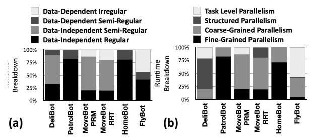

# OPPORTUNITIES IN ACCELERATING END-TO-END ROBOTICS

A common approach to acceleration is to profile benchmarks and target a small set of critical kernels. However, this kernelcentric approach fails to generalize across robotics, where different embodiments, tasks, and environments shift the workload landscape. Instead, we take a different approach: we identify the access schemas and forms of parallelism that underlay these diverse algorithmic domains. The contribution is therefore not simply a faster set of kernels, but a cross-domain robotics accelerator designed from the ground up around the interplay among access patterns, data structures, and forms of parallelism. To guide this design, we study *end-to-end robotics workloads* through interviews with roboticists and empirical analysis of diverse applications. We ground this study in RoWild [1], a benchmark suite of six end-to-end robotics applications that, unlike prior kernel-isolated benchmarks, captures the cross-domain structure of real robotic pipelines. The following sections distill the resulting insights and the challenges they expose.

## *A. Four Distinct Data Access Schemas in Robotics*

Robotics applications go well beyond the affine accesses common in tensor computation—and exhibit the following four data access schemas in different phases of execution: Data-independent regular schema: Accesses that implement strided walks over contiguous tensors [44–46, 50, 52, 57, 58]. Data-independent semi-regular schema: Accesses that do not follow fully regular vector walks, but their access direction

**Fig. 1: Runtime breakdown of (a) data-access schemas, and (b) forms of parallelism.**

is known, making the pattern data-independent. An example is raycasting [63] for localization, which advances fixed-angle rays through the occupancy grid to compute the ray length.

Data-dependent semi-regular schema: The class of accesses used in processing queues of data that according to a conditional, decides how to compute over each element of the queue. Unlike arrays, walks over the queue are not always strided, as they involve conditional data dependence (i.e., predication). For instance, the data filtering and projection stage of Simultaneous Localization and Mapping (SLAM) [64, 65] computes 3D points for every input pixel, but only a subset satisfies the visibility criteria and are in the line of sight of the robot.

Data-dependent irregular schema. This class mostly involves tree structure that captures the dynamic environment (e.g. occupancy map [66]), which requires traversing memory via data-dependent, pointer-based walks that follow irregular paths, yet often perform little computation per access.

Fig. 1(a) empirically illustrates the fraction of total runtime per robot spent in stages that exhibit the four access schemas. The results show that the contribution of each access schema varies significantly across different robots. Factors such as physical form, operating environment, and sensor fidelity can further diversify the distribution of these access patterns. Contrary to common perception, linear algebra and data-independent regular schema are not dominant in four out of six robots. Data-dependent and data-independent semi-regular accesses dominate in three out of six benchmarks.

## *B. Varying Forms of Parallelism in Robotics*

To understand the interplay between access schemas and computation, Fig. 1(b) presents the runtime breakdown of RoWild robots across four forms of parallelism: (1) fine-grained (e.g., dense linear algebra); (2) coarse-grained parallelism over largely independent data chunks, such as point cloud processing; (3) structured parallelism with patterned, but not strided data accesses, such as ray casting over a grid map; and (4) task-level (e.g., graph-based planning).

As shown, some robots (e.g., PatrolBot, HomeBot) rely primarily on fine-grained data parallelism, while others (e.g., FlyBot, MoveBot-RRT) require graph-based planning or task-level execution. As Fig. 1(b) illustrates, *no single form of parallelism dominates.* Even within a single algorithmic domain (e.g., Model Predictive Control (MPC) [67, 68] in FlyBot), the forms of parallelism can vary, combining matrix operations with variable-length vector updates. Domain-specific

accelerators are often locked into a single form—e.g., systolic arrays for dense fine-grained parallelism—making them brittle across tasks and costly to repurpose. GPUs offer flexibility but are either ineffective or over-provisioned for irregular or low-parallelism phases. This variability demands hardware capable of matching both the granularity and structure of parallelism, phase by phase. *Amdahl's Law further underscores this challenge: Accelerating a single form of parallelism inevitably shifts the performance bottleneck to others.* Therefore, to deliver speedups across *end-to-end workloads*, robotics requires an elastic substrate capable of adapting dynamically to each stage's parallelism, without the rigidity of fixed hardware or the overheads of general-purpose designs.

Cross-domain polymorphism for robotics. Given this diversity of access patterns and forms of parallelism, Accelerator Polymorphism is not merely beneficial but essential across embodiments, tasks, and environments. The next sections, therefore, devise a polymorphic accelerator that shape-shifts at runtime, adapting to each phase's distinct patterns and forms.

## III. MORPHA CORE: QUEUE-CENTRIC SIMD PROCESSOR

Queues: a data structure commonality. Our quantitative and qualitative study reveals another insight. *Robotic algorithms from different domains share a common data structure: queues.* In path planning, algorithms such as A\* [69] and Breadth-First Search maintain a queue of frontier nodes as the robot explores different possibilities. In perception, SLAM [64, 65] uses queues extensively in point-cloud filtering and environment projection. MPC [67, 68] filters a batch of candidates based on feasibility constraints—producing a queue of valid trajectories for optimization. The use of queues is not an artifact of implementation, but rather a reflection of the underlying algorithmic need to iterate over semi-regular sensory information, detect the important elements that indicate key events or cues, and do so within dynamic environments.

## *A. Unlocking Fine-Grained Parallelism in Queues*

This insight suggests that queues could offer a powerful abstraction across a wide range of robotic domains and workloads. However, queues are conventionally seen as sequential due to their First-In First-Out (FIFO) semantics: adding a constant to each element typically requires pop, compute, push in that order. *We contribute the insight that this FIFO semantics only governs ordering, not execution—queues can be parallelized without violating their ordering guarantees.* Fig. 2(a) shows how the multi-colored 11-element queue on the left is parallelized four ways into four sub-queues. A natural first attempt is to simply split the queue in the order the elements appear: ⟨0,1,2⟩ in the first sub-queue, ⟨3,4,5⟩ in the second, and so on. With such sequential partitioning, consecutive accesses to memory only fetch data for the first sub-queue, losing the potential for parallel computation and memory-level parallelism. We therefore interleave the partition layout across memory banks, as illustrated by the four colors in Fig. 2(a). With interleaved partitions, the first queue will be ⟨0,4,8⟩, the second ⟨1,5,9⟩, and so on. Therefore, when a contiguous

Fig. 2: (a, b) Queue-centric SIMD and (c) vector execution and their correspondence to the Morpha Core pipeline.

parallel sub-queue receives an element, maximizing parallelism. At the end of execution, the queue is naturally put together again as it still retains the same order in the memory, while preserving the order of operations in the data parallel execution. Neither multi-threading nor vector execution is effective for queue parallelism. One way to leverage this parallelism is through multithreading—assigning each sub-queue to a separate core. However, this Multiple-Instruction Multiple-Data (MIMD) model incurs significant overheads: duplicated instruction bookkeeping, thread scheduling costs, and added control complexity, etc. Another option is to use vector processing that follows the Single Instruction Multiple Data (SIMD) model, employing wide vector register files that feed a column of parallel ALUs to process multiple sub-queues in lockstep. This approach introduces three overheads: (1) sub-queue full/empty checks, which require a complicated sequence of instructions to track the status of all sub-queues; (2) vector register file access and address calculation instructions to load data into the vector register file before computation, making the register file a bottleneck and also adding the extra overhead of address calculation instructions; and (3) complex multi-sub-queue branching and looping, which demands a similarly complicated sequence of instructions to decide how to repeat operations across multiple

block of memory (e.g., [0,1,2,3]) is loaded from memory, each

#### B. Morpha Core: Queue-Centric SIMD Execution

concurrent sub-queues. §VI-D quantifies these overheads.

We propose a third design point, Morpha Core, that leans toward SIMD execution, but whose deeply pipelined organization departs fundamentally from conventional vector processors. As Fig. 2(b) illustrates, rather than feeding a single wide execution stage from a register file backed by a cache hierarchy, Morpha Core distributes SIMD execution across a sequence of pipelined execution stages. Each execution stage couples an ALU with its own on-chip scratchpad sub-bank, holistically eliminating the register file and cache-backed operand supply. Each interleaved sub-queue is mapped directly onto one execution stage, and these sub-queues collectively form a partitioned logical queue identified by a shared queue ID. Crucially, the sub-queue itself acts as a first-class

operand: instructions reference data via the queue ID, and the corresponding operands are supplied by a lightweight Queue Manager attached to each execution stage, which independently tracks the head, tail, and emptiness of its sub-queue. This shifts execution from register-file-centric operand accesses to direct execution on scratchpads that hold sub-queues. Because each stage manages its sub-queue independently, uneven sub-queue sizes are handled transparently. As Fig. 2(a-b) shows, the last sub-queue has fewer elements, and when a SIMD ADD reaches a stage whose sub-queue has already been exhausted, its Queue Manager detects the empty sub-queue and skips the addition. Queues as first-class SIMD operands. By accelerating queues directly as first-class operands in SIMD execution, Morpha Core turns queues into a unifying mechanism for three capabilities required across different domains in robotics. First, it enables accelerating dynamically-sized data (§III-C), aligned with the data-dependent access patterns and coarse-grained parallelism characteristic of some robotics workloads. This feature alleviates the need to force execution into fixed-size operands through static allocation or worst-case provisioning. Second, our SIMD queues provide effective control flow (§III-C) in vector execution. Rather than relying on predication over inactive lanes, execution progresses only on elements that remain in the relevant queues. This pattern matches data-dependent, semi-regular access in different robotics pipelines. Third, the same SIMD queue abstraction extends naturally to communication across Morpha Cores, which we leverage to enable shape-shifting capability in Morphatron (§IV-A). Together, these capabilities establish SIMD queues not only as a data structure that Morpha Core accelerates, but as the architectural primitive that unifies diverse execution patterns across algorithmic domains in robotics.

# OPPORTUNITIES IN ACCELERATING END-TO-END ROBOTICS

A common approach to acceleration is to profile benchmarks and target a small set of critical kernels. However, this kernelcentric approach fails to generalize across robotics, where different embodiments, tasks, and environments shift the workload landscape. Instead, we take a different approach: we identify the access schemas and forms of parallelism that underlay these diverse algorithmic domains. The contribution is therefore not simply a faster set of kernels, but a cross-domain robotics accelerator designed from the ground up around the interplay among access patterns, data structures, and forms of parallelism. To guide this design, we study *end-to-end robotics workloads* through interviews with roboticists and empirical analysis of diverse applications. We ground this study in RoWild [1], a benchmark suite of six end-to-end robotics applications that, unlike prior kernel-isolated benchmarks, captures the cross-domain structure of real robotic pipelines. The following sections distill the resulting insights and the challenges they expose.

## *A. Four Distinct Data Access Schemas in Robotics*

Robotics applications go well beyond the affine accesses common in tensor computation—and exhibit the following four data access schemas in different phases of execution: Data-independent regular schema: Accesses that implement strided walks over contiguous tensors [44–46, 50, 52, 57, 58]. Data-independent semi-regular schema: Accesses that do not follow fully regular vector walks, but their access direction

**Fig. 1: Runtime breakdown of (a) data-access schemas, and (b) forms of parallelism.**

is known, making the pattern data-independent. An example is raycasting [63] for localization, which advances fixed-angle rays through the occupancy grid to compute the ray length.

Data-dependent semi-regular schema: The class of accesses used in processing queues of data that according to a conditional, decides how to compute over each element of the queue. Unlike arrays, walks over the queue are not always strided, as they involve conditional data dependence (i.e., predication). For instance, the data filtering and projection stage of Simultaneous Localization and Mapping (SLAM) [64, 65] computes 3D points for every input pixel, but only a subset satisfies the visibility criteria and are in the line of sight of the robot.

Data-dependent irregular schema. This class mostly involves tree structure that captures the dynamic environment (e.g. occupancy map [66]), which requires traversing memory via data-dependent, pointer-based walks that follow irregular paths, yet often perform little computation per access.

Fig. 1(a) empirically illustrates the fraction of total runtime per robot spent in stages that exhibit the four access schemas. The results show that the contribution of each access schema varies significantly across different robots. Factors such as physical form, operating environment, and sensor fidelity can further diversify the distribution of these access patterns. Contrary to common perception, linear algebra and data-independent regular schema are not dominant in four out of six robots. Data-dependent and data-independent semi-regular accesses dominate in three out of six benchmarks.

## *B. Varying Forms of Parallelism in Robotics*

To understand the interplay between access schemas and computation, Fig. 1(b) presents the runtime breakdown of RoWild robots across four forms of parallelism: (1) fine-grained (e.g., dense linear algebra); (2) coarse-grained parallelism over largely independent data chunks, such as point cloud processing; (3) structured parallelism with patterned, but not strided data accesses, such as ray casting over a grid map; and (4) task-level (e.g., graph-based planning).

As shown, some robots (e.g., PatrolBot, HomeBot) rely primarily on fine-grained data parallelism, while others (e.g., FlyBot, MoveBot-RRT) require graph-based planning or task-level execution. As Fig. 1(b) illustrates, *no single form of parallelism dominates.* Even within a single algorithmic domain (e.g., Model Predictive Control (MPC) [67, 68] in FlyBot), the forms of parallelism can vary, combining matrix operations with variable-length vector updates. Domain-specific

accelerators are often locked into a single form—e.g., systolic arrays for dense fine-grained parallelism—making them brittle across tasks and costly to repurpose. GPUs offer flexibility but are either ineffective or over-provisioned for irregular or low-parallelism phases. This variability demands hardware capable of matching both the granularity and structure of parallelism, phase by phase. *Amdahl's Law further underscores this challenge: Accelerating a single form of parallelism inevitably shifts the performance bottleneck to others.* Therefore, to deliver speedups across *end-to-end workloads*, robotics requires an elastic substrate capable of adapting dynamically to each stage's parallelism, without the rigidity of fixed hardware or the overheads of general-purpose designs.

Cross-domain polymorphism for robotics. Given this diversity of access patterns and forms of parallelism, Accelerator Polymorphism is not merely beneficial but essential across embodiments, tasks, and environments. The next sections, therefore, devise a polymorphic accelerator that shape-shifts at runtime, adapting to each phase's distinct patterns and forms.

## III. MORPHA CORE: QUEUE-CENTRIC SIMD PROCESSOR

Queues: a data structure commonality. Our quantitative and qualitative study reveals another insight. *Robotic algorithms from different domains share a common data structure: queues.* In path planning, algorithms such as A\* [69] and Breadth-First Search maintain a queue of frontier nodes as the robot explores different possibilities. In perception, SLAM [64, 65] uses queues extensively in point-cloud filtering and environment projection. MPC [67, 68] filters a batch of candidates based on feasibility constraints—producing a queue of valid trajectories for optimization. The use of queues is not an artifact of implementation, but rather a reflection of the underlying algorithmic need to iterate over semi-regular sensory information, detect the important elements that indicate key events or cues, and do so within dynamic environments.

## *A. Unlocking Fine-Grained Parallelism in Queues*

This insight suggests that queues could offer a powerful abstraction across a wide range of robotic domains and workloads. However, queues are conventionally seen as sequential due to their First-In First-Out (FIFO) semantics: adding a constant to each element typically requires pop, compute, push in that order. *We contribute the insight that this FIFO semantics only governs ordering, not execution—queues can be parallelized without violating their ordering guarantees.* Fig. 2(a) shows how the multi-colored 11-element queue on the left is parallelized four ways into four sub-queues. A natural first attempt is to simply split the queue in the order the elements appear: ⟨0,1,2⟩ in the first sub-queue, ⟨3,4,5⟩ in the second, and so on. With such sequential partitioning, consecutive accesses to memory only fetch data for the first sub-queue, losing the potential for parallel computation and memory-level parallelism. We therefore interleave the partition layout across memory banks, as illustrated by the four colors in Fig. 2(a). With interleaved partitions, the first queue will be ⟨0,4,8⟩, the second ⟨1,5,9⟩, and so on. Therefore, when a contiguous

Fig. 2: (a, b) Queue-centric SIMD and (c) vector execution and their correspondence to the Morpha Core pipeline.

parallel sub-queue receives an element, maximizing parallelism. At the end of execution, the queue is naturally put together again as it still retains the same order in the memory, while preserving the order of operations in the data parallel execution. Neither multi-threading nor vector execution is effective for queue parallelism. One way to leverage this parallelism is through multithreading—assigning each sub-queue to a separate core. However, this Multiple-Instruction Multiple-Data (MIMD) model incurs significant overheads: duplicated instruction bookkeeping, thread scheduling costs, and added control complexity, etc. Another option is to use vector processing that follows the Single Instruction Multiple Data (SIMD) model, employing wide vector register files that feed a column of parallel ALUs to process multiple sub-queues in lockstep. This approach introduces three overheads: (1) sub-queue full/empty checks, which require a complicated sequence of instructions to track the status of all sub-queues; (2) vector register file access and address calculation instructions to load data into the vector register file before computation, making the register file a bottleneck and also adding the extra overhead of address calculation instructions; and (3) complex multi-sub-queue branching and looping, which demands a similarly complicated sequence of instructions to decide how to repeat operations across multiple

block of memory (e.g., [0,1,2,3]) is loaded from memory, each

#### B. Morpha Core: Queue-Centric SIMD Execution

concurrent sub-queues. §VI-D quantifies these overheads.

We propose a third design point, Morpha Core, that leans toward SIMD execution, but whose deeply pipelined organization departs fundamentally from conventional vector processors. As Fig. 2(b) illustrates, rather than feeding a single wide execution stage from a register file backed by a cache hierarchy, Morpha Core distributes SIMD execution across a sequence of pipelined execution stages. Each execution stage couples an ALU with its own on-chip scratchpad sub-bank, holistically eliminating the register file and cache-backed operand supply. Each interleaved sub-queue is mapped directly onto one execution stage, and these sub-queues collectively form a partitioned logical queue identified by a shared queue ID. Crucially, the sub-queue itself acts as a first-class

operand: instructions reference data via the queue ID, and the corresponding operands are supplied by a lightweight Queue Manager attached to each execution stage, which independently tracks the head, tail, and emptiness of its sub-queue. This shifts execution from register-file-centric operand accesses to direct execution on scratchpads that hold sub-queues. Because each stage manages its sub-queue independently, uneven sub-queue sizes are handled transparently. As Fig. 2(a-b) shows, the last sub-queue has fewer elements, and when a SIMD ADD reaches a stage whose sub-queue has already been exhausted, its Queue Manager detects the empty sub-queue and skips the addition. Queues as first-class SIMD operands. By accelerating queues directly as first-class operands in SIMD execution, Morpha Core turns queues into a unifying mechanism for three capabilities required across different domains in robotics. First, it enables accelerating dynamically-sized data (§III-C), aligned with the data-dependent access patterns and coarse-grained parallelism characteristic of some robotics workloads. This feature alleviates the need to force execution into fixed-size operands through static allocation or worst-case provisioning. Second, our SIMD queues provide effective control flow (§III-C) in vector execution. Rather than relying on predication over inactive lanes, execution progresses only on elements that remain in the relevant queues. This pattern matches data-dependent, semi-regular access in different robotics pipelines. Third, the same SIMD queue abstraction extends naturally to communication across Morpha Cores, which we leverage to enable shape-shifting capability in Morphatron (§IV-A). Together, these capabilities establish SIMD queues not only as a data structure that Morpha Core accelerates, but as the architectural primitive that unifies diverse execution patterns across algorithmic domains in robotics.

