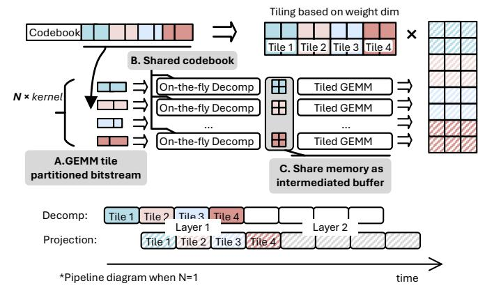
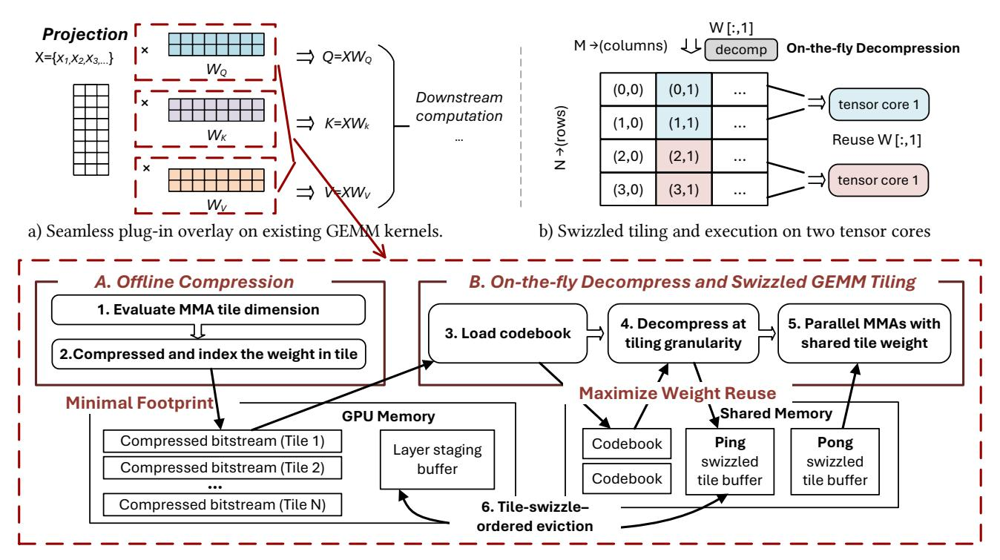

# A. Principles for Selecting Lossless Compression and Decompression Algorithms

Effective lossless compression for LLM inference requires more than a high compression ratio: because GEMM kernels partition projection weights into fine-grained tiles that are repeatedly loaded and reused by the tensor cores, any practical codec must respect this tiled access pattern and integrate seamlessly into the GEMM dataflow rather than treat weights as monolithic tensors.

Principle 1: Near-Shannon bound compression with hardware-realistic throughput. LLM inference reads weights at an extremely high bandwidth. A useful lossless codec must therefore compress close to the entropy limit while also decoding fast enough to keep up with GPU memory throughput. Otherwise, decompression becomes the bottleneck, no matter how good the compression ratio.

Principle 2: Tile-granularity access for decompression. GEMM kernels consume weights tile by tile, not layer by

layer. Most compression algorithms cannot jump to an arbitrary tile without decoding everything before it. This forces full-layer decompression and blocks pipelining. A practical codec must allow each tile to be decoded independently, exactly when the GEMM kernel needs it.

Principle 3: Tight integration of decompression with matrix-multiplication tiling. Even with fast, tile-level decoding, decompression must fit directly into the GEMM dataflow. Writing decoded tiles back to global memory wastes bandwidth and breaks overlap. Decompression should instead write directly into shared memory in the same layout used by tensor cores, enabling seamless overlap with computation and avoiding extra memory traffic.

#### B. Review of Existing Lossless Compression Methods

Given these three principles, we review classical compression algorithms that achieve excellent ratios in general-purpose data. Table I compares widely used compression schemes, highlighting entropy efficiency and access granularity.

- 1) Dictionary-based compressors (gzip, LZ4, Zstd).: LZ77-style schemes rely on sequential pointer chasing through a sliding dictionary, which prevents random-access decoding of a single weight tile without rebuilding all prior state. Their compression efficiency also degrades at tile granularity, since effectiveness relies on large dictionary contexts. Both properties violate the tile-granularity constraint for pipelined GEMM execution.
- 2) Symbol-based codecs (Huffman, arithmetic coding).: Huffman coding is fast but limited by integer-length codes, leaving nontrivial gaps to the Shannon limit. Arithmetic coding achieves near-optimal entropy efficiency, but its bit-serial state machine prevents parallel decoding and restricts throughput to only a few GB/s. Both methods fail to meet the two requirements: they neither support tile-level random access nor scale to HBM-level bandwidth during inference.
- 3) Finite-state entropy coders (rANS, tANS, FSE).: Finite-state entropy coding retains the near-Shannon efficiency of arithmetic coding but replaces serial interval updates with table-driven state transitions, enabling byte-level streaming and parallel decoding at tens to hundreds of GB/s while keeping each tile independently decodable. It is the only codec class that meets both constraints required for high-throughput LLM inference. Prior work, such as DietGPU [23], provides competitive warp-cooperative rANS decoders, offering

Fig. 4: Tile-aligned on-the-fly decompression, partitions weights into fine-grained tiles, decodes them on demand, and overlaps decompression with GEMM execution using shared memory buffers.

a strong foundation with the potential for further performance optimization and tight integration with the GEMM execution pipeline.

#### IV. ON-THE-FLY DECOMPRESSION

Figure 4 illustrates our on-the-fly decompression execution model, which replaces coarse, layer-level decoding with a continuous, tile-aligned dataflow.

The compressed weight bitstream is partitioned into tilesized ANS substreams, with each tile's starting offset recorded in a lightweight index table. All tiles within the same layer share a compact ANS codebook, which is constructed from the layer's aggregated weight distribution. Sharing a layer-wide codebook maximizes statistical coverage of the underlying distribution while keeping metadata overhead minimal. Each tile can then be decoded independently, exactly at the moment the GEMM kernel needs it, without scanning preceding tiles. The runtime workflow consists of three tightly coupled stages: A. Tile-partitioned bitstreams. During offline preprocessing, each weight matrix is partitioned into tile-aligned substreams matching the GEMM tile size executed on the SMs. Each tile is entropy-encoded as an independent ANS bitstream using a shared per-layer codebook, and a compact offset entry is stored in the tile index table to enable direct tile access.

**B. On-the-fly ANS decompression.** At runtime, multiple ANS decoder kernels execute on the SMs, reconstructing weight tiles directly into their on-chip shared memory. This avoids writing decompressed weights back to global memory, substantially reducing global memory bandwidth consumption. **C. Coupled GEMM execution.** As soon as a tile is decoded in shared memory, it is immediately consumed by the GEMM kernel in its required swizzled layout. A double-buffered shared-memory workspace ensures that, while one tile is being used for computation, the next tile is being decoded in Tilealigned on-the-fly.

By aligning decompression with GEMM tile consumption, the proposed design removes layer-level synchronization barriers and eliminates intermediate global-memory traffic. As shown in the timeline comparison, computation for layer i can begin as soon as the first tiles are ready, while later tiles are decoded concurrently, achieving sustained line-rate throughput with negligible overhead.

#### V. GPU IMPLEMENTATION AND OPTIMIZATIONS

In this section, we describe how to integrate the on-the-fly decompression mechanism into GPU execution pipelines.

#### A. Design Overview

Figure 5 illustrates the complete workflow of the proposed GPU runtime kernel. Building on state-of-the-art GEMM libraries such as CUTLASS, we develop a lightweight plugin-style kernel that can override existing projection operators with minimal changes to library-level GEMM implementations and provides a wrapper for direct invocation in PyTorch.

The design consists of two complementary stages: the offline compression stage, minimizing the static device-memory footprint, and the on-the-fly decompression and swizzled GEMM stage, maximizing runtime efficiency during inference. For the decompression backend, we build upon the ANS kernel implementation from the open-source DietGPU library [23], adapting and extending it to support tile-granular decoding and integration with modern tensor-core GEMM pipelines.

#### B. Tile Addressable ANS Offline Compression

In the preprocessing phase, each projection matrix  $(W_Q, W_K, W_V)$  is first profiled to determine the optimal tensor-core tiling geometry (e.g.,  $128 \times 32$ ,  $256 \times 64$ ,  $128 \times 128$  and etc.) for downstream GEMM execution. We then aggregate the weight statistics across the entire layer to construct a shared, compact ANS codebook that captures the dominant distributional structure while amortizing codebook overhead of independent compression on chunks. After the codebook is established, the weight tensor is partitioned into tiles aligned with the GEMM tiling geometry. Each tile is then entropyencoded using ANS with an independently initialized state while sharing the same per-layer codebook. Because ANS supports arbitrary initial states without losing compression efficiency, each tile becomes a fully self-contained substream that can be decoded independently at inference time.

The resulting compressed bitstreams and their tile-offset metadata are stored in GPU memory, producing a compact representation while preserving the exact tile boundaries required by GEMM kernels. Importantly, this stage is *entirely offline* and independent of framework execution. The compressed model can be loaded as a direct drop-in replacement for standard weights, enabling our system to act as a lightweight plugin atop existing LLM inference frameworks such as Py-Torch or custom CUDA runtimes.

#### C. On-the-Fly Decompression Pipelined with GEMM

After the offline compression stage, the compressed weight tensors and their metadata are loaded into GPU memory and used directly during inference. During execution, decompression is performed at the same tile granularity as the GEMM

Fig. 5: GPU kernel for on-the-fly decompression and swizzled GEMM execution. (a) Projection layers seamlessly integrate the decompression kernel. (b) Offline compression minimizes footprint, while on-the-fly decompression and shared-memory swizzling maximize weight reuse and pipeline overlap.

computation and executed in a fused manner for efficient overlap.

*1) Fused Tile Aligned Kernel Design:* Algorithm [V.1](#page-6-0) details the fused execution model that underlies our high-performance ANS decompression path. The kernel consists of two cooperating components: a warp-cooperative rANS decoding kernel and a tile-level GEMM microkernel.

At the beginning of each layer, the rANS decode table is loaded into shared memory by the decoding warp on each SM, enabling low-latency, high-bandwidth table lookups during decompression.

During execution, warp 0 fetches compressed weight tiles from global memory and decodes them in a streaming manner. The decoded symbols are written *directly* into a sharedmemory tile A(b) , with indices generated in lockstep with the interleaved decode order. This avoids materializing decompressed weights in global memory and significantly reduces global-memory traffic. The rANS decoder therefore acts as a producer that reconstructs weight tiles directly into shared memory, while the remaining warps in the thread block immediately consume the tile for tensor-core GEMM computation.

A double-buffered pipeline overlaps decompression of tile k+1 with GEMM computation on tile k. Producer and consumer warps synchronize through shared-memory atomic state flags implemented with cuda::atomic\_ref<int, cuda::thread\_scope\_block>, ensuring correct ordering with minimal performance overhead. The detailed scheduling of producer and consumer warps on disjoint hardware pipes, and the regime in which decode is fully hidden, are analyzed in Section [V-D.](#page-6-1)

- *2) Tile Swizzle and Deterministic Eviction:* For largedimension GEMM, the kernel follows a fixed tile-swizzle traversal order to maximize data reuse and balance sharedmemory pressure across thread blocks. Because this access sequence is deterministic and determined by the GEMM tiling schedule, the working set of active tiles may temporarily exceed the available shared-memory capacity. In such cases, decoded tiles are evicted following the deterministic order induced by the tile swizzle traversal. The notion of "recency" is therefore defined by the swizzle access order rather than runtime reuse tracking, allowing the eviction sequence to be determined statically without additional bookkeeping. When a tile is evicted from shared memory, its decompressed form is temporarily stored in a small decompression buffer to avoid redundant decompression if the tile is accessed again shortly thereafter, while the compressed representation remains in global memory.
- *3) Parallel Warp-Cooperative rANS Decoding:* Algorithm [V.2](#page-6-2) presents the warp-cooperative rANS decoding algorithm used to reconstruct compressed weight tiles on the GPU. Because the rANS state machine is inherently sequential, we expose parallelism by partitioning each tile's compressed bitstream into R independent substreams. Each warp lane maintains its own rANS state and processes one substream, allowing the serial decoding process to be distributed across the warp.

For each decoding step, the lane extracts the low bits of the current rANS state to determine the next symbol, performs

# A. Principles for Selecting Lossless Compression and Decompression Algorithms

Effective lossless compression for LLM inference requires more than a high compression ratio: because GEMM kernels partition projection weights into fine-grained tiles that are repeatedly loaded and reused by the tensor cores, any practical codec must respect this tiled access pattern and integrate seamlessly into the GEMM dataflow rather than treat weights as monolithic tensors.

Principle 1: Near-Shannon bound compression with hardware-realistic throughput. LLM inference reads weights at an extremely high bandwidth. A useful lossless codec must therefore compress close to the entropy limit while also decoding fast enough to keep up with GPU memory throughput. Otherwise, decompression becomes the bottleneck, no matter how good the compression ratio.

Principle 2: Tile-granularity access for decompression. GEMM kernels consume weights tile by tile, not layer by

layer. Most compression algorithms cannot jump to an arbitrary tile without decoding everything before it. This forces full-layer decompression and blocks pipelining. A practical codec must allow each tile to be decoded independently, exactly when the GEMM kernel needs it.

Principle 3: Tight integration of decompression with matrix-multiplication tiling. Even with fast, tile-level decoding, decompression must fit directly into the GEMM dataflow. Writing decoded tiles back to global memory wastes bandwidth and breaks overlap. Decompression should instead write directly into shared memory in the same layout used by tensor cores, enabling seamless overlap with computation and avoiding extra memory traffic.

#### B. Review of Existing Lossless Compression Methods

Given these three principles, we review classical compression algorithms that achieve excellent ratios in general-purpose data. Table I compares widely used compression schemes, highlighting entropy efficiency and access granularity.

- 1) Dictionary-based compressors (gzip, LZ4, Zstd).: LZ77-style schemes rely on sequential pointer chasing through a sliding dictionary, which prevents random-access decoding of a single weight tile without rebuilding all prior state. Their compression efficiency also degrades at tile granularity, since effectiveness relies on large dictionary contexts. Both properties violate the tile-granularity constraint for pipelined GEMM execution.
- 2) Symbol-based codecs (Huffman, arithmetic coding).: Huffman coding is fast but limited by integer-length codes, leaving nontrivial gaps to the Shannon limit. Arithmetic coding achieves near-optimal entropy efficiency, but its bit-serial state machine prevents parallel decoding and restricts throughput to only a few GB/s. Both methods fail to meet the two requirements: they neither support tile-level random access nor scale to HBM-level bandwidth during inference.
- 3) Finite-state entropy coders (rANS, tANS, FSE).: Finite-state entropy coding retains the near-Shannon efficiency of arithmetic coding but replaces serial interval updates with table-driven state transitions, enabling byte-level streaming and parallel decoding at tens to hundreds of GB/s while keeping each tile independently decodable. It is the only codec class that meets both constraints required for high-throughput LLM inference. Prior work, such as DietGPU [23], provides competitive warp-cooperative rANS decoders, offering

Fig. 4: Tile-aligned on-the-fly decompression, partitions weights into fine-grained tiles, decodes them on demand, and overlaps decompression with GEMM execution using shared memory buffers.

a strong foundation with the potential for further performance optimization and tight integration with the GEMM execution pipeline.

#### IV. ON-THE-FLY DECOMPRESSION

Figure 4 illustrates our on-the-fly decompression execution model, which replaces coarse, layer-level decoding with a continuous, tile-aligned dataflow.

The compressed weight bitstream is partitioned into tilesized ANS substreams, with each tile's starting offset recorded in a lightweight index table. All tiles within the same layer share a compact ANS codebook, which is constructed from the layer's aggregated weight distribution. Sharing a layer-wide codebook maximizes statistical coverage of the underlying distribution while keeping metadata overhead minimal. Each tile can then be decoded independently, exactly at the moment the GEMM kernel needs it, without scanning preceding tiles. The runtime workflow consists of three tightly coupled stages: A. Tile-partitioned bitstreams. During offline preprocessing, each weight matrix is partitioned into tile-aligned substreams matching the GEMM tile size executed on the SMs. Each tile is entropy-encoded as an independent ANS bitstream using a shared per-layer codebook, and a compact offset entry is stored in the tile index table to enable direct tile access.

**B. On-the-fly ANS decompression.** At runtime, multiple ANS decoder kernels execute on the SMs, reconstructing weight tiles directly into their on-chip shared memory. This avoids writing decompressed weights back to global memory, substantially reducing global memory bandwidth consumption. **C. Coupled GEMM execution.** As soon as a tile is decoded in shared memory, it is immediately consumed by the GEMM kernel in its required swizzled layout. A double-buffered shared-memory workspace ensures that, while one tile is being used for computation, the next tile is being decoded in Tilealigned on-the-fly.

By aligning decompression with GEMM tile consumption, the proposed design removes layer-level synchronization barriers and eliminates intermediate global-memory traffic. As shown in the timeline comparison, computation for layer i can begin as soon as the first tiles are ready, while later tiles are decoded concurrently, achieving sustained line-rate throughput with negligible overhead.

#### V. GPU IMPLEMENTATION AND OPTIMIZATIONS

In this section, we describe how to integrate the on-the-fly decompression mechanism into GPU execution pipelines.

#### A. Design Overview

Figure 5 illustrates the complete workflow of the proposed GPU runtime kernel. Building on state-of-the-art GEMM libraries such as CUTLASS, we develop a lightweight plugin-style kernel that can override existing projection operators with minimal changes to library-level GEMM implementations and provides a wrapper for direct invocation in PyTorch.

The design consists of two complementary stages: the offline compression stage, minimizing the static device-memory footprint, and the on-the-fly decompression and swizzled GEMM stage, maximizing runtime efficiency during inference. For the decompression backend, we build upon the ANS kernel implementation from the open-source DietGPU library [23], adapting and extending it to support tile-granular decoding and integration with modern tensor-core GEMM pipelines.

#### B. Tile Addressable ANS Offline Compression

In the preprocessing phase, each projection matrix  $(W_Q, W_K, W_V)$  is first profiled to determine the optimal tensor-core tiling geometry (e.g.,  $128 \times 32$ ,  $256 \times 64$ ,  $128 \times 128$  and etc.) for downstream GEMM execution. We then aggregate the weight statistics across the entire layer to construct a shared, compact ANS codebook that captures the dominant distributional structure while amortizing codebook overhead of independent compression on chunks. After the codebook is established, the weight tensor is partitioned into tiles aligned with the GEMM tiling geometry. Each tile is then entropyencoded using ANS with an independently initialized state while sharing the same per-layer codebook. Because ANS supports arbitrary initial states without losing compression efficiency, each tile becomes a fully self-contained substream that can be decoded independently at inference time.

The resulting compressed bitstreams and their tile-offset metadata are stored in GPU memory, producing a compact representation while preserving the exact tile boundaries required by GEMM kernels. Importantly, this stage is *entirely offline* and independent of framework execution. The compressed model can be loaded as a direct drop-in replacement for standard weights, enabling our system to act as a lightweight plugin atop existing LLM inference frameworks such as Py-Torch or custom CUDA runtimes.

#### C. On-the-Fly Decompression Pipelined with GEMM

After the offline compression stage, the compressed weight tensors and their metadata are loaded into GPU memory and used directly during inference. During execution, decompression is performed at the same tile granularity as the GEMM

Fig. 5: GPU kernel for on-the-fly decompression and swizzled GEMM execution. (a) Projection layers seamlessly integrate the decompression kernel. (b) Offline compression minimizes footprint, while on-the-fly decompression and shared-memory swizzling maximize weight reuse and pipeline overlap.

computation and executed in a fused manner for efficient overlap.

*1) Fused Tile Aligned Kernel Design:* Algorithm [V.1](#page-6-0) details the fused execution model that underlies our high-performance ANS decompression path. The kernel consists of two cooperating components: a warp-cooperative rANS decoding kernel and a tile-level GEMM microkernel.

At the beginning of each layer, the rANS decode table is loaded into shared memory by the decoding warp on each SM, enabling low-latency, high-bandwidth table lookups during decompression.

During execution, warp 0 fetches compressed weight tiles from global memory and decodes them in a streaming manner. The decoded symbols are written *directly* into a sharedmemory tile A(b) , with indices generated in lockstep with the interleaved decode order. This avoids materializing decompressed weights in global memory and significantly reduces global-memory traffic. The rANS decoder therefore acts as a producer that reconstructs weight tiles directly into shared memory, while the remaining warps in the thread block immediately consume the tile for tensor-core GEMM computation.

A double-buffered pipeline overlaps decompression of tile k+1 with GEMM computation on tile k. Producer and consumer warps synchronize through shared-memory atomic state flags implemented with cuda::atomic\_ref<int, cuda::thread\_scope\_block>, ensuring correct ordering with minimal performance overhead. The detailed scheduling of producer and consumer warps on disjoint hardware pipes, and the regime in which decode is fully hidden, are analyzed in Section [V-D.](#page-6-1)

- *2) Tile Swizzle and Deterministic Eviction:* For largedimension GEMM, the kernel follows a fixed tile-swizzle traversal order to maximize data reuse and balance sharedmemory pressure across thread blocks. Because this access sequence is deterministic and determined by the GEMM tiling schedule, the working set of active tiles may temporarily exceed the available shared-memory capacity. In such cases, decoded tiles are evicted following the deterministic order induced by the tile swizzle traversal. The notion of "recency" is therefore defined by the swizzle access order rather than runtime reuse tracking, allowing the eviction sequence to be determined statically without additional bookkeeping. When a tile is evicted from shared memory, its decompressed form is temporarily stored in a small decompression buffer to avoid redundant decompression if the tile is accessed again shortly thereafter, while the compressed representation remains in global memory.
- *3) Parallel Warp-Cooperative rANS Decoding:* Algorithm [V.2](#page-6-2) presents the warp-cooperative rANS decoding algorithm used to reconstruct compressed weight tiles on the GPU. Because the rANS state machine is inherently sequential, we expose parallelism by partitioning each tile's compressed bitstream into R independent substreams. Each warp lane maintains its own rANS state and processes one substream, allowing the serial decoding process to be distributed across the warp.

For each decoding step, the lane extracts the low bits of the current rANS state to determine the next symbol, performs

