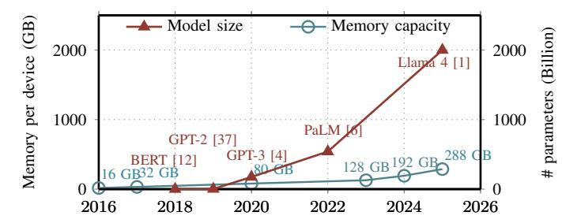

# Approaching Shannon Bound with Lossless LLM Weight Compression

Hongshi Tan\*, Yao Chen†, Gustavo Alonso§, Weng-Fai Wong\*, Bingsheng He\*

\*School of Computing, National University of Singapore, Singapore

†School of Computer Science and Technology, Huazhong University of Science and Technology, China

§Department of Computer Science, ETH Zurich, Switzerland
hongshi@u.nus.edu, chenyao\_cs@hust.edu.cn, alonso@inf.ethz.ch, {dcswwf, dcsheb}@nus.edu.sg

Abstract—Large language models (LLMs) now scale to trillions of parameters, driving weight storage into the terabyte regime and creating an acute mismatch with GPU memory capacity. Although lossless compression is widely effective in other domains, it remains underutilized in LLM systems. Through a comprehensive entropy study across models from 1.5B to 405B parameters and numeric formats ranging from bf16 to int4 and AWQ/SQ8, we find that LLM weights contain far less intrinsic randomness than their stored bitwidth implies, their effective entropy is 2–10× lower, indicating that up to a  $10\times$  footprint reduction is theoretically achievable without altering any weight values. Leveraging this insight, we introduce a tile-level, on-thefly lossless decompression framework based on Asymmetric Numeral Systems that aligns decoding with the GEMM tiling pattern of GPU inference. Our design achieves bit-rates within 0.01-0.1 bits of the Shannon limit across a wide range of LLM numerical formats, demonstrating that nearly all statistical redundancy is eliminated. Integrated into the SGLang serving framework with multi-GPU support, our approach increases the maximum batch size of Qwen-14B from 47 to 75, improving throughput by up to 1.2×. On Mixtral-176B, the feasible batch size increases from 20 to 95 (4.8 $\times$ ), yielding up to 1.6 $\times$  throughput improvement. Compared to state-of-the-art lossless compression approaches NeuZip and DFloat11, our design further improves throughput by up to  $11\times$ .

#### I. Introduction

Large language models (LLMs) have become the foundational backbone of modern AI systems [27], enabling advanced content generation [22], large-scale data analytics [3], and information-retrieval applications [38]. As model scale continues to grow, so do their capabilities, ranging from stronger reasoning and better generalization to improved adaptability across domains. Yet this rapid expansion places increasing pressure on inference infrastructure and compute hardware.

As shown in Figure 1, LLM parameter counts have grown exponentially from billions to trillions, pushing weight storage into the terabyte range [8], while GPU memory capacity grows much more slowly. Memory, not compute, has become the primary bottleneck: it determines both the maximum deployable model size and the achievable batch size, and reducing the weight footprint therefore directly translates into larger batches and higher inference throughput.

Although lossless compression has proven highly effective in domains such as storage systems and multimedia, its potential for reducing LLM model size and improving inference efficiency remains largely unexplored. Unlike existing model

Fig. 1: Model scale increases exponentially while on-device memory growth lags behind.

compression methods such as low rank decomposition [16], [20], [26], [31], [39], [47] and quantization [10], [15], [18], [25], [29], [29], [33], [36], [44], lossless compression preserves the exact numerical representation of model weights and therefore guarantees identical inference results. This property is particularly important for the deployment of reasoning-intensive tasks, where lossy techniques can introduce instability and unpredictable accuracy degradation [24], [28], [30], [42]. Furthermore, lossless compression is orthogonal to existing lossy compression techniques and can be applied on top of well-tuned quantized models to further reduce memory footprint.

State-of-the-art lossless compression methods for LLM weights, such as NeuZip [17] and DFloat11 [49], are largely designed for floating-point representations. However, modern LLM deployments increasingly adopt diverse numerical formats, including FP8, INT8, and low-bit or group-wise quantization, which are not well supported by these approaches. As a result, existing techniques do not generalize well across emerging LLM weight formats and leave substantial redundancy unexploited.

This raises two fundamental questions for lossless LLM compression: (1) How much strictly lossless compression is theoretically achievable across both unquantized and modern quantized formats? (2) If significant redundancy exists, how can we design a lightweight, high-throughput GPU execution model that integrates lossless compression directly into inference while preserving bit-exact outputs?

To answer the first question, we conduct a comprehensive, model-wide analysis grounded in Shannon's information

theory. Shannon limit provides a fundamental lower bound on the bits required to represent weights drawn from any underlying distribution, independent of numeric format or hardware layout, and therefore quantifies the minimum achievable footprint under any lossless encoding. Our analysis across widely deployed LLMs and numerical formats reveals that, on average, up to 27% of the stored bits are redundant, indicating significant headroom for footprint reduction without altering weight values (details in Section [II\)](#page-1-0). This entropy gap suggests that substantial memory savings, and therefore potentially higher inference throughput, can be unlocked with the right compression and inference integration strategy.

As the entropy analysis reveals substantial redundancy in contemporary LLM weights, we pursue the goal of developing a strictly lossless compression and high-throughput decompression framework for LLM inference. Achieving compression close to the Shannon limit and translating this redundancy into runtime gains, however, is non-trivial: both the codec and its system integration must satisfy stringent constraints imposed by GPU-accelerated LLM execution.

First, compressed bitstreams produced by conventional entropy codecs are not directly addressable. Most entropy coding schemes generate sequential bitstreams, where decoding must proceed in order and cannot easily jump to arbitrary positions. However, GPU GEMM kernels access weights in a strided, tile-granular pattern rather than sequential order. Transformer projection layers consume weights in small tiles, often non-contiguous and repeatedly reused across the Mdimension. This mismatch makes it difficult to directly retrieve the required tiles from a compressed bitstream. A practical lossless codec must therefore reconstruct tiles on demand, without introducing latency, excessive buffering, or additional global-memory traffic. Only by aligning decompression with the native GEMM tiling structure can the decoding overhead be fully amortized across the compute pipeline.

Second, a key challenge is that directly applying existing lossless decoders to LLM inference pipelines leads to inefficient execution and poor performance. State-of-the-art compression frameworks [\[17\]](#page-13-21), [\[49\]](#page-14-7) typically follow a decompressstore-compute workflow, where compressed weights are first fully decoded into global memory before being consumed by GEMM kernels. This layer-wise decompression introduces substantial overhead: it requires additional memory capacity to hold the decompressed weights, generates redundant globalmemory traffic, and prevents effective overlap between decompression and computation. As a result, naive decompression can become a critical performance bottleneck in real-world LLM serving systems.

To address these challenges, we begin by analyzing the information content of LLM weights and comparing existing lossless compression families, including dictionary-based methods (LZ77/Zstd), symbol-based entropy codes (Huffman, arithmetic coding), and finite-state entropy coders (rANS/ tANS/FSE). *Asymmetric Numeral Systems (ANS)* emerges as the only class that simultaneously (1) approaches Shannonoptimal bitrates, (2) supports random access at tile granularity, and (3) enables parallel decoding suitable for GPUs.

Building on this insight, we propose a *tile-level compression with on-the-fly decompression* framework based on ANS that integrates entropy decoding directly into the GPU inference pipeline. Unlike prior approaches that treat compression as a preprocessing or storage optimization, our design elevates compression to an execution primitive by introducing a compressed-weight execution model in which entropy-coded weight tiles become first-class operands of tensor-core computation. Instead of pre-decompressing weights or introducing layer-level synchronization, compressed tiles are decoded into shared memory precisely when the GEMM microkernel consumes them. This design enables decompression throughput close to the weight input rate of the baseline GEMM kernel while preserving strict losslessness without affecting model accuracy.

In summary, we make three key contributions:

- We perform the first systematic information-theoretic analysis of LLM weights across diverse numerical formats beyond floating-point representations, revealing a substantial entropy gap to the theoretical Shannon bound. Our results show that, in large models, up to a 5× reduction in memory footprint is achievable without any accuracy loss.
- We propose a compressed-weight execution model for GPU inference that integrates entropy decoding directly into the GEMM pipeline. The design introduces tileaddressable compressed streams, warp-cooperative decoding, and shared-memory reconstruction of weight tiles, enabling decompression and tensor-core computation to proceed concurrently without intermediate global-memory materialization.
- We propose a GPU kernel that integrates seamlessly with standard LLM inference frameworks such as SGLang, enabling larger batch sizes and achieving up to 1.6× higher throughput. Our evaluation further demonstrates that the proposed approach outperforms existing state-of-the-art lossless compression techniques.

# Approaching Shannon Bound with Lossless LLM Weight Compression

Hongshi Tan\*, Yao Chen†, Gustavo Alonso§, Weng-Fai Wong\*, Bingsheng He\*

\*School of Computing, National University of Singapore, Singapore

†School of Computer Science and Technology, Huazhong University of Science and Technology, China

§Department of Computer Science, ETH Zurich, Switzerland
hongshi@u.nus.edu, chenyao\_cs@hust.edu.cn, alonso@inf.ethz.ch, {dcswwf, dcsheb}@nus.edu.sg

Abstract—Large language models (LLMs) now scale to trillions of parameters, driving weight storage into the terabyte regime and creating an acute mismatch with GPU memory capacity. Although lossless compression is widely effective in other domains, it remains underutilized in LLM systems. Through a comprehensive entropy study across models from 1.5B to 405B parameters and numeric formats ranging from bf16 to int4 and AWQ/SQ8, we find that LLM weights contain far less intrinsic randomness than their stored bitwidth implies, their effective entropy is 2–10× lower, indicating that up to a  $10\times$  footprint reduction is theoretically achievable without altering any weight values. Leveraging this insight, we introduce a tile-level, on-thefly lossless decompression framework based on Asymmetric Numeral Systems that aligns decoding with the GEMM tiling pattern of GPU inference. Our design achieves bit-rates within 0.01-0.1 bits of the Shannon limit across a wide range of LLM numerical formats, demonstrating that nearly all statistical redundancy is eliminated. Integrated into the SGLang serving framework with multi-GPU support, our approach increases the maximum batch size of Qwen-14B from 47 to 75, improving throughput by up to 1.2×. On Mixtral-176B, the feasible batch size increases from 20 to 95 (4.8 $\times$ ), yielding up to 1.6 $\times$  throughput improvement. Compared to state-of-the-art lossless compression approaches NeuZip and DFloat11, our design further improves throughput by up to  $11\times$ .

#### I. Introduction

Large language models (LLMs) have become the foundational backbone of modern AI systems [27], enabling advanced content generation [22], large-scale data analytics [3], and information-retrieval applications [38]. As model scale continues to grow, so do their capabilities, ranging from stronger reasoning and better generalization to improved adaptability across domains. Yet this rapid expansion places increasing pressure on inference infrastructure and compute hardware.

As shown in Figure 1, LLM parameter counts have grown exponentially from billions to trillions, pushing weight storage into the terabyte range [8], while GPU memory capacity grows much more slowly. Memory, not compute, has become the primary bottleneck: it determines both the maximum deployable model size and the achievable batch size, and reducing the weight footprint therefore directly translates into larger batches and higher inference throughput.

Although lossless compression has proven highly effective in domains such as storage systems and multimedia, its potential for reducing LLM model size and improving inference efficiency remains largely unexplored. Unlike existing model

Fig. 1: Model scale increases exponentially while on-device memory growth lags behind.

compression methods such as low rank decomposition [16], [20], [26], [31], [39], [47] and quantization [10], [15], [18], [25], [29], [29], [33], [36], [44], lossless compression preserves the exact numerical representation of model weights and therefore guarantees identical inference results. This property is particularly important for the deployment of reasoning-intensive tasks, where lossy techniques can introduce instability and unpredictable accuracy degradation [24], [28], [30], [42]. Furthermore, lossless compression is orthogonal to existing lossy compression techniques and can be applied on top of well-tuned quantized models to further reduce memory footprint.

State-of-the-art lossless compression methods for LLM weights, such as NeuZip [17] and DFloat11 [49], are largely designed for floating-point representations. However, modern LLM deployments increasingly adopt diverse numerical formats, including FP8, INT8, and low-bit or group-wise quantization, which are not well supported by these approaches. As a result, existing techniques do not generalize well across emerging LLM weight formats and leave substantial redundancy unexploited.

This raises two fundamental questions for lossless LLM compression: (1) How much strictly lossless compression is theoretically achievable across both unquantized and modern quantized formats? (2) If significant redundancy exists, how can we design a lightweight, high-throughput GPU execution model that integrates lossless compression directly into inference while preserving bit-exact outputs?

To answer the first question, we conduct a comprehensive, model-wide analysis grounded in Shannon's information

theory. Shannon limit provides a fundamental lower bound on the bits required to represent weights drawn from any underlying distribution, independent of numeric format or hardware layout, and therefore quantifies the minimum achievable footprint under any lossless encoding. Our analysis across widely deployed LLMs and numerical formats reveals that, on average, up to 27% of the stored bits are redundant, indicating significant headroom for footprint reduction without altering weight values (details in Section [II\)](#page-1-0). This entropy gap suggests that substantial memory savings, and therefore potentially higher inference throughput, can be unlocked with the right compression and inference integration strategy.

As the entropy analysis reveals substantial redundancy in contemporary LLM weights, we pursue the goal of developing a strictly lossless compression and high-throughput decompression framework for LLM inference. Achieving compression close to the Shannon limit and translating this redundancy into runtime gains, however, is non-trivial: both the codec and its system integration must satisfy stringent constraints imposed by GPU-accelerated LLM execution.

First, compressed bitstreams produced by conventional entropy codecs are not directly addressable. Most entropy coding schemes generate sequential bitstreams, where decoding must proceed in order and cannot easily jump to arbitrary positions. However, GPU GEMM kernels access weights in a strided, tile-granular pattern rather than sequential order. Transformer projection layers consume weights in small tiles, often non-contiguous and repeatedly reused across the Mdimension. This mismatch makes it difficult to directly retrieve the required tiles from a compressed bitstream. A practical lossless codec must therefore reconstruct tiles on demand, without introducing latency, excessive buffering, or additional global-memory traffic. Only by aligning decompression with the native GEMM tiling structure can the decoding overhead be fully amortized across the compute pipeline.

Second, a key challenge is that directly applying existing lossless decoders to LLM inference pipelines leads to inefficient execution and poor performance. State-of-the-art compression frameworks [\[17\]](#page-13-21), [\[49\]](#page-14-7) typically follow a decompressstore-compute workflow, where compressed weights are first fully decoded into global memory before being consumed by GEMM kernels. This layer-wise decompression introduces substantial overhead: it requires additional memory capacity to hold the decompressed weights, generates redundant globalmemory traffic, and prevents effective overlap between decompression and computation. As a result, naive decompression can become a critical performance bottleneck in real-world LLM serving systems.

To address these challenges, we begin by analyzing the information content of LLM weights and comparing existing lossless compression families, including dictionary-based methods (LZ77/Zstd), symbol-based entropy codes (Huffman, arithmetic coding), and finite-state entropy coders (rANS/ tANS/FSE). *Asymmetric Numeral Systems (ANS)* emerges as the only class that simultaneously (1) approaches Shannonoptimal bitrates, (2) supports random access at tile granularity, and (3) enables parallel decoding suitable for GPUs.

Building on this insight, we propose a *tile-level compression with on-the-fly decompression* framework based on ANS that integrates entropy decoding directly into the GPU inference pipeline. Unlike prior approaches that treat compression as a preprocessing or storage optimization, our design elevates compression to an execution primitive by introducing a compressed-weight execution model in which entropy-coded weight tiles become first-class operands of tensor-core computation. Instead of pre-decompressing weights or introducing layer-level synchronization, compressed tiles are decoded into shared memory precisely when the GEMM microkernel consumes them. This design enables decompression throughput close to the weight input rate of the baseline GEMM kernel while preserving strict losslessness without affecting model accuracy.

In summary, we make three key contributions:

- We perform the first systematic information-theoretic analysis of LLM weights across diverse numerical formats beyond floating-point representations, revealing a substantial entropy gap to the theoretical Shannon bound. Our results show that, in large models, up to a 5× reduction in memory footprint is achievable without any accuracy loss.
- We propose a compressed-weight execution model for GPU inference that integrates entropy decoding directly into the GEMM pipeline. The design introduces tileaddressable compressed streams, warp-cooperative decoding, and shared-memory reconstruction of weight tiles, enabling decompression and tensor-core computation to proceed concurrently without intermediate global-memory materialization.
- We propose a GPU kernel that integrates seamlessly with standard LLM inference frameworks such as SGLang, enabling larger batch sizes and achieving up to 1.6× higher throughput. Our evaluation further demonstrates that the proposed approach outperforms existing state-of-the-art lossless compression techniques.

