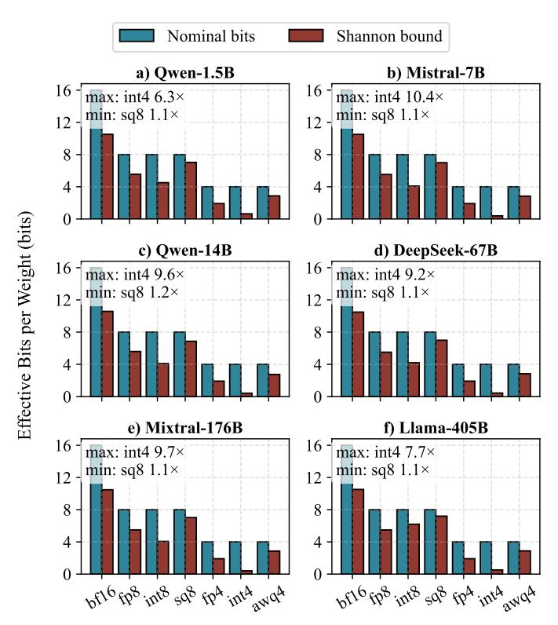

# B. Empirical Observations on Model Weights and Numerical Representations

To compute this bound in practice, we start by computing entropy at the granularity of each individual weight tensor and then aggregating the results across the entire model. For each layer l, we treat its weight matrix  $W^{(l)}$  as a collection of discrete symbols determined by the chosen numeric format (e.g., FP8 codes, INT4 values, per-channel quantized indices). We build an empirical histogram over these symbols and estimate the Shannon entropy

$$\mathcal{H}^{(l)} = -\sum_{i} p_i^{(l)} \log_2 p_i^{(l)},$$

where  $p_i^{(l)}$  is the empirical probability of symbol i within that tensor.

Because different layers contain different numbers of parameters, we compute the entropy of the full model as a symbol-weighted average of the per-layer entropies:

$$\mathcal{H}_{\text{model}} = \frac{\sum_{l} \mathcal{H}^{(l)} |W^{(l)}|}{\sum_{l} |W^{(l)}|},$$

where  $|W^{(l)}|$  is the number of elements in layer l. This yields the effective number of bits per weight required under any lossless encoding scheme.

We evaluate widely used open-source LLMs ranging from 1.5B to 405B parameters, including Qwen-1.5B [46], Mistral-7B [21], Qwen-14B [46], DeepSeek-67B [9], Mistral-176B [40], and Llama-405B [41]. Moreover, we examine the full spectrum of standard numeric formats such as bfloat16 (bf16), FP8-E5M2 (fp8), INT8, FP4-E2M1 (fp4), and INT4, as well as group-quantized formats from SmoothQuant [44] (sq8) and AWQ [29] (awq4), allowing us to quantify how much redundancy remains in current weight representations and assess how far existing numeric formats are from the theoretical limit.

Figure 2 shows that the effective bits of LLM weights are dramatically lower than their stored bitwidth, often by a factor of two to six. Across all models, bfloat16 exhibits about 4–5 bits of redundancy, corresponding to a potential 1.5× reduction in size. Here we refer to *redundancy* as the difference between the stored bitwidth and the estimated entropy of the weight distribution (in bits per weight). For example, if bfloat16 stores each weight using 16 bits but the measured entropy of the distribution is approximately

Fig. 2: Remaining entropy gap across models with different data types.

11–12 bits, then about 4–5 bits per weight represent statistical redundancy that can be removed by an optimal lossless coding scheme.

Even in extremely low-bit representations such as INT4 and FP4, substantial redundancy remains because the quantized weight distributions are highly skewed, with only a small subset of symbols appearing frequently due to the heavy-tailed distribution of LLM weights. As shown in Figure 2, these formats exhibit the largest entropy gaps, with entropy ratios reaching  $6{\text -}10\times$ , indicating significant unused capacity even at very low bitwidths.

In addition, widely deployed group-quantized formats such as SmoothQuant and AWQ adopt block-based scaling factors to reduce quantization error. While these schemes improve numerical accuracy, they still retain measurable redundancy, typically around  $1.1-1.3\times$  above their entropy bound, due to skewed symbol frequencies and the structured metadata introduced by per-group scaling.

These observations indicate that existing models store far more bits than their intrinsic information content requires, suggesting that substantial memory savings of up to ten times remain achievable without sacrificing accuracy.

# B. Empirical Observations on Model Weights and Numerical Representations

To compute this bound in practice, we start by computing entropy at the granularity of each individual weight tensor and then aggregating the results across the entire model. For each layer l, we treat its weight matrix  $W^{(l)}$  as a collection of discrete symbols determined by the chosen numeric format (e.g., FP8 codes, INT4 values, per-channel quantized indices). We build an empirical histogram over these symbols and estimate the Shannon entropy

$$\mathcal{H}^{(l)} = -\sum_{i} p_i^{(l)} \log_2 p_i^{(l)},$$

where  $p_i^{(l)}$  is the empirical probability of symbol i within that tensor.

Because different layers contain different numbers of parameters, we compute the entropy of the full model as a symbol-weighted average of the per-layer entropies:

$$\mathcal{H}_{\text{model}} = \frac{\sum_{l} \mathcal{H}^{(l)} |W^{(l)}|}{\sum_{l} |W^{(l)}|},$$

where  $|W^{(l)}|$  is the number of elements in layer l. This yields the effective number of bits per weight required under any lossless encoding scheme.

We evaluate widely used open-source LLMs ranging from 1.5B to 405B parameters, including Qwen-1.5B [46], Mistral-7B [21], Qwen-14B [46], DeepSeek-67B [9], Mistral-176B [40], and Llama-405B [41]. Moreover, we examine the full spectrum of standard numeric formats such as bfloat16 (bf16), FP8-E5M2 (fp8), INT8, FP4-E2M1 (fp4), and INT4, as well as group-quantized formats from SmoothQuant [44] (sq8) and AWQ [29] (awq4), allowing us to quantify how much redundancy remains in current weight representations and assess how far existing numeric formats are from the theoretical limit.

Figure 2 shows that the effective bits of LLM weights are dramatically lower than their stored bitwidth, often by a factor of two to six. Across all models, bfloat16 exhibits about 4–5 bits of redundancy, corresponding to a potential 1.5× reduction in size. Here we refer to *redundancy* as the difference between the stored bitwidth and the estimated entropy of the weight distribution (in bits per weight). For example, if bfloat16 stores each weight using 16 bits but the measured entropy of the distribution is approximately

Fig. 2: Remaining entropy gap across models with different data types.

11–12 bits, then about 4–5 bits per weight represent statistical redundancy that can be removed by an optimal lossless coding scheme.

Even in extremely low-bit representations such as INT4 and FP4, substantial redundancy remains because the quantized weight distributions are highly skewed, with only a small subset of symbols appearing frequently due to the heavy-tailed distribution of LLM weights. As shown in Figure 2, these formats exhibit the largest entropy gaps, with entropy ratios reaching  $6{\text -}10\times$ , indicating significant unused capacity even at very low bitwidths.

In addition, widely deployed group-quantized formats such as SmoothQuant and AWQ adopt block-based scaling factors to reduce quantization error. While these schemes improve numerical accuracy, they still retain measurable redundancy, typically around  $1.1-1.3\times$  above their entropy bound, due to skewed symbol frequencies and the structured metadata introduced by per-group scaling.

These observations indicate that existing models store far more bits than their intrinsic information content requires, suggesting that substantial memory savings of up to ten times remain achievable without sacrificing accuracy.

