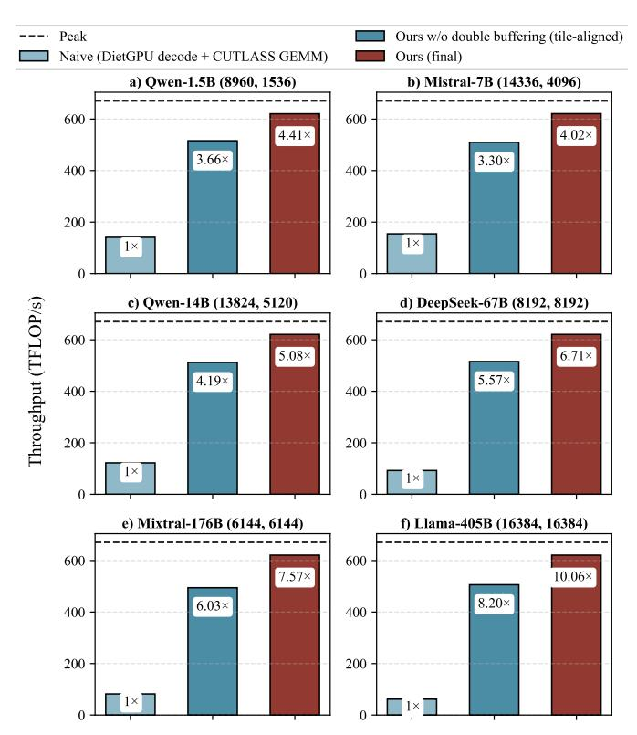
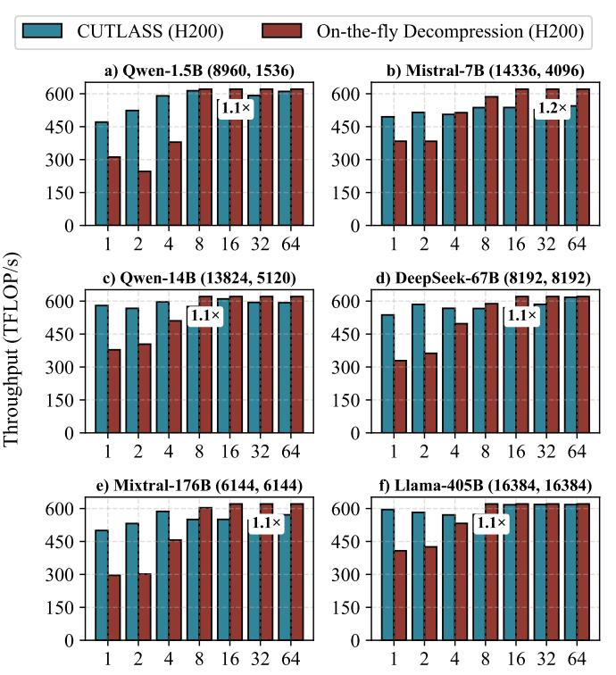

# C. End-to-End Performance Gains from Reduced Weight Memory Footprint

We evaluate the end-to-end inference impact of our reduced memory footprint under realistic device-memory budget constraints using the SGLang serving framework. We modify SGLang [50] to use our ANS-enabled GEMM backend for dense matrix multiplications, comparing it to the default CUTLASS-based kernels in the SGLang runtime.

Because our approach significantly reduces the memory footprint of model weights, it allows substantially larger query batches to fit within a fixed GPU memory budget. We therefore evaluate the resulting end-to-end throughput improvements under realistic inference workloads. Table II reports the memory breakdown, maximum feasible batch size, achieved throughput, and median time-per-output-token (TPOT) for Qwen-14B and Mixtral-176B across two representative sequence lengths (1024 and 2048). For Mixtral-176B, multi-GPU inference is implemented using expert parallelism (EP) across four GPUs. The reported throughput corresponds to measured execution time under SGLang's batching scheduler running on GPUs.

Although our on-the-fly decompression kernel introduces additional computation compared to a pure CUTLASS GEMM kernel used in existing LLM serving systems, reducing the weight footprint directly increases the effective batch size and enables higher serving throughput. For example, on a single A100 with sequence length 1024, Qwen-14B increases the maximum batch size from 47 to 75, improving throughput from 1131 to 1217 tokens/s  $(1.1\times)$ . For longer sequences (2048), throughput increases from 548 to 651 tokens/s  $(1.2\times)$ .

Fig. 7: Comparison between our on-the-fly decompression path and the NeuZip [\[17\]](#page-13-21) baseline across varying batch sizes on NVIDIA H200. Weight matrix dimensions are given as (a, b)

Fig. 8: Comparison between our on-the-fly decompression path and the DFloat11 [\[49\]](#page-14-7) baseline across varying batch sizes on NVIDIA H200. Weight matrix dimensions are given as (a, b)

The effect is more pronounced for larger models. On four A100 GPUs, Mixtral-176B increases the feasible batch size from 20 to 95 at sequence length 1024, resulting in a throughput improvement from 241 to 391 tokens/s (1.6×). At length 2048, throughput improves from 190 to 257 tokens/s (1.4×). These results highlight an important systemlevel effect: compression fundamentally shifts the bottleneck of LLM inference from device memory capacity to compute throughput. The gains come from the reduced weight memory, which allows more requests to share the KV-cache capacity, improving batching efficiency under realistic workloads.

We also report the median TPOT to capture the latency impact of the compressed execution path. Our design primarily targets throughput-oriented serving workloads by increasing the effective batch capacity under a fixed memory budget. While TPOT slightly increases due to the additional on-the-fly decompression cost, the increase is modest compared to the substantial throughput gains enabled by larger batching for the throughput-oriented LLM model serving.

## *D. Comparison to SOTA Lossless Compression LLM*

We compare our fused on-the-fly decompression pipeline with two recent lossless LLM compression systems, NeuZip [\[17\]](#page-13-21) and DFloat11 [\[49\]](#page-14-7) on NVIDIA H200 hardware. We evaluate six representative LLMs of different scales, and each subplot reports the achieved throughput in TFLOP/s as the batch size increases from 1 to 64 of a single layer of projection with 4096 input tokens. The annotation in each plot indicates the peak relative improvement of our method compared with baseline.

Both prior approaches target floating-point formats (e.g., FP16/BF16) and perform layerwise decompression, where an entire compressed layer must first be reconstructed in global memory before GEMM execution. This introduces additional memory traffic and synchronization overhead. In contrast, our method decodes compressed weights at tile granularity and feeds them directly into the GEMM pipeline. This eliminates global-memory materialization of decompressed layers and overlaps decompression with tensor-core computation.

Figure [7](#page-9-0) and Figure [8](#page-9-0) show that our approach outperforms both baselines across all evaluated models and batch sizes on NVIDIA H200. Compared with NeuZip, the fused pipeline achieves up to ∼ 10× higher throughput, while outperforming DFloat11 by ∼ 6–7×. These gains show that tight integration of entropy decoding with tiled GEMM execution is essential for high-performance compressed LLM inference.

#### *E. Performance Analysis*

To evaluate the performance of the on-the-fly decompression GPU kernel, we conducted three complementary experiments that examined the system from different perspectives. First, we present a step-by-step optimization breakdown that quantifies the performance improvement from a naive ANS decoder to our final fused decompression GEMM pipeline. Second, we evaluated kernel-level performance across different GPU architectures (A100 and H200) under a representative inference

Fig. 9: Breakdown of throughput improvements from a naive ANS decoder to the fused decompression GEMM.

workload with sequence length 4096. Finally, we compare our approach with KTransformer [\[5\]](#page-13-32), a system designed to handle out-of-memory (OOM) scenarios by offloading model weights, to demonstrate the end-to-end advantages of the compressionbased approach for large-model inference.

*1) Optimization breakdown of the fused decompression pipeline:* Figure [9](#page-10-0) shows the step-by-step throughput improvements from a naive GPU implementation (DietGPU ANS decode + CUTLASS GEMM) to our final fused decompression GEMM kernel.

The first improvement comes from aligning decompression with the GEMM tiling schedule. When decoding and GEMM are executed as separate stages, frequent synchronization and global-memory traffic between the two kernels is needed. Our tile-aligned pipeline eliminates these barriers by decoding weight tiles directly into the layout required by the GEMM microkernel, allowing decompression and computation to proceed in a tightly overlapped fashion. This optimization alone improves throughput by 3.3×–8.2× across models (e.g., 3.66× for Qwen-1.5B and 8.20× for Llama-405B).

Despite achieving decompression throughput at the GPU register level in the TB/s range, the decoding stage can still slow down the overall GEMM execution. Therefore, we introduce double buffering in shared memory to prefetch and decode the next tile while the current tile is being consumed by GEMM. This producer–consumer pipeline hides most of the decompression latency and further increases utilization of tensor cores. With this optimization, the final kernel achieves 4.0×–10.1× speedup over the naive baseline (e.g., 4.41× for Qwen-1.5B, 6.71× for DeepSeek-67B, and 10.06× for Llama-405B). The gains become more pronounced for larger matrices, where the decompression overhead can be better amortized and the overlapped pipeline keeps the compute units closer to the peak GEMM throughput.

*2) Cross-GPU kernel performance on A100 and H200:* Figure [10](#page-11-0) and Figure [11](#page-11-0) compare our fused on-the-fly decompression kernel with the CUTLASS baseline across varying batch sizes on A100 and H200 GPUs. Across both architectures, throughput increases with batch size as tensor-core utilization improves. As batching grows, our implementation approaches the performance of the native CUTLASS GEMM and in several cases slightly exceeds it.

On A100, our kernel achieves performance close to the baseline across all evaluated models, typically within about 1.0×–1.1× of CUTLASS at larger batch sizes. This shows that integrating tile-level decompression into the GEMM pipeline introduces minimal overhead while maintaining high tensorcore utilization.

The advantage becomes more visible on H200. Due to its larger on-chip memory capacity and improved memory subsystem, the tile-level pipeline can overlap decompression and computation more effectively. As a result, our implementation not only matches but occasionally surpasses the CUTLASS baseline, achieving up to about 1.2× speedup at larger batch sizes. These results demonstrate that the fused decompression GEMM design scales well across GPU architectures and becomes increasingly effective as the batch size grows.

*3) End-to-End comparison with KTransformer under memory constraints:* Figure [12](#page-12-0) reports the prefill-stage throughput of a single representative linear layer drawn from six LLMs, comparing our on-the-fly decompression path against KTransformer across varying batch sizes. In KTransformer, the raw full-precision weight matrix for this layer does not fit into GPU memory, requiring the layer weight to reside in CPU memory and be streamed over PCIe during execution.

With our lossless tile-level compression, the compressed form of the same layer fits fully in GPU memory. As a result, execution remains entirely on-device, eliminating CPU–GPU streaming and yielding consistently higher throughput, up to 7.7× in our layer-level evaluations. This demonstrates that our method provides a practical alternative for improving out-ofmemory performance, enabling high throughput without any loss of numerical accuracy.

Figure [13](#page-12-0) shows that the decode stage exhibits even larger improvements, where up to 18.1× throughput improvements are achieved, as weight access becomes the dominant bottleneck when the baseline must stream parameters over PCIe. By eliminating these host–device transfers, our on-the-fly decompression path substantially increases throughput.

#### *F. Metadata Overhead Analysis*

We explicitly quantify the metadata footprint of our ANScompressed tiles. Each compressed tile stores a per-tile offset entry into the compressed buffer, while a single ANS codebook

Fig. 10: Comparison between our on-the-fly decompression path and the CUTLASS [\[34\]](#page-14-14) baseline across varying batch sizes with 4096 input tokens on NVIDIA A100. Weight matrix dimensions are given as (a, b)

is shared across all tiles in the layer. The compact representation is therefore

$$Metadata = \underbrace{4 B \cdot N_{tiles}}_{offset table} + \underbrace{(2^b \cdot 4 B)}_{shared codebook}, \qquad (3)$$

where b is the ANS probability bits (default b = 12). For fp16 weights, the tile count is Ntiles = (K/Ktile) · (N/Ntile) and we report both percentage of uncompressed size and the effective-bit overhead (16 × metadata/weight).

*a) A100 (32*×*128):* The overhead on global memory is only 0.052%–0.108% of fp16 weights, i.e., an effective-bit overhead of 0.0083–0.0173 bits/weight. This is sufficiently small that the end-to-end compression rate remains close to the Shannon bound for the payload entropy.

*b) H200 (64*×*256):* Since H200 has a larger share memory size compared to A100, it allows large tile size up to 64×256, and the metadata overhead becomes only 0.015%– 0.072% of uncompressed fp16 weights, corresponding to 0.0024–0.0115 effective bits per weight. In this regime, the overhead is further reduced, so the achieved bitrate is very close to the Shannon limit.

## VII. RELATED WORK

Data compression on GPU. GPU-based compression has been explored extensively in HPC and ML systems to reduce memory traffic and accelerate data movement. nvCOMP [\[35\]](#page-14-15) is the most widely deployed GPU compression library, offering

Fig. 11: Comparison between our on-the-fly decompression path and the CUTLASS [\[34\]](#page-14-14) baseline across varying batch sizes with 4096 input tokens on NVIDIA H200. Weight matrix dimensions are given as (a, b)

TABLE III: Metadata overhead for bfloat16 weights (shared codebook + offset table).

| Model        |       | A100 (32×128)        |        | H200 (64×256) |                      |        |  |
|--------------|-------|----------------------|--------|---------------|----------------------|--------|--|
|              | KB    | % of layer Eff. bits |        | KB            | % of layer Eff. bits |        |  |
| Qwen-1.5B    | 29.1  | 0.108%               | 0.0173 | 19.3          | 0.072%               | 0.0115 |  |
| Mistral-7B   | 72.0  | 0.063%               | 0.0100 | 30.0          | 0.026%               | 0.0042 |  |
| Qwen-14B     | 83.5  | 0.060%               | 0.0097 | 32.9          | 0.024%               | 0.0038 |  |
| DeepSeek-67B | 80.0  | 0.061%               | 0.0098 | 32.0          | 0.024%               | 0.0039 |  |
| Mixtral-176B | 52.0  | 0.071%               | 0.0113 | 25.0          | 0.034%               | 0.0054 |  |
| Llama-405B   | 272.0 | 0.052%               | 0.0083 | 80.0          | 0.015%               | 0.0024 |  |

optimized CUDA implementations of LZ4, Snappy, GDeflate, and Bitcomp. However, nvCOMP is closed source and exposes only coarse-grained, host-driven APIs, preventing developers from triggering decompression from inside GPU kernels or at higher granularity. Such lack of device-level control makes it impossible to fuse decompression directly into GEMM pipelines or overlap decoding with computation. Although more entropy-efficient codecs exist, integrating them into LLM inference requires tight alignment with tile-level weight access. Our work addresses this gap via tile-granular ANS decompression tightly coupled with GEMM execution, enabling optimizations that nvCOMP's opaque interface cannot support. NVIDIA inline compression is a hardware mechanism that compresses cache lines in the GPU memory hierarchy to reduce DRAM traffic; it is designed for general workloads

Fig. 12: Comparison between our on-the-fly decompression path and the KTransformer [\[5\]](#page-13-32) baseline across varying batch sizes in the prefill stage with a 4096-token sequence length. Weight matrix dimensions are given as (a, b)

Fig. 13: Comparison between our on-the-fly decompression path and the KTransformer [\[5\]](#page-13-32) baseline across varying batch sizes in the decode stage. Weight matrix dimensions are given as (a, b)

without application-level knowledge. In contrast, our work focuses on model-aware compression of LLM weights and targets the inherent redundancy in the weight distribution itself. Rather than relying on opportunistic hardware compression, our approach enables near Shannon's limit compression through distribution-aware encoding integrated with the inference pipeline. As a result, the two techniques operate at different layers of the system stack and are complementary.

Model compression with GPU codecs. LLM.265 [\[45\]](#page-14-16) repurposes video codecs (H.264/H.265) as tensor compressors for LLMs. While leveraging NVENC/NVDEC hardware is attractive, video engines sustain only ∼1.1–1.3 GB/s, two to three orders of magnitude below HBM bandwidth, making them the bottleneck. Furthermore, optimizing for perceptual quality rather than numerical fidelity yields accuracy degradation exceeding 5% at sub-3-bit. Our method is strictly lossless and designed for GPU-resident LLM inference.

Quantization, pruning, and low-rank compression. Extensive work reduces model size using lossy compression techniques, including low-bit quantization [\[10\]](#page-13-12), [\[18\]](#page-13-14), [\[25\]](#page-13-15), [\[29\]](#page-13-16), group-wise and adaptive quantization [\[15\]](#page-13-13), [\[29\]](#page-13-16), [\[33\]](#page-13-17), [\[36\]](#page-14-4), [\[44\]](#page-14-5), pruning [\[16\]](#page-13-8), [\[31\]](#page-13-11), [\[47\]](#page-14-3), and low-rank decomposition [\[20\]](#page-13-9), [\[26\]](#page-13-10), [\[39\]](#page-14-2). While effective, these methods inevitably introduce approximation error or accuracy loss. Our approach is orthogonal: it is fully lossless and can further compress quantized or pruned models. As our entropy analysis shows, even low-bit formats such as FP4, INT4, SmoothQuant, and AWQ retain significant statistical redundancy that lossless compression can exploit.

# C. End-to-End Performance Gains from Reduced Weight Memory Footprint

We evaluate the end-to-end inference impact of our reduced memory footprint under realistic device-memory budget constraints using the SGLang serving framework. We modify SGLang [50] to use our ANS-enabled GEMM backend for dense matrix multiplications, comparing it to the default CUTLASS-based kernels in the SGLang runtime.

Because our approach significantly reduces the memory footprint of model weights, it allows substantially larger query batches to fit within a fixed GPU memory budget. We therefore evaluate the resulting end-to-end throughput improvements under realistic inference workloads. Table II reports the memory breakdown, maximum feasible batch size, achieved throughput, and median time-per-output-token (TPOT) for Qwen-14B and Mixtral-176B across two representative sequence lengths (1024 and 2048). For Mixtral-176B, multi-GPU inference is implemented using expert parallelism (EP) across four GPUs. The reported throughput corresponds to measured execution time under SGLang's batching scheduler running on GPUs.

Although our on-the-fly decompression kernel introduces additional computation compared to a pure CUTLASS GEMM kernel used in existing LLM serving systems, reducing the weight footprint directly increases the effective batch size and enables higher serving throughput. For example, on a single A100 with sequence length 1024, Qwen-14B increases the maximum batch size from 47 to 75, improving throughput from 1131 to 1217 tokens/s  $(1.1\times)$ . For longer sequences (2048), throughput increases from 548 to 651 tokens/s  $(1.2\times)$ .

Fig. 7: Comparison between our on-the-fly decompression path and the NeuZip [\[17\]](#page-13-21) baseline across varying batch sizes on NVIDIA H200. Weight matrix dimensions are given as (a, b)

Fig. 8: Comparison between our on-the-fly decompression path and the DFloat11 [\[49\]](#page-14-7) baseline across varying batch sizes on NVIDIA H200. Weight matrix dimensions are given as (a, b)

The effect is more pronounced for larger models. On four A100 GPUs, Mixtral-176B increases the feasible batch size from 20 to 95 at sequence length 1024, resulting in a throughput improvement from 241 to 391 tokens/s (1.6×). At length 2048, throughput improves from 190 to 257 tokens/s (1.4×). These results highlight an important systemlevel effect: compression fundamentally shifts the bottleneck of LLM inference from device memory capacity to compute throughput. The gains come from the reduced weight memory, which allows more requests to share the KV-cache capacity, improving batching efficiency under realistic workloads.

We also report the median TPOT to capture the latency impact of the compressed execution path. Our design primarily targets throughput-oriented serving workloads by increasing the effective batch capacity under a fixed memory budget. While TPOT slightly increases due to the additional on-the-fly decompression cost, the increase is modest compared to the substantial throughput gains enabled by larger batching for the throughput-oriented LLM model serving.

## *D. Comparison to SOTA Lossless Compression LLM*

We compare our fused on-the-fly decompression pipeline with two recent lossless LLM compression systems, NeuZip [\[17\]](#page-13-21) and DFloat11 [\[49\]](#page-14-7) on NVIDIA H200 hardware. We evaluate six representative LLMs of different scales, and each subplot reports the achieved throughput in TFLOP/s as the batch size increases from 1 to 64 of a single layer of projection with 4096 input tokens. The annotation in each plot indicates the peak relative improvement of our method compared with baseline.

Both prior approaches target floating-point formats (e.g., FP16/BF16) and perform layerwise decompression, where an entire compressed layer must first be reconstructed in global memory before GEMM execution. This introduces additional memory traffic and synchronization overhead. In contrast, our method decodes compressed weights at tile granularity and feeds them directly into the GEMM pipeline. This eliminates global-memory materialization of decompressed layers and overlaps decompression with tensor-core computation.

Figure [7](#page-9-0) and Figure [8](#page-9-0) show that our approach outperforms both baselines across all evaluated models and batch sizes on NVIDIA H200. Compared with NeuZip, the fused pipeline achieves up to ∼ 10× higher throughput, while outperforming DFloat11 by ∼ 6–7×. These gains show that tight integration of entropy decoding with tiled GEMM execution is essential for high-performance compressed LLM inference.

#### *E. Performance Analysis*

To evaluate the performance of the on-the-fly decompression GPU kernel, we conducted three complementary experiments that examined the system from different perspectives. First, we present a step-by-step optimization breakdown that quantifies the performance improvement from a naive ANS decoder to our final fused decompression GEMM pipeline. Second, we evaluated kernel-level performance across different GPU architectures (A100 and H200) under a representative inference

Fig. 9: Breakdown of throughput improvements from a naive ANS decoder to the fused decompression GEMM.

workload with sequence length 4096. Finally, we compare our approach with KTransformer [\[5\]](#page-13-32), a system designed to handle out-of-memory (OOM) scenarios by offloading model weights, to demonstrate the end-to-end advantages of the compressionbased approach for large-model inference.

*1) Optimization breakdown of the fused decompression pipeline:* Figure [9](#page-10-0) shows the step-by-step throughput improvements from a naive GPU implementation (DietGPU ANS decode + CUTLASS GEMM) to our final fused decompression GEMM kernel.

The first improvement comes from aligning decompression with the GEMM tiling schedule. When decoding and GEMM are executed as separate stages, frequent synchronization and global-memory traffic between the two kernels is needed. Our tile-aligned pipeline eliminates these barriers by decoding weight tiles directly into the layout required by the GEMM microkernel, allowing decompression and computation to proceed in a tightly overlapped fashion. This optimization alone improves throughput by 3.3×–8.2× across models (e.g., 3.66× for Qwen-1.5B and 8.20× for Llama-405B).

Despite achieving decompression throughput at the GPU register level in the TB/s range, the decoding stage can still slow down the overall GEMM execution. Therefore, we introduce double buffering in shared memory to prefetch and decode the next tile while the current tile is being consumed by GEMM. This producer–consumer pipeline hides most of the decompression latency and further increases utilization of tensor cores. With this optimization, the final kernel achieves 4.0×–10.1× speedup over the naive baseline (e.g., 4.41× for Qwen-1.5B, 6.71× for DeepSeek-67B, and 10.06× for Llama-405B). The gains become more pronounced for larger matrices, where the decompression overhead can be better amortized and the overlapped pipeline keeps the compute units closer to the peak GEMM throughput.

*2) Cross-GPU kernel performance on A100 and H200:* Figure [10](#page-11-0) and Figure [11](#page-11-0) compare our fused on-the-fly decompression kernel with the CUTLASS baseline across varying batch sizes on A100 and H200 GPUs. Across both architectures, throughput increases with batch size as tensor-core utilization improves. As batching grows, our implementation approaches the performance of the native CUTLASS GEMM and in several cases slightly exceeds it.

On A100, our kernel achieves performance close to the baseline across all evaluated models, typically within about 1.0×–1.1× of CUTLASS at larger batch sizes. This shows that integrating tile-level decompression into the GEMM pipeline introduces minimal overhead while maintaining high tensorcore utilization.

The advantage becomes more visible on H200. Due to its larger on-chip memory capacity and improved memory subsystem, the tile-level pipeline can overlap decompression and computation more effectively. As a result, our implementation not only matches but occasionally surpasses the CUTLASS baseline, achieving up to about 1.2× speedup at larger batch sizes. These results demonstrate that the fused decompression GEMM design scales well across GPU architectures and becomes increasingly effective as the batch size grows.

*3) End-to-End comparison with KTransformer under memory constraints:* Figure [12](#page-12-0) reports the prefill-stage throughput of a single representative linear layer drawn from six LLMs, comparing our on-the-fly decompression path against KTransformer across varying batch sizes. In KTransformer, the raw full-precision weight matrix for this layer does not fit into GPU memory, requiring the layer weight to reside in CPU memory and be streamed over PCIe during execution.

With our lossless tile-level compression, the compressed form of the same layer fits fully in GPU memory. As a result, execution remains entirely on-device, eliminating CPU–GPU streaming and yielding consistently higher throughput, up to 7.7× in our layer-level evaluations. This demonstrates that our method provides a practical alternative for improving out-ofmemory performance, enabling high throughput without any loss of numerical accuracy.

Figure [13](#page-12-0) shows that the decode stage exhibits even larger improvements, where up to 18.1× throughput improvements are achieved, as weight access becomes the dominant bottleneck when the baseline must stream parameters over PCIe. By eliminating these host–device transfers, our on-the-fly decompression path substantially increases throughput.

#### *F. Metadata Overhead Analysis*

We explicitly quantify the metadata footprint of our ANScompressed tiles. Each compressed tile stores a per-tile offset entry into the compressed buffer, while a single ANS codebook

Fig. 10: Comparison between our on-the-fly decompression path and the CUTLASS [\[34\]](#page-14-14) baseline across varying batch sizes with 4096 input tokens on NVIDIA A100. Weight matrix dimensions are given as (a, b)

is shared across all tiles in the layer. The compact representation is therefore

$$Metadata = \underbrace{4 B \cdot N_{tiles}}_{offset table} + \underbrace{(2^b \cdot 4 B)}_{shared codebook}, \qquad (3)$$

where b is the ANS probability bits (default b = 12). For fp16 weights, the tile count is Ntiles = (K/Ktile) · (N/Ntile) and we report both percentage of uncompressed size and the effective-bit overhead (16 × metadata/weight).

*a) A100 (32*×*128):* The overhead on global memory is only 0.052%–0.108% of fp16 weights, i.e., an effective-bit overhead of 0.0083–0.0173 bits/weight. This is sufficiently small that the end-to-end compression rate remains close to the Shannon bound for the payload entropy.

*b) H200 (64*×*256):* Since H200 has a larger share memory size compared to A100, it allows large tile size up to 64×256, and the metadata overhead becomes only 0.015%– 0.072% of uncompressed fp16 weights, corresponding to 0.0024–0.0115 effective bits per weight. In this regime, the overhead is further reduced, so the achieved bitrate is very close to the Shannon limit.

## VII. RELATED WORK

Data compression on GPU. GPU-based compression has been explored extensively in HPC and ML systems to reduce memory traffic and accelerate data movement. nvCOMP [\[35\]](#page-14-15) is the most widely deployed GPU compression library, offering

Fig. 11: Comparison between our on-the-fly decompression path and the CUTLASS [\[34\]](#page-14-14) baseline across varying batch sizes with 4096 input tokens on NVIDIA H200. Weight matrix dimensions are given as (a, b)

TABLE III: Metadata overhead for bfloat16 weights (shared codebook + offset table).

| Model        |       | A100 (32×128)        |        | H200 (64×256) |                      |        |  |
|--------------|-------|----------------------|--------|---------------|----------------------|--------|--|
|              | KB    | % of layer Eff. bits |        | KB            | % of layer Eff. bits |        |  |
| Qwen-1.5B    | 29.1  | 0.108%               | 0.0173 | 19.3          | 0.072%               | 0.0115 |  |
| Mistral-7B   | 72.0  | 0.063%               | 0.0100 | 30.0          | 0.026%               | 0.0042 |  |
| Qwen-14B     | 83.5  | 0.060%               | 0.0097 | 32.9          | 0.024%               | 0.0038 |  |
| DeepSeek-67B | 80.0  | 0.061%               | 0.0098 | 32.0          | 0.024%               | 0.0039 |  |
| Mixtral-176B | 52.0  | 0.071%               | 0.0113 | 25.0          | 0.034%               | 0.0054 |  |
| Llama-405B   | 272.0 | 0.052%               | 0.0083 | 80.0          | 0.015%               | 0.0024 |  |

optimized CUDA implementations of LZ4, Snappy, GDeflate, and Bitcomp. However, nvCOMP is closed source and exposes only coarse-grained, host-driven APIs, preventing developers from triggering decompression from inside GPU kernels or at higher granularity. Such lack of device-level control makes it impossible to fuse decompression directly into GEMM pipelines or overlap decoding with computation. Although more entropy-efficient codecs exist, integrating them into LLM inference requires tight alignment with tile-level weight access. Our work addresses this gap via tile-granular ANS decompression tightly coupled with GEMM execution, enabling optimizations that nvCOMP's opaque interface cannot support. NVIDIA inline compression is a hardware mechanism that compresses cache lines in the GPU memory hierarchy to reduce DRAM traffic; it is designed for general workloads

Fig. 12: Comparison between our on-the-fly decompression path and the KTransformer [\[5\]](#page-13-32) baseline across varying batch sizes in the prefill stage with a 4096-token sequence length. Weight matrix dimensions are given as (a, b)

Fig. 13: Comparison between our on-the-fly decompression path and the KTransformer [\[5\]](#page-13-32) baseline across varying batch sizes in the decode stage. Weight matrix dimensions are given as (a, b)

without application-level knowledge. In contrast, our work focuses on model-aware compression of LLM weights and targets the inherent redundancy in the weight distribution itself. Rather than relying on opportunistic hardware compression, our approach enables near Shannon's limit compression through distribution-aware encoding integrated with the inference pipeline. As a result, the two techniques operate at different layers of the system stack and are complementary.

Model compression with GPU codecs. LLM.265 [\[45\]](#page-14-16) repurposes video codecs (H.264/H.265) as tensor compressors for LLMs. While leveraging NVENC/NVDEC hardware is attractive, video engines sustain only ∼1.1–1.3 GB/s, two to three orders of magnitude below HBM bandwidth, making them the bottleneck. Furthermore, optimizing for perceptual quality rather than numerical fidelity yields accuracy degradation exceeding 5% at sub-3-bit. Our method is strictly lossless and designed for GPU-resident LLM inference.

Quantization, pruning, and low-rank compression. Extensive work reduces model size using lossy compression techniques, including low-bit quantization [\[10\]](#page-13-12), [\[18\]](#page-13-14), [\[25\]](#page-13-15), [\[29\]](#page-13-16), group-wise and adaptive quantization [\[15\]](#page-13-13), [\[29\]](#page-13-16), [\[33\]](#page-13-17), [\[36\]](#page-14-4), [\[44\]](#page-14-5), pruning [\[16\]](#page-13-8), [\[31\]](#page-13-11), [\[47\]](#page-14-3), and low-rank decomposition [\[20\]](#page-13-9), [\[26\]](#page-13-10), [\[39\]](#page-14-2). While effective, these methods inevitably introduce approximation error or accuracy loss. Our approach is orthogonal: it is fully lossless and can further compress quantized or pruned models. As our entropy analysis shows, even low-bit formats such as FP4, INT4, SmoothQuant, and AWQ retain significant statistical redundancy that lossless compression can exploit.

