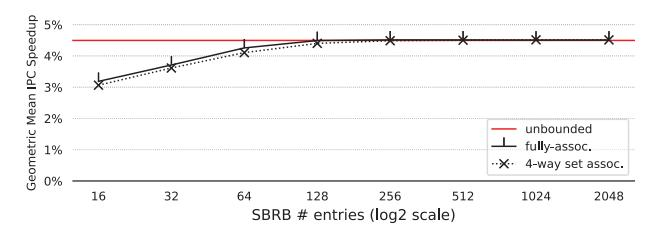
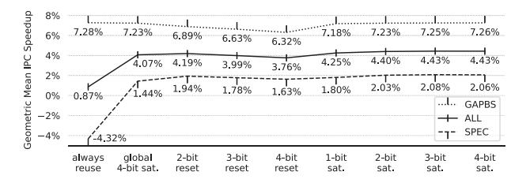
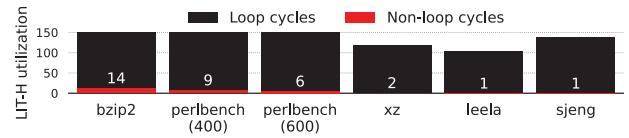

# *H. Delaying the squash action*

On detecting a misprediction, a conventional processor may immediately squash instructions younger than the mispredicted branch. But with squashed-branch reuse, it becomes profitable to defer the squash action. Deferment allows more squashedpath branches to finish execution and deposit their outcomes in the SBRB.

A deferred squash must not delay the progress of resolvedpath instructions in the pipeline, either directly (by delaying their fetch) or indirectly (by delaying their execution). With that in mind, we propose a simple deferred squash mechanism. The squashed-path instructions before the rename stage are squashed immediately, ensuring resolved-path instructions are fetched unimpeded. The squashed-path instructions after the rename stage continue dispatching, issuing, and executing like usual, until the first resolved-path bundle reaches the rename stage. Once the first resolved-path bundle reaches the rename stage, the remaining squashed-path instructions are squashed, releasing the resources held by them. Our results assume this deferred squash mechanism unless stated otherwise.

- *1) Immediate squash:* Our processor uses the MIPS R10K *branch mask* construct [46]. Each fetched branch reserves a bit in a global branch mask (and by extension the corresponding checkpoint in a checkpoint buffer). Each fetched instruction inherits a copy of the current global branch mask as its *branch mask*, and in this way every instruction knows all unresolved branches that are older than it. When a branch resolves, it broadcasts a one-hot *branch mask* (only its bit set) and a correct/incorrect signal. If correct, its bit is cleared in all instructions' *branch masks* and the global branch mask. If incorrect, (1) the global branch mask is restored to the branch's own *branch mask* (reflecting only unresolved branches older than it), (2) FIFO pointers (Free List head pointer, ROB/LQ/SQ/BQ tail pointers), the rename map table, and the SS are restored from the branch's checkpoint, (3) the fetch through dispatch stages are squashed, and (4) any instruction in the IQ or execution lanes with the branch's bit set in its *branch mask* self-invalidates (it is younger than the branch).
- *2) Deferred squash:* Steps 1-3, above, are performed immediately except the dispatch stage is not squashed (note that physical registers and ROB/LQ/SQ entries for the dispatch bundle were allocated in the rename stage prior, so immediately rolling back Free List head and ROB/LQ/SQ tails does not interfere). A 1-bit state machine transitions from *idle* to *delayed squash*. Alongside the state machine is information about the mispredicted branch: its one-hot *branch mask* (its identity) and its *branch mask* indicating branches older than it. When a resolved-path bundle reaches the rename stage, given that the state is *delayed squash*: the dispatch stage is squashed (applicable if a bundle remains), step 4, above, is performed (invalidate younger instructions still in the IQ and execution lanes), and the state machine transitions to *idle*.

Suppose brX is the branch posted with the state machine in the *delayed squash* state. Another branch, brY, may resolve as correct or incorrect during the deferment period. BrY is younger than brX if brY's bit is not set in brX's *branch mask*, in which case brY is silenced. Otherwise, brY is older. If older brY resolves as correct, its bit is cleared in *branch masks* everywhere as usual. If older brY resolves as incorrect: brX finalizes its squash (in the same manner as when a resolved-path bundle reaches rename), steps 1-3, above, are performed immediately with respect to brY, brY replaces brX alongside the state machine, and the state remains *delayed squash*.

## *I. Putting it All Together*

Figure 9 provides a summary picture of our proposed squashed-branch reuse in the fetch stage. New components are annotated with yellow stars: signature management (including LIT-H, LIT-E, SS, and SS checkpoints), Squashed-Branch Reuse Buffer (SBRB), and confidence counters added to the BTB.

Table II shows default parameters for the new components and cost accounting in terms of bytes of storage.

TABLE II: Cost accounting.

| LIT-H      | 150 entries, 62 bits/entry                    | 1,162.5 B   |
|------------|-----------------------------------------------|-------------|
| LIT-E      | 300 entries, 66 bits/entry                    | 2,475 B     |
|            | (PC:62, dir:1, popcnt:3)                      |             |
| SS         | hpc:8, sig:32                                 | 45.375 B    |
|            | stack: 8 entries, 40 bits/entry               |             |
|            | stack pointer:3                               |             |
| SS chkpts  | (64 chkpts + 1 ret. SS) x SS cost             | 2,949.375 B |
| SBRB       | 256 entries, 4-way assoc., 30 bits/entry      | 960 B       |
|            | (valid:1, lru:2, tag:26, outcome:1)           |             |
| BTB conf.  | 8K entries, 3 bits/entry                      | 3,072 B     |
| BQ         | 592 entries, +8 bits/entry                    | 592 B       |
| extra bits | (+6 for ret. SS: hdr/exit/dir/popcnt:1/1/1/3) |             |
|            | (+2 bits for conf. training)                  |             |
| Total      |                                               | 11 KB       |

## IV. METHODOLOGY

We evaluate our squashed-branch reuse mechanism using an in-house, RISC-V, execution-driven, execute-at-execute superscalar processor simulator. Default parameters of the baseline superscalar processor are shown in Table III. Default parameters of new components are in Section III-I, Table II.

TABLE III: Default parameters of the baseline superscalar processor.

| fetch-to-execute depth             | 12 stages                        |
|------------------------------------|----------------------------------|
| fetch/dispatch/issue/retire widths | 8/8/8/8                          |
| execution lanes                    | 2 ld/st, 4 simple ALU,           |
|                                    | 2 complex/fp ALU                 |
| ROB/PRF/LQ/SQ/IQ                   | 512/576/256/256/128              |
| branch checkpoints                 | 64                               |
| squash model                       | delayed (Sec. III-H)             |
| branch predictor                   | 64KB TAGE-SC-L [40]              |
| BTB                                | 8K entries, 4-way                |
| RAS                                | 64 entries                       |
| L1 I\$                             | 64KB, 4-way, 64B block           |
| L1 D\$                             | 64KB, 4-way, 64B block,          |
|                                    | 4-cyc. load-to-use               |
| L2 \$                              | 1MB, 8-way, 64B block, 10 cyc.   |
| L3 \$                              | 8MB, 16-way, 128B block, 30 cyc. |
| main memory latency                | 100 cyc.                         |

We compiled the SPEC 2006 and SPEC 2017 integer benchmarks and GAPBS benchmarks [8] using LLVM (repository: [3], branch: release/16.x, commit: 464bda7, optimization flag: -O3). The SPEC 2017 benchmark, exchange 2, is not available as it has Fortran source, which our LLVM RISC-V compiler cannot compile. For each SPEC benchmark, we use its ref input that has the highest weighted-average MPKI over all its SimPoints. For GAPBS benchmarks, we use three real-world input graphs: Road, Twitter, and Web [8]. Up to ten 100-million-instruction SimPoints [41] were generated for each benchmark.

We added an LLVM compiler pass to generate loop descriptors. As explained in Section III-C4, profiling is used to count dynamic instances of each loop's header PC, and loop descriptors are placed in the LIS from highest count to lowest count. All SimPoints of all train inputs were used for profiling SPEC. Two synthetic graphs (Kronecker and random, both with 219 vertices) and one alternate real-world graph (road-PA [26]) were used for profiling GAPBS – these are full train runs, not SimPoints.

Fig. 9: Summary picture of our proposed squashed-branch reuse in the fetch stage.

#### V. RESULTS

## A. Primary Results

Figure 10 sorts the benchmarks (separately for GAPBS on the left and SPEC on the right) based on the difference between baseline mispredictions-per-kilo-instructions (MPKI) and SBRB MPKI (i.e.,  $MPKI_{base} - MPKI_{SBRB}$ ), from highest difference to lowest difference. The top row of graphs shows MPKI of the baseline predictor (the curve labeled "64KB TAGE-SC-L MPKI") and the baseline predictor augmented with SBRB (the curve labeled "SBRB MPKI"). The bottom row of graphs shows percentage increase in instructions-per-cycle over the baseline (IPC speedup) for four different configurations: (1) 192KB TAGE-SC-L: the baseline branch predictor scaled up to 192KB. (2) SYRANT: the state-of-art; only SYRANT's comparable standalone branch prediction feature, squashed-branch reuse in the fetch stage, is implemented; the ABL is amply sized to never stall fetch (592 entries, the maximum number of in-flight instructions); the SBL has 512 entries (same as the ROB); instead of a single global confidence counter, this implementation has the benefit of our per-branch confidence counters. (3) SBRB. (4) SBRBliteral-stack: same as SBRB except the signature is derived from a 256-entry literal stack (Sec. III-D1); the literal stack's contents are run through the SHA-256 secure hash algorithm to get a 256-bit fingerprint; a CRC pass reduces the fingerprint to a 32-bit signature.

Simply scaling the baseline branch predictor (192KB) is of little help for most benchmarks. It yields 6.43% speedup for 445.gobmk and 5.18% speedup for 602.gcc, the best performance among the four configurations. Unfortunately, 192KB will have prohibitively high prediction latency and

Benchmarks with higher baseline MPKI benefit more from SBRB and SYRANT than benchmarks with lower baseline MPKI. This is to be expected because SBRB and SYRANT exploit branch outcomes in the shadow of older mispredicted branches, *i.e.*, they prevent *additional* mispredictions when

there are mispredictions. SBRB outperforms SYRANT on all benchmarks except 401.bzip2 but even in this case the difference is small. Bzip2's mainQSort3() function (when compiled with -O3) has non-loop cycles, resulting in a fixed signature despite iterative behavior.

SBRB and SBRB-literal-stack, which uses a collision-resistant cryptographic hash of the full identifier, are nearly indistinguishable, evidence that LFSR-based signatures are effective proxies for full identifiers.

Figure 11 provides geometric mean speedups. SBRB yields a geometric mean speedup of 7.25% for GAPBS (as high as 21.2% for bfs-twitter), 2.08% for SPEC (as high as 14.1% for 473.astar\_rivers), and 4.43% over all benchmarks, with no slowdowns on individual benchmarks. SYRANT yields 2.36%, 1.27%, and 1.77%, respectively.

Tc-twitter (tc with the twitter input graph) is interesting because it has the highest MPKI (35) but little squashed-branch reuse. Yet tc-road (also high MPKI of 27) shows significant reuse and 14% speedup. A majority of tc's mispredictions occur within a triply-nested loop (Figure 12).

Innermost loop L1 contains a single branch - its loop branch - which is hard-to-predict due to variable trip-count. For a given visit to L2: L1's trip-count in the  $i^{th}$  iteration of L2 depends on L1's trip-count in the (i - $1)^{th}$  iteration of L2. As a result, a squashed outcome of L1's loop branch is reliable in the first iteration of L2, and not so much in subsequent iterations. This also means that there's a chance for the number of reliable L1 outcomes to exceed unreliable ones if L2 itself has a short trip-count. This is the case for tc-road but not tc-twitter. The saturating confidence counter a) tends to enable reuse if the overall number of reliable outcomes is more than unreliable ones (tc-road fits this

Fig. 12: tc loops.

category), or b) tends to disable reuse otherwise (tc-twitter

Fig. 10: MPKI and speedup for all benchmarks.

Fig. 11: Geometric mean speedups.

fits this category). Both tc-road and tc-twitter stand to improve with a more discerning context-aware confidence mechanism, which is left for future work.

## *B. Design Space Exploration*

We first explore the SBRB using maximum settings for signature management parameters: {64-entry stack, 64-bit *sig*, 64-bit *hpc*, unbounded LIT-H/LIT-E}. Then, we explore the signature management parameters using the selected SBRB.

*1) SBRB:* Figure 13 shows performance as SBRB size (no. of entries) is successively doubled, for both a 4-way setassociative SBRB and a fully-associative SBRB. The horizontal line shows performance with an unbounded SBRB. The curves converge at 256 entries with peak performance.

Fig. 13: Performance of different SBRB configurations.

*2) Signature Management Parameters:* Figure 14 shows the performance impact of individually reducing each signature management parameter while keeping the other parameters at their maximum settings (64-entry stack, 64-bit *sig*, 64-bit *hpc*, unbounded LIT-H/LIT-E). LIT-E size is 2x LIT-H size (the graph is only labeled with the latter). These results, results on individual benchmarks (not shown), and cost considerations, led to the default parameter selections of Table II. Performance of this configuration is shown with the red line in the graph ("final pick").

Fig. 14: Performance as each signature management parameter is reduced.

Most benchmarks are not impacted by the limited-size LIT-H/E, but some are. Figure 15 shows benchmarks for which the difference [% speedup with unbounded LIT-H/E] - [% speedup with 150/300 LIT-H/E] is at least 0.1% (other parameters at maximum settings like Figure 14).

Fig. 15: Benchmarks sensitive to limited-size LIT-H/E.

## *C. Confidence Mechanism*

Figure 16 compares the performance of various confidence mechanisms. Considering all benchmarks ("ALL"), 3 bit and 4-bit saturating counters perform best and equally well. Saturating counters (increment/decrement, confident when above midpoint threshold) outperform resetting counters (increment/reset-to-0, confident when at maximum). Always reusing squashed outcomes (unconditionally confident) and a single global 4-bit saturating counter are competitive in GAPBS benchmarks. On the other hand, SPEC benchmarks are richer in complexity, both in terms of number of static branches and CIDD/CIDI relationships among them. They also have higher baseline branch prediction accuracy. Thus, in general, reliable performance – protection against slowdowns or degraded speedups – requires per-branch confidence.

Fig. 16: Performance of various confidence mechanisms.

## *D. Impact of calls in signature, signature in key*

To gauge the importance of accounting for multiple calls to the same function in the same loop and iteration, we measured the impact of excluding calls from the signature ("SBRB, no calls"). Without calls, speedup decreases from 4.43% to 4.34% for all benchmarks, from 2.08% to 1.91% for SPEC, and from 7.25% to 7.24% for GAPBS. Almost all the decrease in SPEC speedup (and thus overall speedup) can be attributed to the four benchmarks shown in Figure 17a.

To gauge the importance of a signature at all, Figure 17b compares the performance of including both branch PC and signature in the key ("SBRB") versus a PC-only key ("SBRB, PC-only key"). The results show that signatures are needed to identify dynamic branches both uniquely and invariantly.

Fig. 17: Gauging importance of (a) calls in the signature, and (b) signatures in the key.

## *E. Sensitivity to Baseline Core Parameters*

Figure 18 shows how the speedup afforded by the SBRB varies with certain baseline core parameters. A core with 192KB TAGE-SC-L sees only slightly lower speedup (4.36%) than a core with 64KB TAGE-SC-L (4.43%). A core with 1.5x the default window size (1.5x ROB/PRF/LQ/SQ/IQ/chkpts) sees a larger speedup (4.91%) than a core with the default window size. This is also the case for a core with a deeper pipeline (5.57%). A core with immediate squash sees noticeably less speedup (2.22%) than a core with our delayed squash implementation, due to fewer squashed-path branches executing before the squash.7 Table IV shows the number of branches and completed branches in the shadow of a squash (averaged over all squashes), both when the misprediction is detected and when the squash is finalized. Immediate and deferred are similar except that the percentage of completed branches in the shadow increases from 25% at detection to 45% when the squash is finalized. Fetch-to-rename latency is 8 cycles (default pipeline). This is the extra time available between detection and finalized squash.

Fig. 18: Sensitivity to predictor size, window size, fetch-toexecute pipeline depth, and squash model.

TABLE IV: Total/completed branches in shadow of squash.

|                                      | immediate  | deferred   |
|--------------------------------------|------------|------------|
| total branches, misp. detected       | 17.68      | 18.22      |
| completed branches, misp. detected   | 4.25 (24%) | 4.49 (25%) |
| total branches, squash finalized     | same       | 18.22      |
| completed branches, squash finalized | same       | 8.19 (45%) |

## *F. Loop vs. Non-Loop Cycles*

To gauge the significance of non-loop cycles, we generate a LIS containing both loop and non-loop cycles, rank-ordered based on profiling as usual. For non-loop cycles, we selected one of the entry blocks as the header block. We then construct a 150/300 LIT-H/E from the LIS. Only the six benchmarks in Fig. 19 have at least one non-loop cycle in the top 150 cycles.

Fig. 19: Benchmarks with ≥ 1 non-loop cycle in top 150.

## VI. SUMMARY

Exploiting control independence (CI) to reduce branch misprediction penalties has received significant attention in the literature, ranging from complex CI-instruction-preserving approaches to squash reuse in the rename stage. There has been much less attention paid to *squashed-branch reuse in the fetch stage* despite its value proposition: changes localized to the fetch unit and outright elimination of some branch mispredictions. While not a new idea [4], [16], [29], there has been little exploration of the key challenge of aligning a dynamic branch's counterparts on the squashed path and resolved path. We proposed a novel concept and implementation, invariant signatures, to enable precise alignment despite arbitrary unrelated control-flow changes between the squashed and resolved paths.

7Note that the baseline (no SBRB) with our delayed squash implementation performs at least as well as the baseline (no SBRB) with immediate squash because the resolved path is not delayed (Section III-H). In fact, on average, it performs 1.55% better due to executing more CI loads (and initiating more cache misses) before the squash action.

## REFERENCES

- [1] https://en.wikipedia.org/wiki/Linear-feedback shift register.
- [2] "LLVM compiler infrastructure user guides." [Online]. Available: https://llvm.org/docs/LoopTerminology.html
- [3] "LLVM this is the llvm organization on github for the llvm project: a collection of modular and reusable compiler and toolchain technologies." [Online]. Available: https://github.com/llvm/llvm-project.git
- [4] H. Akkary, S. T. Srinivasan, and K. Lai, "Recycling waste: exploiting wrong-path execution to improve branch prediction," in *Proceedings of the 17th Annual International Conference on Supercomputing*, ser. ICS '03. New York, NY, USA: Association for Computing Machinery, 2003, p. 12–21. [Online]. Available: https://doi.org/10.1145/782814.782819
- [5] A. S. Al-Zawawi, V. K. Reddy, E. Rotenberg, and H. H. Akkary, "Transparent control independence (tci)," in *Proceedings of the 34th Annual International Symposium on Computer Architecture*, June 2007, pp. 448–459.
- [6] T. Anderson and M. Dahlin, *Operating Systems: Principles and Practice*, 2nd ed. Recursive books, 2014.
- [7] H. Ando, "Performance improvement by prioritizing the issue of the instructions in unconfident branch slices," in *2018 51st Annual IEEE/ACM International Symposium on Microarchitecture (MICRO)*, 2018, pp. 82– 94.
- [8] S. Beamer, K. Asanovic, and D. Patterson, "The GAP benchmark ´ suite," 2017. [Online]. Available: https://arxiv.org/abs/1508.03619
- [9] R. S. Chappell, J. Stark, S. P. Kim, S. K. Reinhardt, and Y. N. Patt, "Simultaneous subordinate microthreading (ssmt)," in *Proceedings of the 26th International Symposium on Computer Architecture*, May 1999, pp. 186–195.
- [10] R. S. Chappell, F. Tseng, A. Yoaz, and Y. N. Patt, "Difficult-path branch prediction using subordinate microthreads," in *Proceedings of the 29th International Symposium on Computer Architecture*, May 2002, pp. 307– 317.
- [11] A. Chauhan, J. Gaur, Z. Sperber, F. Sala, L. Rappoport, A. Yoaz, and S. Subramoney, "Auto-predication of critical branches," in *2020 ACM/IEEE 47th Annual International Symposium on Computer Architecture (ISCA)*, 2020, pp. 92–104.
- [12] C.-Y. Cher and T. Vijaykumar, "Skipper: a microarchitecture for exploiting control-flow independence," in *Proceedings of the 34th ACM/IEEE International Symposium on Microarchitecture*, December 2001, pp. 4– 15.
- [13] Y. Chou, J. Fung, and J. P. Shen, "Reducing branch misprediction penalties via dynamic control independence detection," in *Proceedings of the 13th International Conference on Supercomputing*, May 1999, pp. 109–118.
- [14] A. Deshmukh, L. Cai, and Y. N. Patt, "Timely, efficient, and accurate branch precomputation," in *2024 57th IEEE/ACM International Symposium on Microarchitecture (MICRO)*, 2024, pp. 480–492.
- [15] S. Eyerman, W. Heirman, S. Van Den Steen, and I. Hur, "Enabling branch-mispredict level parallelism by selectively flushing instructions," in *MICRO-54: 54th Annual IEEE/ACM International Symposium on Microarchitecture*, ser. MICRO '21. New York, NY, USA: Association for Computing Machinery, 2021, p. 767–778. [Online]. Available: https://doi.org/10.1145/3466752.3480045
- [16] W. P. Galliher, "Squashed branch reuse," Master's thesis, North Carolina State University, March 2015, available at http://www.lib.ncsu.edu/ resolver/1840.16/11102.
- [17] A. Gandhi, H. Akkary, and S. Srinivasan, "Reducing branch misprediction penalty via selective branch recovery," in *Proceedings of the 10th International Symposium on High Performance Computer Architecture*, February 2004, pp. 254–264.
- [18] A. Garg and M. C. Huang, "A performance-correctness explicitlydecoupled architecture," in *Proceedings of the 41st International Symposium on Microarchitecture*, November 2008, pp. 306–317.
- [19] A. D. Hilton and A. Roth, "Ginger: control independence using tag rewriting," in *Proceedings of the 34th Annual International Symposium on Computer Architecture*, June 2007, p. 436–447.
- [20] Q. Kang and T. E. Carlson, "Multi-stream squash reuse for controlindependent processors," in *Proceedings of the 58th IEEE/ACM International Symposium on Microarchitecture*, October 2025, pp. 504–518.
- [21] H. Kim, J. A. Joao, O. Mutlu, and Y. N. Patt, "Diverge-merge processor (dmp): Dynamic predicated execution of complex control-flow graphs based on frequently executed paths," in *2006 39th Annual IEEE/ACM*

- *International Symposium on Microarchitecture (MICRO'06)*, 2006, pp. 53–64.
- [22] A. Klauser, T. Austin, D. Grunwald, and B. Calder, "Dynamic hammock predication for non-predicated instruction set architectures," in *1998 International Conference on Parallel Architectures and Compilation Techniques*, 1998, pp. 278–285.
- [23] S. Kondguli and M. Huang, "R3-dla (reduce, reuse, recycle): A more efficient approach to decoupled look-ahead architectures," in *Proceedings of the 25th International Symposium on High-Performance Computer Architecture*, February 2019, pp. 533–544.
- [24] V. R. Kothinti Naresh, R. Sheikh, A. Perais, and H. W. Cain, "Spf: Selective pipeline flush," in *Proceedings of the 36th IEEE International Conference on Computer Design*, October 2018, pp. 152–155.
- [25] C. Lattner and V. Adve, "LLVM: a compilation framework for lifelong program analysis & transformation," in *Proceedings of the International Symposium on Code Generation and Optimization*, March 2004, pp. 75– 86.
- [26] J. Leskovec and A. Krevl, "SNAP Datasets: Stanford large network dataset collection," Jun. 2014. [Online]. Available: http://snap.stanford. edu/data
- [27] H. Litz, G. Ayers, and P. Ranganathan, "Crisp: critical slice prefetching," in *Proceedings of the 27th ACM International Conference on Architectural Support for Programming Languages and Operating Systems*, ser. ASPLOS '22. New York, NY, USA: Association for Computing Machinery, 2022, p. 300–313. [Online]. Available: https://doi.org/10.1145/3503222.3507745
- [28] R. Parihar and M. C. Huang, "Accelerating decoupled look-ahead via weak dependence removal: A metaheuristic approach," in *Proceedings of the 20th International Symposium on High-Performance Computer Architecture*, February 2014, pp. 662–677.
- [29] N. Premillieu and A. Seznec, "Syrant: Symmetric resource allocation on not-taken and taken paths," *ACM Transactions on Architecture and Code Optimization*, vol. 8, no. 4, pp. 1–20, January 2012.
- [30] S. Pruett and Y. Patt, "Branch runahead: An alternative to branch prediction for impossible to predict branches," in *MICRO-54: 54th Annual IEEE/ACM International Symposium on Microarchitecture*, ser. MICRO '21. New York, NY, USA: Association for Computing Machinery, 2021, p. 804–815. [Online]. Available: https://doi.org/10. 1145/3466752.3480053
- [31] Z. Purser, K. Sundaramoorthy, and E. Rotenberg, "A study of slipstream processors," in *Proceedings of the 33rd International Symposium on Microarchitecture*, December 2000, pp. 269–280.
- [32] ——, "Slipstream memory hierarchies," North Carolina State University, Tech. Rep., 2002.
- [33] V. K. Reddy, E. Rotenberg, and S. Parthasarathy, "Understanding prediction-based partial redundant threading for low-overhead, highcoverage fault tolerance," in *Proceedings of the 12th International Conference on Architectural Support for Programming Languages and Operating Systems*, ser. ASPLOS XII. New York, NY, USA: Association for Computing Machinery, 2006, p. 83–94. [Online]. Available: https://doi.org/10.1145/1168857.1168869
- [34] E. Rotenberg, Q. Jacobson, and J. Smith, "A study of control independence in superscalar processors," in *Proceedings of the 5th International Symposium on High-Performance Computer Architecture*, January 1999, pp. 115–124.
- [35] E. Rotenberg and J. Smith, "Control independence in trace processors," in *Proceedings of the 32nd Annual ACM/IEEE International Symposium on Microarchitecture*, November 1999, pp. 4–15.
- [36] E. Rotenberg, Q. Jacobson, and J. E. Smith, "A study of control independence in superscalar processors," University of Wisconsin – Madison, Tech. Rep. #1389, December 1998.
- [37] A. Roth and G. Sohi, "Register integration: a simple and efficient implementation of squash reuse," in *Proceedings of the 33rd Annual IEEE/ACM International Symposium on Microarchitecture*, December 2000, pp. 223–234.
- [38] A. Roth and G. S. Sohi, "Speculative data-driven multithreading," in *Proceedings of the 7th Annual IEEE International Symposium on High-Performance Computer Architecture*, ser. HPCA '01, 2001, pp. 37–48.
- [39] A. Seshadri and E. Rotenberg, "Delinquent loop pre-execution using predicated helper threads," in *2025 IEEE International Symposium on High Performance Computer Architecture (HPCA)*, 2025, pp. 44–58.
- [40] A. Seznec, "Tage-sc-l branch predictors again," in *5th JILP Workshop on Computer Architecture Competitions (JWAC-5): Championship Branch Prediction (CBP-5)*, June 2016.

- [41] T. Sherwood, E. Perelman, G. Hamerly, and B. Calder, "Automatically characterizing large scale program behavior," in *Proceedings of the 10th International Conference on Architectural Support for Programming Languages and Operating Systems*, October 2002, pp. 45–57.
- [42] A. Sodani and G. Sohi, "Dynamic instruction reuse," in *Proceedings of the 24th Annual International Symposium on Computer Architecture*, June 1997, pp. 194–205.
- [43] V. Srinivasan, R. B. R. Chowdhury, and E. Rotenberg, "Slipstream processors revisited: Exploiting branch sets," in *2020 ACM/IEEE 47th Annual International Symposium on Computer Architecture (ISCA)*, 2020, pp. 105–117.
- [44] W. Stahnke, "Primitive binary polynomials," *Mathematics of Computation*, vol. 27, no. 124, pp. 977–980, 1973.
- [45] K. Sundaramoorthy, Z. Purser, and E. Rotenberg, "Slipstream processors: Improving both performance and fault tolerance," in *Proceedings of the 9th International Conference on Architectural Support for Programming Languages and Operating Systems*, November 2000, pp. 257–268.
- [46] K. Yeager, "The mips r10000 superscalar microprocessor," *IEEE Micro*, vol. 16, no. 2, pp. 28–41, 1996.
- [47] C. Zilles and G. Sohi, "Execution-based prediction using speculative slices," in *Proceedings of the 28th Annual International Symposium on Computer Architecture*, ser. ISCA '01. New York, NY, USA: Association for Computing Machinery, 2001, p. 2–13. [Online]. Available: https://doi.org/10.1145/379240.379246
- [48] C. B. Zilles and G. S. Sohi, "Understanding the backward slices of performance degrading instructions," *SIGARCH Comput. Archit. News*, vol. 28, no. 2, p. 172–181, May 2000. [Online]. Available: https://doi.org/10.1145/342001.339676# *H. Delaying the squash action*

On detecting a misprediction, a conventional processor may immediately squash instructions younger than the mispredicted branch. But with squashed-branch reuse, it becomes profitable to defer the squash action. Deferment allows more squashedpath branches to finish execution and deposit their outcomes in the SBRB.

A deferred squash must not delay the progress of resolvedpath instructions in the pipeline, either directly (by delaying their fetch) or indirectly (by delaying their execution). With that in mind, we propose a simple deferred squash mechanism. The squashed-path instructions before the rename stage are squashed immediately, ensuring resolved-path instructions are fetched unimpeded. The squashed-path instructions after the rename stage continue dispatching, issuing, and executing like usual, until the first resolved-path bundle reaches the rename stage. Once the first resolved-path bundle reaches the rename stage, the remaining squashed-path instructions are squashed, releasing the resources held by them. Our results assume this deferred squash mechanism unless stated otherwise.

- *1) Immediate squash:* Our processor uses the MIPS R10K *branch mask* construct [46]. Each fetched branch reserves a bit in a global branch mask (and by extension the corresponding checkpoint in a checkpoint buffer). Each fetched instruction inherits a copy of the current global branch mask as its *branch mask*, and in this way every instruction knows all unresolved branches that are older than it. When a branch resolves, it broadcasts a one-hot *branch mask* (only its bit set) and a correct/incorrect signal. If correct, its bit is cleared in all instructions' *branch masks* and the global branch mask. If incorrect, (1) the global branch mask is restored to the branch's own *branch mask* (reflecting only unresolved branches older than it), (2) FIFO pointers (Free List head pointer, ROB/LQ/SQ/BQ tail pointers), the rename map table, and the SS are restored from the branch's checkpoint, (3) the fetch through dispatch stages are squashed, and (4) any instruction in the IQ or execution lanes with the branch's bit set in its *branch mask* self-invalidates (it is younger than the branch).
- *2) Deferred squash:* Steps 1-3, above, are performed immediately except the dispatch stage is not squashed (note that physical registers and ROB/LQ/SQ entries for the dispatch bundle were allocated in the rename stage prior, so immediately rolling back Free List head and ROB/LQ/SQ tails does not interfere). A 1-bit state machine transitions from *idle* to *delayed squash*. Alongside the state machine is information about the mispredicted branch: its one-hot *branch mask* (its identity) and its *branch mask* indicating branches older than it. When a resolved-path bundle reaches the rename stage, given that the state is *delayed squash*: the dispatch stage is squashed (applicable if a bundle remains), step 4, above, is performed (invalidate younger instructions still in the IQ and execution lanes), and the state machine transitions to *idle*.

Suppose brX is the branch posted with the state machine in the *delayed squash* state. Another branch, brY, may resolve as correct or incorrect during the deferment period. BrY is younger than brX if brY's bit is not set in brX's *branch mask*, in which case brY is silenced. Otherwise, brY is older. If older brY resolves as correct, its bit is cleared in *branch masks* everywhere as usual. If older brY resolves as incorrect: brX finalizes its squash (in the same manner as when a resolved-path bundle reaches rename), steps 1-3, above, are performed immediately with respect to brY, brY replaces brX alongside the state machine, and the state remains *delayed squash*.

## *I. Putting it All Together*

Figure 9 provides a summary picture of our proposed squashed-branch reuse in the fetch stage. New components are annotated with yellow stars: signature management (including LIT-H, LIT-E, SS, and SS checkpoints), Squashed-Branch Reuse Buffer (SBRB), and confidence counters added to the BTB.

Table II shows default parameters for the new components and cost accounting in terms of bytes of storage.

TABLE II: Cost accounting.

| LIT-H      | 150 entries, 62 bits/entry                    | 1,162.5 B   |
|------------|-----------------------------------------------|-------------|
| LIT-E      | 300 entries, 66 bits/entry                    | 2,475 B     |
|            | (PC:62, dir:1, popcnt:3)                      |             |
| SS         | hpc:8, sig:32                                 | 45.375 B    |
|            | stack: 8 entries, 40 bits/entry               |             |
|            | stack pointer:3                               |             |
| SS chkpts  | (64 chkpts + 1 ret. SS) x SS cost             | 2,949.375 B |
| SBRB       | 256 entries, 4-way assoc., 30 bits/entry      | 960 B       |
|            | (valid:1, lru:2, tag:26, outcome:1)           |             |
| BTB conf.  | 8K entries, 3 bits/entry                      | 3,072 B     |
| BQ         | 592 entries, +8 bits/entry                    | 592 B       |
| extra bits | (+6 for ret. SS: hdr/exit/dir/popcnt:1/1/1/3) |             |
|            | (+2 bits for conf. training)                  |             |
| Total      |                                               | 11 KB       |

## IV. METHODOLOGY

We evaluate our squashed-branch reuse mechanism using an in-house, RISC-V, execution-driven, execute-at-execute superscalar processor simulator. Default parameters of the baseline superscalar processor are shown in Table III. Default parameters of new components are in Section III-I, Table II.

TABLE III: Default parameters of the baseline superscalar processor.

| fetch-to-execute depth             | 12 stages                        |
|------------------------------------|----------------------------------|
| fetch/dispatch/issue/retire widths | 8/8/8/8                          |
| execution lanes                    | 2 ld/st, 4 simple ALU,           |
|                                    | 2 complex/fp ALU                 |
| ROB/PRF/LQ/SQ/IQ                   | 512/576/256/256/128              |
| branch checkpoints                 | 64                               |
| squash model                       | delayed (Sec. III-H)             |
| branch predictor                   | 64KB TAGE-SC-L [40]              |
| BTB                                | 8K entries, 4-way                |
| RAS                                | 64 entries                       |
| L1 I\$                             | 64KB, 4-way, 64B block           |
| L1 D\$                             | 64KB, 4-way, 64B block,          |
|                                    | 4-cyc. load-to-use               |
| L2 \$                              | 1MB, 8-way, 64B block, 10 cyc.   |
| L3 \$                              | 8MB, 16-way, 128B block, 30 cyc. |
| main memory latency                | 100 cyc.                         |

We compiled the SPEC 2006 and SPEC 2017 integer benchmarks and GAPBS benchmarks [8] using LLVM (repository: [3], branch: release/16.x, commit: 464bda7, optimization flag: -O3). The SPEC 2017 benchmark, exchange 2, is not available as it has Fortran source, which our LLVM RISC-V compiler cannot compile. For each SPEC benchmark, we use its ref input that has the highest weighted-average MPKI over all its SimPoints. For GAPBS benchmarks, we use three real-world input graphs: Road, Twitter, and Web [8]. Up to ten 100-million-instruction SimPoints [41] were generated for each benchmark.

We added an LLVM compiler pass to generate loop descriptors. As explained in Section III-C4, profiling is used to count dynamic instances of each loop's header PC, and loop descriptors are placed in the LIS from highest count to lowest count. All SimPoints of all train inputs were used for profiling SPEC. Two synthetic graphs (Kronecker and random, both with 219 vertices) and one alternate real-world graph (road-PA [26]) were used for profiling GAPBS – these are full train runs, not SimPoints.

Fig. 9: Summary picture of our proposed squashed-branch reuse in the fetch stage.

#### V. RESULTS

## A. Primary Results

Figure 10 sorts the benchmarks (separately for GAPBS on the left and SPEC on the right) based on the difference between baseline mispredictions-per-kilo-instructions (MPKI) and SBRB MPKI (i.e.,  $MPKI_{base} - MPKI_{SBRB}$ ), from highest difference to lowest difference. The top row of graphs shows MPKI of the baseline predictor (the curve labeled "64KB TAGE-SC-L MPKI") and the baseline predictor augmented with SBRB (the curve labeled "SBRB MPKI"). The bottom row of graphs shows percentage increase in instructions-per-cycle over the baseline (IPC speedup) for four different configurations: (1) 192KB TAGE-SC-L: the baseline branch predictor scaled up to 192KB. (2) SYRANT: the state-of-art; only SYRANT's comparable standalone branch prediction feature, squashed-branch reuse in the fetch stage, is implemented; the ABL is amply sized to never stall fetch (592 entries, the maximum number of in-flight instructions); the SBL has 512 entries (same as the ROB); instead of a single global confidence counter, this implementation has the benefit of our per-branch confidence counters. (3) SBRB. (4) SBRBliteral-stack: same as SBRB except the signature is derived from a 256-entry literal stack (Sec. III-D1); the literal stack's contents are run through the SHA-256 secure hash algorithm to get a 256-bit fingerprint; a CRC pass reduces the fingerprint to a 32-bit signature.

Simply scaling the baseline branch predictor (192KB) is of little help for most benchmarks. It yields 6.43% speedup for 445.gobmk and 5.18% speedup for 602.gcc, the best performance among the four configurations. Unfortunately, 192KB will have prohibitively high prediction latency and

Benchmarks with higher baseline MPKI benefit more from SBRB and SYRANT than benchmarks with lower baseline MPKI. This is to be expected because SBRB and SYRANT exploit branch outcomes in the shadow of older mispredicted branches, *i.e.*, they prevent *additional* mispredictions when

there are mispredictions. SBRB outperforms SYRANT on all benchmarks except 401.bzip2 but even in this case the difference is small. Bzip2's mainQSort3() function (when compiled with -O3) has non-loop cycles, resulting in a fixed signature despite iterative behavior.

SBRB and SBRB-literal-stack, which uses a collision-resistant cryptographic hash of the full identifier, are nearly indistinguishable, evidence that LFSR-based signatures are effective proxies for full identifiers.

Figure 11 provides geometric mean speedups. SBRB yields a geometric mean speedup of 7.25% for GAPBS (as high as 21.2% for bfs-twitter), 2.08% for SPEC (as high as 14.1% for 473.astar\_rivers), and 4.43% over all benchmarks, with no slowdowns on individual benchmarks. SYRANT yields 2.36%, 1.27%, and 1.77%, respectively.

Tc-twitter (tc with the twitter input graph) is interesting because it has the highest MPKI (35) but little squashed-branch reuse. Yet tc-road (also high MPKI of 27) shows significant reuse and 14% speedup. A majority of tc's mispredictions occur within a triply-nested loop (Figure 12).

Innermost loop L1 contains a single branch - its loop branch - which is hard-to-predict due to variable trip-count. For a given visit to L2: L1's trip-count in the  $i^{th}$  iteration of L2 depends on L1's trip-count in the (i - $1)^{th}$  iteration of L2. As a result, a squashed outcome of L1's loop branch is reliable in the first iteration of L2, and not so much in subsequent iterations. This also means that there's a chance for the number of reliable L1 outcomes to exceed unreliable ones if L2 itself has a short trip-count. This is the case for tc-road but not tc-twitter. The saturating confidence counter a) tends to enable reuse if the overall number of reliable outcomes is more than unreliable ones (tc-road fits this

Fig. 12: tc loops.

category), or b) tends to disable reuse otherwise (tc-twitter

Fig. 10: MPKI and speedup for all benchmarks.

Fig. 11: Geometric mean speedups.

fits this category). Both tc-road and tc-twitter stand to improve with a more discerning context-aware confidence mechanism, which is left for future work.

## *B. Design Space Exploration*

We first explore the SBRB using maximum settings for signature management parameters: {64-entry stack, 64-bit *sig*, 64-bit *hpc*, unbounded LIT-H/LIT-E}. Then, we explore the signature management parameters using the selected SBRB.

*1) SBRB:* Figure 13 shows performance as SBRB size (no. of entries) is successively doubled, for both a 4-way setassociative SBRB and a fully-associative SBRB. The horizontal line shows performance with an unbounded SBRB. The curves converge at 256 entries with peak performance.

Fig. 13: Performance of different SBRB configurations.

*2) Signature Management Parameters:* Figure 14 shows the performance impact of individually reducing each signature management parameter while keeping the other parameters at their maximum settings (64-entry stack, 64-bit *sig*, 64-bit *hpc*, unbounded LIT-H/LIT-E). LIT-E size is 2x LIT-H size (the graph is only labeled with the latter). These results, results on individual benchmarks (not shown), and cost considerations, led to the default parameter selections of Table II. Performance of this configuration is shown with the red line in the graph ("final pick").

Fig. 14: Performance as each signature management parameter is reduced.

Most benchmarks are not impacted by the limited-size LIT-H/E, but some are. Figure 15 shows benchmarks for which the difference [% speedup with unbounded LIT-H/E] - [% speedup with 150/300 LIT-H/E] is at least 0.1% (other parameters at maximum settings like Figure 14).

Fig. 15: Benchmarks sensitive to limited-size LIT-H/E.

## *C. Confidence Mechanism*

Figure 16 compares the performance of various confidence mechanisms. Considering all benchmarks ("ALL"), 3 bit and 4-bit saturating counters perform best and equally well. Saturating counters (increment/decrement, confident when above midpoint threshold) outperform resetting counters (increment/reset-to-0, confident when at maximum). Always reusing squashed outcomes (unconditionally confident) and a single global 4-bit saturating counter are competitive in GAPBS benchmarks. On the other hand, SPEC benchmarks are richer in complexity, both in terms of number of static branches and CIDD/CIDI relationships among them. They also have higher baseline branch prediction accuracy. Thus, in general, reliable performance – protection against slowdowns or degraded speedups – requires per-branch confidence.

Fig. 16: Performance of various confidence mechanisms.

## *D. Impact of calls in signature, signature in key*

To gauge the importance of accounting for multiple calls to the same function in the same loop and iteration, we measured the impact of excluding calls from the signature ("SBRB, no calls"). Without calls, speedup decreases from 4.43% to 4.34% for all benchmarks, from 2.08% to 1.91% for SPEC, and from 7.25% to 7.24% for GAPBS. Almost all the decrease in SPEC speedup (and thus overall speedup) can be attributed to the four benchmarks shown in Figure 17a.

To gauge the importance of a signature at all, Figure 17b compares the performance of including both branch PC and signature in the key ("SBRB") versus a PC-only key ("SBRB, PC-only key"). The results show that signatures are needed to identify dynamic branches both uniquely and invariantly.

Fig. 17: Gauging importance of (a) calls in the signature, and (b) signatures in the key.

## *E. Sensitivity to Baseline Core Parameters*

Figure 18 shows how the speedup afforded by the SBRB varies with certain baseline core parameters. A core with 192KB TAGE-SC-L sees only slightly lower speedup (4.36%) than a core with 64KB TAGE-SC-L (4.43%). A core with 1.5x the default window size (1.5x ROB/PRF/LQ/SQ/IQ/chkpts) sees a larger speedup (4.91%) than a core with the default window size. This is also the case for a core with a deeper pipeline (5.57%). A core with immediate squash sees noticeably less speedup (2.22%) than a core with our delayed squash implementation, due to fewer squashed-path branches executing before the squash.7 Table IV shows the number of branches and completed branches in the shadow of a squash (averaged over all squashes), both when the misprediction is detected and when the squash is finalized. Immediate and deferred are similar except that the percentage of completed branches in the shadow increases from 25% at detection to 45% when the squash is finalized. Fetch-to-rename latency is 8 cycles (default pipeline). This is the extra time available between detection and finalized squash.

Fig. 18: Sensitivity to predictor size, window size, fetch-toexecute pipeline depth, and squash model.

TABLE IV: Total/completed branches in shadow of squash.

|                                      | immediate  | deferred   |
|--------------------------------------|------------|------------|
| total branches, misp. detected       | 17.68      | 18.22      |
| completed branches, misp. detected   | 4.25 (24%) | 4.49 (25%) |
| total branches, squash finalized     | same       | 18.22      |
| completed branches, squash finalized | same       | 8.19 (45%) |

## *F. Loop vs. Non-Loop Cycles*

To gauge the significance of non-loop cycles, we generate a LIS containing both loop and non-loop cycles, rank-ordered based on profiling as usual. For non-loop cycles, we selected one of the entry blocks as the header block. We then construct a 150/300 LIT-H/E from the LIS. Only the six benchmarks in Fig. 19 have at least one non-loop cycle in the top 150 cycles.

Fig. 19: Benchmarks with ≥ 1 non-loop cycle in top 150.

## VI. SUMMARY

Exploiting control independence (CI) to reduce branch misprediction penalties has received significant attention in the literature, ranging from complex CI-instruction-preserving approaches to squash reuse in the rename stage. There has been much less attention paid to *squashed-branch reuse in the fetch stage* despite its value proposition: changes localized to the fetch unit and outright elimination of some branch mispredictions. While not a new idea [4], [16], [29], there has been little exploration of the key challenge of aligning a dynamic branch's counterparts on the squashed path and resolved path. We proposed a novel concept and implementation, invariant signatures, to enable precise alignment despite arbitrary unrelated control-flow changes between the squashed and resolved paths.

7Note that the baseline (no SBRB) with our delayed squash implementation performs at least as well as the baseline (no SBRB) with immediate squash because the resolved path is not delayed (Section III-H). In fact, on average, it performs 1.55% better due to executing more CI loads (and initiating more cache misses) before the squash action.

## REFERENCES

- [1] https://en.wikipedia.org/wiki/Linear-feedback shift register.
- [2] "LLVM compiler infrastructure user guides." [Online]. Available: https://llvm.org/docs/LoopTerminology.html
- [3] "LLVM this is the llvm organization on github for the llvm project: a collection of modular and reusable compiler and toolchain technologies." [Online]. Available: https://github.com/llvm/llvm-project.git
- [4] H. Akkary, S. T. Srinivasan, and K. Lai, "Recycling waste: exploiting wrong-path execution to improve branch prediction," in *Proceedings of the 17th Annual International Conference on Supercomputing*, ser. ICS '03. New York, NY, USA: Association for Computing Machinery, 2003, p. 12–21. [Online]. Available: https://doi.org/10.1145/782814.782819
- [5] A. S. Al-Zawawi, V. K. Reddy, E. Rotenberg, and H. H. Akkary, "Transparent control independence (tci)," in *Proceedings of the 34th Annual International Symposium on Computer Architecture*, June 2007, pp. 448–459.
- [6] T. Anderson and M. Dahlin, *Operating Systems: Principles and Practice*, 2nd ed. Recursive books, 2014.
- [7] H. Ando, "Performance improvement by prioritizing the issue of the instructions in unconfident branch slices," in *2018 51st Annual IEEE/ACM International Symposium on Microarchitecture (MICRO)*, 2018, pp. 82– 94.
- [8] S. Beamer, K. Asanovic, and D. Patterson, "The GAP benchmark ´ suite," 2017. [Online]. Available: https://arxiv.org/abs/1508.03619
- [9] R. S. Chappell, J. Stark, S. P. Kim, S. K. Reinhardt, and Y. N. Patt, "Simultaneous subordinate microthreading (ssmt)," in *Proceedings of the 26th International Symposium on Computer Architecture*, May 1999, pp. 186–195.
- [10] R. S. Chappell, F. Tseng, A. Yoaz, and Y. N. Patt, "Difficult-path branch prediction using subordinate microthreads," in *Proceedings of the 29th International Symposium on Computer Architecture*, May 2002, pp. 307– 317.
- [11] A. Chauhan, J. Gaur, Z. Sperber, F. Sala, L. Rappoport, A. Yoaz, and S. Subramoney, "Auto-predication of critical branches," in *2020 ACM/IEEE 47th Annual International Symposium on Computer Architecture (ISCA)*, 2020, pp. 92–104.
- [12] C.-Y. Cher and T. Vijaykumar, "Skipper: a microarchitecture for exploiting control-flow independence," in *Proceedings of the 34th ACM/IEEE International Symposium on Microarchitecture*, December 2001, pp. 4– 15.
- [13] Y. Chou, J. Fung, and J. P. Shen, "Reducing branch misprediction penalties via dynamic control independence detection," in *Proceedings of the 13th International Conference on Supercomputing*, May 1999, pp. 109–118.
- [14] A. Deshmukh, L. Cai, and Y. N. Patt, "Timely, efficient, and accurate branch precomputation," in *2024 57th IEEE/ACM International Symposium on Microarchitecture (MICRO)*, 2024, pp. 480–492.
- [15] S. Eyerman, W. Heirman, S. Van Den Steen, and I. Hur, "Enabling branch-mispredict level parallelism by selectively flushing instructions," in *MICRO-54: 54th Annual IEEE/ACM International Symposium on Microarchitecture*, ser. MICRO '21. New York, NY, USA: Association for Computing Machinery, 2021, p. 767–778. [Online]. Available: https://doi.org/10.1145/3466752.3480045
- [16] W. P. Galliher, "Squashed branch reuse," Master's thesis, North Carolina State University, March 2015, available at http://www.lib.ncsu.edu/ resolver/1840.16/11102.
- [17] A. Gandhi, H. Akkary, and S. Srinivasan, "Reducing branch misprediction penalty via selective branch recovery," in *Proceedings of the 10th International Symposium on High Performance Computer Architecture*, February 2004, pp. 254–264.
- [18] A. Garg and M. C. Huang, "A performance-correctness explicitlydecoupled architecture," in *Proceedings of the 41st International Symposium on Microarchitecture*, November 2008, pp. 306–317.
- [19] A. D. Hilton and A. Roth, "Ginger: control independence using tag rewriting," in *Proceedings of the 34th Annual International Symposium on Computer Architecture*, June 2007, p. 436–447.
- [20] Q. Kang and T. E. Carlson, "Multi-stream squash reuse for controlindependent processors," in *Proceedings of the 58th IEEE/ACM International Symposium on Microarchitecture*, October 2025, pp. 504–518.
- [21] H. Kim, J. A. Joao, O. Mutlu, and Y. N. Patt, "Diverge-merge processor (dmp): Dynamic predicated execution of complex control-flow graphs based on frequently executed paths," in *2006 39th Annual IEEE/ACM*

- *International Symposium on Microarchitecture (MICRO'06)*, 2006, pp. 53–64.
- [22] A. Klauser, T. Austin, D. Grunwald, and B. Calder, "Dynamic hammock predication for non-predicated instruction set architectures," in *1998 International Conference on Parallel Architectures and Compilation Techniques*, 1998, pp. 278–285.
- [23] S. Kondguli and M. Huang, "R3-dla (reduce, reuse, recycle): A more efficient approach to decoupled look-ahead architectures," in *Proceedings of the 25th International Symposium on High-Performance Computer Architecture*, February 2019, pp. 533–544.
- [24] V. R. Kothinti Naresh, R. Sheikh, A. Perais, and H. W. Cain, "Spf: Selective pipeline flush," in *Proceedings of the 36th IEEE International Conference on Computer Design*, October 2018, pp. 152–155.
- [25] C. Lattner and V. Adve, "LLVM: a compilation framework for lifelong program analysis & transformation," in *Proceedings of the International Symposium on Code Generation and Optimization*, March 2004, pp. 75– 86.
- [26] J. Leskovec and A. Krevl, "SNAP Datasets: Stanford large network dataset collection," Jun. 2014. [Online]. Available: http://snap.stanford. edu/data
- [27] H. Litz, G. Ayers, and P. Ranganathan, "Crisp: critical slice prefetching," in *Proceedings of the 27th ACM International Conference on Architectural Support for Programming Languages and Operating Systems*, ser. ASPLOS '22. New York, NY, USA: Association for Computing Machinery, 2022, p. 300–313. [Online]. Available: https://doi.org/10.1145/3503222.3507745
- [28] R. Parihar and M. C. Huang, "Accelerating decoupled look-ahead via weak dependence removal: A metaheuristic approach," in *Proceedings of the 20th International Symposium on High-Performance Computer Architecture*, February 2014, pp. 662–677.
- [29] N. Premillieu and A. Seznec, "Syrant: Symmetric resource allocation on not-taken and taken paths," *ACM Transactions on Architecture and Code Optimization*, vol. 8, no. 4, pp. 1–20, January 2012.
- [30] S. Pruett and Y. Patt, "Branch runahead: An alternative to branch prediction for impossible to predict branches," in *MICRO-54: 54th Annual IEEE/ACM International Symposium on Microarchitecture*, ser. MICRO '21. New York, NY, USA: Association for Computing Machinery, 2021, p. 804–815. [Online]. Available: https://doi.org/10. 1145/3466752.3480053
- [31] Z. Purser, K. Sundaramoorthy, and E. Rotenberg, "A study of slipstream processors," in *Proceedings of the 33rd International Symposium on Microarchitecture*, December 2000, pp. 269–280.
- [32] ——, "Slipstream memory hierarchies," North Carolina State University, Tech. Rep., 2002.
- [33] V. K. Reddy, E. Rotenberg, and S. Parthasarathy, "Understanding prediction-based partial redundant threading for low-overhead, highcoverage fault tolerance," in *Proceedings of the 12th International Conference on Architectural Support for Programming Languages and Operating Systems*, ser. ASPLOS XII. New York, NY, USA: Association for Computing Machinery, 2006, p. 83–94. [Online]. Available: https://doi.org/10.1145/1168857.1168869
- [34] E. Rotenberg, Q. Jacobson, and J. Smith, "A study of control independence in superscalar processors," in *Proceedings of the 5th International Symposium on High-Performance Computer Architecture*, January 1999, pp. 115–124.
- [35] E. Rotenberg and J. Smith, "Control independence in trace processors," in *Proceedings of the 32nd Annual ACM/IEEE International Symposium on Microarchitecture*, November 1999, pp. 4–15.
- [36] E. Rotenberg, Q. Jacobson, and J. E. Smith, "A study of control independence in superscalar processors," University of Wisconsin – Madison, Tech. Rep. #1389, December 1998.
- [37] A. Roth and G. Sohi, "Register integration: a simple and efficient implementation of squash reuse," in *Proceedings of the 33rd Annual IEEE/ACM International Symposium on Microarchitecture*, December 2000, pp. 223–234.
- [38] A. Roth and G. S. Sohi, "Speculative data-driven multithreading," in *Proceedings of the 7th Annual IEEE International Symposium on High-Performance Computer Architecture*, ser. HPCA '01, 2001, pp. 37–48.
- [39] A. Seshadri and E. Rotenberg, "Delinquent loop pre-execution using predicated helper threads," in *2025 IEEE International Symposium on High Performance Computer Architecture (HPCA)*, 2025, pp. 44–58.
- [40] A. Seznec, "Tage-sc-l branch predictors again," in *5th JILP Workshop on Computer Architecture Competitions (JWAC-5): Championship Branch Prediction (CBP-5)*, June 2016.

- [41] T. Sherwood, E. Perelman, G. Hamerly, and B. Calder, "Automatically characterizing large scale program behavior," in *Proceedings of the 10th International Conference on Architectural Support for Programming Languages and Operating Systems*, October 2002, pp. 45–57.
- [42] A. Sodani and G. Sohi, "Dynamic instruction reuse," in *Proceedings of the 24th Annual International Symposium on Computer Architecture*, June 1997, pp. 194–205.
- [43] V. Srinivasan, R. B. R. Chowdhury, and E. Rotenberg, "Slipstream processors revisited: Exploiting branch sets," in *2020 ACM/IEEE 47th Annual International Symposium on Computer Architecture (ISCA)*, 2020, pp. 105–117.
- [44] W. Stahnke, "Primitive binary polynomials," *Mathematics of Computation*, vol. 27, no. 124, pp. 977–980, 1973.
- [45] K. Sundaramoorthy, Z. Purser, and E. Rotenberg, "Slipstream processors: Improving both performance and fault tolerance," in *Proceedings of the 9th International Conference on Architectural Support for Programming Languages and Operating Systems*, November 2000, pp. 257–268.
- [46] K. Yeager, "The mips r10000 superscalar microprocessor," *IEEE Micro*, vol. 16, no. 2, pp. 28–41, 1996.
- [47] C. Zilles and G. Sohi, "Execution-based prediction using speculative slices," in *Proceedings of the 28th Annual International Symposium on Computer Architecture*, ser. ISCA '01. New York, NY, USA: Association for Computing Machinery, 2001, p. 2–13. [Online]. Available: https://doi.org/10.1145/379240.379246
- [48] C. B. Zilles and G. S. Sohi, "Understanding the backward slices of performance degrading instructions," *SIGARCH Comput. Archit. News*, vol. 28, no. 2, p. 172–181, May 2000. [Online]. Available: https://doi.org/10.1145/342001.339676