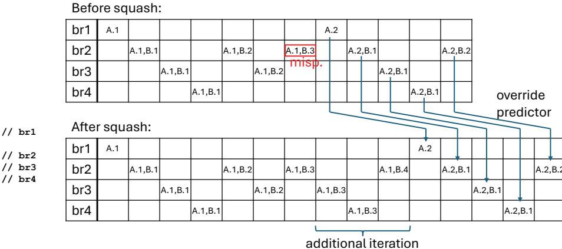
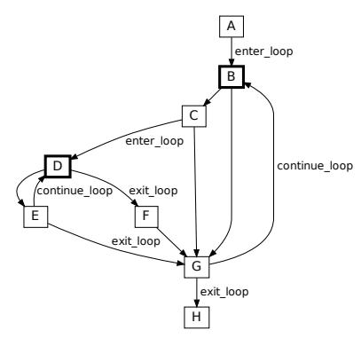

# I. INTRODUCTION

As the window size, pipeline depth, and fetch and issue widths of superscalar processors continue to increase, the performance penalty of a mispredicted branch also increases. A single mispredicted branch can cause hundreds of younger instructions after it to be squashed.

Often, many of the squashed instructions are controlindependent (CI) of the mispredicted branch. CI instructions are instructions after the branch's dynamic reconvergent point, *i.e.*, the point where the branch's mispredicted path and its resolved path merge. An example is shown in Figure 1.

This work was supported, in part, by a Qualcomm Innovation Fellowship and an Intel gift.

Referring to the source code in Figure 1a, branch br1 in block A determines whether to fetch block B or C, both of which influence the value of x. The reconvergent point of br1 is label D, therefore, everything after label D is CI with respect to br1. Branch br2 is control-independent data-dependent (CIDD) with respect to br1 because br2 depends on data (x) influenced by br1's control-dependent region {B,C}. In contrast, br3 is control-independent data-independent (CIDI) of both br1 and br2.

Figure 1b shows a dynamic instance of the code. Br1 was mispredicted (should have fetched block C instead of B) and hasn't executed yet. Br3 was also mispredicted and it subsequently executed out-of-order (OOO), including having already squashed its younger instructions, fetched alternate instructions, *etc*. Br2 also executed OOO but with potentially incorrect data (it may or may not have already performed a speculative squash, depending on its prediction and unreliable outcome).

In Figure 1c, br1 finally executes and squashes all younger instructions, which we refer to as the *squashed path w.r.t. br1* (in this case, B, D, F, and blocks after F). The fetch unit resumes fetching from block C (instead of block B). Naturally, br2 is fetched and predicted again, but the example shows it getting a different prediction this second time around (this time block E is fetched), perhaps due to the predictor capturing correlation between br1 and br2 (whether or not the prediction is correct is not germane to the example). Br3 is also fetched and predicted again, but because it is CIDI, there is an opportunity to override the predictor with the outcome from br3's counterpart on the squashed path. This avoids a misprediction if the predictor is incorrect again (which may be likely due to br3 having little correlation with br1 and br2). We refer to the new path shown in this snapshot as the *resolved path w.r.t. br1* (in this case, C, D, E, F, and blocks after F); note that the path is still speculative (not fully resolved), but no longer with respect to br1.

The simple example in Figure 1 belies the challenge, in general, of associating each dynamic branch on the resolved path with its counterpart on the squashed path, if the counterpart exists. The challenge arises when, between the branch causing the squash and the reusable squashed branch, additional instances of the latter branch are inserted and/or previously

Fig. 1: Simple example of squashed-branch reuse.

existing instances are removed on the resolved path, making alignment of the squashed-path and resolved-path counterparts tricky. Our solution to this challenge is based on the insight that multiple dynamic instances of a branch occur due to loops. A dynamic instance can be uniquely identified by a hierarchical loop iteration identifier, like  $\{loopA.iterA, loopB.iterB\}$  for a branch within a doubly-nested loop. This identifier is invariant: the identifier of a dynamic branch on the resolved path matches that of its counterpart on the squashed path (if it exists), despite arbitrary differences in control-flow observed on the two paths.

Figure 2a shows an example of an outer loop A (br1) and inner loop B (br2), and nested if-statements (br3,br4) inside B. The top table of Figure 2b shows an example dynamic sequence before a squash. The sequence shows two iterations of the outer loop, A.1 and A.2. For A.1's visit to inner loop B, B iterates three times:  $\{A.1, B.1\}, \{A.1, B.2\}, \{A.1, B.3\};$ the third iteration skirts the while-loop's body, however, so there are only two occurrences of if-branch br3; nested br4's occurrences depend on predictions of br3. Suppose the first visit to inner loop B was supposed to iterate four times, i.e., instance  $\{A.1, B.3\}$  of br2 was mispredicted as labeled. The bottom table shows the resolved path after the squash. Despite the additional iteration  $\{A.1, B.4\}$ , and additional dynamic branches br3: $\{A.1, B.3\}$ , br4: $\{A.1, B.3\}$ , and br2: $\{A.1, B.4\}$ , invariant identifiers starting with A.2 allow for squashedbranch reuse of all following branches. The same would hold if iterations were removed, or if nested branches were added/removed, etc.

We realize invariant identifiers compactly using a signature contained within a Linear Feedback Shift Register (LFSR). The signature is saved to a small stack just before entering a loop, incrementally updated upon entering and continuing the loop, and restored from the stack after exiting the loop (to what the signature was prior to the loop). For this paper, we developed an LLVM [25] compiler pass to collect loop

information (loop header PC, loop exit branches), which is appended to the binary as another segment and loaded into a Loop Information Table (LIT) at run-time.

executed.

The signature and stack are also manipulated by calls/returns. The signature is saved just before a function call, incrementally updated by the caller, and restored after returning. This ensures unique and invariant signatures for multiple instances of a branch created by recursion or multiple calls to the same function from the same loop and iteration.

A dynamic branch is uniquely and invariantly identified by a hash of its PC and signature, called its key (with the exception of rare collisions in the signature or hashed key). We augment the branch predictor with a Squashed-Branch Reuse Buffer (SBRB) accessed by key. We augment the branch target buffer (BTB) with confidence counters to gauge which branch PCs offer profitable overrides of the predictor. When a branch executes, it accesses the SBRB using its key and either adds its key and outcome if it misses or updates the outcome if it hits. The latter scenario is possible if the same dynamic branch is squashed multiple times. The BTB confidence counters indirectly learn the typical CIDD/CIDI nature of branches with respect squashes, i.e., the relative trustworthiness of their squashed outcomes as compared to their predictions. When a branch is predicted, it accesses the SBRB using its key. The prediction is overridden by the SBRB if it hits and the branch's confidence counter indicates high confidence.

The rest of the paper is organized as follows. Section II discusses related work. Section III describes our squashed-branch reuse implementation. Section IV describes the simulator used, default superscalar processor parameters, and benchmarks. Section V presents results and analysis. We conclude the paper in Section VI.

## II. RELATED WORK

Researchers have explored various microarchitectures that exploit control independence to reduce the penalty of branch

- Loop A: while (cond1) { // br1 ...
  Loop B: while (cond2) { // br2 if (cond3) { // br3 if (cond4) // br4 ...
  } ...
  } ...
  }
  - (a) Example doubly-nested loop.
- (b) Example of logically aligning squashed path and resolved path using invariant identifiers.

Fig. 2: Using invariant identifiers.

mispredictions. One class of CI microarchitectures [5], [12], [17], [19], [24], [34]–[36] preserves CI instructions in the pipeline. The most ambitious of these [5], [19], [34], [35] require complex machinery for replacing incorrect controldependent (CD) instructions with correct CD instructions and selectively re-executing CIDD instructions. Selective Branch Recovery [17] is limited to exact convergence, which means incorrect CD instructions need only be nullified because the alternate path reconverges immediately (there are no alternate CD instructions). The nullified instructions are converted to moves and CIDD instructions must be selectively re-executed. Skipper [12] intentionally skips over a branch's CD instructions and delays CIDD instructions. When the branch resolves, the correct CD instructions are fetched and CIDD instructions are released. In addition to the high complexity of all these approaches, branch prediction accuracy is actually degraded by virtue of out-of-order fetch [19], [36]. Thus, even if CI instructions are not refetched, it may be prudent to repredict CI branches using repaired global history [36].

Eyerman et al. [15] use software annotations, similar to expressing parallelism, to avoid some of the hardware complexity discussed above. Slices are defined with slice\_begin/slice\_end instructions. For example, independent loop iterations (notwithstanding reduction variables) are independent slices. Mispredictions within a slice only squash instructions within that slice. This still requires removing/inserting CD instructions in the middle of the window (e.g., using a linked-list segmented ROB [15], [34]–[36]) but not selective re-execution of CIDD instructions. Branches not in slices, including the loop branch, cause a full squash when mispredicted. Reduction operators are annotated, and executed non-speculatively and without register renaming at retirement.

Selective Pipeline Flush [24] searches for the mispredicted branch's resolved target in the fetch through rename stages. If the branch's target instruction exists in these stages, the target instruction and younger instructions need not be refetched. A method is proposed for repairing predictor context in this case.

Another class of CI microarchitectures, referred to as *squash reuse*, squash all instructions after the mispredicted branch like usual, but preserve CI instructions' results in an instruction reuse buffer [42], physical registers [20], [37], or an alternate ROB [13]. After the squash, as instructions are fetched, the rename stage performs reuse tests to gauge whether an instruction can reuse a result already produced by a squashed counterpart. Instructions that pass their reuse tests execute early, in the rename stage. This includes resolving some mispredicted branches early, but not as early as the fetch stage where branches are initially predicted. Therefore, the aforementioned squash reuse proposals do not reduce branch mispredictions, rather, they only reduce the penalty of reusable mispredicted branches.

We'll discuss two of the squash reuse proposals, cited above, in more depth. Both Register Integration (RI) [37] and Multi-Stream Squash Reuse (MSSR) [20] preserve CI instructions' results in physical registers. RI: When a misprediction is detected, the PC, source physical register name(s), and destination physical register name or branch outcome of each squashed instruction is placed in the Integration Table (IT). The physical registers of squashed instructions are not immediately released. While renaming an instruction on the resolved path, the IT is searched using the instruction's PC and source physical register names. A hit means the instruction is reusable (CIDI). For a reusable register-producing instruction, its destination is renamed to the physical register indicated in the IT, thereby reusing the squashed result. For a reusable branch that was mispredicted, its outcome in the IT serves as an earlier misprediction resolution than waiting for execution. **MSSR**: When a misprediction is detected: (1) the ROB is copied to a squash log, (2) the fetch unit's Fetch Target Queue is copied to a wrong-path buffer (WPB), and (3) squashed instructions' registers are not immediately released, as in RI. As resolved-path instructions are fetched, fetch-block PCs are compared against fetch-block PCs in the WPB to detect reconvergence. When the reconvergent point is detected in the WPB, the corresponding point is identified in the squash log. Whereas RI's reuse test checks for the same source physical register names in the IT, MSSR checks for the same source RGIDs in the squash log (RGID: Rename Mapping Generation ID). Additionally, MSSR employs multiple WPB/squash-log pairs, allowing squash reuse across multiple squashes.

SBRB eliminates mispredicted branches whereas MSSR and RI only reduce their penalties. After reconvergence, MSSR abandons squash reuse at the first divergence between the resolved and squashed paths, whereas SBRB's novel branch alignment approach tolerates arbitrary control-flow differences. While MSSR supports reuse across multiple squashes, it is limited by the number of WPB/squash-log pairs whereas SBRB is not constrained. That said, it is important to not lose sight of the fact that SBRB and MSSR/RI have different objectives though unified by squash reuse. SBRB targets *squashed-branch reuse in the fetch stage*. MSSR and RI aim to reuse results of register-producing instructions and branches *at the rename stage*, to reduce backend pressure after a squash and the penalty of mispredicted squash-reusable branches, respectively. SBRB's squashed-branch reuse at fetch can be combined with MSSR's squash reuse at rename.

SYRANT [29] also follows the squash reuse paradigm, but goes a step further by reusing squashed CI instructions' entries in the Reorder Buffer (ROB), Physical Register File (PRF), Load Queue (LQ), and Store Queue (SQ). For each targeted branch, ROB, PRF Free List, LQ, and SQ entries are allocated according to maximum resource requirements along either of its not-taken or taken paths up to its reconvergent point. This allows refetched CI instructions to reuse ROB/PRF/LQ/SQ entries occupied by squashed counterparts, without requiring shifting/copying due to resource differences on the squashed and resolved paths. SYRANT uses two lists of dynamic branches, the Active Branch List (ABL) and Shadow Branch List (SBL), to detect reconvergence and thus gauge maximum resource requirements. When a misprediction is detected, ABL entries after the mispredicted branch are copied to the SBL. Reconvergence is detected by comparing branches on the resolved path, as they are inserted into the ABL, against branches in the SBL.

SYRANT also leverages the ABL/SBL for *squashed-branch reuse in the fetch stage*. The authors also emphasize that this feature, conveniently localized to the fetch unit, can be used standalone to improve branch prediction accuracy. The ABL collects outcomes as branches execute, and squashed branches' outcomes transfer to the SBL. After reconvergence is detected in the SBL, SBL entries with outcomes are used to override the predictor. There are several limitations, however:

• SYRANT places two constraints that, in our analysis, are geared toward reliable ABL-SBL alignment when there are nested branches inside of a loop. Without the constraints, a nested branch – instances of which occur in some iterations but not others – may trigger misalignment of loop iterations between the ABL and SBL. On the other hand, the constraints *preclude squashed-branch reuse after a mispredicted loop branch*, as illustrated in Figure 3. The first constraint is "*the search for reconvergence point ends when a second instance of the mispredicted branch is recorded on the right path*" [29]. If the predictor exited the loop prematurely, as illustrated in Figure 3a (under-iteration: SBL has branches from after the loop), the reconvergence search terminates when another iteration is fetched on the resolved path and the next instance of the loop branch is observed. The second constraint is "*the SBL is searched only up to the second instance of the mispredicted branch*" [29]. If the predictor exited the loop belatedly, as illustrated in Figure 3b (overiteration: SBL has branches from excess loop iterations and branches after the loop), the reconvergence search window within the SBL is limited to the first excess loop iteration and the search continues without latching-on. SYRANT's heuristic achieves reasonably good alignment at the expense of valuable squashed-branch reuse opportunity. Our proposed invariant identifiers achieve nearperfect alignment1 with no loss of squashed-branch reuse opportunity.

- Even if the ABL / resolved path successfully begins its association with the SBL / squashed path, it is unclear what happens at the first divergence, which can happen when the resolved path requires branch prediction (no override available) and the prediction differs the second time around. Presumably, reuse must terminate at the first divergence (the topic is not broached and no alternative method is described in the paper). In contrast, our proposed invariant signatures are tolerant of resolvedpath/squashed-path divergences in the CI region.
- There is only a brief discussion of the potential need for gauging CIDD/CIDI branches. The authors found that, "*in many applications the quality of ABL/SBL prediction is better than the quality of the state-of-the-art TAGE branch prediction*" [29]. A single, global confidence counter was posited to enable/disable squashed-branch reuse over stretches, but there is little detail and it is unclear if this was used in the results. We explore various confidence mechanisms in Section V-C.
- The SBL only retains squashed-branch outcomes from the most recent squash, whereas our proposed SBRB inherently retains squashed-branch outcomes across multiple squashes. This is relevant because OOO execution may yield multiple squashes within the same window [20].

Branch recycling, by Akkary et al. [4], preceded SYRANT and also uses two branch lists like the ABL and SBL to implement squashed-branch reuse in the fetch stage. The PC of the branch being fetched associatively searches the SBL-equivalent and the nearest hit establishes the alignment henceforth. The authors concede this can lead to incorrect

1Imperfections may occur due to non-loop cycles (Sec. III-A), practical realization of identifiers (signature collisions, constrained stack, constrained LIT), and key collisions.

(a) Predictor under-iterated.

Before squash: After squash:

| ABL   | SBL   | ABL | SBL |            |
|-------|-------|-----|-----|------------|
| brA   |       | brA |     |            |
| brB   |       | brB |     |            |
| brA   |       | brA |     |            |
| brB m | iisp. | brB |     |            |
| brA   |       | brC | brA | restricted |
| brB   |       | brD | brB | window     |
| brC   |       |     | brC |            |
| brD   |       |     | brD |            |

(b) Predictor over-iterated.

Fig. 3: Examples of SYRANT's [29] ABL/SBL (a) terminating the reconvergence search or (b) restricting the reconvergence search window in the SBL, with respect to a mispredicted loop branch. BrA and brB are in a loop, where brB is the loop branch. BrC and brD are after the loop.

alignment, which is compensated by lowering confidence in a gshare-based confidence estimator.

Galliher [16] also proposed squashed-branch reuse in the fetch unit. On a squash, their fetch unit's existing Branch Queue is iteratively copied to a Reuse Queue. During this iterative copy, Reuse Queue entries are labeled with iteration counters based on observing repetition of branch PCs in prior entries. While fetching a branch on the resolved path, its PC is compared against the Reuse Queue's head entry. If there isn't a match, various comparisons on two adjacent iterations are attempted to heuristically resync the resolved path to the squashed path. Aside from the hardware complexity (and implied prediction latency) of an indeterminate window of comparisons and successive application of rules, it is not clear how general the alignment/realignment heuristics are. Also, one level of iteration counters may confuse multiple visits to an inner loop as a single visit.

Other branch techniques: Dynamic Predication: Auto-Predication of Critical Branches (ACB) [11] is an all-hardware technique that identifies hard-to-predict (H2P) branches with simple CD regions (no nested branches, loop branches are

excluded, *etc.*), replaces them with predicated execution, and switches between branching and predication by continuously gauging profitability. ACB's on-line H2P branch identification, multiple hammock idioms, and adaptivity, are advancements over the precursor Dynamic Hammock Predication [22]. The Diverge-Merge Processor (DMP) [21] forks two paths after a H2P branch and merges them at the reconvergent point; this allows nested branches but they are predicted and thus may cause squashes.

**Branch Pre-execution:** Branch pre-execution involves running one or more helper threads ahead of the main thread, and communicating branch outcomes from the helper thread(s) to the main thread's fetch unit. Past works include Slipstream [31]–[33], [45], Speculative Slices [47], [48], DDMT [38], SSMT [9], [10], DLA [18], [23], [28], Slipstream 2.0 [43], Branch Runahead [30], TEA [14], and Phelps [39]. Squashed-branch reuse in the fetch stage leverages the squashed path as free pre-execution.

**Branch criticality:** Ando's PUBS [7] prioritizes the scheduling of backward slices of unconfident branches, reducing their penalty if mispredicted. CRISP [27] uses software hints to prioritize critical branch (and load) scheduling.

#### III. IMPLEMENTATION

#### A. Loops and Loop Hierarchy

In this work, we take a compiler's view of a loop [2]. In this view, every loop in a program can be identified with a unique header block. The header block represents a single point of entry into the loop, and therefore dominates the rest of the blocks in the loop.

Figure 4 shows the control-flow graph (CFG) of the loops in the BUStep function of bfs, a program from the GAPBS benchmark suite [8]. There are two loops. The inner loop contains blocks D and E, and is identified with header block D. The outer loop contains blocks B, C, D, E, F, and G, and is identified with header block B. Blocks D and E appear in both loops because, by definition, blocks belonging to the inner loop also belong to the outer loop.

Fig. 4: Control-flow graph of loops in bfs BUStep.

For a loop, iteration count is defined as the number of executions of the header block before exiting the loop [2]. The presence of a unique header block differentiates loops

from other non-loop cyclic control-flow in a program. For nonloop cycles, there isn't a uniquely identifiable header block. Therefore, the iteration count is not well-defined as it depends on the choice of the header block. Non-loop cycles can occur due to manually-optimized assembly programming, unconventional programming constructs like *goto*, certain compiler transformations, *etc*. We observe few non-loop cycles in our benchmarks (Section V-F) and do not consider them further.

Nested loops form a hierarchy which can be represented as a tree [2]. The outermost loop appears at the root of the tree. Figure 5a shows the tree of loops of the bfs BUStep function. Note, here the loops are identified with their respective header blocks.

(a) Tree of loops in bfs BUStep. (b) Forest of loops in function *f*.

Fig. 5: Loop hierarchy expressed as a forest.

Since a function can have multiple outermost (top-level) loops, the loops in a function form a forest (*i.e.*, a collection of trees) [2]. Figure 5b shows a forest of loops in some function *f*. Every loop has a loop depth associated with it. The outermost loop has a loop depth of 1, and the depth increases downwards in a tree. The loop depth of a basic block (which has at most one branch) is the depth of the (innermost) loop it appears in. A branch not in any loop has a loop depth of 0.

The hierarchical loop iteration identifier of a dynamic instance of a branch inside loop L constitutes: (a) the loop identity (*i.e.*, the header block) and (b) the iteration count, of all the loops which are ancestor to L, including L. For example, the identifier for a dynamic branch occurring in the loop U of function *f* is {*R.iterR, T.iterT, U.iterU*}. Note that both the header block and the iteration count are required to ensure uniqueness. Removing the header block can lead to identical identifiers for branches in different loops but at the same loop depth. Removing the iteration count leads to identical identifiers for the same branch in different loop iterations.

# I. INTRODUCTION

As the window size, pipeline depth, and fetch and issue widths of superscalar processors continue to increase, the performance penalty of a mispredicted branch also increases. A single mispredicted branch can cause hundreds of younger instructions after it to be squashed.

Often, many of the squashed instructions are controlindependent (CI) of the mispredicted branch. CI instructions are instructions after the branch's dynamic reconvergent point, *i.e.*, the point where the branch's mispredicted path and its resolved path merge. An example is shown in Figure 1.

This work was supported, in part, by a Qualcomm Innovation Fellowship and an Intel gift.

Referring to the source code in Figure 1a, branch br1 in block A determines whether to fetch block B or C, both of which influence the value of x. The reconvergent point of br1 is label D, therefore, everything after label D is CI with respect to br1. Branch br2 is control-independent data-dependent (CIDD) with respect to br1 because br2 depends on data (x) influenced by br1's control-dependent region {B,C}. In contrast, br3 is control-independent data-independent (CIDI) of both br1 and br2.

Figure 1b shows a dynamic instance of the code. Br1 was mispredicted (should have fetched block C instead of B) and hasn't executed yet. Br3 was also mispredicted and it subsequently executed out-of-order (OOO), including having already squashed its younger instructions, fetched alternate instructions, *etc*. Br2 also executed OOO but with potentially incorrect data (it may or may not have already performed a speculative squash, depending on its prediction and unreliable outcome).

In Figure 1c, br1 finally executes and squashes all younger instructions, which we refer to as the *squashed path w.r.t. br1* (in this case, B, D, F, and blocks after F). The fetch unit resumes fetching from block C (instead of block B). Naturally, br2 is fetched and predicted again, but the example shows it getting a different prediction this second time around (this time block E is fetched), perhaps due to the predictor capturing correlation between br1 and br2 (whether or not the prediction is correct is not germane to the example). Br3 is also fetched and predicted again, but because it is CIDI, there is an opportunity to override the predictor with the outcome from br3's counterpart on the squashed path. This avoids a misprediction if the predictor is incorrect again (which may be likely due to br3 having little correlation with br1 and br2). We refer to the new path shown in this snapshot as the *resolved path w.r.t. br1* (in this case, C, D, E, F, and blocks after F); note that the path is still speculative (not fully resolved), but no longer with respect to br1.

The simple example in Figure 1 belies the challenge, in general, of associating each dynamic branch on the resolved path with its counterpart on the squashed path, if the counterpart exists. The challenge arises when, between the branch causing the squash and the reusable squashed branch, additional instances of the latter branch are inserted and/or previously

Fig. 1: Simple example of squashed-branch reuse.

existing instances are removed on the resolved path, making alignment of the squashed-path and resolved-path counterparts tricky. Our solution to this challenge is based on the insight that multiple dynamic instances of a branch occur due to loops. A dynamic instance can be uniquely identified by a hierarchical loop iteration identifier, like  $\{loopA.iterA, loopB.iterB\}$  for a branch within a doubly-nested loop. This identifier is invariant: the identifier of a dynamic branch on the resolved path matches that of its counterpart on the squashed path (if it exists), despite arbitrary differences in control-flow observed on the two paths.

Figure 2a shows an example of an outer loop A (br1) and inner loop B (br2), and nested if-statements (br3,br4) inside B. The top table of Figure 2b shows an example dynamic sequence before a squash. The sequence shows two iterations of the outer loop, A.1 and A.2. For A.1's visit to inner loop B, B iterates three times:  $\{A.1, B.1\}, \{A.1, B.2\}, \{A.1, B.3\};$ the third iteration skirts the while-loop's body, however, so there are only two occurrences of if-branch br3; nested br4's occurrences depend on predictions of br3. Suppose the first visit to inner loop B was supposed to iterate four times, i.e., instance  $\{A.1, B.3\}$  of br2 was mispredicted as labeled. The bottom table shows the resolved path after the squash. Despite the additional iteration  $\{A.1, B.4\}$ , and additional dynamic branches br3: $\{A.1, B.3\}$ , br4: $\{A.1, B.3\}$ , and br2: $\{A.1, B.4\}$ , invariant identifiers starting with A.2 allow for squashedbranch reuse of all following branches. The same would hold if iterations were removed, or if nested branches were added/removed, etc.

We realize invariant identifiers compactly using a signature contained within a Linear Feedback Shift Register (LFSR). The signature is saved to a small stack just before entering a loop, incrementally updated upon entering and continuing the loop, and restored from the stack after exiting the loop (to what the signature was prior to the loop). For this paper, we developed an LLVM [25] compiler pass to collect loop

information (loop header PC, loop exit branches), which is appended to the binary as another segment and loaded into a Loop Information Table (LIT) at run-time.

executed.

The signature and stack are also manipulated by calls/returns. The signature is saved just before a function call, incrementally updated by the caller, and restored after returning. This ensures unique and invariant signatures for multiple instances of a branch created by recursion or multiple calls to the same function from the same loop and iteration.

A dynamic branch is uniquely and invariantly identified by a hash of its PC and signature, called its key (with the exception of rare collisions in the signature or hashed key). We augment the branch predictor with a Squashed-Branch Reuse Buffer (SBRB) accessed by key. We augment the branch target buffer (BTB) with confidence counters to gauge which branch PCs offer profitable overrides of the predictor. When a branch executes, it accesses the SBRB using its key and either adds its key and outcome if it misses or updates the outcome if it hits. The latter scenario is possible if the same dynamic branch is squashed multiple times. The BTB confidence counters indirectly learn the typical CIDD/CIDI nature of branches with respect squashes, i.e., the relative trustworthiness of their squashed outcomes as compared to their predictions. When a branch is predicted, it accesses the SBRB using its key. The prediction is overridden by the SBRB if it hits and the branch's confidence counter indicates high confidence.

The rest of the paper is organized as follows. Section II discusses related work. Section III describes our squashed-branch reuse implementation. Section IV describes the simulator used, default superscalar processor parameters, and benchmarks. Section V presents results and analysis. We conclude the paper in Section VI.

## II. RELATED WORK

Researchers have explored various microarchitectures that exploit control independence to reduce the penalty of branch

- Loop A: while (cond1) { // br1 ...
  Loop B: while (cond2) { // br2 if (cond3) { // br3 if (cond4) // br4 ...
  } ...
  } ...
  }
  - (a) Example doubly-nested loop.
- (b) Example of logically aligning squashed path and resolved path using invariant identifiers.

Fig. 2: Using invariant identifiers.

mispredictions. One class of CI microarchitectures [5], [12], [17], [19], [24], [34]–[36] preserves CI instructions in the pipeline. The most ambitious of these [5], [19], [34], [35] require complex machinery for replacing incorrect controldependent (CD) instructions with correct CD instructions and selectively re-executing CIDD instructions. Selective Branch Recovery [17] is limited to exact convergence, which means incorrect CD instructions need only be nullified because the alternate path reconverges immediately (there are no alternate CD instructions). The nullified instructions are converted to moves and CIDD instructions must be selectively re-executed. Skipper [12] intentionally skips over a branch's CD instructions and delays CIDD instructions. When the branch resolves, the correct CD instructions are fetched and CIDD instructions are released. In addition to the high complexity of all these approaches, branch prediction accuracy is actually degraded by virtue of out-of-order fetch [19], [36]. Thus, even if CI instructions are not refetched, it may be prudent to repredict CI branches using repaired global history [36].

Eyerman et al. [15] use software annotations, similar to expressing parallelism, to avoid some of the hardware complexity discussed above. Slices are defined with slice\_begin/slice\_end instructions. For example, independent loop iterations (notwithstanding reduction variables) are independent slices. Mispredictions within a slice only squash instructions within that slice. This still requires removing/inserting CD instructions in the middle of the window (e.g., using a linked-list segmented ROB [15], [34]–[36]) but not selective re-execution of CIDD instructions. Branches not in slices, including the loop branch, cause a full squash when mispredicted. Reduction operators are annotated, and executed non-speculatively and without register renaming at retirement.

Selective Pipeline Flush [24] searches for the mispredicted branch's resolved target in the fetch through rename stages. If the branch's target instruction exists in these stages, the target instruction and younger instructions need not be refetched. A method is proposed for repairing predictor context in this case.

Another class of CI microarchitectures, referred to as *squash reuse*, squash all instructions after the mispredicted branch like usual, but preserve CI instructions' results in an instruction reuse buffer [42], physical registers [20], [37], or an alternate ROB [13]. After the squash, as instructions are fetched, the rename stage performs reuse tests to gauge whether an instruction can reuse a result already produced by a squashed counterpart. Instructions that pass their reuse tests execute early, in the rename stage. This includes resolving some mispredicted branches early, but not as early as the fetch stage where branches are initially predicted. Therefore, the aforementioned squash reuse proposals do not reduce branch mispredictions, rather, they only reduce the penalty of reusable mispredicted branches.

We'll discuss two of the squash reuse proposals, cited above, in more depth. Both Register Integration (RI) [37] and Multi-Stream Squash Reuse (MSSR) [20] preserve CI instructions' results in physical registers. RI: When a misprediction is detected, the PC, source physical register name(s), and destination physical register name or branch outcome of each squashed instruction is placed in the Integration Table (IT). The physical registers of squashed instructions are not immediately released. While renaming an instruction on the resolved path, the IT is searched using the instruction's PC and source physical register names. A hit means the instruction is reusable (CIDI). For a reusable register-producing instruction, its destination is renamed to the physical register indicated in the IT, thereby reusing the squashed result. For a reusable branch that was mispredicted, its outcome in the IT serves as an earlier misprediction resolution than waiting for execution. **MSSR**: When a misprediction is detected: (1) the ROB is copied to a squash log, (2) the fetch unit's Fetch Target Queue is copied to a wrong-path buffer (WPB), and (3) squashed instructions' registers are not immediately released, as in RI. As resolved-path instructions are fetched, fetch-block PCs are compared against fetch-block PCs in the WPB to detect reconvergence. When the reconvergent point is detected in the WPB, the corresponding point is identified in the squash log. Whereas RI's reuse test checks for the same source physical register names in the IT, MSSR checks for the same source RGIDs in the squash log (RGID: Rename Mapping Generation ID). Additionally, MSSR employs multiple WPB/squash-log pairs, allowing squash reuse across multiple squashes.

SBRB eliminates mispredicted branches whereas MSSR and RI only reduce their penalties. After reconvergence, MSSR abandons squash reuse at the first divergence between the resolved and squashed paths, whereas SBRB's novel branch alignment approach tolerates arbitrary control-flow differences. While MSSR supports reuse across multiple squashes, it is limited by the number of WPB/squash-log pairs whereas SBRB is not constrained. That said, it is important to not lose sight of the fact that SBRB and MSSR/RI have different objectives though unified by squash reuse. SBRB targets *squashed-branch reuse in the fetch stage*. MSSR and RI aim to reuse results of register-producing instructions and branches *at the rename stage*, to reduce backend pressure after a squash and the penalty of mispredicted squash-reusable branches, respectively. SBRB's squashed-branch reuse at fetch can be combined with MSSR's squash reuse at rename.

SYRANT [29] also follows the squash reuse paradigm, but goes a step further by reusing squashed CI instructions' entries in the Reorder Buffer (ROB), Physical Register File (PRF), Load Queue (LQ), and Store Queue (SQ). For each targeted branch, ROB, PRF Free List, LQ, and SQ entries are allocated according to maximum resource requirements along either of its not-taken or taken paths up to its reconvergent point. This allows refetched CI instructions to reuse ROB/PRF/LQ/SQ entries occupied by squashed counterparts, without requiring shifting/copying due to resource differences on the squashed and resolved paths. SYRANT uses two lists of dynamic branches, the Active Branch List (ABL) and Shadow Branch List (SBL), to detect reconvergence and thus gauge maximum resource requirements. When a misprediction is detected, ABL entries after the mispredicted branch are copied to the SBL. Reconvergence is detected by comparing branches on the resolved path, as they are inserted into the ABL, against branches in the SBL.

SYRANT also leverages the ABL/SBL for *squashed-branch reuse in the fetch stage*. The authors also emphasize that this feature, conveniently localized to the fetch unit, can be used standalone to improve branch prediction accuracy. The ABL collects outcomes as branches execute, and squashed branches' outcomes transfer to the SBL. After reconvergence is detected in the SBL, SBL entries with outcomes are used to override the predictor. There are several limitations, however:

• SYRANT places two constraints that, in our analysis, are geared toward reliable ABL-SBL alignment when there are nested branches inside of a loop. Without the constraints, a nested branch – instances of which occur in some iterations but not others – may trigger misalignment of loop iterations between the ABL and SBL. On the other hand, the constraints *preclude squashed-branch reuse after a mispredicted loop branch*, as illustrated in Figure 3. The first constraint is "*the search for reconvergence point ends when a second instance of the mispredicted branch is recorded on the right path*" [29]. If the predictor exited the loop prematurely, as illustrated in Figure 3a (under-iteration: SBL has branches from after the loop), the reconvergence search terminates when another iteration is fetched on the resolved path and the next instance of the loop branch is observed. The second constraint is "*the SBL is searched only up to the second instance of the mispredicted branch*" [29]. If the predictor exited the loop belatedly, as illustrated in Figure 3b (overiteration: SBL has branches from excess loop iterations and branches after the loop), the reconvergence search window within the SBL is limited to the first excess loop iteration and the search continues without latching-on. SYRANT's heuristic achieves reasonably good alignment at the expense of valuable squashed-branch reuse opportunity. Our proposed invariant identifiers achieve nearperfect alignment1 with no loss of squashed-branch reuse opportunity.

- Even if the ABL / resolved path successfully begins its association with the SBL / squashed path, it is unclear what happens at the first divergence, which can happen when the resolved path requires branch prediction (no override available) and the prediction differs the second time around. Presumably, reuse must terminate at the first divergence (the topic is not broached and no alternative method is described in the paper). In contrast, our proposed invariant signatures are tolerant of resolvedpath/squashed-path divergences in the CI region.
- There is only a brief discussion of the potential need for gauging CIDD/CIDI branches. The authors found that, "*in many applications the quality of ABL/SBL prediction is better than the quality of the state-of-the-art TAGE branch prediction*" [29]. A single, global confidence counter was posited to enable/disable squashed-branch reuse over stretches, but there is little detail and it is unclear if this was used in the results. We explore various confidence mechanisms in Section V-C.
- The SBL only retains squashed-branch outcomes from the most recent squash, whereas our proposed SBRB inherently retains squashed-branch outcomes across multiple squashes. This is relevant because OOO execution may yield multiple squashes within the same window [20].

Branch recycling, by Akkary et al. [4], preceded SYRANT and also uses two branch lists like the ABL and SBL to implement squashed-branch reuse in the fetch stage. The PC of the branch being fetched associatively searches the SBL-equivalent and the nearest hit establishes the alignment henceforth. The authors concede this can lead to incorrect

1Imperfections may occur due to non-loop cycles (Sec. III-A), practical realization of identifiers (signature collisions, constrained stack, constrained LIT), and key collisions.

(a) Predictor under-iterated.

Before squash: After squash:

| ABL   | SBL   | ABL | SBL |            |
|-------|-------|-----|-----|------------|
| brA   |       | brA |     |            |
| brB   |       | brB |     |            |
| brA   |       | brA |     |            |
| brB m | iisp. | brB |     |            |
| brA   |       | brC | brA | restricted |
| brB   |       | brD | brB | window     |
| brC   |       |     | brC |            |
| brD   |       |     | brD |            |

(b) Predictor over-iterated.

Fig. 3: Examples of SYRANT's [29] ABL/SBL (a) terminating the reconvergence search or (b) restricting the reconvergence search window in the SBL, with respect to a mispredicted loop branch. BrA and brB are in a loop, where brB is the loop branch. BrC and brD are after the loop.

alignment, which is compensated by lowering confidence in a gshare-based confidence estimator.

Galliher [16] also proposed squashed-branch reuse in the fetch unit. On a squash, their fetch unit's existing Branch Queue is iteratively copied to a Reuse Queue. During this iterative copy, Reuse Queue entries are labeled with iteration counters based on observing repetition of branch PCs in prior entries. While fetching a branch on the resolved path, its PC is compared against the Reuse Queue's head entry. If there isn't a match, various comparisons on two adjacent iterations are attempted to heuristically resync the resolved path to the squashed path. Aside from the hardware complexity (and implied prediction latency) of an indeterminate window of comparisons and successive application of rules, it is not clear how general the alignment/realignment heuristics are. Also, one level of iteration counters may confuse multiple visits to an inner loop as a single visit.

Other branch techniques: Dynamic Predication: Auto-Predication of Critical Branches (ACB) [11] is an all-hardware technique that identifies hard-to-predict (H2P) branches with simple CD regions (no nested branches, loop branches are

excluded, *etc.*), replaces them with predicated execution, and switches between branching and predication by continuously gauging profitability. ACB's on-line H2P branch identification, multiple hammock idioms, and adaptivity, are advancements over the precursor Dynamic Hammock Predication [22]. The Diverge-Merge Processor (DMP) [21] forks two paths after a H2P branch and merges them at the reconvergent point; this allows nested branches but they are predicted and thus may cause squashes.

**Branch Pre-execution:** Branch pre-execution involves running one or more helper threads ahead of the main thread, and communicating branch outcomes from the helper thread(s) to the main thread's fetch unit. Past works include Slipstream [31]–[33], [45], Speculative Slices [47], [48], DDMT [38], SSMT [9], [10], DLA [18], [23], [28], Slipstream 2.0 [43], Branch Runahead [30], TEA [14], and Phelps [39]. Squashed-branch reuse in the fetch stage leverages the squashed path as free pre-execution.

**Branch criticality:** Ando's PUBS [7] prioritizes the scheduling of backward slices of unconfident branches, reducing their penalty if mispredicted. CRISP [27] uses software hints to prioritize critical branch (and load) scheduling.

#### III. IMPLEMENTATION

#### A. Loops and Loop Hierarchy

In this work, we take a compiler's view of a loop [2]. In this view, every loop in a program can be identified with a unique header block. The header block represents a single point of entry into the loop, and therefore dominates the rest of the blocks in the loop.

Figure 4 shows the control-flow graph (CFG) of the loops in the BUStep function of bfs, a program from the GAPBS benchmark suite [8]. There are two loops. The inner loop contains blocks D and E, and is identified with header block D. The outer loop contains blocks B, C, D, E, F, and G, and is identified with header block B. Blocks D and E appear in both loops because, by definition, blocks belonging to the inner loop also belong to the outer loop.

Fig. 4: Control-flow graph of loops in bfs BUStep.

For a loop, iteration count is defined as the number of executions of the header block before exiting the loop [2]. The presence of a unique header block differentiates loops

from other non-loop cyclic control-flow in a program. For nonloop cycles, there isn't a uniquely identifiable header block. Therefore, the iteration count is not well-defined as it depends on the choice of the header block. Non-loop cycles can occur due to manually-optimized assembly programming, unconventional programming constructs like *goto*, certain compiler transformations, *etc*. We observe few non-loop cycles in our benchmarks (Section V-F) and do not consider them further.

Nested loops form a hierarchy which can be represented as a tree [2]. The outermost loop appears at the root of the tree. Figure 5a shows the tree of loops of the bfs BUStep function. Note, here the loops are identified with their respective header blocks.

(a) Tree of loops in bfs BUStep. (b) Forest of loops in function *f*.

Fig. 5: Loop hierarchy expressed as a forest.

Since a function can have multiple outermost (top-level) loops, the loops in a function form a forest (*i.e.*, a collection of trees) [2]. Figure 5b shows a forest of loops in some function *f*. Every loop has a loop depth associated with it. The outermost loop has a loop depth of 1, and the depth increases downwards in a tree. The loop depth of a basic block (which has at most one branch) is the depth of the (innermost) loop it appears in. A branch not in any loop has a loop depth of 0.

The hierarchical loop iteration identifier of a dynamic instance of a branch inside loop L constitutes: (a) the loop identity (*i.e.*, the header block) and (b) the iteration count, of all the loops which are ancestor to L, including L. For example, the identifier for a dynamic branch occurring in the loop U of function *f* is {*R.iterR, T.iterT, U.iterU*}. Note that both the header block and the iteration count are required to ensure uniqueness. Removing the header block can lead to identical identifiers for branches in different loops but at the same loop depth. Removing the iteration count leads to identical identifiers for the same branch in different loop iterations.

