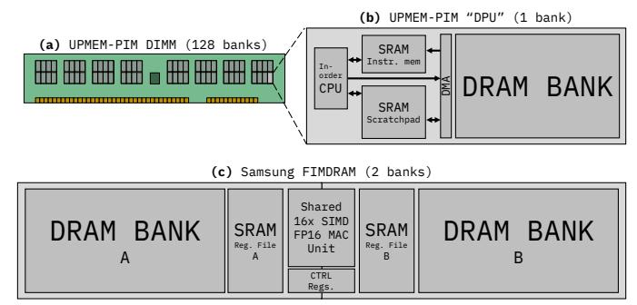
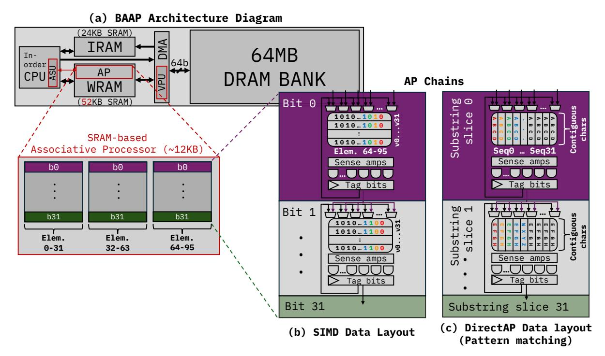

# *B. Limitations of previous work*

General-purpose near-memory architectures. The first two rows in Table [I](#page-2-0) list examples of the coarser-grain approaches to processing near DRAM, that is, at the highest degree of separation. Those involving 3D stacking or processing at the rank level incorporate processing elements in an entirely separate die from that of DRAM, and can thus leverage the CMOS process. For that reason, the proposals in this space range from application-specific accelerators [\[3\]](#page-12-1) to fully-fledged outof-order processors with multiple levels of caches [\[5\]](#page-12-2), [\[41\]](#page-14-3), or even FPGAs [\[32\]](#page-13-13).

At the bank level, most advocate for specialized logic, or at least for supporting the most common arithmetic operations in the target application. The product from UPMEM [\[11\]](#page-13-4) is, to the best of our knowledge, the first commercially available general-purpose PIM Dual In-line Memory Module (DIMM). We describe this architecture in detail in Section [III-A.](#page-3-0) At a high level, their approach consists of appending to each DRAM bank a very simple in-order CPU. This is reminiscent of seminal academic proposals, such as IRAM [\[44\]](#page-14-5) and FlexRAM [\[31\]](#page-13-14). The decision to have only a small core per bank was driven by multiple limitations intrinsic to the "2x nm" DRAM process [\[11\]](#page-13-4). Specifically, the routing density can be dramatically lower, with only three metal layers as opposed to the more than ten that would be available in a conventional logic process. In addition to this, logic is ten times less dense, pitch is four times larger, and the transistors are three times slower [\[11\]](#page-13-4), [\[21\]](#page-13-5), [\[29\]](#page-13-15). These factors led to careful design decisions that minimize the footprint of this already highly constrained CPU: 14 pipeline stages were required to be able to clock it at a maximum of 500 MHz. ALUs only support single-cycle bitwise operations, shifts, and scalar integer additions and subtractions, with all other operations emulated in software. They also did away with bypass logic and stall signals, which means that the pipeline has to be filled by exploiting fine-grained multithreading to space dependencies out, which they can achieve for some applications by supporting up to 24 hardware threads. Despite these limitations, the UPMEM product has been an effective demonstrator and testbed, showcasing what general-purpose PIM is capable of and what the restrictions placed by the DRAM process permit in terms of logic integration. Numerous works have already benchmarked these devices and suggested possible improvements, but the base product already shows significant gains in performance and energy efficiency across a variety of memory-intensive applications [\[12\]](#page-13-16), [\[19\]](#page-13-17), [\[21\]](#page-13-5). This is in great part due to the amount of throughput that can be exploited by attaching multiple PIM-enabled DIMMs to a single system.

Application-specific near-memory architectures. Major industry players in the memory space have navigated the nearmemory processing design space by introducing dedicated logic for specific applications at different (and even multiple [\[42\]](#page-14-4)) levels of the DDR and HBM hierarchies, also facing similar challenges as the efforts discussed above. For example, SK hynix and Samsung have demonstrated bankadjacent multiply-accumulate SIMD units to target AI applications [\[26\]](#page-13-8), [\[33\]](#page-13-6), [\[36\]](#page-13-7). NeuPIMs [\[27\]](#page-13-18) accelerates batched LLM inference by splitting work across a GEMM-optimized NPU and a GEMV-optimized PIM, and by enabling concurrent NPU+PIM execution via dual row buffers per bank. Duplex [\[56\]](#page-14-6) targets MoE and attention by coupling a conventional compute engine (xPU) with 3D-stacked memory and selecting xPU vs accelerators in the logic die based on operational intensity. In AttAcc [\[42\]](#page-14-4), the authors opt to implement some of the accelerators in the HBM buffer chip instead of the bank due to the limitations of the DRAM process. Major efforts to enable forms of general-purpose computation are instead relegated to the rank level or channel level [\[5\]](#page-12-2), [\[32\]](#page-13-13). *While*

TABLE I: Top-down Hierarchical Classification of Representative PIM Architectures

| PIM granularity               | Architecture                                          | Mem. access latency | Aggregate throughput | Programmability                                                  | SIMD Arithm. Support | Pattern matching support | Targeted workloads                                           |
|-------------------------------|-------------------------------------------------------|------------------------|-------------------------|------------------------------------------------------------------|-------------------------|--------------------------|--------------------------------------------------------------|
| Channel-level / 3D stacked | Active Memory Cube [40] Tesseract [3]              | Moderate (70-140ns) | High                    | Very high (general purpose) Logic-layer CPUs or accelerators  | ✓ Possible              | ✓ Possible               | General purpose Memory bound                              |
| Rank-level                    | MCN [5] Samsung AxDIMM [32]                        | Moderate (70-140ns) | High                    | Very high (general purpose) 4+ OoO CPU cores or FPGAs         | ✓ 2+ lanes              | ✓ Possible               | General purpose Memory bound                              |
| Bank-level                    | UPMEM DDR4-PIM [11]                                   | Low                    | Very high               | High (general purpose) Scalar, in-order CPU                   | X                       | ✓ 64-bit wide            | Scalar, integer, high TLP Moderate to low locality        |
|                               | Samsung FIMDRAM [33], [36] SK hynix AiM [34], [35] | (tens of ns)           | very mgn                | Low (fixed operation) SIMD MAC units (FP16/BF16) 1 | ✓ 16 lanes 1 | ×                        | Machine learning / Numerical Moderate to low locality     |
| Subarray-level                | Fulcrum [37]                                          | Low                    | ns) Very high           | Moderate (multiple operations) Per-subarray ALU (INT32/FP32)     | ×                       | ✓ 32-bit wide            | Bulk bitwise; databases Low locality                      |
|                               | Sieve [53]                                            | (tens of ns)           |                         | None (specialized logic) Pattern matching engine              | ×                       | ✓ Kbit wide              | Genomics kernel ("k-mer matching") No temporal locality   |
| Bank-level                    | BAAP (This work)                                      | Low (tens of ns)    | Very high               | Very high (general purpose) In-order CPU + SRAM PUM (AP)      | ✓ 100+ lanes            | ✓ < Mbit wide            | General purpose + SIMD Pattern matching, graph processing |

1 The main difference between FIMDRAM and AiM is the supported datatype (FP16 vs BF16) and the fact that, in FIMDRAM, MAC units are shared by every two banks, as opposed to each bank having its own.

fine-grain PIM architectures (sometimes real prototypes) with either SIMD processing [26], [36], graph processing [11], or pattern matching capabilities [50], [53] near the bank do exist individually, they have not been commercialized by major DRAM manufacturers, and one general enough to tackle all three has not been proposed.

## C. In-situ Compute-in-SRAM

Multiple works in the architecture and circuits community have explored the potential of several approaches to compute in SRAM involving bitline computation or modifying the peripherals [2], [6], [9], [51]. Jeloka et al. [30] proposed a 6T push-rule SRAM cell design that allows for multirow activation (see Figure 1.) While it can be used as a conventional SRAM memory, its sense amplifiers can switch from differential sensing mode to single-ended mode, in which bitlines BL and BLB are sensed separately. In this mode, activating multiple rows simultaneously enables bitwise logic within a column. Crucially, there is an additional wordline (one per access transistor: WLL and WLR.) These modifications enable binary CAM (BCAM) and ternary CAM (TCAM) operations with a much smaller footprint than traditional 10T and 16T CAM designs.

A series of recent works employ or repurpose cache-like structures as compute engines. Compute Caches [1] demonstrate how the bitline computation capabilities in the SRAM from [30] can be used to implement basic parallel operations within a cache, such as XOR, comparison, copy, and carryless multiplication. Neural Cache [13] extends this with bit-serial computation and transposition units, and applied it to machine learning applications. Duality Cache [17] wraps it with a PTXlike ISA and SIMT programming model. EVE [4] is a related effort that proposes modifications to the peripheral circuitry to enable bit-hybrid execution of a wide range of in-place microoperations, mapped to the standard RISC-V vector extensions. A commercial, yet less aggressive 12T-SRAM implementation is the APU from GSI Technology [24], which has also been successfully mapped to a vector ISA [20]. CAPE and later works [8], [52], [55] adopt the associative processing (AP) paradigm [14]-[16], [48], in which any in-place operation can

Fig. 1: 6T push-rule SRAM arrays, as described in [30], can be employed to build dense content-addressable memories. To perform a BCAM search operation where the *key* (query) is '1', wordline WLR is set to VDD and WLL to GND. The opposite applies when searching for a '0'. Both bitline (BL) and bitline bar (BLB) will remain at their precharged high voltage if all bitcells in a column match the search key. ANDing them will result in a '1' to indicate a match, or a '0' otherwise, which is often referred to as the tag bits.

be expressed as (potentially many) sequences of parallel CAM searches and updates. We show an example in Figure 2.

#### III. THE BAAP PIM ARCHITECTURE

BAAP is a fully programmable SRAM-based PIM solution that can exploit both MIMD and SIMD parallelism, in addition to the pattern-matching capabilities of associative memory. It leverages DRAM bank adjacency, yielding low latencies and high internal bandwidth without significantly impacting DRAM subarrays. We employ the commercially available UPMEM PIM product as a realistic foundation for our study, although we believe our insights are also relevant to other scratchpad-augmented PIM designs, like the one shown in Figure 3c.

Fig. 2: Example AP operation: an XOR between the top two rows of the subarray that stores the result in the bottom row. Following the XOR truth table, we **①** search for the case where any column of the first row contains a 0 while the second row contains a 1. We then **②** search for the opposite case and non-destructively accumulate it with the results of the previous search in the tag bits. Lastly, we perform **③** a single batch update to the last row replacing it with the contents of the tag bits to store the final result of the operation. A dedicated data line (feedback loop) exists for this purpose (see Figure 4.)

## A. UPMEM baseline design and programming model

The general organization of each individual bank in the BAAP architecture is modeled after that of the DRAM Processing Unit (DPU) as proposed in the UPMEM commercial product [11], shown in Figure 3b with the specifications listed in Table III. UPMEM divides DRAM chips into as many DPUs as DRAM banks. A DPU consists of: (1) a very small inorder CPU, adjacent to (2) the DRAM bank itself (referred to by UPMEM as "Main RAM"), with two SRAM arrays inbetween to be used as (3) instruction memory (IRAM), and (4) as a scratchpad (WRAM, short for "Working RAM"). The bank-adjacent CPU does not access the DRAM bank directly; instead, it accesses the WRAM scratchpad, hiding the latency between the small CPU and the memory bank—which, albeit much lower than the usual latency between the host CPU and DRAM, is still up to two orders of magnitude slower than the single-cycle accesses to the scratchpad [11], [21]. The WRAM is managed manually by the programmer via DMA requests. UPMEM supports a scalar multithreaded execution model for its intra-bank, in-order CPU.

The server's host-side code is responsible for orchestrating communication: scattering, gathering, and broadcasting data across DPUs by writing directly to their address space. The in-order CPUs within the DPUs have their own ISA, and the binaries they run are compiled and offloaded by the host. Therefore the DPU can be regarded as a conventional bank of main memory unless the application invokes an API call to indicate its intent to execute a PIM kernel, which boots up the in-order CPU. Instructions are then streamed from the DRAM bank into IRAM, from where the per-bank in-order CPUs can fetch them.

#### B. BAAP: A Bank-Adjacent Associative Processor

The simplicity of the original UPMEM CPU [11] made it possible to implement it in a DRAM process, enabling programmable, general-purpose computing. However, as benchmarking works have shown [21], its simplicity is also its main

Fig. 3: The commercial 8 GB UPMEM DDR4-2400 PIM-enabled DIMM (a) contains eight data-processing units (DPUs) per chip, each consisting of the actual DRAM bank and an in-order CPU. (b) shows the structure of a DPU. The Samsung FIMDRAM architecture (c) instead proposes sharing a SIMD MAC unit for every two banks. Both architectures make use of SRAM buffering structures to bridge the final latency gap, for data staging, and as command/instruction memory.

TABLE III: UPMEM DIMM Specifications

| Dimensions       | DDR4-2400 DIMM                                  |  |  |
|------------------|-------------------------------------------------|--|--|
|                  | 8GB w/ 16 chips x 8 banks (128 banks per DIMM)  |  |  |
| Bank-level logic | in-order CPU @ 500 MHz, UPMEM ISA,              |  |  |
| ("DPU")          | single-decode, 14-stage "Revolver" pipeline,    |  |  |
|                  | 24 HW threads (for fine-grained multithreading) |  |  |
|                  | 32+64-bit integer FUs (1 cyc. ADD, 32 cyc. MUL) |  |  |
|                  | 2-split register file, no hazard logic          |  |  |
| Memory           | 24 KB SRAM instruction memory (IRAM)            |  |  |
| (per DPU)        | 64 KB SRAM scratchpad (WRAM)                    |  |  |
|                  | 64MB DRAM Bank (1 GBps)                         |  |  |

drawback: once the data movement bottleneck is overcome, many applications become compute-bound at the bank level, limiting the applicability of an otherwise versatile design. Here, we observe an opportunity not only to exploit SIMD parallelism but, more generally, to overlap long-latency sequences of AP operations (see Table IV) with the explicit and faster near-bank DMA transfers. In this subsection, we provide an overview of the necessary changes to enable bank-adjacent SIMD arithmetic and AP while still retaining the scalar functionality of the UPMEM baseline.

The main modification is the introduction of the aforementioned 6T push-rule SRAM subarray design (Section II-C)—and, critically, the reconfigurable sense amplifier logic to switch between modes—, which we extend with the peripheral logic in Figure 1. The inclusion of one AND gate per BL/BLB pair and "tag" registers to store search results as shown in said figure is sufficient to enable the operation of the individual subarrays as content-addressable memories, and thus, as associative processors.

1) Extending the ISA and Execution Model: To accommodate pattern matching and SIMD capabilities, we extend the UPMEM ISA with the instructions in Table IV and reimagine the individual components as shown in Figure 4a (highlighted in red). The decoding logic has been extended with an Associative Sequencing Unit (ASU): it buffers issued instructions and stores the optimized AP microcode [57] that implements

| TABLE IV: Format and latency breakdown of BAAP instructions,    |
|-----------------------------------------------------------------|
| which operate on hundreds of $n$ -wide elements simultaneously. |

| Instructions Mnemonic Purpose |              |                      |                                                                                |                      |
|-------------------------------|--------------|----------------------|--------------------------------------------------------------------------------|----------------------|
|                               | Minemonic    |                      | Purpose                                                                        | (AP cycles)          |
|                               | ap_and       | vdst, vs1, vs2       | Bit-parallel AND                                                               | 3                    |
|                               | ap_or        | vdst, vs1, vs2       | Bit-parallel OR                                                                | 3                    |
| ۱                             | ap_xor       | vdst, vs1, vs2       | Bit-parallel XOR                                                               | 4                    |
| SIMD Mode                     | ap_add       | vdst, vs1, vs2       | Bit-serial addition                                                            | 8n + 2               |
|                               | ap_sub       | vdst, vs1, vs2       | Bit-serial subtraction                                                         | 8n + 2               |
|                               | ap_mul       | vdst, vs1, vs2       | Bit-serial multiplication                                                      | $4n^2 + 4n$          |
|                               | ap_redsum    | vdst, vs1            | Bit-serial reduction sum                                                       | n                    |
|                               | ap_eq        | vdst, vs1, vs2       | Bit-serial set if equal                                                        | n+4                  |
|                               | ap_merge     | vdst, vs1, vs2, pred | Bit-serial merge, predicated                                                   | 4                    |
|                               | ap_search    | field_mask, imm      | Search CAM; key="imm" Sets tag bits on match                                | 1                    |
| DirectAP Mode                 | ap_searchacc | field_mask, imm      | Search CAM; key="imm" Sets tag bits on match (non-destructive, like an OR)     | 2                    |
|                               | ap_update    | field_mask, imm      | Write CAM; val="imm" Writes "imm" to CAM using tag bits to mask bitlines | 1                    |
| -                             | ap_set_tags  | imm                  | Sets tag bits to "imm"                                                         | 1                    |
|                               | ap_regex     | rdst, imm            | Tags all occurrences of pattern "imm", returns count                           | < m − k (See III) |

each of them, expressed as sequences of CAM searches and updates, which are the only operations the AP natively handles. Alongside the ASU, a small Vector Prefetching Unit (VPU) is added between the DMA engine and the AP datapath. It pre-issues and buffers the next vector load/store while the AP is computing on the current vector. Once the operands of an instruction are ready, the ASU begins asserting the corresponding control signals to drive the peripheral logic of the AP. At the bank level, BAAP supports three modes of PIM kernel execution:

- (a) Scratchpad Mode: Replicates the functionality of the multithreaded UPMEM baseline: the programmer manages the scratchpad (WRAM) explicitly in the DPU-side code. Under the hood, this behavior is implemented with DMA load/store instructions that take source and destination addresses of the DRAM bank and WRAM as parameters. The in-order CPU can then read directly from this scratchpad using conventional single-cycle load/store instructions. With support for 24 hardware threads, WRAM scratchpad storage can either be partitioned among them or shared, with atomic instructions to prevent race conditions.
- **(b) SIMD Mode** and **(c) DirectAP Mode:** A slice of the same SRAM array that was being employed as a scratchpad is dynamically reconfigured to serve the purpose of a vector unit or directly exposed as an associative processor, respectively. The rest of this section describes each of these modes in detail, how to switch between modes, and the implications thereof.
- 2) Runtime layout management: BAAP makes use of three layouts that the WRAM scratchpad can hold: the native byte-addressable layout used in scratchpad mode, the bit-sliced layout used in SIMD Mode, and the column-contiguous layout used in DirectAP mode (Figure 4b–c). Each is the natural representation for its mode: bit-sliced data enable bit-parallel and bit-serial arithmetic across all elements of a vector

simultaneously, while column-contiguous data enables full-word CAM matches in a single cycle. We now describe how layouts are selected, converted, and kept consistent at run time. **Responsibility:** Layout management is split across four layers of responsibility, mirroring UPMEM's existing host/DPU/scratchpad division:

- ① Host-side code is responsible for the initial placement of every working set in the DRAM bank. The UPMEM SDK's scatter/gather/broadcast primitives are extended with a layout argument that selects the stride pattern for the initial data transfer. When a kernel's mode is fixed, as is the case for the applications we evaluated, this single host-side decision suffices, and layout transitions are not needed during kernel execution. For programs with distinct PIM phases, the host is expected to invoke a different kernel for each, with a different DRAM memory layout when necessary, flushing the scratchpad across layouts.
- ② In the DPU runtime library, we provide a thin SDK extension exposing baap\_set\_mode (mode, m), which converts an m-vector-register working set in place by flushing it from the scratchpad (draining it to the DRAM bank if it has been modified) and reloading it in the new layout. This is realized entirely as DPU-side code using the DMA engine's existing strided access support; no additional hardware is required.
- ③ The programmer or compiler declares the main mode of each PIM kernel at compile time. Static declaration of the mode allows the runtime to hoist the host-side scatter into the right layout up front. However, the ISA does not preclude inkernel switches: (a) using an instruction specific to a different mode would result in an implicit change of modes, or (b) a programmer (or a compiler emitting BAAP intrinsics) may insert baap\_set\_mode and the appropriate converter call to change layouts explicitly.
- ## Hardware reconfiguration is relatively simple: writing a control status register (CSR) toggles the control lines that switch the 6T push-rule SRAM sense amplifiers between differential (SRAM) and single-ended (CAM) operation, as described in Section II-C. Jeloka et al.'s test chip [30] demonstrates on-the-fly BCAM/TCAM/SRAM switching and shows that, in SRAM mode, row-wise reads and writes use conventional differential signaling with negligible performance impact from reconfigurability. The two single-ended sense paths used for CAM are exactly the same transistors that, when tied together, form the differential SA in SRAM mode; switching between CAM and SRAM is a control-only change in the sense path. BAAP's mode selection therefore piggybacks on a silicon-proven reconfigurable 6T push-rule SRAM peripheral, with no microarchitectural state to drain across the switch.

**Data relayout overhead:** If a DPU kernel must switch configurations at run time (e.g., from DirectAP's contiguous layout to SIMD's bit-sliced layout), the DPU-side runtime helper routine executes the drain-flip-reload procedure described above. This is conceptually similar to CAPE's mode reconfiguration in the Castle work [7]. Draining and reloading a full working set of three vector registers (between 1 and 6 KiB, depending

Fig. 4: A possible configuration of the BAAP architecture, in this case, extending the UPMEM hardware. Major high-level departures from said design are highlighted in red. A portion of the WRAM scratchpad (25% in this example) is repurposed as an associative processor.

on BAAP capacity) takes up to  $t_{\rm worst} = \frac{2 \times 6 \, {\rm KiB}}{{\rm BW}_{\rm bank}} \approx 0.171 \, {\rm ms},^1$  so the worst-case relayout amortizes after roughly  $6 \times 10^4$  cycles at 350 MHz. Using the per-instruction cycle counts in Table IV, this is equivalent to 2–15 SIMD multiplications. The boundary is thus clear: a workload that alternates between modes very often would not amortize the relayout and would be better mapped to a single mode when possible, with host fallback/co-execution for specific phases, as is the case for fixed-function PIM architectures [27], [34], and the UPMEM baseline itself [11], [21].

3) AP chains enable SIMD arithmetic: BAAP supports SIMD operations on up to 32 vector names (v0-v31+4 metadata registers) containing hundreds of 32-bit elements. By constructing BAAP's scratchpad out of many 32x36 subarrays, it is possible to perform low-latency parallel searches and updates, similarly to Caminal et al.'s host-side AP design [8]. Here, however, can benefit from the low-latency access to the local DRAM bank, as shown in Figure 4a. Previous work on APs [8], [55] describes in great detail how multiple subarrays can be stitched together into a propagation chain. Using a bit-sliced layout (i.e., the  $i^{th}$  bit of the  $k^{th}$  element of each vector resides in the  $i^{th}$  subarray of the chain that holds all  $k^{th}$  vector elements), as shown in Figure 4b, it is possible to perform bit-serial operations, such as addition and multiplication, in addition to bitwise logic operations (see Table IV.)

In the configuration shown in Figure 4, the AP scratchpad of one DRAM bank can hold 32 96-element vectors. Since

1At 350 MHz, assuming the worst-case fine-grain access pattern (no row-buffer locality, and a stride where each access hits a different DRAM row), effective per-bank bandwidth has been measured to be 72.58 MB/s [21].

each DRAM chip contains eight banks (Table III), said chip will be handling  $32 \times 768$  vector elements total. (Whether seen as  $8 \times 32 \times 96$ -element vectors or  $32 \times 768$ -element vectors distributed across eight independent APs is an algorithmic abstraction; logically and physically, they are handled independently using separate program threads mapped onto different DPUs.) Overall, a single 16-chip DIMM of these dimensions will thus be able to operate simultaneously on as many as 12,288 32-bit results at any one point in time. In Section IV, we perform a sensitivity study to evaluate the impact scratchpad capacity has on performance.

Recall that, as shown in Table IV, arithmetic operations such as vector addition (ap\_add) are carried out over hundreds or potentially thousands of cycles of in-place searches and updates, even if these are done in parallel over all the elements of the vectors involved within and across banks. To allow for overlapping of such an arithmetic operation with a follow-up vector load or store operation, we extend the control logic with a very simple Vector Prefetching Unit (VPU) that nonspeculatively engages the DMA engine to perform a subsequent vector load/store that hits the five-stage pipeline's memory stage (as long as the operands are ready), using an additional vector-sized buffer.

4) Finer-grain control via DirectAP Mode: Abstracting away an associative processor as just a SIMD engine is convenient for programmability, since compilers can handle this without further extensions. However, it leaves potential performance for other applications untapped. An example of this is pattern matching, an application that is naturally suitable for content-addressable memories when used directly as such.

SIMD mode adopts a bit-sliced data layout, as it facilitates operating on the same bit positions of all vector elements in parallel and, when operating bit-serially, for carry propagation across chains. However, pattern matching acceleration benefits from a contiguous data layout, as it produces matches for entire words in a single cycle, as opposed to in as many cycles as the bitwidth of the search key.

We propose providing support for DirectAP mode, that is, exposing to the programmer and the compiler a series of instructions that allow for fine-grained control over the content and functionality of the AP-enabled subarrays. For example, to replicate the behavior of the XOR instruction from Figure [2,](#page-3-1) the ap\_search, ap\_searchacc, and ap\_update instructions map to operations ➊, ➋, and ➌, respectively. To specify what the wordlines should be set to (e.g. the search key), an immediate value (*imm*) can be passed in the second field of the instruction (see Table [IV\)](#page-4-0), in addition to a *field mask* to specify "don't cares" (X).

Furthermore, we implemented a pseudo instruction (ap\_regex) to support pattern-matching applications specifically. For a pattern of length k and a text of length m, it will sequence as many exact AP searches as necessary to exhaustively find all occurrences of the pattern across all subarrays and store the count in a destination scalar register, supporting also wildcard characters. If the pattern to be searched does not fit in a single subarray, it will spill over to the next, at the cost of subarray-level parallelism.

While the mapping to text-based pattern matching applications is most apparent, DirectAP mode also allows for lowlevel optimizations in other applications. Algorithm [1](#page-6-0) shows such an example for graph processing, written in DirectAP intrinsics that correspond to the extended ISA we presented earlier. Following the line numbers, in (1) the initial state is such that edges are loaded into the AP with each column storing at least one edge, and ranges of rows correspond to a specific field containing information about said edge (e.g., the FROM field encodes the origin node, and the PROCESSED field whether it has already been traversed). In (3-4), we initialize the array that will contain the result of the traversal and start processing our first batch of edges in parallel: (5- 7) the edges that have the start\_node as their destination (TO) or origin (FROM) are found and marked in batch as the CURRENT frontier of edges to be processed in our traversal. We then iterate until BFS is done (8-29), which can either be triggered by a stop condition (traversal limit) or by reaching an empty frontier (11-12). In this loop, we start by (10) searching for all edges in the CURRENT frontier that haven't been processed yet, (14) setting them as processed, and (15-16) reading the tags out into the scratchpad section so that we can clear them. We can then (17) read out the TO field from every previously-tagged edge so that, if it corresponds to a node that is yet to be visited, (20-22) we can issue searches for all edges stemming from the newly-discovered nodes and accumulate their results in the tag bits, (23) allowing us to form a new CURRENT frontier with a single bulk update. Lastly, we make sure to mark all edges TO these nodes as

# *B. Limitations of previous work*

General-purpose near-memory architectures. The first two rows in Table [I](#page-2-0) list examples of the coarser-grain approaches to processing near DRAM, that is, at the highest degree of separation. Those involving 3D stacking or processing at the rank level incorporate processing elements in an entirely separate die from that of DRAM, and can thus leverage the CMOS process. For that reason, the proposals in this space range from application-specific accelerators [\[3\]](#page-12-1) to fully-fledged outof-order processors with multiple levels of caches [\[5\]](#page-12-2), [\[41\]](#page-14-3), or even FPGAs [\[32\]](#page-13-13).

At the bank level, most advocate for specialized logic, or at least for supporting the most common arithmetic operations in the target application. The product from UPMEM [\[11\]](#page-13-4) is, to the best of our knowledge, the first commercially available general-purpose PIM Dual In-line Memory Module (DIMM). We describe this architecture in detail in Section [III-A.](#page-3-0) At a high level, their approach consists of appending to each DRAM bank a very simple in-order CPU. This is reminiscent of seminal academic proposals, such as IRAM [\[44\]](#page-14-5) and FlexRAM [\[31\]](#page-13-14). The decision to have only a small core per bank was driven by multiple limitations intrinsic to the "2x nm" DRAM process [\[11\]](#page-13-4). Specifically, the routing density can be dramatically lower, with only three metal layers as opposed to the more than ten that would be available in a conventional logic process. In addition to this, logic is ten times less dense, pitch is four times larger, and the transistors are three times slower [\[11\]](#page-13-4), [\[21\]](#page-13-5), [\[29\]](#page-13-15). These factors led to careful design decisions that minimize the footprint of this already highly constrained CPU: 14 pipeline stages were required to be able to clock it at a maximum of 500 MHz. ALUs only support single-cycle bitwise operations, shifts, and scalar integer additions and subtractions, with all other operations emulated in software. They also did away with bypass logic and stall signals, which means that the pipeline has to be filled by exploiting fine-grained multithreading to space dependencies out, which they can achieve for some applications by supporting up to 24 hardware threads. Despite these limitations, the UPMEM product has been an effective demonstrator and testbed, showcasing what general-purpose PIM is capable of and what the restrictions placed by the DRAM process permit in terms of logic integration. Numerous works have already benchmarked these devices and suggested possible improvements, but the base product already shows significant gains in performance and energy efficiency across a variety of memory-intensive applications [\[12\]](#page-13-16), [\[19\]](#page-13-17), [\[21\]](#page-13-5). This is in great part due to the amount of throughput that can be exploited by attaching multiple PIM-enabled DIMMs to a single system.

Application-specific near-memory architectures. Major industry players in the memory space have navigated the nearmemory processing design space by introducing dedicated logic for specific applications at different (and even multiple [\[42\]](#page-14-4)) levels of the DDR and HBM hierarchies, also facing similar challenges as the efforts discussed above. For example, SK hynix and Samsung have demonstrated bankadjacent multiply-accumulate SIMD units to target AI applications [\[26\]](#page-13-8), [\[33\]](#page-13-6), [\[36\]](#page-13-7). NeuPIMs [\[27\]](#page-13-18) accelerates batched LLM inference by splitting work across a GEMM-optimized NPU and a GEMV-optimized PIM, and by enabling concurrent NPU+PIM execution via dual row buffers per bank. Duplex [\[56\]](#page-14-6) targets MoE and attention by coupling a conventional compute engine (xPU) with 3D-stacked memory and selecting xPU vs accelerators in the logic die based on operational intensity. In AttAcc [\[42\]](#page-14-4), the authors opt to implement some of the accelerators in the HBM buffer chip instead of the bank due to the limitations of the DRAM process. Major efforts to enable forms of general-purpose computation are instead relegated to the rank level or channel level [\[5\]](#page-12-2), [\[32\]](#page-13-13). *While*

TABLE I: Top-down Hierarchical Classification of Representative PIM Architectures

| PIM granularity               | Architecture                                          | Mem. access latency | Aggregate throughput | Programmability                                                  | SIMD Arithm. Support | Pattern matching support | Targeted workloads                                           |
|-------------------------------|-------------------------------------------------------|------------------------|-------------------------|------------------------------------------------------------------|-------------------------|--------------------------|--------------------------------------------------------------|
| Channel-level / 3D stacked | Active Memory Cube [40] Tesseract [3]              | Moderate (70-140ns) | High                    | Very high (general purpose) Logic-layer CPUs or accelerators  | ✓ Possible              | ✓ Possible               | General purpose Memory bound                              |
| Rank-level                    | MCN [5] Samsung AxDIMM [32]                        | Moderate (70-140ns) | High                    | Very high (general purpose) 4+ OoO CPU cores or FPGAs         | ✓ 2+ lanes              | ✓ Possible               | General purpose Memory bound                              |
| Bank-level                    | UPMEM DDR4-PIM [11]                                   | Low                    | Very high               | High (general purpose) Scalar, in-order CPU                   | X                       | ✓ 64-bit wide            | Scalar, integer, high TLP Moderate to low locality        |
|                               | Samsung FIMDRAM [33], [36] SK hynix AiM [34], [35] | (tens of ns)           | very mgn                | Low (fixed operation) SIMD MAC units (FP16/BF16) 1 | ✓ 16 lanes 1 | ×                        | Machine learning / Numerical Moderate to low locality     |
| Subarray-level                | Fulcrum [37]                                          | Low                    | ns) Very high           | Moderate (multiple operations) Per-subarray ALU (INT32/FP32)     | ×                       | ✓ 32-bit wide            | Bulk bitwise; databases Low locality                      |
|                               | Sieve [53]                                            | (tens of ns)           |                         | None (specialized logic) Pattern matching engine              | ×                       | ✓ Kbit wide              | Genomics kernel ("k-mer matching") No temporal locality   |
| Bank-level                    | BAAP (This work)                                      | Low (tens of ns)    | Very high               | Very high (general purpose) In-order CPU + SRAM PUM (AP)      | ✓ 100+ lanes            | ✓ < Mbit wide            | General purpose + SIMD Pattern matching, graph processing |

1 The main difference between FIMDRAM and AiM is the supported datatype (FP16 vs BF16) and the fact that, in FIMDRAM, MAC units are shared by every two banks, as opposed to each bank having its own.

fine-grain PIM architectures (sometimes real prototypes) with either SIMD processing [26], [36], graph processing [11], or pattern matching capabilities [50], [53] near the bank do exist individually, they have not been commercialized by major DRAM manufacturers, and one general enough to tackle all three has not been proposed.

## C. In-situ Compute-in-SRAM

Multiple works in the architecture and circuits community have explored the potential of several approaches to compute in SRAM involving bitline computation or modifying the peripherals [2], [6], [9], [51]. Jeloka et al. [30] proposed a 6T push-rule SRAM cell design that allows for multirow activation (see Figure 1.) While it can be used as a conventional SRAM memory, its sense amplifiers can switch from differential sensing mode to single-ended mode, in which bitlines BL and BLB are sensed separately. In this mode, activating multiple rows simultaneously enables bitwise logic within a column. Crucially, there is an additional wordline (one per access transistor: WLL and WLR.) These modifications enable binary CAM (BCAM) and ternary CAM (TCAM) operations with a much smaller footprint than traditional 10T and 16T CAM designs.

A series of recent works employ or repurpose cache-like structures as compute engines. Compute Caches [1] demonstrate how the bitline computation capabilities in the SRAM from [30] can be used to implement basic parallel operations within a cache, such as XOR, comparison, copy, and carryless multiplication. Neural Cache [13] extends this with bit-serial computation and transposition units, and applied it to machine learning applications. Duality Cache [17] wraps it with a PTXlike ISA and SIMT programming model. EVE [4] is a related effort that proposes modifications to the peripheral circuitry to enable bit-hybrid execution of a wide range of in-place microoperations, mapped to the standard RISC-V vector extensions. A commercial, yet less aggressive 12T-SRAM implementation is the APU from GSI Technology [24], which has also been successfully mapped to a vector ISA [20]. CAPE and later works [8], [52], [55] adopt the associative processing (AP) paradigm [14]-[16], [48], in which any in-place operation can

Fig. 1: 6T push-rule SRAM arrays, as described in [30], can be employed to build dense content-addressable memories. To perform a BCAM search operation where the *key* (query) is '1', wordline WLR is set to VDD and WLL to GND. The opposite applies when searching for a '0'. Both bitline (BL) and bitline bar (BLB) will remain at their precharged high voltage if all bitcells in a column match the search key. ANDing them will result in a '1' to indicate a match, or a '0' otherwise, which is often referred to as the tag bits.

be expressed as (potentially many) sequences of parallel CAM searches and updates. We show an example in Figure 2.

#### III. THE BAAP PIM ARCHITECTURE

BAAP is a fully programmable SRAM-based PIM solution that can exploit both MIMD and SIMD parallelism, in addition to the pattern-matching capabilities of associative memory. It leverages DRAM bank adjacency, yielding low latencies and high internal bandwidth without significantly impacting DRAM subarrays. We employ the commercially available UPMEM PIM product as a realistic foundation for our study, although we believe our insights are also relevant to other scratchpad-augmented PIM designs, like the one shown in Figure 3c.

Fig. 2: Example AP operation: an XOR between the top two rows of the subarray that stores the result in the bottom row. Following the XOR truth table, we **①** search for the case where any column of the first row contains a 0 while the second row contains a 1. We then **②** search for the opposite case and non-destructively accumulate it with the results of the previous search in the tag bits. Lastly, we perform **③** a single batch update to the last row replacing it with the contents of the tag bits to store the final result of the operation. A dedicated data line (feedback loop) exists for this purpose (see Figure 4.)

## A. UPMEM baseline design and programming model

The general organization of each individual bank in the BAAP architecture is modeled after that of the DRAM Processing Unit (DPU) as proposed in the UPMEM commercial product [11], shown in Figure 3b with the specifications listed in Table III. UPMEM divides DRAM chips into as many DPUs as DRAM banks. A DPU consists of: (1) a very small inorder CPU, adjacent to (2) the DRAM bank itself (referred to by UPMEM as "Main RAM"), with two SRAM arrays inbetween to be used as (3) instruction memory (IRAM), and (4) as a scratchpad (WRAM, short for "Working RAM"). The bank-adjacent CPU does not access the DRAM bank directly; instead, it accesses the WRAM scratchpad, hiding the latency between the small CPU and the memory bank—which, albeit much lower than the usual latency between the host CPU and DRAM, is still up to two orders of magnitude slower than the single-cycle accesses to the scratchpad [11], [21]. The WRAM is managed manually by the programmer via DMA requests. UPMEM supports a scalar multithreaded execution model for its intra-bank, in-order CPU.

The server's host-side code is responsible for orchestrating communication: scattering, gathering, and broadcasting data across DPUs by writing directly to their address space. The in-order CPUs within the DPUs have their own ISA, and the binaries they run are compiled and offloaded by the host. Therefore the DPU can be regarded as a conventional bank of main memory unless the application invokes an API call to indicate its intent to execute a PIM kernel, which boots up the in-order CPU. Instructions are then streamed from the DRAM bank into IRAM, from where the per-bank in-order CPUs can fetch them.

#### B. BAAP: A Bank-Adjacent Associative Processor

The simplicity of the original UPMEM CPU [11] made it possible to implement it in a DRAM process, enabling programmable, general-purpose computing. However, as benchmarking works have shown [21], its simplicity is also its main

Fig. 3: The commercial 8 GB UPMEM DDR4-2400 PIM-enabled DIMM (a) contains eight data-processing units (DPUs) per chip, each consisting of the actual DRAM bank and an in-order CPU. (b) shows the structure of a DPU. The Samsung FIMDRAM architecture (c) instead proposes sharing a SIMD MAC unit for every two banks. Both architectures make use of SRAM buffering structures to bridge the final latency gap, for data staging, and as command/instruction memory.

TABLE III: UPMEM DIMM Specifications

| Dimensions       | DDR4-2400 DIMM                                  |  |  |
|------------------|-------------------------------------------------|--|--|
|                  | 8GB w/ 16 chips x 8 banks (128 banks per DIMM)  |  |  |
| Bank-level logic | in-order CPU @ 500 MHz, UPMEM ISA,              |  |  |
| ("DPU")          | single-decode, 14-stage "Revolver" pipeline,    |  |  |
|                  | 24 HW threads (for fine-grained multithreading) |  |  |
|                  | 32+64-bit integer FUs (1 cyc. ADD, 32 cyc. MUL) |  |  |
|                  | 2-split register file, no hazard logic          |  |  |
| Memory           | 24 KB SRAM instruction memory (IRAM)            |  |  |
| (per DPU)        | 64 KB SRAM scratchpad (WRAM)                    |  |  |
|                  | 64MB DRAM Bank (1 GBps)                         |  |  |

drawback: once the data movement bottleneck is overcome, many applications become compute-bound at the bank level, limiting the applicability of an otherwise versatile design. Here, we observe an opportunity not only to exploit SIMD parallelism but, more generally, to overlap long-latency sequences of AP operations (see Table IV) with the explicit and faster near-bank DMA transfers. In this subsection, we provide an overview of the necessary changes to enable bank-adjacent SIMD arithmetic and AP while still retaining the scalar functionality of the UPMEM baseline.

The main modification is the introduction of the aforementioned 6T push-rule SRAM subarray design (Section II-C)—and, critically, the reconfigurable sense amplifier logic to switch between modes—, which we extend with the peripheral logic in Figure 1. The inclusion of one AND gate per BL/BLB pair and "tag" registers to store search results as shown in said figure is sufficient to enable the operation of the individual subarrays as content-addressable memories, and thus, as associative processors.

1) Extending the ISA and Execution Model: To accommodate pattern matching and SIMD capabilities, we extend the UPMEM ISA with the instructions in Table IV and reimagine the individual components as shown in Figure 4a (highlighted in red). The decoding logic has been extended with an Associative Sequencing Unit (ASU): it buffers issued instructions and stores the optimized AP microcode [57] that implements

| TABLE IV: Format and latency breakdown of BAAP instructions,    |
|-----------------------------------------------------------------|
| which operate on hundreds of $n$ -wide elements simultaneously. |

| Instructions Mnemonic Purpose |              |                      |                                                                                |                      |
|-------------------------------|--------------|----------------------|--------------------------------------------------------------------------------|----------------------|
|                               | Minemonic    |                      | Purpose                                                                        | (AP cycles)          |
|                               | ap_and       | vdst, vs1, vs2       | Bit-parallel AND                                                               | 3                    |
|                               | ap_or        | vdst, vs1, vs2       | Bit-parallel OR                                                                | 3                    |
| ۱                             | ap_xor       | vdst, vs1, vs2       | Bit-parallel XOR                                                               | 4                    |
| SIMD Mode                     | ap_add       | vdst, vs1, vs2       | Bit-serial addition                                                            | 8n + 2               |
|                               | ap_sub       | vdst, vs1, vs2       | Bit-serial subtraction                                                         | 8n + 2               |
|                               | ap_mul       | vdst, vs1, vs2       | Bit-serial multiplication                                                      | $4n^2 + 4n$          |
|                               | ap_redsum    | vdst, vs1            | Bit-serial reduction sum                                                       | n                    |
|                               | ap_eq        | vdst, vs1, vs2       | Bit-serial set if equal                                                        | n+4                  |
|                               | ap_merge     | vdst, vs1, vs2, pred | Bit-serial merge, predicated                                                   | 4                    |
|                               | ap_search    | field_mask, imm      | Search CAM; key="imm" Sets tag bits on match                                | 1                    |
| DirectAP Mode                 | ap_searchacc | field_mask, imm      | Search CAM; key="imm" Sets tag bits on match (non-destructive, like an OR)     | 2                    |
|                               | ap_update    | field_mask, imm      | Write CAM; val="imm" Writes "imm" to CAM using tag bits to mask bitlines | 1                    |
| -                             | ap_set_tags  | imm                  | Sets tag bits to "imm"                                                         | 1                    |
|                               | ap_regex     | rdst, imm            | Tags all occurrences of pattern "imm", returns count                           | < m − k (See III) |

each of them, expressed as sequences of CAM searches and updates, which are the only operations the AP natively handles. Alongside the ASU, a small Vector Prefetching Unit (VPU) is added between the DMA engine and the AP datapath. It pre-issues and buffers the next vector load/store while the AP is computing on the current vector. Once the operands of an instruction are ready, the ASU begins asserting the corresponding control signals to drive the peripheral logic of the AP. At the bank level, BAAP supports three modes of PIM kernel execution:

- (a) Scratchpad Mode: Replicates the functionality of the multithreaded UPMEM baseline: the programmer manages the scratchpad (WRAM) explicitly in the DPU-side code. Under the hood, this behavior is implemented with DMA load/store instructions that take source and destination addresses of the DRAM bank and WRAM as parameters. The in-order CPU can then read directly from this scratchpad using conventional single-cycle load/store instructions. With support for 24 hardware threads, WRAM scratchpad storage can either be partitioned among them or shared, with atomic instructions to prevent race conditions.
- **(b) SIMD Mode** and **(c) DirectAP Mode:** A slice of the same SRAM array that was being employed as a scratchpad is dynamically reconfigured to serve the purpose of a vector unit or directly exposed as an associative processor, respectively. The rest of this section describes each of these modes in detail, how to switch between modes, and the implications thereof.
- 2) Runtime layout management: BAAP makes use of three layouts that the WRAM scratchpad can hold: the native byte-addressable layout used in scratchpad mode, the bit-sliced layout used in SIMD Mode, and the column-contiguous layout used in DirectAP mode (Figure 4b–c). Each is the natural representation for its mode: bit-sliced data enable bit-parallel and bit-serial arithmetic across all elements of a vector

simultaneously, while column-contiguous data enables full-word CAM matches in a single cycle. We now describe how layouts are selected, converted, and kept consistent at run time. **Responsibility:** Layout management is split across four layers of responsibility, mirroring UPMEM's existing host/DPU/scratchpad division:

- ① Host-side code is responsible for the initial placement of every working set in the DRAM bank. The UPMEM SDK's scatter/gather/broadcast primitives are extended with a layout argument that selects the stride pattern for the initial data transfer. When a kernel's mode is fixed, as is the case for the applications we evaluated, this single host-side decision suffices, and layout transitions are not needed during kernel execution. For programs with distinct PIM phases, the host is expected to invoke a different kernel for each, with a different DRAM memory layout when necessary, flushing the scratchpad across layouts.
- ② In the DPU runtime library, we provide a thin SDK extension exposing baap\_set\_mode (mode, m), which converts an m-vector-register working set in place by flushing it from the scratchpad (draining it to the DRAM bank if it has been modified) and reloading it in the new layout. This is realized entirely as DPU-side code using the DMA engine's existing strided access support; no additional hardware is required.
- ③ The programmer or compiler declares the main mode of each PIM kernel at compile time. Static declaration of the mode allows the runtime to hoist the host-side scatter into the right layout up front. However, the ISA does not preclude inkernel switches: (a) using an instruction specific to a different mode would result in an implicit change of modes, or (b) a programmer (or a compiler emitting BAAP intrinsics) may insert baap\_set\_mode and the appropriate converter call to change layouts explicitly.
- ## Hardware reconfiguration is relatively simple: writing a control status register (CSR) toggles the control lines that switch the 6T push-rule SRAM sense amplifiers between differential (SRAM) and single-ended (CAM) operation, as described in Section II-C. Jeloka et al.'s test chip [30] demonstrates on-the-fly BCAM/TCAM/SRAM switching and shows that, in SRAM mode, row-wise reads and writes use conventional differential signaling with negligible performance impact from reconfigurability. The two single-ended sense paths used for CAM are exactly the same transistors that, when tied together, form the differential SA in SRAM mode; switching between CAM and SRAM is a control-only change in the sense path. BAAP's mode selection therefore piggybacks on a silicon-proven reconfigurable 6T push-rule SRAM peripheral, with no microarchitectural state to drain across the switch.

**Data relayout overhead:** If a DPU kernel must switch configurations at run time (e.g., from DirectAP's contiguous layout to SIMD's bit-sliced layout), the DPU-side runtime helper routine executes the drain-flip-reload procedure described above. This is conceptually similar to CAPE's mode reconfiguration in the Castle work [7]. Draining and reloading a full working set of three vector registers (between 1 and 6 KiB, depending

Fig. 4: A possible configuration of the BAAP architecture, in this case, extending the UPMEM hardware. Major high-level departures from said design are highlighted in red. A portion of the WRAM scratchpad (25% in this example) is repurposed as an associative processor.

on BAAP capacity) takes up to  $t_{\rm worst} = \frac{2 \times 6 \, {\rm KiB}}{{\rm BW}_{\rm bank}} \approx 0.171 \, {\rm ms},^1$  so the worst-case relayout amortizes after roughly  $6 \times 10^4$  cycles at 350 MHz. Using the per-instruction cycle counts in Table IV, this is equivalent to 2–15 SIMD multiplications. The boundary is thus clear: a workload that alternates between modes very often would not amortize the relayout and would be better mapped to a single mode when possible, with host fallback/co-execution for specific phases, as is the case for fixed-function PIM architectures [27], [34], and the UPMEM baseline itself [11], [21].

3) AP chains enable SIMD arithmetic: BAAP supports SIMD operations on up to 32 vector names (v0-v31+4 metadata registers) containing hundreds of 32-bit elements. By constructing BAAP's scratchpad out of many 32x36 subarrays, it is possible to perform low-latency parallel searches and updates, similarly to Caminal et al.'s host-side AP design [8]. Here, however, can benefit from the low-latency access to the local DRAM bank, as shown in Figure 4a. Previous work on APs [8], [55] describes in great detail how multiple subarrays can be stitched together into a propagation chain. Using a bit-sliced layout (i.e., the  $i^{th}$  bit of the  $k^{th}$  element of each vector resides in the  $i^{th}$  subarray of the chain that holds all  $k^{th}$  vector elements), as shown in Figure 4b, it is possible to perform bit-serial operations, such as addition and multiplication, in addition to bitwise logic operations (see Table IV.)

In the configuration shown in Figure 4, the AP scratchpad of one DRAM bank can hold 32 96-element vectors. Since

1At 350 MHz, assuming the worst-case fine-grain access pattern (no row-buffer locality, and a stride where each access hits a different DRAM row), effective per-bank bandwidth has been measured to be 72.58 MB/s [21].

each DRAM chip contains eight banks (Table III), said chip will be handling  $32 \times 768$  vector elements total. (Whether seen as  $8 \times 32 \times 96$ -element vectors or  $32 \times 768$ -element vectors distributed across eight independent APs is an algorithmic abstraction; logically and physically, they are handled independently using separate program threads mapped onto different DPUs.) Overall, a single 16-chip DIMM of these dimensions will thus be able to operate simultaneously on as many as 12,288 32-bit results at any one point in time. In Section IV, we perform a sensitivity study to evaluate the impact scratchpad capacity has on performance.

Recall that, as shown in Table IV, arithmetic operations such as vector addition (ap\_add) are carried out over hundreds or potentially thousands of cycles of in-place searches and updates, even if these are done in parallel over all the elements of the vectors involved within and across banks. To allow for overlapping of such an arithmetic operation with a follow-up vector load or store operation, we extend the control logic with a very simple Vector Prefetching Unit (VPU) that nonspeculatively engages the DMA engine to perform a subsequent vector load/store that hits the five-stage pipeline's memory stage (as long as the operands are ready), using an additional vector-sized buffer.

4) Finer-grain control via DirectAP Mode: Abstracting away an associative processor as just a SIMD engine is convenient for programmability, since compilers can handle this without further extensions. However, it leaves potential performance for other applications untapped. An example of this is pattern matching, an application that is naturally suitable for content-addressable memories when used directly as such.

SIMD mode adopts a bit-sliced data layout, as it facilitates operating on the same bit positions of all vector elements in parallel and, when operating bit-serially, for carry propagation across chains. However, pattern matching acceleration benefits from a contiguous data layout, as it produces matches for entire words in a single cycle, as opposed to in as many cycles as the bitwidth of the search key.

We propose providing support for DirectAP mode, that is, exposing to the programmer and the compiler a series of instructions that allow for fine-grained control over the content and functionality of the AP-enabled subarrays. For example, to replicate the behavior of the XOR instruction from Figure [2,](#page-3-1) the ap\_search, ap\_searchacc, and ap\_update instructions map to operations ➊, ➋, and ➌, respectively. To specify what the wordlines should be set to (e.g. the search key), an immediate value (*imm*) can be passed in the second field of the instruction (see Table [IV\)](#page-4-0), in addition to a *field mask* to specify "don't cares" (X).

Furthermore, we implemented a pseudo instruction (ap\_regex) to support pattern-matching applications specifically. For a pattern of length k and a text of length m, it will sequence as many exact AP searches as necessary to exhaustively find all occurrences of the pattern across all subarrays and store the count in a destination scalar register, supporting also wildcard characters. If the pattern to be searched does not fit in a single subarray, it will spill over to the next, at the cost of subarray-level parallelism.

While the mapping to text-based pattern matching applications is most apparent, DirectAP mode also allows for lowlevel optimizations in other applications. Algorithm [1](#page-6-0) shows such an example for graph processing, written in DirectAP intrinsics that correspond to the extended ISA we presented earlier. Following the line numbers, in (1) the initial state is such that edges are loaded into the AP with each column storing at least one edge, and ranges of rows correspond to a specific field containing information about said edge (e.g., the FROM field encodes the origin node, and the PROCESSED field whether it has already been traversed). In (3-4), we initialize the array that will contain the result of the traversal and start processing our first batch of edges in parallel: (5- 7) the edges that have the start\_node as their destination (TO) or origin (FROM) are found and marked in batch as the CURRENT frontier of edges to be processed in our traversal. We then iterate until BFS is done (8-29), which can either be triggered by a stop condition (traversal limit) or by reaching an empty frontier (11-12). In this loop, we start by (10) searching for all edges in the CURRENT frontier that haven't been processed yet, (14) setting them as processed, and (15-16) reading the tags out into the scratchpad section so that we can clear them. We can then (17) read out the TO field from every previously-tagged edge so that, if it corresponds to a node that is yet to be visited, (20-22) we can issue searches for all edges stemming from the newly-discovered nodes and accumulate their results in the tag bits, (23) allowing us to form a new CURRENT frontier with a single bulk update. Lastly, we make sure to mark all edges TO these nodes as

