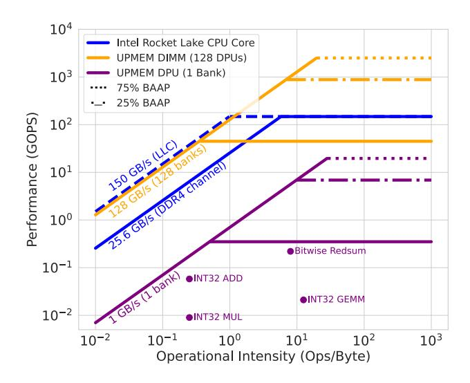
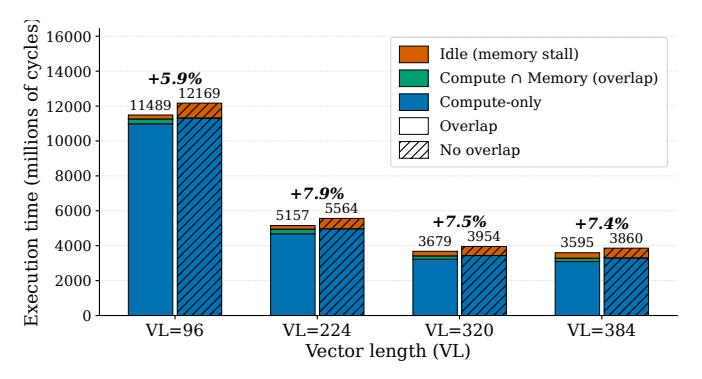
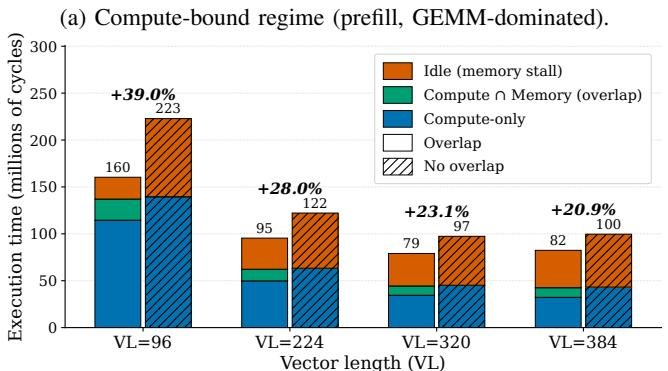
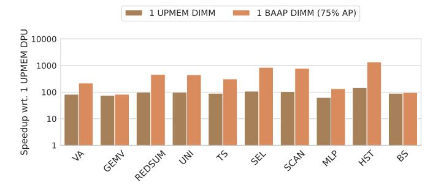
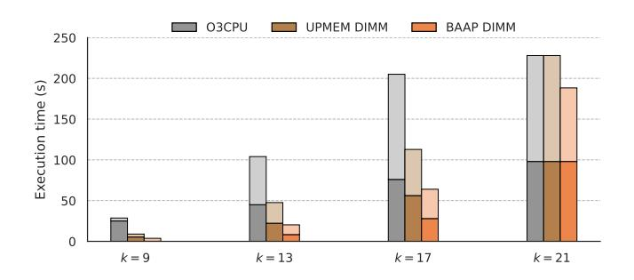

# B. Design Space Exploration

Since our design hinges on trading off scratchpad capacity for additional performance, we conduct a sensitivity study to explore the performance impact of reducing UPMEM's scratchpad capacity when running the PrIM benchmarks [21]. The goal is to identify the stress points when repurposing part of the scratchpad for AP, so that we may focus the rest of our evaluation around that region. The curves in Figure 5 show that, on average for the PrIM benchmarks, UPMEM performance starts to degrade more significantly somewhere between 50 and 25% of full scratchpad capacity. Consequently, we evaluate BAAP configurations that repurpose 25%, 50%, 75%, and 88% of the scratchpad (Table VI). The remaining capacity is reserved for its original purpose, so that purely scalar sections of the code or independent threads may still make use of it.

In Figure 6 we use a roofline model to contrast BAAP against the UPMEM baseline. Our 25% and 75% configurations are plotted as extensions (in dotted lines) of UPMEM's roofline, which for a single DPU (purple) peaks at  $P_{\rm peak}^{\rm DPU} \approx$ 0.35 GOPS [21]. The host CPU baseline (blue) is also included as a reference. The roofline model makes explicit how BAAP lifts the compute ceiling of a bank while leaving the memory slope unchanged, and it highlights which classes of operations cross from compute- to bandwidth-bound as we vary the slice of WRAM repurposed for AP. As data points, we loop over four simple single-DPU (one bank) microbenchmarks on the UPMEM simulator to showcase typical steady-state behavior in both memory- and compute-bound regions of the plot with some of the most commonly used operations. Thus, we execute a loop of integer additions, another of integer multiplications, and another of bitwise reductions, all over two vectors of input

Fig. 6: Roofline plot of several relevant configurations.

data. We also run a loop of  $100 \times 100$  dense matrix-matrix multiplications, representing a higher operational intensity.

On the UPMEM baseline, even very low operational intensities quickly become compute-bound, well before 1 integer operation per byte: integer addition already falls noticeably below the roofline due to pipeline underutilization, and integer multiplication, implemented as a 32-cycle operation, is farthest from the compute ceiling. These observations are consistent with prior work [21], [29]. Scaling from a single DPU to a full 128-bank DIMM shifts UPMEM's roofline upward nearly linearly in both bandwidth and peak compute throughput, but the data points only approach this ideal when workloads are embarrassingly parallel and inter-DPU communication is minimal. BAAP lifts this compute roof per bank without changing the memory-bandwidth slope. In SIMD mode, the per-bank peak throughput for an operation op is  $P_{\text{op}}^{\text{AP}} = \frac{\text{VL}}{c_{\text{op}}} \times \hat{f}$ , where VL is the vector length of the AP, and  $c_{op}$  is the AP instruction latency in cycles (Table IV).

For the 75% configuration, this yields  $\approx 37\,\mathrm{GOPS}$  for bitwise operations,  $\approx 0.43\,\mathrm{GOPS}$  for 32-bit additions, and  $\approx 0.027\,\mathrm{GOPS}$  for 32-bit multiplies. Essentially, we take the UPMEM data points at a given operational intensity and translate them further toward these higher BAAP roofs; for visual clarity, Figure 6 only shows the new roofs and not the shifted dots themselves. These higher roofs largely close the  $2{-}12\times$  gap between UPMEM's achieved performance and its theoretical roofline for INT32 ADD and MUL, pushing many kernels from the compute-bound into the bandwidth-bound regime. As a result, BAAP extends the range of operational intensities for which bank-adjacent PIM is effective, especially for workloads with substantial SIMD or pattern-matching structure, while preserving UPMEM's near-linear scaling with the number of DPUs and memory channels.

(b) Memory-bound regime (decode, per-token GEMV).

Fig. 7: BAAP execution time on GPT-2 Large with the VPU's operand-fetch overlap enabled (solid bar) vs. disabled (striped bar), at  $VL \in \{96, 224, 320, 384\}$ .

#### C. Quantifying Memory and Compute Overlap

This subsection characterizes how often BAAP can mitigate the latency of long, bit-serial AP arithmetic by overlapping it with the operand fetch from DRAM of the next vector load, and identifies the workload regimes (compute-bound vs. memory-bound) in which that hiding mechanism turns into end-to-end speedup. We use LLM inference ("GPT-2 Large") as the study workload because its two main phases naturally bracket the question: the *prefill* stage multiplies the input prompt as a matrix against the model's weight matrices (GEMM) and presents as compute-bound, while *decode* produces output tokens one at a time, each multiplying a single activation vector against the weights with no arithmetic reuse (GEMV) and presents as memory-bound.

We sweep the vector lengths corresponding to the four BAAP configurations (Table VI), and for each one we ablate the Vector Prefetching Unit (VPU) described in Section III-B3, toggling whether the next vector load may be pre-issued while the AP is still handling the current instruction. For every run we partition total execution cycles into three mutually exclusive slices: cycles in which the AP is busy and the DRAM bank is concurrently servicing a request (*Overlap*), cycles in which the pipeline is idle waiting on memory (*Idle*), and cycles in which the AP is busy but memory is idle (*Compute-only*). The *idle* slice is the cost the VPU stands to recover; the *overlap* slice is what it actually does recover.

Figure 7a reports the compute-bound prefill case. Here, the long latency of bit-serial vector multiplication becomes very noticeable. The AP stays busy on GEMM arithmetic with little concurrent memory traffic, so disabling the VPU costs only 5.9–7.9% across the four vector lengths: in this regime, end-to-end speedup comes from raw AP throughput, not from operand-fetch overlap. Figure 7b reverses the picture. The GEMV's lack of arithmetic reuse makes loads from DRAM the bottleneck: disabling the VPU costs 39.0% at VL=96, a 4–7× larger penalty than the prefill case, and shrinks to 20.9% at VL=384 because wider vectors require fewer instructions to process the same data, leaving fewer per-instruction operandfetch stalls for the VPU to hide. This is the regime in which the VPU earns its keep, converting roughly a quarter of decodephase execution time from memory stalls into productive compute.

#### D. PrIM and Phoenix Benchmarks

1) Comparison against UPMEM DPUs: Figure 8 summarizes BAAP's impact on the PrIM benchmark suite, reporting both per-kernel speedup and estimated per-DPU power. These benchmarks were devised in previous work [21] specifically for the purpose of evaluating the performance of the scalar UPMEM architecture across a wide range of scenarios. While PrIM comprises a diverse set of kernels, they all have in common a relatively low operational intensity, below 1 operation per byte. Our baseline is a single UPMEM DPU running 16 "tasklets" (hardware threads), which has been shown experimentally to deliver the highest performance on this architecture [21].

The BAAP 25% configuration is sufficient to achieve a speedup of up to  $7.9 \times (2.29 \times \text{ on average})$ . Increasing the AP-enabled fraction of WRAM scales vector length and, correspondingly, throughput: the 75% configuration reaches up to  $13.97 \times (4.95 \times \text{ on average})$ . Our most aggressive configuration, empirically calibrated in our sensitivity study, takes  $\approx 88\%$  of the total capacity of the scratchpad, bringing this up to  $14.33 \times (5.73 \times \text{ on average})$ . Several of the benchmarks are particularly amenable to the SIMD AP: SEL (SQL-style query), SCAN (prefix sum), and REDSUM (reduction sum) combine streaming access with simple per-element comparisons or reductions, letting BAAP evaluate hundreds of elements in parallel, finally getting to saturate the available memory bandwidth. GEMV (matrix-vector multiplication), TS (time series), and MLP (multilayer perceptron) make heavier use of multiplication. We saw in Section IV-B that UPMEM is not particularly well suited for this task, with a multiplication taking up to 32 cycles. Our AP-based SIMD engine trades off latency for reduced complexity in its design, so multiplication takes hundreds of cycles. However, the increased throughput and the ability to overlap these longer-latency operations with DMA transfers make up for this. VA (vector addition) is more modestly accelerated because UPMEM already supports single-cycle integer additions, reducing the relative advantage of AP-based SIMD. Even not-so-SIMD-friendly applications can benefit from BAAP through vectorization, especially with

Fig. 8: Speedup and estimated power of BAAP when running the PrIM benchmarks on a single DPU (one bank), compared to the UPMEM baseline of equal capacity.

Fig. 9: Speedup of BAAP when running the PrIM benchmarks on a full UPMEM DIMM (128 DPUs).

increased vector lengths. However, in such cases, other approaches can be considered, such as dynamically reverting back the scratchpad to its original functionality, or, when suitable, making use of it in DirectAP mode instead of SIMD mode. For example, HST (histogram) involves pattern matching and would benefit from DirectAP mode. In Section IV-E, we demonstrate this with a more complex application that features a histogram-like section.

The power side of Figure 8 shows that these speedups are achieved while keeping per-DPU power within a realistic budget. We very pessimistically [49] scaled BAAP to planar 65 nm CMOS to account for the hurdles of the DRAM process. Even in such an extreme case, applications generally remain below the 150 mW per-DPU TDP roof measured in the original UPMEM hardware, even for the largest BAAP configuration. In other words, repurposing WRAM for AP raises local switching activity but does not create a new thermal or power bottleneck at the bank level. Considering the significant speedups, this implies a several-fold reduction in total energy, since the execution completes much sooner.

In Figure 9, we evaluate the effect of BAAP when applied at the full DIMM scale, repurposing 75% of every scratchpad adjacent to all 128 banks. When considering only the conventional UPMEM DIMM, we observe the quasi-proportional speedups promised by UPMEM, but this hinges on the parallelism exposed by the application and on communication overheads. Similarly to the one-bank scenario, when the application is amenable to SIMD, BAAP compounds these

Fig. 10: Speedup of a host-side AP [52] and BAAP over an out-of-order CPU core running the Phoenix benchmarks. (a) and (b) show frequency and vector length (VL) sweeps, respectively.

speedups with an additional  $4.1\times$  on average, which is slightly less, mainly due to the reduction and communication overhead of each DPU's intermediate results, which, when necessary, is mediated by the host. MLP is the most prominent example of an application that is impacted by this overhead and thus sees less benefit from scaling BAAP across the DIMM.

2) Comparison against host-side AP and CPU: We compare a BAAP DIMM against a host-side AP (also Jeloka's 6T SRAM [30]) with the aggregate capacity of the 128 APs in all banks of our DIMM. The goal is to evaluate the trade-offs between our bank-adjacent APs, which operate at much lower frequencies, versus one that is not bound by the constraints of the DRAM process but is farther away from the data. We replicated the results of PUMICE [52], an optimized CAPE [8] that overlaps memory accesses and computation. These works mapped the SIMD paradigm to a host-side AP by exposing it to a vector ISA, and evaluated it with the Phoenix MapReduce benchmarks [46]. The gem5 simulation parameters are listed in Table VI.

Our results in Figure 10 reveal that workloads with heavy computation, such as *linear regression*, *histogram*, and *kmeans*, exhibit throughput decreases on BAAP due to its reduced operating frequency near the bank, down to 350 MHz from the 2.72 GHz of the host-side AP baseline. However, our proximity to memory allows us to tap into much lower memory access latencies. Accordingly, we observe that, for memory-intensive workloads (e.g., *reverse index*, a text-based application), the benefits of BAAP are most pronounced, with

throughput increases of over an order of magnitude with respect to the host-side AP. This stems from the frequent load/store operations in such workloads: at high vector lengths, frequent memory access becomes a significant stressor for the host-side AP. We observe similar improvements in other text-based applications, such as wrdcnt and strmatch. The latter stands out by almost reaching three orders of magnitude greater performance than the out-of-order CPU baseline. Figure 10a shows that the lowest frequency at which our largest BAAP configuration yields better average performance for the Phoenix apps is  $\approx 225 \,\mathrm{MHz}$ . When clocked at the same frequency of 350 MHz (Figure 10b), any configuration larger than BAAP 50% yields greater performance on average. Overall, bringing the AP closer to where the data resides significantly mitigates the von Neumann bottleneck, but this can come at a cost for some applications. Greater per-bank vector lengths can help bridge this gap.

### E. DirectAP Mode: Application case study

So far we have evaluated BAAP using WRAM either as a conventional scratchpad or as a SIMD engine. A key advantage of BAAP, however, is that DirectAP mode exposes the underlying CAM semantics directly to the programmer and compiler, enabling optimizations that are difficult to express in scalar or SIMD form. To probe this ceiling, we study an end-to-end genomics pipeline—*k*-mer counting followed by graph traversal—on a full BAAP DIMM (Figure 11). This pipeline naturally exercises two classes of DirectAP kernels: exhaustive pattern matching and frontier-style graph exploration, represented by the dark and light-colored sections of each stacked bar, respectively.

We choose the state-of-the-art SPAdes genome assembler [45] for our multicore CPU reference implementation for reproducibility. The k-mer counting step consists in extracting all letter combinations of length k from a series of genomic samples. The goal then is to form a graph of overlapping sequences, and traverse it for simplification into non-branching paths that can be stitched together to represent the entire genome. Different values of k will affect the quality of the results, and sweeps or combinations are often used. This kernel is also prevalent, with small k values, in other important contexts such as error correction, metagenomics, or population studies. We use a real A. thaliana dataset (SRR29124148); intermediate graph representations can fill the capacity of an entire UPMEM DIMM as k grows. The k-mer counting phase scans all length-k substrings and aggregates their multiplicities; traversal then walks the resulting de Bruijn graph to perform bulge removal and collapse non-branching unitigs. On the UPMEM baseline, k-mer counting is dominated by a linear scan of the bank plus hash-table updates, while traversal relies on scalar frontier management in the DPU cores.

DirectAP mode turns both stages into associative queries over WRAM. For k-mer counting, BAAP performs bank-local exhaustive searches over the CAM-augmented scratchpad instead of streaming through DRAM and probing hash tables, yielding  $2{\text -}38\times$  speedup over UPMEM depending on k. As

Fig. 11: Genome analysis execution time for a sweep of k. Dark and light stacked bars represent the counting and graph traversal steps, respectively.

k increases, however, the number of exact lookups grows exponentially  $(2^k)$ , and beyond  $k \approx 21$  the search space becomes large enough that falling back to the multicore host and its cache hierarchy is preferable at fixed DPU count. For the traversal phase, BAAP uses DirectAP to evaluate many edges in parallel (see Algorithm 1): tags compactly encode the current frontier, and bulk updates materialize the next one. This provides  $1.1-2.8\times$  speedup over UPMEM's scalar graph walk, until host-mediated communication for exchanging frontier information across DPUs becomes the dominant bottleneck at larger k.

This case study illustrates when DirectAP mode is most effective: whenever the computation can be phrased as repeated membership or neighborhood queries over a large, irregular state (e.g., text or k-mer pattern matching, histogram-like counting, graph traversal). In those settings, exposing CAM primitives directly outperforms both UPMEM's scalar WRAM code and BAAP's SIMD-style vectorization, but still inherits the same limitations as other near-bank PIM designs when the algorithm requires heavy inter-bank communication.

#### V. CONCLUSION

By repurposing part of UPMEM's WRAM, BAAP turns each scalar DPU into a multi-mode engine that can behave as a conventional scratchpad, a high-throughput SIMD unit, or a massively parallel AP. Across our evaluation, this consistently closes much of the gap between UPMEM's theoretical roofline and realized performance, while keeping per-DPU power within the original thermal envelope. In single-bank SIMD mode, even with only 25% of WRAM repurposed, BAAP achieves up to 7.9× speedup over a single DPU and up to  $14.3 \times$  in the most aggressive configuration, saturating bandwidth on streaming and reduction kernels. Scaling to all 128 banks adds an average 4.1× DIMM-level speedup on top of UPMEM's own bank parallelism, with host-mediated reductions emerging as the main residual bottleneck. Compared to a host-side AP of comparable total vector length, BAAP trades lower frequency for an order-of-magnitude lower memory latency, yielding over 10× speedups for MapReducestyle applications.

The baseline DPUs are highly programmable yet primarily attractive for embarrassingly parallel, WRAM-streaming kernels; BAAP's three modes enlarge that sweet spot. When a kernel is control-heavy with modest data parallelism and high arithmetic intensity, it is best to leave BAAP in pure scratchpad mode and exploit the original UPMEM core. When the dominant cost is per-element arithmetic over large streams, SIMD mode shifts the roofline break-even in favor of executing at the bank rather than on the host. When the bottleneck is associative rather than arithmetic, DirectAP mode is preferable, as illustrated by our genomics case study. Overall, BAAP preserves UPMEM's general-purpose programmability but substantially expands the region of the design space where near-bank execution is not just possible, but clearly superior.

#### ACKNOWLEDGMENTS

We thank the anonymous reviewers for their thoughtful comments. We are also grateful to Christopher Batten, Giulia Guidi's ALPS Research Group, and our labmates in the M3 Research Group for their early input on this work. Finally, we thank Yann Falevoz and Patrice Lacouture (formerly at UPMEM) for providing access to prototypes and for many helpful discussions.

#### REFERENCES

-  S. Aga, S. Jeloka, A. Subramaniyan, S. Narayanasamy, D. Blaauw, and R. Das, "Compute Caches," in 2017 IEEE International Symposium on High Performance Computer Architecture (HPCA), Feb. 2017, pp. 481– 492.
- [2] A. Agrawal, A. Jaiswal, C. Lee, and K. Roy, "X-SRAM: Enabling In-Memory Boolean Computations in CMOS Static Random Access Memories," *IEEE Transactions on Circuits and Systems I: Regular Papers*, vol. 65, no. 12, pp. 4219–4232, Dec. 2018.
- [3] J. Ahn, S. Hong, S. Yoo, O. Mutlu, and K. Choi, "A scalable processing-in-memory accelerator for parallel graph processing," in 2015 ACM/IEEE 42nd Annual International Symposium on Computer Architecture (ISCA), Jun. 2015, pp. 105–117.
- [4] K. Al-Hawaj, T. Ta, N. Cebry, S. Agwa, O. Afuye, E. Hall, C. Golden, A. B. Apsel, and C. Batten, "EVE: Ephemeral Vector Engines," in 2023 IEEE International Symposium on High-Performance Computer Architecture (HPCA), Feb. 2023, pp. 691–704.
- [5] M. Alian, S. W. Min, H. Asgharimoghaddam, A. Dhar, D. K. Wang, T. Roewer, A. McPadden, O. O'Halloran, D. Chen, J. Xiong, D. Kim, W.-m. Hwu, and N. S. Kim, "Application-Transparent Near-Memory Processing Architecture with Memory Channel Network," in 2018 51st Annual IEEE/ACM International Symposium on Microarchitecture (MICRO). Fukuoka: IEEE, Oct. 2018, pp. 802–814.
- [6] A. Biswas and A. P. Chandrakasan, "CONV-SRAM: An Energy-Efficient SRAM With In-Memory Dot-Product Computation for Low-Power Convolutional Neural Networks," *IEEE Journal of Solid-State Circuits*, vol. 54, no. 1, pp. 217–230, Jan. 2019.
- [7] H. Caminal, Y. Chronis, T. Wu, J. M. Patel, and J. F. Martínez, "Accelerating Database Analytic Query Workloads Using an Associative Processor," in *Proceedings of the 49th Annual International Symposium on Computer Architecture*, New York, 2022.
- [8] H. Caminal, K. Yang, S. Srinivasa, A. K. Ramanathan, K. Al-Hawaj, T. Wu, V. Narayanan, C. Batten, and J. F. Martínez, "CAPE: A Content-Addressable Processing Engine," in 2021 IEEE International Symposium on High-Performance Computer Architecture (HPCA), Feb. 2021, pp. 557–569.
- [9] J. Chen, W. Zhao, Y. Wang, and Y. Ha, "Analysis and Optimization Strategies Toward Reliable and High-Speed 6T Compute SRAM," *IEEE Transactions on Circuits and Systems I: Regular Papers*, vol. 68, no. 4, pp. 1520–1531, Apr. 2021.

- [10] L. T. Clark, V. Vashishtha, L. Shifren, A. Gujja, S. Sinha, B. Cline, C. Ramamurthy, and G. Yeric, "ASAP7: A 7-nm finFET predictive process design kit," *Microelectronics Journal*, vol. 53, pp. 105–115, Jul. 2016.
- [11] F. Devaux, "The true Processing In Memory accelerator," *2019 IEEE Hot Chips 31 Symposium (HCS)*, pp. 1–24, Aug. 2019.
- [12] S. Diab, A. Nassereldine, M. Alser, J. Gomez Luna, O. Mutlu, and ´ I. El Hajj, "A framework for high-throughput sequence alignment using real processing-in-memory systems," *Bioinformatics*, vol. 39, no. 5, p. btad155, May 2023.
- [13] C. Eckert, X. Wang, J. Wang, A. Subramaniyan, R. Iyer, D. Sylvester, D. Blaaauw, and R. Das, "Neural Cache: Bit-Serial In-Cache Acceleration of Deep Neural Networks," in *2018 ACM/IEEE 45th Annual International Symposium on Computer Architecture (ISCA)*, Jun. 2018, pp. 383–396.
- [14] R. G. Ewing and P. M. Davies, "An associative processor," in *Proceedings of the October 27-29, 1964, Fall Joint Computer Conference, Part I*, ser. AFIPS '64 (Fall, Part I). New York, NY, USA: Association for Computing Machinery, Oct. 1964, pp. 147–158.
- [15] C. C. Foster, *Content Addressable Parallel Processors*. New York: Van Nostrand Reinhold, 1976.
- [16] C. Foster, "Determination of Priority in Associative Memories," *IEEE Transactions on Computers*, vol. C-17, no. 8, pp. 788–789, Aug. 1968.
- [17] D. Fujiki, S. Mahlke, and R. Das, "Duality cache for data parallel acceleration," in *Proceedings of the 46th International Symposium on Computer Architecture*, ser. ISCA '19. New York, NY, USA: Association for Computing Machinery, Jun. 2019, pp. 397–410.
- [18] R. H. Fuller and R. M. Bird, "An associative parallel processor with application to picture processing," in *Proceedings of the November 30– December 1, 1965, Fall Joint Computer Conference, Part I*, ser. AFIPS '65 (Fall, Part I). New York, NY, USA: Association for Computing Machinery, Nov. 1965, pp. 105–116.
- [19] C. Giannoula, I. Fernandez, J. G. Luna, N. Koziris, G. Goumas, and O. Mutlu, "SparseP: Towards Efficient Sparse Matrix Vector Multiplication on Real Processing-In-Memory Architectures," *Proceedings of the ACM on Measurement and Analysis of Computing Systems*, vol. 6, no. 1, pp. 21:1–21:49, Feb. 2022.
- [20] C. Golden, D. Ilan, C. Huang, N. Zhang, Z. Zhang, and C. Batten, "Supporting a Virtual Vector Instruction Set on a Commercial Computein-SRAM Accelerator," *IEEE Computer Architecture Letters*, vol. 23, no. 1, pp. 29–32, Jan. 2024.
- [21] J. Gomez-Luna, I. E. Hajj, I. Fernandez, C. Giannoula, G. F. Oliveira, ´ and O. Mutlu, "Benchmarking a New Paradigm: An Experimental Analysis of a Real Processing-in-Memory Architecture," May 2022.
- [22] B. Gu, A. S. Yoon, D.-H. Bae, I. Jo, J. Lee, J. Yoon, J.-U. Kang, M. Kwon, C. Yoon, S. Cho, J. Jeong, and D. Chang, "Biscuit: A Framework for Near-Data Processing of Big Data Workloads," in *2016 ACM/IEEE 43rd Annual International Symposium on Computer Architecture (ISCA)*, Jun. 2016, pp. 153–165.
- [23] P. Gu, X. Xie, Y. Ding, G. Chen, W. Zhang, D. Niu, and Y. Xie, "iPIM: Programmable In-Memory Image Processing Accelerator Using Near-Bank Architecture," in *Proceedings - International Symposium on Computer Architecture*, vol. 2020-May, 2020, pp. 804–817.
- [24] L. Gwennap, "In-Memory Acceleration for Big Data," Tech. Rep., 2020.
- [25] N. Hajinazar, G. F. Oliveira, S. Gregorio, J. D. Ferreira, N. M. Ghiasi, M. Patel, M. Alser, S. Ghose, J. Gomez-Luna, and O. Mutlu, "SIM- ´ DRAM: A framework for bit-serial SIMD processing using DRAM," in *Proceedings of the 26th ACM International Conference on Architectural Support for Programming Languages and Operating Systems*, ser. ASP-LOS '21. New York, NY, USA: Association for Computing Machinery, Apr. 2021, pp. 329–345.
- [26] M. He, C. Song, I. Kim, C. Jeong, S. Kim, I. Park, M. Thottethodi, and T. N. Vijaykumar, "Newton: A DRAM-maker's Accelerator-in-Memory (AiM) Architecture for Machine Learning," in *2020 53rd Annual IEEE/ACM International Symposium on Microarchitecture (MICRO)*, Oct. 2020, pp. 372–385.
- [27] G. Heo, S. Lee, J. Cho, H. Choi, S. Lee, H. Ham, G. Kim, D. Mahajan, and J. Park, "NeuPIMs: NPU-PIM Heterogeneous Acceleration for Batched LLM Inferencing," in *Proceedings of the 29th ACM International Conference on Architectural Support for Programming Languages and Operating Systems, Volume 3*, ser. ASPLOS '24, vol. 3. New York, NY, USA: Association for Computing Machinery, Apr. 2024, pp. 722– 737.

- [28] J. Heo, S. Y. Lee, S. Min, Y. Park, S. J. Jung, T. J. Ham, and J. W. Lee, "BOSS: Bandwidth-Optimized Search Accelerator for Storage-Class Memory," in *Proceedings of the 2021 ACM/IEEE 48th Annual International Symposium on Computer Architecture (ISCA)*, 2021, p. 13.
- [29] B. Hyun, T. Kim, D. Lee, and M. Rhu, "Pathfinding Future PIM Architectures by Demystifying a Commercial PIM Technology," in *2024 IEEE International Symposium on High-Performance Computer Architecture (HPCA)*, Mar. 2024, pp. 263–279.
- [30] S. Jeloka, N. B. Akesh, D. Sylvester, and D. Blaauw, "A 28 nm Configurable Memory (TCAM/BCAM/SRAM) Using Push-Rule 6T Bit Cell Enabling Logic-in-Memory," *IEEE Journal of Solid-State Circuits*, vol. 51, no. 4, pp. 1009–1021, Apr. 2016.
- [31] Y. Kang, W. Huang, S.-M. Yoo, D. Keen, Z. Ge, V. Lam, P. Pattnaik, and J. Torrellas, "FlexRAM: Toward an advanced intelligent memory system," in *Proceedings 1999 IEEE International Conference on Computer Design: VLSI in Computers and Processors (Cat. No.99CB37040)*, Oct. 1999, pp. 192–201.
- [32] L. Ke, X. Zhang, J. So, J.-G. Lee, S.-H. Kang, S. Lee, S. Han, Y. Cho, J. H. Kim, Y. Kwon, K. Kim, J. Jung, I. Yun, S. J. Park, H. Park, J. Song, J. Cho, K. Sohn, N. S. Kim, and H.-H. S. Lee, "Near-Memory Processing in Action: Accelerating Personalized Recommendation With AxDIMM," *IEEE Micro*, no. 1, pp. 116–127, Jan. 2022.
- [33] J. H. Kim, S.-h. Kang, S. Lee, H. Kim, W. Song, Y. Ro, S. Lee, D. Wang, H. Shin, B. Phuah, J. Choi, J. So, Y. Cho, J. Song, J. Choi, J. Cho, K. Sohn, Y. Sohn, K. Park, and N. S. Kim, "Aquabolt-XL: Samsung HBM2-PIM with in-memory processing for ML accelerators and beyond," in *2021 IEEE Hot Chips 33 Symposium (HCS)*. Palo Alto, CA, USA: IEEE, Aug. 2021, pp. 1–26.
- [34] Y. Kwon, K. Vladimir, N. Kim, W. Shin, J. Won, M. Lee, H. Joo, H. Choi, G. Kim, B. An, J. Kim, J. Lee, I. Kim, J. Park, C. Park, Y. Song, B. Yang, H. Lee, S. Kim, D. Kwon, S. Lee, K. Kim, S. Oh, J. Park, G. Hong, D. Ka, K. Hwang, J. Park, K. Kang, J. Kim, J. Jeon, M. Lee, M. Shin, M. Shin, J. Cha, C. Jung, K. Chang, C. Jeong, E. Lim, I. Park, and J. Chun, "System Architecture and Software Stack for GDDR6- AiM," in *2022 IEEE Hot Chips 34 Symposium (HCS)*, Aug. 2022, pp. 1–25.
- [35] S. Lee, K. Kim, S. Oh, J. Park, G. Hong, D. Ka, K. Hwang, J. Park, K. Kang, J. Kim, J. Jeon, N. Kim, Y. Kwon, K. Vladimir, W. Shin, J. Won, M. Lee, H. Joo, H. Choi, J. Lee, D. Ko, Y. Jun, K. Cho, I. Kim, C. Song, C. Jeong, D. Kwon, J. Jang, I. Park, J. Chun, and J. Cho, "A 1ynm 1.25V 8Gb, 16Gb/s/pin GDDR6-based Accelerator-in-Memory supporting 1TFLOPS MAC Operation and Various Activation Functions for Deep-Learning Applications," in *2022 IEEE International Solid-State Circuits Conference (ISSCC)*, vol. 65, Feb. 2022, pp. 1–3.
- [36] S. Lee, S.-h. Kang, J. Lee, and H. Kim, "Hardware Architecture and Software Stack for PIM Based on Commercial DRAM Technology: Industrial Product," in *Proceedings of the 2021 ACM/IEEE 48th Annual International Symposium on Computer Architecture (ISCA)*, 2021, p. 14.
- [37] M. Lenjani, P. Gonzalez, E. Sadredini, S. Li, Y. Xie, A. Akel, S. Eilert, M. R. Stan, and K. Skadron, "Fulcrum: A Simplified Control and Access Mechanism Toward Flexible and Practical In-Situ Accelerators," in *2020 IEEE International Symposium on High Performance Computer Architecture (HPCA)*, Feb. 2020, pp. 556–569.
- [38] S. Li, D. Niu, K. T. Malladi, B. Brennan, and H. Zheng, "DRISA : A DRAM-based Reconfigurable In-Situ Accelerator," in *2017 50th Annual IEEE/ACM International Symposium on Microarchitecture (MICRO)*. ACM, 2017, pp. 288–301.
- [39] J. Lowe-Power, A. M. Ahmad, A. Akram, M. Alian, R. Amslinger, M. Andreozzi, A. Armejach, N. Asmussen, B. Beckmann, S. Bharadwaj, G. Black, G. Bloom, B. R. Bruce, D. R. Carvalho, J. Castrillon, L. Chen, N. Derumigny, S. Diestelhorst, W. Elsasser, C. Escuin, M. Fariborz, A. Farmahini-Farahani, P. Fotouhi, R. Gambord, J. Gandhi, D. Gope, T. Grass, A. Gutierrez, B. Hanindhito, A. Hansson, S. Haria, A. Harris, T. Hayes, A. Herrera, M. Horsnell, S. A. R. Jafri, R. Jagtap, H. Jang, R. Jeyapaul, T. M. Jones, M. Jung, S. Kannoth, H. Khaleghzadeh, Y. Kodama, T. Krishna, T. Marinelli, C. Menard, A. Mondelli, M. Moreto, T. Muck, O. Naji, K. Nathella, H. Nguyen, N. Nikoleris, L. E. Ol- ¨ son, M. Orr, B. Pham, P. Prieto, T. Reddy, A. Roelke, M. Samani, A. Sandberg, J. Setoain, B. Shingarov, M. D. Sinclair, T. Ta, R. Thakur, G. Travaglini, M. Upton, N. Vaish, I. Vougioukas, W. Wang, Z. Wang, N. Wehn, C. Weis, D. A. Wood, H. Yoon, and E. F. Zulian, "The gem5 ´ Simulator: Version 20.0+," Sep. 2020.
- [40] R. Nair, S. F. Antao, C. Bertolli, P. Bose, J. R. Brunheroto, T. Chen, C.-Y. Cher, C. H. A. Costa, J. Doi, C. Evangelinos, B. M. Fleischer,

- T. W. Fox, D. S. Gallo, L. Grinberg, J. A. Gunnels, A. C. Jacob, P. Jacob, H. M. Jacobson, T. Karkhanis, C. Kim, J. H. Moreno, J. K. O'Brien, M. Ohmacht, Y. Park, D. A. Prener, B. S. Rosenburg, K. D. Ryu, O. Sallenave, M. J. Serrano, P. D. M. Siegl, K. Sugavanam, and Z. Sura, "Active Memory Cube: A processing-in-memory architecture for exascale systems," *IBM Journal of Research and Development*, vol. 59, no. 2/3, pp. 17:1–17:14, Mar. 2015.
- [41] G. F. Oliveira, J. Gomez-Luna, L. Orosa, S. Ghose, N. Vijayku- ´ mar, I. Fernandez, M. Sadrosadati, and O. Mutlu, "DAMOV: A New Methodology and Benchmark Suite for Evaluating Data Movement Bottlenecks," *IEEE Access*, vol. 9, pp. 134 457–134 502, 2021.
- [42] J. Park, J. Choi, K. Kyung, M. J. Kim, Y. Kwon, N. S. Kim, and J. H. Ahn, "AttAcc! Unleashing the Power of PIM for Batched Transformerbased Generative Model Inference," in *Proceedings of the 29th ACM International Conference on Architectural Support for Programming Languages and Operating Systems, Volume 2*. La Jolla CA USA: ACM, Apr. 2024, pp. 103–119.
- [43] J. Park, R. Azizi, G. F. Oliveira, M. Sadrosadati, R. Nadig, D. Novo, J. Gomez-Luna, M. Kim, and O. Mutlu, "Flash-Cosmos: In-Flash Bulk ´ Bitwise Operations Using Inherent Computation Capability of NAND Flash Memory," in *Proceedings of the 55th IEEE/ACM International Symposium on Microarchitecture (MICRO)*, Sep. 2022.
- [44] D. Patterson, T. Anderson, N. Cardwell, R. Fromm, K. Keeton, C. Kozyrakis, R. Thomas, and K. Yelick, "A case for intelligent RAM: IRAM," *IEEE Micro*, vol. 17, no. 2, pp. 34–44, 1997.
- [45] A. Prjibelski, D. Antipov, D. Meleshko, A. Lapidus, and A. Korobeynikov, "Using SPAdes De Novo Assembler," *Current Protocols in Bioinformatics*, vol. 70, no. 1, p. e102, 2020.
- [46] C. Ranger, R. Raghuraman, A. Penmetsa, G. Bradski, and C. Kozyrakis, "Evaluating MapReduce for Multi-core and Multiprocessor Systems," in *2007 IEEE 13th International Symposium on High Performance Computer Architecture*. Scottsdale, AZ, USA: IEEE, 2007, pp. 13– 24.
- [47] D. P. Ravipati, R. Kedia, V. M. Van Santen, J. Henkel, P. R. Panda, and H. Amrouch, "FN-CACTI: Advanced CACTI for FinFET and NC-FinFET Technologies," *IEEE Transactions on Very Large Scale Integration (VLSI) Systems*, vol. 30, no. 3, pp. 339–352, Mar. 2022.
- [48] J. A. Rudolph, "A production implementation of an associative array processor: STARAN," in *Proceedings of the December 5-7, 1972, Fall Joint Computer Conference, Part I*, ser. AFIPS '72 (Fall, Part I). New York, NY, USA: Association for Computing Machinery, Dec. 1972, pp. 229–241.
- [49] A. Stillmaker and B. Baas, "Scaling equations for the accurate prediction of CMOS device performance from 180 nm to 7 nm," *Integration*, vol. 58, pp. 74–81, Jun. 2017.
- [50] A. Subramaniyan and R. Das, "Parallel Automata Processor," in *Proceedings of the 44th Annual International Symposium on Computer Architecture*, ser. ISCA '17. New York, NY, USA: Association for Computing Machinery, Jun. 2017, pp. 600–612.
- [51] J. Wang, X. Wang, C. Eckert, A. Subramaniyan, R. Das, D. Blaauw, and D. Sylvester, "14.2 A Compute SRAM with Bit-Serial Integer/Floating-Point Operations for Programmable In-Memory Vector Acceleration," in *2019 IEEE International Solid-State Circuits Conference - (ISSCC)*, Feb. 2019, pp. 224–226.
- [52] S. S. Wong, C. C. Tamarit, and J. F. Mart´ınez, "PUMICE: Processingusing-Memory Integration with a Scalar Pipeline for Symbiotic Execution," in *2023 60th ACM/IEEE Design Automation Conference (DAC)*, Jul. 2023, pp. 1–6.
- [53] L. Wu, R. Sharifi, M. Lenjani, K. Skadron, and A. Venkat, "Sieve: Scalable In-situ DRAM-based Accelerator Designs for Massively Parallel k-mer Matching," in *2021 ACM/IEEE 48th Annual International Symposium on Computer Architecture (ISCA)*, Jun. 2021, pp. 251–264.
- [54] X. Xie, Z. Liang, P. Gu, A. Basak, L. Deng, L. Liang, X. Hu, and Y. Xie, "SpaceA: Sparse Matrix Vector Multiplication on Processing-in-Memory Accelerator," in *2021 IEEE International Symposium on High-Performance Computer Architecture (HPCA)*, Feb. 2021, pp. 570–583.
- [55] K. Yang and J. F. Mart´ınez, "FloatAP: Supporting High-Performance Floating-Point Arithmetic in Associative Processors," in *57th IEEE/ACM International Symposium on Microarchitecture (MICRO)*. IEEE Computer Society, Nov. 2024, pp. 657–670.
- [56] S. Yun, K. Kyung, J. Cho, J. Choi, J. Kim, B. Kim, S. Lee, K. Sohn, and J. H. Ahn, "Duplex: A Device for Large Language Models with Mixture of Experts, Grouped Query Attention, and Continuous Batching," in

- *2024 57th IEEE/ACM International Symposium on Microarchitecture (MICRO)*, Nov. 2024, pp. 1429–1443.
- [57] Y. Zha and J. Li, "Hyper-Ap: Enhancing Associative Processing through A Full-Stack Optimization," in *Proceedings - International Symposium on Computer Architecture*, vol. 2020-May, 2020, pp. 846–859.# B. Design Space Exploration

Since our design hinges on trading off scratchpad capacity for additional performance, we conduct a sensitivity study to explore the performance impact of reducing UPMEM's scratchpad capacity when running the PrIM benchmarks [21]. The goal is to identify the stress points when repurposing part of the scratchpad for AP, so that we may focus the rest of our evaluation around that region. The curves in Figure 5 show that, on average for the PrIM benchmarks, UPMEM performance starts to degrade more significantly somewhere between 50 and 25% of full scratchpad capacity. Consequently, we evaluate BAAP configurations that repurpose 25%, 50%, 75%, and 88% of the scratchpad (Table VI). The remaining capacity is reserved for its original purpose, so that purely scalar sections of the code or independent threads may still make use of it.

In Figure 6 we use a roofline model to contrast BAAP against the UPMEM baseline. Our 25% and 75% configurations are plotted as extensions (in dotted lines) of UPMEM's roofline, which for a single DPU (purple) peaks at  $P_{\rm peak}^{\rm DPU} \approx$ 0.35 GOPS [21]. The host CPU baseline (blue) is also included as a reference. The roofline model makes explicit how BAAP lifts the compute ceiling of a bank while leaving the memory slope unchanged, and it highlights which classes of operations cross from compute- to bandwidth-bound as we vary the slice of WRAM repurposed for AP. As data points, we loop over four simple single-DPU (one bank) microbenchmarks on the UPMEM simulator to showcase typical steady-state behavior in both memory- and compute-bound regions of the plot with some of the most commonly used operations. Thus, we execute a loop of integer additions, another of integer multiplications, and another of bitwise reductions, all over two vectors of input

Fig. 6: Roofline plot of several relevant configurations.

data. We also run a loop of  $100 \times 100$  dense matrix-matrix multiplications, representing a higher operational intensity.

On the UPMEM baseline, even very low operational intensities quickly become compute-bound, well before 1 integer operation per byte: integer addition already falls noticeably below the roofline due to pipeline underutilization, and integer multiplication, implemented as a 32-cycle operation, is farthest from the compute ceiling. These observations are consistent with prior work [21], [29]. Scaling from a single DPU to a full 128-bank DIMM shifts UPMEM's roofline upward nearly linearly in both bandwidth and peak compute throughput, but the data points only approach this ideal when workloads are embarrassingly parallel and inter-DPU communication is minimal. BAAP lifts this compute roof per bank without changing the memory-bandwidth slope. In SIMD mode, the per-bank peak throughput for an operation op is  $P_{\text{op}}^{\text{AP}} = \frac{\text{VL}}{c_{\text{op}}} \times \hat{f}$ , where VL is the vector length of the AP, and  $c_{op}$  is the AP instruction latency in cycles (Table IV).

For the 75% configuration, this yields  $\approx 37\,\mathrm{GOPS}$  for bitwise operations,  $\approx 0.43\,\mathrm{GOPS}$  for 32-bit additions, and  $\approx 0.027\,\mathrm{GOPS}$  for 32-bit multiplies. Essentially, we take the UPMEM data points at a given operational intensity and translate them further toward these higher BAAP roofs; for visual clarity, Figure 6 only shows the new roofs and not the shifted dots themselves. These higher roofs largely close the  $2{-}12\times$  gap between UPMEM's achieved performance and its theoretical roofline for INT32 ADD and MUL, pushing many kernels from the compute-bound into the bandwidth-bound regime. As a result, BAAP extends the range of operational intensities for which bank-adjacent PIM is effective, especially for workloads with substantial SIMD or pattern-matching structure, while preserving UPMEM's near-linear scaling with the number of DPUs and memory channels.

(b) Memory-bound regime (decode, per-token GEMV).

Fig. 7: BAAP execution time on GPT-2 Large with the VPU's operand-fetch overlap enabled (solid bar) vs. disabled (striped bar), at  $VL \in \{96, 224, 320, 384\}$ .

#### C. Quantifying Memory and Compute Overlap

This subsection characterizes how often BAAP can mitigate the latency of long, bit-serial AP arithmetic by overlapping it with the operand fetch from DRAM of the next vector load, and identifies the workload regimes (compute-bound vs. memory-bound) in which that hiding mechanism turns into end-to-end speedup. We use LLM inference ("GPT-2 Large") as the study workload because its two main phases naturally bracket the question: the *prefill* stage multiplies the input prompt as a matrix against the model's weight matrices (GEMM) and presents as compute-bound, while *decode* produces output tokens one at a time, each multiplying a single activation vector against the weights with no arithmetic reuse (GEMV) and presents as memory-bound.

We sweep the vector lengths corresponding to the four BAAP configurations (Table VI), and for each one we ablate the Vector Prefetching Unit (VPU) described in Section III-B3, toggling whether the next vector load may be pre-issued while the AP is still handling the current instruction. For every run we partition total execution cycles into three mutually exclusive slices: cycles in which the AP is busy and the DRAM bank is concurrently servicing a request (*Overlap*), cycles in which the pipeline is idle waiting on memory (*Idle*), and cycles in which the AP is busy but memory is idle (*Compute-only*). The *idle* slice is the cost the VPU stands to recover; the *overlap* slice is what it actually does recover.

Figure 7a reports the compute-bound prefill case. Here, the long latency of bit-serial vector multiplication becomes very noticeable. The AP stays busy on GEMM arithmetic with little concurrent memory traffic, so disabling the VPU costs only 5.9–7.9% across the four vector lengths: in this regime, end-to-end speedup comes from raw AP throughput, not from operand-fetch overlap. Figure 7b reverses the picture. The GEMV's lack of arithmetic reuse makes loads from DRAM the bottleneck: disabling the VPU costs 39.0% at VL=96, a 4–7× larger penalty than the prefill case, and shrinks to 20.9% at VL=384 because wider vectors require fewer instructions to process the same data, leaving fewer per-instruction operandfetch stalls for the VPU to hide. This is the regime in which the VPU earns its keep, converting roughly a quarter of decodephase execution time from memory stalls into productive compute.

#### D. PrIM and Phoenix Benchmarks

1) Comparison against UPMEM DPUs: Figure 8 summarizes BAAP's impact on the PrIM benchmark suite, reporting both per-kernel speedup and estimated per-DPU power. These benchmarks were devised in previous work [21] specifically for the purpose of evaluating the performance of the scalar UPMEM architecture across a wide range of scenarios. While PrIM comprises a diverse set of kernels, they all have in common a relatively low operational intensity, below 1 operation per byte. Our baseline is a single UPMEM DPU running 16 "tasklets" (hardware threads), which has been shown experimentally to deliver the highest performance on this architecture [21].

The BAAP 25% configuration is sufficient to achieve a speedup of up to  $7.9 \times (2.29 \times \text{ on average})$ . Increasing the AP-enabled fraction of WRAM scales vector length and, correspondingly, throughput: the 75% configuration reaches up to  $13.97 \times (4.95 \times \text{ on average})$ . Our most aggressive configuration, empirically calibrated in our sensitivity study, takes  $\approx 88\%$  of the total capacity of the scratchpad, bringing this up to  $14.33 \times (5.73 \times \text{ on average})$ . Several of the benchmarks are particularly amenable to the SIMD AP: SEL (SQL-style query), SCAN (prefix sum), and REDSUM (reduction sum) combine streaming access with simple per-element comparisons or reductions, letting BAAP evaluate hundreds of elements in parallel, finally getting to saturate the available memory bandwidth. GEMV (matrix-vector multiplication), TS (time series), and MLP (multilayer perceptron) make heavier use of multiplication. We saw in Section IV-B that UPMEM is not particularly well suited for this task, with a multiplication taking up to 32 cycles. Our AP-based SIMD engine trades off latency for reduced complexity in its design, so multiplication takes hundreds of cycles. However, the increased throughput and the ability to overlap these longer-latency operations with DMA transfers make up for this. VA (vector addition) is more modestly accelerated because UPMEM already supports single-cycle integer additions, reducing the relative advantage of AP-based SIMD. Even not-so-SIMD-friendly applications can benefit from BAAP through vectorization, especially with

Fig. 8: Speedup and estimated power of BAAP when running the PrIM benchmarks on a single DPU (one bank), compared to the UPMEM baseline of equal capacity.

Fig. 9: Speedup of BAAP when running the PrIM benchmarks on a full UPMEM DIMM (128 DPUs).

increased vector lengths. However, in such cases, other approaches can be considered, such as dynamically reverting back the scratchpad to its original functionality, or, when suitable, making use of it in DirectAP mode instead of SIMD mode. For example, HST (histogram) involves pattern matching and would benefit from DirectAP mode. In Section IV-E, we demonstrate this with a more complex application that features a histogram-like section.

The power side of Figure 8 shows that these speedups are achieved while keeping per-DPU power within a realistic budget. We very pessimistically [49] scaled BAAP to planar 65 nm CMOS to account for the hurdles of the DRAM process. Even in such an extreme case, applications generally remain below the 150 mW per-DPU TDP roof measured in the original UPMEM hardware, even for the largest BAAP configuration. In other words, repurposing WRAM for AP raises local switching activity but does not create a new thermal or power bottleneck at the bank level. Considering the significant speedups, this implies a several-fold reduction in total energy, since the execution completes much sooner.

In Figure 9, we evaluate the effect of BAAP when applied at the full DIMM scale, repurposing 75% of every scratchpad adjacent to all 128 banks. When considering only the conventional UPMEM DIMM, we observe the quasi-proportional speedups promised by UPMEM, but this hinges on the parallelism exposed by the application and on communication overheads. Similarly to the one-bank scenario, when the application is amenable to SIMD, BAAP compounds these

Fig. 10: Speedup of a host-side AP [52] and BAAP over an out-of-order CPU core running the Phoenix benchmarks. (a) and (b) show frequency and vector length (VL) sweeps, respectively.

speedups with an additional  $4.1\times$  on average, which is slightly less, mainly due to the reduction and communication overhead of each DPU's intermediate results, which, when necessary, is mediated by the host. MLP is the most prominent example of an application that is impacted by this overhead and thus sees less benefit from scaling BAAP across the DIMM.

2) Comparison against host-side AP and CPU: We compare a BAAP DIMM against a host-side AP (also Jeloka's 6T SRAM [30]) with the aggregate capacity of the 128 APs in all banks of our DIMM. The goal is to evaluate the trade-offs between our bank-adjacent APs, which operate at much lower frequencies, versus one that is not bound by the constraints of the DRAM process but is farther away from the data. We replicated the results of PUMICE [52], an optimized CAPE [8] that overlaps memory accesses and computation. These works mapped the SIMD paradigm to a host-side AP by exposing it to a vector ISA, and evaluated it with the Phoenix MapReduce benchmarks [46]. The gem5 simulation parameters are listed in Table VI.

Our results in Figure 10 reveal that workloads with heavy computation, such as *linear regression*, *histogram*, and *kmeans*, exhibit throughput decreases on BAAP due to its reduced operating frequency near the bank, down to 350 MHz from the 2.72 GHz of the host-side AP baseline. However, our proximity to memory allows us to tap into much lower memory access latencies. Accordingly, we observe that, for memory-intensive workloads (e.g., *reverse index*, a text-based application), the benefits of BAAP are most pronounced, with

throughput increases of over an order of magnitude with respect to the host-side AP. This stems from the frequent load/store operations in such workloads: at high vector lengths, frequent memory access becomes a significant stressor for the host-side AP. We observe similar improvements in other text-based applications, such as wrdcnt and strmatch. The latter stands out by almost reaching three orders of magnitude greater performance than the out-of-order CPU baseline. Figure 10a shows that the lowest frequency at which our largest BAAP configuration yields better average performance for the Phoenix apps is  $\approx 225 \,\mathrm{MHz}$ . When clocked at the same frequency of 350 MHz (Figure 10b), any configuration larger than BAAP 50% yields greater performance on average. Overall, bringing the AP closer to where the data resides significantly mitigates the von Neumann bottleneck, but this can come at a cost for some applications. Greater per-bank vector lengths can help bridge this gap.

### E. DirectAP Mode: Application case study

So far we have evaluated BAAP using WRAM either as a conventional scratchpad or as a SIMD engine. A key advantage of BAAP, however, is that DirectAP mode exposes the underlying CAM semantics directly to the programmer and compiler, enabling optimizations that are difficult to express in scalar or SIMD form. To probe this ceiling, we study an end-to-end genomics pipeline—*k*-mer counting followed by graph traversal—on a full BAAP DIMM (Figure 11). This pipeline naturally exercises two classes of DirectAP kernels: exhaustive pattern matching and frontier-style graph exploration, represented by the dark and light-colored sections of each stacked bar, respectively.

We choose the state-of-the-art SPAdes genome assembler [45] for our multicore CPU reference implementation for reproducibility. The k-mer counting step consists in extracting all letter combinations of length k from a series of genomic samples. The goal then is to form a graph of overlapping sequences, and traverse it for simplification into non-branching paths that can be stitched together to represent the entire genome. Different values of k will affect the quality of the results, and sweeps or combinations are often used. This kernel is also prevalent, with small k values, in other important contexts such as error correction, metagenomics, or population studies. We use a real A. thaliana dataset (SRR29124148); intermediate graph representations can fill the capacity of an entire UPMEM DIMM as k grows. The k-mer counting phase scans all length-k substrings and aggregates their multiplicities; traversal then walks the resulting de Bruijn graph to perform bulge removal and collapse non-branching unitigs. On the UPMEM baseline, k-mer counting is dominated by a linear scan of the bank plus hash-table updates, while traversal relies on scalar frontier management in the DPU cores.

DirectAP mode turns both stages into associative queries over WRAM. For k-mer counting, BAAP performs bank-local exhaustive searches over the CAM-augmented scratchpad instead of streaming through DRAM and probing hash tables, yielding  $2{\text -}38\times$  speedup over UPMEM depending on k. As

Fig. 11: Genome analysis execution time for a sweep of k. Dark and light stacked bars represent the counting and graph traversal steps, respectively.

k increases, however, the number of exact lookups grows exponentially  $(2^k)$ , and beyond  $k \approx 21$  the search space becomes large enough that falling back to the multicore host and its cache hierarchy is preferable at fixed DPU count. For the traversal phase, BAAP uses DirectAP to evaluate many edges in parallel (see Algorithm 1): tags compactly encode the current frontier, and bulk updates materialize the next one. This provides  $1.1-2.8\times$  speedup over UPMEM's scalar graph walk, until host-mediated communication for exchanging frontier information across DPUs becomes the dominant bottleneck at larger k.

This case study illustrates when DirectAP mode is most effective: whenever the computation can be phrased as repeated membership or neighborhood queries over a large, irregular state (e.g., text or k-mer pattern matching, histogram-like counting, graph traversal). In those settings, exposing CAM primitives directly outperforms both UPMEM's scalar WRAM code and BAAP's SIMD-style vectorization, but still inherits the same limitations as other near-bank PIM designs when the algorithm requires heavy inter-bank communication.

#### V. CONCLUSION

By repurposing part of UPMEM's WRAM, BAAP turns each scalar DPU into a multi-mode engine that can behave as a conventional scratchpad, a high-throughput SIMD unit, or a massively parallel AP. Across our evaluation, this consistently closes much of the gap between UPMEM's theoretical roofline and realized performance, while keeping per-DPU power within the original thermal envelope. In single-bank SIMD mode, even with only 25% of WRAM repurposed, BAAP achieves up to 7.9× speedup over a single DPU and up to  $14.3 \times$  in the most aggressive configuration, saturating bandwidth on streaming and reduction kernels. Scaling to all 128 banks adds an average 4.1× DIMM-level speedup on top of UPMEM's own bank parallelism, with host-mediated reductions emerging as the main residual bottleneck. Compared to a host-side AP of comparable total vector length, BAAP trades lower frequency for an order-of-magnitude lower memory latency, yielding over 10× speedups for MapReducestyle applications.

The baseline DPUs are highly programmable yet primarily attractive for embarrassingly parallel, WRAM-streaming kernels; BAAP's three modes enlarge that sweet spot. When a kernel is control-heavy with modest data parallelism and high arithmetic intensity, it is best to leave BAAP in pure scratchpad mode and exploit the original UPMEM core. When the dominant cost is per-element arithmetic over large streams, SIMD mode shifts the roofline break-even in favor of executing at the bank rather than on the host. When the bottleneck is associative rather than arithmetic, DirectAP mode is preferable, as illustrated by our genomics case study. Overall, BAAP preserves UPMEM's general-purpose programmability but substantially expands the region of the design space where near-bank execution is not just possible, but clearly superior.

#### ACKNOWLEDGMENTS

We thank the anonymous reviewers for their thoughtful comments. We are also grateful to Christopher Batten, Giulia Guidi's ALPS Research Group, and our labmates in the M3 Research Group for their early input on this work. Finally, we thank Yann Falevoz and Patrice Lacouture (formerly at UPMEM) for providing access to prototypes and for many helpful discussions.

#### REFERENCES

-  S. Aga, S. Jeloka, A. Subramaniyan, S. Narayanasamy, D. Blaauw, and R. Das, "Compute Caches," in 2017 IEEE International Symposium on High Performance Computer Architecture (HPCA), Feb. 2017, pp. 481– 492.
- [2] A. Agrawal, A. Jaiswal, C. Lee, and K. Roy, "X-SRAM: Enabling In-Memory Boolean Computations in CMOS Static Random Access Memories," *IEEE Transactions on Circuits and Systems I: Regular Papers*, vol. 65, no. 12, pp. 4219–4232, Dec. 2018.
- [3] J. Ahn, S. Hong, S. Yoo, O. Mutlu, and K. Choi, "A scalable processing-in-memory accelerator for parallel graph processing," in 2015 ACM/IEEE 42nd Annual International Symposium on Computer Architecture (ISCA), Jun. 2015, pp. 105–117.
- [4] K. Al-Hawaj, T. Ta, N. Cebry, S. Agwa, O. Afuye, E. Hall, C. Golden, A. B. Apsel, and C. Batten, "EVE: Ephemeral Vector Engines," in 2023 IEEE International Symposium on High-Performance Computer Architecture (HPCA), Feb. 2023, pp. 691–704.
- [5] M. Alian, S. W. Min, H. Asgharimoghaddam, A. Dhar, D. K. Wang, T. Roewer, A. McPadden, O. O'Halloran, D. Chen, J. Xiong, D. Kim, W.-m. Hwu, and N. S. Kim, "Application-Transparent Near-Memory Processing Architecture with Memory Channel Network," in 2018 51st Annual IEEE/ACM International Symposium on Microarchitecture (MICRO). Fukuoka: IEEE, Oct. 2018, pp. 802–814.
- [6] A. Biswas and A. P. Chandrakasan, "CONV-SRAM: An Energy-Efficient SRAM With In-Memory Dot-Product Computation for Low-Power Convolutional Neural Networks," *IEEE Journal of Solid-State Circuits*, vol. 54, no. 1, pp. 217–230, Jan. 2019.
- [7] H. Caminal, Y. Chronis, T. Wu, J. M. Patel, and J. F. Martínez, "Accelerating Database Analytic Query Workloads Using an Associative Processor," in *Proceedings of the 49th Annual International Symposium on Computer Architecture*, New York, 2022.
- [8] H. Caminal, K. Yang, S. Srinivasa, A. K. Ramanathan, K. Al-Hawaj, T. Wu, V. Narayanan, C. Batten, and J. F. Martínez, "CAPE: A Content-Addressable Processing Engine," in 2021 IEEE International Symposium on High-Performance Computer Architecture (HPCA), Feb. 2021, pp. 557–569.
- [9] J. Chen, W. Zhao, Y. Wang, and Y. Ha, "Analysis and Optimization Strategies Toward Reliable and High-Speed 6T Compute SRAM," *IEEE Transactions on Circuits and Systems I: Regular Papers*, vol. 68, no. 4, pp. 1520–1531, Apr. 2021.

- [10] L. T. Clark, V. Vashishtha, L. Shifren, A. Gujja, S. Sinha, B. Cline, C. Ramamurthy, and G. Yeric, "ASAP7: A 7-nm finFET predictive process design kit," *Microelectronics Journal*, vol. 53, pp. 105–115, Jul. 2016.
- [11] F. Devaux, "The true Processing In Memory accelerator," *2019 IEEE Hot Chips 31 Symposium (HCS)*, pp. 1–24, Aug. 2019.
- [12] S. Diab, A. Nassereldine, M. Alser, J. Gomez Luna, O. Mutlu, and ´ I. El Hajj, "A framework for high-throughput sequence alignment using real processing-in-memory systems," *Bioinformatics*, vol. 39, no. 5, p. btad155, May 2023.
- [13] C. Eckert, X. Wang, J. Wang, A. Subramaniyan, R. Iyer, D. Sylvester, D. Blaaauw, and R. Das, "Neural Cache: Bit-Serial In-Cache Acceleration of Deep Neural Networks," in *2018 ACM/IEEE 45th Annual International Symposium on Computer Architecture (ISCA)*, Jun. 2018, pp. 383–396.
- [14] R. G. Ewing and P. M. Davies, "An associative processor," in *Proceedings of the October 27-29, 1964, Fall Joint Computer Conference, Part I*, ser. AFIPS '64 (Fall, Part I). New York, NY, USA: Association for Computing Machinery, Oct. 1964, pp. 147–158.
- [15] C. C. Foster, *Content Addressable Parallel Processors*. New York: Van Nostrand Reinhold, 1976.
- [16] C. Foster, "Determination of Priority in Associative Memories," *IEEE Transactions on Computers*, vol. C-17, no. 8, pp. 788–789, Aug. 1968.
- [17] D. Fujiki, S. Mahlke, and R. Das, "Duality cache for data parallel acceleration," in *Proceedings of the 46th International Symposium on Computer Architecture*, ser. ISCA '19. New York, NY, USA: Association for Computing Machinery, Jun. 2019, pp. 397–410.
- [18] R. H. Fuller and R. M. Bird, "An associative parallel processor with application to picture processing," in *Proceedings of the November 30– December 1, 1965, Fall Joint Computer Conference, Part I*, ser. AFIPS '65 (Fall, Part I). New York, NY, USA: Association for Computing Machinery, Nov. 1965, pp. 105–116.
- [19] C. Giannoula, I. Fernandez, J. G. Luna, N. Koziris, G. Goumas, and O. Mutlu, "SparseP: Towards Efficient Sparse Matrix Vector Multiplication on Real Processing-In-Memory Architectures," *Proceedings of the ACM on Measurement and Analysis of Computing Systems*, vol. 6, no. 1, pp. 21:1–21:49, Feb. 2022.
- [20] C. Golden, D. Ilan, C. Huang, N. Zhang, Z. Zhang, and C. Batten, "Supporting a Virtual Vector Instruction Set on a Commercial Computein-SRAM Accelerator," *IEEE Computer Architecture Letters*, vol. 23, no. 1, pp. 29–32, Jan. 2024.
- [21] J. Gomez-Luna, I. E. Hajj, I. Fernandez, C. Giannoula, G. F. Oliveira, ´ and O. Mutlu, "Benchmarking a New Paradigm: An Experimental Analysis of a Real Processing-in-Memory Architecture," May 2022.
- [22] B. Gu, A. S. Yoon, D.-H. Bae, I. Jo, J. Lee, J. Yoon, J.-U. Kang, M. Kwon, C. Yoon, S. Cho, J. Jeong, and D. Chang, "Biscuit: A Framework for Near-Data Processing of Big Data Workloads," in *2016 ACM/IEEE 43rd Annual International Symposium on Computer Architecture (ISCA)*, Jun. 2016, pp. 153–165.
- [23] P. Gu, X. Xie, Y. Ding, G. Chen, W. Zhang, D. Niu, and Y. Xie, "iPIM: Programmable In-Memory Image Processing Accelerator Using Near-Bank Architecture," in *Proceedings - International Symposium on Computer Architecture*, vol. 2020-May, 2020, pp. 804–817.
- [24] L. Gwennap, "In-Memory Acceleration for Big Data," Tech. Rep., 2020.
- [25] N. Hajinazar, G. F. Oliveira, S. Gregorio, J. D. Ferreira, N. M. Ghiasi, M. Patel, M. Alser, S. Ghose, J. Gomez-Luna, and O. Mutlu, "SIM- ´ DRAM: A framework for bit-serial SIMD processing using DRAM," in *Proceedings of the 26th ACM International Conference on Architectural Support for Programming Languages and Operating Systems*, ser. ASP-LOS '21. New York, NY, USA: Association for Computing Machinery, Apr. 2021, pp. 329–345.
- [26] M. He, C. Song, I. Kim, C. Jeong, S. Kim, I. Park, M. Thottethodi, and T. N. Vijaykumar, "Newton: A DRAM-maker's Accelerator-in-Memory (AiM) Architecture for Machine Learning," in *2020 53rd Annual IEEE/ACM International Symposium on Microarchitecture (MICRO)*, Oct. 2020, pp. 372–385.
- [27] G. Heo, S. Lee, J. Cho, H. Choi, S. Lee, H. Ham, G. Kim, D. Mahajan, and J. Park, "NeuPIMs: NPU-PIM Heterogeneous Acceleration for Batched LLM Inferencing," in *Proceedings of the 29th ACM International Conference on Architectural Support for Programming Languages and Operating Systems, Volume 3*, ser. ASPLOS '24, vol. 3. New York, NY, USA: Association for Computing Machinery, Apr. 2024, pp. 722– 737.

- [28] J. Heo, S. Y. Lee, S. Min, Y. Park, S. J. Jung, T. J. Ham, and J. W. Lee, "BOSS: Bandwidth-Optimized Search Accelerator for Storage-Class Memory," in *Proceedings of the 2021 ACM/IEEE 48th Annual International Symposium on Computer Architecture (ISCA)*, 2021, p. 13.
- [29] B. Hyun, T. Kim, D. Lee, and M. Rhu, "Pathfinding Future PIM Architectures by Demystifying a Commercial PIM Technology," in *2024 IEEE International Symposium on High-Performance Computer Architecture (HPCA)*, Mar. 2024, pp. 263–279.
- [30] S. Jeloka, N. B. Akesh, D. Sylvester, and D. Blaauw, "A 28 nm Configurable Memory (TCAM/BCAM/SRAM) Using Push-Rule 6T Bit Cell Enabling Logic-in-Memory," *IEEE Journal of Solid-State Circuits*, vol. 51, no. 4, pp. 1009–1021, Apr. 2016.
- [31] Y. Kang, W. Huang, S.-M. Yoo, D. Keen, Z. Ge, V. Lam, P. Pattnaik, and J. Torrellas, "FlexRAM: Toward an advanced intelligent memory system," in *Proceedings 1999 IEEE International Conference on Computer Design: VLSI in Computers and Processors (Cat. No.99CB37040)*, Oct. 1999, pp. 192–201.
- [32] L. Ke, X. Zhang, J. So, J.-G. Lee, S.-H. Kang, S. Lee, S. Han, Y. Cho, J. H. Kim, Y. Kwon, K. Kim, J. Jung, I. Yun, S. J. Park, H. Park, J. Song, J. Cho, K. Sohn, N. S. Kim, and H.-H. S. Lee, "Near-Memory Processing in Action: Accelerating Personalized Recommendation With AxDIMM," *IEEE Micro*, no. 1, pp. 116–127, Jan. 2022.
- [33] J. H. Kim, S.-h. Kang, S. Lee, H. Kim, W. Song, Y. Ro, S. Lee, D. Wang, H. Shin, B. Phuah, J. Choi, J. So, Y. Cho, J. Song, J. Choi, J. Cho, K. Sohn, Y. Sohn, K. Park, and N. S. Kim, "Aquabolt-XL: Samsung HBM2-PIM with in-memory processing for ML accelerators and beyond," in *2021 IEEE Hot Chips 33 Symposium (HCS)*. Palo Alto, CA, USA: IEEE, Aug. 2021, pp. 1–26.
- [34] Y. Kwon, K. Vladimir, N. Kim, W. Shin, J. Won, M. Lee, H. Joo, H. Choi, G. Kim, B. An, J. Kim, J. Lee, I. Kim, J. Park, C. Park, Y. Song, B. Yang, H. Lee, S. Kim, D. Kwon, S. Lee, K. Kim, S. Oh, J. Park, G. Hong, D. Ka, K. Hwang, J. Park, K. Kang, J. Kim, J. Jeon, M. Lee, M. Shin, M. Shin, J. Cha, C. Jung, K. Chang, C. Jeong, E. Lim, I. Park, and J. Chun, "System Architecture and Software Stack for GDDR6- AiM," in *2022 IEEE Hot Chips 34 Symposium (HCS)*, Aug. 2022, pp. 1–25.
- [35] S. Lee, K. Kim, S. Oh, J. Park, G. Hong, D. Ka, K. Hwang, J. Park, K. Kang, J. Kim, J. Jeon, N. Kim, Y. Kwon, K. Vladimir, W. Shin, J. Won, M. Lee, H. Joo, H. Choi, J. Lee, D. Ko, Y. Jun, K. Cho, I. Kim, C. Song, C. Jeong, D. Kwon, J. Jang, I. Park, J. Chun, and J. Cho, "A 1ynm 1.25V 8Gb, 16Gb/s/pin GDDR6-based Accelerator-in-Memory supporting 1TFLOPS MAC Operation and Various Activation Functions for Deep-Learning Applications," in *2022 IEEE International Solid-State Circuits Conference (ISSCC)*, vol. 65, Feb. 2022, pp. 1–3.
- [36] S. Lee, S.-h. Kang, J. Lee, and H. Kim, "Hardware Architecture and Software Stack for PIM Based on Commercial DRAM Technology: Industrial Product," in *Proceedings of the 2021 ACM/IEEE 48th Annual International Symposium on Computer Architecture (ISCA)*, 2021, p. 14.
- [37] M. Lenjani, P. Gonzalez, E. Sadredini, S. Li, Y. Xie, A. Akel, S. Eilert, M. R. Stan, and K. Skadron, "Fulcrum: A Simplified Control and Access Mechanism Toward Flexible and Practical In-Situ Accelerators," in *2020 IEEE International Symposium on High Performance Computer Architecture (HPCA)*, Feb. 2020, pp. 556–569.
- [38] S. Li, D. Niu, K. T. Malladi, B. Brennan, and H. Zheng, "DRISA : A DRAM-based Reconfigurable In-Situ Accelerator," in *2017 50th Annual IEEE/ACM International Symposium on Microarchitecture (MICRO)*. ACM, 2017, pp. 288–301.
- [39] J. Lowe-Power, A. M. Ahmad, A. Akram, M. Alian, R. Amslinger, M. Andreozzi, A. Armejach, N. Asmussen, B. Beckmann, S. Bharadwaj, G. Black, G. Bloom, B. R. Bruce, D. R. Carvalho, J. Castrillon, L. Chen, N. Derumigny, S. Diestelhorst, W. Elsasser, C. Escuin, M. Fariborz, A. Farmahini-Farahani, P. Fotouhi, R. Gambord, J. Gandhi, D. Gope, T. Grass, A. Gutierrez, B. Hanindhito, A. Hansson, S. Haria, A. Harris, T. Hayes, A. Herrera, M. Horsnell, S. A. R. Jafri, R. Jagtap, H. Jang, R. Jeyapaul, T. M. Jones, M. Jung, S. Kannoth, H. Khaleghzadeh, Y. Kodama, T. Krishna, T. Marinelli, C. Menard, A. Mondelli, M. Moreto, T. Muck, O. Naji, K. Nathella, H. Nguyen, N. Nikoleris, L. E. Ol- ¨ son, M. Orr, B. Pham, P. Prieto, T. Reddy, A. Roelke, M. Samani, A. Sandberg, J. Setoain, B. Shingarov, M. D. Sinclair, T. Ta, R. Thakur, G. Travaglini, M. Upton, N. Vaish, I. Vougioukas, W. Wang, Z. Wang, N. Wehn, C. Weis, D. A. Wood, H. Yoon, and E. F. Zulian, "The gem5 ´ Simulator: Version 20.0+," Sep. 2020.
- [40] R. Nair, S. F. Antao, C. Bertolli, P. Bose, J. R. Brunheroto, T. Chen, C.-Y. Cher, C. H. A. Costa, J. Doi, C. Evangelinos, B. M. Fleischer,

- T. W. Fox, D. S. Gallo, L. Grinberg, J. A. Gunnels, A. C. Jacob, P. Jacob, H. M. Jacobson, T. Karkhanis, C. Kim, J. H. Moreno, J. K. O'Brien, M. Ohmacht, Y. Park, D. A. Prener, B. S. Rosenburg, K. D. Ryu, O. Sallenave, M. J. Serrano, P. D. M. Siegl, K. Sugavanam, and Z. Sura, "Active Memory Cube: A processing-in-memory architecture for exascale systems," *IBM Journal of Research and Development*, vol. 59, no. 2/3, pp. 17:1–17:14, Mar. 2015.
- [41] G. F. Oliveira, J. Gomez-Luna, L. Orosa, S. Ghose, N. Vijayku- ´ mar, I. Fernandez, M. Sadrosadati, and O. Mutlu, "DAMOV: A New Methodology and Benchmark Suite for Evaluating Data Movement Bottlenecks," *IEEE Access*, vol. 9, pp. 134 457–134 502, 2021.
- [42] J. Park, J. Choi, K. Kyung, M. J. Kim, Y. Kwon, N. S. Kim, and J. H. Ahn, "AttAcc! Unleashing the Power of PIM for Batched Transformerbased Generative Model Inference," in *Proceedings of the 29th ACM International Conference on Architectural Support for Programming Languages and Operating Systems, Volume 2*. La Jolla CA USA: ACM, Apr. 2024, pp. 103–119.
- [43] J. Park, R. Azizi, G. F. Oliveira, M. Sadrosadati, R. Nadig, D. Novo, J. Gomez-Luna, M. Kim, and O. Mutlu, "Flash-Cosmos: In-Flash Bulk ´ Bitwise Operations Using Inherent Computation Capability of NAND Flash Memory," in *Proceedings of the 55th IEEE/ACM International Symposium on Microarchitecture (MICRO)*, Sep. 2022.
- [44] D. Patterson, T. Anderson, N. Cardwell, R. Fromm, K. Keeton, C. Kozyrakis, R. Thomas, and K. Yelick, "A case for intelligent RAM: IRAM," *IEEE Micro*, vol. 17, no. 2, pp. 34–44, 1997.
- [45] A. Prjibelski, D. Antipov, D. Meleshko, A. Lapidus, and A. Korobeynikov, "Using SPAdes De Novo Assembler," *Current Protocols in Bioinformatics*, vol. 70, no. 1, p. e102, 2020.
- [46] C. Ranger, R. Raghuraman, A. Penmetsa, G. Bradski, and C. Kozyrakis, "Evaluating MapReduce for Multi-core and Multiprocessor Systems," in *2007 IEEE 13th International Symposium on High Performance Computer Architecture*. Scottsdale, AZ, USA: IEEE, 2007, pp. 13– 24.
- [47] D. P. Ravipati, R. Kedia, V. M. Van Santen, J. Henkel, P. R. Panda, and H. Amrouch, "FN-CACTI: Advanced CACTI for FinFET and NC-FinFET Technologies," *IEEE Transactions on Very Large Scale Integration (VLSI) Systems*, vol. 30, no. 3, pp. 339–352, Mar. 2022.
- [48] J. A. Rudolph, "A production implementation of an associative array processor: STARAN," in *Proceedings of the December 5-7, 1972, Fall Joint Computer Conference, Part I*, ser. AFIPS '72 (Fall, Part I). New York, NY, USA: Association for Computing Machinery, Dec. 1972, pp. 229–241.
- [49] A. Stillmaker and B. Baas, "Scaling equations for the accurate prediction of CMOS device performance from 180 nm to 7 nm," *Integration*, vol. 58, pp. 74–81, Jun. 2017.
- [50] A. Subramaniyan and R. Das, "Parallel Automata Processor," in *Proceedings of the 44th Annual International Symposium on Computer Architecture*, ser. ISCA '17. New York, NY, USA: Association for Computing Machinery, Jun. 2017, pp. 600–612.
- [51] J. Wang, X. Wang, C. Eckert, A. Subramaniyan, R. Das, D. Blaauw, and D. Sylvester, "14.2 A Compute SRAM with Bit-Serial Integer/Floating-Point Operations for Programmable In-Memory Vector Acceleration," in *2019 IEEE International Solid-State Circuits Conference - (ISSCC)*, Feb. 2019, pp. 224–226.
- [52] S. S. Wong, C. C. Tamarit, and J. F. Mart´ınez, "PUMICE: Processingusing-Memory Integration with a Scalar Pipeline for Symbiotic Execution," in *2023 60th ACM/IEEE Design Automation Conference (DAC)*, Jul. 2023, pp. 1–6.
- [53] L. Wu, R. Sharifi, M. Lenjani, K. Skadron, and A. Venkat, "Sieve: Scalable In-situ DRAM-based Accelerator Designs for Massively Parallel k-mer Matching," in *2021 ACM/IEEE 48th Annual International Symposium on Computer Architecture (ISCA)*, Jun. 2021, pp. 251–264.
- [54] X. Xie, Z. Liang, P. Gu, A. Basak, L. Deng, L. Liang, X. Hu, and Y. Xie, "SpaceA: Sparse Matrix Vector Multiplication on Processing-in-Memory Accelerator," in *2021 IEEE International Symposium on High-Performance Computer Architecture (HPCA)*, Feb. 2021, pp. 570–583.
- [55] K. Yang and J. F. Mart´ınez, "FloatAP: Supporting High-Performance Floating-Point Arithmetic in Associative Processors," in *57th IEEE/ACM International Symposium on Microarchitecture (MICRO)*. IEEE Computer Society, Nov. 2024, pp. 657–670.
- [56] S. Yun, K. Kyung, J. Cho, J. Choi, J. Kim, B. Kim, S. Lee, K. Sohn, and J. H. Ahn, "Duplex: A Device for Large Language Models with Mixture of Experts, Grouped Query Attention, and Continuous Batching," in

- *2024 57th IEEE/ACM International Symposium on Microarchitecture (MICRO)*, Nov. 2024, pp. 1429–1443.
- [57] Y. Zha and J. Li, "Hyper-Ap: Enhancing Associative Processing through A Full-Stack Optimization," in *Proceedings - International Symposium on Computer Architecture*, vol. 2020-May, 2020, pp. 846–859.