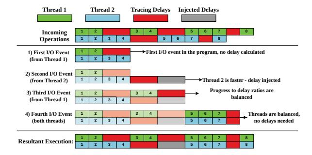
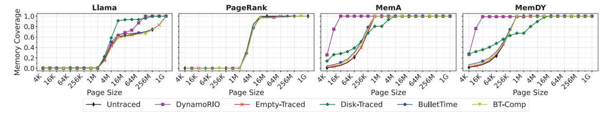
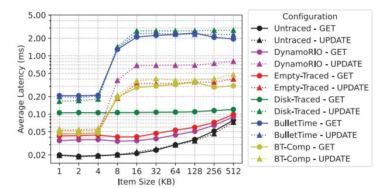
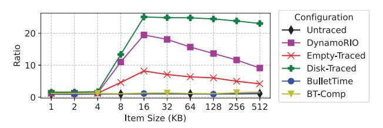
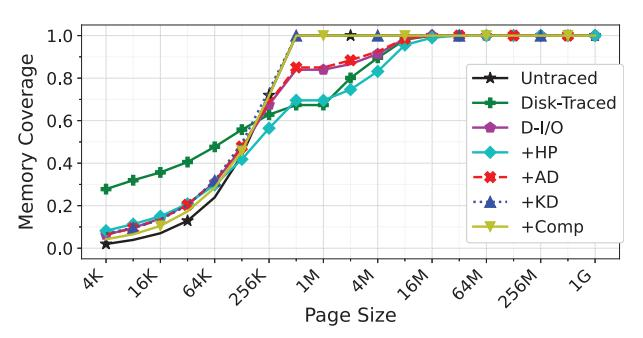
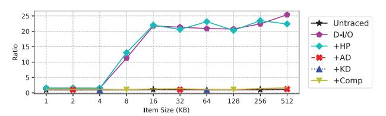

# *A.* BULLETTIME *Overview*

BULLETTIME builds on the Pin [48], where the dominant tracing overhead (tracingDelays in Algorithm 1) stems from I/O operations due to flushing traced instructions to disk. Consequently, BULLETTIME's realization of time dilation focuses on injecting delays in a manner that slows down the execution of threads that observe disproportionately lower I/O delays due to tracing (calculating injectedDelaythd).

Specifying Key State. In order to preserve application behavior, BULLETTIME must sufficiently preserve the order of key operations. This requirement suggests that users would need to themselves identify the key states necessary for their studies; i.e., the OS free memory list and application page tables for memory contiguity, lock variables for synchronization, etc. Note, however, that Algorithm 1 does not require identifying individual key operations to restore behavior, only the "key" threads that will execute them. This list corresponds to the Threads list in Algorithm 1. BULLETTIME provides a simple interface for users to supply a set of functions to identify key threads. When a thread executes any of these functions, BULLETTIME will include it in time dilation.

Runtime execution. Figure 8 provides an overview of BUL-LETTIME's overall architecture and operation. All unmodified application and system components are shown in gray. We add a new component to Pin's existing instrumentation framework — the BULLETTIME controller (shown in blue) — which is responsible for delay computation and time dilation. We also add two components (shown in orange) outside the Pin framework to enforce time dilations: a Buffer-Driven Delay Module that takes each injectedDelaythd value computed by the BUL-LETTIME controller and injects them into application threads through per-thread I/O buffers (§IV-C), and a Sleep Dilation Kernel Module that injects the delays into relevant system threads (§IV-D). At runtime, (1) the tracing instrumentation (Pin) generates and stores data in internal per-thread buffers. BULLETTIME leverages the filling up of these per-thread buffers as events to both compute and inject time dilations for application threads (details in §IV-C). Specifically, when a per-thread buffer fills up, 2) the delay computation module tracks per-thread delays (tracingDelays) in the BULLETTIME controller and calculates the time dilation required across all other threads for restoring application behavior (as in Algorithm 1). These delays are then injected 3 into the relevant application threads via the Buffer-Driven Delay Module when their data buffers fill up next. Since the controller intercepts the buffer fill events, it is also responsible for (4) persisting the data to disk. (5) The injection of delays into system threads (i.e., kernel daemons) is handled differently - the controller periodically computes a delay value for all relevant system threads, which are slowed down by extending their sleep timers via the Sleep Dilation Kernel Module (details in §IV-D).

#### B. Avoiding Key Operations in BULLETTIME

As we noted in \$III-A, preserving application behavior under tracing requires that the tracing framework itself not modify key state (Condition C1). While it is impossible to know (and therefore avoid modifying) key states for arbitrary studies, our BULLETTIME implementation focuses on eliminating key operations that affect memory contiguity and synchronization, as introduced in \$II. We argue that the principles we use to avoid key state modifications for these classes of studies can be applied to other studies as well.

Eliminating memory allocations for contiguity studies. The vast majority of memory allocations in the underlying Pin framework stem from kernel-level caching of tracing-triggered I/O. In particular, we found that when Pin writes large amounts of traced data to disk, the kernel page cache repeatedly allocates and deallocates individual 4KB pages, severely fragmenting the contiguity of physical memory. To avoid this, we perform trace I/Os using the O\_DIRECT flag to bypass the page cache and write directly to disk. Additionally, we ensure that any internal buffers used by Pin to store data are backed by 2MB hugepages via hugetlbfs [46] and are far from the application's allocations in both the physical and

virtual address spaces. We found that such internal allocations are typically small (a few megabytes at most), and keeping them far from application allocations eliminates any impact on application contiguity.

Eliminating synchronization over key state for synchronization studies. Our tracing framework injects minimal synchronization operations, only acquiring a brief lock to instrument code to record memory accesses. This instrumentation occurs only the first time a block of code is encountered, and is never acquired to access or modify application key state (e.g., hash-tables in our evaluated Memcached [30] application). As such, these synchronizations do not introduce any key operations.

#### C. Time Dilation for Application Threads

As discussed in  $\Pi$ -B, Algorithm 1 dilates time across faster threads to ensure they keep pace with the slowest thread; it does so by injecting delays across threads in windows of a fixed number of L operations. Realizing such an approach in BulletTime presents two key challenges. First, computing and realizing delays over a fixed window of operations is challenging, since instrumented operations do not tend to execute in fixed windows in practice. Second, while Algorithm 1 "looks ahead" within a window of L operations to estimate tracing-induced delays per thread, BulletTime must estimate this value.

To overcome the first challenge, BULLETTIME aims to balance the *ratio of tracing delays to application "progress" over any fixed time window* L (i.e., balancing  $\frac{\text{tracingDelays}_{\text{hid}}}{L-\text{tracingDelays}_{\text{shid}}}$  in Algorithm 1). In our theoretical model, this progress is the number of operations executed due to the untraced application. In BULLETTIME, we approximate progress as the total number of instructions executed by each thread, excluding Pin instrumentation overhead. Since an application thread's execution may include both kernel and user-space instructions, we scale their contributions by the respective instructions-percycle (IPC) values. This approach still achieves the same goal of ensuring the computed per-thread delay causes all threads to observe the same progress-to-delay ratio as the "slowest" thread.

Since Bullettime cannot, in practice, look ahead, it must approximate future progress and delays based on past information. Thus, the window size used to compute progress-to-delay ratios is a critical parameter. Too long, and Bullettime will be unable to react quickly to changes in the application phase. Too short, and Bullettime may have unstable responses to momentary variations. To address this challenge, Bullettime computes an exponential-weighted moving average (EWMA [47]) of the application's progress and tracing delays over short windows. Short windows allow Bullettime to respond quickly to changes in the application phase, while incorporating past information via a moving average prevents overfitting to brief modulations. Empirically, we find that a window length of 5s and a decay rate of 0.5 perform well for real-world deployments.

Fig. 9: BULLETTIME balances the ratio of tracing delays per unit of application progress across threads. In this example, Thread 2 initially executes faster than Thread 1, making more progress before their first I/O events (where trace data is persisted), the first and second I/O events. When BULLETTIME detects that Thread 2 is ahead of Thread 1 (at the second I/O event), it calculates a delay to inject to balance their progress-to-delay ratios. BULLETTIME injects no delays when threads are balanced (third and fourth I/O events), or when the thread is slower (first I/O event).

Figure 9 demonstrates an example of how BULLETTIME realizes the buffer-driven delays described above. In the example, Thread 1 experiences more tracing delays for its first time window (defined by I/O events) than Thread 2, performing its first I/O event after 2 operations instead of Thread 2's 5 operations. When Thread 2 performs its first I/O event, BULLETTIME detects this difference and computes the required delay to be injected into Thread 2, so that its ratio of progress to tracing delays (4:4) will match that of Thread 1 (2:2). At Thread 1's second I/O event, which occurs simultaneously with Thread 2's injected delays, the progressto-delay ratios are balanced (BULLETTIME takes into account injected delays even before they complete) and thus receives no additional delays. The original interleaving is restored by the final I/O event in both threads, with no additional delays required.

#### D. Time Dilation for System Threads

BULLETTIME must handle time dilation for system threads (kernel daemons) differently for two reasons. System threads are not instrumented by BULLETTIME, and therefore exhibit no tracing delays. It follows that these threads do not perform tracing-induced I/O, leaving no I/O events available to inject delays.

Fortunately, kernel daemons operate at fixed periodicity – where they perform work (e.g., page compactions in khugepaged) every T units of time, where T is kept constant by sleeping for the time no work is performed. This provides a convenient way to dilate time for such threads by simply slowing the sleep timer, which is effectively what BULLETTIME's Sleep Dilation Kernel Module does.

In more detail, BULLETTIME periodically computes the slowdown factor experienced by its slowest thread in the last

period (a multiple of T in our implementation), following the approach outlined in IV-C – this is the same factor that the system threads must be slowed down by in that period. BulletTIME's control plane informs the Sleep Dilation Kernel Module of this slowdown factor, which in turn, extends the sleep lengths within the kernel threads to ensure its rate of progress matches that of the slowest thread.

#### E. Compressing Traces to Reduce I/O Overheads

While time dilation can restore application behavior, its use of delay injection can increase the already long runtime of trace collection, particularly as delays become more imbalanced (Fig. 7). To alleviate these overheads, BULLETTIME provides an option to compress traces online, thereby reducing the total I/O overhead. Intuitively, trace compression can improve runtime even when it requires more compute, because tracing is typically I/O-bound, leaving compute underutilized. Thus, using more compute to compress traces can alleviate the I/O bottleneck. As long as compression is not overly compute-intensive, this can *improve* the compute utilization of application threads, reducing overall runtime.

In our prototype, we use zstd compression at level -7 [20], which we find provides a suitable tradeoff between compression ratio and speed. We aim to fully utilize the CPU between compression and application threads, while occasionally seeing I/O stalls. This indicates that the I/O and compute bottlenecks are balanced. We leave a more detailed exploration of compute-I/O tradeoffs for future work.

#### V. BULLETTIME IMPLEMENTATION

We build BULLETTIME using Intel Pin version 3.30 [48]. Our tool collects a memory reference trace of all load/store instructions, the target virtual address, and the reference size. The traced application's page table is recorded concurrently every 30 seconds to capture virtual-to-physical translations. I/O events occur when the traced data fills internal buffers (2 MB in our experiments). Thus, I/O events occur only on a subset of memory references. Individual key operations may not trigger the BULLETTIME controller, resulting from our intentional design choice to track key threads instead (§IV-A).

As of Pin version 3.30, the O\_DIRECT flag has no effect from within a pintool. Therefore, we implement the BULLET-TIME Controller as a separate process that manages all trace I/O. Trace data is written by the Pin-instrumented application to shared memory regions allocated via hugetlbfs, with named pipes used to indicate when buffers are available for writing or have been persisted to disk. The controller tracks metadata on the amount of data generated in each buffer, as well as the time taken, updating both figures for each time window using an exponentially weighted moving average (§IV-C).

Our sleep dilation kernel module uses kprobes (available in the Linux kernel since version 2.6.9) to instrument sleep-related kernel functions and modify their arguments to adjust sleep duration. Specifically, we instrument two functions: schedule timeout and hrtimer nanosleep.

| Hardware Configuration |                    | Data Rate  | I/O BW       | Ratio    |
|------------------------|--------------------|------------|--------------|----------|
| CPU                    | DDR4 / PCIe 4.0    | 20-25 GB/s | 4-7 GB/s     | 3-6×     |
|                        | DDR5 / PCIe 4.0    | 50-70 GB/s | 4-7 GB/s     | 7-18×    |
|                        | DDR5 / PCIe 5.0    | 50-70 GB/s | 8-14 GB/s    | 3-7×     |
| GPU                    | GDDR6X / PCIe 4.0  | 1TB/s      | 4-7 GB/s     | 143-250× |
|                        | HBM2e / PCIe 5.0   | 2TB/s      | 8-14 GB/s    | 133-200× |
| 0                      | HBM3e / Infiniband | 4.9TB/s    | 100 GB/s     | 49×      |
| DDR4 / SATA            |                    | 20-25 GB/s | 0.4-0.6 GB/s | 33-63×   |

TABLE II: Comparison of data generation rates and storage bandwidth for multiple hardware configurations. Peak data rates are calculated from the available memory bandwidth. We include memory bandwidth figures for the RTX4090, H100, and GH200 GPUs [29], [49]. Our chosen configuration (in bold) represents a middle ground among potential scenarios.

All timed, non-event-driven sleep functions in both kernel and userspace eventually invoke one of these two functions. We only dilate schedule\_timeout calls for tasks in the TASK\_INTERRUPTIBLE state, thereby avoiding interference with critical event-driven or hardware-facing kernel activity. The dilation factor is approximated by the ratio of the CPU time used by the traced application to the time spent waiting for trace data to be persisted to disk.

#### VI. EVALUATION

Our evaluation focuses on understanding the behavior changes caused by tracing in memory contiguity (§VI-A) and synchronization (§VI-B) studies, as well as BULLETTIME's effectiveness in correcting these changes.

**Experimental Setup.** We perform all experiments on a machine running Linux 6.13 with an Intel Core i7-8700 CPU at 3.2GHz with 6 cores and 12 threads. The storage device on our machine is a SATA-connected Samsung 870 EVO SSD. This setup represents the effect of tracing overheads on widely available commodity hardware and constitutes a middle ground among possible bandwidth ratios, as shown in Table II. We focus on the bandwidth ratio because it captures the key hardware challenge that BULLETTIME addresses: behavioral inaccuracies caused by I/O stalls. BULLETTIME is useful in all configurations in which the data generation rate significantly exceeds the available I/O bandwidth.

Applications & workloads. We use three real-world applications and workloads to demonstrate the effects of tracing on contiguity behavior. (1) Llama [73] is an open-source large language model. We use the llama.cpp [31] framework to perform inference from a starting seed. As a deterministic machine learning application, one would expect Llama to have regular behavior even under traced execution. (2) PageRank from the GAP benchmark suite [8], a well-known graph processing algorithm. (3) Memcached [30] is an opensource in-memory key-value store. We use the YCSB A workload [21] (MemA) configured to load 10M objects 1KB in size before performing 100M requests (50/50 reads/writes). We also create a custom workload (MemDY) to issue 500M requests after the initial load phase, with an 80/10/10 split

among reads, writes, and insertions. Along with object sizes uniformly distributed between 1B - 1KB, this roughly mimics Meta's ETC workload [5]. This tests BULLETTIME's ability to preserve contiguity for a steadily growing memory footprint.

To evaluate BULLETTIME's ability to preserve thread interleaving and synchronization behavior, we use a reader-writer synchronization scenario on Memcached with two clients. The first client (the reader) repeatedly issues GET requests to a single key, while the other (the writer) repeatedly sends UPDATE requests to the same key. This is representative of producer-consumer patterns observed in popular cloud workloads [40], [41], [65]. Since GETs and UPDATEs execute different codepaths on the Memcached server, tracing can induce disproportionate overheads for each type of request, similar to the example in Table I. We evaluate how well time dilation in BULLETTIME preserves the proportion of GET and UPDATE requests completed over time.

Because key operations are so fine-grained (§IV-A), tracking BULLETTIME's ability to preserve the exact key operation order would induce even more interference with the behaviors we aim to preserve. Instead, we use end-to-end metrics measuring overall memory contiguity and request ratios. These metrics represent the overall effect of preserving key operation order and ultimately align better with the key behaviors themselves, for which key operations serve as a proxy for explaining behavior.

Evaluated Baselines. We consider the following configurations to understand the impact of tracing on application behavior: (1) Untraced, representing regular application execution without any tracing overhead; (2) DynamoRIO's drmemtrace [15], a memory tracing tool used to collect industry traces [1], [66] that uses LZ4 [19] compression to reduce tracing I/O; (3) Empty-Traced, representing a traced application execution with all memory access instructions instrumented, but without persisting any data to storage. This shows the impact of just instrumentation overhead without I/O; (4) Disk-Traced, which writes all traced data to disk using asynchronous write() system calls. This represents the standard approach employed in most tracing studies; (5) BULLETTIME, our tracing framework as described in §IV; (6) BT-Comp, which additionally compresses BULLETTIME's traces to reduce I/O requirements.

#### A. Preserving Memory Contiguity

We begin by examining how tracing affects memory-contiguity behavior and evaluate BULLETTIME's efficacy in preserving it. Figure 10 shows the physical memory contiguity of our test applications in all configurations. As in Figure 2, we show the cumulative distribution of memory covered for each page size, maximizing the amount of memory covered by larger pages. Since contiguity can vary over time, either due to application memory allocations or migration via kernel daemons, we examine the state of memory contiguity at the end of execution, before memory is deallocated on exit. Since our workloads rarely deallocate memory before exit, the final

Fig. 10: Cumulative distributions of the percentage of an application's physical memory footprint that is covered by a given page size. BULLETTIME successfully restores the memory contiguity behavior of all tested applications.

Fig. 11: Application runtime in traced configurations, normalized to the runtime of an untraced execution. BulletTIME trades-off up to 58% runtime overhead over Disk-Traced in exchange for more accurate execution. With compression, we improve runtimes by more than  $2\times$  with no loss in accuracy.

|          | Misplaced Memory % (Total Variation Distance) |         |           |        |      |  |
|----------|-----------------------------------------------|---------|-----------|--------|------|--|
|          | Empty-                                        | Dynamo- | Disk-     | BULLET | BT-  |  |
| Workload | Traced                                        | RIO     | Traced-NC | TIME   | Comp |  |
| Llama    | 6.61                                          | 30.53   | 32.44     | 9.00   | 6.61 |  |
| PageRank | 7.54                                          | 8.96    | 5.1       | 7.86   | 7.10 |  |
| MemA     | 1.96                                          | 94.62   | 43.12     | 10.79  | 6.53 |  |
| MemDY    | 2.39                                          | 92.98   | 61.29     | 7.91   | 4.75 |  |
| Average  | 4.63                                          | 56.77   | 35.49     | 8.89   | 6.25 |  |

TABLE III: Percentage of application memory footprints placed in the wrong page size (**lower is better**). BULLETTIME is consistently close to Untraced, while tracing configurations that write to disk are prone to significant divergence. BT-Comp further improves accuracy by reducing I/O overheads.

state reflects the cumulative effect of all memory-contiguity behavior throughout the run.

Our results show that the effects of Disk-Traced on contiguity behavior can be unpredictable. Depending on the workload, Disk-Traced can increase fragmentation, improve contiguity for larger page sizes, or do both. DynamoRIO is worse at preserving contiguity behavior compared to Disk-Traced on average. In both memcached workloads, DynamoRIO induces substantial physical memory fragmentation, leaving nearly all memory covered by page sizes of 16KB or smaller. Such a result would significantly mislead TLB designs, as Untraced execution shows that most memory is covered by 64KB-512KB pages for the same workloads.

To quantitatively evaluate contiguity preservation, we measure, in contrast to the contiguity distribution in Untraced

execution, the percentage of memory covered by an incorrect page size. This can be calculated from the Total Variation Distance of the distributions in Figure 10. Table III shows our results. We see that BULLETTIME is  $4\times$  more accurate than Disk-Traced, and  $6.4\times$  more accurate than DynamoRIO.

We also examine the effect of injected time dilation on the overall runtime overhead of tracing with our approach in Figure 11. BULLETTIME trades off no more than 60% extra runtime overhead compared to Disk-Traced in exchange for accurate execution, with an average runtime increase of 35%.

With trace compression, we see significant runtime improvements ( $> 2\times$ ) with no loss in accuracy. For Llama, we find that the CPU is only 5% utilized by default. Using compression reduces I/O by a factor of  $10\times$  and lowers application CPU usage to 20%, aligning with our observed runtime improvements (Figure 11). Similar utilization improvements occur for the other applications. We further observe slight improvements in accuracy due to reduced I/O overheads. Notably, although DynamoRIO outperforms even Empty-Traced in runtime performance, it is by far the worst candidate for preserving contiguity behavior while tracing.

#### B. Thread Interleaving and Synchronization

We now evaluate BULLETTIME on our synchronization study atop Memcached. The use of a dedicated reader and writer issuing requests to the same key stress tests BULLET-TIME's effectiveness in preserving synchronization behavior in the midst of large overhead disparities between threads3.

Figure 12 shows the average GET and UPDATE latencies for each configuration, sweeping over item sizes between 1-512KB. While Untraced execution shows little difference between GET and UPDATE latencies, Empty-Traced, Disk-Traced, and DynamoRIO exhibit higher UPDATE latencies. This imbalance arises from the difference between the GET and UPDATE codepaths, with UPDATE requests making more memory accesses for data copies, memory allocation, etc., leading to higher tracing delays.

The effect of this asymmetry manifests in more GET requests being completed per unit time. Interestingly, this imbalance spikes significantly as item size increases beyond 8-16KB, with Disk-Traced executing up to  $25\times$  more GETs than UPDATEs (Figure 13). This spike stems from a change

&lt;sup>3Each client is served by a single worker in Memcached [30].

Fig. 12: Average latencies of GET and UPDATE requests in our synchronization study. BULLETTIME achieves the closest latency difference compared to untraced execution.

Fig. 13: Ratio of completed GET requests vs. completed UPDATE requests per unit time. Again, BULLETTIME achieves behavior closest to untraced execution.

in how the memcpy() function copies incoming data to the hash table for larger items. When copying more than 8KB of data, our system's memcpy() switches from using AVX instructions, operating on 32-64B at a time, to rep stosb, which repeatedly injects microcode to store data one byte at a time. While an optimization for Untraced execution, it incurs 32–64× more memory operations that must be instrumented and recorded by the tracing framework. This change in the code path leads to an enormous imbalance in the number of GETs and UPDATEs completed per unit time for larger item sizes.

In contrast to other tracing approaches, BULLETTIME maintains the ratio of completed GETs and UPDATEs within 10% of the native execution ratio for all item sizes. This result is a direct consequence of BULLETTIME injecting large amounts of extra delays into the thread that serves GET requests (i.e., the faster thread), while injecting minimal to no delays to the thread serving UPDATE requests. The success of BUL-LETTIME's delay injection is exemplified in Figure 12, where GET and UPDATE latencies remain nearly identical. All in all, even in a workload designed to maximize the difference in tracing delays between threads, BULLETTIME still manages to accurately balance their execution speeds.

## *C. Ablation Studies*

To examine the effects of each mechanism used to preserve behavior in BULLETTIME, we perform an ablation study where we progressively add features beginning with Direct-IO (*D-I/O*), hugepages for internal buffers (+HP), time di-

Fig. 14: Memory contiguity of MemDY when adding features from BULLETTIME one-by-one.

Fig. 15: Ratio of GET and UPDATE requests when adding features from BULLETTIME one-by-one.

lation of application threads (+AD), time dilation of kernel threads (+KD), and compression (+Comp). Note that +KD and +Comp are equivalent to BULLETTIME and BT-Comp, respectively.

Figure 14 shows memory contiguity behavior for MemDY with each feature of BULLETTIME. We observe that using direct I/O is sufficient to reduce the large portion of memory allocated to smaller pages (4KB-256KB) with Disk-Traced and DynamoRIO. However, the overallocation of 2MB+ pages remains until kernel dilation is applied. This result aligns with our reasoning that hugepage allocations arise from increased THP daemon activity. Dilating kernel threads restores contiguity to Untraced behavior.

Among all features in BULLETTIME, only +AD aims to preserve application thread interleaving in any way. As such, it is expected that thread interleaving behavior will only be restored in configurations starting from +AD. Figure 15 confirms this.

### VII. RELATED WORK

Despite almost no active study in decades, tracing-induced distortion of application execution is actually a classic problem, first identified in the 1990s for memory address tracing on single-core RISC processors running Ultrix and Mach 3.0 [2], [17]. Even on those simple platforms – with no multithreading and limited system services – tracing overheads were problematic. Solutions of that era, such as slowing the processor's clock interrupt rate to match the tracing-induced slowdown, primarily applied to single-threaded workloads. Modern systems, however, are far more complex: they depend on multi-threading, rich application-kernel interactions, and diverse system activity. These factors both amplify distortion and render prior solutions inadequate, motivating our new theoretical framework for applying time dilation more broadly – particularly now, as tracing is widely used in studies of synchronization, virtual memory, disaggregation, and beyond [28], [38], [44], [50], [63], [64], [67], [68].

More recent tracing studies ignore behavioral distortion and focus instead on the orthogonal problem of tracing with minimal overhead. This can indirectly address distortion as, in theory, zero-overhead tracing would preserve behavior. In practice, however, reducing tracing overhead exposes another fundamental trade-off with trace *completeness*. Intel Processor Trace [37] records fine-grained control flow and timestamps, which in principle could be used to reconstruct complete instruction and memory streams, but doing so in practice would be arduous for programs with variable inputs or frequent kernel interactions. Arm CoreSight [72] provides hardware support for tracing hardware events, but since it favors dropping data over delaying execution, it is typically used only for selected subsets of operations. HMTT [36] snoops the DRAM bus to capture memory accesses with low overhead, but misses references satisfied by the cache hierarchy. Overall, these approaches sacrifice completeness for low overhead. BULLETTIME, on the other hand, avoids distortion regardless of tracing overhead or completeness. That is, its core design principles also apply to the above approaches.

The COZ causal profiler [26] uses a scheme that works somewhat inversely to BULLETTIME. COZ estimates the potential speedup from optimizing a single section of code by proportionally slowing all other sections of the application. BULLETTIME handles the effects of slowing down one thread of a program by equally slowing all other threads.

Deterministic execution schemes aim to ensure that an application executes identically and reproducibly over every run. BULLETTIME, on the other hand, is designed to accurately represent the space of non-determinism an application exhibits in traces. Many deterministic schemes use enforcement mechanisms such as fixed execution quanta [10], [11], [27], [34], [53], deterministic logical clocks [57], and fixed-order thread serialization [12], [25], [45], which enforce deterministic execution, but do not necessarily guarantee that the achieved execution represents behavior without enforcement [79]. Other schemes initially record important activity and enforce the recorded ordering in subsequent executions [3], [35], [43]. However, these approaches focus on ensuring that interactions between *userspace* threads and their system calls [11], [56] are deterministic. None addresses the scheduling of separate kernel threads that run concurrently with the application a necessary consideration when the behavior under study is influenced by background kernel activity, as is the case for memory contiguity, page reclamation, and other OS-managed resources.

# *A.* BULLETTIME *Overview*

BULLETTIME builds on the Pin [48], where the dominant tracing overhead (tracingDelays in Algorithm 1) stems from I/O operations due to flushing traced instructions to disk. Consequently, BULLETTIME's realization of time dilation focuses on injecting delays in a manner that slows down the execution of threads that observe disproportionately lower I/O delays due to tracing (calculating injectedDelaythd).

Specifying Key State. In order to preserve application behavior, BULLETTIME must sufficiently preserve the order of key operations. This requirement suggests that users would need to themselves identify the key states necessary for their studies; i.e., the OS free memory list and application page tables for memory contiguity, lock variables for synchronization, etc. Note, however, that Algorithm 1 does not require identifying individual key operations to restore behavior, only the "key" threads that will execute them. This list corresponds to the Threads list in Algorithm 1. BULLETTIME provides a simple interface for users to supply a set of functions to identify key threads. When a thread executes any of these functions, BULLETTIME will include it in time dilation.

Runtime execution. Figure 8 provides an overview of BUL-LETTIME's overall architecture and operation. All unmodified application and system components are shown in gray. We add a new component to Pin's existing instrumentation framework — the BULLETTIME controller (shown in blue) — which is responsible for delay computation and time dilation. We also add two components (shown in orange) outside the Pin framework to enforce time dilations: a Buffer-Driven Delay Module that takes each injectedDelaythd value computed by the BUL-LETTIME controller and injects them into application threads through per-thread I/O buffers (§IV-C), and a Sleep Dilation Kernel Module that injects the delays into relevant system threads (§IV-D). At runtime, (1) the tracing instrumentation (Pin) generates and stores data in internal per-thread buffers. BULLETTIME leverages the filling up of these per-thread buffers as events to both compute and inject time dilations for application threads (details in §IV-C). Specifically, when a per-thread buffer fills up, 2) the delay computation module tracks per-thread delays (tracingDelays) in the BULLETTIME controller and calculates the time dilation required across all other threads for restoring application behavior (as in Algorithm 1). These delays are then injected 3 into the relevant application threads via the Buffer-Driven Delay Module when their data buffers fill up next. Since the controller intercepts the buffer fill events, it is also responsible for (4) persisting the data to disk. (5) The injection of delays into system threads (i.e., kernel daemons) is handled differently - the controller periodically computes a delay value for all relevant system threads, which are slowed down by extending their sleep timers via the Sleep Dilation Kernel Module (details in §IV-D).

#### B. Avoiding Key Operations in BULLETTIME

As we noted in \$III-A, preserving application behavior under tracing requires that the tracing framework itself not modify key state (Condition C1). While it is impossible to know (and therefore avoid modifying) key states for arbitrary studies, our BULLETTIME implementation focuses on eliminating key operations that affect memory contiguity and synchronization, as introduced in \$II. We argue that the principles we use to avoid key state modifications for these classes of studies can be applied to other studies as well.

Eliminating memory allocations for contiguity studies. The vast majority of memory allocations in the underlying Pin framework stem from kernel-level caching of tracing-triggered I/O. In particular, we found that when Pin writes large amounts of traced data to disk, the kernel page cache repeatedly allocates and deallocates individual 4KB pages, severely fragmenting the contiguity of physical memory. To avoid this, we perform trace I/Os using the O\_DIRECT flag to bypass the page cache and write directly to disk. Additionally, we ensure that any internal buffers used by Pin to store data are backed by 2MB hugepages via hugetlbfs [46] and are far from the application's allocations in both the physical and

virtual address spaces. We found that such internal allocations are typically small (a few megabytes at most), and keeping them far from application allocations eliminates any impact on application contiguity.

Eliminating synchronization over key state for synchronization studies. Our tracing framework injects minimal synchronization operations, only acquiring a brief lock to instrument code to record memory accesses. This instrumentation occurs only the first time a block of code is encountered, and is never acquired to access or modify application key state (e.g., hash-tables in our evaluated Memcached [30] application). As such, these synchronizations do not introduce any key operations.

#### C. Time Dilation for Application Threads

As discussed in  $\Pi$ -B, Algorithm 1 dilates time across faster threads to ensure they keep pace with the slowest thread; it does so by injecting delays across threads in windows of a fixed number of L operations. Realizing such an approach in BulletTime presents two key challenges. First, computing and realizing delays over a fixed window of operations is challenging, since instrumented operations do not tend to execute in fixed windows in practice. Second, while Algorithm 1 "looks ahead" within a window of L operations to estimate tracing-induced delays per thread, BulletTime must estimate this value.

To overcome the first challenge, BULLETTIME aims to balance the *ratio of tracing delays to application "progress" over any fixed time window* L (i.e., balancing  $\frac{\text{tracingDelays}_{\text{hid}}}{L-\text{tracingDelays}_{\text{shid}}}$  in Algorithm 1). In our theoretical model, this progress is the number of operations executed due to the untraced application. In BULLETTIME, we approximate progress as the total number of instructions executed by each thread, excluding Pin instrumentation overhead. Since an application thread's execution may include both kernel and user-space instructions, we scale their contributions by the respective instructions-percycle (IPC) values. This approach still achieves the same goal of ensuring the computed per-thread delay causes all threads to observe the same progress-to-delay ratio as the "slowest" thread.

Since Bullettime cannot, in practice, look ahead, it must approximate future progress and delays based on past information. Thus, the window size used to compute progress-to-delay ratios is a critical parameter. Too long, and Bullettime will be unable to react quickly to changes in the application phase. Too short, and Bullettime may have unstable responses to momentary variations. To address this challenge, Bullettime computes an exponential-weighted moving average (EWMA [47]) of the application's progress and tracing delays over short windows. Short windows allow Bullettime to respond quickly to changes in the application phase, while incorporating past information via a moving average prevents overfitting to brief modulations. Empirically, we find that a window length of 5s and a decay rate of 0.5 perform well for real-world deployments.

Fig. 9: BULLETTIME balances the ratio of tracing delays per unit of application progress across threads. In this example, Thread 2 initially executes faster than Thread 1, making more progress before their first I/O events (where trace data is persisted), the first and second I/O events. When BULLETTIME detects that Thread 2 is ahead of Thread 1 (at the second I/O event), it calculates a delay to inject to balance their progress-to-delay ratios. BULLETTIME injects no delays when threads are balanced (third and fourth I/O events), or when the thread is slower (first I/O event).

Figure 9 demonstrates an example of how BULLETTIME realizes the buffer-driven delays described above. In the example, Thread 1 experiences more tracing delays for its first time window (defined by I/O events) than Thread 2, performing its first I/O event after 2 operations instead of Thread 2's 5 operations. When Thread 2 performs its first I/O event, BULLETTIME detects this difference and computes the required delay to be injected into Thread 2, so that its ratio of progress to tracing delays (4:4) will match that of Thread 1 (2:2). At Thread 1's second I/O event, which occurs simultaneously with Thread 2's injected delays, the progressto-delay ratios are balanced (BULLETTIME takes into account injected delays even before they complete) and thus receives no additional delays. The original interleaving is restored by the final I/O event in both threads, with no additional delays required.

#### D. Time Dilation for System Threads

BULLETTIME must handle time dilation for system threads (kernel daemons) differently for two reasons. System threads are not instrumented by BULLETTIME, and therefore exhibit no tracing delays. It follows that these threads do not perform tracing-induced I/O, leaving no I/O events available to inject delays.

Fortunately, kernel daemons operate at fixed periodicity – where they perform work (e.g., page compactions in khugepaged) every T units of time, where T is kept constant by sleeping for the time no work is performed. This provides a convenient way to dilate time for such threads by simply slowing the sleep timer, which is effectively what BULLETTIME's Sleep Dilation Kernel Module does.

In more detail, BULLETTIME periodically computes the slowdown factor experienced by its slowest thread in the last

period (a multiple of T in our implementation), following the approach outlined in IV-C – this is the same factor that the system threads must be slowed down by in that period. BulletTIME's control plane informs the Sleep Dilation Kernel Module of this slowdown factor, which in turn, extends the sleep lengths within the kernel threads to ensure its rate of progress matches that of the slowest thread.

#### E. Compressing Traces to Reduce I/O Overheads

While time dilation can restore application behavior, its use of delay injection can increase the already long runtime of trace collection, particularly as delays become more imbalanced (Fig. 7). To alleviate these overheads, BULLETTIME provides an option to compress traces online, thereby reducing the total I/O overhead. Intuitively, trace compression can improve runtime even when it requires more compute, because tracing is typically I/O-bound, leaving compute underutilized. Thus, using more compute to compress traces can alleviate the I/O bottleneck. As long as compression is not overly compute-intensive, this can *improve* the compute utilization of application threads, reducing overall runtime.

In our prototype, we use zstd compression at level -7 [20], which we find provides a suitable tradeoff between compression ratio and speed. We aim to fully utilize the CPU between compression and application threads, while occasionally seeing I/O stalls. This indicates that the I/O and compute bottlenecks are balanced. We leave a more detailed exploration of compute-I/O tradeoffs for future work.

#### V. BULLETTIME IMPLEMENTATION

We build BULLETTIME using Intel Pin version 3.30 [48]. Our tool collects a memory reference trace of all load/store instructions, the target virtual address, and the reference size. The traced application's page table is recorded concurrently every 30 seconds to capture virtual-to-physical translations. I/O events occur when the traced data fills internal buffers (2 MB in our experiments). Thus, I/O events occur only on a subset of memory references. Individual key operations may not trigger the BULLETTIME controller, resulting from our intentional design choice to track key threads instead (§IV-A).

As of Pin version 3.30, the O\_DIRECT flag has no effect from within a pintool. Therefore, we implement the BULLET-TIME Controller as a separate process that manages all trace I/O. Trace data is written by the Pin-instrumented application to shared memory regions allocated via hugetlbfs, with named pipes used to indicate when buffers are available for writing or have been persisted to disk. The controller tracks metadata on the amount of data generated in each buffer, as well as the time taken, updating both figures for each time window using an exponentially weighted moving average (§IV-C).

Our sleep dilation kernel module uses kprobes (available in the Linux kernel since version 2.6.9) to instrument sleep-related kernel functions and modify their arguments to adjust sleep duration. Specifically, we instrument two functions: schedule timeout and hrtimer nanosleep.

| Hardware Configuration |                    | Data Rate  | I/O BW       | Ratio    |
|------------------------|--------------------|------------|--------------|----------|
| CPU                    | DDR4 / PCIe 4.0    | 20-25 GB/s | 4-7 GB/s     | 3-6×     |
|                        | DDR5 / PCIe 4.0    | 50-70 GB/s | 4-7 GB/s     | 7-18×    |
|                        | DDR5 / PCIe 5.0    | 50-70 GB/s | 8-14 GB/s    | 3-7×     |
| GPU                    | GDDR6X / PCIe 4.0  | 1TB/s      | 4-7 GB/s     | 143-250× |
|                        | HBM2e / PCIe 5.0   | 2TB/s      | 8-14 GB/s    | 133-200× |
| 0                      | HBM3e / Infiniband | 4.9TB/s    | 100 GB/s     | 49×      |
| DDR4 / SATA            |                    | 20-25 GB/s | 0.4-0.6 GB/s | 33-63×   |

TABLE II: Comparison of data generation rates and storage bandwidth for multiple hardware configurations. Peak data rates are calculated from the available memory bandwidth. We include memory bandwidth figures for the RTX4090, H100, and GH200 GPUs [29], [49]. Our chosen configuration (in bold) represents a middle ground among potential scenarios.

All timed, non-event-driven sleep functions in both kernel and userspace eventually invoke one of these two functions. We only dilate schedule\_timeout calls for tasks in the TASK\_INTERRUPTIBLE state, thereby avoiding interference with critical event-driven or hardware-facing kernel activity. The dilation factor is approximated by the ratio of the CPU time used by the traced application to the time spent waiting for trace data to be persisted to disk.

#### VI. EVALUATION

Our evaluation focuses on understanding the behavior changes caused by tracing in memory contiguity (§VI-A) and synchronization (§VI-B) studies, as well as BULLETTIME's effectiveness in correcting these changes.

**Experimental Setup.** We perform all experiments on a machine running Linux 6.13 with an Intel Core i7-8700 CPU at 3.2GHz with 6 cores and 12 threads. The storage device on our machine is a SATA-connected Samsung 870 EVO SSD. This setup represents the effect of tracing overheads on widely available commodity hardware and constitutes a middle ground among possible bandwidth ratios, as shown in Table II. We focus on the bandwidth ratio because it captures the key hardware challenge that BULLETTIME addresses: behavioral inaccuracies caused by I/O stalls. BULLETTIME is useful in all configurations in which the data generation rate significantly exceeds the available I/O bandwidth.

Applications & workloads. We use three real-world applications and workloads to demonstrate the effects of tracing on contiguity behavior. (1) Llama [73] is an open-source large language model. We use the llama.cpp [31] framework to perform inference from a starting seed. As a deterministic machine learning application, one would expect Llama to have regular behavior even under traced execution. (2) PageRank from the GAP benchmark suite [8], a well-known graph processing algorithm. (3) Memcached [30] is an opensource in-memory key-value store. We use the YCSB A workload [21] (MemA) configured to load 10M objects 1KB in size before performing 100M requests (50/50 reads/writes). We also create a custom workload (MemDY) to issue 500M requests after the initial load phase, with an 80/10/10 split

among reads, writes, and insertions. Along with object sizes uniformly distributed between 1B - 1KB, this roughly mimics Meta's ETC workload [5]. This tests BULLETTIME's ability to preserve contiguity for a steadily growing memory footprint.

To evaluate BULLETTIME's ability to preserve thread interleaving and synchronization behavior, we use a reader-writer synchronization scenario on Memcached with two clients. The first client (the reader) repeatedly issues GET requests to a single key, while the other (the writer) repeatedly sends UPDATE requests to the same key. This is representative of producer-consumer patterns observed in popular cloud workloads [40], [41], [65]. Since GETs and UPDATEs execute different codepaths on the Memcached server, tracing can induce disproportionate overheads for each type of request, similar to the example in Table I. We evaluate how well time dilation in BULLETTIME preserves the proportion of GET and UPDATE requests completed over time.

Because key operations are so fine-grained (§IV-A), tracking BULLETTIME's ability to preserve the exact key operation order would induce even more interference with the behaviors we aim to preserve. Instead, we use end-to-end metrics measuring overall memory contiguity and request ratios. These metrics represent the overall effect of preserving key operation order and ultimately align better with the key behaviors themselves, for which key operations serve as a proxy for explaining behavior.

Evaluated Baselines. We consider the following configurations to understand the impact of tracing on application behavior: (1) Untraced, representing regular application execution without any tracing overhead; (2) DynamoRIO's drmemtrace [15], a memory tracing tool used to collect industry traces [1], [66] that uses LZ4 [19] compression to reduce tracing I/O; (3) Empty-Traced, representing a traced application execution with all memory access instructions instrumented, but without persisting any data to storage. This shows the impact of just instrumentation overhead without I/O; (4) Disk-Traced, which writes all traced data to disk using asynchronous write() system calls. This represents the standard approach employed in most tracing studies; (5) BULLETTIME, our tracing framework as described in §IV; (6) BT-Comp, which additionally compresses BULLETTIME's traces to reduce I/O requirements.

#### A. Preserving Memory Contiguity

We begin by examining how tracing affects memory-contiguity behavior and evaluate BULLETTIME's efficacy in preserving it. Figure 10 shows the physical memory contiguity of our test applications in all configurations. As in Figure 2, we show the cumulative distribution of memory covered for each page size, maximizing the amount of memory covered by larger pages. Since contiguity can vary over time, either due to application memory allocations or migration via kernel daemons, we examine the state of memory contiguity at the end of execution, before memory is deallocated on exit. Since our workloads rarely deallocate memory before exit, the final

Fig. 10: Cumulative distributions of the percentage of an application's physical memory footprint that is covered by a given page size. BULLETTIME successfully restores the memory contiguity behavior of all tested applications.

Fig. 11: Application runtime in traced configurations, normalized to the runtime of an untraced execution. BulletTIME trades-off up to 58% runtime overhead over Disk-Traced in exchange for more accurate execution. With compression, we improve runtimes by more than  $2\times$  with no loss in accuracy.

|          | Misplaced Memory % (Total Variation Distance) |         |           |        |      |  |
|----------|-----------------------------------------------|---------|-----------|--------|------|--|
|          | Empty-                                        | Dynamo- | Disk-     | BULLET | BT-  |  |
| Workload | Traced                                        | RIO     | Traced-NC | TIME   | Comp |  |
| Llama    | 6.61                                          | 30.53   | 32.44     | 9.00   | 6.61 |  |
| PageRank | 7.54                                          | 8.96    | 5.1       | 7.86   | 7.10 |  |
| MemA     | 1.96                                          | 94.62   | 43.12     | 10.79  | 6.53 |  |
| MemDY    | 2.39                                          | 92.98   | 61.29     | 7.91   | 4.75 |  |
| Average  | 4.63                                          | 56.77   | 35.49     | 8.89   | 6.25 |  |

TABLE III: Percentage of application memory footprints placed in the wrong page size (**lower is better**). BULLETTIME is consistently close to Untraced, while tracing configurations that write to disk are prone to significant divergence. BT-Comp further improves accuracy by reducing I/O overheads.

state reflects the cumulative effect of all memory-contiguity behavior throughout the run.

Our results show that the effects of Disk-Traced on contiguity behavior can be unpredictable. Depending on the workload, Disk-Traced can increase fragmentation, improve contiguity for larger page sizes, or do both. DynamoRIO is worse at preserving contiguity behavior compared to Disk-Traced on average. In both memcached workloads, DynamoRIO induces substantial physical memory fragmentation, leaving nearly all memory covered by page sizes of 16KB or smaller. Such a result would significantly mislead TLB designs, as Untraced execution shows that most memory is covered by 64KB-512KB pages for the same workloads.

To quantitatively evaluate contiguity preservation, we measure, in contrast to the contiguity distribution in Untraced

execution, the percentage of memory covered by an incorrect page size. This can be calculated from the Total Variation Distance of the distributions in Figure 10. Table III shows our results. We see that BULLETTIME is  $4\times$  more accurate than Disk-Traced, and  $6.4\times$  more accurate than DynamoRIO.

We also examine the effect of injected time dilation on the overall runtime overhead of tracing with our approach in Figure 11. BULLETTIME trades off no more than 60% extra runtime overhead compared to Disk-Traced in exchange for accurate execution, with an average runtime increase of 35%.

With trace compression, we see significant runtime improvements ( $> 2\times$ ) with no loss in accuracy. For Llama, we find that the CPU is only 5% utilized by default. Using compression reduces I/O by a factor of  $10\times$  and lowers application CPU usage to 20%, aligning with our observed runtime improvements (Figure 11). Similar utilization improvements occur for the other applications. We further observe slight improvements in accuracy due to reduced I/O overheads. Notably, although DynamoRIO outperforms even Empty-Traced in runtime performance, it is by far the worst candidate for preserving contiguity behavior while tracing.

#### B. Thread Interleaving and Synchronization

We now evaluate BULLETTIME on our synchronization study atop Memcached. The use of a dedicated reader and writer issuing requests to the same key stress tests BULLET-TIME's effectiveness in preserving synchronization behavior in the midst of large overhead disparities between threads3.

Figure 12 shows the average GET and UPDATE latencies for each configuration, sweeping over item sizes between 1-512KB. While Untraced execution shows little difference between GET and UPDATE latencies, Empty-Traced, Disk-Traced, and DynamoRIO exhibit higher UPDATE latencies. This imbalance arises from the difference between the GET and UPDATE codepaths, with UPDATE requests making more memory accesses for data copies, memory allocation, etc., leading to higher tracing delays.

The effect of this asymmetry manifests in more GET requests being completed per unit time. Interestingly, this imbalance spikes significantly as item size increases beyond 8-16KB, with Disk-Traced executing up to  $25\times$  more GETs than UPDATEs (Figure 13). This spike stems from a change

&lt;sup>3Each client is served by a single worker in Memcached [30].

Fig. 12: Average latencies of GET and UPDATE requests in our synchronization study. BULLETTIME achieves the closest latency difference compared to untraced execution.

Fig. 13: Ratio of completed GET requests vs. completed UPDATE requests per unit time. Again, BULLETTIME achieves behavior closest to untraced execution.

in how the memcpy() function copies incoming data to the hash table for larger items. When copying more than 8KB of data, our system's memcpy() switches from using AVX instructions, operating on 32-64B at a time, to rep stosb, which repeatedly injects microcode to store data one byte at a time. While an optimization for Untraced execution, it incurs 32–64× more memory operations that must be instrumented and recorded by the tracing framework. This change in the code path leads to an enormous imbalance in the number of GETs and UPDATEs completed per unit time for larger item sizes.

In contrast to other tracing approaches, BULLETTIME maintains the ratio of completed GETs and UPDATEs within 10% of the native execution ratio for all item sizes. This result is a direct consequence of BULLETTIME injecting large amounts of extra delays into the thread that serves GET requests (i.e., the faster thread), while injecting minimal to no delays to the thread serving UPDATE requests. The success of BUL-LETTIME's delay injection is exemplified in Figure 12, where GET and UPDATE latencies remain nearly identical. All in all, even in a workload designed to maximize the difference in tracing delays between threads, BULLETTIME still manages to accurately balance their execution speeds.

## *C. Ablation Studies*

To examine the effects of each mechanism used to preserve behavior in BULLETTIME, we perform an ablation study where we progressively add features beginning with Direct-IO (*D-I/O*), hugepages for internal buffers (+HP), time di-

Fig. 14: Memory contiguity of MemDY when adding features from BULLETTIME one-by-one.

Fig. 15: Ratio of GET and UPDATE requests when adding features from BULLETTIME one-by-one.

lation of application threads (+AD), time dilation of kernel threads (+KD), and compression (+Comp). Note that +KD and +Comp are equivalent to BULLETTIME and BT-Comp, respectively.

Figure 14 shows memory contiguity behavior for MemDY with each feature of BULLETTIME. We observe that using direct I/O is sufficient to reduce the large portion of memory allocated to smaller pages (4KB-256KB) with Disk-Traced and DynamoRIO. However, the overallocation of 2MB+ pages remains until kernel dilation is applied. This result aligns with our reasoning that hugepage allocations arise from increased THP daemon activity. Dilating kernel threads restores contiguity to Untraced behavior.

Among all features in BULLETTIME, only +AD aims to preserve application thread interleaving in any way. As such, it is expected that thread interleaving behavior will only be restored in configurations starting from +AD. Figure 15 confirms this.

### VII. RELATED WORK

Despite almost no active study in decades, tracing-induced distortion of application execution is actually a classic problem, first identified in the 1990s for memory address tracing on single-core RISC processors running Ultrix and Mach 3.0 [2], [17]. Even on those simple platforms – with no multithreading and limited system services – tracing overheads were problematic. Solutions of that era, such as slowing the processor's clock interrupt rate to match the tracing-induced slowdown, primarily applied to single-threaded workloads. Modern systems, however, are far more complex: they depend on multi-threading, rich application-kernel interactions, and diverse system activity. These factors both amplify distortion and render prior solutions inadequate, motivating our new theoretical framework for applying time dilation more broadly – particularly now, as tracing is widely used in studies of synchronization, virtual memory, disaggregation, and beyond [28], [38], [44], [50], [63], [64], [67], [68].

More recent tracing studies ignore behavioral distortion and focus instead on the orthogonal problem of tracing with minimal overhead. This can indirectly address distortion as, in theory, zero-overhead tracing would preserve behavior. In practice, however, reducing tracing overhead exposes another fundamental trade-off with trace *completeness*. Intel Processor Trace [37] records fine-grained control flow and timestamps, which in principle could be used to reconstruct complete instruction and memory streams, but doing so in practice would be arduous for programs with variable inputs or frequent kernel interactions. Arm CoreSight [72] provides hardware support for tracing hardware events, but since it favors dropping data over delaying execution, it is typically used only for selected subsets of operations. HMTT [36] snoops the DRAM bus to capture memory accesses with low overhead, but misses references satisfied by the cache hierarchy. Overall, these approaches sacrifice completeness for low overhead. BULLETTIME, on the other hand, avoids distortion regardless of tracing overhead or completeness. That is, its core design principles also apply to the above approaches.

The COZ causal profiler [26] uses a scheme that works somewhat inversely to BULLETTIME. COZ estimates the potential speedup from optimizing a single section of code by proportionally slowing all other sections of the application. BULLETTIME handles the effects of slowing down one thread of a program by equally slowing all other threads.

Deterministic execution schemes aim to ensure that an application executes identically and reproducibly over every run. BULLETTIME, on the other hand, is designed to accurately represent the space of non-determinism an application exhibits in traces. Many deterministic schemes use enforcement mechanisms such as fixed execution quanta [10], [11], [27], [34], [53], deterministic logical clocks [57], and fixed-order thread serialization [12], [25], [45], which enforce deterministic execution, but do not necessarily guarantee that the achieved execution represents behavior without enforcement [79]. Other schemes initially record important activity and enforce the recorded ordering in subsequent executions [3], [35], [43]. However, these approaches focus on ensuring that interactions between *userspace* threads and their system calls [11], [56] are deterministic. None addresses the scheduling of separate kernel threads that run concurrently with the application a necessary consideration when the behavior under study is influenced by background kernel activity, as is the case for memory contiguity, page reclamation, and other OS-managed resources.

