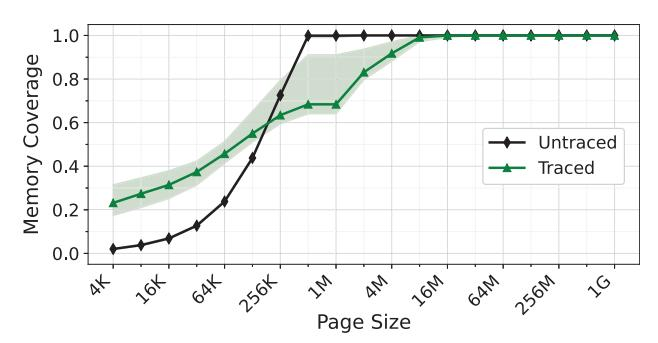
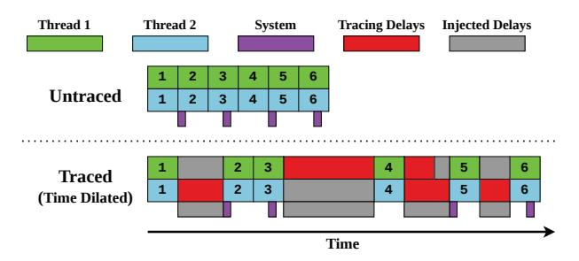
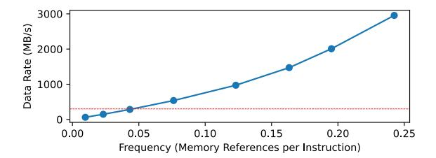
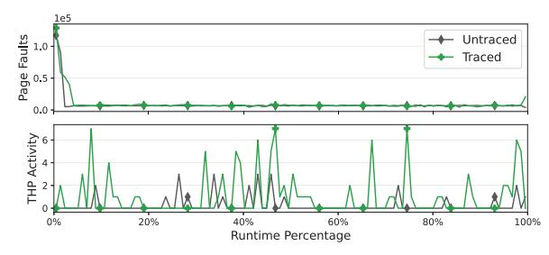
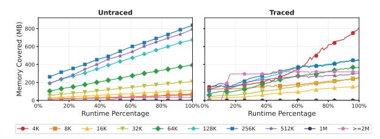

# BULLETTIME : Time Dilation for High-Fidelity Tracing

Michael Wu†, Sibren Isaacman‡, Abhishek Bhattacharjee†, Anurag Khandelwal† †Yale University ‡Loyola University Maryland

Email: mw976@yale.edu, snisaacman@loyola.edu, abhishek@cs.yale.edu, anurag.khandelwal@yale.edu

*Abstract*—Much of computer systems and architecture research depends on accurate, high-fidelity program tracing for simulation, profiling, and debugging. Unfortunately, with significant improvements in compute and memory instruction execution speeds, tracing frameworks incur frequent I/O to persist traced events to disk. We find that such delays can be bursty and asymmetric across application threads, resulting in an inadvertent reordering of application and system operations relative to untraced execution. In our analysis, such reordering often leads to significant changes in the behavior of the studied application, thereby contaminating insights from simulation and profiling studies of the corresponding captured traces.

In this work, we formalize the application behavior under study to establish correctness requirements for traced application execution in the presence of tracing-induced delays. We propose a novel *time dilation* approach that strategically slows execution for application and system threads while meeting correctness requirements. We implement the time-dilation approach in BUL-LETTIME, a tracing framework built atop Pin, the de facto binary instrumentation tool. We evaluate BULLETTIME for memorycontiguity and synchronization studies on real-world applications and workloads. Our results show that while existing tracing approaches can cause application behavior to deviate by as much as 20× compared to untraced execution, BULLETTIME's deviations are < 10% even in extreme cases of asymmetric tracing delays.

#### I. INTRODUCTION

Application tracing is widely used in computer systems research. It provides insights into workload characteristics [18], [32], [51], [52], [69], drives software simulator models of proposed hardware [13], [39], [55], [63], [74], [76], [78], and even guides real-system prototypes of new software systems [44], [68], [77]. Tracing is powerful because it can selectively record system interactions and events. In principle, highfidelity tracing should track not just application execution but also accurately capture how applications interact with diverse system software components (e.g., kernel scheduling, networking, virtual memory, compilers), thereby strengthening the conclusions drawn from trace-based studies.

Unfortunately, as processing and memory speeds increase, the overheads introduced by the tracing framework become a key hurdle to widespread adoption. A contributor to such overhead is the I/O required to persist the traced information, exacerbated by the fact that I/O speeds lag behind memory

Code is publicly available at https://github.com/ysarch-lab/BulletTime.

Fig. 1: The effect of tracing delays on interleaving of application threads and the surrounding system. Each numbered block represents a unit of application work (*operation*). Purple blocks denote periodic invocations of system daemons. Tracing injects bursty delays that are asymmetric across application threads and system daemons. Delay bursts misalign application threads with one another and with the system, causing the application to deviate from its untraced behavior.

and CPU instruction execution (and corresponding tracing) speeds. In practice, this results in frequent stalls of the traced application threads while flushing the traced information to disk. While prior approaches have explored reducing overheads associated with tracing [36], [37], [72], we posit that such overheads cannot be eliminated – some I/O is necessary to collect traced information. We also find that tracing-induced delays have more serious effects than application slowdown – indeed, they can alter the behavior of the traced application altogether (§II).

In particular, tracing-induced I/O tends to be asymmetric across the traced application threads. For instance, if a tracing study focuses only on instrumenting memory instructions in an application, its threads will experience time-varying I/O-based delays, depending on the frequency of memory access across threads and over time. This effect is illustrated in Figure 1, where operations performed across the different threads get reordered in time, changing the observed impact of those operations throughout the application's execution. Moreover, these delays cause system tasks (e.g., kernel daemons) that affect application behavior to be reordered relative to the

Fig. 2: CDF of memory coverage by page size for a key-value store in traced and untraced executions. The traced execution overestimates the portion of the application's memory footprint that is covered by regions with low contiguity. Shaded regions show the minimum and maximum values over 20 trials, each after a reboot. Untraced runs show very little variance, while traced executions exhibit significant variance, well outside the distribution of untraced runs.

application's execution, since these daemons incur no delay due to tracing. An immediately noticeable impact in Figure 1 is that the traced application will experience disproportionately more system activity than an untraced execution, since its execution is longer with tracing.

While our analysis holds for any study that relies on highfidelity program tracing, in this work, we examine this problem specifically for memory-contiguity and synchronization studies as case studies — fields where accurate tracing is paramount, as they operate at the boundary of hardware and software. The tracing studies in these fields are useful not only in developing efficient and robust software mechanisms (e.g., testing and developing race-free software [44], [67], [68], [81] using synchronization traces) but also in designing efficient hardware and operating systems (e.g., changes in production TLB hardware and memory management sub-systems [24], [62], [64], [71] using contiguity traces). Moreover, modern operating systems often rely on system daemons to detect and enforce memory contiguity [4], [78], [82], making such studies particularly vulnerable to behavioral divergence caused by tracing delays.

Empirically, we find that tracing effects can significantly affect the application behavior under study. Figure 2 shows the cumulative distribution of memory coverage by page size for a key-value store workload when run in traced and untraced configurations. To quantify contiguity, we compute the minimum number of pages required to cover each physically contiguous region of memory, where page sizes can be any power of 2 greater than the default 4KB. This process maximizes the amount of memory covered by a hypothetical TLB design [62], [63], where the use of power-of-2 pages is under active research [58]. Our results demonstrate that traced execution presents a misleading picture of memory contiguity, suggesting that about half of the contiguity is present in small groups of pages (<64KB), while these pages cover less than 20%

Fig. 3: Restoring application behavior in traced execution using *time dilation*. Application behavior is restored when traced application and system threads are slowed to match the pace of the slowest thread.

of memory in the untraced run. Such misrepresentations can have drastic ramifications, the most critical of which include the development of new architectures that are misaligned with the actual needs of real-world workloads. Past trace-driven contiguity work has led to designs in TLB compression [62], [63], new page table formats [58], and OS support [22], [23]. For example, the traced results from Figure 2 would suggest that TLB performance would benefit from a wide range of page sizes, while contiguity in native runs is far more concentrated between 64 and 512KB. Similarly, errant behavior is observed in other workloads and metrics of interest (see §VI), indicating the scope of the issue uncovered in this work.

Ensuring that application behavior is preserved with tracing first requires identifying the correct behavior for a given execution. A straightforward definition of correct execution would require that all application and system threads execute all operations in the same order as in untraced execution. Unfortunately, striving for such a definition of correctness is intractable in real-world applications deployed on systems with hundreds to thousands of executing components. At the other extreme, manually selecting traced components to constrain modeling complexity and correctness may miss components, such as obscure system daemons, that rarely affect application behavior.

Our approach to defining correctness starts with a precise description of the application behavior we want to study, followed by the identification of the components that must execute correctly (§III-A). At the core are two ideas: the application's *key state* – the state we want to observe during execution – and its *key operations* – the operations, across both application and system threads, that modify this state.

Correctness then comes down to two simple requirements. First, tracing must not introduce any new key operations of its own (i.e., it should not change application behavior). Second, the order of key operations across all relevant threads must remain the same, whether or not tracing is enabled. This definition keeps the focus on components that truly affect application behavior, while ignoring the many other threads/activities that do not impact the key state under study.

Equipped with a precisely-scoped definition of correctness centered on *key state*, we propose a novel *time dilation* approach to achieving it for traced application executions (§III-B). The idea underpinning this approach is that preserving the order of key operations across threads experiencing asymmetric tracing delays in a traced execution requires slowing down (*time dilating*) all threads to match the slowest thread (i.e., the one with the most tracing delays). Figure 3 depicts this idea in the most ideal sense – it injects just the right amount of delay (shown in gray) across both application and system threads to make sure all of them execute at the same pace, thereby preserving the order of key operations and, consequently, correct behavior.

We implement the time-dilation approach in our Pinbased [48] tracing framework, BULLETTIME1, which dynamically modulates the speed of application and system threads to ensure correct application behavior. A key insight is that preserving the order of key operations does not require tracking individual operations. Instead, it suffices to equalize the pacing of the threads that execute them. To this end, BULLETTIME intercepts the I/O events that persist trace data to detect per-thread slowdowns and injects delays that equalize the ratio of each thread's execution progress to its tracing delays. Equalizing this ratio over bounded intervals of execution confines any potential reordering of key operations to within a single interval (§III-B). BULLETTIME provides a simple interface by which users supply a set of functions to identify key threads; any thread executing one of these functions is included in time dilation.

Time dilation must also account for system threads, such as kernel daemons, whose execution is not slowed by tracing but still affects application behavior. BULLETTIME slows these threads by prolonging the duration that they sleep() for, so that their execution speed also matches that of the slowest thread over time. We select these mechanisms because they are prevalent across all Linux systems (e.g., kprobes), enabling BULLETTIME to be widely deployable across many machines and architectures.

We evaluate BULLETTIME's ability to preserve application behavior for memory contiguity and synchronization studies atop real-world applications and workloads, while recording all memory-referencing instructions of an application. On a set of popular cloud workloads, BULLETTIME improves contiguity metrics by 2.3× over existing tracing approaches, closely matching untraced execution. On a synchronization benchmark designed to maximize the difference in tracing delays between threads, while existing tracing approaches can deviate from untraced application behavior by as much as 20×, BULLETTIME ensures the deviation remains within 10% of untraced execution.

#### II. BACKGROUND AND MOTIVATION

#### *A. Delays in Tracing Frameworks*

It is well known that tracing incurs non-trivial runtime overhead to an application's execution, much of which is unavoidable when capturing low-level hardware events. In most real-world scenarios, the primary source of the overhead in fine-grained tracing is the I/O required to store the traced events. Figure 4 shows, for memory tracing, how the trace data generation rate scales as a function of memory references per instruction. Even when tracing just a single thread, the trace data rate exceeds the storage bandwidth of our test system at only one memory reference per *twenty* instructions. For a more realistic baseline, the benchmarks used in our evaluation commonly reference memory for *one out of every three* instructions. Moreover, since trace data rates scale with the number of threads in the traced application, incoming data can quickly overwhelm even sophisticated storage systems, even with multiple GB/s of write bandwidth. Because bandwidth oversubscription is so high, asynchronous I/O is of limited help, as the system quickly reverts to synchronous behavior once all buffers are filled. The observable impact of such high trace data rates is non-uniform tracing-induced delays across application threads.

Due to the sheer volume of data generated during tracing, many prior works use methods such as sampling [36], [59], [61], [80], periodically dropping data [37], [42], [72], and lossy compression [54], [75] to circumvent tracing overheads. While such approaches do reduce tracing overheads, they inevitably result in loss of information, compromising *trace completeness*. Doing so limits their ability to comprehensively represent application behavior. As such, we restrict our study to *lossless tracing* techniques that always collect the complete trace.

Among prior work – in both lossless and lossy tracing approaches – we are unaware of any studies that have analyzed the impact of tracing-induced delays on changes to traced application behavior. Such changes threaten to undermine the usefulness of the trace for any simulation, profiling, or debugging applications [7], [9], [18], [32], [33], [51], [52], [55], [70]. The focus of this work is to understand potential changes in application behavior due to tracing and to develop mechanisms to preserve behavior under tracing. Indeed, the compute, memory, and I/O scaling trends discussed above suggest that this problem will likely become more prominent in the foreseeable future, especially for tracing fine-grained hardware activity. We next explain, using real-world tracing studies, the exact mechanisms by which tracing can modify application behavior.

#### *B. Understanding Behavior Changes due to Tracing*

We now illustrate, through two use cases, how the tracing infrastructure can itself interfere with the application's execution in subtle ways, thereby altering the behavior under study. We will use these use cases as running examples and evaluation candidates for the rest of the paper.

1Popularized by the movie "The Matrix", BULLETTIME is a cinematic technique that slows time while the camera appears to move at normal speed around the scene. This creates the illusion that the viewer is moving freely around a moment that's unfolding in extreme slow motion.

Fig. 4: Trace data generation rate for a given rate of memoryreferencing instructions for a single thread. The data rate quickly outpaces the storage bandwidth (in red) of our test system (§VI), being an order of magnitude higher at only one reference every four instructions. Our benchmarks typically issue one reference every three instructions per thread.

Memory contiguity studies. Memory contiguity studies focus on an application's virtual-to-physical memory mappings at various parts of its execution, typically to understand the length and number of contiguous physical memory allocations. Trace-based memory-contiguity work has been key to motivating emerging hardware and software mechanisms such as compressed TLBs [62], [63], effective use of hugepages [4], [64], [78], and support for power-of-2 page sizes in RISC-V [58], [78]. It is therefore critical that such studies use accurate traces that are representative of application and system behavior. Unfortunately, tracing itself can cause virtualto-physical memory allocations to differ from those in an untraced execution.

We identify two main categories of "culprit" tracing operations in contiguity studies. The first – and the more obvious – category comprises operations that directly affect the virtualto-physical mappings. These include memory allocations and deallocations that the tracing framework must perform at runtime to manage its own memory, thereby inadvertently changing the physical memory available to the application.

The second category affects the mappings more subtly and is related to the delays introduced by the tracing infrastructure's operations; we illustrate this with the example shown in Figure 1. For this example, assume that each thread performs memory allocation as its fourth operation. In this case, the desynchronization between each of the threads themselves and between threads and the system daemons means the first thread will see a different layout of application data structures than in the untraced execution, changing its allocation behavior2. Moreover, if the system daemon performs meaningful work, such as collapsing a hugepage or compacting memory, both threads will see a different physical memory layout during block 4, which will change key behavior.

Figure 5 demonstrates how tracing affects both categories of operations. To profile the physical memory allocation behavior of the experiments in Figure 2, we track the perminute frequency of both minor page faults, which trigger

Fig. 5: Frequencies of minor page faults and THP daemon activity over untraced and traced executions. While page-fault behavior is similar across runs, THP activity is significantly higher when tracing is enabled.

Fig. 6: The evolution of memory covered by each page size as the application executes. Tracing induces significantly more allocations from individual 4KB pages.

physical memory allocation for a virtual page, and invocations of khugepaged, the Linux daemon used to periodically compact memory into 2MB hugepages. We find significantly more THP activity during tracing, an artifact of the increased application runtime, which allows the daemon to run more often. THP daemons are invoked earlier in the execution (indicating reordering of operations) and more frequently (indicating additional operations). Figure 6 shows the effects of changing these operation trends on memory contiguity over time. Coverage per page size is relatively consistent for untraced execution and concentrated between 128–512KB pages. Meanwhile, tracing artificially transforms the distribution of page sizes into a bimodal one, with two modes centered on 4KB pages and large pages (> 1MB).

Synchronization studies. Another class of studies in which tracing is critical concerns synchronization effects. These studies capture traces of synchronization-heavy multi-threaded applications, enabling simulation at a later time to improve costefficiency [68], characterize performance bottlenecks [44], and detect race conditions [81]. As with contiguity studies, tracing can inject operations into such multi-threaded applications, thereby altering synchronization behavior. Again, these tracing operations fall into two categories: those that inject their own synchronization operations (which are rare) and those that introduce delays to alter how synchronization occurs.

The latter, unfortunately, is not only common but also notoriously hard to detect and can even alter behavior, potentially changing application outputs. Table I illustrates this with a simple example, where two threads are synchronized by a

2The same occurs for the fourth operation of the second thread, due to the misalignment of its second and third operations.

TABLE I: Example program where a synchronization study that traces only memory operations can make memops() slower than computeops(), making it likely that interesting() is never executed with tracing, unlike untraced execution.

| <pre>int x = 0; mutex lock;</pre>                                                             |                                                                            |  |  |  |  |
|-----------------------------------------------------------------------------------------------|----------------------------------------------------------------------------|--|--|--|--|
| <pre>// Thread #1 memops(); acquire(lock);\nif (x == 0)   interesting(); release(lock);</pre> | <pre>// Thread #2 computeops(); acquire(lock); x = 1; release(lock);</pre> |  |  |  |  |

single mutex (lock). Entry into the critical section is gated by a memory-intensive function for the first thread and a compute-intensive function for the second thread. Without any tracing, if both functions are likely to take the same time to execute, then the first thread has a roughly 50% chance of executing the interesting() function, depending on which thread enters the critical section first. Now consider execution under a tracing framework that traces only memory operations, thereby disproportionately slowing memops () relative to computeops (). This biases execution so that the second thread enters the critical section first, preventing the first thread from executing interesting (). While this is only a simple example, identifying such code paths can be extremely difficult in large codebases with many conditional executions protected by synchronization, which is common in large-scale multi-threaded cloud frameworks such as key-value stores [6], [16], [30].

# BULLETTIME : Time Dilation for High-Fidelity Tracing

Michael Wu†, Sibren Isaacman‡, Abhishek Bhattacharjee†, Anurag Khandelwal† †Yale University ‡Loyola University Maryland

Email: mw976@yale.edu, snisaacman@loyola.edu, abhishek@cs.yale.edu, anurag.khandelwal@yale.edu

*Abstract*—Much of computer systems and architecture research depends on accurate, high-fidelity program tracing for simulation, profiling, and debugging. Unfortunately, with significant improvements in compute and memory instruction execution speeds, tracing frameworks incur frequent I/O to persist traced events to disk. We find that such delays can be bursty and asymmetric across application threads, resulting in an inadvertent reordering of application and system operations relative to untraced execution. In our analysis, such reordering often leads to significant changes in the behavior of the studied application, thereby contaminating insights from simulation and profiling studies of the corresponding captured traces.

In this work, we formalize the application behavior under study to establish correctness requirements for traced application execution in the presence of tracing-induced delays. We propose a novel *time dilation* approach that strategically slows execution for application and system threads while meeting correctness requirements. We implement the time-dilation approach in BUL-LETTIME, a tracing framework built atop Pin, the de facto binary instrumentation tool. We evaluate BULLETTIME for memorycontiguity and synchronization studies on real-world applications and workloads. Our results show that while existing tracing approaches can cause application behavior to deviate by as much as 20× compared to untraced execution, BULLETTIME's deviations are < 10% even in extreme cases of asymmetric tracing delays.

#### I. INTRODUCTION

Application tracing is widely used in computer systems research. It provides insights into workload characteristics [18], [32], [51], [52], [69], drives software simulator models of proposed hardware [13], [39], [55], [63], [74], [76], [78], and even guides real-system prototypes of new software systems [44], [68], [77]. Tracing is powerful because it can selectively record system interactions and events. In principle, highfidelity tracing should track not just application execution but also accurately capture how applications interact with diverse system software components (e.g., kernel scheduling, networking, virtual memory, compilers), thereby strengthening the conclusions drawn from trace-based studies.

Unfortunately, as processing and memory speeds increase, the overheads introduced by the tracing framework become a key hurdle to widespread adoption. A contributor to such overhead is the I/O required to persist the traced information, exacerbated by the fact that I/O speeds lag behind memory

Code is publicly available at https://github.com/ysarch-lab/BulletTime.

Fig. 1: The effect of tracing delays on interleaving of application threads and the surrounding system. Each numbered block represents a unit of application work (*operation*). Purple blocks denote periodic invocations of system daemons. Tracing injects bursty delays that are asymmetric across application threads and system daemons. Delay bursts misalign application threads with one another and with the system, causing the application to deviate from its untraced behavior.

and CPU instruction execution (and corresponding tracing) speeds. In practice, this results in frequent stalls of the traced application threads while flushing the traced information to disk. While prior approaches have explored reducing overheads associated with tracing [36], [37], [72], we posit that such overheads cannot be eliminated – some I/O is necessary to collect traced information. We also find that tracing-induced delays have more serious effects than application slowdown – indeed, they can alter the behavior of the traced application altogether (§II).

In particular, tracing-induced I/O tends to be asymmetric across the traced application threads. For instance, if a tracing study focuses only on instrumenting memory instructions in an application, its threads will experience time-varying I/O-based delays, depending on the frequency of memory access across threads and over time. This effect is illustrated in Figure 1, where operations performed across the different threads get reordered in time, changing the observed impact of those operations throughout the application's execution. Moreover, these delays cause system tasks (e.g., kernel daemons) that affect application behavior to be reordered relative to the

Fig. 2: CDF of memory coverage by page size for a key-value store in traced and untraced executions. The traced execution overestimates the portion of the application's memory footprint that is covered by regions with low contiguity. Shaded regions show the minimum and maximum values over 20 trials, each after a reboot. Untraced runs show very little variance, while traced executions exhibit significant variance, well outside the distribution of untraced runs.

application's execution, since these daemons incur no delay due to tracing. An immediately noticeable impact in Figure 1 is that the traced application will experience disproportionately more system activity than an untraced execution, since its execution is longer with tracing.

While our analysis holds for any study that relies on highfidelity program tracing, in this work, we examine this problem specifically for memory-contiguity and synchronization studies as case studies — fields where accurate tracing is paramount, as they operate at the boundary of hardware and software. The tracing studies in these fields are useful not only in developing efficient and robust software mechanisms (e.g., testing and developing race-free software [44], [67], [68], [81] using synchronization traces) but also in designing efficient hardware and operating systems (e.g., changes in production TLB hardware and memory management sub-systems [24], [62], [64], [71] using contiguity traces). Moreover, modern operating systems often rely on system daemons to detect and enforce memory contiguity [4], [78], [82], making such studies particularly vulnerable to behavioral divergence caused by tracing delays.

Empirically, we find that tracing effects can significantly affect the application behavior under study. Figure 2 shows the cumulative distribution of memory coverage by page size for a key-value store workload when run in traced and untraced configurations. To quantify contiguity, we compute the minimum number of pages required to cover each physically contiguous region of memory, where page sizes can be any power of 2 greater than the default 4KB. This process maximizes the amount of memory covered by a hypothetical TLB design [62], [63], where the use of power-of-2 pages is under active research [58]. Our results demonstrate that traced execution presents a misleading picture of memory contiguity, suggesting that about half of the contiguity is present in small groups of pages (<64KB), while these pages cover less than 20%

Fig. 3: Restoring application behavior in traced execution using *time dilation*. Application behavior is restored when traced application and system threads are slowed to match the pace of the slowest thread.

of memory in the untraced run. Such misrepresentations can have drastic ramifications, the most critical of which include the development of new architectures that are misaligned with the actual needs of real-world workloads. Past trace-driven contiguity work has led to designs in TLB compression [62], [63], new page table formats [58], and OS support [22], [23]. For example, the traced results from Figure 2 would suggest that TLB performance would benefit from a wide range of page sizes, while contiguity in native runs is far more concentrated between 64 and 512KB. Similarly, errant behavior is observed in other workloads and metrics of interest (see §VI), indicating the scope of the issue uncovered in this work.

Ensuring that application behavior is preserved with tracing first requires identifying the correct behavior for a given execution. A straightforward definition of correct execution would require that all application and system threads execute all operations in the same order as in untraced execution. Unfortunately, striving for such a definition of correctness is intractable in real-world applications deployed on systems with hundreds to thousands of executing components. At the other extreme, manually selecting traced components to constrain modeling complexity and correctness may miss components, such as obscure system daemons, that rarely affect application behavior.

Our approach to defining correctness starts with a precise description of the application behavior we want to study, followed by the identification of the components that must execute correctly (§III-A). At the core are two ideas: the application's *key state* – the state we want to observe during execution – and its *key operations* – the operations, across both application and system threads, that modify this state.

Correctness then comes down to two simple requirements. First, tracing must not introduce any new key operations of its own (i.e., it should not change application behavior). Second, the order of key operations across all relevant threads must remain the same, whether or not tracing is enabled. This definition keeps the focus on components that truly affect application behavior, while ignoring the many other threads/activities that do not impact the key state under study.

Equipped with a precisely-scoped definition of correctness centered on *key state*, we propose a novel *time dilation* approach to achieving it for traced application executions (§III-B). The idea underpinning this approach is that preserving the order of key operations across threads experiencing asymmetric tracing delays in a traced execution requires slowing down (*time dilating*) all threads to match the slowest thread (i.e., the one with the most tracing delays). Figure 3 depicts this idea in the most ideal sense – it injects just the right amount of delay (shown in gray) across both application and system threads to make sure all of them execute at the same pace, thereby preserving the order of key operations and, consequently, correct behavior.

We implement the time-dilation approach in our Pinbased [48] tracing framework, BULLETTIME1, which dynamically modulates the speed of application and system threads to ensure correct application behavior. A key insight is that preserving the order of key operations does not require tracking individual operations. Instead, it suffices to equalize the pacing of the threads that execute them. To this end, BULLETTIME intercepts the I/O events that persist trace data to detect per-thread slowdowns and injects delays that equalize the ratio of each thread's execution progress to its tracing delays. Equalizing this ratio over bounded intervals of execution confines any potential reordering of key operations to within a single interval (§III-B). BULLETTIME provides a simple interface by which users supply a set of functions to identify key threads; any thread executing one of these functions is included in time dilation.

Time dilation must also account for system threads, such as kernel daemons, whose execution is not slowed by tracing but still affects application behavior. BULLETTIME slows these threads by prolonging the duration that they sleep() for, so that their execution speed also matches that of the slowest thread over time. We select these mechanisms because they are prevalent across all Linux systems (e.g., kprobes), enabling BULLETTIME to be widely deployable across many machines and architectures.

We evaluate BULLETTIME's ability to preserve application behavior for memory contiguity and synchronization studies atop real-world applications and workloads, while recording all memory-referencing instructions of an application. On a set of popular cloud workloads, BULLETTIME improves contiguity metrics by 2.3× over existing tracing approaches, closely matching untraced execution. On a synchronization benchmark designed to maximize the difference in tracing delays between threads, while existing tracing approaches can deviate from untraced application behavior by as much as 20×, BULLETTIME ensures the deviation remains within 10% of untraced execution.

#### II. BACKGROUND AND MOTIVATION

#### *A. Delays in Tracing Frameworks*

It is well known that tracing incurs non-trivial runtime overhead to an application's execution, much of which is unavoidable when capturing low-level hardware events. In most real-world scenarios, the primary source of the overhead in fine-grained tracing is the I/O required to store the traced events. Figure 4 shows, for memory tracing, how the trace data generation rate scales as a function of memory references per instruction. Even when tracing just a single thread, the trace data rate exceeds the storage bandwidth of our test system at only one memory reference per *twenty* instructions. For a more realistic baseline, the benchmarks used in our evaluation commonly reference memory for *one out of every three* instructions. Moreover, since trace data rates scale with the number of threads in the traced application, incoming data can quickly overwhelm even sophisticated storage systems, even with multiple GB/s of write bandwidth. Because bandwidth oversubscription is so high, asynchronous I/O is of limited help, as the system quickly reverts to synchronous behavior once all buffers are filled. The observable impact of such high trace data rates is non-uniform tracing-induced delays across application threads.

Due to the sheer volume of data generated during tracing, many prior works use methods such as sampling [36], [59], [61], [80], periodically dropping data [37], [42], [72], and lossy compression [54], [75] to circumvent tracing overheads. While such approaches do reduce tracing overheads, they inevitably result in loss of information, compromising *trace completeness*. Doing so limits their ability to comprehensively represent application behavior. As such, we restrict our study to *lossless tracing* techniques that always collect the complete trace.

Among prior work – in both lossless and lossy tracing approaches – we are unaware of any studies that have analyzed the impact of tracing-induced delays on changes to traced application behavior. Such changes threaten to undermine the usefulness of the trace for any simulation, profiling, or debugging applications [7], [9], [18], [32], [33], [51], [52], [55], [70]. The focus of this work is to understand potential changes in application behavior due to tracing and to develop mechanisms to preserve behavior under tracing. Indeed, the compute, memory, and I/O scaling trends discussed above suggest that this problem will likely become more prominent in the foreseeable future, especially for tracing fine-grained hardware activity. We next explain, using real-world tracing studies, the exact mechanisms by which tracing can modify application behavior.

#### *B. Understanding Behavior Changes due to Tracing*

We now illustrate, through two use cases, how the tracing infrastructure can itself interfere with the application's execution in subtle ways, thereby altering the behavior under study. We will use these use cases as running examples and evaluation candidates for the rest of the paper.

1Popularized by the movie "The Matrix", BULLETTIME is a cinematic technique that slows time while the camera appears to move at normal speed around the scene. This creates the illusion that the viewer is moving freely around a moment that's unfolding in extreme slow motion.

Fig. 4: Trace data generation rate for a given rate of memoryreferencing instructions for a single thread. The data rate quickly outpaces the storage bandwidth (in red) of our test system (§VI), being an order of magnitude higher at only one reference every four instructions. Our benchmarks typically issue one reference every three instructions per thread.

Memory contiguity studies. Memory contiguity studies focus on an application's virtual-to-physical memory mappings at various parts of its execution, typically to understand the length and number of contiguous physical memory allocations. Trace-based memory-contiguity work has been key to motivating emerging hardware and software mechanisms such as compressed TLBs [62], [63], effective use of hugepages [4], [64], [78], and support for power-of-2 page sizes in RISC-V [58], [78]. It is therefore critical that such studies use accurate traces that are representative of application and system behavior. Unfortunately, tracing itself can cause virtualto-physical memory allocations to differ from those in an untraced execution.

We identify two main categories of "culprit" tracing operations in contiguity studies. The first – and the more obvious – category comprises operations that directly affect the virtualto-physical mappings. These include memory allocations and deallocations that the tracing framework must perform at runtime to manage its own memory, thereby inadvertently changing the physical memory available to the application.

The second category affects the mappings more subtly and is related to the delays introduced by the tracing infrastructure's operations; we illustrate this with the example shown in Figure 1. For this example, assume that each thread performs memory allocation as its fourth operation. In this case, the desynchronization between each of the threads themselves and between threads and the system daemons means the first thread will see a different layout of application data structures than in the untraced execution, changing its allocation behavior2. Moreover, if the system daemon performs meaningful work, such as collapsing a hugepage or compacting memory, both threads will see a different physical memory layout during block 4, which will change key behavior.

Figure 5 demonstrates how tracing affects both categories of operations. To profile the physical memory allocation behavior of the experiments in Figure 2, we track the perminute frequency of both minor page faults, which trigger

Fig. 5: Frequencies of minor page faults and THP daemon activity over untraced and traced executions. While page-fault behavior is similar across runs, THP activity is significantly higher when tracing is enabled.

Fig. 6: The evolution of memory covered by each page size as the application executes. Tracing induces significantly more allocations from individual 4KB pages.

physical memory allocation for a virtual page, and invocations of khugepaged, the Linux daemon used to periodically compact memory into 2MB hugepages. We find significantly more THP activity during tracing, an artifact of the increased application runtime, which allows the daemon to run more often. THP daemons are invoked earlier in the execution (indicating reordering of operations) and more frequently (indicating additional operations). Figure 6 shows the effects of changing these operation trends on memory contiguity over time. Coverage per page size is relatively consistent for untraced execution and concentrated between 128–512KB pages. Meanwhile, tracing artificially transforms the distribution of page sizes into a bimodal one, with two modes centered on 4KB pages and large pages (> 1MB).

Synchronization studies. Another class of studies in which tracing is critical concerns synchronization effects. These studies capture traces of synchronization-heavy multi-threaded applications, enabling simulation at a later time to improve costefficiency [68], characterize performance bottlenecks [44], and detect race conditions [81]. As with contiguity studies, tracing can inject operations into such multi-threaded applications, thereby altering synchronization behavior. Again, these tracing operations fall into two categories: those that inject their own synchronization operations (which are rare) and those that introduce delays to alter how synchronization occurs.

The latter, unfortunately, is not only common but also notoriously hard to detect and can even alter behavior, potentially changing application outputs. Table I illustrates this with a simple example, where two threads are synchronized by a

2The same occurs for the fourth operation of the second thread, due to the misalignment of its second and third operations.

TABLE I: Example program where a synchronization study that traces only memory operations can make memops() slower than computeops(), making it likely that interesting() is never executed with tracing, unlike untraced execution.

| <pre>int x = 0; mutex lock;</pre>                                                             |                                                                            |  |  |  |  |
|-----------------------------------------------------------------------------------------------|----------------------------------------------------------------------------|--|--|--|--|
| <pre>// Thread #1 memops(); acquire(lock);\nif (x == 0)   interesting(); release(lock);</pre> | <pre>// Thread #2 computeops(); acquire(lock); x = 1; release(lock);</pre> |  |  |  |  |

single mutex (lock). Entry into the critical section is gated by a memory-intensive function for the first thread and a compute-intensive function for the second thread. Without any tracing, if both functions are likely to take the same time to execute, then the first thread has a roughly 50% chance of executing the interesting() function, depending on which thread enters the critical section first. Now consider execution under a tracing framework that traces only memory operations, thereby disproportionately slowing memops () relative to computeops (). This biases execution so that the second thread enters the critical section first, preventing the first thread from executing interesting (). While this is only a simple example, identifying such code paths can be extremely difficult in large codebases with many conditional executions protected by synchronization, which is common in large-scale multi-threaded cloud frameworks such as key-value stores [6], [16], [30].

