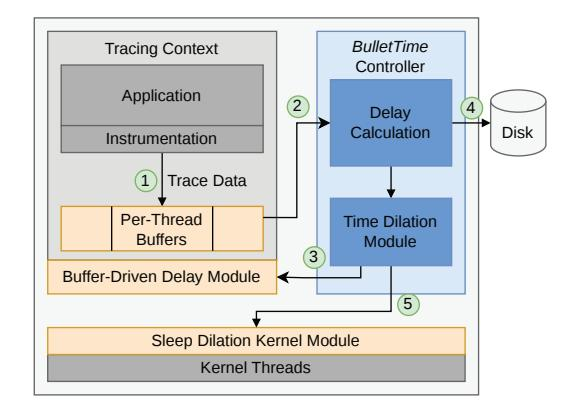

# III. PRESERVING APPLICATION BEHAVIOR WITH TIME DILATION

We begin by describing our approach to modeling application behavior both with and without tracing, and by formalizing the requirements for tracing to preserve application behavior relative to native execution (§III-A). We then describe our *time dilation* approach, which carefully dilates the execution of application and system components to preserve application behavior under tracing (§III-B).

#### A. Modeling the Application Behavior

A key challenge in modeling application behavior during tracing is appropriately *scoping* the application and system components responsible for that behavior. Returning to our memory contiguity studies as an example – at a high level, contiguity is affected broadly by memory allocations and deal-locations. If we scope the components that affect contiguity too narrowly, e.g., by considering only allocations/deallocations from the application, we risk overlooking important "full system" effects, e.g., periodic compactions of regular pages into huge pages by Linux's khugepaged daemon [4]. At the other extreme, if we define our scope too broadly, we would end up modeling components irrelevant to contiguity (e.g., modern Linux has tens of daemons that bear no relation to memory contiguity), resulting in an exponential increase in modeling complexity.

To this end, our approach relies on a precise definition of the application behavior of interest, which is then used to identify the exact set of application and system (i.e., OS or kernel) components that may affect it. More concretely, we introduce two concepts central to the application behavior under study: key state and key operations.

The key state, s, refers to the state critical to defining application behavior. Its contents should comprise the minimum state required to completely preserve the behavior under study. For instance, in a memory contiguity study, s must include the layout of free physical memory and the application's virtual-to-physical mappings. If these traces are used for cache and TLB simulations, then s should also include the layout of the application's allocated data structures. If necessary for functional correctness, the key state must also include variables used for conditional branches, system calls, etc.

A key operation *op*, on the other hand, is any event that *modifies* key state, i.e, an application of this operation leads to a modified key state, denoted as:

$$s' \leftarrow op(s)$$

Key operations comprise all instructions that modify the contents of the key state. Continuing our memory contiguity example, key operations would occur during all memory allocations and deallocations, as well as during any memory migrations performed by kernel daemons (e.g., khuqepaged).

A salient feature of this model is that we ignore all other forms of state and operations in either the application or the system, since perturbations to them are inconsequential to the tracing study. This allows us to constrain the scope of our problem to a well-defined, complete set of interactions among the application, the system, and the tracing framework.

Modeling the untraced application execution. The untraced ("native") application execution is modeled as an ordered list of key operations, Ops, comprising key operations from both the application and system threads. Since these threads execute concurrently, the order of operations in Ops is defined by the serialized order of their execution in the untraced run. More formally, Ops =  $\{op_1, op_2, \ldots, op_n\}$ , where i denotes the order of  $op_i$ 's execution. We use Thread $(op_i)$  to denote the thread that executes  $op_i$ . If  $s_0$  is the initial key state, then the  $application\ behavior$  under native execution is captured in the ordered sequence of key state versions,  $S = \{s_0, s_1, s_2, \ldots, s_n\}$ , where the next key state version is obtained by applying the next operation on the current state, i.e.,  $s_{i+1} \leftarrow op_{i+1}(s_i)$ .

Modeling traced application execution. The same application, when traced, is modeled as a similar list of operations,  $\operatorname{Ops}^t = \{op_1^t, op_2^t, \dots, op_m^t\}$ . As with the untraced execution, Thread $(op_i^t)$  denotes the thread that executes  $op_i^t$ . There are, however, two key differences between  $\operatorname{Ops}^t$  and  $\operatorname{Ops}$ . First,  $\operatorname{Ops}^t$  contains additional operations (denoted as the ordered list  $\mathcal{T}$ ) which correspond to operations performed by the tracing framework itself, i.e.,  $m \geq n$ . Note that if the operations in  $\mathcal{T}$  modify the key state, then the application's

**Algorithm 1 Time Dilation**: Execute operations of a traced application in a way that preserves its behavior.

**Input:** Ops $^t$ , the operations in the traced execution, streamed as windows of L operations per thread.

- 1: **function**  $ExecuteTraced(Ops^t)$
- 2: **for** every window of L operations per thread in  $\mathsf{Ops}^t$  **do**
- tracingDelays ← [# of tracing operations in window for each thread]
   maxDelay ← maxthd∈Threads(tracingDelays)
   Array of per-thread tracing delay in L-sized window
   Find the most delays to a thread in this window.
- 5: **for** each thread  $thd \in Threads do$
- 6:  $injectedDelay_{thd} \leftarrow (maxDelay tracingDelays[thd])$
- 7: Execute the first L injected Delaythd operations in thd's window, followed by a delay of injected Delaythd.
- 8: The last injectedDelay operations of thd are deferred to the next window. ▷To be executed first in the next window.

behavior changes relative to native execution. We also note that the remainder of the operations in  $\mathsf{Ops}^t$  are still the same as the operations in  $\mathsf{Ops}$ . Formally, if we denote  $\mathsf{Ops}$  as the list  $\mathsf{Ops}^t$  with all operations performed by the tracing framework removed (i.e.,  $\mathsf{Ops} = \mathsf{Ops}^t \setminus \mathcal{T}$ ), then  $|\mathsf{Ops}| = |\mathsf{Ops}|$ . However, the second difference between the two lists is that the order of operations in  $\mathsf{Ops}$  may not be preserved in  $\mathsf{Ops}$ . As noted in §II, this re-ordering of operations – typically caused by delays injected by tracing operations ( $\mathcal{T}$ ) themselves – is the other reason that tracing changes application behavior relative to native execution.

**Correctness conditions.** With the execution models defined above, we can now formally establish correctness conditions to ensure that application behavior is preserved during traced execution. These conditions effectively prevent the two sources of behavioral changes discussed above:

- C1 The tracing framework should not modify the key state s. In other words, no operation in  $\mathcal{T}$  is a key operation.
- C2 The order of key operations in the traced execution should be the same as the order of operations in the native execution. Formally,  $\hat{Ops} = Ops$ .

Meeting the correctness condition C1 requires modifying the tracing framework to prevent it from making any key state modifications. In many tracing studies, the tracing framework rarely alters the key state, although this is not impossible, e.g., memory allocations/deallocations within the tracing framework can affect the traced application's contiguity (as noted in §II). Fortunately, addressing this is straightforward: effectively remove such operations from the tracing framework (e.g., by preallocating any required memory buffers ahead of time for the tracing study). We defer implementation details of how this is realized in our framework to §IV.

#### B. Time Dilation Approach

Our approach to address the sources of application behavior changes, termed *time dilation*, effectively ensures that the traced execution preserves the correctness condition **C2**.

**Key idea.** The time dilation approach strategically injects delays in traced execution across various threads, in a manner that ensures all key operations in the traced execution (Ops) occur in the same order as those for the untraced execution (Ops), ensuring condition **C2**. Our driving observation is that changes in the ordering of key operations across threads arise from imbalances in the delays caused by operations injected by

the tracing framework (i.e., operations in  $\mathcal{T}$ ) across application and system threads. Therefore, to restore application behavior, the delays need to be made equitable across all threads. By injecting delays into the "faster" executing threads – threads with fewer delays due to tracing framework operations – we effectively *dilate* the notion of time in those threads until other threads catch up to them.

**Ideal time dilation.** The strongest form of equalization is *lockstep enforcement*: whenever any thread experiences a tracing delay, every other thread experiences an equal delay at the same moment. Under lockstep, either all threads are stalled, or all threads are executing, so no thread can race ahead of any other, and the native order of key operations is preserved exactly, satisfying condition **C2**. Lockstep is also the tightest enforcement at which correctness is guaranteed: any looser enforcement would permit at least one thread to advance further than another between synchronization points, admitting the possibility of reordering. Figure 3 depicts how lockstep execution achieves ideal time dilation – operations 2, 5, 6 in Thread 1, operation 4 in Thread 2, and all system operations are delayed by exactly the amount needed to keep all threads in step.

Windowed time dilation. Lockstep enforcement carries an inherent cost: the algorithm must act on every operation across every thread, a costly overhead. A natural way to amortize this cost is to act over windows of multiple operations at a time, equalizing tracing delays across threads at window granularity rather than at every operation. Algorithm 1 expresses time dilation in this generalized form, operating over windows of L operations per thread, where L=1 corresponds to lockstep execution. Without loss of generality, the algorithm assumes an operation (whether generated by the tracing infrastructure or native execution) is the basic unit of execution, and takes a unit time to execute - more complex operations can always be broken down into a sequence of basic operations (e.g., a single instruction or hardware  $\mu$ op). Modeling operations in this way also allows us to capture the passage of time during their execution: each operation advances time by a single unit.

At a high level, the algorithm considers a window of L operations at a time for every thread (Line 2) and computes the amount of delay that must be injected into the faster threads for that window based on the slowest thread – the one with the most tracing delay (Lines 3-6). It then injects the corresponding delays into the current window (Line 7),

Fig. 7: Delay injection using Algorithm 1 with a window of length L = 3. Translucent blocks indicate operations that are yet to be processed. Using a window length greater than 1 can lead to an approximate rather than exact restoration of thread interleaving, as seen in iteration 3.

thereby deferring some operations for the faster threads to the next window (Line 8). Effectively, Algorithm 1 ensures that the *ratio of delays* (tracingDelaysthd) *to original operations* (L − tracingDelaysthd) is the same across all threads in each window. This insight will prove useful for our kernel and Pinbased implementation of Algorithm 1 in §IV-C, where we must account for threads executing a different number of operations per window and estimate the tracing delays in future windows, which Algorithm 1 assumes are known a priori.

Figure 7 shows how Algorithm 1 executes operations from two threads using a window of length L = 3. In each window, the algorithm identifies the thread with the largest tracing delay and injects delays into the other thread to match it. Any additional operations are carried forward and processed immediately in the next window. The process repeats until all operations have been processed.

Correctness for windowed time dilation. At L = 1, Algorithm 1 reduces to lockstep enforcement. For larger windows (L > 1), however, this preservation no longer holds. As is evident from the execution of Iteration 3 in Figure 7, the fifth operations of the first and second threads are reordered relative to the native execution. Even so, the windowed approach guarantees that operations can only be reordered relative to native execution *within* a window; across windows, operation order is preserved by the same lockstep argument applied at the window granularity rather than at the operation granularity. In other words, Algorithm 1 *bounds* reordering (measured as the time within which operations can be reordered) to the window size.

The window size introduces an interesting trade-off in practice: smaller window sizes require more frequent delay computations and injections, incurring higher overhead, whereas larger window sizes may lead to (albeit bounded) reordering of key operations. We describe how our implementation of this algorithm in BULLETTIME navigates this trade-off to minimize tracing overhead while achieving near-ideal behavior

Fig. 8: BULLETTIME architecture to monitor tracing framework generated I/O operations for time dilation across system and application threads. See §IV-A for details.

in §IV, with real-world evaluations in §VI.

#### IV. BULLETTIME DESIGN

We now describe BULLETTIME, our practical realization of time dilation. While BULLETTIME's general approach applies to a range of simulator front-ends (e.g., Simics [50], M5 [14], etc.), we demonstrate the utility of our approach using an implementation with a Pin-based front-end [48]. This helps us test our idea on a mature software ecosystem that is widely used to build traces in computer architecture studies across simulators (e.g., zsim [67], CMP\$im [39], PinPlay [60], RADISH [28], etc.) and in operating system studies (e.g., MIND [44], HotPot [68], etc.). We begin with a high-level overview of BULLETTIME's architecture (§IV-A), followed by details on how it eliminates key operations in the tracing framework (§IV-B) and how it computes and injects time dilations across application (§IV-C) and system threads (§IV-D).

# III. PRESERVING APPLICATION BEHAVIOR WITH TIME DILATION

We begin by describing our approach to modeling application behavior both with and without tracing, and by formalizing the requirements for tracing to preserve application behavior relative to native execution (§III-A). We then describe our *time dilation* approach, which carefully dilates the execution of application and system components to preserve application behavior under tracing (§III-B).

#### A. Modeling the Application Behavior

A key challenge in modeling application behavior during tracing is appropriately *scoping* the application and system components responsible for that behavior. Returning to our memory contiguity studies as an example – at a high level, contiguity is affected broadly by memory allocations and deal-locations. If we scope the components that affect contiguity too narrowly, e.g., by considering only allocations/deallocations from the application, we risk overlooking important "full system" effects, e.g., periodic compactions of regular pages into huge pages by Linux's khugepaged daemon [4]. At the other extreme, if we define our scope too broadly, we would end up modeling components irrelevant to contiguity (e.g., modern Linux has tens of daemons that bear no relation to memory contiguity), resulting in an exponential increase in modeling complexity.

To this end, our approach relies on a precise definition of the application behavior of interest, which is then used to identify the exact set of application and system (i.e., OS or kernel) components that may affect it. More concretely, we introduce two concepts central to the application behavior under study: key state and key operations.

The key state, s, refers to the state critical to defining application behavior. Its contents should comprise the minimum state required to completely preserve the behavior under study. For instance, in a memory contiguity study, s must include the layout of free physical memory and the application's virtual-to-physical mappings. If these traces are used for cache and TLB simulations, then s should also include the layout of the application's allocated data structures. If necessary for functional correctness, the key state must also include variables used for conditional branches, system calls, etc.

A key operation *op*, on the other hand, is any event that *modifies* key state, i.e, an application of this operation leads to a modified key state, denoted as:

$$s' \leftarrow op(s)$$

Key operations comprise all instructions that modify the contents of the key state. Continuing our memory contiguity example, key operations would occur during all memory allocations and deallocations, as well as during any memory migrations performed by kernel daemons (e.g., khuqepaged).

A salient feature of this model is that we ignore all other forms of state and operations in either the application or the system, since perturbations to them are inconsequential to the tracing study. This allows us to constrain the scope of our problem to a well-defined, complete set of interactions among the application, the system, and the tracing framework.

Modeling the untraced application execution. The untraced ("native") application execution is modeled as an ordered list of key operations, Ops, comprising key operations from both the application and system threads. Since these threads execute concurrently, the order of operations in Ops is defined by the serialized order of their execution in the untraced run. More formally, Ops =  $\{op_1, op_2, \ldots, op_n\}$ , where i denotes the order of  $op_i$ 's execution. We use Thread $(op_i)$  to denote the thread that executes  $op_i$ . If  $s_0$  is the initial key state, then the  $application\ behavior$  under native execution is captured in the ordered sequence of key state versions,  $S = \{s_0, s_1, s_2, \ldots, s_n\}$ , where the next key state version is obtained by applying the next operation on the current state, i.e.,  $s_{i+1} \leftarrow op_{i+1}(s_i)$ .

Modeling traced application execution. The same application, when traced, is modeled as a similar list of operations,  $\operatorname{Ops}^t = \{op_1^t, op_2^t, \dots, op_m^t\}$ . As with the untraced execution, Thread $(op_i^t)$  denotes the thread that executes  $op_i^t$ . There are, however, two key differences between  $\operatorname{Ops}^t$  and  $\operatorname{Ops}$ . First,  $\operatorname{Ops}^t$  contains additional operations (denoted as the ordered list  $\mathcal{T}$ ) which correspond to operations performed by the tracing framework itself, i.e.,  $m \geq n$ . Note that if the operations in  $\mathcal{T}$  modify the key state, then the application's

**Algorithm 1 Time Dilation**: Execute operations of a traced application in a way that preserves its behavior.

**Input:** Ops $^t$ , the operations in the traced execution, streamed as windows of L operations per thread.

- 1: **function**  $ExecuteTraced(Ops^t)$
- 2: **for** every window of L operations per thread in  $\mathsf{Ops}^t$  **do**
- tracingDelays ← [# of tracing operations in window for each thread]
   maxDelay ← maxthd∈Threads(tracingDelays)
   Array of per-thread tracing delay in L-sized window
   Find the most delays to a thread in this window.
- 5: **for** each thread  $thd \in Threads do$
- 6:  $injectedDelay_{thd} \leftarrow (maxDelay tracingDelays[thd])$
- 7: Execute the first L injected Delaythd operations in thd's window, followed by a delay of injected Delaythd.
- 8: The last injectedDelay operations of thd are deferred to the next window. ▷To be executed first in the next window.

behavior changes relative to native execution. We also note that the remainder of the operations in  $\mathsf{Ops}^t$  are still the same as the operations in  $\mathsf{Ops}$ . Formally, if we denote  $\mathsf{Ops}$  as the list  $\mathsf{Ops}^t$  with all operations performed by the tracing framework removed (i.e.,  $\mathsf{Ops} = \mathsf{Ops}^t \setminus \mathcal{T}$ ), then  $|\mathsf{Ops}| = |\mathsf{Ops}|$ . However, the second difference between the two lists is that the order of operations in  $\mathsf{Ops}$  may not be preserved in  $\mathsf{Ops}$ . As noted in §II, this re-ordering of operations – typically caused by delays injected by tracing operations ( $\mathcal{T}$ ) themselves – is the other reason that tracing changes application behavior relative to native execution.

**Correctness conditions.** With the execution models defined above, we can now formally establish correctness conditions to ensure that application behavior is preserved during traced execution. These conditions effectively prevent the two sources of behavioral changes discussed above:

- C1 The tracing framework should not modify the key state s. In other words, no operation in  $\mathcal{T}$  is a key operation.
- C2 The order of key operations in the traced execution should be the same as the order of operations in the native execution. Formally,  $\hat{Ops} = Ops$ .

Meeting the correctness condition C1 requires modifying the tracing framework to prevent it from making any key state modifications. In many tracing studies, the tracing framework rarely alters the key state, although this is not impossible, e.g., memory allocations/deallocations within the tracing framework can affect the traced application's contiguity (as noted in §II). Fortunately, addressing this is straightforward: effectively remove such operations from the tracing framework (e.g., by preallocating any required memory buffers ahead of time for the tracing study). We defer implementation details of how this is realized in our framework to §IV.

#### B. Time Dilation Approach

Our approach to address the sources of application behavior changes, termed *time dilation*, effectively ensures that the traced execution preserves the correctness condition **C2**.

**Key idea.** The time dilation approach strategically injects delays in traced execution across various threads, in a manner that ensures all key operations in the traced execution (Ops) occur in the same order as those for the untraced execution (Ops), ensuring condition **C2**. Our driving observation is that changes in the ordering of key operations across threads arise from imbalances in the delays caused by operations injected by

the tracing framework (i.e., operations in  $\mathcal{T}$ ) across application and system threads. Therefore, to restore application behavior, the delays need to be made equitable across all threads. By injecting delays into the "faster" executing threads – threads with fewer delays due to tracing framework operations – we effectively *dilate* the notion of time in those threads until other threads catch up to them.

**Ideal time dilation.** The strongest form of equalization is *lockstep enforcement*: whenever any thread experiences a tracing delay, every other thread experiences an equal delay at the same moment. Under lockstep, either all threads are stalled, or all threads are executing, so no thread can race ahead of any other, and the native order of key operations is preserved exactly, satisfying condition **C2**. Lockstep is also the tightest enforcement at which correctness is guaranteed: any looser enforcement would permit at least one thread to advance further than another between synchronization points, admitting the possibility of reordering. Figure 3 depicts how lockstep execution achieves ideal time dilation – operations 2, 5, 6 in Thread 1, operation 4 in Thread 2, and all system operations are delayed by exactly the amount needed to keep all threads in step.

Windowed time dilation. Lockstep enforcement carries an inherent cost: the algorithm must act on every operation across every thread, a costly overhead. A natural way to amortize this cost is to act over windows of multiple operations at a time, equalizing tracing delays across threads at window granularity rather than at every operation. Algorithm 1 expresses time dilation in this generalized form, operating over windows of L operations per thread, where L=1 corresponds to lockstep execution. Without loss of generality, the algorithm assumes an operation (whether generated by the tracing infrastructure or native execution) is the basic unit of execution, and takes a unit time to execute - more complex operations can always be broken down into a sequence of basic operations (e.g., a single instruction or hardware  $\mu$ op). Modeling operations in this way also allows us to capture the passage of time during their execution: each operation advances time by a single unit.

At a high level, the algorithm considers a window of L operations at a time for every thread (Line 2) and computes the amount of delay that must be injected into the faster threads for that window based on the slowest thread – the one with the most tracing delay (Lines 3-6). It then injects the corresponding delays into the current window (Line 7),

Fig. 7: Delay injection using Algorithm 1 with a window of length L = 3. Translucent blocks indicate operations that are yet to be processed. Using a window length greater than 1 can lead to an approximate rather than exact restoration of thread interleaving, as seen in iteration 3.

thereby deferring some operations for the faster threads to the next window (Line 8). Effectively, Algorithm 1 ensures that the *ratio of delays* (tracingDelaysthd) *to original operations* (L − tracingDelaysthd) is the same across all threads in each window. This insight will prove useful for our kernel and Pinbased implementation of Algorithm 1 in §IV-C, where we must account for threads executing a different number of operations per window and estimate the tracing delays in future windows, which Algorithm 1 assumes are known a priori.

Figure 7 shows how Algorithm 1 executes operations from two threads using a window of length L = 3. In each window, the algorithm identifies the thread with the largest tracing delay and injects delays into the other thread to match it. Any additional operations are carried forward and processed immediately in the next window. The process repeats until all operations have been processed.

Correctness for windowed time dilation. At L = 1, Algorithm 1 reduces to lockstep enforcement. For larger windows (L > 1), however, this preservation no longer holds. As is evident from the execution of Iteration 3 in Figure 7, the fifth operations of the first and second threads are reordered relative to the native execution. Even so, the windowed approach guarantees that operations can only be reordered relative to native execution *within* a window; across windows, operation order is preserved by the same lockstep argument applied at the window granularity rather than at the operation granularity. In other words, Algorithm 1 *bounds* reordering (measured as the time within which operations can be reordered) to the window size.

The window size introduces an interesting trade-off in practice: smaller window sizes require more frequent delay computations and injections, incurring higher overhead, whereas larger window sizes may lead to (albeit bounded) reordering of key operations. We describe how our implementation of this algorithm in BULLETTIME navigates this trade-off to minimize tracing overhead while achieving near-ideal behavior

Fig. 8: BULLETTIME architecture to monitor tracing framework generated I/O operations for time dilation across system and application threads. See §IV-A for details.

in §IV, with real-world evaluations in §VI.

#### IV. BULLETTIME DESIGN

We now describe BULLETTIME, our practical realization of time dilation. While BULLETTIME's general approach applies to a range of simulator front-ends (e.g., Simics [50], M5 [14], etc.), we demonstrate the utility of our approach using an implementation with a Pin-based front-end [48]. This helps us test our idea on a mature software ecosystem that is widely used to build traces in computer architecture studies across simulators (e.g., zsim [67], CMP\$im [39], PinPlay [60], RADISH [28], etc.) and in operating system studies (e.g., MIND [44], HotPot [68], etc.). We begin with a high-level overview of BULLETTIME's architecture (§IV-A), followed by details on how it eliminates key operations in the tracing framework (§IV-B) and how it computes and injects time dilations across application (§IV-C) and system threads (§IV-D).

