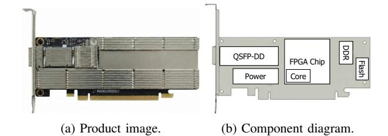

# *B. Motivation 2: Low performance of on-device sidecores*

Compute bottleneck. To address host CPU inefficiency, sidecore approaches are proposed to offload the entire storage disaggregation software stack to sidecores on devices. However, limited sidecore capability severly restricts performance. Our experiment with BlueField-3 SNAP [9, 25] shows that it reaches only 9.6% of the 200 Gbps line rate, even with all 16 on-device ARM cores fully utilized. The experiment used FIO with 4 KiB random read/write I/O, 32 threads, and 128 queue depth. These findings suggest that simply adding more ARM cores is insufficient to fully bridge the performance gap.

Equipping DPUs with server-class CPUs (e.g., Intel Xeon [19]) could improve performance, but sustaining 200 Gbps line rate still requires tens of cores (e.g., 24 Xeon Gold 6348N cores for read [65]). Their high power consumption (i.e., ≈ 200W [18]) and stringent board requirements including multiple DIMM slots, VRM circuits, and heavy-duty cooling system make integration impractical [30, 31].

Instead of fully relying on sidecores, partial hardware acceleration can be applied. In this paper, hardware acceleration denotes execution of critical operations in dedicated logic rather than sidecore-based software offloading. XLIO [20] reduces CPU utilization and memory copies, by enabling TX PDU payload to bypass off-chip memory and be delivered directly to the NIC. However, even with XLIO, substantial overhead remains from the residual software stacks on sidecores. Our experiments show that SNAP with XLIO reaches only 34.3% of 200 Gbps line-rate throughput under the same FIO setup as SNAP alone. This implies that, despite eliminating part of TCP processing and TX datapath management, the remaining stacks still impose a heavy load. The issue is aggravated on platforms other than FHHL BlueField DPUs, where only a few low-performance cores are available [4, 15, 25]. Scaling down the ARM cores allocated to SNAP with XLIO further demonstrates this limitation: throughput drops to 13.9% and 6.1% of the line-rate with 8 cores and 4 cores, respectively.

Consequently, I/O processing should be performed entirely within hardware logic. The sidecore software stack can be divided into administrative tasks, such as operations related to NVMe and NVMe/TCP admin queues, and I/O processing, such as I/O command, completion and data handling. Compared to administrative tasks, I/O operations are more structured, repetitive, and account for the majority of execution cycles, making them well-suited for hardware implementation and yielding substantial performance gains.

Memory bottleneck. Even if the I/O processing is entirely accelerated by hardware, off-chip memory bandwidth remains a critical bottleneck. Specifically, existing NVMe/TCP implementations stage every incoming TCP payload in large TCP send/receive buffers before identifying PDU boundaries to extract PDUs. This creates a severe bottleneck as every payload traverses off-chip memory at line rate in both ingress and egress directions. The problem is further aggravated by the low effective bandwidth caused by frequent small memory accesses (e.g., NVMe commands/completions, PDU headers) combined with random access patterns (e.g., reordered arrival and retransmissions of TCP packets). An alternative is to place TCP buffers in on-chip memory with higher bandwidth, but this is impractical because SRAM capacity is far below the hundreds of MBs required for many concurrent connections.

These constraints motivate us to build *Virtual buffer*, a technique that removes the need for the large buffers. This enables processing incoming data on-the-fly without intermediate buffering with on-demand DMA to and from the NVMe data buffer on host memory. However, implementing such a design in practice is non-trivial. On the TX path, the TCP stack transmit the received data according to TCP protocol, not in the order in which PDUs are delivered by the NVMe/TCP stack. Consequently, the TCP stack cannot consume PDUs in their delivery order. Specifically, retransmissions require TCP to resend arbitrary byte ranges of previously generated PDUs, and TCP segmentation boundaries often do not align with PDU boundaries. As a result, PDUs that cannot be immediately consumed in the correct TCP order must be staged in a large intermediate buffer. Likewise, the RX path faces a similar challenge: received TCP payloads cannot be directly consumed by the receiver-side NVMe/TCP stack. As discussed in Section II-A2, the stack must parse PDUs by sequentially scanning incoming TCP payloads. However, in practice the arrival of TCP payloads is neither sequential nor predictable, as network conditions and multiple concurrent connections frequently interleave or reorder segments. Together, these factors must be carefully addressed with Virtual buffer.

### C. Motivation 3: Practical deployability

While accelerating the entire I/O path in hardware addresses inefficiency and performance issues, practical deployability remains a key challenge in real-world environments.

Form factor and power. In modern datacenters, increasing rack density and a strong imperative to minimize total power consumption [93, 105] drive the widespread adoption of highdensity 1U/2U servers [10, 11, 101], where NICs are universally deployed in the Half-Height, Half-Length (HHHL) form factor without auxiliary (AUX) power [45]. For datacenter operators, introducing new hardware that uses a different form factor or requires an additional power may cause incompatibilities with existing servers and may even necessitate changes in rack layout. Therefore, our solution must comply with HHHL form factor and power requirement. However, designing a fully hardware accelerated solution under these constraints is highly challenging. First, the HHHL cards tend to offer only limited heatsink volume, which increases the likelihood of thermal issues when deployed in servers with constrained airflow. Second, the HHHL cards inherently impose a tight resource budget, such as restricted on-chip memory capacity. Interoperability. Real-world datacenter deployments span diverse hardware and software stacks [58, 81]. In such environments, ensuring interoperability requires strict protocol compliance while presenting a uniform and standard interface to the host. Also, in practice, tightly controlled datacenters such as air-gapped clusters make kernel updates or driver installation pose severe operational pain points, further reinforcing the need for a solution that integrates seamlessly with unmodified host software. Achieving such interoperability is especially challenging for storage disaggregation offloading, which must uphold strict compliance across the NVMe, NVMe/TCP, and TCP layers while maintaining a consistent interface to the host without adding integration overhead.

Operational resilience. In disaggregated storage environments, hosts and storage devices are tightly coupled over the network, while operational tasks such as live upgrades, node replacement, or rack reconfiguration are routine [45]. To tolerate these changes, the solution must continue to work by maintaining connections even when the storage controller is moved or replaced. In addition, a variety of failure scenarios can arise in datacenter operations [107], such as abnormal queue termination (e.g., C2HTerm PDU), invalid command fields (e.g., CID), and data transfer errors (e.g., digest mismatch). Without sufficient resilience, such operational changes or failure events can easily disrupt storage services, forcing

Fig. 5: DPU product image and internal component diagram.

I/O sessions to be torn down and re-established, which incurs significant downtime and overhead. Traditionally, resilience mechanisms—tolerating operational changes and handling errors—have been provided by the software stack. So, our hardware-based solution must handle a wide range of dynamic operational changes and diverse failure conditions at a level equivalent to software, which is particularly challenging.

#### IV. DESIGN GOALS

To address the issues described in Section III, we establish three design goals, which encompass not only efficiency and performance but also the practical datacenter demand.

**Goal 1: Host CPU efficiency.** The solution should achieve high throughput while minimizing host CPU usage, ensuring that CPU resources remain available for application workloads rather than being consumed by storage processing.

Goal 2: Unmatched performance. The solution should sustain line-rate performance across network generations, meeting the demands of data-intensive workloads such as AI/ML training, and large-scale databases. Specifically, our design goal is to achieve full-duplex 200 Gbps across both small and large block sizes, as no existing DPU-based approach, to the best of our knowledge, has successfully met this goal [7, 9], even those limited to NVMe/TCP targets [14, 41, 55].

**Goal 3: Practical deployability.** The solution should ensure practical deployability in real-world data centers by simultaneously meeting stringent hardware constraints, guaranteeing interoperability across heterogeneous datacenter environments, and providing operational resilience.

#### V. NTI DESIGN AND IMPLEMENTATION

This section introduces the design and implementation of NTI, our hardware-accelerated DPU solution for NVMe/TCP initiator. Figure 5 illustrates the DPU product and its component-level diagram. NTI combines FPGA-based I/O processing with sidecore-assisted control-plane to deliver host CPU efficiency (Section V-A), high performance (Section V-B), and practical deployability (Section V-C). Before the design details, we note that NTI adopt FPGAs as the DPU platform to keep pace with rapidly evolving datacenter requirements. Compared to ASICs, FPGAs enable fast iteration and timely deployment under real-world time-to-market constraints, making them a practical foundation for production-oriented DPU development (see Section VII). Note that NTI shifts the design focus from physical scaling to

Fig. 6: NTI architecture.

architectural innovation. It decouples performance from hardware constraints through two pillars: (1) Memory bandwidth independence via the Virtual Buffer, which eliminates offchip bottlenecks using on-chip metadata; and (2) Compute independence by offloading the entire I/O path to hardware, removing sidecore-related performance limits. This approach enables high-speed I/O scaling independent of underlying physical resources.

# *B. Motivation 2: Low performance of on-device sidecores*

Compute bottleneck. To address host CPU inefficiency, sidecore approaches are proposed to offload the entire storage disaggregation software stack to sidecores on devices. However, limited sidecore capability severly restricts performance. Our experiment with BlueField-3 SNAP [9, 25] shows that it reaches only 9.6% of the 200 Gbps line rate, even with all 16 on-device ARM cores fully utilized. The experiment used FIO with 4 KiB random read/write I/O, 32 threads, and 128 queue depth. These findings suggest that simply adding more ARM cores is insufficient to fully bridge the performance gap.

Equipping DPUs with server-class CPUs (e.g., Intel Xeon [19]) could improve performance, but sustaining 200 Gbps line rate still requires tens of cores (e.g., 24 Xeon Gold 6348N cores for read [65]). Their high power consumption (i.e., ≈ 200W [18]) and stringent board requirements including multiple DIMM slots, VRM circuits, and heavy-duty cooling system make integration impractical [30, 31].

Instead of fully relying on sidecores, partial hardware acceleration can be applied. In this paper, hardware acceleration denotes execution of critical operations in dedicated logic rather than sidecore-based software offloading. XLIO [20] reduces CPU utilization and memory copies, by enabling TX PDU payload to bypass off-chip memory and be delivered directly to the NIC. However, even with XLIO, substantial overhead remains from the residual software stacks on sidecores. Our experiments show that SNAP with XLIO reaches only 34.3% of 200 Gbps line-rate throughput under the same FIO setup as SNAP alone. This implies that, despite eliminating part of TCP processing and TX datapath management, the remaining stacks still impose a heavy load. The issue is aggravated on platforms other than FHHL BlueField DPUs, where only a few low-performance cores are available [4, 15, 25]. Scaling down the ARM cores allocated to SNAP with XLIO further demonstrates this limitation: throughput drops to 13.9% and 6.1% of the line-rate with 8 cores and 4 cores, respectively.

Consequently, I/O processing should be performed entirely within hardware logic. The sidecore software stack can be divided into administrative tasks, such as operations related to NVMe and NVMe/TCP admin queues, and I/O processing, such as I/O command, completion and data handling. Compared to administrative tasks, I/O operations are more structured, repetitive, and account for the majority of execution cycles, making them well-suited for hardware implementation and yielding substantial performance gains.

Memory bottleneck. Even if the I/O processing is entirely accelerated by hardware, off-chip memory bandwidth remains a critical bottleneck. Specifically, existing NVMe/TCP implementations stage every incoming TCP payload in large TCP send/receive buffers before identifying PDU boundaries to extract PDUs. This creates a severe bottleneck as every payload traverses off-chip memory at line rate in both ingress and egress directions. The problem is further aggravated by the low effective bandwidth caused by frequent small memory accesses (e.g., NVMe commands/completions, PDU headers) combined with random access patterns (e.g., reordered arrival and retransmissions of TCP packets). An alternative is to place TCP buffers in on-chip memory with higher bandwidth, but this is impractical because SRAM capacity is far below the hundreds of MBs required for many concurrent connections.

These constraints motivate us to build *Virtual buffer*, a technique that removes the need for the large buffers. This enables processing incoming data on-the-fly without intermediate buffering with on-demand DMA to and from the NVMe data buffer on host memory. However, implementing such a design in practice is non-trivial. On the TX path, the TCP stack transmit the received data according to TCP protocol, not in the order in which PDUs are delivered by the NVMe/TCP stack. Consequently, the TCP stack cannot consume PDUs in their delivery order. Specifically, retransmissions require TCP to resend arbitrary byte ranges of previously generated PDUs, and TCP segmentation boundaries often do not align with PDU boundaries. As a result, PDUs that cannot be immediately consumed in the correct TCP order must be staged in a large intermediate buffer. Likewise, the RX path faces a similar challenge: received TCP payloads cannot be directly consumed by the receiver-side NVMe/TCP stack. As discussed in Section II-A2, the stack must parse PDUs by sequentially scanning incoming TCP payloads. However, in practice the arrival of TCP payloads is neither sequential nor predictable, as network conditions and multiple concurrent connections frequently interleave or reorder segments. Together, these factors must be carefully addressed with Virtual buffer.

### C. Motivation 3: Practical deployability

While accelerating the entire I/O path in hardware addresses inefficiency and performance issues, practical deployability remains a key challenge in real-world environments.

Form factor and power. In modern datacenters, increasing rack density and a strong imperative to minimize total power consumption [93, 105] drive the widespread adoption of highdensity 1U/2U servers [10, 11, 101], where NICs are universally deployed in the Half-Height, Half-Length (HHHL) form factor without auxiliary (AUX) power [45]. For datacenter operators, introducing new hardware that uses a different form factor or requires an additional power may cause incompatibilities with existing servers and may even necessitate changes in rack layout. Therefore, our solution must comply with HHHL form factor and power requirement. However, designing a fully hardware accelerated solution under these constraints is highly challenging. First, the HHHL cards tend to offer only limited heatsink volume, which increases the likelihood of thermal issues when deployed in servers with constrained airflow. Second, the HHHL cards inherently impose a tight resource budget, such as restricted on-chip memory capacity. Interoperability. Real-world datacenter deployments span diverse hardware and software stacks [58, 81]. In such environments, ensuring interoperability requires strict protocol compliance while presenting a uniform and standard interface to the host. Also, in practice, tightly controlled datacenters such as air-gapped clusters make kernel updates or driver installation pose severe operational pain points, further reinforcing the need for a solution that integrates seamlessly with unmodified host software. Achieving such interoperability is especially challenging for storage disaggregation offloading, which must uphold strict compliance across the NVMe, NVMe/TCP, and TCP layers while maintaining a consistent interface to the host without adding integration overhead.

Operational resilience. In disaggregated storage environments, hosts and storage devices are tightly coupled over the network, while operational tasks such as live upgrades, node replacement, or rack reconfiguration are routine [45]. To tolerate these changes, the solution must continue to work by maintaining connections even when the storage controller is moved or replaced. In addition, a variety of failure scenarios can arise in datacenter operations [107], such as abnormal queue termination (e.g., C2HTerm PDU), invalid command fields (e.g., CID), and data transfer errors (e.g., digest mismatch). Without sufficient resilience, such operational changes or failure events can easily disrupt storage services, forcing

Fig. 5: DPU product image and internal component diagram.

I/O sessions to be torn down and re-established, which incurs significant downtime and overhead. Traditionally, resilience mechanisms—tolerating operational changes and handling errors—have been provided by the software stack. So, our hardware-based solution must handle a wide range of dynamic operational changes and diverse failure conditions at a level equivalent to software, which is particularly challenging.

#### IV. DESIGN GOALS

To address the issues described in Section III, we establish three design goals, which encompass not only efficiency and performance but also the practical datacenter demand.

**Goal 1: Host CPU efficiency.** The solution should achieve high throughput while minimizing host CPU usage, ensuring that CPU resources remain available for application workloads rather than being consumed by storage processing.

Goal 2: Unmatched performance. The solution should sustain line-rate performance across network generations, meeting the demands of data-intensive workloads such as AI/ML training, and large-scale databases. Specifically, our design goal is to achieve full-duplex 200 Gbps across both small and large block sizes, as no existing DPU-based approach, to the best of our knowledge, has successfully met this goal [7, 9], even those limited to NVMe/TCP targets [14, 41, 55].

**Goal 3: Practical deployability.** The solution should ensure practical deployability in real-world data centers by simultaneously meeting stringent hardware constraints, guaranteeing interoperability across heterogeneous datacenter environments, and providing operational resilience.

#### V. NTI DESIGN AND IMPLEMENTATION

This section introduces the design and implementation of NTI, our hardware-accelerated DPU solution for NVMe/TCP initiator. Figure 5 illustrates the DPU product and its component-level diagram. NTI combines FPGA-based I/O processing with sidecore-assisted control-plane to deliver host CPU efficiency (Section V-A), high performance (Section V-B), and practical deployability (Section V-C). Before the design details, we note that NTI adopt FPGAs as the DPU platform to keep pace with rapidly evolving datacenter requirements. Compared to ASICs, FPGAs enable fast iteration and timely deployment under real-world time-to-market constraints, making them a practical foundation for production-oriented DPU development (see Section VII). Note that NTI shifts the design focus from physical scaling to

Fig. 6: NTI architecture.

architectural innovation. It decouples performance from hardware constraints through two pillars: (1) Memory bandwidth independence via the Virtual Buffer, which eliminates offchip bottlenecks using on-chip metadata; and (2) Compute independence by offloading the entire I/O path to hardware, removing sidecore-related performance limits. This approach enables high-speed I/O scaling independent of underlying physical resources.

