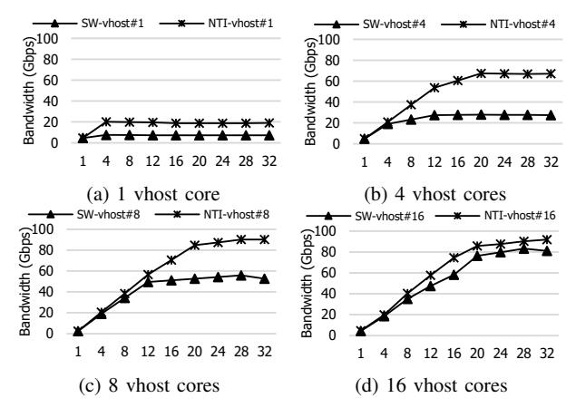
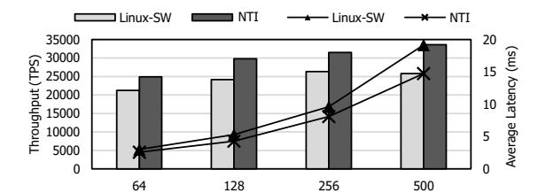

# *B. Realworld workloads*

*1) Workload in AI:* In this section, we present the evaluation results with MLPerf™ Storage [82], which emulates I/O demands of AI training by modeling GPU data consumption. It models NVIDIA H100 and A100 GPUs, where faster GPUs (e.g., H100) require higher storage throughput. The benchmark score reflects how many accelerators can be supported while maintaining each accelerator's utilization at 90% or higher. MLPerf™ Storage provides various training models, namely ResNet50 [63], CosmoFlow [80], and UNET-3D [53]. We compare the baseline using the kernel NVMe/TCP stack against NTI, with the target running an SPDK NVMe/TCP.

Figure 15 reports the scores of NTI and the baseline normalized to a local SSD system, which represents the ideal case without network overhead. NTI consistently outperforms the baseline in all workloads, with up to 2× and on average 1.34× higher performance, while reaching 91.6% of

Fig. 15: MLPerf™ Storage results with NTI and the baseline, normalized to the score of a local storage system.

local SSD performance on average. UNET3D showed the greatest improvement, 1.4× and 2× in A100 and H100, and even matched the local SSD score with NTI's throughputoriented I/O processing acceleration. ResNet50 showed little improvement on A100 GPUs, but with H100 GPUs, the faster compute shifted the bottleneck to storage, leading NTI to achieve 1.39× higher score than baseline. Cosmoflow exhibits the opposite trend. As GPU speed increases from A100 to H100, the workload characteristics shift: the doubled compute capability amplifies the effect of latency sensitivity, drastically shortening the latency target. Since both baseline and NTI cannot fully meet this tighter latency requirement, they are equally bottlenecked. Thus the performance gap diminishes.

From a customer perspective, these score improvements directly translate to GPU utilization. By eliminating the storage I/O bottleneck, NTI increases the number of GPUs that can maintain a utilization of 90% or higher proportionally to the MLPerf™ Storage score gains shown in Figure 15—up to 2× improvement.

*2) Workload in Cloud:* Figure 16 compares the scalability of SPDK NVMe/TCP initiator and NTI, each integrated with vHost [100], an SPDK-based storage virtualization solution. Each vHost is provisioned with one core and 8 GB memory, and FIO is used to measure aggregated bandwidth. NTI consistently achieves higher aggregated throughput, enabling more efficient scaling to support larger numbers of VMs. The advantage is most pronounced with fewer vHost cores, where the NVMe/TCP software contends with vHost for limited CPU resources, leading to severe core contention. NTI achieves 2.64×, 2.41×, 1.71×, and 1.10× higher throughput at 1, 4, 8, and 16 vHost cores, respectively. These gains stem from offloading the NVMe/TCP stack entirely into hardware, allowing vHost to fully utilize dedicated cores and reach linerate performance with significantly fewer cores.

Translated into customer impact, this throughput gains directly translate to VM density. Under strict per-VM bandwidth SLAs, operators must cap the number of hosted VMs to guarantee each VM's allocated bandwidth. Since NTI approximately doubles throughput over the baseline, a single host can serve approximately twice as many VMs—halving the infrastructure footprint.

*3) Workload in Database:* We ran a PostgreSQL database on the xfs file system and used pgbench [2] to generate

Fig. 16: NTI scalability in cloud (Each VM is allocated 1 core and 8 GB of memory).

transaction workloads. The pgbench emulates client behavior by issuing short, random queries against the database. We then varied the number of simultaneous client connections, from 64 to 500 to examine I/O capability under high concurrency.

Figure 17 compares the performance of NTI with the kernel NVMe/TCP. As shown, NTI consistently achieves higher transaction per second (TPS) and lower latency. As TPS is the primary metric database customers use to size their infrastructure, these gains directly reduce the number of servers required to sustain a given query load. On average, it delivers 17.0%, 23.5%, 19.6% higher TPS across 64, 128, 256 clients, respectively, and up to 30.3% at 500 clients. When scaling from 256 to 500 clients, kernel throughput saturates due to high CPU resource usage of the NVMe/TCP stack, whereas NTI continues to scale. In terms of latency, NTI not only maintains lower averages in all cases but also widens the gap as concurrency grows. For example, the latency reduction is 14.5% lower at 64 clients and 23.1% at 500 clients. These results demonstrate that NTI sustains both higher throughput and lower latency under large-scale and high concurrency, which enables service-level requirements from clients even under heavy contention.

## VII. INSIGHTS AND LESSONS

Arising requirement of full-stack solution. Single-layer optimizations have limited scope and are difficult to integrate with other solutions. As a result, industry systems are shifting toward full-stack designs, and NTI represents a strong foundation for a full-stack solution in storage disaggregation.

Importance of defining the HW/SW boundary. The HW/SW boundary fundamentally shapes the architecture. A sound policy is to place fast and simple datapath functions in hardware while keeping complex and changing control in software. Crucially, near-boundary functions must be classified accurately; for example, our analysis shows that I/O command processing is not pure datapath, yet software-only execution incurs severe overhead, motivating its placement in hardware.

Fig. 17: NTI performance in database.

FPGA as a HW/SW co-design platform. FPGAs are an optimal platform for HW/SW co-design. Co-design is not a onetime architectural decision, but a continuous feedback loop that adapts to workload shifts and operational insights—an agility that ASICs cannot easily offer. In NTI, for instance, decisions such as the HW/SW boundary and virtual buffer were iteratively refined through FPGA reconfigurability, allowing each design round to converge on a superior architecture. This iterative refinement is especially valuable because simulation modeling for hardware or device emulation for software are often slow and inaccurate, whereas FPGA prototypes provide rapid and faithful evaluation.

Modularization for maintenance. To shorten the development cycle, we isolate environment-specific or frequently configured logic behind standardized interfaces, allowing focused code management and seamless integration. For instance, we define a *vendor-dependent platform* to encapsulate boardspecific modules, ensuring transparency for protocol IPs.

Combining RTL and HLS for design productivity. While HLS significantly accelerates hardware development, achieving efficient area utilization and reliable timing closure remains challenging. Our experience indicates that a hybrid design methodology is essential for production-grade systems in fastevolving domains such as storage disaggregation. Thus, we implemented commonly reused infrastructure IPs (e.g., mux, demux, and protocol shims), and functionally stable modules with fixed functionality in RTL. This approach substantially improved timing closure and logic routing quality without sacrificing development productivity.

Debugging strategy in disaggregated system. Operating in a disaggregated environment introduces significant challenges in debugging due to distributed execution and weak observability across nodes. A key lesson from NTI is that debuggability must be treated as a first-class design objective rather than an afterthought. To this end, NTI employs time-synchronization to ensure inter-node log alignment and causal ordering. For air-gapped deployments, it further employs hardware-assisted, cycle-accurate logging mechanisms (e.g., event-triggered snapshots) for exact failure reconstruction with memory-resident logs. Importantly, NTI achieves robust hardware observability by dedicating 2.35% of its total logic resource.

Future FPGA design: Suggestion for hardened IPs. FPGA vendors increasingly integrate widely adopted functions (e.g., PCIe, Ethernet MAC/PHYs, and DDR controllers) as hardened IPs, and recent platforms such as Versal further extend this trend by hardening on-chip interconnects. Meanwhile, the growing adoption of storage disaggregation and scaleout architectures makes efficient node-to-node communication critical, elevating high-performance NICs to first-class system components. We therefore suggest hardening full NIC subsystems, including packet switching logic that interconnects MACs, user logic, and processing systems.

## VIII. RELATED WORKS

NVMe and NVMe-oF. Solutions for NVMe and NVMeoF have evolved toward lower CPU overhead and scalable virtualization [50, 51, 71, 91, 108]. LeapIO [71] offloaded virtualization onto SoC cores with efficient address translation. LightIOV [51] achieved scalable software virtualization using IOMMU and EPT. NVMePass [50] enabled direct VM access to NVMe queues via software-hardware co-design, cutting latency by 50%. LightPool [108] aggregated local and remote SSDs into sharable pools using NVMe-oF with zero-copy.

Various DPU solutions. Recent production-ready DPUs for NVMe-oF storage disaggregation [9, 20, 25, 46, 55, 57, 70, 78, 79, 84, 89] typically combine lightweight sidecores with auxiliary accelerators. NVIDIA BlueField-3 [25] is a representative solution, while supporting auxiliary functionalities such as [9, 20]. Napatech [84] integrates more powerful CPUs (e.g., Intel Xeon D) to achieve higher computing capabilities compared to ARM-based DPUs, although its FHHL form factor and power envelope impose practical constraints. Various NVMeoF targets [46, 55, 57, 78] exist, and NTI interoperates seamlessly with them thanks to the NVMe-oF compliance.

P4-based DPUs, such as AMD Pensando Salina [42] and Intel IPU E2100/2200 [43], represent a complementary and actively advancing class of programmable DPUs. These solutions pair on-device sidecores with P4-programmable packetprocessing pipelines, enabling flexible acceleration of diverse network functions without hardware redesign. This programmability makes them well-suited for a broad range of networking use cases. NTI and P4-based DPUs, however, pursue fundamentally different architectural objectives. P4 programmable pipelines are designed for generality across heterogeneous network functions, whereas NTI is purpose-built for storage-disaggregation acceleration. This specialization allows NTI to implement complex stateful protocol logic entirely within fixed-function hardware pipelines without relying on sidecores for the data path. In contrast, the stateful complexity of TCP and NVMe/TCP is difficult to express within P4's stateless-oriented abstractions, requiring sidecores to handle the residual processing, which constrains throughput. This disparity reflects a deliberate choice of architectural priorities rather than a deficiency in either design.

# *B. Realworld workloads*

*1) Workload in AI:* In this section, we present the evaluation results with MLPerf™ Storage [82], which emulates I/O demands of AI training by modeling GPU data consumption. It models NVIDIA H100 and A100 GPUs, where faster GPUs (e.g., H100) require higher storage throughput. The benchmark score reflects how many accelerators can be supported while maintaining each accelerator's utilization at 90% or higher. MLPerf™ Storage provides various training models, namely ResNet50 [63], CosmoFlow [80], and UNET-3D [53]. We compare the baseline using the kernel NVMe/TCP stack against NTI, with the target running an SPDK NVMe/TCP.

Figure 15 reports the scores of NTI and the baseline normalized to a local SSD system, which represents the ideal case without network overhead. NTI consistently outperforms the baseline in all workloads, with up to 2× and on average 1.34× higher performance, while reaching 91.6% of

Fig. 15: MLPerf™ Storage results with NTI and the baseline, normalized to the score of a local storage system.

local SSD performance on average. UNET3D showed the greatest improvement, 1.4× and 2× in A100 and H100, and even matched the local SSD score with NTI's throughputoriented I/O processing acceleration. ResNet50 showed little improvement on A100 GPUs, but with H100 GPUs, the faster compute shifted the bottleneck to storage, leading NTI to achieve 1.39× higher score than baseline. Cosmoflow exhibits the opposite trend. As GPU speed increases from A100 to H100, the workload characteristics shift: the doubled compute capability amplifies the effect of latency sensitivity, drastically shortening the latency target. Since both baseline and NTI cannot fully meet this tighter latency requirement, they are equally bottlenecked. Thus the performance gap diminishes.

From a customer perspective, these score improvements directly translate to GPU utilization. By eliminating the storage I/O bottleneck, NTI increases the number of GPUs that can maintain a utilization of 90% or higher proportionally to the MLPerf™ Storage score gains shown in Figure 15—up to 2× improvement.

*2) Workload in Cloud:* Figure 16 compares the scalability of SPDK NVMe/TCP initiator and NTI, each integrated with vHost [100], an SPDK-based storage virtualization solution. Each vHost is provisioned with one core and 8 GB memory, and FIO is used to measure aggregated bandwidth. NTI consistently achieves higher aggregated throughput, enabling more efficient scaling to support larger numbers of VMs. The advantage is most pronounced with fewer vHost cores, where the NVMe/TCP software contends with vHost for limited CPU resources, leading to severe core contention. NTI achieves 2.64×, 2.41×, 1.71×, and 1.10× higher throughput at 1, 4, 8, and 16 vHost cores, respectively. These gains stem from offloading the NVMe/TCP stack entirely into hardware, allowing vHost to fully utilize dedicated cores and reach linerate performance with significantly fewer cores.

Translated into customer impact, this throughput gains directly translate to VM density. Under strict per-VM bandwidth SLAs, operators must cap the number of hosted VMs to guarantee each VM's allocated bandwidth. Since NTI approximately doubles throughput over the baseline, a single host can serve approximately twice as many VMs—halving the infrastructure footprint.

*3) Workload in Database:* We ran a PostgreSQL database on the xfs file system and used pgbench [2] to generate

Fig. 16: NTI scalability in cloud (Each VM is allocated 1 core and 8 GB of memory).

transaction workloads. The pgbench emulates client behavior by issuing short, random queries against the database. We then varied the number of simultaneous client connections, from 64 to 500 to examine I/O capability under high concurrency.

Figure 17 compares the performance of NTI with the kernel NVMe/TCP. As shown, NTI consistently achieves higher transaction per second (TPS) and lower latency. As TPS is the primary metric database customers use to size their infrastructure, these gains directly reduce the number of servers required to sustain a given query load. On average, it delivers 17.0%, 23.5%, 19.6% higher TPS across 64, 128, 256 clients, respectively, and up to 30.3% at 500 clients. When scaling from 256 to 500 clients, kernel throughput saturates due to high CPU resource usage of the NVMe/TCP stack, whereas NTI continues to scale. In terms of latency, NTI not only maintains lower averages in all cases but also widens the gap as concurrency grows. For example, the latency reduction is 14.5% lower at 64 clients and 23.1% at 500 clients. These results demonstrate that NTI sustains both higher throughput and lower latency under large-scale and high concurrency, which enables service-level requirements from clients even under heavy contention.

## VII. INSIGHTS AND LESSONS

Arising requirement of full-stack solution. Single-layer optimizations have limited scope and are difficult to integrate with other solutions. As a result, industry systems are shifting toward full-stack designs, and NTI represents a strong foundation for a full-stack solution in storage disaggregation.

Importance of defining the HW/SW boundary. The HW/SW boundary fundamentally shapes the architecture. A sound policy is to place fast and simple datapath functions in hardware while keeping complex and changing control in software. Crucially, near-boundary functions must be classified accurately; for example, our analysis shows that I/O command processing is not pure datapath, yet software-only execution incurs severe overhead, motivating its placement in hardware.

Fig. 17: NTI performance in database.

FPGA as a HW/SW co-design platform. FPGAs are an optimal platform for HW/SW co-design. Co-design is not a onetime architectural decision, but a continuous feedback loop that adapts to workload shifts and operational insights—an agility that ASICs cannot easily offer. In NTI, for instance, decisions such as the HW/SW boundary and virtual buffer were iteratively refined through FPGA reconfigurability, allowing each design round to converge on a superior architecture. This iterative refinement is especially valuable because simulation modeling for hardware or device emulation for software are often slow and inaccurate, whereas FPGA prototypes provide rapid and faithful evaluation.

Modularization for maintenance. To shorten the development cycle, we isolate environment-specific or frequently configured logic behind standardized interfaces, allowing focused code management and seamless integration. For instance, we define a *vendor-dependent platform* to encapsulate boardspecific modules, ensuring transparency for protocol IPs.

Combining RTL and HLS for design productivity. While HLS significantly accelerates hardware development, achieving efficient area utilization and reliable timing closure remains challenging. Our experience indicates that a hybrid design methodology is essential for production-grade systems in fastevolving domains such as storage disaggregation. Thus, we implemented commonly reused infrastructure IPs (e.g., mux, demux, and protocol shims), and functionally stable modules with fixed functionality in RTL. This approach substantially improved timing closure and logic routing quality without sacrificing development productivity.

Debugging strategy in disaggregated system. Operating in a disaggregated environment introduces significant challenges in debugging due to distributed execution and weak observability across nodes. A key lesson from NTI is that debuggability must be treated as a first-class design objective rather than an afterthought. To this end, NTI employs time-synchronization to ensure inter-node log alignment and causal ordering. For air-gapped deployments, it further employs hardware-assisted, cycle-accurate logging mechanisms (e.g., event-triggered snapshots) for exact failure reconstruction with memory-resident logs. Importantly, NTI achieves robust hardware observability by dedicating 2.35% of its total logic resource.

Future FPGA design: Suggestion for hardened IPs. FPGA vendors increasingly integrate widely adopted functions (e.g., PCIe, Ethernet MAC/PHYs, and DDR controllers) as hardened IPs, and recent platforms such as Versal further extend this trend by hardening on-chip interconnects. Meanwhile, the growing adoption of storage disaggregation and scaleout architectures makes efficient node-to-node communication critical, elevating high-performance NICs to first-class system components. We therefore suggest hardening full NIC subsystems, including packet switching logic that interconnects MACs, user logic, and processing systems.

## VIII. RELATED WORKS

NVMe and NVMe-oF. Solutions for NVMe and NVMeoF have evolved toward lower CPU overhead and scalable virtualization [50, 51, 71, 91, 108]. LeapIO [71] offloaded virtualization onto SoC cores with efficient address translation. LightIOV [51] achieved scalable software virtualization using IOMMU and EPT. NVMePass [50] enabled direct VM access to NVMe queues via software-hardware co-design, cutting latency by 50%. LightPool [108] aggregated local and remote SSDs into sharable pools using NVMe-oF with zero-copy.

Various DPU solutions. Recent production-ready DPUs for NVMe-oF storage disaggregation [9, 20, 25, 46, 55, 57, 70, 78, 79, 84, 89] typically combine lightweight sidecores with auxiliary accelerators. NVIDIA BlueField-3 [25] is a representative solution, while supporting auxiliary functionalities such as [9, 20]. Napatech [84] integrates more powerful CPUs (e.g., Intel Xeon D) to achieve higher computing capabilities compared to ARM-based DPUs, although its FHHL form factor and power envelope impose practical constraints. Various NVMeoF targets [46, 55, 57, 78] exist, and NTI interoperates seamlessly with them thanks to the NVMe-oF compliance.

P4-based DPUs, such as AMD Pensando Salina [42] and Intel IPU E2100/2200 [43], represent a complementary and actively advancing class of programmable DPUs. These solutions pair on-device sidecores with P4-programmable packetprocessing pipelines, enabling flexible acceleration of diverse network functions without hardware redesign. This programmability makes them well-suited for a broad range of networking use cases. NTI and P4-based DPUs, however, pursue fundamentally different architectural objectives. P4 programmable pipelines are designed for generality across heterogeneous network functions, whereas NTI is purpose-built for storage-disaggregation acceleration. This specialization allows NTI to implement complex stateful protocol logic entirely within fixed-function hardware pipelines without relying on sidecores for the data path. In contrast, the stateful complexity of TCP and NVMe/TCP is difficult to express within P4's stateless-oriented abstractions, requiring sidecores to handle the residual processing, which constrains throughput. This disparity reflects a deliberate choice of architectural priorities rather than a deficiency in either design.

