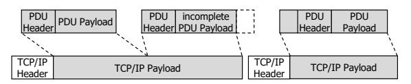
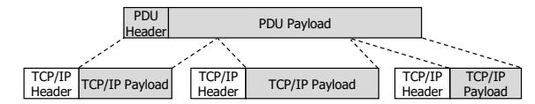
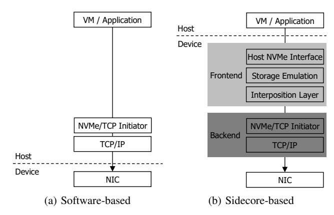

# BoostX™-NTI: Fast, Scalable and Flexible Storage Architecture with NVMe/TCP Initiator Acceleration

Hamin Jang1,2∗ , Jinha Jeong1,2∗ , Wonseok Lee1,2 , Jun Heo1 , Jongcheon Lee1 , Hyunjae Chu1,2 , Taehyun Kim1 , Youngwoo Jeong1 , Dongu Kim1 , Heetaek Jeong1 , Changsu Kim1 , Dongup Kwon1 , Jangwoo Kim1,2†

> 1MangoBoost Inc., Bellevue, WA, USA 2Seoul National University, Seoul, Republic of Korea

*Abstract*—Storage disaggregation has become a key architectural trend in modern datacenters, improving utilization and flexibility by decoupling compute and storage. Among transport options, NVMe/TCP has gained significant traction for its compatibility with commodity Ethernet infrastructure. However, as performance demands rise, sustaining line-rate throughput places excessive overhead on host CPUs. On-device sidecorebased approaches have been proposed to mitigate this burden, but their limited compute capability and memory bandwidth severely restrict scalability, resulting in constrained performance.

In this paper, we present *MangoBoost BoostX-NTI* (NTI), a fast and scalable NVMe/TCP DPU solution with FPGA-based hardware acceleration that satisfies three design goals: host CPU efficiency, line-rate performance, and practical deployability. First, NTI eliminates host CPU overhead by offloading the entire storage disaggregation stack onto a DPU card. Second, it achieves line-rate performance by executing the full I/O path directly in hardware, removing sidecore involvement and avoiding off-chip memory traversal. Finally, NTI ensures practical deployability in real-world datacenters by meeting tight form-factor and power constraints, adhering to protocol standards for interoperability, and enabling dynamic fallback and recovery between hardware and software for operational resilience. Our evaluation shows that NTI achieves up to 9.17× higher throughput than sidecorebased baselines and 16.7× higher core efficiency than software baselines, while consistently outperforming them across AI, cloud, and database workloads.

*Index Terms*—Storage disaggregation, NVMe/TCP, Data Processing Unit, FPGA, HW acceleration, HW/SW co-design

## I. INTRODUCTION

Storage disaggregation has become the standard paradigm in modern data centers [66, 67, 87, 92, 94, 95, 110], driven by the need for flexible, scalable resource provisioning. Traditional converged servers, where compute and storage are tightly coupled, fail to provide such flexibility due to server-centric resource binding that causes stranded storage capacity and scaling inefficiency. In contrast, storage disaggregation enables independent scaling, higher utilization, resiliency, and cost efficiency [76], making it widely adopted across leading cloud providers and hyperscalers [44, 68, 81, 106].

NVMe over Fabrics (NVMe-oF) [28] is a critical enabling technology for storage disaggregation in modern datacenters [62]. It provides multiple transport options, allowing operators

Fig. 1: CPU requirement for sustaining line-rate NVMe/TCP performance across network generations.

to balance performance, deployability, and hardware requirements. Among them, TCP [39] has gained wide adoption due to its reliable data transfer, compatibility with standard IP/Ethernet infrastructure, and robust operation on commodity networks across diverse conditions [3, 54, 61, 64, 67, 74, 83, 98, 108]. Therefore, NVMe/TCP [29] has gained increasing traction in commercial products and production deployments.

As its deployment continues to expand, NVMe/TCP now faces sharply increased performance requirements, driven by AI/ML training, large-scale databases, and other data-intensive workloads [75, 85, 102]. To meet these demands, softwarebased approaches have been introduced [1, 65], employing optimizations such as polling [73], zero-copy [108], and kernel bypass [97]. However, while these designs can achieve high throughput, they suffer from poor *host CPU efficiency*. On the initiator side (i.e., client side), this inefficiency hinders the execution of critical applications, degrading system performance [109]. Figure 1 illustrates the increasing severity of this problem with the SPDK NVMe/TCP initiator. It already consumes 24 cores to maintain 200 Gbps [65], and emerging 800 Gbps networks are projected to require up to 96 cores. With the network speed outpacing CPU capability [48, 96, 110], delivering line-rate1 performance will become infeasible for CPU-bound designs.

To address host CPU inefficiency, on-device sidecore-based approaches have been introduced [25, 70, 84]. For example, BlueField SNAP [9] offloads the storage disaggregation stack from the host to embedded cores. However, this solution

∗Both authors contributed equally to this research.

†Corresponding author.

1 In this paper, 'line-rate' denotes the theoretical maximum effective throughput excluding protocol-header overheads (∼90% of raw bandwidth), encompassing both unidirectional and full-duplex 2×100GbE scenarios.

suffers from limited performance due to the constrained processing capability of sidecores. In our evaluation, it achieves only 9.6% of the 200 Gbps line rate, while fully utilizing all the on-device sidecores. In addition, hardware-assisted approaches [20, 90] alleviate the overhead of CPU-intense operations (e.g., TCP processing, memory copies), but their overall performance remains still limited due to residual software bottlenecks. These limitations motivate fully accelerating performance-critical I/O in hardware logic, which is becoming essential for supporting next-generation 400/800 Gbps networks. Beyond hardware acceleration, practical deployability should also be thoroughly considered. Here, we refer to practical deployability as the ability to integrate seamlessly into various environments. Specifically, deploying a new solution should not incur severe operational or integration overhead for most datacenters, which are relying on commodity NICs and the conventional software stack [1, 75]. Achieving this requires three key aspects: form factor and power [93, 101], interoperability (i.e., the ability of a system to operate seamlessly with diverse devices and environments) [58, 81], and operational resilience (i.e., the capability to sustain correct operation despite unexpected disruptions) [45, 107].

We present MangoBoost BoostX-NTI (NTI), to the best of our knowledge, the first fully hardware-accelerated DPU solution for NVMe/TCP initiators. NTI is designed to sustain line-rate throughput while significantly reducing host CPU consumption and maintaining practical deployability in realworld datacenters. To this end, NTI first offloads the entire storage disaggregation stack onto a DPU card, eliminating the heavy CPU overhead of software-based NVMe/TCP initiators. Second, NTI accelerates performance-critical operations (i.e., NVMe/TCP I/O command processing) in specialized hardware logic to achieve line-rate performance, while handling administrative processing on on-device sidecores. It also alleviates bandwidth pressure through Virtual buffer, which removes the usage of large TCP send/receive buffers required by conventional NVMe/TCP while sustaining line-rate performance using only small on-chip buffers. Lastly, NTI provides practical deployability. To satisfy the tight form-factor and power constraints of HHHL cards, it incorporates thermal-management mechanisms and resource-efficient architectural optimizations. Interoperability is achieved through a standard NVMe interface and strict protocol compliance with unmodified host-side software stacks. In addition, NTI dynamically falls back and recovers between hardware and software during exceptional events, ensuring operational resilience. Collectively, unlike existing DPUs relying on physical hardware scaling—such as increasing core counts or memory bandwidth-NTI introduces an architectural shift that decouples I/O performance from underlying hardware specifications, providing a scalable foundation for next-generation networks.

Our evaluation shows that NTI achieves up to  $9.17\times$  higher throughput than sidecore-based baselines and  $16.7\times$  higher core efficiency than software baselines. It also outperforms across real-world workloads, including cloud, database, and MLPerfTM Storage benchmarks.

(a) Multiple PDUs packed into a TCP packet.

(b) A PDU is segmented into multiple TCP payloads.

Fig. 2: PDUs and TCP packets at different granularities.

In summary, this work makes the following contributions:

- Novel storage disaggregation acceleration: We propose a novel FPGA-assisted storage-disaggregation DPU architecture with HW/SW co-design.
- **Host CPU efficiency**: NTI eliminates host CPU overhead by offloading the entire storage disaggregation stack.
- **High performance**: NTI achieves line-rate by executing all performance-critical I/O in hardware.
- Practical deployability: NTI is deployable across diverse datacenters by meeting strict hardware requirements, interoperability, and operational resilience.
- **Insights and lessons:** We share practical lessons from building NTI, including HW/SW co-design principles, FPGA engineering methodology, and future guidance.

### II. BACKGROUND

## A. NVMe and NVMe-oF protocol

1) NVMe: NVMe [26] is a standard storage protocol designed for low-latency, parallel I/O over PCIe. Using multiple independent I/O queue interfaces, it scales across CPU cores and enables high-performance parallel I/O. The host and the NVMe device exchange commands and completions via queues in host memory. Data transfer between the host and an NVMe device uses an NVMe data-buffer address (i.e., PRP address) specified in the NVMe command, and the device's DMA engine performs direct reads and writes at that location.

2) NVMe/TCP: NVMe/TCP is a message-based protocol that employs a Protocol Data Unit (PDU) to encapsulate NVMe commands, completions, and data for transmission over TCP/IP networks. Each PDU consists of a PDU header and, optionally, PDU payload. The header contains common fields such as the PDU type and length, and may also include type-specific information such as NVMe command or completion. Importantly, the PDU header acts as a delimiter, allowing the receiver to detect PDU boundaries and extract individual units. As shown in Figure 2, this mechanism is necessary because TCP and NVMe/TCP operate at different granularities. TCP delivers a continuous byte stream segmented into packets, whereas NVMe/TCP transmits discrete PDUs. As a result, multiple PDUs may be packed into one TCP packet, or a single PDU may span across several packets. To correctly recover

Fig. 3: Existing NVMe/TCP initiator solutions.

PDUs, the receiver must perform *PDU parsing*: sequentially scanning the incoming TCP payload, reading each PDU header to determine its length, and then using that information to locate the next PDU and extract it.

3) NVMe/TCP vs. NVMe/RDMA: TCP and RDMA are the representative transport options in NVMe-oF, each exhibiting a well-known trade-off. TCP offers low TCO, excellent deployability and scalability because it reuses standard Ethernet infrastructure and operates reliably in lossy, heterogeneous networks without specialized tuning [3, 61, 74]. In contrast, RDMA delivers higher performance and lower CPU overhead by offloading the transport layer to RDMA-capable NICs. However, RDMA requires costly hardware such as RNICs and lossless Ethernet or InfiniBand switches. RDMA performance is also sensitive to packet loss and therefore demands carefully tuned lossless configurations (e.g., PFC, ECN) across all switches and NICs, increasing operational complexity [49, 59, 60, 103, 111]. Furthermore, lossless RDMA mechanisms are not fully standardized and often vary across vendors, creating potential vendor lock-in that complicates large-scale deployments [56, 72]. With NTI, we aim to retain the operational benefits of TCP while achieving RDMA-comparable performance.

# BoostX™-NTI: Fast, Scalable and Flexible Storage Architecture with NVMe/TCP Initiator Acceleration

Hamin Jang1,2∗ , Jinha Jeong1,2∗ , Wonseok Lee1,2 , Jun Heo1 , Jongcheon Lee1 , Hyunjae Chu1,2 , Taehyun Kim1 , Youngwoo Jeong1 , Dongu Kim1 , Heetaek Jeong1 , Changsu Kim1 , Dongup Kwon1 , Jangwoo Kim1,2†

> 1MangoBoost Inc., Bellevue, WA, USA 2Seoul National University, Seoul, Republic of Korea

*Abstract*—Storage disaggregation has become a key architectural trend in modern datacenters, improving utilization and flexibility by decoupling compute and storage. Among transport options, NVMe/TCP has gained significant traction for its compatibility with commodity Ethernet infrastructure. However, as performance demands rise, sustaining line-rate throughput places excessive overhead on host CPUs. On-device sidecorebased approaches have been proposed to mitigate this burden, but their limited compute capability and memory bandwidth severely restrict scalability, resulting in constrained performance.

In this paper, we present *MangoBoost BoostX-NTI* (NTI), a fast and scalable NVMe/TCP DPU solution with FPGA-based hardware acceleration that satisfies three design goals: host CPU efficiency, line-rate performance, and practical deployability. First, NTI eliminates host CPU overhead by offloading the entire storage disaggregation stack onto a DPU card. Second, it achieves line-rate performance by executing the full I/O path directly in hardware, removing sidecore involvement and avoiding off-chip memory traversal. Finally, NTI ensures practical deployability in real-world datacenters by meeting tight form-factor and power constraints, adhering to protocol standards for interoperability, and enabling dynamic fallback and recovery between hardware and software for operational resilience. Our evaluation shows that NTI achieves up to 9.17× higher throughput than sidecorebased baselines and 16.7× higher core efficiency than software baselines, while consistently outperforming them across AI, cloud, and database workloads.

*Index Terms*—Storage disaggregation, NVMe/TCP, Data Processing Unit, FPGA, HW acceleration, HW/SW co-design

## I. INTRODUCTION

Storage disaggregation has become the standard paradigm in modern data centers [66, 67, 87, 92, 94, 95, 110], driven by the need for flexible, scalable resource provisioning. Traditional converged servers, where compute and storage are tightly coupled, fail to provide such flexibility due to server-centric resource binding that causes stranded storage capacity and scaling inefficiency. In contrast, storage disaggregation enables independent scaling, higher utilization, resiliency, and cost efficiency [76], making it widely adopted across leading cloud providers and hyperscalers [44, 68, 81, 106].

NVMe over Fabrics (NVMe-oF) [28] is a critical enabling technology for storage disaggregation in modern datacenters [62]. It provides multiple transport options, allowing operators

Fig. 1: CPU requirement for sustaining line-rate NVMe/TCP performance across network generations.

to balance performance, deployability, and hardware requirements. Among them, TCP [39] has gained wide adoption due to its reliable data transfer, compatibility with standard IP/Ethernet infrastructure, and robust operation on commodity networks across diverse conditions [3, 54, 61, 64, 67, 74, 83, 98, 108]. Therefore, NVMe/TCP [29] has gained increasing traction in commercial products and production deployments.

As its deployment continues to expand, NVMe/TCP now faces sharply increased performance requirements, driven by AI/ML training, large-scale databases, and other data-intensive workloads [75, 85, 102]. To meet these demands, softwarebased approaches have been introduced [1, 65], employing optimizations such as polling [73], zero-copy [108], and kernel bypass [97]. However, while these designs can achieve high throughput, they suffer from poor *host CPU efficiency*. On the initiator side (i.e., client side), this inefficiency hinders the execution of critical applications, degrading system performance [109]. Figure 1 illustrates the increasing severity of this problem with the SPDK NVMe/TCP initiator. It already consumes 24 cores to maintain 200 Gbps [65], and emerging 800 Gbps networks are projected to require up to 96 cores. With the network speed outpacing CPU capability [48, 96, 110], delivering line-rate1 performance will become infeasible for CPU-bound designs.

To address host CPU inefficiency, on-device sidecore-based approaches have been introduced [25, 70, 84]. For example, BlueField SNAP [9] offloads the storage disaggregation stack from the host to embedded cores. However, this solution

∗Both authors contributed equally to this research.

†Corresponding author.

1 In this paper, 'line-rate' denotes the theoretical maximum effective throughput excluding protocol-header overheads (∼90% of raw bandwidth), encompassing both unidirectional and full-duplex 2×100GbE scenarios.

suffers from limited performance due to the constrained processing capability of sidecores. In our evaluation, it achieves only 9.6% of the 200 Gbps line rate, while fully utilizing all the on-device sidecores. In addition, hardware-assisted approaches [20, 90] alleviate the overhead of CPU-intense operations (e.g., TCP processing, memory copies), but their overall performance remains still limited due to residual software bottlenecks. These limitations motivate fully accelerating performance-critical I/O in hardware logic, which is becoming essential for supporting next-generation 400/800 Gbps networks. Beyond hardware acceleration, practical deployability should also be thoroughly considered. Here, we refer to practical deployability as the ability to integrate seamlessly into various environments. Specifically, deploying a new solution should not incur severe operational or integration overhead for most datacenters, which are relying on commodity NICs and the conventional software stack [1, 75]. Achieving this requires three key aspects: form factor and power [93, 101], interoperability (i.e., the ability of a system to operate seamlessly with diverse devices and environments) [58, 81], and operational resilience (i.e., the capability to sustain correct operation despite unexpected disruptions) [45, 107].

We present MangoBoost BoostX-NTI (NTI), to the best of our knowledge, the first fully hardware-accelerated DPU solution for NVMe/TCP initiators. NTI is designed to sustain line-rate throughput while significantly reducing host CPU consumption and maintaining practical deployability in realworld datacenters. To this end, NTI first offloads the entire storage disaggregation stack onto a DPU card, eliminating the heavy CPU overhead of software-based NVMe/TCP initiators. Second, NTI accelerates performance-critical operations (i.e., NVMe/TCP I/O command processing) in specialized hardware logic to achieve line-rate performance, while handling administrative processing on on-device sidecores. It also alleviates bandwidth pressure through Virtual buffer, which removes the usage of large TCP send/receive buffers required by conventional NVMe/TCP while sustaining line-rate performance using only small on-chip buffers. Lastly, NTI provides practical deployability. To satisfy the tight form-factor and power constraints of HHHL cards, it incorporates thermal-management mechanisms and resource-efficient architectural optimizations. Interoperability is achieved through a standard NVMe interface and strict protocol compliance with unmodified host-side software stacks. In addition, NTI dynamically falls back and recovers between hardware and software during exceptional events, ensuring operational resilience. Collectively, unlike existing DPUs relying on physical hardware scaling—such as increasing core counts or memory bandwidth-NTI introduces an architectural shift that decouples I/O performance from underlying hardware specifications, providing a scalable foundation for next-generation networks.

Our evaluation shows that NTI achieves up to  $9.17\times$  higher throughput than sidecore-based baselines and  $16.7\times$  higher core efficiency than software baselines. It also outperforms across real-world workloads, including cloud, database, and MLPerfTM Storage benchmarks.

(a) Multiple PDUs packed into a TCP packet.

(b) A PDU is segmented into multiple TCP payloads.

Fig. 2: PDUs and TCP packets at different granularities.

In summary, this work makes the following contributions:

- Novel storage disaggregation acceleration: We propose a novel FPGA-assisted storage-disaggregation DPU architecture with HW/SW co-design.
- **Host CPU efficiency**: NTI eliminates host CPU overhead by offloading the entire storage disaggregation stack.
- **High performance**: NTI achieves line-rate by executing all performance-critical I/O in hardware.
- Practical deployability: NTI is deployable across diverse datacenters by meeting strict hardware requirements, interoperability, and operational resilience.
- **Insights and lessons:** We share practical lessons from building NTI, including HW/SW co-design principles, FPGA engineering methodology, and future guidance.

### II. BACKGROUND

## A. NVMe and NVMe-oF protocol

1) NVMe: NVMe [26] is a standard storage protocol designed for low-latency, parallel I/O over PCIe. Using multiple independent I/O queue interfaces, it scales across CPU cores and enables high-performance parallel I/O. The host and the NVMe device exchange commands and completions via queues in host memory. Data transfer between the host and an NVMe device uses an NVMe data-buffer address (i.e., PRP address) specified in the NVMe command, and the device's DMA engine performs direct reads and writes at that location.

2) NVMe/TCP: NVMe/TCP is a message-based protocol that employs a Protocol Data Unit (PDU) to encapsulate NVMe commands, completions, and data for transmission over TCP/IP networks. Each PDU consists of a PDU header and, optionally, PDU payload. The header contains common fields such as the PDU type and length, and may also include type-specific information such as NVMe command or completion. Importantly, the PDU header acts as a delimiter, allowing the receiver to detect PDU boundaries and extract individual units. As shown in Figure 2, this mechanism is necessary because TCP and NVMe/TCP operate at different granularities. TCP delivers a continuous byte stream segmented into packets, whereas NVMe/TCP transmits discrete PDUs. As a result, multiple PDUs may be packed into one TCP packet, or a single PDU may span across several packets. To correctly recover

Fig. 3: Existing NVMe/TCP initiator solutions.

PDUs, the receiver must perform *PDU parsing*: sequentially scanning the incoming TCP payload, reading each PDU header to determine its length, and then using that information to locate the next PDU and extract it.

3) NVMe/TCP vs. NVMe/RDMA: TCP and RDMA are the representative transport options in NVMe-oF, each exhibiting a well-known trade-off. TCP offers low TCO, excellent deployability and scalability because it reuses standard Ethernet infrastructure and operates reliably in lossy, heterogeneous networks without specialized tuning [3, 61, 74]. In contrast, RDMA delivers higher performance and lower CPU overhead by offloading the transport layer to RDMA-capable NICs. However, RDMA requires costly hardware such as RNICs and lossless Ethernet or InfiniBand switches. RDMA performance is also sensitive to packet loss and therefore demands carefully tuned lossless configurations (e.g., PFC, ECN) across all switches and NICs, increasing operational complexity [49, 59, 60, 103, 111]. Furthermore, lossless RDMA mechanisms are not fully standardized and often vary across vendors, creating potential vendor lock-in that complicates large-scale deployments [56, 72]. With NTI, we aim to retain the operational benefits of TCP while achieving RDMA-comparable performance.

