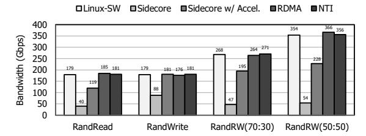
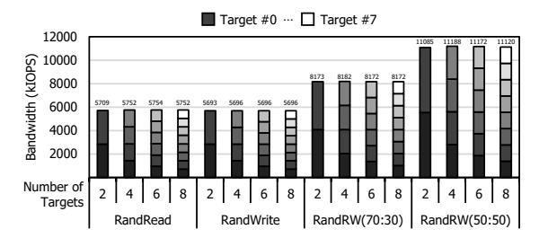

# C. Practical deployability of DPU solution

NTI resolves the three key challenges described in Section III-C for achieving practical deployability.

**Form factor and power.** NTI is deployed on a custom single-slot HHHL card equipped with a Xilinx Versal FPGA [8], operating within a 75W power envelope. Figure 5 and Table II illustrates the DPU card and the resource utilization of each IP block. Also, several architectural mechanisms address the thermal and resource constraints as follows.

First, NTI monitors the FPGA die temperature using System Monitor [5] in AMD CIPS IP [6] and track the ARM core temperature in software. When the temperature reaches 90% of each thermal threshold, NTI proactively throttles I/O processing and reports a thermal warning to the host through an NVMe admin completion. Also, the software spaces out non performance-critical transactions during short bursts of activity to reduce potential instantaneous heat accumulation.

NTI also introduces architectural optimizations to operate within the limited hardware resources of the HHHL card. For example, when the certain PRP table entry indicates that PRP list walking is required (see Section V-B), the hardware can initiate the walking process directly since the entry itself contains only the header pointer of host-resident PRP list. In addition, the design enables prefetching of the necessary NVMe data-buffer addresses using this header pointer, thereby eliminating the need to store the full PRP list on chip. Furthermore, entries in the PDU metadata table for completed commands are invalidated in real time, reducing residency and preventing consumption of scarce on-chip resources.

Interoperability. To ensure interoperability, NTI provides a standard NVMe interface to the host with strict protocol compliance. Specifically, the hardware maintains essential protocol-related state (e.g., number of processed I/O commands, ANA state of each namespace), while the software handles host-requested protocol specific operations (e.g., I/O counting, Asynchronous Event Reporting, and ANA state transitions) in parallel with ongoing I/O processing. Also, NTI removes the kernel-based NHI driver, enabling it to run across diverse environments without any software modification.

This level of interoperability is validated by successfully passing all mandatory NVMe tests from the University of New Hampshire InterOperability Laboratory (UNH-IOL) [86], an industry-standard certification body for NVMe and NVMe-oF, and NTI is listed in the NVMe Integrator's List alongside major SSD vendors [21, 23, 34–36].

Beyond specification compliance, we also validated operational robustness across a wide range of system environments, such as servers from multiple vendors (e.g., Supermicro [17], HPE [16], Dell [12]), operating systems (e.g., Linux, Windows), hypervisors (e.g., VMWare ESXi [40], QEMU-KVM [22, 33]), and NVMe/TCP targets (e.g., Kernel NVMe/TCP target, SPDK, Purestorage [32], Netapp [24]).

**Operational resilience.** To address the operational-resilience issues, we propose *Dynamic handover* which implements dynamic and seamless HW-SW cooperation. Dynamic handover mechanism enables flexible fallback and recovery between hardware and software with two key capabilities.

First, it supports bidirectional handover. At any point during I/O processing, if control-plane operations are required, the software can temporarily take over the processing from the hardware. This handover is coordinated via a memory-mapped hardware registers that exposes only minimal metadata for software to resume processing (e.g., NVMe doorbells, TCP connection status). Software reads this context, performs the necessary control-plane operation (e.g., resetting a faulty

Fig. 8: FIO results with 4KiB I/O.

Fig. 9: FIO results with 128KiB I/O.

queue), and then instructs the hardware to resume by writing back to a control register. Second, handover operates at a fine-grained granularity, at the level of individual NVMe or NVMe/TCP queues. This ensures that handover on one queue does not affect the processing of others. For instance, if an error occurs on a specific NVMe/TCP queue (e.g., receiving PDU with an invalid header), the hardware resets only the context associated with that queue. When instructed by software, it resumes operation and retransmits the uncompleted NVMe commands that belong to the failed queue. Thus, importantly, I/O on other NVMe/TCP queues proceeds without termination, rendering such operations seamless from the host's perspective. The practical feasibility of Dynamic handover is demonstrated in Section VI-B1.

Whether and when to invoke Dynamic handover is determined by dedicated *Fault handler* IPs, which are strategically placed at critical boundaries: inside the NVMe/TCP engine, and at its interfaces to the NHI and TOE. They serve three primary functions. First, each Fault handler monitors relevant hardware states and error-related registers, reporting detected errors (e.g., those in Section III-C) to the software. Second, it exposes an interface that allows the software to initiate handover when it detects an error, such as *NVMe/TCP keep alive timeout* triggered when periodic responses from the target are not received on time. Third, it handles recoverable errors in hardware without software intervention. For example, if the handler between the NVMe/TCP Engine and the NHI detects an invalid field in an NVMe I/O command, it immediately returns a completion reporting the appropriate error.

#### VI. EVALUATION

In this section, we evaluate NTI against various NVMe/TCP solutions. Section VI-A presents micro-benchmark results, validating NTI's design goals. Section VI-B demonstrates its impact on real-world workloads. The experimental setup is

Fig. 10: Core efficiency with 4KiB random I/O (× markers indicate the number of cores used).

Fig. 11: Core efficiency with 128KiB sequential I/O (× markers indicate the number of cores used).

as follows. The initiator server is a Supermicro SYS-421GE-TNRT3 with dual Intel® Xeon® Gold 6438N CPUs (64 cores) and 512 GB DDR4 memory. The target server is a Supermicro ASG-1115S-NE316R with an AMD EPYCTM 9454P (48 cores), 384 GB DDR5 memory, and 16 Samsung PM1743 SSDs. We installed Ubuntu 22.04.5 LTS with kernel 5.15.0-119-generic on both servers. Networking uses either a NTI or a Mellanox ConnectX-6 Ex NICs, connected via a Dell PowerSwitch Z9432F-ON switch (32× 400 GbE).

#### A. Microbenchmark

To evaluate NTI, we used FIO to benchmark performance, fault tolerance and scalability. Section VI-A1 shows that NTI delivers line-rate throughput with exceptional host efficiency. Section VI-A2 shows the comparison of NTI with NVMe /RDMA. Section VI-A3 evaluates its behavior under failure scenarios, demonstrating operational resilience. Section VI-A4 shows that NTI maintains scalable performance in large-scale deployment scenarios.

1) Performance & efficiency: Figure 8 and Figure 9 show the throughput of the kernel NVMe/TCP initiator [1] (Linux-SW), a sidecore-based approach [9], a sidecore-with-acceleration approach [20], and NTI. With a 4KiB block size (Figure 8), NTI achieves line-rate read and write throughput, matching the kernel NVMe/TCP initiator while significantly outperforming Sidecore and Sidecore with acceleration. In the 50:50 read/write workload, NTI sustains line-rate performance, delivering a 9.17× and 2.81× gain over Sidecore and Sidecore with acceleration, respectively. With a 128KiB block size (Figure 9), NTI maintains consistent line-rate bandwidth across all workloads, reaching 356 Gbps—the maximum achievable throughput considering Ethernet and TCP/IP header overhead—aggregate bandwidth across both directions in the

Fig. 12: Seamless operation during network updates.

50:50 read/write case, up to 6.59× and 1.56× higher than Sidecore and Sidecore with acceleration, respectively.

Figure 10 and Figure 11 show the per-core throughput and corresponding core utilization for each solution. We compare NTI with the kernel NVMe/TCP initiator, as they are the only solutions achieving near line-rate performance. NTI demonstrates significant gains in host CPU efficiency, defined as throughput per host core. With a 4KiB block size (Figure 10), NTI improves host CPU efficiency by 3.01× (read), 1.98× (write), 2.11× (70:30 read/write), and 1.66× (50:50 read/write). With a 128KiB block size (Figure 11), the improvements are 16.7× (read), 4.38× (write), 8.76× (70:30 read/write), and 5.35× (50:50 read/write). These results highlight that NTI not only sustains line-rate throughput but also greatly reduces host CPU burden and enhances scalability.

*2) Comparison with NVMe/RDMA:* We compare NTI with the kernel NVMe/RDMA initiator (RoCEv2) to assess its competitiveness against specialized high-performance transports. As shown in Figure 8 and Figure 9, NTI demonstrates comparable or even superior throughput to NVMe/RDMA, achieving up to 1.24× higher performance in 4KiB I/O and maintaining nearly identical performance for 128KiB I/O. Furthermore, as shown in Figure 10 and Figure 11, by offloading the storage-disaggregation stack as well as the transport stack into hardware, NTI achieves better host CPU savings. Specifically, NTI improves core efficiency by 2.00×, 1.96×, 1.65×, and 1.24× for 4KiB I/O, and 1.28×, 1.16×, 1.32×, and 0.82× for 128KiB I/O compared to NVMe/RDMA. These results demonstrate that NTI not only matches the throughput of RDMA but often exceeds its efficiency.

From a TCO perspective, NTI exhibits deployment-level trade-offs relative to NVMe/RDMA in terms of infrastructure cost, operational complexity, and performance. In particular, conventional NVMe/RDMA deployments involve additional fabric requirements and operator-managed tuning for bring-

Fig. 13: Seamless operation during the thermal management.

up, validation, and troubleshooting [49, 56, 59, 60, 72, 103, 111], whereas NTI preserves the broad deployability and cost profile of commodity Ethernet infrastructure. While NTI remains higher in transport latency than NVMe/RDMA, the gap is less pronounced in end-to-end storage I/O, where overall latency is determined by the full storage access path rather than by transport alone [66, 77]. Overall, NVMe/RDMA remains attractive for the lowest-latency environments, whereas NTI provides a practical design point for operators seeking linerate performance, a 75W board-level power envelope, and the deployment simplicity of commodity Ethernet infrastructure.

*3) Practical deployability:* To validate resilience to network topology changes, we evaluate NTI using NVMe path control features: Multipath [99] and ANA [27]. Multipath improves availability and throughput by using multiple network paths, configured as active/active (all active paths used concurrently) or active/passive (passive paths remain standby for failover). ANA further marks path states (e.g., optimized, inaccessible) to guide host path selection. Our testbed connects one initiator and one target through two 100 GbE links. To assess recovery behavior, we ran FIO while modifying the network topology.

Figure 12 illustrates NTI 's bandwidth in three scenarios. In the active/active case (Figure 12a), the bandwidth initially reaches 200 Gbps, but drops on path failure as I/O through the failed path is lost (1). Upon failure detection, NTI retransmits lost commands over the surviving path at 100 Gbps (2), and bandwidth is restored to 200 Gbps after reconnection. In the active/passive case (Figure 12b), traffic initially reaches 100 Gbps, but drops when the active path fails (3), after which the standby path restores bandwidth. With ANA (Figure 12c), the behavior resembles active-active, but the ANA state transition is detected within microseconds (4), sustaining throughput on the surviving path without stall.

Beyond network resilience, we evaluate the thermal management of NTI during thermal issues. We ran FIO while artificially restricting airflow by modulating fan speeds to induce thermal stress and trigger the thermal-management mechanisms. Figure 13 illustrates the empirical thermal delta relative to the initial state and the corresponding throughput during this event. As shown, the temperature increase exhibits a brief plateau at the 90% threshold before declining. Meanwhile, the throughput shows transient performance degradation as NTI proactively throttles I/O processing. Once the temperature returns to a safe operational range, I/O processing automatically resumes its full theoretical maximum effective throughput without requiring host-side intervention.

Fig. 14: Multi-target stress test.

*4) Large-scale deployment:* In large-scale environments representative of modern storage disaggregation, initiators must flexibly attach to and aggregate distributed resources from a vast pool of target servers over the network. To clearly demonstrate the efficacy of NTI in these scenarios, we conducted a stress test to prove whether NTI can support many target servers without encountering internal bottlenecks. This 1-to-N topology specifically targets the scalability of our hardware-accelerated mechanisms, such as connection interleaving and PDU parsing across multiple network sessions.

Figure 14 illustrates the performance of NTI during this large-scale deployment. We ran FIO while increasing the number of the attached NVMe/TCP targets. Even as the number increases, NTI consistently saturates the theoretical maximum effective throughput. This demonstrates that its internal logic incurs no performance degradation under stressful scenarios involving significant connection interleaving, reordered packet arrival, and PDU misalignment. Although the experiment represents the maximum-scale evaluation achievable in our lab, we anticipate this scalability to hold in larger production through NTI 's strategic adoption of standard TCP mechanisms (e.g., Cubic, SACK) engineered for massive scale. Building upon the validated TOE framework from [47], NTI utilizes a communication layer proven in real-world environments, decoupling hardware I/O processing from network complexity as the number of connections increases.

# C. Practical deployability of DPU solution

NTI resolves the three key challenges described in Section III-C for achieving practical deployability.

**Form factor and power.** NTI is deployed on a custom single-slot HHHL card equipped with a Xilinx Versal FPGA [8], operating within a 75W power envelope. Figure 5 and Table II illustrates the DPU card and the resource utilization of each IP block. Also, several architectural mechanisms address the thermal and resource constraints as follows.

First, NTI monitors the FPGA die temperature using System Monitor [5] in AMD CIPS IP [6] and track the ARM core temperature in software. When the temperature reaches 90% of each thermal threshold, NTI proactively throttles I/O processing and reports a thermal warning to the host through an NVMe admin completion. Also, the software spaces out non performance-critical transactions during short bursts of activity to reduce potential instantaneous heat accumulation.

NTI also introduces architectural optimizations to operate within the limited hardware resources of the HHHL card. For example, when the certain PRP table entry indicates that PRP list walking is required (see Section V-B), the hardware can initiate the walking process directly since the entry itself contains only the header pointer of host-resident PRP list. In addition, the design enables prefetching of the necessary NVMe data-buffer addresses using this header pointer, thereby eliminating the need to store the full PRP list on chip. Furthermore, entries in the PDU metadata table for completed commands are invalidated in real time, reducing residency and preventing consumption of scarce on-chip resources.

Interoperability. To ensure interoperability, NTI provides a standard NVMe interface to the host with strict protocol compliance. Specifically, the hardware maintains essential protocol-related state (e.g., number of processed I/O commands, ANA state of each namespace), while the software handles host-requested protocol specific operations (e.g., I/O counting, Asynchronous Event Reporting, and ANA state transitions) in parallel with ongoing I/O processing. Also, NTI removes the kernel-based NHI driver, enabling it to run across diverse environments without any software modification.

This level of interoperability is validated by successfully passing all mandatory NVMe tests from the University of New Hampshire InterOperability Laboratory (UNH-IOL) [86], an industry-standard certification body for NVMe and NVMe-oF, and NTI is listed in the NVMe Integrator's List alongside major SSD vendors [21, 23, 34–36].

Beyond specification compliance, we also validated operational robustness across a wide range of system environments, such as servers from multiple vendors (e.g., Supermicro [17], HPE [16], Dell [12]), operating systems (e.g., Linux, Windows), hypervisors (e.g., VMWare ESXi [40], QEMU-KVM [22, 33]), and NVMe/TCP targets (e.g., Kernel NVMe/TCP target, SPDK, Purestorage [32], Netapp [24]).

**Operational resilience.** To address the operational-resilience issues, we propose *Dynamic handover* which implements dynamic and seamless HW-SW cooperation. Dynamic handover mechanism enables flexible fallback and recovery between hardware and software with two key capabilities.

First, it supports bidirectional handover. At any point during I/O processing, if control-plane operations are required, the software can temporarily take over the processing from the hardware. This handover is coordinated via a memory-mapped hardware registers that exposes only minimal metadata for software to resume processing (e.g., NVMe doorbells, TCP connection status). Software reads this context, performs the necessary control-plane operation (e.g., resetting a faulty

Fig. 8: FIO results with 4KiB I/O.

Fig. 9: FIO results with 128KiB I/O.

queue), and then instructs the hardware to resume by writing back to a control register. Second, handover operates at a fine-grained granularity, at the level of individual NVMe or NVMe/TCP queues. This ensures that handover on one queue does not affect the processing of others. For instance, if an error occurs on a specific NVMe/TCP queue (e.g., receiving PDU with an invalid header), the hardware resets only the context associated with that queue. When instructed by software, it resumes operation and retransmits the uncompleted NVMe commands that belong to the failed queue. Thus, importantly, I/O on other NVMe/TCP queues proceeds without termination, rendering such operations seamless from the host's perspective. The practical feasibility of Dynamic handover is demonstrated in Section VI-B1.

Whether and when to invoke Dynamic handover is determined by dedicated *Fault handler* IPs, which are strategically placed at critical boundaries: inside the NVMe/TCP engine, and at its interfaces to the NHI and TOE. They serve three primary functions. First, each Fault handler monitors relevant hardware states and error-related registers, reporting detected errors (e.g., those in Section III-C) to the software. Second, it exposes an interface that allows the software to initiate handover when it detects an error, such as *NVMe/TCP keep alive timeout* triggered when periodic responses from the target are not received on time. Third, it handles recoverable errors in hardware without software intervention. For example, if the handler between the NVMe/TCP Engine and the NHI detects an invalid field in an NVMe I/O command, it immediately returns a completion reporting the appropriate error.

#### VI. EVALUATION

In this section, we evaluate NTI against various NVMe/TCP solutions. Section VI-A presents micro-benchmark results, validating NTI's design goals. Section VI-B demonstrates its impact on real-world workloads. The experimental setup is

Fig. 10: Core efficiency with 4KiB random I/O (× markers indicate the number of cores used).

Fig. 11: Core efficiency with 128KiB sequential I/O (× markers indicate the number of cores used).

as follows. The initiator server is a Supermicro SYS-421GE-TNRT3 with dual Intel® Xeon® Gold 6438N CPUs (64 cores) and 512 GB DDR4 memory. The target server is a Supermicro ASG-1115S-NE316R with an AMD EPYCTM 9454P (48 cores), 384 GB DDR5 memory, and 16 Samsung PM1743 SSDs. We installed Ubuntu 22.04.5 LTS with kernel 5.15.0-119-generic on both servers. Networking uses either a NTI or a Mellanox ConnectX-6 Ex NICs, connected via a Dell PowerSwitch Z9432F-ON switch (32× 400 GbE).

#### A. Microbenchmark

To evaluate NTI, we used FIO to benchmark performance, fault tolerance and scalability. Section VI-A1 shows that NTI delivers line-rate throughput with exceptional host efficiency. Section VI-A2 shows the comparison of NTI with NVMe /RDMA. Section VI-A3 evaluates its behavior under failure scenarios, demonstrating operational resilience. Section VI-A4 shows that NTI maintains scalable performance in large-scale deployment scenarios.

1) Performance & efficiency: Figure 8 and Figure 9 show the throughput of the kernel NVMe/TCP initiator [1] (Linux-SW), a sidecore-based approach [9], a sidecore-with-acceleration approach [20], and NTI. With a 4KiB block size (Figure 8), NTI achieves line-rate read and write throughput, matching the kernel NVMe/TCP initiator while significantly outperforming Sidecore and Sidecore with acceleration. In the 50:50 read/write workload, NTI sustains line-rate performance, delivering a 9.17× and 2.81× gain over Sidecore and Sidecore with acceleration, respectively. With a 128KiB block size (Figure 9), NTI maintains consistent line-rate bandwidth across all workloads, reaching 356 Gbps—the maximum achievable throughput considering Ethernet and TCP/IP header overhead—aggregate bandwidth across both directions in the

Fig. 12: Seamless operation during network updates.

50:50 read/write case, up to 6.59× and 1.56× higher than Sidecore and Sidecore with acceleration, respectively.

Figure 10 and Figure 11 show the per-core throughput and corresponding core utilization for each solution. We compare NTI with the kernel NVMe/TCP initiator, as they are the only solutions achieving near line-rate performance. NTI demonstrates significant gains in host CPU efficiency, defined as throughput per host core. With a 4KiB block size (Figure 10), NTI improves host CPU efficiency by 3.01× (read), 1.98× (write), 2.11× (70:30 read/write), and 1.66× (50:50 read/write). With a 128KiB block size (Figure 11), the improvements are 16.7× (read), 4.38× (write), 8.76× (70:30 read/write), and 5.35× (50:50 read/write). These results highlight that NTI not only sustains line-rate throughput but also greatly reduces host CPU burden and enhances scalability.

*2) Comparison with NVMe/RDMA:* We compare NTI with the kernel NVMe/RDMA initiator (RoCEv2) to assess its competitiveness against specialized high-performance transports. As shown in Figure 8 and Figure 9, NTI demonstrates comparable or even superior throughput to NVMe/RDMA, achieving up to 1.24× higher performance in 4KiB I/O and maintaining nearly identical performance for 128KiB I/O. Furthermore, as shown in Figure 10 and Figure 11, by offloading the storage-disaggregation stack as well as the transport stack into hardware, NTI achieves better host CPU savings. Specifically, NTI improves core efficiency by 2.00×, 1.96×, 1.65×, and 1.24× for 4KiB I/O, and 1.28×, 1.16×, 1.32×, and 0.82× for 128KiB I/O compared to NVMe/RDMA. These results demonstrate that NTI not only matches the throughput of RDMA but often exceeds its efficiency.

From a TCO perspective, NTI exhibits deployment-level trade-offs relative to NVMe/RDMA in terms of infrastructure cost, operational complexity, and performance. In particular, conventional NVMe/RDMA deployments involve additional fabric requirements and operator-managed tuning for bring-

Fig. 13: Seamless operation during the thermal management.

up, validation, and troubleshooting [49, 56, 59, 60, 72, 103, 111], whereas NTI preserves the broad deployability and cost profile of commodity Ethernet infrastructure. While NTI remains higher in transport latency than NVMe/RDMA, the gap is less pronounced in end-to-end storage I/O, where overall latency is determined by the full storage access path rather than by transport alone [66, 77]. Overall, NVMe/RDMA remains attractive for the lowest-latency environments, whereas NTI provides a practical design point for operators seeking linerate performance, a 75W board-level power envelope, and the deployment simplicity of commodity Ethernet infrastructure.

*3) Practical deployability:* To validate resilience to network topology changes, we evaluate NTI using NVMe path control features: Multipath [99] and ANA [27]. Multipath improves availability and throughput by using multiple network paths, configured as active/active (all active paths used concurrently) or active/passive (passive paths remain standby for failover). ANA further marks path states (e.g., optimized, inaccessible) to guide host path selection. Our testbed connects one initiator and one target through two 100 GbE links. To assess recovery behavior, we ran FIO while modifying the network topology.

Figure 12 illustrates NTI 's bandwidth in three scenarios. In the active/active case (Figure 12a), the bandwidth initially reaches 200 Gbps, but drops on path failure as I/O through the failed path is lost (1). Upon failure detection, NTI retransmits lost commands over the surviving path at 100 Gbps (2), and bandwidth is restored to 200 Gbps after reconnection. In the active/passive case (Figure 12b), traffic initially reaches 100 Gbps, but drops when the active path fails (3), after which the standby path restores bandwidth. With ANA (Figure 12c), the behavior resembles active-active, but the ANA state transition is detected within microseconds (4), sustaining throughput on the surviving path without stall.

Beyond network resilience, we evaluate the thermal management of NTI during thermal issues. We ran FIO while artificially restricting airflow by modulating fan speeds to induce thermal stress and trigger the thermal-management mechanisms. Figure 13 illustrates the empirical thermal delta relative to the initial state and the corresponding throughput during this event. As shown, the temperature increase exhibits a brief plateau at the 90% threshold before declining. Meanwhile, the throughput shows transient performance degradation as NTI proactively throttles I/O processing. Once the temperature returns to a safe operational range, I/O processing automatically resumes its full theoretical maximum effective throughput without requiring host-side intervention.

Fig. 14: Multi-target stress test.

*4) Large-scale deployment:* In large-scale environments representative of modern storage disaggregation, initiators must flexibly attach to and aggregate distributed resources from a vast pool of target servers over the network. To clearly demonstrate the efficacy of NTI in these scenarios, we conducted a stress test to prove whether NTI can support many target servers without encountering internal bottlenecks. This 1-to-N topology specifically targets the scalability of our hardware-accelerated mechanisms, such as connection interleaving and PDU parsing across multiple network sessions.

Figure 14 illustrates the performance of NTI during this large-scale deployment. We ran FIO while increasing the number of the attached NVMe/TCP targets. Even as the number increases, NTI consistently saturates the theoretical maximum effective throughput. This demonstrates that its internal logic incurs no performance degradation under stressful scenarios involving significant connection interleaving, reordered packet arrival, and PDU misalignment. Although the experiment represents the maximum-scale evaluation achievable in our lab, we anticipate this scalability to hold in larger production through NTI 's strategic adoption of standard TCP mechanisms (e.g., Cubic, SACK) engineered for massive scale. Building upon the validated TOE framework from [47], NTI utilizes a communication layer proven in real-world environments, decoupling hardware I/O processing from network complexity as the number of connections increases.

