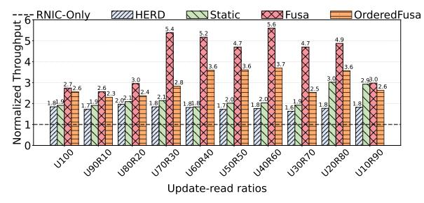
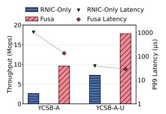
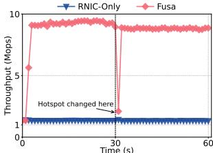
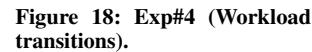
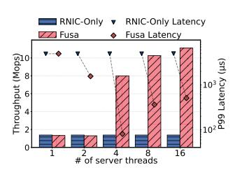
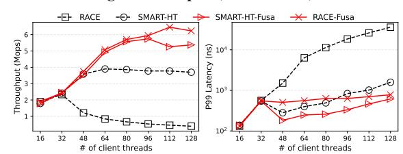

# *A. Experimental Setup*

Testbed: We conduct experiments on a five-node cluster. Each machine is equipped with two 2.4 GHz Intel Xeon Silver 4314 processors (32 cores in total), 256 GB of DRAM, and a 100 Gbps Mellanox ConnectX-6 InfiniBand RNIC, with all RNICs connected to a 100 Gbps Mellanox SN2700 switch. The nodes run Ubuntu 20.04 LTS with Linux kernel 5.4.0 and Mellanox OpenFabrics Enterprise Distribution (MLNX OFED) v24.10-2.1.8. To reduce RNIC page-translation overheads, we use 2 MB huge pages. One node is configured as the server, while the remaining four act as clients. For Fusa, the server node launches four RPC service threads, each pinned to a dedicated physical CPU core using explicit core affinity.

Workloads: Table I summarizes the characteristics of general workloads. We use the YCSB benchmark [14] with a Zipfian distribution (θ = 0.99 by default) to construct microbenchmarks that mimic production-like access patterns [11]. YCSB supplies two mixed read–update workloads: YCSB-A, which issues 50% updates (update-intensive), and YCSB-B, which issues 5% updates (read-dominant). To broaden the evaluation space, we further include additional mixed workloads with varying update ('U') and read ('R') ratios. We use the keys generated by YCSB as the addresses accessed to emulate different contention levels at the RNIC. We employ RDMA CAS for updates and RDMA READ for read operations.

Comparison methods: We compare Fusa and OrderedFusa with the following three representative methods.

• RNIC-Only: it executes all RDMA Atomic on the RNIC, relying entirely on the locking table to ensure atomicity.

- HERD: it simply onloads all the RDMA Atomic to the server-side CPU using HERD RPC.
- Static: it is a static dispatch strategy that randomly dispatches half of the requests to the CPU, and leaves another half to be processed by the RNIC.

## *B. Overall Performance*

We first conduct a comparative evaluation of Fusa under diverse workloads and execution modes.

Exp#1 (General workloads): Figure 14 and Figure 15 illustrates the access throughputs and latencies of different approaches, respectively. We make the following observations.

First, Fusa achieves significantly higher throughput and lower latency compared to RNIC-Only across four workloads. Specifically, Fusa outperforms the RNIC-Only with throughput improvements of 3.1×, 3.0×, 2.6×, and 2.0×, respectively, while reducing average latency by 72.3%, 71.8%, 68.9%, and 59.4%, respectively. For the read-dominant workload (i.e., YCSB-B), Fusa achieves 97.5% of the throughput of RNIC-Only (Figure 14(e)). This slight performance drop is attributed to the smallest ratio of update requests (i.e., 5%, see Table I), which introduces the lightest contention degree and does not require atomic onloading.

Second, for the *YCSB-A* workload, HERD achieves a 0.9× throughput gain and reduces average latency by 44.0% by onloading all atomic operations to the CPU, thereby avoiding RNIC locking contention. Static further improves throughput by 40.0% and reduces average latency by 22.05% compared to HERD, as it evenly dispatches half of the requests to the CPU and the other half to the RNIC. Fusa delivers an additional 0.7× throughput improvement and reduces average latency by 34.8% by dynamically identifying contention at the group level and adaptively dispatching requests to maximize RNIC utilization (§IV-B).

Third, OrderedFusa delivers competitive performance while guaranteeing ordering. Compared to Fusa, it incurs a modest performance penalty: under YCSB-A, OrderedFusa achieves a throughput of 5.1 Mops/s, about 32% lower than Fusa. Nevertheless, it still delivers 2.5 × and 2.3 × higher throughput than RNIC-Only under YCSB-A and U20R80, respectively. These results indicate that OrderedFusa provides substantial gains over RNIC-Only while maintaining strict ordering guarantees.

Exp#2 (Varying update ratios): We vary the update ratio from 10% (i.e., U10R90) to 100% (i.e., U100) to evaluate the performance of Fusa under different contention degrees. Figure 16 shows that Fusa consistently delivers largest throughput across the entire spectrum of update ratios.

Across different update ratios, HERD, Static, Fusa, and OrderedFusa deliver average throughput improvements of 0.8×, 1.2×, 2.8× and 2.0× over the RNIC-Only, respectively. Even under the U10R90 workload (with 10% of updates), Fusa attains 43.9 Mops/s, achieving a 2.0× speedup over the RNIC-Only (14.8 Mops/s), implying that even a small fraction of update requests can induce substantial contention among PUs in the RNIC. By selectively onloading requests

Figure 15: Exp#1 (General workloads: average latency).

Figure 16: Exp#2 (Varying update ratios). The throughput is normalized to RNIC-Only under various update ratios.

from contended groups to CPU, Fusa mitigates the lockingtable contention and enables the RNIC to operate at its full potential.

### C. Robustness under Dynamic Workloads

We evaluate the robustness of Fusa by considering two settings: (i) *mixed workloads* (to mimic the scenario where multiple microservices share a resource), where multiple workloads run *concurrently*, and (ii) *workload transitions* (to reflect change of the workload patterns over time), where different workloads are executed *sequentially*.

**Exp#3 (Mixed workloads):** We configure two clients to run YCSB-A (an update-intensive workload with skewed distribution), while the other two clients execute another update-intensive workload with uniform distribution at the same time (denoted as YCSB-A-U).

Figure 17 shows that for YCSB-A, Fusa improves throughput by  $2.6\times$  and reduces P99 latency by 87.0%, respectively. These gains arise from Fusa's ability to onload atomic requests to the CPU when handling skewed access patterns, thereby avoiding contentions in the RNIC. Besides, Fusa does not onload atomic requests for YCSB-A-U because its uniform updates produce contention-free groups. Even so, it still achieves a  $1.4\times$  throughput improvement and reduces P99

latency by 26.4%, as Fusa mitigates contention caused by YCSB-A in the RNIC, freeing server-side RNIC PUs to process the requests in YCSB-A-U more efficiently.

**Exp#4 (Workload transitions):** We also evaluate the performance of Fusa in the presence of workload transitions. We generate two YCSB-A workloads with different hotspot distributions. We first run one workload, and at 30 s we switch to the other workload.

Figure 18 shows that Fusa significantly outperforms the RNIC-Only, achieving an average throughput improvement of  $5.5\times$  over the entire execution period. Furthermore, Fusa demonstrates strong adaptability to hotspot transitions. Because it dynamically adjusts its dispatch strategy in a timely manner ( $\S$ IV-B), Fusa can promptly identify and adapt to newly emerging contention-prone groups. When the workload transitions at the 31st second, Fusa 's throughput experiences only a transient decline and fully recovers by the 32nd second, as it quickly detects the new hotspot and updates its dispatch strategy accordingly.

In addition, we break down the time of each step in IV-C. Even under the scenario of fully switching hotspots, Fusa requires only 48  $\mu$ s to reach consensus on a new strategy. Specifically, Fusa-Server spends about 10  $\mu$ s to push the updated strategy, Fusa-Agent takes another 10  $\mu$ s to receive and apply it locally, and Fusa-Agent Wait\_sync completes in 28  $\mu$ s. This indicates that the time to change dispatch strategy in Fusa is negligible.

#### D. Sensitive Analysis

We also evaluate the sensitivity of Fusa by changing the number of threads (Exp#5), varying the access skewness (Exp#6), and enabling PCIe Atomic (Exp#7).

**Exp#5** (Number of threads): To investigate the impact of server thread count, we vary the number of threads from 1 to 16. Figure 19 shows that Fusa delivers throughput comparable to RNIC-Only with low process parallelism (e.g., with at most two

Figure 17: Exp#3 (Mixed workloads).

Figure 19: Exp#5 (Number of threads).

Figure 20: Exp#6 (Workload skewness).

threads), but achieves a  $4.8 \times -7.0 \times$  throughput improvement under high process parallelism (e.g., with at least four threads).

In addition, Fusa reduces latency by 87.4% with two threads, whereas the improvement is negligible with a single thread. This is because the number of requests of a group exceeds the per-thread processing capacity, preventing effective onloading when only one thread is available. With two threads, onloading becomes feasible and substantially lowers latency relative to RNIC-Only. However, this also introduces server-side queuing, which limits throughput despite the latency reduction.

Exp#6 (Workload Skewness): We further evaluate the impact of workload skewness on throughput by varying the Zipfian parameter  $(\theta)$  from 0 (i.e., uniform distribution) to 0.99 (the default value in YCSB). Figure 20 shows that Fusa delivers performance comparable to RNIC-Only under the uniform workload, but provides substantial improvements as the skewness increases (e.g., a 4.8× speedup at  $\theta = 0.99$ ). The reason is that Fusa refrains from onloading requests from contention-free groups under the uniform access, thus preserving high throughput; it selectively onloads hotspot requests under the skewed workloads to alleviate contention. Moreover, we quantify the overhead introduced by Fusa on the critical path. The invocation latency of ibv\_post\_send increases from 123 ns (in RNIC-ONLY) to 141 ns (in Fusa). This additional overhead (18 ns) is negligible compared to the typical RDMA RTT (approximately  $2 \mu s$ ), confirming that Fusa introduces minimal performance impact even for uncontended

**Exp#7 (PCIe Atomic):** Since PCIe Atomic is disabled by default to avoid throughput degradation (§III), we enable it in this experiment to assess its impact. Figure 21 shows the performance of RNIC-Only and Fusa with PCIe Atomic enabled (denoted by RNIC-Only-PA and Fusa-PA) across different workloads under both Zipfian and uniform distributions.

Figure 21: Exp#7 (PCIe Atomic).

Figure 22: Exp#8 (Building RACE atop Fusa).

We observe that Fusa-PA consistently improves throughput and reduces latency across various workloads. For example, under a YCSB-A Zipfian workload (Figure 21(a)), Fusa increases throughput by 36.4% and reduces P99 latency by 92.0%. Furthermore, Fusa-PA also delivers higher throughput and lower latency under uniform workloads. This improvement can be attributed to two factors: (i) uniform access patterns induce lower contention, and (ii) Fusa-PA enables request onloading to the CPU even under low contention once PCIe Atomic is activated (§IV-F).

### E. RDMA-based System atop Fusa

We finally study how existing RDMA-based systems can benefit from Fusa. We choose a hash index (RACE [82]) and in-memory transaction processing system (DrTM [69]).

**Exp#8** (Building RACE atop Fusa): RACE [82] is a lock-free hash index that operates exclusively using one-sided RDMA primitives. It stores pointers in the index structure, enabling atomic IDU operations (insertion, deletion, and update) via RDMA\_CAS. This design ensures fully lock-free execution. However, the performance of RACE is hindered by frequent RDMA CAS failures.

To address this issue, we incorporate the retry-avoidance mechanism proposed in SMART-HT [59]. Figure 22 presents the performance of RACE and SMART-HT, along with their variants built on Fusa (i.e., RACE-Fusa and SMART-HT-Fusa). We observe that RACE-Fusa consistently outperforms all other designs, achieving up to  $14.7 \times$  and  $0.7 \times$  throughput improvements, and reducing P99 latency by up to 97.8% and 50.1% across different numbers of threads compared to RACE and SMART-HT, respectively. Although SMART-HT-Fusa achieves similar throughput with RACE-Fusa when the thread count is smaller than 96 (Figure 22(a)), its performance stabilizes with the increase of thread count. This is because its retry-avoidance mechanism places most coroutines into a sleep state to avoid conflicts.

Figure 23: Exp#9 (Building DrTM atop Fusa).

Exp#9 (Building DrTM atop Fusa): DrTM [69] is an in-memory transaction processing system that utilize RDMA\_CAS for atomic coordination among writers. We evaluate the lock performance of DrTM running on Fusa by replaying lock traces generated with [23]. The traces consist of three representative workloads: write-50%/read-50% (W50R50), write-5%/read-95% (W5R95), and read-100% (R100). These traces follow a Zipfian distribution, thereby emulating skewed contention patterns. As shown in Figure 23, running DrTM atop Fusa (i.e., DrTM-Fusa) achieves up to 7.1× throughput improvement and reduces P99 latency by up to 89.0% across the three workloads.

## VII. RELATED WORK

RDMA offloading: RDMA offloading has attracted attention due to its kernel-bypass capability [18], [23], [46], [47], [50], [63], [65], [77], [82]. Numerous studies have leveraged one-sided RDMA primitives to improve performance of RNICs and high-bandwidth networks [16] [46] [47] [50] [63] [65] [69] [81] [82]. RACE [82] and SepHash [50] employ RDMA CAS for consistency in remote hash indexes; Sherman [65] locks B+-tree nodes with RDMA CAS, while SMART [47] supports lock-free operations in radix trees. PolarDB [9] uses RDMA\_CAS and RDMA\_FAA for remote locking and timestamping. Different from above studies, Fusa addresses congestion-induced performance degradation in RDMA Atomic and complements existing RDMA systems. Onloading from RNIC to software: While one-sided RDMA reduces remote CPU usage, NICs often face memory and processing limitations under concurrent operations. HERD [33] completes RDMA Atomic using software RPC. FaSST [30] implements distributed transactions over two-sided RPCs with doorbell batching to reduce computation overhead. Flor [39] separates data-path and control-path functions, preserving hardware efficiency while onloading control logic to programmable units (e.g., NPUs [29] and DPUs [57]). TeRM [72] addresses exception handling in RDMA-SSD systems by migrating rare-case processing to host CPUs. SABRes [15] extends RNIC primitives via a lightweight software–hardware co-design. AccDirect [43] onloads NIC/SNIC-prepared metadata and QEs to coordinate enqueue credits without host CPU involvement. As a comparison, Fusa selectively onloads only contended atomic requests, preserving RNIC efficiency while relieving bottlenecks through software execution.

#### VIII. CONCLUSION

We propose Fusa, a hardware-software-collaborated framework that systematically improves scaling of RDMA Atomic.

Fusa selectively onloads atomic operations based on dynamic contention profiling. Fusa also ensures correctness through a consensus mechanism during strategy transitions. Extensive experiments with microbenchmarks and RDMA-based systems show the efficiency, scalability, and transparency of Fusa.

#### IX. ACKNOWLEDGEMENTS

We sincerely thank the reviewers' thorough and insightful comments on improving our manuscript. This work was supported by the National Key R&D Program of China (Grant No. 2024YFB4504400), the Major Research Plan of the National Natural Science Foundation of China (Grant No. 92582116), the National Natural Science Foundation of China (Grant No. U22B2023 and No. 624B2120) ant the Xiaomi Young Scholars.

#### REFERENCES

- J. Ajanovic, "Pci express 3.0 overview." in proc. of IEEE HOT CHIPS, 2009, pp. 1–61.
- [2] AMD, "Amd atomic operations on the completer request interface," https://rocm.docs.amd.com/en/docs-6.3.0/conceptual/More-about-how-ROCm-uses-PCIe-Atomics.html, 2025.
- [3] I. T. Association, "Infiniband™ architecture specification," https://www.infinibandta.org/ibta-specification/, 2018.
- [4] B. Atikoglu, Y. Xu, E. Frachtenberg, S. Jiang, and M. Paleczny, "Workload analysis of a large-scale key-value store," in *Proc. of ACM SIGMETRICS*, 2012, pp. 53–64.
- [5] A. Baran, J. Nelson-Slivon, L. Tseng, and R. Palmieri, "Alock: Asymmetric lock primitive for rdma systems," in *Proc. of ACM SPAA*, 2024, pp. 15–26.
- [6] C. Binnig, A. Crotty, A. Galakatos, T. Kraska, and E. Zamanian, "The end of slow networks: it's time for a redesign," in *Proc. of the VLDB Endowment*, 2016.
- [7] M. Cai, J. Shen, and B. Ye, "Ethane: An asymmetric file system for disaggregated persistent memory," in *Proc. of USENIX ATC*, 2024, pp. 191–207.
- [8] I. Calciu, M. T. Imran, I. Puddu, S. Kashyap, H. A. Maruf, O. Mutlu, and A. Kolli, "Rethinking software runtimes for disaggregated memory," in *Proc. of ACM ASPLOS*, 2021, pp. 79–92.
- [9] W. Cao, Y. Zhang, X. Yang, F. Li, S. Wang, Q. Hu, X. Cheng, Z. Chen, Z. Liu, J. Fang, B. Wang, Y. Wang, H. Sun, Z. Yang, Z. Cheng, S. Chen, J. Wu, W. Hu, J. Zhao, Y. Gao, S. Cai, Y. Zhang, and J. Tong, "Polardb serverless: A cloud native database for disaggregated data centers," in *Proc. of ACM SIGMOD*, 2021, pp. 2477–2489. [Online]. Available: https://doi.org/10.1145/3448016.3457560
- [10] B. Cassell, T. Szepesi, B. Wong, T. Brecht, J. Ma, and X. Liu, "Nessie: A decoupled, client-driven key-value store using rdma," *IEEE Transactions* on *Parallel and Distributed Systems (TPDS)*, vol. 28, no. 12, pp. 3537– 3552, 2017.
- [11] J. Chen, L. Chen, S. Wang, G. Zhu, Y. Sun, H. Liu, and F. Li, "Hotring: A hotspot-aware in-memory key-value store," in *Proc. of USENIX FAST*, 2020, pp. 239–252.
- [12] Y. Chen, X. Wei, J. Shi, R. Chen, and H. Chen, "Fast and general distributed transactions using rdma and htm," in *Proc. of ACM EuroSys*, 2016, pp. 1–17.
- [13] Y. Chen, Y. Lu, and J. Shu, "Scalable rdma rpc on reliable connection with efficient resource sharing," in *Proc. of ACM EuroSys*, 2019, pp. 1–14.
- [14] B. F. Cooper, A. Silberstein, E. Tam, R. Ramakrishnan, and R. Sears, "Benchmarking cloud serving systems with ycsb," in *Proc. of ACM SOCC*, 2010, pp. 143–154.
- [15] A. Daglis, D. Ustiugov, S. Novaković, E. Bugnion, B. Falsafi, and B. Grot, "Sabres: Atomic object reads for in-memory rack-scale computing," in *Proc. of IEEE/ACM MICRO*. IEEE, 2016, pp. 1–13.
- [16] A. Dragojević, D. Narayanan, M. Castro, and O. Hodson, "Farm: Fast remote memory," in *Proc. of USENIX NSDI*, 2014, pp. 401–414.

- [17] A. Dragojevic, D. Narayanan, E. B. Nightingale, M. Renzelmann, ´ A. Shamis, A. Badam, and M. Castro, "No compromises: distributed transactions with consistency, availability, and performance," in *Proc. of ACM SOSP*, 2015, pp. 54–70.
- [18] J. Du, F. Wang, D. Feng, C. Gan, Y. Cao, X. Zou, and F. Li, "Fast onesided rdma-based state machine replication for disaggregated memory," *ACM Transactions on Architecture and Code Optimization*, vol. 20, no. 2, pp. 1–25, 2023.
- [19] A. Farshin, A. Roozbeh, G. Q. Maguire Jr, and D. Kostic, "Make the ´ most out of last level cache in intel processors," in *Proc. of ACM EuroSys*, 2019, pp. 1–17.
- [20] ——, "Reexamining direct cache access to optimize i/o intensive applications for multi-hundred-gigabit networks," in *Proc. of USENIX ATC*, 2020, pp. 673–689.
- [21] M. Ferdman, A. Adileh, O. Kocberber, S. Volos, M. Alisafaee, D. Jevdjic, C. Kaynak, A. D. Popescu, A. Ailamaki, and B. Falsafi, "Clearing the clouds: a study of emerging scale-out workloads on modern hardware," *Acm sigplan notices*, vol. 47, no. 4, pp. 37–48, 2012.
- [22] K. Fraser, "Practical lock-freedom," University of Cambridge, Computer Laboratory, Tech. Rep., 2004.
- [23] J. Gao, Q. Wang, and J. Shu, "ShiftLock: Mitigate one-sided RDMA lock contention via handover," in *Proc. of USENIX FAST*. Santa Clara, CA: USENIX Association, Feb. 2025, pp. 355–372. [Online]. Available: https://www.usenix.org/conference/fast25/presentation/gao
- [24] C. Guo, H. Wu, Z. Deng, G. Soni, J. Ye, J. Padhye, and M. Lipshteyn, "Rdma over commodity ethernet at scale," in *Proc. of ACM SIGCOMM*, 2016, pp. 202–215.
- [25] T. Harter, D. Borthakur, S. Dong, A. Aiyer, L. Tang, A. C. Arpaci-Dusseau, and R. H. Arpaci-Dusseau, "Analysis of hdfs under hbase: A facebook messages case study," in *Proc. of USENIX FAST*, 2014, pp. 199–212.
- [26] Intel, "Atomic operations in pci express," https://patents.google.com/pat ent/US9535838B2.
- [27] ——, "Processor families that support atomicops," https://community. intel.com/t5/Server-Products/If-Intel-Xeon-Processor-Scalable-Familysupport-PCIe-AtomicOps/td-p/587536, 2018.
- [28] ——, "Intel® data direct i/o technology," https://www.intel.com/content/ www/us/en/io/data-direct-i-o-technology.html, 2022.
- [29] ——, "Intel infrastructure processing unit (ipu)," https://www.intel.com/ content/www/us/en/products/details/network-io/ipu.html, 2023.
- [30] A. Kalia, M. Kaminsky, and D. Andersen, "Fasst: Fast, scalable and simple distributed transactions with two-sided(rdma) datagram rpcs," in *Proc. of USENIX OSDI*, 2016, pp. 185–201.
- [31] ——, "Datacenter rpcs can be general and fast," in *Proc. of USENIX NSDI*, 2019, pp. 1–16.
- [32] A. Kalia, M. Kaminsky, and D. G. Andersen, "Using rdma efficiently for key-value services," in *Proc. of ACM SIGCOMM*, 2014, pp. 295–306.
- [33] ——, "Design guidelines for high performance RDMA systems," in *Proc. of USENIX ATC*, 2016, pp. 437–450.
- [34] D. Kim, A. Memaripour, A. Badam, Y. Zhu, H. H. Liu, J. Padhye, S. Raindel, S. Swanson, V. Sekar, and S. Seshan, "Hyperloop: groupbased nic-offloading to accelerate replicated transactions in multi-tenant storage systems," in *Proc. of ACM SIGCOMM*, 2018, pp. 297–312.
- [35] A. Kokolis, A. Psistakis, B. Reidys, J. Huang, and J. Torrellas, "Hades: Hardware-assisted distributed transactions in the age of fast networks and smartnics," in *Proc. of ACM/IEEE ISCA*. IEEE, 2024, pp. 785–800.
- [36] X. Kong, J. Chen, W. Bai, Y. Xu, M. Elhaddad, S. Raindel, J. Padhye, A. R. Lebeck, and D. Zhuo, "Understanding rdma microarchitecture resources for performance isolation," in *Proc. of USENIX NSDI*, 2023, pp. 31–48.
- [37] L. Lamport, "The temporal logic of actions," *ACM Transactions on Programming Languages and Systems (TOPLAS)*, vol. 16, no. 3, pp. 872–923, 1994.
- [38] J. Li, J. Nelson, E. Michael, X. Jin, and D. R. Ports, "Pegasus: Tolerating skewed workloads in distributed storage with in-network coherence directories," in *Proc. of USENIX OSDI*, 2020, pp. 387–406.
- [39] Q. Li, Y. Gao, X. Wang, H. Qiu, Y. Le, D. Liu, Q. Xiang, F. Feng, P. Zhang, B. Li, J. Dong, L. Tang, H. H. Liu, S. Liu, W. Li, R. Miao, Y. Wu, Z. Wu, C. Han, L. Yan, Z. Cao, Z. Wu, C. Tian, G. Chen, D. Cai, J. Wu, J. Zhu, J. Wu, and J. Shu, "Flor: An open high performance RDMA framework over heterogeneous rnics," in *Proc. of USENIX OSDI*, 2023, pp. 931–948.
- [40] S. Li, H. Lim, V. W. Lee, J. H. Ahn, A. Kalia, M. Kaminsky, D. G. Andersen, O. Seongil, S. Lee, and P. Dubey, "Architecting to achieve a

- billion requests per second throughput on a single key-value store server platform," in *Proc. of ACM/IEEE ISCA*, 2015, pp. 476–488.
- [41] Linux, "rdma-core," https://github.com/linux-rdma/rdma-core.
- [42] ——, "Linux manual page-rdma post send," https://man7.org/linux/manpages/man3/rdma post send.3.html, 2021.
- [43] J. Lou, S. Vanavasam, Y. Yuan, R. Wang, and N. S. Kim, "Dynamic load balancer in intel xeon scalable processor: Performance analyses, enhancements, and guidelines," in *Proc. of ACM/IEEE ISCA*, 2025, pp. 664–678.
- [44] H. Lu, H. Liu, Y. Zhang, Z. Duan, X. Liao, H. Jin, and Y. Zhang, "Fast distributed transactions for rdma-based disaggregated memory," in *Proc. of USENIX ATC*, 2025, pp. 943–958.
- [45] Y. Lu, J. Shu, Y. Chen, and T. Li, "Octopus: an rdma-enabled distributed persistent memory file system," in *Proc. of USENIX ATC*, 2017, pp. 773–785.
- [46] X. Luo, J. Shen, P. Zuo, X. Wang, M. R. Lyu, and Y. Zhou, "Chime: A cache-efficient and high-performance hybrid index on disaggregated memory," in *Proc. of ACM SOSP*, 2024, pp. 110–126.
- [47] X. Luo, P. Zuo, J. Shen, J. Gu, X. Wang, M. R. Lyu, and Y. Zhou, "Smart: A high-performance adaptive radix tree for disaggregated memory," in *Proc. of USENIX OSDI*, 2023, pp. 553–571.
- [48] Mellanox, "Enhanced atomic operations," https://docs.nvidia.com/netw orking/display/ofedv502180/advanced+transport#AdvancedTransport-EnhancedAtomicOperations, 2021.
- [49] ——, "Nvidia connectx-7 400g ethernet," https://www.nvidia.com/con tent/dam/en-zz/Solutions/networking/ethernet-adapters/connectx-7 datasheet-Final.pdf, 2024.
- [50] X. Min, K. Lu, P. Liu, J. Wan, C. Xie, D. Wang, T. Yao, and H. Wu, "Sephash: A write-optimized hash index on disaggregated memory via separate segment structure," in *Proc. of the VLDB Endowment*, 2024.
- [51] C. Mitchell, Y. Geng, and J. Li, "Using one-sidedrdma reads to build a fast,cpu-efficientkey-value store," in *Proc. of USENIX ATC*, 2013, pp. 103–114.
- [52] J. Nelson, B. Holt, B. Myers, P. Briggs, L. Ceze, S. Kahan, and M. Oskin, "Latency-tolerant software distributed shared memory," in *Proc. of USENIX ATC*, 2015, pp. 291–305.
- [53] S. Novakovic, A. Daglis, E. Bugnion, B. Falsafi, and B. Grot, "The case for rackout: Scalable data serving using rack-scale systems," in *Proc. of ACM SOCC*, 2016, pp. 182–195.
- [54] S. Novakovic, Y. Shan, A. Kolli, M. Cui, Y. Zhang, H. Eran, B. Pismenny, L. Liss, M. Wei, D. Tsafrir, and M. K. Aguilera, "Storm: a fast transactional dataplane for remote data structures," in *Proc. of ACM SYSTOR*, 2019, pp. 97–108.
- [55] Nvidia, "Rdma aware networks programming user manual," https://docs .nvidia.com/rdma-aware-networks-programming-user-manual-1-7.pdf.
- [56] ——, "Rdma programming guide," https://docs.nvidia.com/doca/archive /doca-v2.2.0/rdma-programming-guide/index.html, 2023.
- [57] ——, "Nvidia bluefield networking platform," https://www.nvidia.com/enus/networking/products/data-processing-unit/, 2025.
- [58] W. Reda, M. Canini, D. Kostic, and S. Peter, "Rdma is turing complete, ´ we just did not know it yet!" in *Proc. of USENIX NSDI*, 2022, pp. 71–85.
- [59] F. Ren, M. Zhang, K. Chen, H. Xia, Z. Chen, and Y. Wu, "Scaling up memory disaggregated applications with smart," in *Proc. of ACM ASPLOS*, 2024, pp. 351–367.
- [60] A. Ryser, A. Lerner, A. Forencich, and P. Cudre-Mauroux, "D-rdma: Bringing zero-copy rdma to database systems." in *Proc. of CIDR*, 2022.
- [61] V. Seshadri, T. Mullins, A. Boroumand, O. Mutlu, P. B. Gibbons, M. A. Kozuch, and T. C. Mowry, "Gather-scatter dram: In-dram address translation to improve the spatial locality of non-unit strided accesses," in *Proc. of IEEE/ACM MICRO*, 2015, pp. 267–280.
- [62] S.-Y. Tsai, Y. Shan, and Y. Zhang, "Disaggregating persistent memory and controlling them remotely: An exploration of passive disaggregated key-value stores," in *Proc. of USENIX ATC*, 2020, pp. 33–48.
- [63] J. Wang, Q. Wang, Y. Zhang, and J. Shu, "Deft: A scalable tree index for disaggregated memory," in *Proc. of ACM EuroSys*, 2025, pp. 886–901.
- [64] J. Wang, S. Zheng, Z. Lin, Y. Chen, and L. Huang, "Zebra: an efficient, rdma-enabled distributed persistent memory file system," in *Proc. of DASFAA*. Springer, 2022, pp. 341–349.
- [65] Q. Wang, Y. Lu, and J. Shu, "Sherman: A write-optimized distributed b+ tree index on disaggregated memory," in *Proc. of ACM SIGMOD*, 2022, pp. 1033–1048.
- [66] R. Wang, J. Wang, P. Kadam, M. T. Ozsu, and W. G. Aref, "dlsm: An ¨ lsm-based index for memory disaggregation," in *Proc. of IEEE ICDE*. IEEE, 2023, pp. 2835–2849.

- [67] Z. Wang, L. Luo, Q. Ning, C. Zeng, W. Li, X. Wan, P. Xie, T. Feng, K. Cheng, X. Geng, T. Wang, W. Ling, K. Huo, P. An, K. Ji, S. Zhang, B. Xu, R. Feng, T. Ding, K. Chen, and C. Guo, "Srnic: A scalable architecture for rdma nics," in *Proc. of USENIX NSDI*, 2023, pp. 1–14.
- [68] X. Wei, Z. Dong, R. Chen, and H. Chen, "Deconstructing rdma-enabled distributed transactions: Hybrid is better!" in *Proc. of USENIX OSDI*, 2018, pp. 233–251.
- [69] X. Wei, J. Shi, Y. Chen, R. Chen, and H. Chen, "Fast in-memory transaction processing using rdma and htm," in *Proc. of ACM SOSP*, 2015, pp. 87–104.
- [70] X. Xin, Y. Guo, Y. Zhang, and J. Yang, "Sam: accelerating strided memory accesses," in *Proc. of IEEE/ACM MICRO*, 2021, pp. 324–336.
- [71] J. Yang, J. Izraelevitz, and S. Swanson, "Orion: A distributed file system for non-volatile main memory and rdma-capable networks," in *Proc. of USENIX FAST*, 2019, pp. 221–234.
- [72] Z. Yang, Q. Wang, X. Liao, Y. Lu, K. Huang, and J. Shu, "Term: Extending rdma-attached memory with ssd," in *Proc. of USENIX FAST*, 2024, pp. 1–16.
- [73] Q. Yu, C. Guo, J. Zhuang, V. Thakkar, J. Wang, and Z. Cao, "Caaslsm: compaction-as-a-service for lsm-based key-value stores in storage disaggregated infrastructure," in *Proc. of ACM SIGMOD*. ACM New York, NY, USA, 2024, pp. 1–28.
- [74] E. Zamanian, X. Yu, M. Stonebraker, and T. Kraska, "Rethinking database high availability with rdma networks," in *Proc. of the VLDB Endowment*, 2019.
- [75] S. Zehnder, "A scalable distributed lock manager using one-sided rdma atomic operations," 2015.
- [76] H. Zhang, K. Cheng, R. Chen, and H. Chen, "Fast and scalable innetwork lock management using lock fission," in *Proc. of USENIX OSDI*, 2024, pp. 251–268.
- [77] M. Zhang, Y. Hua, P. Zuo, and L. Liu, "Ford: Fast one-sided rdma-based distributed transactions for disaggregated persistent memory," in *Proc. of USENIX FAST*, 2022, pp. 51–68.
- [78] H. Zhao, J. Li, W. Lu, Q. Zhang, W. Yang, J. Zhong, M. Zhang, H. Li, X. Du, and A. Pan, "Rcbench: an rdma-enabled transaction framework for analyzing concurrency control algorithms," *The VLDB Journal (VLDBJ)*, vol. 33, no. 2, pp. 543–567, 2024.
- [79] S. Zheng, J. Wang, D. Xue, J. Shu, and L. Huang, "Hydra: A decentralized file system for persistent memory and rdma networks," *IEEE Transactions on Parallel and Distributed Systems (TPDS)*, vol. 33, no. 12, pp. 4192– 4206, 2022.
- [80] T. Ziegler, J. Nelson-Slivon, V. Leis, and C. Binnig, "Design guidelines for correct, efficient, and scalable synchronization using one-sided rdma," *Proc. of ACM SIGMOD*, vol. 1, no. 2, pp. 1–26, 2023.
- [81] T. Ziegler, S. Tumkur Vani, C. Binnig, R. Fonseca, and T. Kraska, "Designing distributed tree-based index structures for fast rdma-capable networks," in *Proc. of ACM SIGMOD*, 2019, pp. 741–758.
- [82] P. Zuo, J. Sun, L. Yang, S. Zhang, and Y. Hua, "One-sided rdma-conscious extendible hashing for disaggregated memory," in *Proc. of USENIX ATC*, 2021, pp. 15–29.# *A. Experimental Setup*

Testbed: We conduct experiments on a five-node cluster. Each machine is equipped with two 2.4 GHz Intel Xeon Silver 4314 processors (32 cores in total), 256 GB of DRAM, and a 100 Gbps Mellanox ConnectX-6 InfiniBand RNIC, with all RNICs connected to a 100 Gbps Mellanox SN2700 switch. The nodes run Ubuntu 20.04 LTS with Linux kernel 5.4.0 and Mellanox OpenFabrics Enterprise Distribution (MLNX OFED) v24.10-2.1.8. To reduce RNIC page-translation overheads, we use 2 MB huge pages. One node is configured as the server, while the remaining four act as clients. For Fusa, the server node launches four RPC service threads, each pinned to a dedicated physical CPU core using explicit core affinity.

Workloads: Table I summarizes the characteristics of general workloads. We use the YCSB benchmark [14] with a Zipfian distribution (θ = 0.99 by default) to construct microbenchmarks that mimic production-like access patterns [11]. YCSB supplies two mixed read–update workloads: YCSB-A, which issues 50% updates (update-intensive), and YCSB-B, which issues 5% updates (read-dominant). To broaden the evaluation space, we further include additional mixed workloads with varying update ('U') and read ('R') ratios. We use the keys generated by YCSB as the addresses accessed to emulate different contention levels at the RNIC. We employ RDMA CAS for updates and RDMA READ for read operations.

Comparison methods: We compare Fusa and OrderedFusa with the following three representative methods.

• RNIC-Only: it executes all RDMA Atomic on the RNIC, relying entirely on the locking table to ensure atomicity.

- HERD: it simply onloads all the RDMA Atomic to the server-side CPU using HERD RPC.
- Static: it is a static dispatch strategy that randomly dispatches half of the requests to the CPU, and leaves another half to be processed by the RNIC.

## *B. Overall Performance*

We first conduct a comparative evaluation of Fusa under diverse workloads and execution modes.

Exp#1 (General workloads): Figure 14 and Figure 15 illustrates the access throughputs and latencies of different approaches, respectively. We make the following observations.

First, Fusa achieves significantly higher throughput and lower latency compared to RNIC-Only across four workloads. Specifically, Fusa outperforms the RNIC-Only with throughput improvements of 3.1×, 3.0×, 2.6×, and 2.0×, respectively, while reducing average latency by 72.3%, 71.8%, 68.9%, and 59.4%, respectively. For the read-dominant workload (i.e., YCSB-B), Fusa achieves 97.5% of the throughput of RNIC-Only (Figure 14(e)). This slight performance drop is attributed to the smallest ratio of update requests (i.e., 5%, see Table I), which introduces the lightest contention degree and does not require atomic onloading.

Second, for the *YCSB-A* workload, HERD achieves a 0.9× throughput gain and reduces average latency by 44.0% by onloading all atomic operations to the CPU, thereby avoiding RNIC locking contention. Static further improves throughput by 40.0% and reduces average latency by 22.05% compared to HERD, as it evenly dispatches half of the requests to the CPU and the other half to the RNIC. Fusa delivers an additional 0.7× throughput improvement and reduces average latency by 34.8% by dynamically identifying contention at the group level and adaptively dispatching requests to maximize RNIC utilization (§IV-B).

Third, OrderedFusa delivers competitive performance while guaranteeing ordering. Compared to Fusa, it incurs a modest performance penalty: under YCSB-A, OrderedFusa achieves a throughput of 5.1 Mops/s, about 32% lower than Fusa. Nevertheless, it still delivers 2.5 × and 2.3 × higher throughput than RNIC-Only under YCSB-A and U20R80, respectively. These results indicate that OrderedFusa provides substantial gains over RNIC-Only while maintaining strict ordering guarantees.

Exp#2 (Varying update ratios): We vary the update ratio from 10% (i.e., U10R90) to 100% (i.e., U100) to evaluate the performance of Fusa under different contention degrees. Figure 16 shows that Fusa consistently delivers largest throughput across the entire spectrum of update ratios.

Across different update ratios, HERD, Static, Fusa, and OrderedFusa deliver average throughput improvements of 0.8×, 1.2×, 2.8× and 2.0× over the RNIC-Only, respectively. Even under the U10R90 workload (with 10% of updates), Fusa attains 43.9 Mops/s, achieving a 2.0× speedup over the RNIC-Only (14.8 Mops/s), implying that even a small fraction of update requests can induce substantial contention among PUs in the RNIC. By selectively onloading requests

Figure 15: Exp#1 (General workloads: average latency).

Figure 16: Exp#2 (Varying update ratios). The throughput is normalized to RNIC-Only under various update ratios.

from contended groups to CPU, Fusa mitigates the lockingtable contention and enables the RNIC to operate at its full potential.

### C. Robustness under Dynamic Workloads

We evaluate the robustness of Fusa by considering two settings: (i) *mixed workloads* (to mimic the scenario where multiple microservices share a resource), where multiple workloads run *concurrently*, and (ii) *workload transitions* (to reflect change of the workload patterns over time), where different workloads are executed *sequentially*.

**Exp#3 (Mixed workloads):** We configure two clients to run YCSB-A (an update-intensive workload with skewed distribution), while the other two clients execute another update-intensive workload with uniform distribution at the same time (denoted as YCSB-A-U).

Figure 17 shows that for YCSB-A, Fusa improves throughput by  $2.6\times$  and reduces P99 latency by 87.0%, respectively. These gains arise from Fusa's ability to onload atomic requests to the CPU when handling skewed access patterns, thereby avoiding contentions in the RNIC. Besides, Fusa does not onload atomic requests for YCSB-A-U because its uniform updates produce contention-free groups. Even so, it still achieves a  $1.4\times$  throughput improvement and reduces P99

latency by 26.4%, as Fusa mitigates contention caused by YCSB-A in the RNIC, freeing server-side RNIC PUs to process the requests in YCSB-A-U more efficiently.

**Exp#4 (Workload transitions):** We also evaluate the performance of Fusa in the presence of workload transitions. We generate two YCSB-A workloads with different hotspot distributions. We first run one workload, and at 30 s we switch to the other workload.

Figure 18 shows that Fusa significantly outperforms the RNIC-Only, achieving an average throughput improvement of  $5.5\times$  over the entire execution period. Furthermore, Fusa demonstrates strong adaptability to hotspot transitions. Because it dynamically adjusts its dispatch strategy in a timely manner ( $\S$ IV-B), Fusa can promptly identify and adapt to newly emerging contention-prone groups. When the workload transitions at the 31st second, Fusa 's throughput experiences only a transient decline and fully recovers by the 32nd second, as it quickly detects the new hotspot and updates its dispatch strategy accordingly.

In addition, we break down the time of each step in IV-C. Even under the scenario of fully switching hotspots, Fusa requires only 48  $\mu$ s to reach consensus on a new strategy. Specifically, Fusa-Server spends about 10  $\mu$ s to push the updated strategy, Fusa-Agent takes another 10  $\mu$ s to receive and apply it locally, and Fusa-Agent Wait\_sync completes in 28  $\mu$ s. This indicates that the time to change dispatch strategy in Fusa is negligible.

#### D. Sensitive Analysis

We also evaluate the sensitivity of Fusa by changing the number of threads (Exp#5), varying the access skewness (Exp#6), and enabling PCIe Atomic (Exp#7).

**Exp#5** (Number of threads): To investigate the impact of server thread count, we vary the number of threads from 1 to 16. Figure 19 shows that Fusa delivers throughput comparable to RNIC-Only with low process parallelism (e.g., with at most two

Figure 17: Exp#3 (Mixed workloads).

Figure 19: Exp#5 (Number of threads).

Figure 20: Exp#6 (Workload skewness).

threads), but achieves a  $4.8 \times -7.0 \times$  throughput improvement under high process parallelism (e.g., with at least four threads).

In addition, Fusa reduces latency by 87.4% with two threads, whereas the improvement is negligible with a single thread. This is because the number of requests of a group exceeds the per-thread processing capacity, preventing effective onloading when only one thread is available. With two threads, onloading becomes feasible and substantially lowers latency relative to RNIC-Only. However, this also introduces server-side queuing, which limits throughput despite the latency reduction.

Exp#6 (Workload Skewness): We further evaluate the impact of workload skewness on throughput by varying the Zipfian parameter  $(\theta)$  from 0 (i.e., uniform distribution) to 0.99 (the default value in YCSB). Figure 20 shows that Fusa delivers performance comparable to RNIC-Only under the uniform workload, but provides substantial improvements as the skewness increases (e.g., a 4.8× speedup at  $\theta = 0.99$ ). The reason is that Fusa refrains from onloading requests from contention-free groups under the uniform access, thus preserving high throughput; it selectively onloads hotspot requests under the skewed workloads to alleviate contention. Moreover, we quantify the overhead introduced by Fusa on the critical path. The invocation latency of ibv\_post\_send increases from 123 ns (in RNIC-ONLY) to 141 ns (in Fusa). This additional overhead (18 ns) is negligible compared to the typical RDMA RTT (approximately  $2 \mu s$ ), confirming that Fusa introduces minimal performance impact even for uncontended

**Exp#7 (PCIe Atomic):** Since PCIe Atomic is disabled by default to avoid throughput degradation (§III), we enable it in this experiment to assess its impact. Figure 21 shows the performance of RNIC-Only and Fusa with PCIe Atomic enabled (denoted by RNIC-Only-PA and Fusa-PA) across different workloads under both Zipfian and uniform distributions.

Figure 21: Exp#7 (PCIe Atomic).

Figure 22: Exp#8 (Building RACE atop Fusa).

We observe that Fusa-PA consistently improves throughput and reduces latency across various workloads. For example, under a YCSB-A Zipfian workload (Figure 21(a)), Fusa increases throughput by 36.4% and reduces P99 latency by 92.0%. Furthermore, Fusa-PA also delivers higher throughput and lower latency under uniform workloads. This improvement can be attributed to two factors: (i) uniform access patterns induce lower contention, and (ii) Fusa-PA enables request onloading to the CPU even under low contention once PCIe Atomic is activated (§IV-F).

### E. RDMA-based System atop Fusa

We finally study how existing RDMA-based systems can benefit from Fusa. We choose a hash index (RACE [82]) and in-memory transaction processing system (DrTM [69]).

**Exp#8** (Building RACE atop Fusa): RACE [82] is a lock-free hash index that operates exclusively using one-sided RDMA primitives. It stores pointers in the index structure, enabling atomic IDU operations (insertion, deletion, and update) via RDMA\_CAS. This design ensures fully lock-free execution. However, the performance of RACE is hindered by frequent RDMA CAS failures.

To address this issue, we incorporate the retry-avoidance mechanism proposed in SMART-HT [59]. Figure 22 presents the performance of RACE and SMART-HT, along with their variants built on Fusa (i.e., RACE-Fusa and SMART-HT-Fusa). We observe that RACE-Fusa consistently outperforms all other designs, achieving up to  $14.7 \times$  and  $0.7 \times$  throughput improvements, and reducing P99 latency by up to 97.8% and 50.1% across different numbers of threads compared to RACE and SMART-HT, respectively. Although SMART-HT-Fusa achieves similar throughput with RACE-Fusa when the thread count is smaller than 96 (Figure 22(a)), its performance stabilizes with the increase of thread count. This is because its retry-avoidance mechanism places most coroutines into a sleep state to avoid conflicts.

Figure 23: Exp#9 (Building DrTM atop Fusa).

Exp#9 (Building DrTM atop Fusa): DrTM [69] is an in-memory transaction processing system that utilize RDMA\_CAS for atomic coordination among writers. We evaluate the lock performance of DrTM running on Fusa by replaying lock traces generated with [23]. The traces consist of three representative workloads: write-50%/read-50% (W50R50), write-5%/read-95% (W5R95), and read-100% (R100). These traces follow a Zipfian distribution, thereby emulating skewed contention patterns. As shown in Figure 23, running DrTM atop Fusa (i.e., DrTM-Fusa) achieves up to 7.1× throughput improvement and reduces P99 latency by up to 89.0% across the three workloads.

## VII. RELATED WORK

RDMA offloading: RDMA offloading has attracted attention due to its kernel-bypass capability [18], [23], [46], [47], [50], [63], [65], [77], [82]. Numerous studies have leveraged one-sided RDMA primitives to improve performance of RNICs and high-bandwidth networks [16] [46] [47] [50] [63] [65] [69] [81] [82]. RACE [82] and SepHash [50] employ RDMA CAS for consistency in remote hash indexes; Sherman [65] locks B+-tree nodes with RDMA CAS, while SMART [47] supports lock-free operations in radix trees. PolarDB [9] uses RDMA\_CAS and RDMA\_FAA for remote locking and timestamping. Different from above studies, Fusa addresses congestion-induced performance degradation in RDMA Atomic and complements existing RDMA systems. Onloading from RNIC to software: While one-sided RDMA reduces remote CPU usage, NICs often face memory and processing limitations under concurrent operations. HERD [33] completes RDMA Atomic using software RPC. FaSST [30] implements distributed transactions over two-sided RPCs with doorbell batching to reduce computation overhead. Flor [39] separates data-path and control-path functions, preserving hardware efficiency while onloading control logic to programmable units (e.g., NPUs [29] and DPUs [57]). TeRM [72] addresses exception handling in RDMA-SSD systems by migrating rare-case processing to host CPUs. SABRes [15] extends RNIC primitives via a lightweight software–hardware co-design. AccDirect [43] onloads NIC/SNIC-prepared metadata and QEs to coordinate enqueue credits without host CPU involvement. As a comparison, Fusa selectively onloads only contended atomic requests, preserving RNIC efficiency while relieving bottlenecks through software execution.

#### VIII. CONCLUSION

We propose Fusa, a hardware-software-collaborated framework that systematically improves scaling of RDMA Atomic.

Fusa selectively onloads atomic operations based on dynamic contention profiling. Fusa also ensures correctness through a consensus mechanism during strategy transitions. Extensive experiments with microbenchmarks and RDMA-based systems show the efficiency, scalability, and transparency of Fusa.

#### IX. ACKNOWLEDGEMENTS

We sincerely thank the reviewers' thorough and insightful comments on improving our manuscript. This work was supported by the National Key R&D Program of China (Grant No. 2024YFB4504400), the Major Research Plan of the National Natural Science Foundation of China (Grant No. 92582116), the National Natural Science Foundation of China (Grant No. U22B2023 and No. 624B2120) ant the Xiaomi Young Scholars.

#### REFERENCES

- J. Ajanovic, "Pci express 3.0 overview." in proc. of IEEE HOT CHIPS, 2009, pp. 1–61.
- [2] AMD, "Amd atomic operations on the completer request interface," https://rocm.docs.amd.com/en/docs-6.3.0/conceptual/More-about-how-ROCm-uses-PCIe-Atomics.html, 2025.
- [3] I. T. Association, "Infiniband™ architecture specification," https://www.infinibandta.org/ibta-specification/, 2018.
- [4] B. Atikoglu, Y. Xu, E. Frachtenberg, S. Jiang, and M. Paleczny, "Workload analysis of a large-scale key-value store," in *Proc. of ACM SIGMETRICS*, 2012, pp. 53–64.
- [5] A. Baran, J. Nelson-Slivon, L. Tseng, and R. Palmieri, "Alock: Asymmetric lock primitive for rdma systems," in *Proc. of ACM SPAA*, 2024, pp. 15–26.
- [6] C. Binnig, A. Crotty, A. Galakatos, T. Kraska, and E. Zamanian, "The end of slow networks: it's time for a redesign," in *Proc. of the VLDB Endowment*, 2016.
- [7] M. Cai, J. Shen, and B. Ye, "Ethane: An asymmetric file system for disaggregated persistent memory," in *Proc. of USENIX ATC*, 2024, pp. 191–207.
- [8] I. Calciu, M. T. Imran, I. Puddu, S. Kashyap, H. A. Maruf, O. Mutlu, and A. Kolli, "Rethinking software runtimes for disaggregated memory," in *Proc. of ACM ASPLOS*, 2021, pp. 79–92.
- [9] W. Cao, Y. Zhang, X. Yang, F. Li, S. Wang, Q. Hu, X. Cheng, Z. Chen, Z. Liu, J. Fang, B. Wang, Y. Wang, H. Sun, Z. Yang, Z. Cheng, S. Chen, J. Wu, W. Hu, J. Zhao, Y. Gao, S. Cai, Y. Zhang, and J. Tong, "Polardb serverless: A cloud native database for disaggregated data centers," in *Proc. of ACM SIGMOD*, 2021, pp. 2477–2489. [Online]. Available: https://doi.org/10.1145/3448016.3457560
- [10] B. Cassell, T. Szepesi, B. Wong, T. Brecht, J. Ma, and X. Liu, "Nessie: A decoupled, client-driven key-value store using rdma," *IEEE Transactions* on *Parallel and Distributed Systems (TPDS)*, vol. 28, no. 12, pp. 3537– 3552, 2017.
- [11] J. Chen, L. Chen, S. Wang, G. Zhu, Y. Sun, H. Liu, and F. Li, "Hotring: A hotspot-aware in-memory key-value store," in *Proc. of USENIX FAST*, 2020, pp. 239–252.
- [12] Y. Chen, X. Wei, J. Shi, R. Chen, and H. Chen, "Fast and general distributed transactions using rdma and htm," in *Proc. of ACM EuroSys*, 2016, pp. 1–17.
- [13] Y. Chen, Y. Lu, and J. Shu, "Scalable rdma rpc on reliable connection with efficient resource sharing," in *Proc. of ACM EuroSys*, 2019, pp. 1–14.
- [14] B. F. Cooper, A. Silberstein, E. Tam, R. Ramakrishnan, and R. Sears, "Benchmarking cloud serving systems with ycsb," in *Proc. of ACM SOCC*, 2010, pp. 143–154.
- [15] A. Daglis, D. Ustiugov, S. Novaković, E. Bugnion, B. Falsafi, and B. Grot, "Sabres: Atomic object reads for in-memory rack-scale computing," in *Proc. of IEEE/ACM MICRO*. IEEE, 2016, pp. 1–13.
- [16] A. Dragojević, D. Narayanan, M. Castro, and O. Hodson, "Farm: Fast remote memory," in *Proc. of USENIX NSDI*, 2014, pp. 401–414.

- [17] A. Dragojevic, D. Narayanan, E. B. Nightingale, M. Renzelmann, ´ A. Shamis, A. Badam, and M. Castro, "No compromises: distributed transactions with consistency, availability, and performance," in *Proc. of ACM SOSP*, 2015, pp. 54–70.
- [18] J. Du, F. Wang, D. Feng, C. Gan, Y. Cao, X. Zou, and F. Li, "Fast onesided rdma-based state machine replication for disaggregated memory," *ACM Transactions on Architecture and Code Optimization*, vol. 20, no. 2, pp. 1–25, 2023.
- [19] A. Farshin, A. Roozbeh, G. Q. Maguire Jr, and D. Kostic, "Make the ´ most out of last level cache in intel processors," in *Proc. of ACM EuroSys*, 2019, pp. 1–17.
- [20] ——, "Reexamining direct cache access to optimize i/o intensive applications for multi-hundred-gigabit networks," in *Proc. of USENIX ATC*, 2020, pp. 673–689.
- [21] M. Ferdman, A. Adileh, O. Kocberber, S. Volos, M. Alisafaee, D. Jevdjic, C. Kaynak, A. D. Popescu, A. Ailamaki, and B. Falsafi, "Clearing the clouds: a study of emerging scale-out workloads on modern hardware," *Acm sigplan notices*, vol. 47, no. 4, pp. 37–48, 2012.
- [22] K. Fraser, "Practical lock-freedom," University of Cambridge, Computer Laboratory, Tech. Rep., 2004.
- [23] J. Gao, Q. Wang, and J. Shu, "ShiftLock: Mitigate one-sided RDMA lock contention via handover," in *Proc. of USENIX FAST*. Santa Clara, CA: USENIX Association, Feb. 2025, pp. 355–372. [Online]. Available: https://www.usenix.org/conference/fast25/presentation/gao
- [24] C. Guo, H. Wu, Z. Deng, G. Soni, J. Ye, J. Padhye, and M. Lipshteyn, "Rdma over commodity ethernet at scale," in *Proc. of ACM SIGCOMM*, 2016, pp. 202–215.
- [25] T. Harter, D. Borthakur, S. Dong, A. Aiyer, L. Tang, A. C. Arpaci-Dusseau, and R. H. Arpaci-Dusseau, "Analysis of hdfs under hbase: A facebook messages case study," in *Proc. of USENIX FAST*, 2014, pp. 199–212.
- [26] Intel, "Atomic operations in pci express," https://patents.google.com/pat ent/US9535838B2.
- [27] ——, "Processor families that support atomicops," https://community. intel.com/t5/Server-Products/If-Intel-Xeon-Processor-Scalable-Familysupport-PCIe-AtomicOps/td-p/587536, 2018.
- [28] ——, "Intel® data direct i/o technology," https://www.intel.com/content/ www/us/en/io/data-direct-i-o-technology.html, 2022.
- [29] ——, "Intel infrastructure processing unit (ipu)," https://www.intel.com/ content/www/us/en/products/details/network-io/ipu.html, 2023.
- [30] A. Kalia, M. Kaminsky, and D. Andersen, "Fasst: Fast, scalable and simple distributed transactions with two-sided(rdma) datagram rpcs," in *Proc. of USENIX OSDI*, 2016, pp. 185–201.
- [31] ——, "Datacenter rpcs can be general and fast," in *Proc. of USENIX NSDI*, 2019, pp. 1–16.
- [32] A. Kalia, M. Kaminsky, and D. G. Andersen, "Using rdma efficiently for key-value services," in *Proc. of ACM SIGCOMM*, 2014, pp. 295–306.
- [33] ——, "Design guidelines for high performance RDMA systems," in *Proc. of USENIX ATC*, 2016, pp. 437–450.
- [34] D. Kim, A. Memaripour, A. Badam, Y. Zhu, H. H. Liu, J. Padhye, S. Raindel, S. Swanson, V. Sekar, and S. Seshan, "Hyperloop: groupbased nic-offloading to accelerate replicated transactions in multi-tenant storage systems," in *Proc. of ACM SIGCOMM*, 2018, pp. 297–312.
- [35] A. Kokolis, A. Psistakis, B. Reidys, J. Huang, and J. Torrellas, "Hades: Hardware-assisted distributed transactions in the age of fast networks and smartnics," in *Proc. of ACM/IEEE ISCA*. IEEE, 2024, pp. 785–800.
- [36] X. Kong, J. Chen, W. Bai, Y. Xu, M. Elhaddad, S. Raindel, J. Padhye, A. R. Lebeck, and D. Zhuo, "Understanding rdma microarchitecture resources for performance isolation," in *Proc. of USENIX NSDI*, 2023, pp. 31–48.
- [37] L. Lamport, "The temporal logic of actions," *ACM Transactions on Programming Languages and Systems (TOPLAS)*, vol. 16, no. 3, pp. 872–923, 1994.
- [38] J. Li, J. Nelson, E. Michael, X. Jin, and D. R. Ports, "Pegasus: Tolerating skewed workloads in distributed storage with in-network coherence directories," in *Proc. of USENIX OSDI*, 2020, pp. 387–406.
- [39] Q. Li, Y. Gao, X. Wang, H. Qiu, Y. Le, D. Liu, Q. Xiang, F. Feng, P. Zhang, B. Li, J. Dong, L. Tang, H. H. Liu, S. Liu, W. Li, R. Miao, Y. Wu, Z. Wu, C. Han, L. Yan, Z. Cao, Z. Wu, C. Tian, G. Chen, D. Cai, J. Wu, J. Zhu, J. Wu, and J. Shu, "Flor: An open high performance RDMA framework over heterogeneous rnics," in *Proc. of USENIX OSDI*, 2023, pp. 931–948.
- [40] S. Li, H. Lim, V. W. Lee, J. H. Ahn, A. Kalia, M. Kaminsky, D. G. Andersen, O. Seongil, S. Lee, and P. Dubey, "Architecting to achieve a

- billion requests per second throughput on a single key-value store server platform," in *Proc. of ACM/IEEE ISCA*, 2015, pp. 476–488.
- [41] Linux, "rdma-core," https://github.com/linux-rdma/rdma-core.
- [42] ——, "Linux manual page-rdma post send," https://man7.org/linux/manpages/man3/rdma post send.3.html, 2021.
- [43] J. Lou, S. Vanavasam, Y. Yuan, R. Wang, and N. S. Kim, "Dynamic load balancer in intel xeon scalable processor: Performance analyses, enhancements, and guidelines," in *Proc. of ACM/IEEE ISCA*, 2025, pp. 664–678.
- [44] H. Lu, H. Liu, Y. Zhang, Z. Duan, X. Liao, H. Jin, and Y. Zhang, "Fast distributed transactions for rdma-based disaggregated memory," in *Proc. of USENIX ATC*, 2025, pp. 943–958.
- [45] Y. Lu, J. Shu, Y. Chen, and T. Li, "Octopus: an rdma-enabled distributed persistent memory file system," in *Proc. of USENIX ATC*, 2017, pp. 773–785.
- [46] X. Luo, J. Shen, P. Zuo, X. Wang, M. R. Lyu, and Y. Zhou, "Chime: A cache-efficient and high-performance hybrid index on disaggregated memory," in *Proc. of ACM SOSP*, 2024, pp. 110–126.
- [47] X. Luo, P. Zuo, J. Shen, J. Gu, X. Wang, M. R. Lyu, and Y. Zhou, "Smart: A high-performance adaptive radix tree for disaggregated memory," in *Proc. of USENIX OSDI*, 2023, pp. 553–571.
- [48] Mellanox, "Enhanced atomic operations," https://docs.nvidia.com/netw orking/display/ofedv502180/advanced+transport#AdvancedTransport-EnhancedAtomicOperations, 2021.
- [49] ——, "Nvidia connectx-7 400g ethernet," https://www.nvidia.com/con tent/dam/en-zz/Solutions/networking/ethernet-adapters/connectx-7 datasheet-Final.pdf, 2024.
- [50] X. Min, K. Lu, P. Liu, J. Wan, C. Xie, D. Wang, T. Yao, and H. Wu, "Sephash: A write-optimized hash index on disaggregated memory via separate segment structure," in *Proc. of the VLDB Endowment*, 2024.
- [51] C. Mitchell, Y. Geng, and J. Li, "Using one-sidedrdma reads to build a fast,cpu-efficientkey-value store," in *Proc. of USENIX ATC*, 2013, pp. 103–114.
- [52] J. Nelson, B. Holt, B. Myers, P. Briggs, L. Ceze, S. Kahan, and M. Oskin, "Latency-tolerant software distributed shared memory," in *Proc. of USENIX ATC*, 2015, pp. 291–305.
- [53] S. Novakovic, A. Daglis, E. Bugnion, B. Falsafi, and B. Grot, "The case for rackout: Scalable data serving using rack-scale systems," in *Proc. of ACM SOCC*, 2016, pp. 182–195.
- [54] S. Novakovic, Y. Shan, A. Kolli, M. Cui, Y. Zhang, H. Eran, B. Pismenny, L. Liss, M. Wei, D. Tsafrir, and M. K. Aguilera, "Storm: a fast transactional dataplane for remote data structures," in *Proc. of ACM SYSTOR*, 2019, pp. 97–108.
- [55] Nvidia, "Rdma aware networks programming user manual," https://docs .nvidia.com/rdma-aware-networks-programming-user-manual-1-7.pdf.
- [56] ——, "Rdma programming guide," https://docs.nvidia.com/doca/archive /doca-v2.2.0/rdma-programming-guide/index.html, 2023.
- [57] ——, "Nvidia bluefield networking platform," https://www.nvidia.com/enus/networking/products/data-processing-unit/, 2025.
- [58] W. Reda, M. Canini, D. Kostic, and S. Peter, "Rdma is turing complete, ´ we just did not know it yet!" in *Proc. of USENIX NSDI*, 2022, pp. 71–85.
- [59] F. Ren, M. Zhang, K. Chen, H. Xia, Z. Chen, and Y. Wu, "Scaling up memory disaggregated applications with smart," in *Proc. of ACM ASPLOS*, 2024, pp. 351–367.
- [60] A. Ryser, A. Lerner, A. Forencich, and P. Cudre-Mauroux, "D-rdma: Bringing zero-copy rdma to database systems." in *Proc. of CIDR*, 2022.
- [61] V. Seshadri, T. Mullins, A. Boroumand, O. Mutlu, P. B. Gibbons, M. A. Kozuch, and T. C. Mowry, "Gather-scatter dram: In-dram address translation to improve the spatial locality of non-unit strided accesses," in *Proc. of IEEE/ACM MICRO*, 2015, pp. 267–280.
- [62] S.-Y. Tsai, Y. Shan, and Y. Zhang, "Disaggregating persistent memory and controlling them remotely: An exploration of passive disaggregated key-value stores," in *Proc. of USENIX ATC*, 2020, pp. 33–48.
- [63] J. Wang, Q. Wang, Y. Zhang, and J. Shu, "Deft: A scalable tree index for disaggregated memory," in *Proc. of ACM EuroSys*, 2025, pp. 886–901.
- [64] J. Wang, S. Zheng, Z. Lin, Y. Chen, and L. Huang, "Zebra: an efficient, rdma-enabled distributed persistent memory file system," in *Proc. of DASFAA*. Springer, 2022, pp. 341–349.
- [65] Q. Wang, Y. Lu, and J. Shu, "Sherman: A write-optimized distributed b+ tree index on disaggregated memory," in *Proc. of ACM SIGMOD*, 2022, pp. 1033–1048.
- [66] R. Wang, J. Wang, P. Kadam, M. T. Ozsu, and W. G. Aref, "dlsm: An ¨ lsm-based index for memory disaggregation," in *Proc. of IEEE ICDE*. IEEE, 2023, pp. 2835–2849.

- [67] Z. Wang, L. Luo, Q. Ning, C. Zeng, W. Li, X. Wan, P. Xie, T. Feng, K. Cheng, X. Geng, T. Wang, W. Ling, K. Huo, P. An, K. Ji, S. Zhang, B. Xu, R. Feng, T. Ding, K. Chen, and C. Guo, "Srnic: A scalable architecture for rdma nics," in *Proc. of USENIX NSDI*, 2023, pp. 1–14.
- [68] X. Wei, Z. Dong, R. Chen, and H. Chen, "Deconstructing rdma-enabled distributed transactions: Hybrid is better!" in *Proc. of USENIX OSDI*, 2018, pp. 233–251.
- [69] X. Wei, J. Shi, Y. Chen, R. Chen, and H. Chen, "Fast in-memory transaction processing using rdma and htm," in *Proc. of ACM SOSP*, 2015, pp. 87–104.
- [70] X. Xin, Y. Guo, Y. Zhang, and J. Yang, "Sam: accelerating strided memory accesses," in *Proc. of IEEE/ACM MICRO*, 2021, pp. 324–336.
- [71] J. Yang, J. Izraelevitz, and S. Swanson, "Orion: A distributed file system for non-volatile main memory and rdma-capable networks," in *Proc. of USENIX FAST*, 2019, pp. 221–234.
- [72] Z. Yang, Q. Wang, X. Liao, Y. Lu, K. Huang, and J. Shu, "Term: Extending rdma-attached memory with ssd," in *Proc. of USENIX FAST*, 2024, pp. 1–16.
- [73] Q. Yu, C. Guo, J. Zhuang, V. Thakkar, J. Wang, and Z. Cao, "Caaslsm: compaction-as-a-service for lsm-based key-value stores in storage disaggregated infrastructure," in *Proc. of ACM SIGMOD*. ACM New York, NY, USA, 2024, pp. 1–28.
- [74] E. Zamanian, X. Yu, M. Stonebraker, and T. Kraska, "Rethinking database high availability with rdma networks," in *Proc. of the VLDB Endowment*, 2019.
- [75] S. Zehnder, "A scalable distributed lock manager using one-sided rdma atomic operations," 2015.
- [76] H. Zhang, K. Cheng, R. Chen, and H. Chen, "Fast and scalable innetwork lock management using lock fission," in *Proc. of USENIX OSDI*, 2024, pp. 251–268.
- [77] M. Zhang, Y. Hua, P. Zuo, and L. Liu, "Ford: Fast one-sided rdma-based distributed transactions for disaggregated persistent memory," in *Proc. of USENIX FAST*, 2022, pp. 51–68.
- [78] H. Zhao, J. Li, W. Lu, Q. Zhang, W. Yang, J. Zhong, M. Zhang, H. Li, X. Du, and A. Pan, "Rcbench: an rdma-enabled transaction framework for analyzing concurrency control algorithms," *The VLDB Journal (VLDBJ)*, vol. 33, no. 2, pp. 543–567, 2024.
- [79] S. Zheng, J. Wang, D. Xue, J. Shu, and L. Huang, "Hydra: A decentralized file system for persistent memory and rdma networks," *IEEE Transactions on Parallel and Distributed Systems (TPDS)*, vol. 33, no. 12, pp. 4192– 4206, 2022.
- [80] T. Ziegler, J. Nelson-Slivon, V. Leis, and C. Binnig, "Design guidelines for correct, efficient, and scalable synchronization using one-sided rdma," *Proc. of ACM SIGMOD*, vol. 1, no. 2, pp. 1–26, 2023.
- [81] T. Ziegler, S. Tumkur Vani, C. Binnig, R. Fonseca, and T. Kraska, "Designing distributed tree-based index structures for fast rdma-capable networks," in *Proc. of ACM SIGMOD*, 2019, pp. 741–758.
- [82] P. Zuo, J. Sun, L. Yang, S. Zhang, and Y. Hua, "One-sided rdma-conscious extendible hashing for disaggregated memory," in *Proc. of USENIX ATC*, 2021, pp. 15–29.