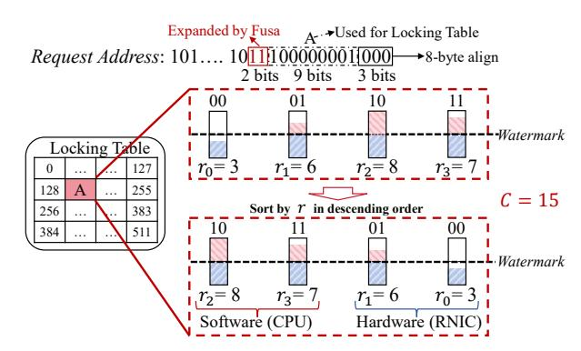
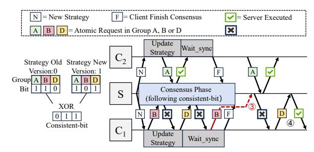
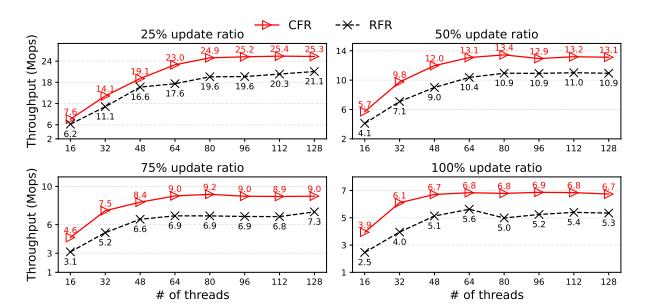

# A. Overview

Architecture: Figure 6 illustrates the architecture of Fusa. Clients are equipped with RNICs and connected to server through RDMA network. Fusa-Driver is a user-space driver that intercepts RDMA Atomic requests from applications. It decides whether each request should be executed by the RNIC or redirected to the CPU software path, according to the current dispatch strategy. Fusa-Agent is an agent that monitors local

request statistics and reports them to the server. It also receives updated dispatch strategy from the server and coordinates with Fusa-Driver to ensure correct strategy switching. Fusa-RPC is an RPC protocol that is implemented in Fusa-Driver and transfers contended atomic requests from clients to the server CPU. Fusa-Server executes atomic requests onloaded via Fusa-RPC on CPU threads, aggregates contention reports from all clients, maintains global metadata, and disseminates updated dispatch strategies to Fusa-Agent.

**Key Ideas:** Based on the above two findings, we propose Fusa, a general framework to mitigate atomic contention for RDMA-based systems. Figure 6 shows the overview of Fusa. Fusa allows each client to execute a fusion-based strategy (§IV-B): it onloads highly-skewed atomic requests to the server-side CPU (① to ③), while processing the remaining operations in the RNIC (● to ④). To facilitate this, each client reports metadata about its atomic requests (e.g., access frequency and address distribution) to the Fusa-Server, enabling Fusa to construct a global contention profile. This profile is analyzed periodically to update the dispatch strategy and propagated to all clients.

Fusa also designs two coordination mechanisms that together ensure correctness and consistency during the switch of dispatch strategies (§IV-C): (i) the lazy synchronization (at the client side), which allows new strategies to be adopted with controlled delay to avoid transient inconsistencies; and (ii) the consensus coordination (at the server side), which establishes consensus to guarantee atomic transitions.

We finally present a driver RPC to ensure the efficiency and transparency of Fusa to general RDMA-based systems (§IV-D).

**Workflow:** Figure 6 illustrates the workflow of Fusa. Clients first submit atomic requests to the user-space Fusa-Driver. Upon receiving an atomic request, Fusa-Driver determines whether it should be executed by the server-side RNIC (i.e., hardware) or by Fusa-Server (i.e., server-side CPU, software) based on the dispatch strategy. When selecting to dispatch the atomic operations to the RNIC, Fusa-Driver forwards the one-sided atomic verb directly (1). The RNIC then acquires the corresponding slot lock in the internal locking table (2) and executes the operation via a PCIe RMW (3). On the other hand, when choosing to perform the atomic operations by Fusa-Server, Fusa then sends the request via the Fusa-RPC protocol (1), converts it into an RPC message, and appends it to a request buffer in the server's main memory (2). Server threads then dequeue these RPC messages, parse each request, and execute the atomic operation on the CPU (3).

### B. Fine-Grained Dispatch Strategy

To adapt to the diverse access patterns across different applications [23], [38], Fusa designs a fine-grained contention-aware dispatch strategy.

**Dispatch Principle:** The RNIC executes RDMA Atomic using PCIe-based RMW transactions (Figure 2). While the internal RNIC locking table guarantees atomicity among its PUs, it does not provide atomicity when coordinating with CPU-side atomic processing. This lack of cross-domain synchronization



Figure 7: Example of contention identification at the group level ( $\S IV-B$ ). We color the portion below the watermark blue and the portion above red.  $r_i$  means the request count of a group.

introduces a correctness risk due to potential data races. To ensure correctness, Fusa enforces execution exclusivity: each atomic request address is served solely by either the RNIC or the CPU. By isolating execution at the address level, Fusa preserves atomic semantics without PCIe Atomic support.

**Group-Level Scheduling:** To schedule the RDMA Atomic requests, Fusa proposes to selectively onload only a subset of requests within a slot to the server-side CPU. This approach relieves contention while allowing the remaining requests to be processed directly by the RNIC, thereby mitigating conflicts and fully utilizing the RNIC's hardware capabilities.

To this end, we redefine the scheduling unit by classifying requests of each slot into multiple smaller groups using q additional bits, which can be extracted from the request address. Suppose that a locking table comprises s slots  $^3$ . Hence, the group-level scheduling can manage the atomic requests across  $s \cdot 2^g$  groups of the entire locking table, enabling finer-grained contention management. Figure 7 shows an example with s =512 and g = 2, where the requests to each slot is classified into four groups (i.e.,  $2^g$ ), resulting in 2,048 groups in total. Group Metadata: Our another observation is that the volume of RDMA requests can fluctuate significantly even within a single application, due to the sudden change of operations with significantly different access patterns, including the resizing in hash table [50], [82], transactional commit and validation [68], [69], and LSM-tree compaction [66], [73]. To proactively detect and mitigate contention in the RNIC locking table, Fusa periodically monitors the distribution of atomic requests and updates its dispatch strategy accordingly. This is achieved through the use of group metadata (shown in Figure 8). Specifically, each group maintains a 64-bit request counter that tracks the number of atomic requests in this group, along with a 1-bit flag that indicates the dispatching target: a value of '1' routes the group's requests to the server-side CPU, while '0' directs the requests to the RNIC.

**Contention Identification:** To quantify the contention degree of each group, Fusa periodically inspects the request counters. Since contention typically presents as request hotspots, we

<sup>&</sup>lt;sup>3</sup>Mellanox RNICs use 512 slots in their locking table; for other RNICs, the number of slots can be probed via reverse engineering as in [80].


Figure 8: Metadata in the Client (§IV-B). The group metadata facilitates the generation and storage of the strategy, whereas the QP metadata is maintained to guarantee consistency when strategies are switched.

treat it as a hotspot detection problem [4], [11], [14], [25]. To prevent excessive onloading that could introduce queuing delays, we impose a constraint based on the processing capacity of the server-side CPU  $^4$ , denoted as C.

To decide which atomic requests should be onloaded, we first compute the average number of requests across all groups, denoted as the *watermark*, where the groups with counters below this watermark are classified as *contention-less groups*. We next sort all groups in descending order of their request counts and identify the groups whose atomic operations will be onloaded to the server-side CPU. The scan operation terminates until either of the following two conditions is satisfied: (i) all the remaining groups are contention-less ones (indicating that this group and all subsequent groups do not suffer from severe contention) and (ii) the number of accumulated atomic requests to be onloaded surpasses the processing capability of the server-side CPU (i.e., larger than C).

**Example:** Figure 7 illustrates an example with four groups. We sort them at first based on the number of atomic requests to be processed. Suppose that C is 15. We then scan the sorted groups and choose to onload the requests of the most contended groups (e.g.,  $r_2$  and  $r_3$ ), as the number of their requests reaches C.

## C. Correctness Fusion Dispatch

As Fusa dynamically changes its dispatch strategy, clients may receive the updated strategy at different points in time. In this case, atomic requests belonging to the same group may be operated by the clients following different dispatch strategies. For example, the atomic operations of a group may be assigned to the RNIC by a client (following the old strategy) and dispatched to the server-side CPU by another client (following the new strategy), resulting in a temporary inconsistency. Prior works [5], [75] usually ensure correctness by enforcing isolation among requests. However, Fusa does not adopt this approach for the following two reasons. First, because of temporal locality, the dispatch strategy is updated infrequently, meaning that the inconsistency will only occur for the groups whose dispatch strategies are just changed during the period of strategy transitioning. Second, as the number of contended groups (i.e., comprising the addresses hotly

```
GROUP NUM # number of groups
     # In Fusa-Driver:
     def Send cas (address, current, new):
4
5
         # get qp_id according to the context
         qp id = GetQPId(context)
6
         group id = address % GROUP NUM
8
         counters[group id]++
9
         # mark OP as running
         running[qp_id] = True
         epoch[qp_id] += 1
         # get the strategy bit of group_id
14
         local_st = strategy[group_id]
16
         # Send request based on local st
17
         if local_st == 1:
18
             # onload to Fusa-Server
19
             send to Server (address, current, new)
         else:
21
             # offload to RNIC
             inflight[group id]++
             send to RNIC (address, current, new)
24
         # mark QP as finished
         running[qp_id] = False
26
27
28
     # In Fusa-Agent:
     def Update strategy (new strategy):
         pre_strategy = strategy
         # strategy is a pointer to group bits
         # so we can use CAS atoms to switch it
         CAS(strategy, new_strategy)
34
     def Wait sync(client qp set):
36
         Q = Queue()
38
         for qp_id in client_qp_set:
             # enqueue QP with its current epoch
40
             Q.enqueue((qp id, epoch[qp id]))
41
42
         while not Q.empty():
             qp_id, origin epoch = Q.front()
4.3
44
             # a QP is considered synchronized
45
             # once it either increments its epoch
46
               or exits the running state
47
             if epoch[qp id] != origin epoch or
48
                 running[qp id] == False:
49
                 Q. dequeue()
         # All QPs have reached consensus
51
         # Wait inflight RDMA CAS
53
         for group id in 0..GROUP NUM-1:
54
             if pre strategy[group id] ==
                 strategy[group id] == 1:
                 while(inflight[group_id] != 0)
```

Figure 9: Pseudo-code of client consensus procedure (§IV-C).

accessed) are usually very small, Fusa chooses to guarantee the consistency for a small number of groups whose dispatch strategies are changed, rather than enforcing the coordination between server-side CPU and RNIC for all the requests as in [5]. However, as one-sided RDMA bypasses the server CPU, the server-side RNIC is incapable to reject the requests guided by the outdated strategy [17]. Hence, the primary challenge is to ensure that all clients' QPs converge to a unified view of the dispatch strategy after the synchronization point, thereby guaranteeing execution consistency.

**Lazy Synchronization at the Client Side:** To enable dynamic dispatch strategy switching at the client side, we propose

 $<sup>^4\</sup>mbox{We}$  demonstrate that a single server thread can process the atomic operations at approximately 2.5 Mops/s (see Exp#5 in VI-D

a multi-QP epoch synchronization mechanism inspired by epoch-based reclamation [22]. Figure 9 displays the pseudocode of the consensus procedure at the client side, where the synchronization is coordinated between the passive path (lines 4–26) that updates QP epoch and metadata and the active path (lines 28–56) that checks QP consensus state to ensure global agreement. Since the driver layer is passive, Fusa-Driver follows lazy synchronization by incrementing the epoch during normal execution without observing strategy changes.

When receiving a dispatch strategy update from the server, the client first applies it locally (lines 29–33) and then invokes Wait\_sync to block until all QPs have safely transitioned the strategy. A QP is considered synchronized once it either increments its epoch (i.e., it has updated its metadata and only enters the execution state after adopting the new dispatch strategy, thus guaranteeing that subsequent requests will follow the latest strategy) or exits the running state (i.e., it is not currently issuing requests, so upon the next execution it will inevitably read and adopt the updated strategy), both of which ensure subsequent accesses observe the new dispatch strategy (lines 42–49). The client further monitors each QP's status and proceeds only after the queue is fully drained, thereby guaranteeing that all QPs attain a consistent view and adhere to the new strategy thereafter.

In-Flight Request. Once QPs of the client reach consensus on a new strategy, it must guarantee that no requests will be issued under the old strategy from that point onward. However, there may still exist in-flight requests either in the network or being executed on the server-side RNIC. We provide solutions for the two possibilities. When the dispatch strategy of a group switches from the server-side CPU to the RNIC, Fusa-Server can directly refuse the executions of the in-flight requests (as these requests are originally sent to Fusa-Server according to the old strategy). On the other hand, when the dispatch strategy of a group switches from the RNIC to Fusa-Server, it will be complex to learn the processing status of requests, as Fusa is unaware of the execution of the atomic requests in RNICs. To address this problem, we allocate an in-flight field for each group (see Figure 8), which is incremented when the RNIC issues an atomic operation (line 22 in Figure 9) and decremented when the driver receives the CQE that indicates the completion of this group's requests. Therefore, after reaching QP consensus, Fusa-Agent must check whether any such groups still have in-flight requests (lines 53-56 in Figure 9). Global Consensus Coordination at the Server Side: We implement a consensus phase in Fusa-Server to coordinate the transition of dispatch strategy across all clients. During the consensus phase, Fusa-Server computes a per-group consistent-bit by XORing the old and new dispatch strategies, as shown in Figure 10. For groups where the consistent-bit is '0' (e.g., Group-A in Figure 10), we retain their original dispatch strategy, allowing requests (1 and 2) to proceed without interruption. In contrast, for groups where the consistent-bit is '1' (e.g., Group-B and Group-D), Fusa-Server rejects all requests during the consensus phase. This prevents inconsistent execution where some QPs continue to operate under the old



Figure 10: Global consensus coordination (§IV-C). Each bit of a group specifies the strategy: '0' indicates that the atomic request is sent to the RNIC, while '1' indicates the request is sent to the Fusa-Server. S denotes the Fusa-Server, C1 and C2 denote clients.

dispatch strategy (①) while others have already adopted the new one (②), before global consensus is reached. When the consensus phase completes, Fusa-Server resumes normal request processing and finalizes the transition to the new dispatch strategy (④). We also evaluate the time required for each step in the consensus process (see Exp#4, §VI-C).

Formal Verification of Execution Correctness: To formally validate the correctness of Fusa, we model its consensus protocol using TLA+ [37], which is a high-level language for modeling programs and systems. The model captures the key components of Fusa, including clients, groups, QPs, server strategies, per-client local strategies, epoch states, in-flight counters, and pending requests.

We define the following two criteria: (i) at any time, no client has atomic operations on the same address executed by both the server-side RNIC and the server-side CPU simultaneously (to ensure the execution correctness of the atomic requests from a single client), and (ii) at any time, all the requests to the same group (even sent by different clients) are executed entirely by either the server-side RNIC or the server-side CPU (to ensure the execution correctness of the atomic requests across different clients). Using the TLA+ model checker, we exhaustively verified that these invariants hold for all reachable states (with over 40 billion states) under bounded configurations. The results confirm that the consensus mechanism in Fusa ensures a consistent view of the dispatch strategy across all clients during strategy transitionings.

#### D. Transparent RPC

Prior RPC frameworks [13], [30]–[32], [45] are predominantly designed at the application layer, limiting their transparency and system generality. To support non-intrusive RDMA Atomics, Fusa implements its dispatching logic at the driver level, allowing applications to run atop of it without any modification.

To evaluate driver-level RPC viability, we port two representative implementations, namely SelfRPC [45] and HERD RPC [32], to the RNIC driver. This integration allows for atomic redirection of requests without modifying application logic and enables us to assess whether their performance traits are preserved when shifted to the driver level.


Figure 11: Workflows of transparent RPC approaches (§IV-D). The figures illustrate that (a) the RNIC-friendly RPC is adapted from SelfRPC [45], while (b) the coroutine-friendly RPC is derived from HERD RPC [32].

RNIC-Friendly RPC. We implement an RNIC-friendly RPC variant by porting SelfRPC [45] to the driver layer. This approach leverages one-sided RDMA verbs to minimize RNIC resource usage [36]. Figure 11(a) shows that the driver processes each atomic request by allocating a buffer (1), issuing an RDMA WRITE (2), and actively polling the buffer for completion (3) before returning the result to the application (3). Since no server-side CQE is generated, this active polling is required for synchronization. However, this spin-waiting mechanism is incompatible with coroutine-based architectures commonly adopted in modern RDMA systems [46], [47], [65], [68], [77], [82], as it blocks coroutine switching and limits system concurrency.

Coroutine-Friendly RPC. To address this concurrency limitation, we further implement coroutine-friendly RPC variant by porting HERD RPC [32] to the driver level. As shown in Figure 11(b), coroutine-friendly RPC begins by posting a RECV on the client (2), followed by issuing a WRITE to the server (3) upon atomic request reception (1). Control is then immediately returned to the application (4), enabling coroutine transitions without waiting at the driver level. Unlike RNIC-friendly RPC, coroutine-friendly RPC relies on the CQE generated by the RDMA SEND to detect completion, enabling asynchronous synchronization via poll CQ. Although the coroutine must eventually wait for the CQE arrival, coroutinefriendly RPC masks latency by allowing other coroutines to proceed, enhancing concurrency and throughput. However, this concurrency gain is achieved at the cost of higher RNIC resource consumption, as the coroutine-friendly RPC depends on two-sided RDMA verbs.

**Performance Comparison.** To identify the most effective driver-level RPC mechanism, we compare RNIC-friendly RPC and coroutine-friendly RPC under a configuration of two coroutines per thread. To isolate RPC scalability from contention effects, we evaluate both designs using uniformly distributed workloads with update ratios ranging from 25% to 100%. Figure 12 shows that coroutine-friendly RPC consistently outperforms RNIC-friendly RPC across all configurations. This advantage stems from its asynchronous design: while one coroutine waits for CQE completion, others can continue execution, thereby hiding synchronization latency and preserving



Figure 12: Performance comparison of RNIC-friendly RPC and coroutine-friendly RPC (§IV-D). We use uniform distribution to minimize the effects of contention. Each thread is configured with two coroutines


Figure 13: Processing details of Fusa and OrderedFusa on the client-side QP. X and Y denote arbitrary RDMA verb requests issued before and after an atomic request, respectively. Steps ①—③ illustrate the workflow of Fusa, while Steps ①—⑤ illustrate the workflow of OrderedFusa.

concurrency. In contrast, RNIC-friendly RPC relies on polling, which stalls coroutine switching and degrades parallelism. Based on the above findings and comparisons, Fusa-RPC adopts coroutine-friendly RPC as the default driver-level RPC mechanism for atomic request dispatching.

# A. Overview

Architecture: Figure 6 illustrates the architecture of Fusa. Clients are equipped with RNICs and connected to server through RDMA network. Fusa-Driver is a user-space driver that intercepts RDMA Atomic requests from applications. It decides whether each request should be executed by the RNIC or redirected to the CPU software path, according to the current dispatch strategy. Fusa-Agent is an agent that monitors local

request statistics and reports them to the server. It also receives updated dispatch strategy from the server and coordinates with Fusa-Driver to ensure correct strategy switching. Fusa-RPC is an RPC protocol that is implemented in Fusa-Driver and transfers contended atomic requests from clients to the server CPU. Fusa-Server executes atomic requests onloaded via Fusa-RPC on CPU threads, aggregates contention reports from all clients, maintains global metadata, and disseminates updated dispatch strategies to Fusa-Agent.

**Key Ideas:** Based on the above two findings, we propose Fusa, a general framework to mitigate atomic contention for RDMA-based systems. Figure 6 shows the overview of Fusa. Fusa allows each client to execute a fusion-based strategy (§IV-B): it onloads highly-skewed atomic requests to the server-side CPU (① to ③), while processing the remaining operations in the RNIC (● to ④). To facilitate this, each client reports metadata about its atomic requests (e.g., access frequency and address distribution) to the Fusa-Server, enabling Fusa to construct a global contention profile. This profile is analyzed periodically to update the dispatch strategy and propagated to all clients.

Fusa also designs two coordination mechanisms that together ensure correctness and consistency during the switch of dispatch strategies (§IV-C): (i) the lazy synchronization (at the client side), which allows new strategies to be adopted with controlled delay to avoid transient inconsistencies; and (ii) the consensus coordination (at the server side), which establishes consensus to guarantee atomic transitions.

We finally present a driver RPC to ensure the efficiency and transparency of Fusa to general RDMA-based systems (§IV-D).

**Workflow:** Figure 6 illustrates the workflow of Fusa. Clients first submit atomic requests to the user-space Fusa-Driver. Upon receiving an atomic request, Fusa-Driver determines whether it should be executed by the server-side RNIC (i.e., hardware) or by Fusa-Server (i.e., server-side CPU, software) based on the dispatch strategy. When selecting to dispatch the atomic operations to the RNIC, Fusa-Driver forwards the one-sided atomic verb directly (1). The RNIC then acquires the corresponding slot lock in the internal locking table (2) and executes the operation via a PCIe RMW (3). On the other hand, when choosing to perform the atomic operations by Fusa-Server, Fusa then sends the request via the Fusa-RPC protocol (1), converts it into an RPC message, and appends it to a request buffer in the server's main memory (2). Server threads then dequeue these RPC messages, parse each request, and execute the atomic operation on the CPU (3).

### B. Fine-Grained Dispatch Strategy

To adapt to the diverse access patterns across different applications [23], [38], Fusa designs a fine-grained contention-aware dispatch strategy.

**Dispatch Principle:** The RNIC executes RDMA Atomic using PCIe-based RMW transactions (Figure 2). While the internal RNIC locking table guarantees atomicity among its PUs, it does not provide atomicity when coordinating with CPU-side atomic processing. This lack of cross-domain synchronization


Figure 7: Example of contention identification at the group level ( $\S IV-B$ ). We color the portion below the watermark blue and the portion above red.  $r_i$  means the request count of a group.

introduces a correctness risk due to potential data races. To ensure correctness, Fusa enforces execution exclusivity: each atomic request address is served solely by either the RNIC or the CPU. By isolating execution at the address level, Fusa preserves atomic semantics without PCIe Atomic support.

**Group-Level Scheduling:** To schedule the RDMA Atomic requests, Fusa proposes to selectively onload only a subset of requests within a slot to the server-side CPU. This approach relieves contention while allowing the remaining requests to be processed directly by the RNIC, thereby mitigating conflicts and fully utilizing the RNIC's hardware capabilities.

To this end, we redefine the scheduling unit by classifying requests of each slot into multiple smaller groups using q additional bits, which can be extracted from the request address. Suppose that a locking table comprises s slots  $^3$ . Hence, the group-level scheduling can manage the atomic requests across  $s \cdot 2^g$  groups of the entire locking table, enabling finer-grained contention management. Figure 7 shows an example with s =512 and g = 2, where the requests to each slot is classified into four groups (i.e.,  $2^g$ ), resulting in 2,048 groups in total. Group Metadata: Our another observation is that the volume of RDMA requests can fluctuate significantly even within a single application, due to the sudden change of operations with significantly different access patterns, including the resizing in hash table [50], [82], transactional commit and validation [68], [69], and LSM-tree compaction [66], [73]. To proactively detect and mitigate contention in the RNIC locking table, Fusa periodically monitors the distribution of atomic requests and updates its dispatch strategy accordingly. This is achieved through the use of group metadata (shown in Figure 8). Specifically, each group maintains a 64-bit request counter that tracks the number of atomic requests in this group, along with a 1-bit flag that indicates the dispatching target: a value of '1' routes the group's requests to the server-side CPU, while '0' directs the requests to the RNIC.

**Contention Identification:** To quantify the contention degree of each group, Fusa periodically inspects the request counters. Since contention typically presents as request hotspots, we

<sup>&</sup>lt;sup>3</sup>Mellanox RNICs use 512 slots in their locking table; for other RNICs, the number of slots can be probed via reverse engineering as in [80].


Figure 8: Metadata in the Client (§IV-B). The group metadata facilitates the generation and storage of the strategy, whereas the QP metadata is maintained to guarantee consistency when strategies are switched.

treat it as a hotspot detection problem [4], [11], [14], [25]. To prevent excessive onloading that could introduce queuing delays, we impose a constraint based on the processing capacity of the server-side CPU  $^4$ , denoted as C.

To decide which atomic requests should be onloaded, we first compute the average number of requests across all groups, denoted as the *watermark*, where the groups with counters below this watermark are classified as *contention-less groups*. We next sort all groups in descending order of their request counts and identify the groups whose atomic operations will be onloaded to the server-side CPU. The scan operation terminates until either of the following two conditions is satisfied: (i) all the remaining groups are contention-less ones (indicating that this group and all subsequent groups do not suffer from severe contention) and (ii) the number of accumulated atomic requests to be onloaded surpasses the processing capability of the server-side CPU (i.e., larger than C).

**Example:** Figure 7 illustrates an example with four groups. We sort them at first based on the number of atomic requests to be processed. Suppose that C is 15. We then scan the sorted groups and choose to onload the requests of the most contended groups (e.g.,  $r_2$  and  $r_3$ ), as the number of their requests reaches C.

## C. Correctness Fusion Dispatch

As Fusa dynamically changes its dispatch strategy, clients may receive the updated strategy at different points in time. In this case, atomic requests belonging to the same group may be operated by the clients following different dispatch strategies. For example, the atomic operations of a group may be assigned to the RNIC by a client (following the old strategy) and dispatched to the server-side CPU by another client (following the new strategy), resulting in a temporary inconsistency. Prior works [5], [75] usually ensure correctness by enforcing isolation among requests. However, Fusa does not adopt this approach for the following two reasons. First, because of temporal locality, the dispatch strategy is updated infrequently, meaning that the inconsistency will only occur for the groups whose dispatch strategies are just changed during the period of strategy transitioning. Second, as the number of contended groups (i.e., comprising the addresses hotly

```
GROUP NUM # number of groups
     # In Fusa-Driver:
     def Send cas (address, current, new):
4
5
         # get qp_id according to the context
         qp id = GetQPId(context)
6
         group id = address % GROUP NUM
8
         counters[group id]++
9
         # mark OP as running
         running[qp_id] = True
         epoch[qp_id] += 1
         # get the strategy bit of group_id
14
         local_st = strategy[group_id]
16
         # Send request based on local st
17
         if local_st == 1:
18
             # onload to Fusa-Server
19
             send to Server (address, current, new)
         else:
21
             # offload to RNIC
             inflight[group id]++
             send to RNIC (address, current, new)
24
         # mark QP as finished
         running[qp_id] = False
26
27
28
     # In Fusa-Agent:
     def Update strategy (new strategy):
         pre_strategy = strategy
         # strategy is a pointer to group bits
         # so we can use CAS atoms to switch it
         CAS(strategy, new_strategy)
34
     def Wait sync(client qp set):
36
         Q = Queue()
38
         for qp_id in client_qp_set:
             # enqueue QP with its current epoch
40
             Q.enqueue((qp id, epoch[qp id]))
41
42
         while not Q.empty():
             qp_id, origin epoch = Q.front()
4.3
44
             # a QP is considered synchronized
45
             # once it either increments its epoch
46
               or exits the running state
47
             if epoch[qp id] != origin epoch or
48
                 running[qp id] == False:
49
                 Q. dequeue()
         # All QPs have reached consensus
51
         # Wait inflight RDMA CAS
53
         for group id in 0..GROUP NUM-1:
54
             if pre strategy[group id] ==
                 strategy[group id] == 1:
                 while(inflight[group_id] != 0)
```

Figure 9: Pseudo-code of client consensus procedure (§IV-C).

accessed) are usually very small, Fusa chooses to guarantee the consistency for a small number of groups whose dispatch strategies are changed, rather than enforcing the coordination between server-side CPU and RNIC for all the requests as in [5]. However, as one-sided RDMA bypasses the server CPU, the server-side RNIC is incapable to reject the requests guided by the outdated strategy [17]. Hence, the primary challenge is to ensure that all clients' QPs converge to a unified view of the dispatch strategy after the synchronization point, thereby guaranteeing execution consistency.

**Lazy Synchronization at the Client Side:** To enable dynamic dispatch strategy switching at the client side, we propose

 $<sup>^4\</sup>mbox{We}$  demonstrate that a single server thread can process the atomic operations at approximately 2.5 Mops/s (see Exp#5 in VI-D

a multi-QP epoch synchronization mechanism inspired by epoch-based reclamation [22]. Figure 9 displays the pseudocode of the consensus procedure at the client side, where the synchronization is coordinated between the passive path (lines 4–26) that updates QP epoch and metadata and the active path (lines 28–56) that checks QP consensus state to ensure global agreement. Since the driver layer is passive, Fusa-Driver follows lazy synchronization by incrementing the epoch during normal execution without observing strategy changes.

When receiving a dispatch strategy update from the server, the client first applies it locally (lines 29–33) and then invokes Wait\_sync to block until all QPs have safely transitioned the strategy. A QP is considered synchronized once it either increments its epoch (i.e., it has updated its metadata and only enters the execution state after adopting the new dispatch strategy, thus guaranteeing that subsequent requests will follow the latest strategy) or exits the running state (i.e., it is not currently issuing requests, so upon the next execution it will inevitably read and adopt the updated strategy), both of which ensure subsequent accesses observe the new dispatch strategy (lines 42–49). The client further monitors each QP's status and proceeds only after the queue is fully drained, thereby guaranteeing that all QPs attain a consistent view and adhere to the new strategy thereafter.

In-Flight Request. Once QPs of the client reach consensus on a new strategy, it must guarantee that no requests will be issued under the old strategy from that point onward. However, there may still exist in-flight requests either in the network or being executed on the server-side RNIC. We provide solutions for the two possibilities. When the dispatch strategy of a group switches from the server-side CPU to the RNIC, Fusa-Server can directly refuse the executions of the in-flight requests (as these requests are originally sent to Fusa-Server according to the old strategy). On the other hand, when the dispatch strategy of a group switches from the RNIC to Fusa-Server, it will be complex to learn the processing status of requests, as Fusa is unaware of the execution of the atomic requests in RNICs. To address this problem, we allocate an in-flight field for each group (see Figure 8), which is incremented when the RNIC issues an atomic operation (line 22 in Figure 9) and decremented when the driver receives the CQE that indicates the completion of this group's requests. Therefore, after reaching QP consensus, Fusa-Agent must check whether any such groups still have in-flight requests (lines 53-56 in Figure 9). Global Consensus Coordination at the Server Side: We implement a consensus phase in Fusa-Server to coordinate the transition of dispatch strategy across all clients. During the consensus phase, Fusa-Server computes a per-group consistent-bit by XORing the old and new dispatch strategies, as shown in Figure 10. For groups where the consistent-bit is '0' (e.g., Group-A in Figure 10), we retain their original dispatch strategy, allowing requests (1 and 2) to proceed without interruption. In contrast, for groups where the consistent-bit is '1' (e.g., Group-B and Group-D), Fusa-Server rejects all requests during the consensus phase. This prevents inconsistent execution where some QPs continue to operate under the old


Figure 10: Global consensus coordination (§IV-C). Each bit of a group specifies the strategy: '0' indicates that the atomic request is sent to the RNIC, while '1' indicates the request is sent to the Fusa-Server. S denotes the Fusa-Server, C1 and C2 denote clients.

dispatch strategy (①) while others have already adopted the new one (②), before global consensus is reached. When the consensus phase completes, Fusa-Server resumes normal request processing and finalizes the transition to the new dispatch strategy (④). We also evaluate the time required for each step in the consensus process (see Exp#4, §VI-C).

Formal Verification of Execution Correctness: To formally validate the correctness of Fusa, we model its consensus protocol using TLA+ [37], which is a high-level language for modeling programs and systems. The model captures the key components of Fusa, including clients, groups, QPs, server strategies, per-client local strategies, epoch states, in-flight counters, and pending requests.

We define the following two criteria: (i) at any time, no client has atomic operations on the same address executed by both the server-side RNIC and the server-side CPU simultaneously (to ensure the execution correctness of the atomic requests from a single client), and (ii) at any time, all the requests to the same group (even sent by different clients) are executed entirely by either the server-side RNIC or the server-side CPU (to ensure the execution correctness of the atomic requests across different clients). Using the TLA+ model checker, we exhaustively verified that these invariants hold for all reachable states (with over 40 billion states) under bounded configurations. The results confirm that the consensus mechanism in Fusa ensures a consistent view of the dispatch strategy across all clients during strategy transitionings.

#### D. Transparent RPC

Prior RPC frameworks [13], [30]–[32], [45] are predominantly designed at the application layer, limiting their transparency and system generality. To support non-intrusive RDMA Atomics, Fusa implements its dispatching logic at the driver level, allowing applications to run atop of it without any modification.

To evaluate driver-level RPC viability, we port two representative implementations, namely SelfRPC [45] and HERD RPC [32], to the RNIC driver. This integration allows for atomic redirection of requests without modifying application logic and enables us to assess whether their performance traits are preserved when shifted to the driver level.


Figure 11: Workflows of transparent RPC approaches (§IV-D). The figures illustrate that (a) the RNIC-friendly RPC is adapted from SelfRPC [45], while (b) the coroutine-friendly RPC is derived from HERD RPC [32].

RNIC-Friendly RPC. We implement an RNIC-friendly RPC variant by porting SelfRPC [45] to the driver layer. This approach leverages one-sided RDMA verbs to minimize RNIC resource usage [36]. Figure 11(a) shows that the driver processes each atomic request by allocating a buffer (1), issuing an RDMA WRITE (2), and actively polling the buffer for completion (3) before returning the result to the application (3). Since no server-side CQE is generated, this active polling is required for synchronization. However, this spin-waiting mechanism is incompatible with coroutine-based architectures commonly adopted in modern RDMA systems [46], [47], [65], [68], [77], [82], as it blocks coroutine switching and limits system concurrency.

Coroutine-Friendly RPC. To address this concurrency limitation, we further implement coroutine-friendly RPC variant by porting HERD RPC [32] to the driver level. As shown in Figure 11(b), coroutine-friendly RPC begins by posting a RECV on the client (2), followed by issuing a WRITE to the server (3) upon atomic request reception (1). Control is then immediately returned to the application (4), enabling coroutine transitions without waiting at the driver level. Unlike RNIC-friendly RPC, coroutine-friendly RPC relies on the CQE generated by the RDMA SEND to detect completion, enabling asynchronous synchronization via poll CQ. Although the coroutine must eventually wait for the CQE arrival, coroutinefriendly RPC masks latency by allowing other coroutines to proceed, enhancing concurrency and throughput. However, this concurrency gain is achieved at the cost of higher RNIC resource consumption, as the coroutine-friendly RPC depends on two-sided RDMA verbs.

**Performance Comparison.** To identify the most effective driver-level RPC mechanism, we compare RNIC-friendly RPC and coroutine-friendly RPC under a configuration of two coroutines per thread. To isolate RPC scalability from contention effects, we evaluate both designs using uniformly distributed workloads with update ratios ranging from 25% to 100%. Figure 12 shows that coroutine-friendly RPC consistently outperforms RNIC-friendly RPC across all configurations. This advantage stems from its asynchronous design: while one coroutine waits for CQE completion, others can continue execution, thereby hiding synchronization latency and preserving


Figure 12: Performance comparison of RNIC-friendly RPC and coroutine-friendly RPC (§IV-D). We use uniform distribution to minimize the effects of contention. Each thread is configured with two coroutines


Figure 13: Processing details of Fusa and OrderedFusa on the client-side QP. X and Y denote arbitrary RDMA verb requests issued before and after an atomic request, respectively. Steps ①—③ illustrate the workflow of Fusa, while Steps ①—⑤ illustrate the workflow of OrderedFusa.

concurrency. In contrast, RNIC-friendly RPC relies on polling, which stalls coroutine switching and degrades parallelism. Based on the above findings and comparisons, Fusa-RPC adopts coroutine-friendly RPC as the default driver-level RPC mechanism for atomic request dispatching.

