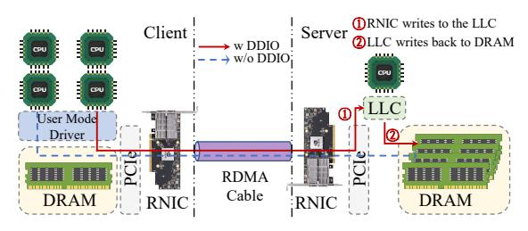
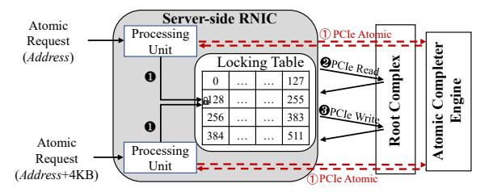

# II. BACKGROUND

## A. RDMA Architecture

**RDMA:** Remote Direct Memory Access (RDMA) enables applications to directly access remote memory by offloading the network stack to the RDMA Network Interface Cards (RNICs) [16], [24]. This CPU-bypass architecture achieves ultra-low latency (e.g., 2 µs [16]) and high bandwidth (e.g., 400 Gbps [49]), making RDMA well-suited for high-performance distributed systems. Figure 1 illustrates the RDMA architecture in reliable connection mode1.

To establish communications, both the client and server must first create a Queue Pair (QP) and a Completion Queue (CQ) in host memory, which are used to manage request metadata throughout the transmission process. Each QP consists of a Send Queue (SQ) and a Receive Queue (RQ), where elements

Figure 1: Overview of RDMA network architecture (§II-A).

are enqueued for processing. During RDMA communication, the application submits an RDMA verb to the SQ via a user-space driver, prompting the RNIC to fetch the corresponding element via DMA or MMIO and execute the requested operation [33]. Once the operation completes, a Completion Queue Element (CQE) is generated to notify the application, which can detect it either through polling or event-based notifications [55]. Note that RDMA verbs are categorized as one-sided (e.g., READ, WRITE, CAS, and FAA) or two-sided (SEND and RECV) [54]. One-sided verbs achieve high efficiency by bypassing the remote CPU, whereas two-sided verbs require CPU involvement on both sides and follow message-passing semantics, making them suitable for RPC-based designs [30], [31].

**DDIO:** Data Direct I/O (DDIO) [28] further optimizes the RDMA data path by enabling the RNIC to interact directly with the LLC, thereby bypassing main memory accesses on the critical latency path [20]. As shown in Figure 1, in DDIO mode, the RNIC writes data directly to the LLC, with the write operation considered complete as soon as the data arrives in the cache (Step ①). When the allocated cache space is later required for other data, the LLC evicts the corresponding cache line to DRAM as a background operation (Step ②).

#### B. RDMA Atomicity

RDMA Atomic is critical for ensuring atomicity and consistency when accessing shared resources in remote memory. RDMA supports two atomic operations, namely CAS and FAA, which operate directly on remote memory regions. Specifically, RDMA CAS compares the current value at a remote memory location with a specified "compare" value and updates it with a given "new" value if they match, whereas RDMA FAA atomically adds a user-defined value to the current value in remote memory and returns the original value. These two atomic primitives serve as the foundation for a wide range of RDMA-based systems. For example, key-value stores such as RACE [82] and SepHash [50] leverage RDMA Atomic to enable lock-free writes and prevent conflicts [81], while distributed transaction systems including DrTM [69] and NAM-DB [6] utilize RDMA Atomic to implement remote locking and enforce isolation levels.

Figure 2 illustrates the implementation flow of HCA Atomic, showing how the RNIC's internal locking table coordinates RDMA Atomic operations across processing units (PUs) within the RNIC. To guarantee atomicity, modern RNICs serialize

&lt;sup>1We focus on RDMA using over connections [56].

Figure 2: The RNIC locking table in the server-side RNIC (§II-B). Each processing unit (PU) processes RDMA Atomic independently. RDMA Atomic will contend if they are assigned to the same slot.

concurrent operations through an internal locking table containing multiple slots (e.g., 512 slots in Mellanox RNICs [33], [80]). For each 8-byte aligned atomic operation, the RNIC hashes the target address to identify the corresponding lock slot and assigns the operation to a specific PU. RDMA Atomic contention occurs when multiple RDMA Atomic operations are mapped to the same slot, requiring serialized execution (1). The assigned PU executes the atomic operations by first issuing a PCIe Read to retrieve the current value (2), followed by a PCIe Write to update the data if applicable (3). This RNIC locking table ensures that all PCIe requests maintain atomicity across multiple PUs. To enable more efficient synchronization across multiple PCIe devices, PCIe 3.0 [1] introduces PCIe Atomic transactions [2], [27], which natively support FAA, CAS, and SWAP. When supported, RNICs can implement Global Atomic by issuing PCIe Atomic transactions, thereby delegating atomicity guarantees to the PCIe subsystem. This approach eliminates the need for internal serialization and allows RNICs to bypass the locking table (1).

# II. BACKGROUND

## A. RDMA Architecture

**RDMA:** Remote Direct Memory Access (RDMA) enables applications to directly access remote memory by offloading the network stack to the RDMA Network Interface Cards (RNICs) [16], [24]. This CPU-bypass architecture achieves ultra-low latency (e.g., 2 µs [16]) and high bandwidth (e.g., 400 Gbps [49]), making RDMA well-suited for high-performance distributed systems. Figure 1 illustrates the RDMA architecture in reliable connection mode1.

To establish communications, both the client and server must first create a Queue Pair (QP) and a Completion Queue (CQ) in host memory, which are used to manage request metadata throughout the transmission process. Each QP consists of a Send Queue (SQ) and a Receive Queue (RQ), where elements

Figure 1: Overview of RDMA network architecture (§II-A).

are enqueued for processing. During RDMA communication, the application submits an RDMA verb to the SQ via a user-space driver, prompting the RNIC to fetch the corresponding element via DMA or MMIO and execute the requested operation [33]. Once the operation completes, a Completion Queue Element (CQE) is generated to notify the application, which can detect it either through polling or event-based notifications [55]. Note that RDMA verbs are categorized as one-sided (e.g., READ, WRITE, CAS, and FAA) or two-sided (SEND and RECV) [54]. One-sided verbs achieve high efficiency by bypassing the remote CPU, whereas two-sided verbs require CPU involvement on both sides and follow message-passing semantics, making them suitable for RPC-based designs [30], [31].

**DDIO:** Data Direct I/O (DDIO) [28] further optimizes the RDMA data path by enabling the RNIC to interact directly with the LLC, thereby bypassing main memory accesses on the critical latency path [20]. As shown in Figure 1, in DDIO mode, the RNIC writes data directly to the LLC, with the write operation considered complete as soon as the data arrives in the cache (Step ①). When the allocated cache space is later required for other data, the LLC evicts the corresponding cache line to DRAM as a background operation (Step ②).

#### B. RDMA Atomicity

RDMA Atomic is critical for ensuring atomicity and consistency when accessing shared resources in remote memory. RDMA supports two atomic operations, namely CAS and FAA, which operate directly on remote memory regions. Specifically, RDMA CAS compares the current value at a remote memory location with a specified "compare" value and updates it with a given "new" value if they match, whereas RDMA FAA atomically adds a user-defined value to the current value in remote memory and returns the original value. These two atomic primitives serve as the foundation for a wide range of RDMA-based systems. For example, key-value stores such as RACE [82] and SepHash [50] leverage RDMA Atomic to enable lock-free writes and prevent conflicts [81], while distributed transaction systems including DrTM [69] and NAM-DB [6] utilize RDMA Atomic to implement remote locking and enforce isolation levels.

Figure 2 illustrates the implementation flow of HCA Atomic, showing how the RNIC's internal locking table coordinates RDMA Atomic operations across processing units (PUs) within the RNIC. To guarantee atomicity, modern RNICs serialize

&lt;sup>1We focus on RDMA using over connections [56].

Figure 2: The RNIC locking table in the server-side RNIC (§II-B). Each processing unit (PU) processes RDMA Atomic independently. RDMA Atomic will contend if they are assigned to the same slot.

concurrent operations through an internal locking table containing multiple slots (e.g., 512 slots in Mellanox RNICs [33], [80]). For each 8-byte aligned atomic operation, the RNIC hashes the target address to identify the corresponding lock slot and assigns the operation to a specific PU. RDMA Atomic contention occurs when multiple RDMA Atomic operations are mapped to the same slot, requiring serialized execution (1). The assigned PU executes the atomic operations by first issuing a PCIe Read to retrieve the current value (2), followed by a PCIe Write to update the data if applicable (3). This RNIC locking table ensures that all PCIe requests maintain atomicity across multiple PUs. To enable more efficient synchronization across multiple PCIe devices, PCIe 3.0 [1] introduces PCIe Atomic transactions [2], [27], which natively support FAA, CAS, and SWAP. When supported, RNICs can implement Global Atomic by issuing PCIe Atomic transactions, thereby delegating atomicity guarantees to the PCIe subsystem. This approach eliminates the need for internal serialization and allows RNICs to bypass the locking table (1).

