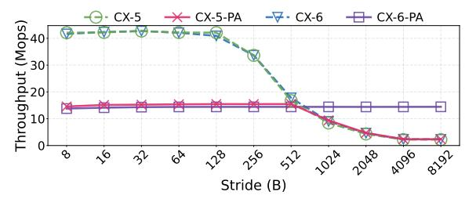
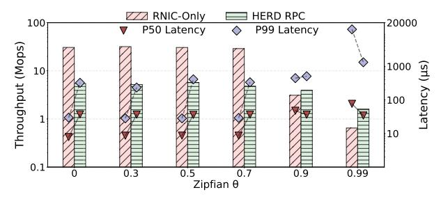
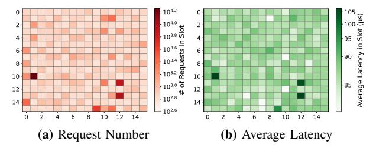

# III. UNSUCCESSFUL ATTEMPTS AND FINDINGS

To explore scalable RDMA Atomic solutions, we make two attempts to alleviate contentions in the RNIC locking table. First, we analyze the internal locking mechanism in RNIC and try to bypass internal locking using PCIe Atomic (Attempt#1). Second, we examine a software-only approach to address these limitations (Attempt#2). From these efforts, we derive two findings (Finding#1–#2) that motivate our design. The configurations of experiments can be referred to §VI-A.

#### A. Attempt#1: Bypass RNIC Locking via PCIe Atomic

Methodology: Recall that RDMA Atomic operations rely on the internal RNIC locking table to guarantee execution correctness (§II-B). Hence, when RDMA Atomic operations exhibit skewed concurrency, this architecture suffers from slot-level contention, which severely degrades access throughput [80]. Our observation is that PCIe Atomic is an alternative that allows PUs to perform atomic operations directly via the Root Complex (Step ① in Figure 2), hence bypassing the traditional PCIe RMW cycle and RNIC lock arbitration (Steps ② and ③).

Driven by this observation, we first conduct an experiment on two RNIC generations: ConnectX-5 (CX-5), and ConnectX-6 (CX-6) RNICs, to study how much performance improvement can be gained by directly using PCIe Atomic. We launch RDMA\_CAS requests with 128 threads while varying the

Figure 3: The impact of disabling and enabling PCIe Atomic on RNIC workflow (§III). "PA" indicates the case with PCIe Atomic enabled. Stride is the interval size between the addresses accessed by two adjacent threads.

stride (defined as the address distance (in bytes) between consecutive threads)2, to adjust the resulting skewness of the atomic operations. We assume that the RNIC locking table has 512 slots (get from reverse engineering in [80]) and increase the stride from 8 bytes (i.e., all 128 threads access different slots without any contention) to 8,192 bytes (i.e., all 128 threads contend for the same slot).

Figure 3 shows the resulting atomic throughput. "CX-5-PA" represents that PCIe Atomic is enabled on CX-5. With PCIe Atomic disabled, the throughput of CX-5 remains stable at the beginning and declines once the stride exceeds 128 bytes, indicating that slot contention arises across PUs in RNICs under skewed atomic workloads.

In contrast, when PCIe Atomic is enabled in CX-6 (e.g., CX-6-PA), the atomic throughput stabilizes across different strides, as the atomic operations can bypass the RNIC locking table in CX-6 to avoid slot contention. However, this approach comes at the cost of reduced atomic throughput, which drops from 42.3 Mops/s (the throughput of CX-6 with the stride of 8 bytes) to 14.4 Mops/s (the average throughput of CX-6-PA). One possible reason lies in the capacity constraints of the atomic completer engine [1], which executes PCIe Atomic transactions (1) in Figure 2) and ensures multi-device atomicity but is constrained by vendor-specific implementation limitations [2], [26]. We verify the above results on two different testbeds equipped with Intel Xeon Silver 4314 (Ice Lake) and Intel Xeon Gold 5420 (Sapphire Rapids) processors, respectively, indicating that the findings are not architecture-specific. In addition, we repeat the same test on another testbed equipped with AMD EPYC 7281 processors, where the atomic throughput of CX-6-PA reaches only 27.6 Mops/s. Moreover, PCIe Atomic does not provide support for enhanced atomic primitives, such as masked compare and swap [48] on RNICs, and thus cannot be directly applied to systems that rely on these primitives (e.g., Sherman [65] and SMART [47]).

In addition, CX-5-PA exhibits an unusual behavior: when the stride is smaller than 512 bytes, its performance is similar to that of CX-6-PA; however, once the stride exceeds 512 bytes, the throughput of CX-5-PA experiences a significant

&lt;sup>2Interestingly, prior DRAM works have also explored stride patterns [61], [70]. For instance, SAM [70] effectively mitigates DDR channel resource contention. However, these works fundamentally differ from the RNIC slot-level contention addressed here.

Figure 4: Performance with different skewness (§III). RNIC-Only means solely using RNIC to complete RDMA Atomic. HERD RPC means only using server-side CPU to complete RDMA Atomic.

drop, approaching that of CX-5. This suggests that CX-5-PA utilizes both PCIe Atomic transactions and the locking table to complete atomic requests. For stride smaller than 512 bytes, the Atomic Completer Engine emerges as the performance bottleneck, whereas for stride larger than 512 bytes, the bottleneck shifts to the RNIC locking table. As a result, CX-5-PA consistently delivers the lowest performance across all strides. Therefore, in this paper, we primarily focus on the HCA Atomic model (i.e., with PCIe Atomics disabled). Since Global Atomic implements atomic operations using PCIe Atomic transactions while preserving the same RDMA Atomic semantics, any design that ensures correctness under HCA Atomic remains compatible with Global Atomic.

**Finding#1:** Simply enabling PCIe Atomic to bypass the locking table in RNICs cannot definitely improve performance, as the performance is constrained by the Atomic Completer Engine.

#### B. Attempt#2: Onload RDMA Atomic to Server-Side CPU

Methodology: Besides using PCIe Atomic to replace the RDMA Atomic, we further conduct the second attempt by onloading RDMA Atomic back to the server-side CPU to mitigate the contention in RNICs. This method is selected for two reasons. First, the latency of accessing main memory from the CPU (approximately 60 ns [19], [20]) is significantly lower than that from RNICs (around 1 μs [67]). Second, DDIO [28] enables RNICs to write data directly to the LLC (§II-A), hence shortening the path of CPU data access (e.g., 29 CPU cycles for accessing LLC [21]). Here, we onload RDMA Atomic to server-side CPU using HERD RPC [32] with four server-side threads to process atomic requests.

Figure 4 illustrates the atomic throughput of HERD RPC and RNIC-Only (i.e., solely performing RDMA Atomic by RNICs) under varying access skewnesses. When the Zipfian parameter  $\theta$  is 0 (i.e., uniform distribution), RNIC-Only outperforms HERD RPC by gaining 4.7× higher atomic throughput and reducing P50 and P99 latencies by 78.9% and 90.1%, respectively. This is because HERD RPC relies on two-sided SEND/RECV semantics, which require the server CPU to post RECV and handle CQs, incurring higher latency than one-sided atomic requests. However, when the Zipfian parameter  $\theta$  increases to 0.99 (the default in YCSB benchmark [14]), HERD RPC surpasses RNIC-Only by delivering 1.4× higher throughput and reducing P50 and P99 latencies by 55.2% and 89.5%,

Figure 5: Heatmap of the RNIC locking table under a Zipfian access distribution (§III). The Zipfian parameter  $\theta$  is 0.99. Each cell in the figure represents a slot in the locking table; due to space limits, we only show results for the first 256 of the 512 slots.

Figure 6: Overview of Fusa (§IV-A). The full cluster consists of multiple clients and servers; however, due to space limitations, only one client and one server are depicted in this illustration.

respectively. This is because the cache-coherence mechanisms of the CPU can handle shared memory atomic more efficiently than the RNIC locking tables.

Figure 5 illustrates the number of requests and corresponding latencies when executing RDMA Atomic under an access distribution (with a Zipfian parameter  $\theta=0.99$ ). Due to space limits, Figure 5 illustrates the distributions of the request numbers and the average latencies of the first 256 slots of the locking table, which is presented as a  $16\times16$  matrix and each cell represents a slot. The results show that a small subset of slots experiences a disproportionately high volume of atomic requests and elevated access latency. We note that although the above evaluation employs YCSB-generated workloads, skewed access patterns are prevalent in real-world applications [23], [38], [76], making this characteristic both common and practically significant.

**Finding#2:** RNICs is more advantageous to execute RDMA Atomic with lowly-skewed distributions, whereas server-side CPUs is more efficient to process highly-skewed distributions.

# III. UNSUCCESSFUL ATTEMPTS AND FINDINGS

To explore scalable RDMA Atomic solutions, we make two attempts to alleviate contentions in the RNIC locking table. First, we analyze the internal locking mechanism in RNIC and try to bypass internal locking using PCIe Atomic (Attempt#1). Second, we examine a software-only approach to address these limitations (Attempt#2). From these efforts, we derive two findings (Finding#1–#2) that motivate our design. The configurations of experiments can be referred to §VI-A.

#### A. Attempt#1: Bypass RNIC Locking via PCIe Atomic

Methodology: Recall that RDMA Atomic operations rely on the internal RNIC locking table to guarantee execution correctness (§II-B). Hence, when RDMA Atomic operations exhibit skewed concurrency, this architecture suffers from slot-level contention, which severely degrades access throughput [80]. Our observation is that PCIe Atomic is an alternative that allows PUs to perform atomic operations directly via the Root Complex (Step ① in Figure 2), hence bypassing the traditional PCIe RMW cycle and RNIC lock arbitration (Steps ② and ③).

Driven by this observation, we first conduct an experiment on two RNIC generations: ConnectX-5 (CX-5), and ConnectX-6 (CX-6) RNICs, to study how much performance improvement can be gained by directly using PCIe Atomic. We launch RDMA\_CAS requests with 128 threads while varying the

Figure 3: The impact of disabling and enabling PCIe Atomic on RNIC workflow (§III). "PA" indicates the case with PCIe Atomic enabled. Stride is the interval size between the addresses accessed by two adjacent threads.

stride (defined as the address distance (in bytes) between consecutive threads)2, to adjust the resulting skewness of the atomic operations. We assume that the RNIC locking table has 512 slots (get from reverse engineering in [80]) and increase the stride from 8 bytes (i.e., all 128 threads access different slots without any contention) to 8,192 bytes (i.e., all 128 threads contend for the same slot).

Figure 3 shows the resulting atomic throughput. "CX-5-PA" represents that PCIe Atomic is enabled on CX-5. With PCIe Atomic disabled, the throughput of CX-5 remains stable at the beginning and declines once the stride exceeds 128 bytes, indicating that slot contention arises across PUs in RNICs under skewed atomic workloads.

In contrast, when PCIe Atomic is enabled in CX-6 (e.g., CX-6-PA), the atomic throughput stabilizes across different strides, as the atomic operations can bypass the RNIC locking table in CX-6 to avoid slot contention. However, this approach comes at the cost of reduced atomic throughput, which drops from 42.3 Mops/s (the throughput of CX-6 with the stride of 8 bytes) to 14.4 Mops/s (the average throughput of CX-6-PA). One possible reason lies in the capacity constraints of the atomic completer engine [1], which executes PCIe Atomic transactions (1) in Figure 2) and ensures multi-device atomicity but is constrained by vendor-specific implementation limitations [2], [26]. We verify the above results on two different testbeds equipped with Intel Xeon Silver 4314 (Ice Lake) and Intel Xeon Gold 5420 (Sapphire Rapids) processors, respectively, indicating that the findings are not architecture-specific. In addition, we repeat the same test on another testbed equipped with AMD EPYC 7281 processors, where the atomic throughput of CX-6-PA reaches only 27.6 Mops/s. Moreover, PCIe Atomic does not provide support for enhanced atomic primitives, such as masked compare and swap [48] on RNICs, and thus cannot be directly applied to systems that rely on these primitives (e.g., Sherman [65] and SMART [47]).

In addition, CX-5-PA exhibits an unusual behavior: when the stride is smaller than 512 bytes, its performance is similar to that of CX-6-PA; however, once the stride exceeds 512 bytes, the throughput of CX-5-PA experiences a significant

&lt;sup>2Interestingly, prior DRAM works have also explored stride patterns [61], [70]. For instance, SAM [70] effectively mitigates DDR channel resource contention. However, these works fundamentally differ from the RNIC slot-level contention addressed here.

Figure 4: Performance with different skewness (§III). RNIC-Only means solely using RNIC to complete RDMA Atomic. HERD RPC means only using server-side CPU to complete RDMA Atomic.

drop, approaching that of CX-5. This suggests that CX-5-PA utilizes both PCIe Atomic transactions and the locking table to complete atomic requests. For stride smaller than 512 bytes, the Atomic Completer Engine emerges as the performance bottleneck, whereas for stride larger than 512 bytes, the bottleneck shifts to the RNIC locking table. As a result, CX-5-PA consistently delivers the lowest performance across all strides. Therefore, in this paper, we primarily focus on the HCA Atomic model (i.e., with PCIe Atomics disabled). Since Global Atomic implements atomic operations using PCIe Atomic transactions while preserving the same RDMA Atomic semantics, any design that ensures correctness under HCA Atomic remains compatible with Global Atomic.

**Finding#1:** Simply enabling PCIe Atomic to bypass the locking table in RNICs cannot definitely improve performance, as the performance is constrained by the Atomic Completer Engine.

#### B. Attempt#2: Onload RDMA Atomic to Server-Side CPU

Methodology: Besides using PCIe Atomic to replace the RDMA Atomic, we further conduct the second attempt by onloading RDMA Atomic back to the server-side CPU to mitigate the contention in RNICs. This method is selected for two reasons. First, the latency of accessing main memory from the CPU (approximately 60 ns [19], [20]) is significantly lower than that from RNICs (around 1 μs [67]). Second, DDIO [28] enables RNICs to write data directly to the LLC (§II-A), hence shortening the path of CPU data access (e.g., 29 CPU cycles for accessing LLC [21]). Here, we onload RDMA Atomic to server-side CPU using HERD RPC [32] with four server-side threads to process atomic requests.

Figure 4 illustrates the atomic throughput of HERD RPC and RNIC-Only (i.e., solely performing RDMA Atomic by RNICs) under varying access skewnesses. When the Zipfian parameter  $\theta$  is 0 (i.e., uniform distribution), RNIC-Only outperforms HERD RPC by gaining 4.7× higher atomic throughput and reducing P50 and P99 latencies by 78.9% and 90.1%, respectively. This is because HERD RPC relies on two-sided SEND/RECV semantics, which require the server CPU to post RECV and handle CQs, incurring higher latency than one-sided atomic requests. However, when the Zipfian parameter  $\theta$  increases to 0.99 (the default in YCSB benchmark [14]), HERD RPC surpasses RNIC-Only by delivering 1.4× higher throughput and reducing P50 and P99 latencies by 55.2% and 89.5%,

Figure 5: Heatmap of the RNIC locking table under a Zipfian access distribution (§III). The Zipfian parameter  $\theta$  is 0.99. Each cell in the figure represents a slot in the locking table; due to space limits, we only show results for the first 256 of the 512 slots.

Figure 6: Overview of Fusa (§IV-A). The full cluster consists of multiple clients and servers; however, due to space limitations, only one client and one server are depicted in this illustration.

respectively. This is because the cache-coherence mechanisms of the CPU can handle shared memory atomic more efficiently than the RNIC locking tables.

Figure 5 illustrates the number of requests and corresponding latencies when executing RDMA Atomic under an access distribution (with a Zipfian parameter  $\theta=0.99$ ). Due to space limits, Figure 5 illustrates the distributions of the request numbers and the average latencies of the first 256 slots of the locking table, which is presented as a  $16\times16$  matrix and each cell represents a slot. The results show that a small subset of slots experiences a disproportionately high volume of atomic requests and elevated access latency. We note that although the above evaluation employs YCSB-generated workloads, skewed access patterns are prevalent in real-world applications [23], [38], [76], making this characteristic both common and practically significant.

**Finding#2:** RNICs is more advantageous to execute RDMA Atomic with lowly-skewed distributions, whereas server-side CPUs is more efficient to process highly-skewed distributions.

