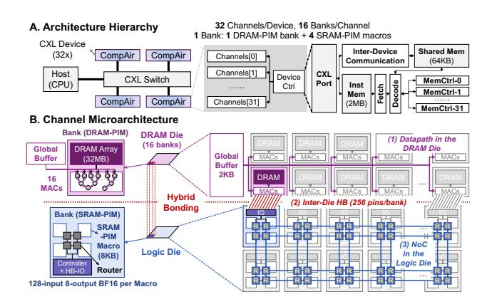

# *A. DRAM-PIM and SRAM-PIM Own Different Advantages*

DRAM-PIM and SRAM-PIM have their own advantages and disadvantages in different linear operations. Fig. 3 takes Llama2-7B as the example.

Fig. 3. Comparison between DRAM-PIM [43], pure SRAM-PIM [14] and SRAM-PIM stacking DRAM in decoding. (A) Pure SRAM-PIMs compute all FC layers with different models in a fully weight-stationary manner; the power and macro number are both unacceptable. The calculations in the figure are based on the maximum power consumption of the A100, which is 400W. Under actual measurements with Llama2-13b, the average power consumption at 76% compute utilization is 257W, with Llama2-7b at 60% utilization, the power consumption is 191W in BF16. (B) and (C) set four 8KB SRAM-PIM macros for each DRAM bank in Q/K/V and SV.

*Pure SRAM-PIMs are impractical for LLMs.* As demonstrated in Fig. 3A, implementing GPT3-175B solely with SRAM-PIM would require an infeasible number of macros and exceed the power consumption of an NVIDIA A100 GPU by three orders of magnitude even for only FC layers. This indicates the importance of extending the DRAM bank for SRAM-PIM, which is the focus of the subsequent analysis, and pure SRAM-PIM will not be taken into consideration, but then DRAM bandwidth becomes the critical bottleneck.

One solution is to solve this problem by stacking DRAM on the logic die [82], so we further compare the performance of SRAM-PIM stacking DRAM and pure DRAM-PIM. In Fig. 3B, SRAM-PIM stacking DRAM offers no advantage over DRAM-PIM due to overheads associated with frequent weight writes when batch=1. However, at batch size=32, SRAM-PIM stacking DRAM achieves a 6.3× speedup over DRAM-PIM, capitalizing on its superior weight reuse. This aligns with the expected shift from memory-bound GeMV to compute-bound GeMM behavior in Q/K/V projection as batch size grows.

Unfortunately, this feature can not apply to all linear operators in LLM. In QKT and SV , KT and V are input-dependent and dynamically shaped by sequence length, making them unsuitable for SRAM-PIM due to frequent weight reloading. As Fig. 3C shows, SRAM-PIM stacking DRAM underperforms DRAM-PIM for SV , just like batch=1 in Fig. 3B.

In summary, these results show SRAM-PIM stacking outperforms DRAM-PIM significantly for batched FC layers. However, gains vary across LLM workloads due to bandwidth, thermal, and mapping constraints (further in section III).

#### B. Non-Linear Operations Cannot be Ignored

While prior research has predominantly focused on optimizing linear operations, non-linear operations are becoming a significant bottleneck in long-context LLM inference. Three strategies are commonly employed to address non-linear computation: (i) Offloading non-linear operations to GPUs [57] or NPUs with dedicated NLUs [18]. (ii) Centralized NLUs and CPUs located outside of the DRAM-PIM channels [13], [40] (Fig. 4A). (iii) Distributed NLUs near each bank (Fig. 4B).

Fig. 4. Non-linear overhead is not negligible. (A) Having all channels share the same NLU results in a lot of data movement between the NLU and each channel. (B) Tailoring NLU within each channel or bank incurs an area cost. (C) The proportion of non-linear operation in the transformer. (D) Extra data movement for non-linear operations in DRAM-PIM [13].

Method (i) depends on high-performance GPUs. While CENT [1] shows method (iii) faces challenges from diverse non-linear operators in LLMs: NLUs require significant area: 4.4mm2 (7nm) [13] - 4× larger than a 32MB DRAM bank [43]. Thus, method (ii) has been typically preferred under area/power constraints. Yet, the increasing adoption of longcontext reasoning in LLMs, supporting up to 128K tokens [78], [79], is challenging this idea. Our analysis based on pure DRAM-PIM [13] with centralized NLU demonstrates a significant performance bottlenecks. At a 4K token sequence length, non-linear operations (such as Softmax, whose latency scales with the sequence length) account for about 20% of the total execution time of the transformer block (Fig. 4C). Moreover, these non-linear operations impose substantial communication costs due to the required reduction and broadcasting across memory banks and channels. Fig. 4D shows that in longcontext scenarios, DRAM-PIM non-linear computation overheads can exceed 25% of total inference time. This contradicts the assumption that non-linear ops can be omitted, revealing them as quantifiable bottlenecks: at 4K sequence length, nonlinear communication and computation together account for >20% of block execution time (Fig. 4C-D) at scale. New architectural non-linear support is needed for efficient LLM.

Fig. 5. Architecture of CompAir.

#### III. COMPAIR ARCHITECTURE

In section II, we identified key performance bottlenecks in existing LLM-oriented DRAM-PIM and SRAM-PIM stacking DRAM architectures, motivating our proposal of a hybrid PIM system that integrates both DRAM-PIM and SRAM-PIM technologies. Fig. 5 presents the architecture of CompAir.

This section focuses on the challenges and innovations underpinning the hybrid DRAM-PIM and SRAM-PIM integration. In CompAir, we adopt CLX.io and CXL.mem in the CXL protocols to enable scalable communication. A total of 32 PIM-enabled devices are connected via the CXL switch (Fig. 5A) [16]. Each device hosts a lightweight controller with instruction and shared memory. Unlike prior designs [13], [40], CompAir's device controllers are only responsible for instruction issuance and do not contain the non-linear execution units. Within each device, the controller controls 32 independent memory channels, each containing 16 CompAir banks composed of tightly integrated DRAM-PIM and SRAM-PIM with hybird bonding (Fig. 5B). The design integrates a DRAM die with DRAM-PIM and a logic die with SRAM-PIM macros, HB I/Os, and a NoC. Each DRAM-PIM bank includes a 16-input BF16 MAC unit, with inter-bank communication through a global buffer. In the logic die, each SRAM-PIM bank comprises four SRAM-PIM macros and four routers. Routers in the logic die form the NoC and are connected in a 2D-mesh topology. DRAM-PIM and SRAM-PIM banks are paired 1:1 across dies, communicating through 256 bonds per bank.

To substantiate our design, we address three key issues for DRAM-PIM and SRAM-PIM integration guided by fabricated platforms [13], [14], [43]. These challenges include integration granularity (section III-A), hardware specification and feasibility (section III-B), and mapping constraints (section III-C). Finally, we demonstrate that targeted micro-architectural refinements to DRAM-PIM can yield substantial end-to-end performance gains (section III-D).

# *A. DRAM-PIM and SRAM-PIM Own Different Advantages*

DRAM-PIM and SRAM-PIM have their own advantages and disadvantages in different linear operations. Fig. 3 takes Llama2-7B as the example.

Fig. 3. Comparison between DRAM-PIM [43], pure SRAM-PIM [14] and SRAM-PIM stacking DRAM in decoding. (A) Pure SRAM-PIMs compute all FC layers with different models in a fully weight-stationary manner; the power and macro number are both unacceptable. The calculations in the figure are based on the maximum power consumption of the A100, which is 400W. Under actual measurements with Llama2-13b, the average power consumption at 76% compute utilization is 257W, with Llama2-7b at 60% utilization, the power consumption is 191W in BF16. (B) and (C) set four 8KB SRAM-PIM macros for each DRAM bank in Q/K/V and SV.

*Pure SRAM-PIMs are impractical for LLMs.* As demonstrated in Fig. 3A, implementing GPT3-175B solely with SRAM-PIM would require an infeasible number of macros and exceed the power consumption of an NVIDIA A100 GPU by three orders of magnitude even for only FC layers. This indicates the importance of extending the DRAM bank for SRAM-PIM, which is the focus of the subsequent analysis, and pure SRAM-PIM will not be taken into consideration, but then DRAM bandwidth becomes the critical bottleneck.

One solution is to solve this problem by stacking DRAM on the logic die [82], so we further compare the performance of SRAM-PIM stacking DRAM and pure DRAM-PIM. In Fig. 3B, SRAM-PIM stacking DRAM offers no advantage over DRAM-PIM due to overheads associated with frequent weight writes when batch=1. However, at batch size=32, SRAM-PIM stacking DRAM achieves a 6.3× speedup over DRAM-PIM, capitalizing on its superior weight reuse. This aligns with the expected shift from memory-bound GeMV to compute-bound GeMM behavior in Q/K/V projection as batch size grows.

Unfortunately, this feature can not apply to all linear operators in LLM. In QKT and SV , KT and V are input-dependent and dynamically shaped by sequence length, making them unsuitable for SRAM-PIM due to frequent weight reloading. As Fig. 3C shows, SRAM-PIM stacking DRAM underperforms DRAM-PIM for SV , just like batch=1 in Fig. 3B.

In summary, these results show SRAM-PIM stacking outperforms DRAM-PIM significantly for batched FC layers. However, gains vary across LLM workloads due to bandwidth, thermal, and mapping constraints (further in section III).

#### B. Non-Linear Operations Cannot be Ignored

While prior research has predominantly focused on optimizing linear operations, non-linear operations are becoming a significant bottleneck in long-context LLM inference. Three strategies are commonly employed to address non-linear computation: (i) Offloading non-linear operations to GPUs [57] or NPUs with dedicated NLUs [18]. (ii) Centralized NLUs and CPUs located outside of the DRAM-PIM channels [13], [40] (Fig. 4A). (iii) Distributed NLUs near each bank (Fig. 4B).

Fig. 4. Non-linear overhead is not negligible. (A) Having all channels share the same NLU results in a lot of data movement between the NLU and each channel. (B) Tailoring NLU within each channel or bank incurs an area cost. (C) The proportion of non-linear operation in the transformer. (D) Extra data movement for non-linear operations in DRAM-PIM [13].

Method (i) depends on high-performance GPUs. While CENT [1] shows method (iii) faces challenges from diverse non-linear operators in LLMs: NLUs require significant area: 4.4mm2 (7nm) [13] - 4× larger than a 32MB DRAM bank [43]. Thus, method (ii) has been typically preferred under area/power constraints. Yet, the increasing adoption of longcontext reasoning in LLMs, supporting up to 128K tokens [78], [79], is challenging this idea. Our analysis based on pure DRAM-PIM [13] with centralized NLU demonstrates a significant performance bottlenecks. At a 4K token sequence length, non-linear operations (such as Softmax, whose latency scales with the sequence length) account for about 20% of the total execution time of the transformer block (Fig. 4C). Moreover, these non-linear operations impose substantial communication costs due to the required reduction and broadcasting across memory banks and channels. Fig. 4D shows that in longcontext scenarios, DRAM-PIM non-linear computation overheads can exceed 25% of total inference time. This contradicts the assumption that non-linear ops can be omitted, revealing them as quantifiable bottlenecks: at 4K sequence length, nonlinear communication and computation together account for >20% of block execution time (Fig. 4C-D) at scale. New architectural non-linear support is needed for efficient LLM.

Fig. 5. Architecture of CompAir.

#### III. COMPAIR ARCHITECTURE

In section II, we identified key performance bottlenecks in existing LLM-oriented DRAM-PIM and SRAM-PIM stacking DRAM architectures, motivating our proposal of a hybrid PIM system that integrates both DRAM-PIM and SRAM-PIM technologies. Fig. 5 presents the architecture of CompAir.

This section focuses on the challenges and innovations underpinning the hybrid DRAM-PIM and SRAM-PIM integration. In CompAir, we adopt CLX.io and CXL.mem in the CXL protocols to enable scalable communication. A total of 32 PIM-enabled devices are connected via the CXL switch (Fig. 5A) [16]. Each device hosts a lightweight controller with instruction and shared memory. Unlike prior designs [13], [40], CompAir's device controllers are only responsible for instruction issuance and do not contain the non-linear execution units. Within each device, the controller controls 32 independent memory channels, each containing 16 CompAir banks composed of tightly integrated DRAM-PIM and SRAM-PIM with hybird bonding (Fig. 5B). The design integrates a DRAM die with DRAM-PIM and a logic die with SRAM-PIM macros, HB I/Os, and a NoC. Each DRAM-PIM bank includes a 16-input BF16 MAC unit, with inter-bank communication through a global buffer. In the logic die, each SRAM-PIM bank comprises four SRAM-PIM macros and four routers. Routers in the logic die form the NoC and are connected in a 2D-mesh topology. DRAM-PIM and SRAM-PIM banks are paired 1:1 across dies, communicating through 256 bonds per bank.

To substantiate our design, we address three key issues for DRAM-PIM and SRAM-PIM integration guided by fabricated platforms [13], [14], [43]. These challenges include integration granularity (section III-A), hardware specification and feasibility (section III-B), and mapping constraints (section III-C). Finally, we demonstrate that targeted micro-architectural refinements to DRAM-PIM can yield substantial end-to-end performance gains (section III-D).

