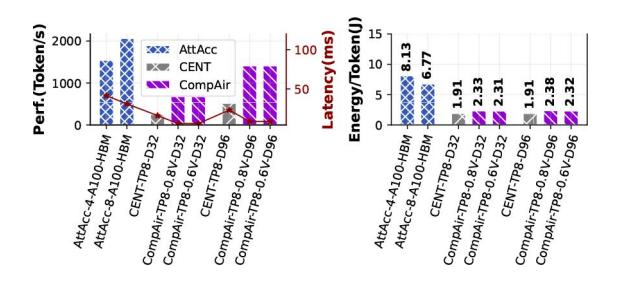

# A. End-to-End Performance

Fig. 17. Energy per token and performance analysis (Batch=64, Decode, Seqlen=128K) between CompAir, CENT (GDDR6-PIM) [13], and AttAcc (Nvidia A100 GPU + HBM-PIM) [57] with GPT3-175B [56]. "AttAcc-4-A100-HBM" refers to 4 80GB A100 and 4 16GB HBM3-PIM devices.

Firstly, we conduct an overall evaluation of CompAir's latency, throughput, and energy consumption. The results

&lt;sup>2Open-sourced code: https://github.com/Man0xbfc00380/comp-air.git

&lt;sup>3We use AttAcc's original simulator, with HBM-PIM emulated by [49] and A100 performance derived from formulas.

are shown in Fig. 17, where we evaluated CENT and CompAir according to the 32 device and 96 device cases, respectively. The full pipeline parallelism (PP) approach is used in the original CENT and AttAcc comparison experiments [13], but our experiments find that this causes a significant increase in the latency of individual tokens. Therefore, we choose a relatively balanced configuration of 8-device tensor parallelism (TP=8). The results show that CompAir achieves better throughput and latency than CENT for 32- and 96-device scaling in the same configuration. The throughput of 96 devices is comparable to the throughput of Attacc (4 A100s and 4 HBMs), but the latency and energy consumption per token are only 20.2% and 28.5% of AttAcc in a 4K context. In details, Fig. 17A shows that CompAir achieves almost equal proportional latency and throughput performance gains compared to the equivalent parallel strategy of CENT (TP=8). In Fig. 17B, CompAir increases energy compared to pure DRAM-PIM due to crossdie communication. Optimizing the DRAM-PIM/SRAM-PIM ratio enables latency gains with modest energy overhead versus DRAM-PIM-only, but excessive use of SRAM-PIM risks high energy costs (further analyzed in Fig. 26).

Next, we perform ablation experiments, sensitivity analysis and cost analysis of CompAir's performance gains. For simplicity, we use CENT as the baseline and disassemble the performance as: *(i)* CENT\_Curry\_ALU: the full DRAM-PIM system combined with the localized Curry ALU. *(ii)* CompAir\_Base: enabling SRAM-PIM but not modifying the DRAM-PIM's column decoder. *(iii)* CompAir\_Opt: optimized CompAir with optimized decoupled column decoder.

Fig. 18. Llama2-70B (Up) and Llama2-7B (Down) throughput evaluation with difference batch sizes and sequence length for decode stage.

In Fig. 18, the decode of Llama2-70B and Llama2-7B are used as an example to demonstrate the throughput benifit of CompAir under different sequence lengths and batch sizes. The results show that at batch size of 1, the introduction of SRAM-PIM does not bring better performance gain because the data reuse opportunity is limited. When the batch size increases significantly, this advantage increases significantly and reaches a greater improvement of more than 2.67-6.28× throughput in 64 batches. As the sequence length increases, the relative throughput advantage stabilizes at approximately 2.5×, indicating limited overall improvement. However, the contribution from the Curry ALU becomes more significant for longer sequence length. We will further analyze the performance in scenarios with very long context in Fig. 21.

Fig. 19. Prefill stage with 0.5K generation length.

Fig. 19 presents the performance of the compute-intensive prefill. With a 0.5K length, the SRAM-based PIM architecture achieves significant improvements ranging from 3.29× to 5.46× across various models. Furthermore, augmenting the DRAM read-out bandwidth yields additional performance gains, elevating the speedup ratio to between 4.1× and 7.89×. The performance gains of CompAir-NoC are limited in the short context, when the costs of data movement and non-linear computation are not bottlenecks.

To investigate the impact of parallelism strategies, we systematically evaluate various TP configurations from 1 to 32 devices. Our analysis reveals that both DRAM-PIM and CompAir exhibit latency convergence at high TP degrees due to substantially reduced bank utilization (Fig. 20). We have illustrated in Fig. 17 that larger TP configurations also incur significant throughput degradation. Consequently, we establish TP≤8 as the optimal configuration range for most models. Within this range, CompAir maintains notable performance advantages, delivering 1.5-2.14× end-to-end speedup in Llama2-13B. Results show SRAM-PIM's performance edge over DRAM-PIM stems from better data reuse. Increasing parallelism reduces this advantage by limiting reuse per bank, but also leads to an increase in data movement, when the latency reduction from CompAir-NoC becomes more significant.

Fig. 20. TP with Llama2-13B. (A) The bank utilization drops rapidly for large TP. (B) The impact of TP on latency (Batch=64, Decode, Seqlen=4K).

Such analysis draws a preliminary conclusion that SRAM-PIM can bring significant latency advantage for multi-batch scenarios, but the sequence length above are still within 10K. Fig. 21 further test long sequence scenarios with 128K decode and 8K prefill. For GPT3-175B and Qwen-72B, CompAir can bring 2.13-2.73× improvement in the decode stage, thus illustrating the potential performance benefits of CompAir

Fig. 21. Long context with Qwen-72B [79], GPT3-175B [56] with 128K sequence and 8K generation length (left bar: CENT, right bar: CompAir).

for the long sequence. Moreover, the proportion of nonlinear operation increases significantly, revealing the benifits of CompAir-NoC when the context length increases. CompAir-NoC reduces the non-linear latency manifestly.

In all, hybrid SRAM-PIM and DRAM-PIM in CompAir exhibits significant improvement in prefill and multi-batch decode, while CompAir-NoC greatly optimizes long-context inference. *CompAir offers considerable latency optimization for both MHA-bottleneck and FFN-bottleneck scenarios*.

# A. End-to-End Performance

Fig. 17. Energy per token and performance analysis (Batch=64, Decode, Seqlen=128K) between CompAir, CENT (GDDR6-PIM) [13], and AttAcc (Nvidia A100 GPU + HBM-PIM) [57] with GPT3-175B [56]. "AttAcc-4-A100-HBM" refers to 4 80GB A100 and 4 16GB HBM3-PIM devices.

Firstly, we conduct an overall evaluation of CompAir's latency, throughput, and energy consumption. The results

&lt;sup>2Open-sourced code: https://github.com/Man0xbfc00380/comp-air.git

&lt;sup>3We use AttAcc's original simulator, with HBM-PIM emulated by [49] and A100 performance derived from formulas.

are shown in Fig. 17, where we evaluated CENT and CompAir according to the 32 device and 96 device cases, respectively. The full pipeline parallelism (PP) approach is used in the original CENT and AttAcc comparison experiments [13], but our experiments find that this causes a significant increase in the latency of individual tokens. Therefore, we choose a relatively balanced configuration of 8-device tensor parallelism (TP=8). The results show that CompAir achieves better throughput and latency than CENT for 32- and 96-device scaling in the same configuration. The throughput of 96 devices is comparable to the throughput of Attacc (4 A100s and 4 HBMs), but the latency and energy consumption per token are only 20.2% and 28.5% of AttAcc in a 4K context. In details, Fig. 17A shows that CompAir achieves almost equal proportional latency and throughput performance gains compared to the equivalent parallel strategy of CENT (TP=8). In Fig. 17B, CompAir increases energy compared to pure DRAM-PIM due to crossdie communication. Optimizing the DRAM-PIM/SRAM-PIM ratio enables latency gains with modest energy overhead versus DRAM-PIM-only, but excessive use of SRAM-PIM risks high energy costs (further analyzed in Fig. 26).

Next, we perform ablation experiments, sensitivity analysis and cost analysis of CompAir's performance gains. For simplicity, we use CENT as the baseline and disassemble the performance as: *(i)* CENT\_Curry\_ALU: the full DRAM-PIM system combined with the localized Curry ALU. *(ii)* CompAir\_Base: enabling SRAM-PIM but not modifying the DRAM-PIM's column decoder. *(iii)* CompAir\_Opt: optimized CompAir with optimized decoupled column decoder.

Fig. 18. Llama2-70B (Up) and Llama2-7B (Down) throughput evaluation with difference batch sizes and sequence length for decode stage.

In Fig. 18, the decode of Llama2-70B and Llama2-7B are used as an example to demonstrate the throughput benifit of CompAir under different sequence lengths and batch sizes. The results show that at batch size of 1, the introduction of SRAM-PIM does not bring better performance gain because the data reuse opportunity is limited. When the batch size increases significantly, this advantage increases significantly and reaches a greater improvement of more than 2.67-6.28× throughput in 64 batches. As the sequence length increases, the relative throughput advantage stabilizes at approximately 2.5×, indicating limited overall improvement. However, the contribution from the Curry ALU becomes more significant for longer sequence length. We will further analyze the performance in scenarios with very long context in Fig. 21.

Fig. 19. Prefill stage with 0.5K generation length.

Fig. 19 presents the performance of the compute-intensive prefill. With a 0.5K length, the SRAM-based PIM architecture achieves significant improvements ranging from 3.29× to 5.46× across various models. Furthermore, augmenting the DRAM read-out bandwidth yields additional performance gains, elevating the speedup ratio to between 4.1× and 7.89×. The performance gains of CompAir-NoC are limited in the short context, when the costs of data movement and non-linear computation are not bottlenecks.

To investigate the impact of parallelism strategies, we systematically evaluate various TP configurations from 1 to 32 devices. Our analysis reveals that both DRAM-PIM and CompAir exhibit latency convergence at high TP degrees due to substantially reduced bank utilization (Fig. 20). We have illustrated in Fig. 17 that larger TP configurations also incur significant throughput degradation. Consequently, we establish TP≤8 as the optimal configuration range for most models. Within this range, CompAir maintains notable performance advantages, delivering 1.5-2.14× end-to-end speedup in Llama2-13B. Results show SRAM-PIM's performance edge over DRAM-PIM stems from better data reuse. Increasing parallelism reduces this advantage by limiting reuse per bank, but also leads to an increase in data movement, when the latency reduction from CompAir-NoC becomes more significant.

Fig. 20. TP with Llama2-13B. (A) The bank utilization drops rapidly for large TP. (B) The impact of TP on latency (Batch=64, Decode, Seqlen=4K).

Such analysis draws a preliminary conclusion that SRAM-PIM can bring significant latency advantage for multi-batch scenarios, but the sequence length above are still within 10K. Fig. 21 further test long sequence scenarios with 128K decode and 8K prefill. For GPT3-175B and Qwen-72B, CompAir can bring 2.13-2.73× improvement in the decode stage, thus illustrating the potential performance benefits of CompAir

Fig. 21. Long context with Qwen-72B [79], GPT3-175B [56] with 128K sequence and 8K generation length (left bar: CENT, right bar: CompAir).

for the long sequence. Moreover, the proportion of nonlinear operation increases significantly, revealing the benifits of CompAir-NoC when the context length increases. CompAir-NoC reduces the non-linear latency manifestly.

In all, hybrid SRAM-PIM and DRAM-PIM in CompAir exhibits significant improvement in prefill and multi-batch decode, while CompAir-NoC greatly optimizes long-context inference. *CompAir offers considerable latency optimization for both MHA-bottleneck and FFN-bottleneck scenarios*.

