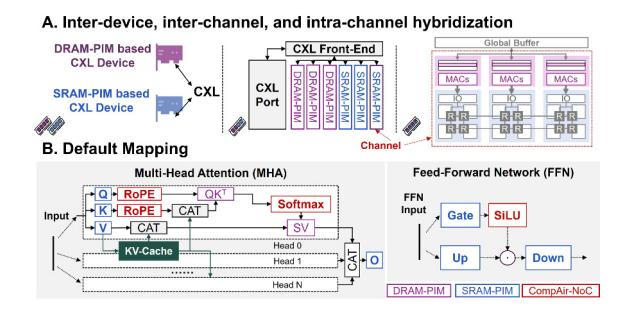

# A. Why Intra-Channel Hybridization?

A central design question is how can we achieve efficient heterogeneous integration of DRAM-PIM and SRAM-PIM

Fig. 6. Hybrid PIM concepts illustration.

to fully exploit their advantages. We explore three possible integration schemes: *(i)* inter-device hybridization, *(ii)* interchannel hybridization, and *(iii)* intra-channel hybridization as illustrated in Fig. 6A.

The first two schemes have strong limitations due to limited bandwidth. We have analyzed in Fig. 3, weight reloading is inevitable for SRAM-PIM, and we choose intra-channel hybridization to guarantee the bandwidth between SRAM and DRAM as shown in Fig. 5B. Taking AiM [43] as an example, the internal bandwidth of a single channel of DRAM is 512GB/s, while external I/O bandwidth is limited to 32GB/s. Even a 128-input, 8-output INT8 SRAM-PIM, operating at 16ns latency, demands 64GB/s to remain fully utilized.

Fig. 7. Hardware issues. (A) HB illustration. (B) The estimated power of one DRAM-PIM bank and 8KB SRAM-PIMs [14], [36], [80].

To resolve this, CompAir leverages HB [21] (Fig. 7A) for 3D integration, stacking SRAM-PIM macros under each DRAM-PIM bank. HB achieves bonding densities of 10K-100K interconnects per mm2 density with an energy cost of just 0.05-0.88pJ/b, which is over 200× more efficient than offchip HBM [52]. However, this architecture demands careful analysis at both hardware and software levels. Two questions remain: *(i)* Is this heterogeneous hybridization feasible under current hardware constraints (Sections III-B)? *(ii)* What are the mapping implications for efficient DRAM-PIM and SRAM-PIM collaboration (Sections III-C)? Fig. 6B offers a default mapping scheme before the deeper analysis.

# A. Why Intra-Channel Hybridization?

A central design question is how can we achieve efficient heterogeneous integration of DRAM-PIM and SRAM-PIM

Fig. 6. Hybrid PIM concepts illustration.

to fully exploit their advantages. We explore three possible integration schemes: *(i)* inter-device hybridization, *(ii)* interchannel hybridization, and *(iii)* intra-channel hybridization as illustrated in Fig. 6A.

The first two schemes have strong limitations due to limited bandwidth. We have analyzed in Fig. 3, weight reloading is inevitable for SRAM-PIM, and we choose intra-channel hybridization to guarantee the bandwidth between SRAM and DRAM as shown in Fig. 5B. Taking AiM [43] as an example, the internal bandwidth of a single channel of DRAM is 512GB/s, while external I/O bandwidth is limited to 32GB/s. Even a 128-input, 8-output INT8 SRAM-PIM, operating at 16ns latency, demands 64GB/s to remain fully utilized.

Fig. 7. Hardware issues. (A) HB illustration. (B) The estimated power of one DRAM-PIM bank and 8KB SRAM-PIMs [14], [36], [80].

To resolve this, CompAir leverages HB [21] (Fig. 7A) for 3D integration, stacking SRAM-PIM macros under each DRAM-PIM bank. HB achieves bonding densities of 10K-100K interconnects per mm2 density with an energy cost of just 0.05-0.88pJ/b, which is over 200× more efficient than offchip HBM [52]. However, this architecture demands careful analysis at both hardware and software levels. Two questions remain: *(i)* Is this heterogeneous hybridization feasible under current hardware constraints (Sections III-B)? *(ii)* What are the mapping implications for efficient DRAM-PIM and SRAM-PIM collaboration (Sections III-C)? Fig. 6B offers a default mapping scheme before the deeper analysis.

