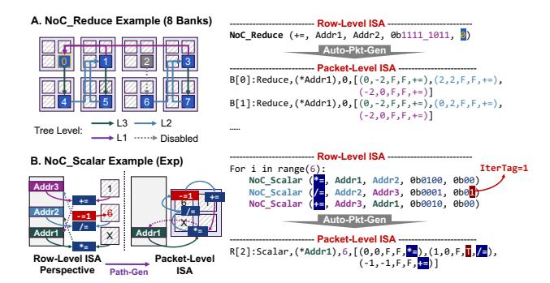

# *B. Autonomous ISA Translation*

Considering that our NoC packet inherently involves the simultaneous transmission of instructions and data movement within the shared physical path, to avoid ambiguity, this chapter discusses the two aspects separately: instruction translation at the compile stage and data transformation at the execution stage.

*1) Compile Stage Instruction Translation:* The two ISA layers are automatically translated by a host-side compiler before execution. Specifically, users program Row-Level ISA offline, and the host runtime performs static row→packet lowering before filling each bank's instruction buffer. The key challenge in cross-level translation is that the row-level ISA fixes the data path of "DRAM row→Curry ALU→DRAM row" and ignores NoC behaviors required by packet-level execution. Fig. 16 shows two typical transformations with NoC\_Reduce and NoC\_Scalar.

NoC\_Reduce needs to instantiate an instruction into separate packets for each bank according to the bank id. Since the structure of the reduction tree is fixed, we design a dedicated pattern shown in Fig. 16A for automatic conversion.

Fig. 16. ISA translation. (A) NoC\_Reduce in 8 banks. (B) NoC\_Scalar for the iteration of exponential function.

Our row-level ISA's conservative DRAM write-back for every NoC\_Scalar operation, while simplifying programming, incurs inefficiencies and restricts MIMD flexibility. Drawing from operator fusion techniques in compiler [2], [53], we introduce path generation, merging dependent NoC\_Scalar ops by chaining producer-consumer dependencies (DST → SRC). Compatible ops fuse into a single packet, encapsulating computation and communication. Each bank router then executes the fused op with one packet, drastically simplifying SRAM-PIM control logic as shown in Fig. 16B.

Under the splitting-by-input strategy for Qwen (8K sequence), the 27% increase in local DRAM-PIM instructions is diluted to a mere 2% at the system level, owing to the compact nature of NoC\_Reducewithin our hierarchical ISA.

2) Execution Stage Data Transformation: The above discussion describes the translation process from an instruction perspective. In the execution stage, however, the data and address granularity associated with a packet-level instruction is still a DRAM row, which typically exceeds the NoC bit width. This implies that a single packet-level instruction may correspond to the transmission of multiple NoC-level packets from the data perspective.

In CompAir, this issue remains transparent to the software. Our solution is to have the NoC router automatically serialize the data based on the data granularity and available bit width, breaking it into multiple packets. Upon completion of the computation, the NoC automatically deserializes the data and writes it back to DRAM at the row granularity. The benefit of the proposed design lies in its ability to automatically achieve pipelining across computations of different data packets, independent of instruction-level constraints.

#### VI. EVALUATION

CompAir2 is implemented with cycle-accurate simulators. The DRAM and NoC are simulated with ramulator2.0 [49] and Booksim [27]. The SRAM-PIM is based on the chip specifications from [14]. The inter-device communication and DRAM-PIM instruction execution are based on the CENT simulator [13]. To evaluate the area cost of CompAir-NoC,

TABLE III
HARDWARE CONFIGURATIONS FOR EVALUATION

| Component                 | Specification                                                                                                                                               |
|---------------------------|-------------------------------------------------------------------------------------------------------------------------------------------------------------|
| DRAM-PIM [13]          | 32MB/bank, 16 MACs/bank, BF16, $t_{RCDWR}\!\!=\!\!14$ ns $t_{RCDRD}\!\!=\!\!18$ ns, $t_{RAS}\!\!=\!\!27$ ns, $t_{CL}\!\!=\!\!25$ ns, $t_{RP}\!\!=\!\!16$ ns |
| SRAM-PIM [14]          | 64kb for each array, BF16, 4 arrays/bank $t_{access} = 6.8$ -14.1ns, 14.4-31.6TOPS/W (0.9-0.6V)                                                             |
| CompAir-NoC based on [39] | 4×16 2D-mesh, 2 BF16 Curry ALUs per router 1 adder/multiplier/divider per ALU, flit size: 72b                                                               |

we implement the RTL of CompAir-NoC and synthesize the corresponding area report with Synopsys Design Compiler. The UMC 28nm process library is used for evaluation.

For the choice of baseline, we compare CompAir against (i) pure DRAM-PIM (CENT [13]), (ii) SRAM-PIM stacking passive DRAM (as in Fig. 3), and (iii) AttAcc [57] with HBM-PIM and A100 hybrid architecture3. Ablations isolate (a) DRAM-PIM only, (b) hybrid without in-transit NoC compute (CENT\_Curry\_ALU), (c) hybrid with in-transit compute (CompAir). We test them with a number of different LLM models at different sequence lengths, batch sizes, and parallelism strategies, including the Llama series (7B, 13B, 70B) [73], Qwen-72B [79], and GPT3-175B [56]. The hardware configuration of CompAir is shown in Table III.

In the previous sections, our experiments demonstrate that (1) pure SRAM-PIM is unrealistic for LLM (Fig. 3A). (2) SRAM-PIM and DRAM-PIM have advantages in batched FC and Attention (Fig. 3B/C, 11, 26), and making it valuable to hybridize the two. (3) CompAir-NoC can eliminate data movement from centralized NLUs (Fig. 4). The issues we need to further validate are (1) how much improvement (Fig. 17,18, 26) and energy cost (Fig. 17, 26) hybrid PIM can bring compared to pure DRAM-PIM. (2) The impact of different LLM configurations on performance (Fig. 19-21,26). (3) Hardware cost and benefit (Fig. 23, 24) of CompAir-NoC.

# *B. Autonomous ISA Translation*

Considering that our NoC packet inherently involves the simultaneous transmission of instructions and data movement within the shared physical path, to avoid ambiguity, this chapter discusses the two aspects separately: instruction translation at the compile stage and data transformation at the execution stage.

*1) Compile Stage Instruction Translation:* The two ISA layers are automatically translated by a host-side compiler before execution. Specifically, users program Row-Level ISA offline, and the host runtime performs static row→packet lowering before filling each bank's instruction buffer. The key challenge in cross-level translation is that the row-level ISA fixes the data path of "DRAM row→Curry ALU→DRAM row" and ignores NoC behaviors required by packet-level execution. Fig. 16 shows two typical transformations with NoC\_Reduce and NoC\_Scalar.

NoC\_Reduce needs to instantiate an instruction into separate packets for each bank according to the bank id. Since the structure of the reduction tree is fixed, we design a dedicated pattern shown in Fig. 16A for automatic conversion.

Fig. 16. ISA translation. (A) NoC\_Reduce in 8 banks. (B) NoC\_Scalar for the iteration of exponential function.

Our row-level ISA's conservative DRAM write-back for every NoC\_Scalar operation, while simplifying programming, incurs inefficiencies and restricts MIMD flexibility. Drawing from operator fusion techniques in compiler [2], [53], we introduce path generation, merging dependent NoC\_Scalar ops by chaining producer-consumer dependencies (DST → SRC). Compatible ops fuse into a single packet, encapsulating computation and communication. Each bank router then executes the fused op with one packet, drastically simplifying SRAM-PIM control logic as shown in Fig. 16B.

Under the splitting-by-input strategy for Qwen (8K sequence), the 27% increase in local DRAM-PIM instructions is diluted to a mere 2% at the system level, owing to the compact nature of NoC\_Reducewithin our hierarchical ISA.

2) Execution Stage Data Transformation: The above discussion describes the translation process from an instruction perspective. In the execution stage, however, the data and address granularity associated with a packet-level instruction is still a DRAM row, which typically exceeds the NoC bit width. This implies that a single packet-level instruction may correspond to the transmission of multiple NoC-level packets from the data perspective.

In CompAir, this issue remains transparent to the software. Our solution is to have the NoC router automatically serialize the data based on the data granularity and available bit width, breaking it into multiple packets. Upon completion of the computation, the NoC automatically deserializes the data and writes it back to DRAM at the row granularity. The benefit of the proposed design lies in its ability to automatically achieve pipelining across computations of different data packets, independent of instruction-level constraints.

#### VI. EVALUATION

CompAir2 is implemented with cycle-accurate simulators. The DRAM and NoC are simulated with ramulator2.0 [49] and Booksim [27]. The SRAM-PIM is based on the chip specifications from [14]. The inter-device communication and DRAM-PIM instruction execution are based on the CENT simulator [13]. To evaluate the area cost of CompAir-NoC,

TABLE III
HARDWARE CONFIGURATIONS FOR EVALUATION

| Component                 | Specification                                                                                                                                               |
|---------------------------|-------------------------------------------------------------------------------------------------------------------------------------------------------------|
| DRAM-PIM [13]          | 32MB/bank, 16 MACs/bank, BF16, $t_{RCDWR}\!\!=\!\!14$ ns $t_{RCDRD}\!\!=\!\!18$ ns, $t_{RAS}\!\!=\!\!27$ ns, $t_{CL}\!\!=\!\!25$ ns, $t_{RP}\!\!=\!\!16$ ns |
| SRAM-PIM [14]          | 64kb for each array, BF16, 4 arrays/bank $t_{access} = 6.8$ -14.1ns, 14.4-31.6TOPS/W (0.9-0.6V)                                                             |
| CompAir-NoC based on [39] | 4×16 2D-mesh, 2 BF16 Curry ALUs per router 1 adder/multiplier/divider per ALU, flit size: 72b                                                               |

we implement the RTL of CompAir-NoC and synthesize the corresponding area report with Synopsys Design Compiler. The UMC 28nm process library is used for evaluation.

For the choice of baseline, we compare CompAir against (i) pure DRAM-PIM (CENT [13]), (ii) SRAM-PIM stacking passive DRAM (as in Fig. 3), and (iii) AttAcc [57] with HBM-PIM and A100 hybrid architecture3. Ablations isolate (a) DRAM-PIM only, (b) hybrid without in-transit NoC compute (CENT\_Curry\_ALU), (c) hybrid with in-transit compute (CompAir). We test them with a number of different LLM models at different sequence lengths, batch sizes, and parallelism strategies, including the Llama series (7B, 13B, 70B) [73], Qwen-72B [79], and GPT3-175B [56]. The hardware configuration of CompAir is shown in Table III.

In the previous sections, our experiments demonstrate that (1) pure SRAM-PIM is unrealistic for LLM (Fig. 3A). (2) SRAM-PIM and DRAM-PIM have advantages in batched FC and Attention (Fig. 3B/C, 11, 26), and making it valuable to hybridize the two. (3) CompAir-NoC can eliminate data movement from centralized NLUs (Fig. 4). The issues we need to further validate are (1) how much improvement (Fig. 17,18, 26) and energy cost (Fig. 17, 26) hybrid PIM can bring compared to pure DRAM-PIM. (2) The impact of different LLM configurations on performance (Fig. 19-21,26). (3) Hardware cost and benefit (Fig. 23, 24) of CompAir-NoC.

