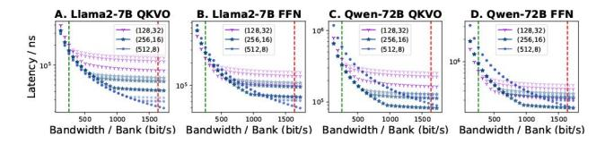
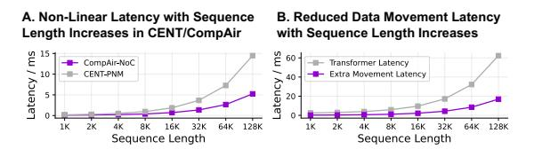
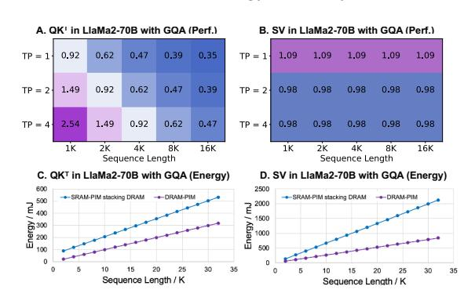

# *B. Micro-Architectural Evaluation*

Then we focus on analyzing the microarchitecture.

Fig. 22. DSE of SRAM-PIM in CompAir. The lighter dots mark the latency at lower voltages (0.6V-0.8V).

Fig. 22 further provides a design space exploration (DSE) of SRAM-PIM in CompAir. In each subfigure, the green line marks the bandwidth in 32MB GDDR for each bank, and the red line marks the maximum bandwidth offered by HB (6.4 Gbps). In this paper, we find that different macro configuration shapes produce a divergence point, before which different voltage configurations of SRAM-PIM do not affect the final performance since the latency is mainly affected by the input bandwidth. After the divergence point, SRAM-PIM latency becomes the dominant factor. The relative latency across configurations varies by workload, with wider inputs performing better under higher bandwidths.

Fig. 23. Area overhead of Curry ALU.

Fig. 23 evaluates CompAir's area cost. The results show that the area of SRAM-PIM and Router per bank is 0.8195mm2 , which satisfies the 3D stacking requirement of DRAM-PIM, and Curry ALU's area cost is only 2.94% of router area. We further compare the logic and memory resources used after synthesis of four Curry ALUs and one customized 16-input Softmax hardware unit with Vivado in Fig. 23B. The results show that the Curry ALUs use significantly less resources because computation in NoCs essentially performs stream processing to significantly reduce buffer usage. The latency profits are also significant (Fig. 24), as we specifically compare Curry ALUs to centralized non-linear computation units, compressing the total latency of non-linear computation by 30% and optimizing long context latency by 25%.

Fig. 24. Latency profits from Curry ALU.

Fig. 25 evaluates the effectiveness of path generation. Base means that the data stream only supports SIMD style: IO buffer→Curry ALU→IO buffer. Taking advantage of the NoC flexibility, a latency optimization of 33%-50% can be achieved compared to the row-level ISA without path generation.

Fig. 25. Latency profits from path generation.

Furthermore, to empirically validate that our proposed BF16-based architecture and the Taylor-expansion-based approximation of transcendental functions do not degrade the network's computational performance, we conduct additional perplexity evaluations on Llama2-7B across varying sequence lengths. As reported in Table IV, the perplexity scores achieved by our approximate implementations (Taylor truncation orders n = 4 to n = 7) exhibit negligible deviations from both the FP32 and native BF16 baselines. Specifically, the relative perplexity differences remain bounded within 0.3% across all evaluated configurations, with the most notable deviation observed on medium-length sequences (−0.251% for n = 5 to n = 7 relative to FP32). Importantly, the approximation errors do not exhibit observable accumulation as the context length increases from short to long sequences, as evidenced by the stable perplexity on long-context test cases. These findings demonstrate that the proposed lowprecision arithmetic with Taylor-truncated exponential computation preserves the model's predictive accuracy, confirming the practical viability of our hardware-efficient approach for LLM deployment.

TABLE IV Perplexity Evaluation: native vs Taylor-truncated  $e^x$  in BF16 (n represents  $1+...+\frac{x^n}{n!}$ ) with Llama2-7B.

| Case   | Prefill | Decode | Float   | BF16 Native | BF16, n=4         | BF16, n=5         | BF16, n=6         | BF16, n=7         |
|--------|---------|--------|---------|-------------|-------------------|-------------------|-------------------|-------------------|
| Short  | 73      | 15     | 27.2971 | 26.9695     | 27.3128 (+0.058%) | 27.3128 (+0.058%) | 27.3128 (+0.058%) | 27.3128 (+0.058%) |
| Medium | 341     | 65     | 13.7466 | 13.6848     | 13.7138 (-0.239%) | 13.7121 (-0.251%) | 13.7121 (-0.251%) | 13.7121 (-0.251%) |
| Long   | 1139    | 270    | 8.5386  | 8.5490      | 8.5494 (+0.126%)  | 8.5475 (+0.104%)  | 8.5495 (+0.127%)  | 8.5495 (+0.127%)  |

CompAir processes attention via DRAM-PIM since  $K^T/V$ lacks batch reuse in MLA/MHA. However,  $K^T/V$  are shared by GQA in LlaMa2-70B/Llama3 [73], enabling SRAM-PIM to accelerate attention. Fig. 26A,B compare DRAM-PIM and SRAM-PIM stacking DRAM under varying sequence lengths and TPs. TP splits  $K^T/V$  along the sequence length dimension across banks. For SRAM-PIM, the sequence length maps to batch size, while the output dimension aligns with GQA's group size (8 in LlaMa2-70B), with input dimensions determined by hidden  $size(QK^T)$  or sequence length(SV). However, Fig. 26C,D demonstrate that longer sequence length inevitably results in more cross-die data transfers and higher energy when using SRAM-PIM. For GQA, whether  $QK^T$  uses SRAM-PIM for better performance depends on the specific parallelism strategy and sequence length, but for SV DRAM-PIM still has a significant energy advantage. We thus propose: (1) SRAM-PIM for batched FC (better performance) and (2) DRAM-PIM for attention (energy efficiency).

Fig. 26. (A,B) Latency ratio between SRAM-PIM stacking DRAM and pure DRAM-PIM. Purple/blue indicate that DRAM-PIM/SRAM-PIM stacking DRAM is better. (C,D) Energy of SRAM-PIM stacking DRAM and pure DRAM-PIM, which mostly comes from data movement and data access.

 $\label{thm:components} TABLE\ V$  Design goals of the three computable components.

| Component   | Goal        | Granularity | Communication   |
|-------------|-------------|-------------|-----------------|
| DRAM-PIM    | Scalability | Vector      | Shared Memory   |
| SRAM-PIM    | Efficiency  | Matrix      | Intra-Bank Only |
| CompAir-NoC | Flexibility | Scalar      | Inter-Bank      |

Furthermore, CompAir's value lies not only in demonstrating that PIM can achieve competitive energy-efficiency and performance for LLM, but also in proposing a scalable data-centric system. Table V summarizes the significance and design goals of the three computable components in CompAir:

data handling is inherently unavoidable in computational systems, and it is important to try to allow computation to occur naturally and at minimal cost in the process of data handling.

#### VII. RELATED WORKS

Commercial DRAM-PIM systems emerge, including FIM-DRAM [41], UPMEM [7], and AiM [43] systems. DRAM-PIM can perform massive parallel computing using SIMD vector operations up to 32KB [55], latest architectures leverage DRAM-PIM for memory-bound tasks in the LLM [13], [18], [40], [64], [67]. To further extend the bandwidth, [9], [11], [37], [42], [57], [57] implement multi-layer DRAM banks vertically via 3D Memory. However, massive SIMD parallelism raises flexibility overhead, and the performance of DRAM-PIM heavily rely on suitable mapping and programming [34], [66], the mismatch causes performance degradation due to inter-bank communication and layout rearrangement [48], [71], [84]. The SRAM-PIM, by integrating the compute logic in/near the SRAM array, enables matrix computation with lowlatency in 10ns and 100 TFLOPS/W power efficiency [76], [81]. However, the size of a single macro of SRAM-PIM is limited [29], and the performance advantage depends on efficient weight reuse. Moreover, the matrix in attention varies in each inference. SRAM-PIM suffers from frequent swap-outs and can hardly achieve a good performance. In all, DRAM-PIM and SRAM-PIM are all promising technologies with different advantages; previous works also try to be compatible with the advantages of the both [8], [10].

In-transit computing has been pioneered in general-purpose processors with two goals: (i) offloading CPU workloads [61], (ii) reducing the data movement [23], [58]. In-network collectives and reduction in interconnects have also been studied to reduce latency and traffic. A similar idea has emerged in memory systems, with the objective of performing computation while data is moved across memory hierarchies [48], [63], thus avoiding the need for all data to be frequently shuttled between DRAM and CPU pipelines. CompAir-NoC draws on the ideas of novel microarchitecture design, as the first attempt for LLM and PIMs.

# *B. Micro-Architectural Evaluation*

Then we focus on analyzing the microarchitecture.

Fig. 22. DSE of SRAM-PIM in CompAir. The lighter dots mark the latency at lower voltages (0.6V-0.8V).

Fig. 22 further provides a design space exploration (DSE) of SRAM-PIM in CompAir. In each subfigure, the green line marks the bandwidth in 32MB GDDR for each bank, and the red line marks the maximum bandwidth offered by HB (6.4 Gbps). In this paper, we find that different macro configuration shapes produce a divergence point, before which different voltage configurations of SRAM-PIM do not affect the final performance since the latency is mainly affected by the input bandwidth. After the divergence point, SRAM-PIM latency becomes the dominant factor. The relative latency across configurations varies by workload, with wider inputs performing better under higher bandwidths.

Fig. 23. Area overhead of Curry ALU.

Fig. 23 evaluates CompAir's area cost. The results show that the area of SRAM-PIM and Router per bank is 0.8195mm2 , which satisfies the 3D stacking requirement of DRAM-PIM, and Curry ALU's area cost is only 2.94% of router area. We further compare the logic and memory resources used after synthesis of four Curry ALUs and one customized 16-input Softmax hardware unit with Vivado in Fig. 23B. The results show that the Curry ALUs use significantly less resources because computation in NoCs essentially performs stream processing to significantly reduce buffer usage. The latency profits are also significant (Fig. 24), as we specifically compare Curry ALUs to centralized non-linear computation units, compressing the total latency of non-linear computation by 30% and optimizing long context latency by 25%.

Fig. 24. Latency profits from Curry ALU.

Fig. 25 evaluates the effectiveness of path generation. Base means that the data stream only supports SIMD style: IO buffer→Curry ALU→IO buffer. Taking advantage of the NoC flexibility, a latency optimization of 33%-50% can be achieved compared to the row-level ISA without path generation.

Fig. 25. Latency profits from path generation.

Furthermore, to empirically validate that our proposed BF16-based architecture and the Taylor-expansion-based approximation of transcendental functions do not degrade the network's computational performance, we conduct additional perplexity evaluations on Llama2-7B across varying sequence lengths. As reported in Table IV, the perplexity scores achieved by our approximate implementations (Taylor truncation orders n = 4 to n = 7) exhibit negligible deviations from both the FP32 and native BF16 baselines. Specifically, the relative perplexity differences remain bounded within 0.3% across all evaluated configurations, with the most notable deviation observed on medium-length sequences (−0.251% for n = 5 to n = 7 relative to FP32). Importantly, the approximation errors do not exhibit observable accumulation as the context length increases from short to long sequences, as evidenced by the stable perplexity on long-context test cases. These findings demonstrate that the proposed lowprecision arithmetic with Taylor-truncated exponential computation preserves the model's predictive accuracy, confirming the practical viability of our hardware-efficient approach for LLM deployment.

TABLE IV Perplexity Evaluation: native vs Taylor-truncated  $e^x$  in BF16 (n represents  $1+...+\frac{x^n}{n!}$ ) with Llama2-7B.

| Case   | Prefill | Decode | Float   | BF16 Native | BF16, n=4         | BF16, n=5         | BF16, n=6         | BF16, n=7         |
|--------|---------|--------|---------|-------------|-------------------|-------------------|-------------------|-------------------|
| Short  | 73      | 15     | 27.2971 | 26.9695     | 27.3128 (+0.058%) | 27.3128 (+0.058%) | 27.3128 (+0.058%) | 27.3128 (+0.058%) |
| Medium | 341     | 65     | 13.7466 | 13.6848     | 13.7138 (-0.239%) | 13.7121 (-0.251%) | 13.7121 (-0.251%) | 13.7121 (-0.251%) |
| Long   | 1139    | 270    | 8.5386  | 8.5490      | 8.5494 (+0.126%)  | 8.5475 (+0.104%)  | 8.5495 (+0.127%)  | 8.5495 (+0.127%)  |

CompAir processes attention via DRAM-PIM since  $K^T/V$ lacks batch reuse in MLA/MHA. However,  $K^T/V$  are shared by GQA in LlaMa2-70B/Llama3 [73], enabling SRAM-PIM to accelerate attention. Fig. 26A,B compare DRAM-PIM and SRAM-PIM stacking DRAM under varying sequence lengths and TPs. TP splits  $K^T/V$  along the sequence length dimension across banks. For SRAM-PIM, the sequence length maps to batch size, while the output dimension aligns with GQA's group size (8 in LlaMa2-70B), with input dimensions determined by hidden  $size(QK^T)$  or sequence length(SV). However, Fig. 26C,D demonstrate that longer sequence length inevitably results in more cross-die data transfers and higher energy when using SRAM-PIM. For GQA, whether  $QK^T$  uses SRAM-PIM for better performance depends on the specific parallelism strategy and sequence length, but for SV DRAM-PIM still has a significant energy advantage. We thus propose: (1) SRAM-PIM for batched FC (better performance) and (2) DRAM-PIM for attention (energy efficiency).

Fig. 26. (A,B) Latency ratio between SRAM-PIM stacking DRAM and pure DRAM-PIM. Purple/blue indicate that DRAM-PIM/SRAM-PIM stacking DRAM is better. (C,D) Energy of SRAM-PIM stacking DRAM and pure DRAM-PIM, which mostly comes from data movement and data access.

 $\label{thm:components} TABLE\ V$  Design goals of the three computable components.

| Component   | Goal        | Granularity | Communication   |
|-------------|-------------|-------------|-----------------|
| DRAM-PIM    | Scalability | Vector      | Shared Memory   |
| SRAM-PIM    | Efficiency  | Matrix      | Intra-Bank Only |
| CompAir-NoC | Flexibility | Scalar      | Inter-Bank      |

Furthermore, CompAir's value lies not only in demonstrating that PIM can achieve competitive energy-efficiency and performance for LLM, but also in proposing a scalable data-centric system. Table V summarizes the significance and design goals of the three computable components in CompAir:

data handling is inherently unavoidable in computational systems, and it is important to try to allow computation to occur naturally and at minimal cost in the process of data handling.

#### VII. RELATED WORKS

Commercial DRAM-PIM systems emerge, including FIM-DRAM [41], UPMEM [7], and AiM [43] systems. DRAM-PIM can perform massive parallel computing using SIMD vector operations up to 32KB [55], latest architectures leverage DRAM-PIM for memory-bound tasks in the LLM [13], [18], [40], [64], [67]. To further extend the bandwidth, [9], [11], [37], [42], [57], [57] implement multi-layer DRAM banks vertically via 3D Memory. However, massive SIMD parallelism raises flexibility overhead, and the performance of DRAM-PIM heavily rely on suitable mapping and programming [34], [66], the mismatch causes performance degradation due to inter-bank communication and layout rearrangement [48], [71], [84]. The SRAM-PIM, by integrating the compute logic in/near the SRAM array, enables matrix computation with lowlatency in 10ns and 100 TFLOPS/W power efficiency [76], [81]. However, the size of a single macro of SRAM-PIM is limited [29], and the performance advantage depends on efficient weight reuse. Moreover, the matrix in attention varies in each inference. SRAM-PIM suffers from frequent swap-outs and can hardly achieve a good performance. In all, DRAM-PIM and SRAM-PIM are all promising technologies with different advantages; previous works also try to be compatible with the advantages of the both [8], [10].

In-transit computing has been pioneered in general-purpose processors with two goals: (i) offloading CPU workloads [61], (ii) reducing the data movement [23], [58]. In-network collectives and reduction in interconnects have also been studied to reduce latency and traffic. A similar idea has emerged in memory systems, with the objective of performing computation while data is moved across memory hierarchies [48], [63], thus avoiding the need for all data to be frequently shuttled between DRAM and CPU pipelines. CompAir-NoC draws on the ideas of novel microarchitecture design, as the first attempt for LLM and PIMs.

