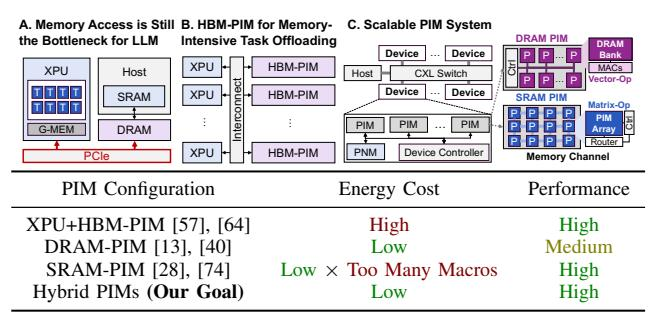
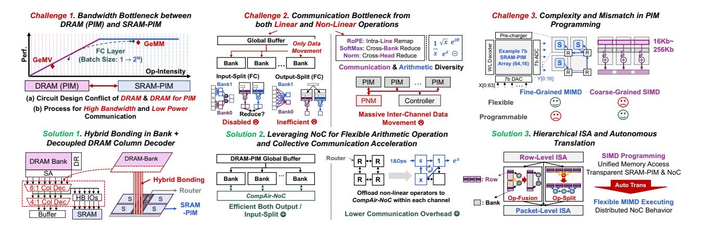

# Bridging Efficiency and Scalability in LLM System via 3D Hybrid PIM with 2D In-Transit Computation

Hongyi Li Tsinghua University Beijing, China Songchen Ma\* *HKUST*Hong Kong SAR, China

Huanyu Qu University of Macau Macau SAR, China Weihao Zhang

HKUST

Hong Kong SAR, China

Jia Chen *HKUST*Hong Kong SAR, China

Junfeng Lin
Tsinghua University
Beijing, China

Fengbin Tu

HKUST

Hong Kong SAR, China

Rong Zhao\*

Tsinghua University
Beijing, China

Abstract-Large Language Models (LLMs) have transformed society, but their computational and energy needs hinder efficient inference. The memory wall, the growing processor-memory speed disparity, remains a critical bottleneck for LLM. While Process-in-Memory (PIM) architectures address this challenge by co-locating computation with memory, achieving 5-20× higher bandwidth than GPUs, existing scalable PIM solutions face critical trade-offs in flexibility, capacity, and efficiency when handling LLMs' dynamic memory-compute patterns and operator diversity. DRAM-PIM suffers from inter-bank communication overhead despite its vector parallelism. SRAM-PIM offers sub-10ns latency for matrix operation but is constrained by limited capacity. This work introduces CompAir, a scalable PIM architecture that integrates DRAM-PIM and SRAM-PIM with hybrid bonding, enabling efficient linear computations while unlocking multi-granularity data pathways. We further develop CompAir-NoC, an advanced network-on-chip (NoC) with an embedded arithmetic logic unit that performs non-linear operations during data movement. Such a design offloads the centralized communication bottleneck in the channel level to distributed banks, simultaneously reducing communication overhead and area cost for scalability. Finally, we develop a hierarchical Instruction Set Architecture that ensures both flexibility and programmability of the hybrid PIM. Experiments show CompAir delivers  $1.83-7.98\times$ faster prefill and 1.95-6.28× faster decoding versus state-ofthe-art PIM designs, with 3.52× lower energy than GPU-PIM hybrids. This work presents the first systematic exploration of hybrid DRAM-PIM and SRAM-PIM architectures with innetwork computation, paving the way towards a scalable PIM system for LLM inference.

Index Terms-PIM, Hybrid Bonding, 3D IC, LLM, Inference.

#### I. INTRODUCTION

The advancement of LLMs [6], [73], [75] is driving transformative changes, but their massive parameters and computational demands lead to prohibitive costs. Moreover, the scaling law [33] dictates a continual increase in model size, exacerbating computational bottlenecks. A fundamental constraint in LLM inference is the memory wall, where the growing disparity between processor speed and memory access [77] severely limits efficiency [12]. LLM inference architectures

This work is supported by the STI 2030-Major Projects under Grant 2021ZD0200300. \* represents the corresponding authors: r\_zhao@tsinghua.edu.cn., songchenma@ust.hk

(Fig. 1A) typically compose of XPUs (tensor accelerators like GPUs [54] and TPUs [30], [31]) interconnected with DRAM through PCIe (≈64GB/s [59]) suffering from extreme data transfer bottleneck. For OPT-66B [83], PCIe transfers contribute 90% of inference latency [46]. While compression methods like quantization [45] and pruning [47], [68], and low-rank adaptation [22] alleviate bandwidth constraints, they fail to break the memory bottleneck (e.g., PCIe bandwidth limits that dominate end-to-end latency).

Fig. 1. The motivation of CompAir.

Process-In-Memory (PIM) architectures offer a promising solution to overcome memory bottlenecks by leveraging the high internal memory bandwidth: 6.7× higher than the external bandwidth in UPMEM [7] and 16× in AiM [43]. PIM enables in situ data processing that reduces energy consumption and improves throughput. Several memory technologies have embraced this architecture, including DRAM [55], [65], Non-Volatile Memory [4], NAND Flash [32], and SRAM [1], [51]. Among these, DRAM-PIM [7], [25], [41] and SRAM-PIM [14], [35], [74] stand out as promising candidates for real-world deployment due to their high endurance, process compatibility, and scalability [50]. Recent advances show the potential of offloading memory-bound operations to highbandwidth memory (HBM), such as Generalized Matrix Vector Multiplication (GeMV), yielding inference performance gain by alleviating bandwidth limitations [18], [44], [57], [64] (Fig. 1B). Yet, LLM inference remains energy inefficient. Both XPUs and HBMs are notorious for high power consumption,

Fig. 2. Key challenges in hybrid PIM for LLM and corresponding solutions in CompAir.

prompting a search for alternative architectures.

In response, recent work has explored scalable PIM-based systems [13], [40], which achieves high energy efficiency inference for LLM through DRAM-PIM devices scale-out. Fig. 1C illustrates the system hierarchy, including device, channel, and bank. XPU-free PIM systems incorporate Compute Express Link (CXL) to minimize inter-device communication latency and scale efficiently. To support complex nonlinear operations essential for LLMs, centralized CPUs and massive dedicated non-linear units (NLUs) are incorporated as a Process-Near-Memory (PNM) module in CXL controller, enabling area-efficient implementation of non-linear operations [13]. Although contemporary scalable PIM system achieves superior cost and energy efficiency over XPU+HBM-PIM [13], [40], two factors hinder the improvement of scalable PIMs:

- (i) Varying batch/sequence lengths in LLMs causes memory- and compute-bound operations to coexist. DRAM-PIM struggles with compute-bound operations [15] due to limited arithmetic units and output-splitting mapping (further analyzed in Fig. 8). While, SRAM-PIM excels at low-latency (<10 ns) matrix operations in high efficiency on workloads with substantial weight reuse. But its small macro size [29] imposes excessive power and area overhead when scaled to LLM (Fig. 3). Thus, scaling either PIM alone is insufficient for LLMs.
- (ii) Current PIM architectures trade arithmetic generality and communication flexibility for matrix efficiency [67]. The fine-grained data rearrangement and nonlinear operation rely on external NLU or CPU in the CXL controller (PNM in Fig. 1C), which results in channel-wise communication bottleneck especially for long-context inference (Fig. 4). In summary, interconnection for scalable PIMs remain an open question.

To address these constraints, we present CompAir, a scalable PIM-based LLM system that hybridizes DRAM-PIM and SRAM-PIM for memory-bound and compute-bound tasks respectively with dedicated interconnect, which improves efficiency in LLM-oriented PIMs; we compare against pure DRAM-PIM and SRAM-PIM stacking DRAM in evaluation. However, hybridizing DRAM-PIM and SRAM-PIM into a unified system introduces several fundamental challenges. Fig. 2 highlights key challenges and solutions that underpin the CompAir architecture:

Challenge 1: Bandwidth Bottleneck. The data movement between DRAM and SRAM is constrained by interconnect bandwidth at two levels: (i) To accommodate more logic, modern DRAM-PIMs place compute units outside column decoders [41], [43]. While improving logic density, it reduces accessible bit width. Current DRAM read-out bandwidth in DRAM-PIM [17] is insufficient to feed SRAM-PIM's high-throughput demands. (ii) Separate dies for DRAM and SRAM are required, where the limited inter-die bandwidth [72] exacerbates the bottleneck.

Solution 1: Hybrid Bonding with Decoupled Column Decoder. For Challenge 1(i), we propose a decoupled column decoder in DRAM-PIM that simultaneously maintains standard DRAM functionality while enabling high-bandwidth data access tailored for SRAM-PIM. For Challenge 1(ii), we adopt hybrid bonding (HB) [21], [82] with area-matched SRAM-PIMs and DRAM-PIM bank. This cross-die alignment supports distributed, high-throughput communication, substantially alleviating the interconnect bottleneck. We will further analyze that HB significantly increases the necessity of SRAM-PIM due to area.

Challenge 2: Communication Bottleneck. Communication remains a critical bottleneck for LLM inference in contemporary DRAM-PIMs [84]. The bottleneck manifests in two critical ways: (i) Inefficient collective communication. Prior DRAM-PIM performs collective communication inefficiently via global buffer with both limited bandwidth and redundant data movement. Therefore, prior DRAM-PIM solutions avoid output-split mapping (shown in the left of Fig. 2 Challenge 2) for fully-connected (FC) layers to avoid reduction [13], [40]. However, our experiments (Fig. 8) show that this strategy often leads to suboptimal execution. (ii) Non-linear overhead. Non-linear operations raise massive data movement from PIM banks to centralized PNM in each device [75]. Our profiling

reveals that in long-context scenarios, communication for nonlinear computation can account for up to 25% of total latency.

*Solution 2: Enhancing NoC for both Collective Communication Acceleration and Flexible Arithmetic Operation*. We introduce CompAir-NoC, a computable Network-on-Chip with a low-latency, area-efficient arithmetic logic unit (ALU). Firstly, CompAir-NoC accelerates collective communication by building up the reduction tree with its ALU. Secondly, the computable NoC is also serving as a reconfigurable NLU within DRAM channels, decentralizing CPU-centric tasks for improved scalability.

Challenge 3: Programming Mismatch. Hybrid PIM architectures combines DRAM-PIM and SRAM-PIM, which inherently adopt distinct execution models. DRAM-PIM employs SIMD executions with centralized control and shared instruction contexts across all banks [7], [15], [43], while SRAM-PIM utilizes an MIMD paradigm with distributed controllers and private instruction contexts per bank for flexibility [28], [74]. However, extending MIMD across all banks imposes substantial programming complexity and incurs significant area cost overhead due to private instruction buffer, up to 20% of the logic die [82]. This architectural disparity poses a fundamental challenge to the programmable hybrid PIMs.

*Solution 3: Hierarchical ISA with Automated Translation.* To reconcile programmability with architectural heterogeneity, we propose a two-level ISA abstraction with autonomous translation, combining the simplicity of SIMD programming with the flexibility of MIMD execution. At the row-level, we retain a unified SIMD instruction interface and memory access patterns for ease of programming. At the packetlevel, we introduce programmable routing behaviors that enable MIMD-like execution. Our key contribution addresses the SIMD-to-MIMD mapping inefficiency through instruction fusion/splitting automatically synthesizing NoC paths by analyzing cross-instruction address dependencies, maintaining programmability while enabling fine-grained NoC parallelism.

A detailed technical analysis of these observations is provided in Section II. The key contributions of this work include:

- (1) We introduce CompAir, a hybrid PIM architecture integrating DRAM-PIM, SRAM-PIM with hybrid bonding for energy-efficient and scalable LLM inference. (Section III)
- (2) We develop the computable CompAir-NoC to reduce inter-channel communications with low-cost non-linear operations and accelerate collective communication. (Section IV)
- (3) We design a novel hierarchical ISA, overcoming the programming issues and enabling transparent and scalable execution across the hybrid PIM systems. (Section V)

To the best of our knowledge, *CompAir is the first architecture that systematically addresses PIM hybridization with fundamentally different programming models for scalable LLM inference*, achieving a balanced trade-off among performance, energy efficiency and programmability. CompAir achieves 1.83-7.98× prefill and 1.95-6.28× decode improvement over the state-of-the-art fully PIM architecture. Compared to the hybrid A100 and HBM-PIM system, CompAir achieves 3.52× energy consumption reduction with comparable throughput.

# Bridging Efficiency and Scalability in LLM System via 3D Hybrid PIM with 2D In-Transit Computation

Hongyi Li Tsinghua University Beijing, China Songchen Ma\* *HKUST*Hong Kong SAR, China

Huanyu Qu University of Macau Macau SAR, China Weihao Zhang

HKUST

Hong Kong SAR, China

Jia Chen *HKUST*Hong Kong SAR, China

Junfeng Lin
Tsinghua University
Beijing, China

Fengbin Tu

HKUST

Hong Kong SAR, China

Rong Zhao\*

Tsinghua University
Beijing, China

Abstract-Large Language Models (LLMs) have transformed society, but their computational and energy needs hinder efficient inference. The memory wall, the growing processor-memory speed disparity, remains a critical bottleneck for LLM. While Process-in-Memory (PIM) architectures address this challenge by co-locating computation with memory, achieving 5-20× higher bandwidth than GPUs, existing scalable PIM solutions face critical trade-offs in flexibility, capacity, and efficiency when handling LLMs' dynamic memory-compute patterns and operator diversity. DRAM-PIM suffers from inter-bank communication overhead despite its vector parallelism. SRAM-PIM offers sub-10ns latency for matrix operation but is constrained by limited capacity. This work introduces CompAir, a scalable PIM architecture that integrates DRAM-PIM and SRAM-PIM with hybrid bonding, enabling efficient linear computations while unlocking multi-granularity data pathways. We further develop CompAir-NoC, an advanced network-on-chip (NoC) with an embedded arithmetic logic unit that performs non-linear operations during data movement. Such a design offloads the centralized communication bottleneck in the channel level to distributed banks, simultaneously reducing communication overhead and area cost for scalability. Finally, we develop a hierarchical Instruction Set Architecture that ensures both flexibility and programmability of the hybrid PIM. Experiments show CompAir delivers  $1.83-7.98\times$ faster prefill and 1.95-6.28× faster decoding versus state-ofthe-art PIM designs, with 3.52× lower energy than GPU-PIM hybrids. This work presents the first systematic exploration of hybrid DRAM-PIM and SRAM-PIM architectures with innetwork computation, paving the way towards a scalable PIM system for LLM inference.

Index Terms-PIM, Hybrid Bonding, 3D IC, LLM, Inference.

#### I. INTRODUCTION

The advancement of LLMs [6], [73], [75] is driving transformative changes, but their massive parameters and computational demands lead to prohibitive costs. Moreover, the scaling law [33] dictates a continual increase in model size, exacerbating computational bottlenecks. A fundamental constraint in LLM inference is the memory wall, where the growing disparity between processor speed and memory access [77] severely limits efficiency [12]. LLM inference architectures

This work is supported by the STI 2030-Major Projects under Grant 2021ZD0200300. \* represents the corresponding authors: r\_zhao@tsinghua.edu.cn., songchenma@ust.hk

(Fig. 1A) typically compose of XPUs (tensor accelerators like GPUs [54] and TPUs [30], [31]) interconnected with DRAM through PCIe (≈64GB/s [59]) suffering from extreme data transfer bottleneck. For OPT-66B [83], PCIe transfers contribute 90% of inference latency [46]. While compression methods like quantization [45] and pruning [47], [68], and low-rank adaptation [22] alleviate bandwidth constraints, they fail to break the memory bottleneck (e.g., PCIe bandwidth limits that dominate end-to-end latency).

Fig. 1. The motivation of CompAir.

Process-In-Memory (PIM) architectures offer a promising solution to overcome memory bottlenecks by leveraging the high internal memory bandwidth: 6.7× higher than the external bandwidth in UPMEM [7] and 16× in AiM [43]. PIM enables in situ data processing that reduces energy consumption and improves throughput. Several memory technologies have embraced this architecture, including DRAM [55], [65], Non-Volatile Memory [4], NAND Flash [32], and SRAM [1], [51]. Among these, DRAM-PIM [7], [25], [41] and SRAM-PIM [14], [35], [74] stand out as promising candidates for real-world deployment due to their high endurance, process compatibility, and scalability [50]. Recent advances show the potential of offloading memory-bound operations to highbandwidth memory (HBM), such as Generalized Matrix Vector Multiplication (GeMV), yielding inference performance gain by alleviating bandwidth limitations [18], [44], [57], [64] (Fig. 1B). Yet, LLM inference remains energy inefficient. Both XPUs and HBMs are notorious for high power consumption,

Fig. 2. Key challenges in hybrid PIM for LLM and corresponding solutions in CompAir.

prompting a search for alternative architectures.

In response, recent work has explored scalable PIM-based systems [13], [40], which achieves high energy efficiency inference for LLM through DRAM-PIM devices scale-out. Fig. 1C illustrates the system hierarchy, including device, channel, and bank. XPU-free PIM systems incorporate Compute Express Link (CXL) to minimize inter-device communication latency and scale efficiently. To support complex nonlinear operations essential for LLMs, centralized CPUs and massive dedicated non-linear units (NLUs) are incorporated as a Process-Near-Memory (PNM) module in CXL controller, enabling area-efficient implementation of non-linear operations [13]. Although contemporary scalable PIM system achieves superior cost and energy efficiency over XPU+HBM-PIM [13], [40], two factors hinder the improvement of scalable PIMs:

- (i) Varying batch/sequence lengths in LLMs causes memory- and compute-bound operations to coexist. DRAM-PIM struggles with compute-bound operations [15] due to limited arithmetic units and output-splitting mapping (further analyzed in Fig. 8). While, SRAM-PIM excels at low-latency (<10 ns) matrix operations in high efficiency on workloads with substantial weight reuse. But its small macro size [29] imposes excessive power and area overhead when scaled to LLM (Fig. 3). Thus, scaling either PIM alone is insufficient for LLMs.
- (ii) Current PIM architectures trade arithmetic generality and communication flexibility for matrix efficiency [67]. The fine-grained data rearrangement and nonlinear operation rely on external NLU or CPU in the CXL controller (PNM in Fig. 1C), which results in channel-wise communication bottleneck especially for long-context inference (Fig. 4). In summary, interconnection for scalable PIMs remain an open question.

To address these constraints, we present CompAir, a scalable PIM-based LLM system that hybridizes DRAM-PIM and SRAM-PIM for memory-bound and compute-bound tasks respectively with dedicated interconnect, which improves efficiency in LLM-oriented PIMs; we compare against pure DRAM-PIM and SRAM-PIM stacking DRAM in evaluation. However, hybridizing DRAM-PIM and SRAM-PIM into a unified system introduces several fundamental challenges. Fig. 2 highlights key challenges and solutions that underpin the CompAir architecture:

Challenge 1: Bandwidth Bottleneck. The data movement between DRAM and SRAM is constrained by interconnect bandwidth at two levels: (i) To accommodate more logic, modern DRAM-PIMs place compute units outside column decoders [41], [43]. While improving logic density, it reduces accessible bit width. Current DRAM read-out bandwidth in DRAM-PIM [17] is insufficient to feed SRAM-PIM's high-throughput demands. (ii) Separate dies for DRAM and SRAM are required, where the limited inter-die bandwidth [72] exacerbates the bottleneck.

Solution 1: Hybrid Bonding with Decoupled Column Decoder. For Challenge 1(i), we propose a decoupled column decoder in DRAM-PIM that simultaneously maintains standard DRAM functionality while enabling high-bandwidth data access tailored for SRAM-PIM. For Challenge 1(ii), we adopt hybrid bonding (HB) [21], [82] with area-matched SRAM-PIMs and DRAM-PIM bank. This cross-die alignment supports distributed, high-throughput communication, substantially alleviating the interconnect bottleneck. We will further analyze that HB significantly increases the necessity of SRAM-PIM due to area.

Challenge 2: Communication Bottleneck. Communication remains a critical bottleneck for LLM inference in contemporary DRAM-PIMs [84]. The bottleneck manifests in two critical ways: (i) Inefficient collective communication. Prior DRAM-PIM performs collective communication inefficiently via global buffer with both limited bandwidth and redundant data movement. Therefore, prior DRAM-PIM solutions avoid output-split mapping (shown in the left of Fig. 2 Challenge 2) for fully-connected (FC) layers to avoid reduction [13], [40]. However, our experiments (Fig. 8) show that this strategy often leads to suboptimal execution. (ii) Non-linear overhead. Non-linear operations raise massive data movement from PIM banks to centralized PNM in each device [75]. Our profiling

reveals that in long-context scenarios, communication for nonlinear computation can account for up to 25% of total latency.

*Solution 2: Enhancing NoC for both Collective Communication Acceleration and Flexible Arithmetic Operation*. We introduce CompAir-NoC, a computable Network-on-Chip with a low-latency, area-efficient arithmetic logic unit (ALU). Firstly, CompAir-NoC accelerates collective communication by building up the reduction tree with its ALU. Secondly, the computable NoC is also serving as a reconfigurable NLU within DRAM channels, decentralizing CPU-centric tasks for improved scalability.

Challenge 3: Programming Mismatch. Hybrid PIM architectures combines DRAM-PIM and SRAM-PIM, which inherently adopt distinct execution models. DRAM-PIM employs SIMD executions with centralized control and shared instruction contexts across all banks [7], [15], [43], while SRAM-PIM utilizes an MIMD paradigm with distributed controllers and private instruction contexts per bank for flexibility [28], [74]. However, extending MIMD across all banks imposes substantial programming complexity and incurs significant area cost overhead due to private instruction buffer, up to 20% of the logic die [82]. This architectural disparity poses a fundamental challenge to the programmable hybrid PIMs.

*Solution 3: Hierarchical ISA with Automated Translation.* To reconcile programmability with architectural heterogeneity, we propose a two-level ISA abstraction with autonomous translation, combining the simplicity of SIMD programming with the flexibility of MIMD execution. At the row-level, we retain a unified SIMD instruction interface and memory access patterns for ease of programming. At the packetlevel, we introduce programmable routing behaviors that enable MIMD-like execution. Our key contribution addresses the SIMD-to-MIMD mapping inefficiency through instruction fusion/splitting automatically synthesizing NoC paths by analyzing cross-instruction address dependencies, maintaining programmability while enabling fine-grained NoC parallelism.

A detailed technical analysis of these observations is provided in Section II. The key contributions of this work include:

- (1) We introduce CompAir, a hybrid PIM architecture integrating DRAM-PIM, SRAM-PIM with hybrid bonding for energy-efficient and scalable LLM inference. (Section III)
- (2) We develop the computable CompAir-NoC to reduce inter-channel communications with low-cost non-linear operations and accelerate collective communication. (Section IV)
- (3) We design a novel hierarchical ISA, overcoming the programming issues and enabling transparent and scalable execution across the hybrid PIM systems. (Section V)

To the best of our knowledge, *CompAir is the first architecture that systematically addresses PIM hybridization with fundamentally different programming models for scalable LLM inference*, achieving a balanced trade-off among performance, energy efficiency and programmability. CompAir achieves 1.83-7.98× prefill and 1.95-6.28× decode improvement over the state-of-the-art fully PIM architecture. Compared to the hybrid A100 and HBM-PIM system, CompAir achieves 3.52× energy consumption reduction with comparable throughput.

