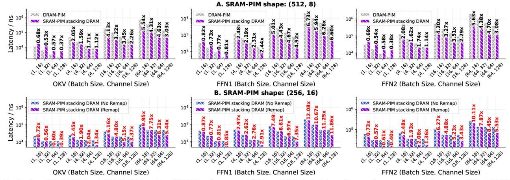

# *C. Organization and Mapping Issue*

Section III-B estimates the suitable size of SRAM-PIMs: one DRAM-PIM bank corresponds to four 8KB SRAM-PIMs shown in Fig. 5. Each SRAM-PIM macro is a 128-input 8 output BF16 matrix multiplication unit. In CompAir, SRAM-PIM is responsible for calculating FC layers. The 512GB/s of DRAM-PIM internal bandwidth is averaged over each bank at 32GB/s with 256-bit width. HB supports 6.4Gbps [24], ensuring that the die-to-die bandwidth is sufficient to maintain data throughput parity with the DRAM-PIM.

Our analysis of mapping strategies for DRAM-PIM and SRAM-PIM architectures reveals key distinctions. In scalable DRAM-PIM systems, matrix multiplications are typically distributed across banks to exploit memory parallelism. Inputsplit introduces inter-bank reduction overheads, which is limited by the bandwidth of the global buffer and requires serializing the access of the DRAM banks [13], [17], [40], [43]. Consequently, output-split becomes the predominant DRAM-PIM mapping approach, though it demands extensive input vector broadcasting and creates a dimensional imbalance in the FC layers (input-to-output ratio exceeding 17:1 per bank under output-split mapping). When SRAM-PIM per-

forms matrix multiplication, DRAM is responsible for fetching input to the SRAM-PIM and writing results back. Therefore, the shape imbalance intensifies the DRAM-to-SRAM data movement pressure. SRAM-PIM favors balanced input-output mappings, where bandwidth demand is minimized when dimensions of inputs and outputs are similar for a given MAC count, according to the mean value inequalities.

To quantify these effects, we examine two configurations of four SRAM-PIM macros: (512,8)1 and (256,16) in different batch sizes and CompAir channels. In Llama2-13B, each bank processes Q/K/V weight sized 5120×10 under the output-split mapping when 16×32 banks are used in total (channel=32). SRAM-PIM retains weights across batches as much as possible, requiring DRAM-SRAM transfers only for input/output per inference and weight per reloading.

In Fig. 8A, SRAM-PIM stacking DRAM delivers significant performance gains in both Q/K/V projection and FFN, with gains increasing alongside batch size, highlighting their superior data reuse efficiency. Fig. 8B evaluates the trade-off in the (256,16) configuration. Although splitting along the input introduces modest reduction overheads, this layout substantially reduces DRAM-to-SRAM bandwidth stress, often yielding better overall performance than (512,8). When input-split mapping is also adopted (2560×20 for each bank, channel=32), this reorganization consistently outperforms the pure outputsplit approach. These findings lead to two critical insights: (i) SRAM-PIM leads to better performance in compute-bounded GeMM than DRAM-PIM. (ii) SRAM-PIM and DRAM-PIM have distinct mapping requirements for optimal performance. However, the better mapping relies on efficient inter-bank reduction. Section IV presents detailed solution.

# *C. Organization and Mapping Issue*

Section III-B estimates the suitable size of SRAM-PIMs: one DRAM-PIM bank corresponds to four 8KB SRAM-PIMs shown in Fig. 5. Each SRAM-PIM macro is a 128-input 8 output BF16 matrix multiplication unit. In CompAir, SRAM-PIM is responsible for calculating FC layers. The 512GB/s of DRAM-PIM internal bandwidth is averaged over each bank at 32GB/s with 256-bit width. HB supports 6.4Gbps [24], ensuring that the die-to-die bandwidth is sufficient to maintain data throughput parity with the DRAM-PIM.

Our analysis of mapping strategies for DRAM-PIM and SRAM-PIM architectures reveals key distinctions. In scalable DRAM-PIM systems, matrix multiplications are typically distributed across banks to exploit memory parallelism. Inputsplit introduces inter-bank reduction overheads, which is limited by the bandwidth of the global buffer and requires serializing the access of the DRAM banks [13], [17], [40], [43]. Consequently, output-split becomes the predominant DRAM-PIM mapping approach, though it demands extensive input vector broadcasting and creates a dimensional imbalance in the FC layers (input-to-output ratio exceeding 17:1 per bank under output-split mapping). When SRAM-PIM per-

forms matrix multiplication, DRAM is responsible for fetching input to the SRAM-PIM and writing results back. Therefore, the shape imbalance intensifies the DRAM-to-SRAM data movement pressure. SRAM-PIM favors balanced input-output mappings, where bandwidth demand is minimized when dimensions of inputs and outputs are similar for a given MAC count, according to the mean value inequalities.

To quantify these effects, we examine two configurations of four SRAM-PIM macros: (512,8)1 and (256,16) in different batch sizes and CompAir channels. In Llama2-13B, each bank processes Q/K/V weight sized 5120×10 under the output-split mapping when 16×32 banks are used in total (channel=32). SRAM-PIM retains weights across batches as much as possible, requiring DRAM-SRAM transfers only for input/output per inference and weight per reloading.

In Fig. 8A, SRAM-PIM stacking DRAM delivers significant performance gains in both Q/K/V projection and FFN, with gains increasing alongside batch size, highlighting their superior data reuse efficiency. Fig. 8B evaluates the trade-off in the (256,16) configuration. Although splitting along the input introduces modest reduction overheads, this layout substantially reduces DRAM-to-SRAM bandwidth stress, often yielding better overall performance than (512,8). When input-split mapping is also adopted (2560×20 for each bank, channel=32), this reorganization consistently outperforms the pure outputsplit approach. These findings lead to two critical insights: (i) SRAM-PIM leads to better performance in compute-bounded GeMM than DRAM-PIM. (ii) SRAM-PIM and DRAM-PIM have distinct mapping requirements for optimal performance. However, the better mapping relies on efficient inter-bank reduction. Section IV presents detailed solution.

