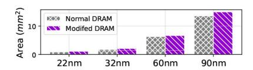

# *D. DRAM-PIM Reorganizing*

The synthesis of DRAM-PIMs depends on industrial PDKs, so we adopt AiM [43] and its derivative designs [13], [17] in

1The SRAM-PIMs are configured with 128-inputs-8-outputs, (512,8) represents extending 4 SRAM-PIMs in the input dimension into a 512-input-8 output matrix unit.

previous sections. However, CompAir architecture introduces new opportunities to rethink DRAM-PIM organization.

Section III-C identifies DRAM read-out bandwidth as the primary bottleneck in DRAM-SRAM interactions. This stems from current DRAM-PIM designs placing compute logic outside the column decoder to maximize logic integration [29]. Newton [17] employs a 32:1 multiplexer for column selection, striking a balance between DRAM access and compute efficiency. This multiplexer is dubbed as column decoder. For a 1KB-wide DRAM array, single-row full-bitline access incurs excessive bandwidth overhead and restricts finegrained memory operations. Therefore, only 32B are typically accessed per operation, sufficient for traditional DRAM-PIM, but restrictive for hybrid-bonded SRAM-PIM, where read-out bandwidth from DRAM becomes the new bottleneck.

Fig. 9. DRAM-PIM reorganization for CompAir can gain more performance profits taking Llama2-13B as the example.

To address this, we decouple the 32:1 column decoder to an 8:1 decoder for SRAM and a 4:1 decoder, increasing bandwidth (Fig. 9A). Fig. 10 illustrates that such design brings about 15% area overhead, which can be regarded as acceptable. Applied to Llama-13B inference, this DRAM reorganization yields a 1.15–1.5× end-to-end speedup (Fig. 9B). While this incurs a trade-off in I/O complexity or bond density, current HB technologies (>10K/mm2 [21], [52]) support the extended bonds with 20% area of one DRAM bank, making this optimization both practical under current fabrication capabilities.

Fig. 10. Area overhead evaluation evaluated by CACTI 7.0 [19].

# *D. DRAM-PIM Reorganizing*

The synthesis of DRAM-PIMs depends on industrial PDKs, so we adopt AiM [43] and its derivative designs [13], [17] in

1The SRAM-PIMs are configured with 128-inputs-8-outputs, (512,8) represents extending 4 SRAM-PIMs in the input dimension into a 512-input-8 output matrix unit.

previous sections. However, CompAir architecture introduces new opportunities to rethink DRAM-PIM organization.

Section III-C identifies DRAM read-out bandwidth as the primary bottleneck in DRAM-SRAM interactions. This stems from current DRAM-PIM designs placing compute logic outside the column decoder to maximize logic integration [29]. Newton [17] employs a 32:1 multiplexer for column selection, striking a balance between DRAM access and compute efficiency. This multiplexer is dubbed as column decoder. For a 1KB-wide DRAM array, single-row full-bitline access incurs excessive bandwidth overhead and restricts finegrained memory operations. Therefore, only 32B are typically accessed per operation, sufficient for traditional DRAM-PIM, but restrictive for hybrid-bonded SRAM-PIM, where read-out bandwidth from DRAM becomes the new bottleneck.

Fig. 9. DRAM-PIM reorganization for CompAir can gain more performance profits taking Llama2-13B as the example.

To address this, we decouple the 32:1 column decoder to an 8:1 decoder for SRAM and a 4:1 decoder, increasing bandwidth (Fig. 9A). Fig. 10 illustrates that such design brings about 15% area overhead, which can be regarded as acceptable. Applied to Llama-13B inference, this DRAM reorganization yields a 1.15–1.5× end-to-end speedup (Fig. 9B). While this incurs a trade-off in I/O complexity or bond density, current HB technologies (>10K/mm2 [21], [52]) support the extended bonds with 20% area of one DRAM bank, making this optimization both practical under current fabrication capabilities.

Fig. 10. Area overhead evaluation evaluated by CACTI 7.0 [19].

