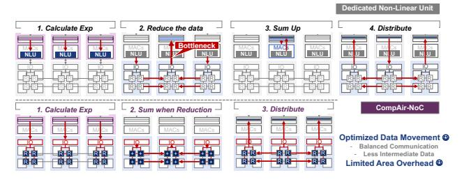

# IV. IN-TRANSIT COMPUTATION WITH COMPAIR-NOC A. Why CompAir-NoC

We have analyzed challenges of LLM non-linear computation (section II-B) and the need for efficient collective communication for matrix arithmetic performance (section III-C). **Inter-bank data movement is unavoidable**. Since device/channel/bank level parallelism may happen for single operator in the scalable PIM, data broadcasting and reduction is inevitable. In addition, data movement exists between the PIM banks and NLUs as we analyzed in section II-B Fig. 4.

Here we consider the method of the distributed NLUs, implementing an NLU for each DRAM-bank and taking Softmax as an example in Fig. 11. Each bank needs to use the NLU to perform the exponential computation. Then, the results of all the bank are summed up and distributed to every one. We find that (i) NLU is costly but idle in most of the time, (ii) summing and reduction are logically coupled, but physically completed by different devices, bringing data movement bottleneck. These inspire us to design a mechanism that can make different non-linear operations reusing hardware datapath and complete the computation when data moving.

Fig. 11. The motivation of CompAir-NoC (Softmax).

Fortunately, NoC can serialize vectors into flits naturally [26], enabling fine-grained manipulation when communication. Furthermore, NoC naturally enables dynamic dataflow with routing [31], [70]. Therefore, we present CompAir-NoC, a computation-enabled NoC with reconfigurability. Such design brings benefits in two aspects:

- (i) Less Data Movement Latency: Computing during communication reduce the movement of intermediate results (like reduction) and prevents data from moving between dedicated components, leading to congestion bottlenecks.
- (ii) Less Area Overhead: If we can design a scheme that enables the arithmetic units multiplexing and streaming computation during communication, logic, and buffer costs can be both saved compared to a dedicated NLU.

A critical challenge lies in ensuring computing units to support a wide range of arithmetic operations without compromising communication efficiency. In LLMs, inter-bank data movement arises from three sources: (i) Granularity Mismatching: In RoPE, the swap of neighboring scalars makes it necessary for a vector-based PIM to perform scalar operations with NLUs or CPUs [13]. (ii) Non-Linear Function: Data movement between PIM and NLU is inevitable for non-linear operations (RMSNorm, SiLU, Softmax). (iii) Collective Communication: For operator splitting, reduction/broadcast brings massive data movement, which can be optimized by tree-based hardware. All the operations are in BF16. In the following part, section IV-B details CompAir-NoC microarchitecture, then section IV-C shows how can it optimize these three issues.

#### B. CompAir-NoC Router Microarchitecture

Fig. 12A (excluding red-highlighted parts) illustrates a classical optimized NoC architecture, SWIFT [38], [39], where data is relayed in flits (32-128 bits) passing through the routers hop by hop. Unlike the simplest five-stage pipelined router (Fig. 12B), the SWIFT router can compress the delay of a flit within a router to only 1-2 cycles with lookahead and bypassing (Fig. 12C). This also means that any added computation must operate under light cycle budgets.

Traditional dataflow requires dynamic operand matching across input flits, incurring significant latency and hardware overhead [62], [69]. Ideally, each flit can trigger the operation independently without waiting for others. Inspired by Currying in Lambda Calculus [20], we design an ALU driven by a single operand, dubbed as **Curry ALU**.

Fig. 12. CompAir-NoC router microarchitecture.

Fig. 12D illustrates the idea in Curry ALU: most dataflow architecture dynamically transfer data, with operators statically

bounded in the ALU [5], [70]; whereas Curry ALUs dynamically transfer a Currying function (a unary operator InputOp and its left value InputVal), with its internal ArgReg statically storing the function parameters of the function (unary operator's right value). Curry ALU also contains the internal configurable IterArg and IterOp to allow ArgReg's iterated updating. Taking += as the example, an InputOpbased mode would be InputVals+=ArgReg (Fig. 12D left, ArgReg=2), while an IterOp-based mode would be ArgReg+=IterArg (Fig. 12D right, ArgReg becomes 3).

Curry ALU avoids multi-flit operand matching and enables efficient ArgReg-reuse. Moreover, Curry ALU introduces minimal disruption to the high performance router pipeline. The logical modifications caused by the Curry ALU are highlighted in red in Fig. 12A. In Fig. 12C, we use "flit compute" to mark the computation stage, which is parallel to the switch traversal. In the flit compute stage, Curry ALU replaces the data in the original flit with the computed result in situ with no extra overhead.

#### C. Supporting Non-Linear Operations in LLM

1) Data Rearrangement: DRAM-PIM's row-granular operation introduces significant data movement overhead for RoPE computations(Fig. 13A), requiring frequent transfers between DRAM banks and the CXL controller's CPU to perform neighbor swaps and odd-digit negations. The router provides the opportunity for fine-grained manipulation for RoPE, leveraging the ArgRegs as the flexible buffer, then letting DRAM-PIM implement efficient element-wise multiplication (EWMUL) as shown in Fig. 13B. Fig. 13C shows that four routers in each bank can be utilized to achieve efficient data exchange by sending data in five stages.

Fig. 13. RoPE data rearrangement with CompAir-NoC.

Fig. 14. Exponential function with CompAir-NoC.

- 2) Exponents and Square Root: Non-linear functions like exponents and square roots are central to Sigmoid and Softmax. In digital circuits, they are solved by iterative methods. The exponent and square root can be solved with Taylor expansion and Newton iteration, respectively. Fig. 14 presents an iterative computation method for the exponential function with dynamic ArgReg updates. We configure the router with ArgReg=6 as iteration rounds, initialized with IterArg=1 and update operation IterOp='-='. The computation proceeds outward from innermost levels, applying operations \*=X, /=IterRound, and +=1 in each iteration until IterRound=0. Our design enables efficient hardware utilization, supporting two parallel exponentiation across four routers. In each channel, 16 banks enables 32 concurrent exponential functions in total. This approach extends naturally to square root implementations.
- 3) Broadcast Tree and Reduce Tree: Broadcast and reduce are inverse operations of each other from the tree structure. Taking reduction with a width of 16 as an example, it is equivalent to the existence of an operation function as: Reduction('+', x[0],...,x[15]). Therefore, it can be transformed into a 4-layer binary tree for parallel reduction, and we will use ArgReg as the result of reduction for each non-leaf node to reduce. In CompAir, we set the bank as the granularity for reduction, opening up more possibilities for linear operation improvements in DRAM-PIMs.

From the communication point of view, broadcast and reduce are inverse operations of each other from the tree structure. Taking reduction with a width of 16 as an example, it is equivalent to the existence of an operation function as: Reduction('+',x[0],...,x[15]). Therefore, it can be transformed into a 4-layer binary tree for parallel reduction, and we will use ArgReg as the result of reduction for each non-leaf node to reduce. because the reduction of  $2^N$  nodes theoretically requires  $2^{N-1}+2^{N-2}+...+1=2^N-1$  intermediate nodes, so it can ensure that each node is fully utilized. In CompAir, we set the bank as the granularity for reduction, opening up more possibilities for linear operation improvements in DRAM-PIMs.

#### V. PROGRAMMING MODEL AND ISA DESIGN

While SIMD naturally suits DRAM-PIM, SRAM-PIM and CompAir-NoC's router-level execution require MIMD processing due to their fine-grained operations and distributed packet generation. This creates a fundamental SIMD-MIMD dichotomy in programming flexibility. Two solutions emerge: (i) unify SRAM-PIM/NoC's MIMD under DRAM's SIMD constraints, or (ii) extend MIMD to DRAM-PIM. While prior architectures [82] pursue the second way, integrating distributed controllers in each DRAM-Bank for autonomous MIMD execution, this approach incurs 17% area overhead and fails to scale efficiently with massive computing units. CompAir adopts the first: reconciling MIMD flexibility with DRAM's SIMD constraints with lower control complexity by packet encoding and autonomous path generation.

Fig. 15. CompAir program model. (A) Collective communication instructions perform cross bank communication. (B) NoC is used within each bank for other row-level instructions and its dataflow is defined by packet-level ISA.

To achieve this objective, we set up a hierarchical ISA. Fig. 15 illustrates the program model. The Row-Level ISA is programmed at the DRAM bank granularity in SIMD, and the Packet-Level ISA is granulated at the execution behavior of the router. Moreover, the transformation from row-level instruction to packet-level instruction can be established directly. The row-Level ISA is a programming interface exposed to the user, while the packet-Level ISA is what the NoC-related instructions actually store in the instruction buffer after compilation. To avoid context conflicts in the NoC, all channels and banks under a device executes the same row-level instruction simultaneously. Besides that, NoC's computational behavior is restricted within each bank except for two collective communication instructions.

# IV. IN-TRANSIT COMPUTATION WITH COMPAIR-NOC A. Why CompAir-NoC

We have analyzed challenges of LLM non-linear computation (section II-B) and the need for efficient collective communication for matrix arithmetic performance (section III-C). **Inter-bank data movement is unavoidable**. Since device/channel/bank level parallelism may happen for single operator in the scalable PIM, data broadcasting and reduction is inevitable. In addition, data movement exists between the PIM banks and NLUs as we analyzed in section II-B Fig. 4.

Here we consider the method of the distributed NLUs, implementing an NLU for each DRAM-bank and taking Softmax as an example in Fig. 11. Each bank needs to use the NLU to perform the exponential computation. Then, the results of all the bank are summed up and distributed to every one. We find that (i) NLU is costly but idle in most of the time, (ii) summing and reduction are logically coupled, but physically completed by different devices, bringing data movement bottleneck. These inspire us to design a mechanism that can make different non-linear operations reusing hardware datapath and complete the computation when data moving.

Fig. 11. The motivation of CompAir-NoC (Softmax).

Fortunately, NoC can serialize vectors into flits naturally [26], enabling fine-grained manipulation when communication. Furthermore, NoC naturally enables dynamic dataflow with routing [31], [70]. Therefore, we present CompAir-NoC, a computation-enabled NoC with reconfigurability. Such design brings benefits in two aspects:

- (i) Less Data Movement Latency: Computing during communication reduce the movement of intermediate results (like reduction) and prevents data from moving between dedicated components, leading to congestion bottlenecks.
- (ii) Less Area Overhead: If we can design a scheme that enables the arithmetic units multiplexing and streaming computation during communication, logic, and buffer costs can be both saved compared to a dedicated NLU.

A critical challenge lies in ensuring computing units to support a wide range of arithmetic operations without compromising communication efficiency. In LLMs, inter-bank data movement arises from three sources: (i) Granularity Mismatching: In RoPE, the swap of neighboring scalars makes it necessary for a vector-based PIM to perform scalar operations with NLUs or CPUs [13]. (ii) Non-Linear Function: Data movement between PIM and NLU is inevitable for non-linear operations (RMSNorm, SiLU, Softmax). (iii) Collective Communication: For operator splitting, reduction/broadcast brings massive data movement, which can be optimized by tree-based hardware. All the operations are in BF16. In the following part, section IV-B details CompAir-NoC microarchitecture, then section IV-C shows how can it optimize these three issues.

#### B. CompAir-NoC Router Microarchitecture

Fig. 12A (excluding red-highlighted parts) illustrates a classical optimized NoC architecture, SWIFT [38], [39], where data is relayed in flits (32-128 bits) passing through the routers hop by hop. Unlike the simplest five-stage pipelined router (Fig. 12B), the SWIFT router can compress the delay of a flit within a router to only 1-2 cycles with lookahead and bypassing (Fig. 12C). This also means that any added computation must operate under light cycle budgets.

Traditional dataflow requires dynamic operand matching across input flits, incurring significant latency and hardware overhead [62], [69]. Ideally, each flit can trigger the operation independently without waiting for others. Inspired by Currying in Lambda Calculus [20], we design an ALU driven by a single operand, dubbed as **Curry ALU**.

Fig. 12. CompAir-NoC router microarchitecture.

Fig. 12D illustrates the idea in Curry ALU: most dataflow architecture dynamically transfer data, with operators statically

bounded in the ALU [5], [70]; whereas Curry ALUs dynamically transfer a Currying function (a unary operator InputOp and its left value InputVal), with its internal ArgReg statically storing the function parameters of the function (unary operator's right value). Curry ALU also contains the internal configurable IterArg and IterOp to allow ArgReg's iterated updating. Taking += as the example, an InputOpbased mode would be InputVals+=ArgReg (Fig. 12D left, ArgReg=2), while an IterOp-based mode would be ArgReg+=IterArg (Fig. 12D right, ArgReg becomes 3).

Curry ALU avoids multi-flit operand matching and enables efficient ArgReg-reuse. Moreover, Curry ALU introduces minimal disruption to the high performance router pipeline. The logical modifications caused by the Curry ALU are highlighted in red in Fig. 12A. In Fig. 12C, we use "flit compute" to mark the computation stage, which is parallel to the switch traversal. In the flit compute stage, Curry ALU replaces the data in the original flit with the computed result in situ with no extra overhead.

#### C. Supporting Non-Linear Operations in LLM

1) Data Rearrangement: DRAM-PIM's row-granular operation introduces significant data movement overhead for RoPE computations(Fig. 13A), requiring frequent transfers between DRAM banks and the CXL controller's CPU to perform neighbor swaps and odd-digit negations. The router provides the opportunity for fine-grained manipulation for RoPE, leveraging the ArgRegs as the flexible buffer, then letting DRAM-PIM implement efficient element-wise multiplication (EWMUL) as shown in Fig. 13B. Fig. 13C shows that four routers in each bank can be utilized to achieve efficient data exchange by sending data in five stages.

Fig. 13. RoPE data rearrangement with CompAir-NoC.

Fig. 14. Exponential function with CompAir-NoC.

- 2) Exponents and Square Root: Non-linear functions like exponents and square roots are central to Sigmoid and Softmax. In digital circuits, they are solved by iterative methods. The exponent and square root can be solved with Taylor expansion and Newton iteration, respectively. Fig. 14 presents an iterative computation method for the exponential function with dynamic ArgReg updates. We configure the router with ArgReg=6 as iteration rounds, initialized with IterArg=1 and update operation IterOp='-='. The computation proceeds outward from innermost levels, applying operations \*=X, /=IterRound, and +=1 in each iteration until IterRound=0. Our design enables efficient hardware utilization, supporting two parallel exponentiation across four routers. In each channel, 16 banks enables 32 concurrent exponential functions in total. This approach extends naturally to square root implementations.
- 3) Broadcast Tree and Reduce Tree: Broadcast and reduce are inverse operations of each other from the tree structure. Taking reduction with a width of 16 as an example, it is equivalent to the existence of an operation function as: Reduction('+', x[0],...,x[15]). Therefore, it can be transformed into a 4-layer binary tree for parallel reduction, and we will use ArgReg as the result of reduction for each non-leaf node to reduce. In CompAir, we set the bank as the granularity for reduction, opening up more possibilities for linear operation improvements in DRAM-PIMs.

From the communication point of view, broadcast and reduce are inverse operations of each other from the tree structure. Taking reduction with a width of 16 as an example, it is equivalent to the existence of an operation function as: Reduction('+',x[0],...,x[15]). Therefore, it can be transformed into a 4-layer binary tree for parallel reduction, and we will use ArgReg as the result of reduction for each non-leaf node to reduce. because the reduction of  $2^N$  nodes theoretically requires  $2^{N-1}+2^{N-2}+...+1=2^N-1$  intermediate nodes, so it can ensure that each node is fully utilized. In CompAir, we set the bank as the granularity for reduction, opening up more possibilities for linear operation improvements in DRAM-PIMs.

#### V. PROGRAMMING MODEL AND ISA DESIGN

While SIMD naturally suits DRAM-PIM, SRAM-PIM and CompAir-NoC's router-level execution require MIMD processing due to their fine-grained operations and distributed packet generation. This creates a fundamental SIMD-MIMD dichotomy in programming flexibility. Two solutions emerge: (i) unify SRAM-PIM/NoC's MIMD under DRAM's SIMD constraints, or (ii) extend MIMD to DRAM-PIM. While prior architectures [82] pursue the second way, integrating distributed controllers in each DRAM-Bank for autonomous MIMD execution, this approach incurs 17% area overhead and fails to scale efficiently with massive computing units. CompAir adopts the first: reconciling MIMD flexibility with DRAM's SIMD constraints with lower control complexity by packet encoding and autonomous path generation.

Fig. 15. CompAir program model. (A) Collective communication instructions perform cross bank communication. (B) NoC is used within each bank for other row-level instructions and its dataflow is defined by packet-level ISA.

To achieve this objective, we set up a hierarchical ISA. Fig. 15 illustrates the program model. The Row-Level ISA is programmed at the DRAM bank granularity in SIMD, and the Packet-Level ISA is granulated at the execution behavior of the router. Moreover, the transformation from row-level instruction to packet-level instruction can be established directly. The row-Level ISA is a programming interface exposed to the user, while the packet-Level ISA is what the NoC-related instructions actually store in the instruction buffer after compilation. To avoid context conflicts in the NoC, all channels and banks under a device executes the same row-level instruction simultaneously. Besides that, NoC's computational behavior is restricted within each bank except for two collective communication instructions.

