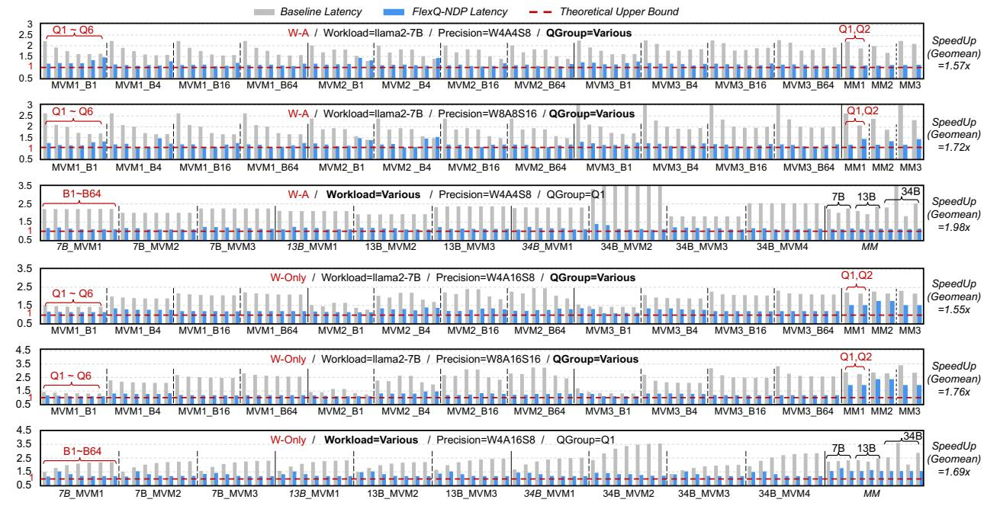
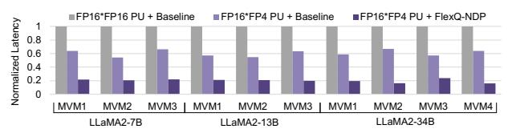

# C. Compilation Space Pruning

1) Pruning with Conflict of Operator Partition and QGroup: Based on the guideline, some QGroup sizes may introduce extra padding during partitioning. We use the reduction dimension K as an example. We first determine how many full QGroups each PU can process:

$$#Part^{K} = Part^{K}_{Ch} \times Part^{K}_{Ra} \times Part^{K}_{De} \times Part^{K}_{Bk},$$
 (11)

$$#QGroup_{PII}^{Complete} = \lfloor \lceil K/G_K \rceil / Part^K \rfloor, \qquad (12)$$

$$\#QGroup^{Remain} = \lceil K/G_K \rceil \% Part^K. \tag{13}$$

Further distributing the remaining elements across PUs may lead to padding. We determine how many PUs should jointly share a QGroup first, and resulting padding accordingly:

$$PU_{OGroup}^{Remain} = |Part^{K}/\#QGroup^{Remain}|, \tag{14}$$

$$#Element_{PU}^{Remain} = \lceil G_K / PU_{QGroup}^{Remain} \rceil.$$
 (15)

Then the padding can be calculated as:

$$\#Element_{PU} = \#Element_{PU}^{Remain} + G_K \times \#QGroup_{PU}^{Complete},$$
 (16)

$$Padding = \#Element_{PU} - \lceil K/Part^K \rceil. \tag{17}$$

A partition strategy will be pruned if the padding exceeds 50% of original partitioned size.

2) Pruning for Loop Tiling and DRAM Mapping: Given a  $Tile_{Col}$ , we can calculate the corresponding number of scales in the K inner loop. As mentioned in Sec. VI-B, the DRAM columns corresponding to the scale region within an itBlock may differ from the theoretical number, as shown in Equ. 6. Therefore, we compute the DRAM column utilization based on the loop tiling size and the number of actually used columns, and set a utilization threshold to prune compilation strategies with lower utilization.

#### D. Cost Model-based Design Space Exploration (DSE)

With the pruning technique, we can reduce the size of compilation space by  $4\sim5\times$ . For each strategy in the pruned space, we use the cost model to predict the optimal ones, avoiding costly cycle-accurate simulation. For the DSE of a MVM operator, we can limit the search time from three hours to one minute for a batched MVM operator. And we can finish the DSE for LLaMA2-7B within 10 minutes, considering the operator structure of different transformer blocks is same.

The cost model consists of two stages. The first stage performs coarse-grained metric estimation based on the compilation strategy. While the value dot-product latency can be derived analytically, we leverage parameters such as loop tiling sizes, value and scale buffer capacities, and DRAM row size to count key events, including buffer misses, dequantization operations, and DRAM row changes. Furthermore, we can also count dequantization operations that overlap with buffer miss and row changes. However, precisely characterizing DRAM row changes presents a key challenge. We observe that DRAM row changes consist of (i) natural row changes incurred while streaming weight data for computation, and (ii) row changes triggered by misses in the value or scale buffer. For (i), as weights are mapped following the loop iteration order, data are accessed column by column sequentially during traversal. The natural row change is considered after accessing the last column in each row. For (ii), we notice that buffer miss contributes to different extra row change numbers. Assuming we cache the activation in the buffer and read the weight from DRAM for computation, if an activation buffer miss occurs, two extra row changes are required: one to read the activation and another to return to the previous weight row. However, if the activation buffer miss coincides with a natural weight row change, only one extra row change is incurred. One extra row change also happens when two buffer refills (e.g., for data and scale buffers) happen at the same moment. Based on this observation, we can obtain a more accurate estimation of the total row-change overhead.

TABLE I
SUPPORTED DATA FORMAT IN DOT-PRODUCT UNIT

| Data Format         | fp4  | fp8  | fp16  | fp32  |
|---------------------|------|------|-------|-------|
| $E_x M_y$           | E2M1 | E4M3 | E5M10 | E8M23 |
| Mantissa Bits       | 2    | 4    | 11    | 24    |
| #Values/DRAM Column | 64   | 32   | 16    | 8     |

 $\begin{tabular}{ll} TABLE & II \\ TRADE-OFFS & BETWEEN & FP32 & PERFORMANCE & AND & PU & OVERHEAD \\ \end{tabular}$ 

| FP32 Cycle / Other Format | 1      | 2      | 4      |
|---------------------------|--------|--------|--------|
| PU Area $(mm^2)$          | 0.0185 | 0.0167 | 0.0152 |
| PU Power(mW)              | 8.72   | 7.21   | 6.04   |

The second stage derives **the final performance estimation** by applying analytical formulas to these aggregated metrics:

$$Lat = t_{CCDL} * Num_{col} + Lat^{RowChange} * Num_{row}$$
  
+ 
$$Lat^{Dequant} * (1 - Ratio^{Overlap})$$
 (18)

where  $Num_{col}$  represents the total number of accessed DRAM columns, including accessing weight value for dot-product, fetching input to the value and scale buffers, and maintaining the partial sum result.  $Num_{row}$  and  $Lat^{RowChange}$  represents the counted number of row changes and the extra latency of a row change, and  $Lat^{RowChange}$  can be calculated from timing parameters.  $Lat^{Dequant}$  and  $Ratio^{Overlap}$  represents the dequantization time and the ratio of dequantization operations that overlap with column access and row change.

#### IX. EVALUATION METHODOLOGY

#### A. Multi-precision PU Implementation

Table I summarizes the FP formats supported by each PU, including effective mantissa precision and the number of values that fit into a single DRAM column. To reduce hardware overhead, the PU datapath is designed to reuse resources across multiple precisions, as shown in Fig. 2(c).

**Dot-product PU.** Each PU consists of a set of FP multipliers followed by an FP adder tree. For the multiplier array, existing multi-precision FP units [24] reuse mantissa multipliers by composing small multiplier blocks. In our design, mantissa multiplication for FP32 originally requires a 24-bit multiplier. We decompose it into four 12-bit multipliers to enable higher parallelism at lower precisions. Similarly, 12-bit multiplier can be further decomposed into four 6-bit multipliers. However, the datapath shows that only a small portion of the multipliers are utilized for FP4 and FP8 operations. As a result, we trade-off between the resource overhead and the computational power for FP32, as shown in Table II.

For characterizing the area and power overhead of different PU designs, we synthesize the modules using Synopsys DC Compiler at 14 nm, aligned with the 1y-nm DRAM process used in GDDR6-AiM [33]. To complete one MAC within bank access interval  $(t_{CCDL} \times t_{CK})$ , the PU frequency is set to 0.4 GHz, following GDDR6 timing parameters in DRAMSim3 [38]. The single-cycle FP32 design provides acceptable overhead and avoids excessively slow dequantization, so we adopt this design point in our implementation. However, our proposed compilation and dequant-hiding techniques are

TABLE III QUANTIZATION METHODS, PRECISIONS, AND GROUP CONFIGS

| Quant. Method   | W-A Quant.      | W-Only Quant.                                        |
|-----------------|-----------------|------------------------------------------------------|
| Precision       | W4A4S8, W8A8S16 | W4A16S8, W8A16S16                                    |
| Q1–Q6 (GN , GK) |                 | (1,16), (1,32), (16,16), (32,32), (64,64), (128,128) |

TABLE IV

LLM WORKLOAD CONFIGURATIONS (THE M, K, N DIMENSION NAMING FOLLOWS THE SAME CONVENTION AS IN FIG. 1)

| LLaMA 7B                  | M | K | N    | LLaMA 13B                                           | M | K | N    |
|---------------------------|---|---|------|-----------------------------------------------------|---|---|------|
| MVM/MM1 1/4096 4096       |   |   | 4096 | MVM/MM1 1/4096 5120                                 |   |   | 5120 |
|                           |   |   |      | MVM/MM2 1/4096 4096 11008 MVM/MM2 1/4096 5120 13824 |   |   |      |
| MVM/MM3 1/4096 11008 4096 |   |   |      | MVM/MM3 1/4096 13824 5120                           |   |   |      |
| LLaMA 34B                 | M | K | N    | LLaMA 34B                                           | M | K | N    |
| MVM/MM1 1/4096 6656       |   |   | 6656 | MVM/MM3 1/4096 6656                                 |   |   | 832  |
|                           |   |   |      | MVM/MM2 1/4096 6656 20480 MVM/MM4 1/4096 20480 6656 |   |   |      |

applicable to all design points with little additional latency, and we also report results under slower FP32 configurations.

Adder tree optimization. Using full FP32 adders for all levels of the reduction tree is unnecessary. We observe that: (1) The first-level adders are only activated during FP4 operations. (2) The second-level adders are only activated for FP4 and FP8 operations. Thus, we reduce the precision of the early adder stages to match the required dynamic range. Specifically, firstlevel adders use FP8 precision, and second-level adders use BF16 precision, both of which can fully preserve the accuracy of FP4 and FP8 products. Higher levels of the tree use FP32 adders to maintain overall accumulation accuracy.

#### *B. Online Activation Quantization Implementation*

When using weight-activation quantization, any intermediate result that serves as the input to a low-bit operator must be quantized at runtime. To support this, whenever the output buffer becomes full, we transfer the intermediate results back to the host (same as original GDDR6-AiM dataflow).

During computation, the host incrementally aggregates these intermediate values and tracks the maximum magnitude of each QGroup of next operator, which is then used to derive the scales. When preparing the input for the next operator, the host distributes the unquantized intermediate results together with their corresponding scales to all DRAM banks. PUs can then exploit the high internal memory bandwidth to perform the actual value quantization efficiently. The overhead of runtime quantization is also considered in the experiment for end-toend LLM inference in Fig. 10.

#### *C. Experiment Setup*

*1) Workloads:* We use MVM and MM operators extracted from LLMs (LLaMA2-7B/13B/34B [56]) for evaluation, as shown in Tab. IV. For end-to-end evaluation, we consider attention computation and nonlinear operators in the original precision. In the prefill stage, the input length is set to the maximum sequence length of LLaMA-2 (i.e., 4096). In the decoding stage, we perform token-level analysis, with the attention latency measured at the 32nd generated token. We further construct batched (B1-B64) version of these MVM to evaluate batched LLM decoding.

TABLE V NDP ARCHITECTURE PARAMETERS

| Value | PU Parameter                               | Value                                                                                                   |
|-------|--------------------------------------------|---------------------------------------------------------------------------------------------------------|
|       |                                            | 51.2 GFLOPs                                                                                             |
|       |                                            | 25.6 GFLOPs                                                                                             |
|       |                                            | 12.8 GFLOPs                                                                                             |
|       |                                            | 6.4 GFLOPs                                                                                              |
|       |                                            | 0.4 GHz                                                                                                 |
|       |                                            | 20×32 Bytes                                                                                             |
| 32 GB | Total PU Num.                              | 1024                                                                                                    |
|       | 32 2 16 16 12 Gbps 1.5 TB/s | FP4 Throughput FP8 Throughput FP16 Throughput FP32 Throughput Frequency SRAM Buffer Size |

Timing Parameters (from DRAMSim3 [38]): tCK = 0.66ns, tRCD = 24, tRP = 24, tCCDL = 4, BL = 16, tCL = 24

- *2) Quantization Configs:* We evaluate a diverse set of QConfigs, including QGroups ranging from (1,16) to (128,128) (denoted as Q1∼Q6), different quantization types including weight-activation (W-A) and weight-only (W-Only), and various precision pairs for quantized values and scaling factors (e.g., W4S8, W8S16). These configurations cover several trending low-bit FP formats such as DeepSeek-FP8, MXFP4, and NVFP4, and also allow us to assess the potential of alternative FP formats for NDP architectures.
- *3) NDP Architecture Setup:* The NDP architecture used for evaluation is modified from Hynix AiM [33], as described in Sec. III-A. Detailed parameters of the NDP architecture and the multi-precision PU are listed in Tab. V. The detailed timing and power parameters used for GDDR6 are also derived from DRAMSim3. We also evaluate the sensitivity of *FlexQ-NDP* by switching to different total buffer capacities and PU implementations (in particular, variations in FP32 throughput).
- *4) Performance & Energy Simulation:* We simulate NDP performance using modified UniNDP [63], as described in Sec. III-C. The energy consumption is calculated from the trace collected from simulation and power parameters, following the equations in DRAMSim3 [38].
- *5) Baseline Compilation Strategy:* The baseline compilation strategy for low-bit FP GEMM is as follows: (a) For partition, the operator is divided along its output-channel across different PUs, which follows the partition strategy used in AiM [33]; (b) Data mapping and dataflow are described in Sec. III-B; (c) Buffer allocation is determined by matching the ratio of scale-buffer capacity to data-buffer capacity with the ratio of scales to values; (d) Loop tile size is chosen to match the size of scale and data buffer, and loop order is set to Order1, and the input will be stored to value buffer during computation. For un-quantized (FP16) GEMM in Sec. X-C, we reuse the partition and data mapping strategy from the baseline compilation strategy designed for low-bit FP GEMM.

## X. EXPERIMENT RESULTS

#### *A. GEMM Operator*

*1) Speedups:* We first evaluate quantized MVM and MM operators, as shown in Fig. 8. For each quantization configuration, we apply the full *FlexQ-NDP* optimization pipeline, including scale-value interleaved data layout, dequant-hiding technique, and the DSE-based strategy search. We estimate the theoretical performance upper bound by assuming that the PU is fully utilized without idle cycles. This corresponds to

Fig. 8. MM and MVM Performance Comparison between Baseline and FlexQ-NDP (normalized to theoretical upper bound)

TABLE VI ENERGY CONSUMPTION ACROSS WORKLOADS (UNIT:  $10^{-3}J$ )

| _          |                               | LL | aMA- | -7B | LL           | aMA-  | 13B     | ] | LLaM  | A-34B |    |
|------------|-------------------------------|----|------|-----|--------------|-------|---------|---|-------|-------|----|
| M          | VM_                           | 1  | 2    | 3   | 1            | 2     | 3       | 1 | 2     | 3     | 4  |
|            | iseline irs                |    |      |     | 0.36 0.28 |       |         |   |       |       |    |
| (Cycle)    | 14000 - 12000 - 10000 - |    |      | ■B  | aseline      | ■ Fle | exQ-NDP |   | . 1.1 | H     | LL |
| Latency (C | 8000 - 6000 - 4000 -    | Q1 | -Q6  |     |              | la la | Н       |   | Ш     |       |    |

Fig. 9. Latency Comparison between Quantization Precisions

W4A4S8 (W-A)

the latency lower bound shown in the figure. Fig. 8 shows the speedups of *FlexQ-NDP* across both weight-activation and weight-only quantization, evaluated under different quantization groups and LLM workloads. Across all cases, *FlexQ-NDP* consistently improves performance over the baseline and reaches a maximum speedup of 3.29×. We observe two general trends: (1) for finer-grained quantization groups, weight-activation configurations benefit more from *FlexQ-NDP* 's optimizations and achieve higher speedups; (2) for larger batch sizes, weight-only configurations obtain larger gains.

2) Energy Consumption: We evaluated the energy consumption of different MVM operators, as shown in Tab. VI. Running a single LLaMA2 MVM operator on NDP consumes energy on the order of several to tens of millijoules, depending on the model scale. Across all workloads, our optimization consistently reduces energy consumption by approximately  $1.31\times$  on average, with a peak reduction of up to  $1.78\times$ .

TABLE VII LATENCY COMPARISON BETWEEN GPU & NDP (UNIT:  $10^{-6}$  s)

| Input Size (M)             | 1 | 2 | 4 | 8 | 16 | 32 | 64 | 4096 |
|----------------------------|---|---|---|---|----|----|----|------|
| GPU Latency NDP Latency |   |   |   |   |    |    |    |      |

- 3) Comparison between quantization precisions and QConfigs: In Fig. 9, we compare the performance of 7B\_MVM1 across different quantization precisions under all six QConfigs. First, for W–A quantization, improving quantization precision directly increases the arithmetic complexity. As a result, the optimized latency of 8-bit quantization is on average  $1.6\times$  higher than that of 4-bit quantization across different Qconfigs. In contrast, for W-Only quantization, the computation precision always follows the activation precision (FP16). Increasing weight precision only affects the weight dequantization overhead. Under different qconfigs, the average latency only increases by  $1.3\times$ . Comparing the two quantization schemes, weight-only quantization consistently exhibits significantly higher latency due to its substantially larger compute cost.
- 4) Comparison with GPU execution: We test GEMM operator with increasing input size (7B\_MVM\_1 with different batch sizes and 7B\_MM\_1) on RTX5090 GPU with CUT-LASS [52] library, and compare it to NDP latency optimized by FlexQ-NDP. Results in Tab. VII indicates that for GEMM with small input dimensions, NDP shows advantages, and when  $M \geq 16$ , GPU performance becomes superior. For prefill-stage MM, GPU performs clearly better.

#### B. CNN Operators

We extended evaluation to convolutional (CONV) layers in CNN models [15], [21]. We apply im2col transformation to

TABLE VIII
SPEEDUP OF CONV LAYERS IN CNN MODELS

| CNN CONV.      | AlexNet_3     | AlexNet_8     | ResNet18_3    | ResNet18_4    |
|----------------|---------------|---------------|---------------|---------------|
| Kernel Size    | 5             | 3             | 3             | 3             |
| In/Out Channel | 64/192        | 384/256       | 256/256       | 512/512       |
| Speedup        | $1.09 \times$ | $1.72 \times$ | $1.40 \times$ | $2.62 \times$ |

Fig. 10. End-to-end Latency Compared to Baseline (norm. to FP16 model) convert CONV kernels to MVMs. Per-channel quantization is applied to both the input and output channel of CONV weight, and the channel of input data. As shown in Tab. VIII, *FlexQ-NDP* provides 1.49× CONV layer speedup on average.

#### C. End-to-End LLM Workload

We evaluate the end-to-end performance on LLaMA2-7/34B against FP16-based computation and baseline low-bit FP compilation strategy. Fig. 10 reports the results for W4A4S8 W-A quantization (Q1) and weight-only quantization (Q2), evaluated on both 7B/34B decoding and prefill. All latencies are normalized to the FP16 model. The FP16-based LLaMA2-34B incurs substantial DRAM-rewrite overhead because the GDDR6-AiM (32 GB capacity) cannot hold the full FP16 parameters of LLaMA2-34B. Consequently, FP16 execution requires rewriting weights into DRAM, and we account for this overhead in the FP16 results. Under this constraint, directly applying W4A4S8 quantization with QGroup = (1,32) using the baseline compilation strategy reduces the DRAM requirement for LLaMA2-34B parameters to within the system capacity. As a result, it eliminates weight rewriting and achieves a  $7.17 \times$ speedup in the decode stage (batch size = 1).

For *W-A quantization*, FlexQ-NDP reduces both the operator computing latency and the runtime-quantization overhead. This yields up to  $2.36\times$  and  $2.73\times$  speedups over the quantized baseline in the prefill and decoding phases, respectively. Compared to the FP16 model, FlexQ-NDP achieves up to  $15\times$  speedup in decoding, with  $7.17\times$  speedup from quantization and  $2.09\times$  speedup from FlexQ-NDP's compilation optimizations. For the prefill stage, FlexQ-NDP provides up to a  $2.47\times$  speedup compared to FP16 model  $(1.20\times$  from quantization and  $2.05\times$  from FlexQ-NDP's compilation optimizations). For W-Only quantization, as the computation precision is unchanged and extra dequantization is required, the baseline strategies often perform worse than FP16. FlexQ-NDP achieves  $1.49\times$  and  $1.92\times$  speedup for prefill and decoding

TABLE IX
SPEEDUP CONTRIBUTIONS OF EACH OPTIMIZATION PASS (CUMULATIVE)

| Techniques        | Layout | Dequant-Hiding | DSE   |
|-------------------|--------|----------------|-------|
| Avg. of $MVM$     | ×1.36  | ×1.18          | ×1.17 |
| Avg. of $MVM\_B2$ | ×1.35  | ×1.17          | ×1.19 |
| Avg. of $MVM\_B4$ | ×1.35  | ×1.17          | ×1.24 |

TABLE X
EVALUATION OF COST-MODEL-GUIDED DSE: OPTIMALITY STATISTICS
ACROSS QUANTIZATION TYPES

| Quant.Type | Optimality Avg.(%) | Range (%)    | P90(%) |
|------------|--------------------|--------------|--------|
| W-A        | 95.97              | 84.96-100.00 | 90.52  |
| W-Only     | 99.66              | 98.12-100.00 | 99.22  |

against the baseline strategy, respectively. *FlexQ-NDP* can also approach the theoretical lower bound (i.e., ignoring weight rewrites) for large-batch decoding and prefill.

#### D. Ablation Study

Tab. IX summarizes the individual contributions of the three major components of FlexQ-NDP, evaluated by cumulatively applying the interleaved data layout, the dequantization-hiding technique, and the DSE-guided compilation strategy to the MVM operator with different batch sizes. We also observe an average reduction on the DRAM row-changing overhead by  $\sim 2\times$ , which is the source of speedup of layout.

#### E. Cost Modeling Validation

To assess the effectiveness of our cost modeling, we conduct a brute-force search to obtain the globally optimal strategy for each operator and compare it with the best configuration selected using our cost-model-guided DSE. Table X summarizes the optimality statistics, where *optimality denotes the ratio between the latency achieved by DSE and the brute-force optimum.* For W-A quantization, the DSE achieves an average optimality of 95.97%, with values ranging from 84.96% to 100% and a P90 optimality of 90.52%. This is due to the difficulty in precise modeling of the dequant-hiding process. For W-Only quantization, our model achieves markedly higher fidelity, achieving an average optimality of 99.66%, with values ranging from 98.12% to 100% and a P90 optimality of 99.22%. These results demonstrate that the cost model's ability in providing reliable guidance for DSE.

#### F. Various Hardware Configurations

1) Buffer Size: We take LLaMA\_7B\_MVM2 (W4A4S8, Q1) as a case study to analyze the sensitivity of different strategies to the PU buffer capacity. The baseline strategy used in this study differs from the main experiments. For each PU buffer size, we exhaustively search for the optimal buffer allocation under that capacity to serve as the baseline. As a result, the measured speedups are slightly lower than those reported in Sec.X-A. As shown in Fig. 11(a), the baseline latency rises sharply when the buffer size is small and requires more than  $20\times32$  B buffer to reach performance close to the optimal region. In contrast, the proposed optimizations, including the interleaving data layout and its combination with dequantization reordering, are much less sensitive to buffer capacity. Both

Fig. 11. Sensitivity of *FlexQ-NDP* to PU SRAM Buffer Size

Fig. 12. Sensitivity of *FlexQ-NDP* to PU FP32 Throughput

optimized strategies achieve latency below 8,400 cycles with as little as 8×32 B of buffer. This represents approximately a 3× reduction in required buffer capacity compared with the baseline, while still reaching near-optimal performance. These results show that *FlexQ-NDP* not only accelerates quantized computation but also substantially relaxes the buffer requirements, which is critical for resource-constrained NDP architectures. Both optimized strategies achieve near-optimal performance with only 8×32 B of buffer, which corresponds to a reduction of approximately three times in the required buffer capacity compared with the baseline. This demonstrates that *FlexQ-NDP* not only accelerates quantized computation but also significantly relaxes the SRAM buffer requirement, which is essential for resource constrained NDP architectures.

Fig. 11(b) shows the relative speedup of the full *FlexQ-NDP* optimization pipeline over baseline on LLaMA 7B MVM2. Overall, speedup tends to decrease as SRAM buffer size increases, but the improvement remains relatively stable (1.38×) even as the SRAM size continues to grow.

*2) FP32 Throughput:* We evaluate the effectiveness of *FlexQ-NDP* on MVM operators (W4A4S8, Q1) across different FP32 throughputs, as shown in Fig 12. When FP32 Throughput gets smaller, computation dominates runtime, and the benefit from compute–memory overlap diminishes. But our strategy is still effective across MVM workloads, with 1.45× average speedup under 1/2 FP32 throughput, and 1.28× average speedup under 1/4 FP32 throughput.

*3) Compatibility with Mix-precision PU:* On W4A16S8 MVM operators, we conducted additional experiments assuming an FP16 × FP4 PU design (51.2 GFLOPS, four times the FP16 throughput). Each PU can fetch FP4 weights from DRAM bank while simultaneously accessing the same number of FP16 activations from the SRAM buffer at four times the DRAM bandwidth, leveraging SRAM's higher speed. With mixed-precision PUs, dequantization can be performed on the result instead of the weight, as a result, the previously prohibited instruction reordering technique can be reapplied to W-Only cases. As shown in Fig. 13, this mix-precision PU can reduce the baseline latency by 1.66× on average, and

Fig. 13. Compatibility with Mix-Precision PU Design

FlexQ-NDP can further achieve 3.05× speedups on average.

#### XI. RELATED WORK

NDP compilersare essential for exploring the unique optimization space of NDP architectures. Existing NDP compilers primarily target high-precision formats or coarse-grained integer quantization. OptiPIM [42] searches for the optimal data layout for both NDP and processing-using-DRAM systems. ATiM [49] automatically explores UPMEM-specific optimizations, such as loop-boundary handling and host-UPMEM communication. UniNDP [63] identifies optimal data layouts across various commercial NDP architectures. H2-LLM [35] jointly optimizes operator partitioning, data layout, and hybridbonding-based hardware configurations. PipePIM [27] enables hardware pipelining of DRAM sub-array activation and computation. JIT-Q [26] leverages NDP as a GPU co-processor and does not support executing low-bit operators on NDP. Cost-Effective [30] optimizes low-bit computation with finegrained groups but only for W-Only quantization and 4-bit integer formats, lacking compatibility with modern FP formats. In contrast, our work *FlexQ-NDP* provides comprehensive support and optimization for a wide range of quantization configurations on NDP, bringing NDP architectures fully into the era of low-bit FP quantization.

#### XII. CONCLUSION

In this paper, we propose *FlexQ-NDP*, an NDP compiler tailored for low-bit FP computation. *FlexQ-NDP* incorporates an interleaving data layout to store the quantized matrix into DRAM, and a dequant-hiding technique to reduce the overhead of dequantization under fine-grained QGroups. We also construct an efficient DSE process to explore the optimal compilation strategy for different QConfigs. Extensive experiments show that FlexQ-NDP achieves up to 3.29× operator-level and 2.73× end-to-end speedups over existing NDP compilation strategies across various low-bit FP formats.

#### XIII. ACKNOWLEDGMENT

We thank the anonymous reviewers and our shepherd for their valuable feedback. This work was supported by the National Natural Science Foundation of China (62504139, 62325405, U24B6015), Beijing Natural Science Foundation (L257010), the National Key R&D Program of China (2023YFB4502200), Beijing National Research Center for Information Science, Technology (No. BNR2024TD03001), and State Key Laboratory of Space Network and Communications. This research was partially supported by ACCESS – AI Chip Center for Emerging Smart Systems, sponsored by InnoHK funding, Hong Kong SAR (HKSAR) and Research Grants Council of HKSAR (16213824).

# C. Compilation Space Pruning

1) Pruning with Conflict of Operator Partition and QGroup: Based on the guideline, some QGroup sizes may introduce extra padding during partitioning. We use the reduction dimension K as an example. We first determine how many full QGroups each PU can process:

$$#Part^{K} = Part^{K}_{Ch} \times Part^{K}_{Ra} \times Part^{K}_{De} \times Part^{K}_{Bk},$$
 (11)

$$#QGroup_{PII}^{Complete} = \lfloor \lceil K/G_K \rceil / Part^K \rfloor, \qquad (12)$$

$$\#QGroup^{Remain} = \lceil K/G_K \rceil \% Part^K. \tag{13}$$

Further distributing the remaining elements across PUs may lead to padding. We determine how many PUs should jointly share a QGroup first, and resulting padding accordingly:

$$PU_{OGroup}^{Remain} = |Part^{K}/\#QGroup^{Remain}|, \tag{14}$$

$$#Element_{PU}^{Remain} = \lceil G_K / PU_{QGroup}^{Remain} \rceil.$$
 (15)

Then the padding can be calculated as:

$$\#Element_{PU} = \#Element_{PU}^{Remain} + G_K \times \#QGroup_{PU}^{Complete},$$
 (16)

$$Padding = \#Element_{PU} - \lceil K/Part^K \rceil. \tag{17}$$

A partition strategy will be pruned if the padding exceeds 50% of original partitioned size.

2) Pruning for Loop Tiling and DRAM Mapping: Given a  $Tile_{Col}$ , we can calculate the corresponding number of scales in the K inner loop. As mentioned in Sec. VI-B, the DRAM columns corresponding to the scale region within an itBlock may differ from the theoretical number, as shown in Equ. 6. Therefore, we compute the DRAM column utilization based on the loop tiling size and the number of actually used columns, and set a utilization threshold to prune compilation strategies with lower utilization.

#### D. Cost Model-based Design Space Exploration (DSE)

With the pruning technique, we can reduce the size of compilation space by  $4\sim5\times$ . For each strategy in the pruned space, we use the cost model to predict the optimal ones, avoiding costly cycle-accurate simulation. For the DSE of a MVM operator, we can limit the search time from three hours to one minute for a batched MVM operator. And we can finish the DSE for LLaMA2-7B within 10 minutes, considering the operator structure of different transformer blocks is same.

The cost model consists of two stages. The first stage performs coarse-grained metric estimation based on the compilation strategy. While the value dot-product latency can be derived analytically, we leverage parameters such as loop tiling sizes, value and scale buffer capacities, and DRAM row size to count key events, including buffer misses, dequantization operations, and DRAM row changes. Furthermore, we can also count dequantization operations that overlap with buffer miss and row changes. However, precisely characterizing DRAM row changes presents a key challenge. We observe that DRAM row changes consist of (i) natural row changes incurred while streaming weight data for computation, and (ii) row changes triggered by misses in the value or scale buffer. For (i), as weights are mapped following the loop iteration order, data are accessed column by column sequentially during traversal. The natural row change is considered after accessing the last column in each row. For (ii), we notice that buffer miss contributes to different extra row change numbers. Assuming we cache the activation in the buffer and read the weight from DRAM for computation, if an activation buffer miss occurs, two extra row changes are required: one to read the activation and another to return to the previous weight row. However, if the activation buffer miss coincides with a natural weight row change, only one extra row change is incurred. One extra row change also happens when two buffer refills (e.g., for data and scale buffers) happen at the same moment. Based on this observation, we can obtain a more accurate estimation of the total row-change overhead.

TABLE I
SUPPORTED DATA FORMAT IN DOT-PRODUCT UNIT

| Data Format         | fp4  | fp8  | fp16  | fp32  |
|---------------------|------|------|-------|-------|
| $E_x M_y$           | E2M1 | E4M3 | E5M10 | E8M23 |
| Mantissa Bits       | 2    | 4    | 11    | 24    |
| #Values/DRAM Column | 64   | 32   | 16    | 8     |

 $\begin{tabular}{ll} TABLE & II \\ TRADE-OFFS & BETWEEN & FP32 & PERFORMANCE & AND & PU & OVERHEAD \\ \end{tabular}$ 

| FP32 Cycle / Other Format | 1      | 2      | 4      |
|---------------------------|--------|--------|--------|
| PU Area $(mm^2)$          | 0.0185 | 0.0167 | 0.0152 |
| PU Power(mW)              | 8.72   | 7.21   | 6.04   |

The second stage derives **the final performance estimation** by applying analytical formulas to these aggregated metrics:

$$Lat = t_{CCDL} * Num_{col} + Lat^{RowChange} * Num_{row}$$
  
+ 
$$Lat^{Dequant} * (1 - Ratio^{Overlap})$$
 (18)

where  $Num_{col}$  represents the total number of accessed DRAM columns, including accessing weight value for dot-product, fetching input to the value and scale buffers, and maintaining the partial sum result.  $Num_{row}$  and  $Lat^{RowChange}$  represents the counted number of row changes and the extra latency of a row change, and  $Lat^{RowChange}$  can be calculated from timing parameters.  $Lat^{Dequant}$  and  $Ratio^{Overlap}$  represents the dequantization time and the ratio of dequantization operations that overlap with column access and row change.

#### IX. EVALUATION METHODOLOGY

#### A. Multi-precision PU Implementation

Table I summarizes the FP formats supported by each PU, including effective mantissa precision and the number of values that fit into a single DRAM column. To reduce hardware overhead, the PU datapath is designed to reuse resources across multiple precisions, as shown in Fig. 2(c).

**Dot-product PU.** Each PU consists of a set of FP multipliers followed by an FP adder tree. For the multiplier array, existing multi-precision FP units [24] reuse mantissa multipliers by composing small multiplier blocks. In our design, mantissa multiplication for FP32 originally requires a 24-bit multiplier. We decompose it into four 12-bit multipliers to enable higher parallelism at lower precisions. Similarly, 12-bit multiplier can be further decomposed into four 6-bit multipliers. However, the datapath shows that only a small portion of the multipliers are utilized for FP4 and FP8 operations. As a result, we trade-off between the resource overhead and the computational power for FP32, as shown in Table II.

For characterizing the area and power overhead of different PU designs, we synthesize the modules using Synopsys DC Compiler at 14 nm, aligned with the 1y-nm DRAM process used in GDDR6-AiM [33]. To complete one MAC within bank access interval  $(t_{CCDL} \times t_{CK})$ , the PU frequency is set to 0.4 GHz, following GDDR6 timing parameters in DRAMSim3 [38]. The single-cycle FP32 design provides acceptable overhead and avoids excessively slow dequantization, so we adopt this design point in our implementation. However, our proposed compilation and dequant-hiding techniques are

TABLE III QUANTIZATION METHODS, PRECISIONS, AND GROUP CONFIGS

| Quant. Method   | W-A Quant.      | W-Only Quant.                                        |
|-----------------|-----------------|------------------------------------------------------|
| Precision       | W4A4S8, W8A8S16 | W4A16S8, W8A16S16                                    |
| Q1–Q6 (GN , GK) |                 | (1,16), (1,32), (16,16), (32,32), (64,64), (128,128) |

TABLE IV

LLM WORKLOAD CONFIGURATIONS (THE M, K, N DIMENSION NAMING FOLLOWS THE SAME CONVENTION AS IN FIG. 1)

| LLaMA 7B                  | M | K | N    | LLaMA 13B                                           | M | K | N    |
|---------------------------|---|---|------|-----------------------------------------------------|---|---|------|
| MVM/MM1 1/4096 4096       |   |   | 4096 | MVM/MM1 1/4096 5120                                 |   |   | 5120 |
|                           |   |   |      | MVM/MM2 1/4096 4096 11008 MVM/MM2 1/4096 5120 13824 |   |   |      |
| MVM/MM3 1/4096 11008 4096 |   |   |      | MVM/MM3 1/4096 13824 5120                           |   |   |      |
| LLaMA 34B                 | M | K | N    | LLaMA 34B                                           | M | K | N    |
| MVM/MM1 1/4096 6656       |   |   | 6656 | MVM/MM3 1/4096 6656                                 |   |   | 832  |
|                           |   |   |      | MVM/MM2 1/4096 6656 20480 MVM/MM4 1/4096 20480 6656 |   |   |      |

applicable to all design points with little additional latency, and we also report results under slower FP32 configurations.

Adder tree optimization. Using full FP32 adders for all levels of the reduction tree is unnecessary. We observe that: (1) The first-level adders are only activated during FP4 operations. (2) The second-level adders are only activated for FP4 and FP8 operations. Thus, we reduce the precision of the early adder stages to match the required dynamic range. Specifically, firstlevel adders use FP8 precision, and second-level adders use BF16 precision, both of which can fully preserve the accuracy of FP4 and FP8 products. Higher levels of the tree use FP32 adders to maintain overall accumulation accuracy.

#### *B. Online Activation Quantization Implementation*

When using weight-activation quantization, any intermediate result that serves as the input to a low-bit operator must be quantized at runtime. To support this, whenever the output buffer becomes full, we transfer the intermediate results back to the host (same as original GDDR6-AiM dataflow).

During computation, the host incrementally aggregates these intermediate values and tracks the maximum magnitude of each QGroup of next operator, which is then used to derive the scales. When preparing the input for the next operator, the host distributes the unquantized intermediate results together with their corresponding scales to all DRAM banks. PUs can then exploit the high internal memory bandwidth to perform the actual value quantization efficiently. The overhead of runtime quantization is also considered in the experiment for end-toend LLM inference in Fig. 10.

#### *C. Experiment Setup*

*1) Workloads:* We use MVM and MM operators extracted from LLMs (LLaMA2-7B/13B/34B [56]) for evaluation, as shown in Tab. IV. For end-to-end evaluation, we consider attention computation and nonlinear operators in the original precision. In the prefill stage, the input length is set to the maximum sequence length of LLaMA-2 (i.e., 4096). In the decoding stage, we perform token-level analysis, with the attention latency measured at the 32nd generated token. We further construct batched (B1-B64) version of these MVM to evaluate batched LLM decoding.

TABLE V NDP ARCHITECTURE PARAMETERS

| Value | PU Parameter                               | Value                                                                                                   |
|-------|--------------------------------------------|---------------------------------------------------------------------------------------------------------|
|       |                                            | 51.2 GFLOPs                                                                                             |
|       |                                            | 25.6 GFLOPs                                                                                             |
|       |                                            | 12.8 GFLOPs                                                                                             |
|       |                                            | 6.4 GFLOPs                                                                                              |
|       |                                            | 0.4 GHz                                                                                                 |
|       |                                            | 20×32 Bytes                                                                                             |
| 32 GB | Total PU Num.                              | 1024                                                                                                    |
|       | 32 2 16 16 12 Gbps 1.5 TB/s | FP4 Throughput FP8 Throughput FP16 Throughput FP32 Throughput Frequency SRAM Buffer Size |

Timing Parameters (from DRAMSim3 [38]): tCK = 0.66ns, tRCD = 24, tRP = 24, tCCDL = 4, BL = 16, tCL = 24

- *2) Quantization Configs:* We evaluate a diverse set of QConfigs, including QGroups ranging from (1,16) to (128,128) (denoted as Q1∼Q6), different quantization types including weight-activation (W-A) and weight-only (W-Only), and various precision pairs for quantized values and scaling factors (e.g., W4S8, W8S16). These configurations cover several trending low-bit FP formats such as DeepSeek-FP8, MXFP4, and NVFP4, and also allow us to assess the potential of alternative FP formats for NDP architectures.
- *3) NDP Architecture Setup:* The NDP architecture used for evaluation is modified from Hynix AiM [33], as described in Sec. III-A. Detailed parameters of the NDP architecture and the multi-precision PU are listed in Tab. V. The detailed timing and power parameters used for GDDR6 are also derived from DRAMSim3. We also evaluate the sensitivity of *FlexQ-NDP* by switching to different total buffer capacities and PU implementations (in particular, variations in FP32 throughput).
- *4) Performance & Energy Simulation:* We simulate NDP performance using modified UniNDP [63], as described in Sec. III-C. The energy consumption is calculated from the trace collected from simulation and power parameters, following the equations in DRAMSim3 [38].
- *5) Baseline Compilation Strategy:* The baseline compilation strategy for low-bit FP GEMM is as follows: (a) For partition, the operator is divided along its output-channel across different PUs, which follows the partition strategy used in AiM [33]; (b) Data mapping and dataflow are described in Sec. III-B; (c) Buffer allocation is determined by matching the ratio of scale-buffer capacity to data-buffer capacity with the ratio of scales to values; (d) Loop tile size is chosen to match the size of scale and data buffer, and loop order is set to Order1, and the input will be stored to value buffer during computation. For un-quantized (FP16) GEMM in Sec. X-C, we reuse the partition and data mapping strategy from the baseline compilation strategy designed for low-bit FP GEMM.

## X. EXPERIMENT RESULTS

#### *A. GEMM Operator*

*1) Speedups:* We first evaluate quantized MVM and MM operators, as shown in Fig. 8. For each quantization configuration, we apply the full *FlexQ-NDP* optimization pipeline, including scale-value interleaved data layout, dequant-hiding technique, and the DSE-based strategy search. We estimate the theoretical performance upper bound by assuming that the PU is fully utilized without idle cycles. This corresponds to

Fig. 8. MM and MVM Performance Comparison between Baseline and FlexQ-NDP (normalized to theoretical upper bound)

TABLE VI ENERGY CONSUMPTION ACROSS WORKLOADS (UNIT:  $10^{-3}J$ )

| _          |                               | LL | aMA- | -7B | LL           | aMA-  | 13B     | ] | LLaM  | A-34B |    |
|------------|-------------------------------|----|------|-----|--------------|-------|---------|---|-------|-------|----|
| M          | VM_                           | 1  | 2    | 3   | 1            | 2     | 3       | 1 | 2     | 3     | 4  |
|            | iseline irs                |    |      |     | 0.36 0.28 |       |         |   |       |       |    |
| (Cycle)    | 14000 - 12000 - 10000 - |    |      | ■B  | aseline      | ■ Fle | exQ-NDP |   | . 1.1 | H     | LL |
| Latency (C | 8000 - 6000 - 4000 -    | Q1 | -Q6  |     |              | la la | Н       |   | Ш     |       |    |

Fig. 9. Latency Comparison between Quantization Precisions

W4A4S8 (W-A)

the latency lower bound shown in the figure. Fig. 8 shows the speedups of *FlexQ-NDP* across both weight-activation and weight-only quantization, evaluated under different quantization groups and LLM workloads. Across all cases, *FlexQ-NDP* consistently improves performance over the baseline and reaches a maximum speedup of 3.29×. We observe two general trends: (1) for finer-grained quantization groups, weight-activation configurations benefit more from *FlexQ-NDP* 's optimizations and achieve higher speedups; (2) for larger batch sizes, weight-only configurations obtain larger gains.

2) Energy Consumption: We evaluated the energy consumption of different MVM operators, as shown in Tab. VI. Running a single LLaMA2 MVM operator on NDP consumes energy on the order of several to tens of millijoules, depending on the model scale. Across all workloads, our optimization consistently reduces energy consumption by approximately  $1.31\times$  on average, with a peak reduction of up to  $1.78\times$ .

TABLE VII LATENCY COMPARISON BETWEEN GPU & NDP (UNIT:  $10^{-6}$  s)

| Input Size (M)             | 1 | 2 | 4 | 8 | 16 | 32 | 64 | 4096 |
|----------------------------|---|---|---|---|----|----|----|------|
| GPU Latency NDP Latency |   |   |   |   |    |    |    |      |

- 3) Comparison between quantization precisions and QConfigs: In Fig. 9, we compare the performance of 7B\_MVM1 across different quantization precisions under all six QConfigs. First, for W–A quantization, improving quantization precision directly increases the arithmetic complexity. As a result, the optimized latency of 8-bit quantization is on average  $1.6\times$  higher than that of 4-bit quantization across different Qconfigs. In contrast, for W-Only quantization, the computation precision always follows the activation precision (FP16). Increasing weight precision only affects the weight dequantization overhead. Under different qconfigs, the average latency only increases by  $1.3\times$ . Comparing the two quantization schemes, weight-only quantization consistently exhibits significantly higher latency due to its substantially larger compute cost.
- 4) Comparison with GPU execution: We test GEMM operator with increasing input size (7B\_MVM\_1 with different batch sizes and 7B\_MM\_1) on RTX5090 GPU with CUT-LASS [52] library, and compare it to NDP latency optimized by FlexQ-NDP. Results in Tab. VII indicates that for GEMM with small input dimensions, NDP shows advantages, and when  $M \geq 16$ , GPU performance becomes superior. For prefill-stage MM, GPU performs clearly better.

#### B. CNN Operators

We extended evaluation to convolutional (CONV) layers in CNN models [15], [21]. We apply im2col transformation to

TABLE VIII
SPEEDUP OF CONV LAYERS IN CNN MODELS

| CNN CONV.      | AlexNet_3     | AlexNet_8     | ResNet18_3    | ResNet18_4    |
|----------------|---------------|---------------|---------------|---------------|
| Kernel Size    | 5             | 3             | 3             | 3             |
| In/Out Channel | 64/192        | 384/256       | 256/256       | 512/512       |
| Speedup        | $1.09 \times$ | $1.72 \times$ | $1.40 \times$ | $2.62 \times$ |

Fig. 10. End-to-end Latency Compared to Baseline (norm. to FP16 model) convert CONV kernels to MVMs. Per-channel quantization is applied to both the input and output channel of CONV weight, and the channel of input data. As shown in Tab. VIII, *FlexQ-NDP* provides 1.49× CONV layer speedup on average.

#### C. End-to-End LLM Workload

We evaluate the end-to-end performance on LLaMA2-7/34B against FP16-based computation and baseline low-bit FP compilation strategy. Fig. 10 reports the results for W4A4S8 W-A quantization (Q1) and weight-only quantization (Q2), evaluated on both 7B/34B decoding and prefill. All latencies are normalized to the FP16 model. The FP16-based LLaMA2-34B incurs substantial DRAM-rewrite overhead because the GDDR6-AiM (32 GB capacity) cannot hold the full FP16 parameters of LLaMA2-34B. Consequently, FP16 execution requires rewriting weights into DRAM, and we account for this overhead in the FP16 results. Under this constraint, directly applying W4A4S8 quantization with QGroup = (1,32) using the baseline compilation strategy reduces the DRAM requirement for LLaMA2-34B parameters to within the system capacity. As a result, it eliminates weight rewriting and achieves a  $7.17 \times$ speedup in the decode stage (batch size = 1).

For *W-A quantization*, FlexQ-NDP reduces both the operator computing latency and the runtime-quantization overhead. This yields up to  $2.36\times$  and  $2.73\times$  speedups over the quantized baseline in the prefill and decoding phases, respectively. Compared to the FP16 model, FlexQ-NDP achieves up to  $15\times$  speedup in decoding, with  $7.17\times$  speedup from quantization and  $2.09\times$  speedup from FlexQ-NDP's compilation optimizations. For the prefill stage, FlexQ-NDP provides up to a  $2.47\times$  speedup compared to FP16 model  $(1.20\times$  from quantization and  $2.05\times$  from FlexQ-NDP's compilation optimizations). For W-Only quantization, as the computation precision is unchanged and extra dequantization is required, the baseline strategies often perform worse than FP16. FlexQ-NDP achieves  $1.49\times$  and  $1.92\times$  speedup for prefill and decoding

TABLE IX
SPEEDUP CONTRIBUTIONS OF EACH OPTIMIZATION PASS (CUMULATIVE)

| Techniques        | Layout | Dequant-Hiding | DSE   |
|-------------------|--------|----------------|-------|
| Avg. of $MVM$     | ×1.36  | ×1.18          | ×1.17 |
| Avg. of $MVM\_B2$ | ×1.35  | ×1.17          | ×1.19 |
| Avg. of $MVM\_B4$ | ×1.35  | ×1.17          | ×1.24 |

TABLE X
EVALUATION OF COST-MODEL-GUIDED DSE: OPTIMALITY STATISTICS
ACROSS QUANTIZATION TYPES

| Quant.Type | Optimality Avg.(%) | Range (%)    | P90(%) |
|------------|--------------------|--------------|--------|
| W-A        | 95.97              | 84.96-100.00 | 90.52  |
| W-Only     | 99.66              | 98.12-100.00 | 99.22  |

against the baseline strategy, respectively. *FlexQ-NDP* can also approach the theoretical lower bound (i.e., ignoring weight rewrites) for large-batch decoding and prefill.

#### D. Ablation Study

Tab. IX summarizes the individual contributions of the three major components of FlexQ-NDP, evaluated by cumulatively applying the interleaved data layout, the dequantization-hiding technique, and the DSE-guided compilation strategy to the MVM operator with different batch sizes. We also observe an average reduction on the DRAM row-changing overhead by  $\sim 2\times$ , which is the source of speedup of layout.

#### E. Cost Modeling Validation

To assess the effectiveness of our cost modeling, we conduct a brute-force search to obtain the globally optimal strategy for each operator and compare it with the best configuration selected using our cost-model-guided DSE. Table X summarizes the optimality statistics, where *optimality denotes the ratio between the latency achieved by DSE and the brute-force optimum.* For W-A quantization, the DSE achieves an average optimality of 95.97%, with values ranging from 84.96% to 100% and a P90 optimality of 90.52%. This is due to the difficulty in precise modeling of the dequant-hiding process. For W-Only quantization, our model achieves markedly higher fidelity, achieving an average optimality of 99.66%, with values ranging from 98.12% to 100% and a P90 optimality of 99.22%. These results demonstrate that the cost model's ability in providing reliable guidance for DSE.

#### F. Various Hardware Configurations

1) Buffer Size: We take LLaMA\_7B\_MVM2 (W4A4S8, Q1) as a case study to analyze the sensitivity of different strategies to the PU buffer capacity. The baseline strategy used in this study differs from the main experiments. For each PU buffer size, we exhaustively search for the optimal buffer allocation under that capacity to serve as the baseline. As a result, the measured speedups are slightly lower than those reported in Sec.X-A. As shown in Fig. 11(a), the baseline latency rises sharply when the buffer size is small and requires more than  $20\times32$  B buffer to reach performance close to the optimal region. In contrast, the proposed optimizations, including the interleaving data layout and its combination with dequantization reordering, are much less sensitive to buffer capacity. Both

Fig. 11. Sensitivity of *FlexQ-NDP* to PU SRAM Buffer Size

Fig. 12. Sensitivity of *FlexQ-NDP* to PU FP32 Throughput

optimized strategies achieve latency below 8,400 cycles with as little as 8×32 B of buffer. This represents approximately a 3× reduction in required buffer capacity compared with the baseline, while still reaching near-optimal performance. These results show that *FlexQ-NDP* not only accelerates quantized computation but also substantially relaxes the buffer requirements, which is critical for resource-constrained NDP architectures. Both optimized strategies achieve near-optimal performance with only 8×32 B of buffer, which corresponds to a reduction of approximately three times in the required buffer capacity compared with the baseline. This demonstrates that *FlexQ-NDP* not only accelerates quantized computation but also significantly relaxes the SRAM buffer requirement, which is essential for resource constrained NDP architectures.

Fig. 11(b) shows the relative speedup of the full *FlexQ-NDP* optimization pipeline over baseline on LLaMA 7B MVM2. Overall, speedup tends to decrease as SRAM buffer size increases, but the improvement remains relatively stable (1.38×) even as the SRAM size continues to grow.

*2) FP32 Throughput:* We evaluate the effectiveness of *FlexQ-NDP* on MVM operators (W4A4S8, Q1) across different FP32 throughputs, as shown in Fig 12. When FP32 Throughput gets smaller, computation dominates runtime, and the benefit from compute–memory overlap diminishes. But our strategy is still effective across MVM workloads, with 1.45× average speedup under 1/2 FP32 throughput, and 1.28× average speedup under 1/4 FP32 throughput.

*3) Compatibility with Mix-precision PU:* On W4A16S8 MVM operators, we conducted additional experiments assuming an FP16 × FP4 PU design (51.2 GFLOPS, four times the FP16 throughput). Each PU can fetch FP4 weights from DRAM bank while simultaneously accessing the same number of FP16 activations from the SRAM buffer at four times the DRAM bandwidth, leveraging SRAM's higher speed. With mixed-precision PUs, dequantization can be performed on the result instead of the weight, as a result, the previously prohibited instruction reordering technique can be reapplied to W-Only cases. As shown in Fig. 13, this mix-precision PU can reduce the baseline latency by 1.66× on average, and

Fig. 13. Compatibility with Mix-Precision PU Design

FlexQ-NDP can further achieve 3.05× speedups on average.

#### XI. RELATED WORK

NDP compilersare essential for exploring the unique optimization space of NDP architectures. Existing NDP compilers primarily target high-precision formats or coarse-grained integer quantization. OptiPIM [42] searches for the optimal data layout for both NDP and processing-using-DRAM systems. ATiM [49] automatically explores UPMEM-specific optimizations, such as loop-boundary handling and host-UPMEM communication. UniNDP [63] identifies optimal data layouts across various commercial NDP architectures. H2-LLM [35] jointly optimizes operator partitioning, data layout, and hybridbonding-based hardware configurations. PipePIM [27] enables hardware pipelining of DRAM sub-array activation and computation. JIT-Q [26] leverages NDP as a GPU co-processor and does not support executing low-bit operators on NDP. Cost-Effective [30] optimizes low-bit computation with finegrained groups but only for W-Only quantization and 4-bit integer formats, lacking compatibility with modern FP formats. In contrast, our work *FlexQ-NDP* provides comprehensive support and optimization for a wide range of quantization configurations on NDP, bringing NDP architectures fully into the era of low-bit FP quantization.

#### XII. CONCLUSION

In this paper, we propose *FlexQ-NDP*, an NDP compiler tailored for low-bit FP computation. *FlexQ-NDP* incorporates an interleaving data layout to store the quantized matrix into DRAM, and a dequant-hiding technique to reduce the overhead of dequantization under fine-grained QGroups. We also construct an efficient DSE process to explore the optimal compilation strategy for different QConfigs. Extensive experiments show that FlexQ-NDP achieves up to 3.29× operator-level and 2.73× end-to-end speedups over existing NDP compilation strategies across various low-bit FP formats.

#### XIII. ACKNOWLEDGMENT

We thank the anonymous reviewers and our shepherd for their valuable feedback. This work was supported by the National Natural Science Foundation of China (62504139, 62325405, U24B6015), Beijing Natural Science Foundation (L257010), the National Key R&D Program of China (2023YFB4502200), Beijing National Research Center for Information Science, Technology (No. BNR2024TD03001), and State Key Laboratory of Space Network and Communications. This research was partially supported by ACCESS – AI Chip Center for Emerging Smart Systems, sponsored by InnoHK funding, Hong Kong SAR (HKSAR) and Research Grants Council of HKSAR (16213824).

