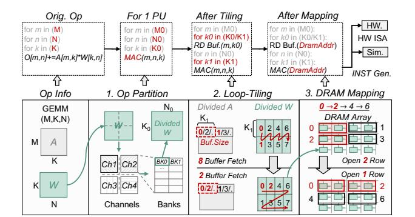
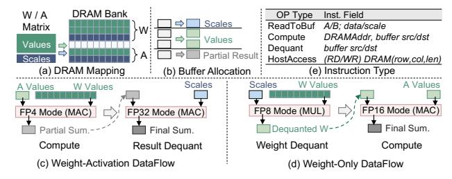

# I. INTRODUCTION

Machine learning (ML) algorithms like convolutional neural networks (CNNs) [21], [58] and large language models (LLMs) [6], [45], [55], [56] have shown remarkable ability across various fields, such as computer vision [15] and natural language processing [10]. Despite the superior performance, the amount of compute and model size of these algorithms are increasing exponentially [5], [61]. As a result, data access has become a critical bottleneck that limits the overall system performance of traditional von Neumann architectures [43].

DRAM-based Near Data Processing (NDP) architectures have been proposed as a promising solution to this problem by placing processing units (PUs) inside main memory and distributing them near different memory units to exploit the high internal bandwidth [2], [3], [8], [12], [13], [16]–[18], [22], [23], [25], [28], [29], [31], [33], [34], [36], [37], [46], [48], [51], [53], [54], [62], [64], [67]. Since general matrix multiplication (GEMM), including matrix-matrix (MM) and matrix-vector multiplication (MVM), dominates the compute and memory footprint of ML workloads, NDP architectures primarily focus on processing GEMM operators. Other nonlinear operations (e.g., softmax) are handled via lookup tables, functional approximation, or offloaded to the host [33].

In addition to leveraging NDP hardware features to reduce memory access overhead, quantization serves as an effective method on the algorithmic side to reduce data volume, which compresses high-precision GEMM into low-bit formats [19], [20], [39], [44], [59]. To mitigate the accuracy loss introduced by quantization especially for the error-sensitive LLMs, group-wise low-bit floating-point (FP) has gained significant attention [1], [7], [9], [14], [32], [41], [47], [50], [60], [65], [66]. The high precision of low-bit FP is guaranteed by two facts: (1) FP data format uses "exponent + mantissa" to provide finer quantization resolution over a wider dynamic range than integers with the same bit-width; and (2) groupwise quantization, where high-precision data are divided into different quantization groups (QGroups). Each QGroup is associated with its own scaling factor (abbreviated as scale) to project the original data into the representable range of the low-bit FP format. As a result, low-bit FP quantization can better handle outliers under fine-grained grouping (e.g., 16 elements / QGroup [66]). With the combination of these two characteristics, FP4 quantization has demonstrated 3∼4× speedups and ∼4× memory size reduction over high-precision (FP16) LLMs on GPUs, while maintaining comparable accuracy for both training and inference [7], [66].

Due to their superior performance, low-bit FP is also being actively explored in industry. Key players like DeepSeek [41] and NVIDIA [1], [9], [11] have already begun optimizing infrastructure and hardware for low-bit FP formats. In addition, enabling low-bit FP quantization can substantially alleviate the memory-capacity pressure of the DRAM-based NDP architecture imposed by LLMs. As a result, we believe that *bringing NDP architectures into the low-bit FP era is highly valuable*.

However, although low-bit FP has already been implemented on GPU/CPU, existing compilers cannot be reused for deploying this technique on NDP architectures. The reasons

† Work done during internship at Tsinghua University.

∗ Corresponding Author: zhuzhenhua@mail.tsinghua.edu.cn

1Available at https://github.com/ISCA26-FlexQ-NDP-ae/flexq ndp

are twofold: (1) Different to GPU/CPU, processing units (PUs) and memory units are tightly coupled in NDP architectures. Consequently, NDP performance depends not only on how workloads are mapped to different PUs, but also on the data layout in DRAM, e.g., different layouts may cause different DRAM row-buffer miss rates [63]. (2) Dedicated NDP compilers [30], [42], [49], [63] have been developed to optimize INT operator partition and data layout in DRAM. However, introducing low-bit FP quantization with fine-grained grouping into NDP systems faces several new challenges, which cannot be handled by existing NDP compilers.

First, the configurations of low-bit FP quantization (QConfigs) vary in terms of group granularity, value/scale precision, weight-only or weight-activation quantization, etc., and these differences are overlooked by existing NDP compilers. However, different QConfigs exhibit distinct preferences for NDP compilation strategies. For example, compared with weightactivation quantization, in weight-only quantization, weights need to be dequantized before multiply-accumulate (MAC) operation, which prioritizes allocating buffer to weights to avoid redundant dequantization. Therefore, the NDP compiler for low-bit FP necessitates exploration of the compilation space to identify the optimal strategy for a given QConfig. The compilation space is the Cartesian product of design choices for matrix-operator partitioning, data-mapping strategies, loop traversal orders, and PU/buffer allocation, which is enormous and requires an efficient exploration strategy.

Second, the presence of fine-grained group scales in low-bit FP computation introduces additional complexity and challenge to NDP dataflow scheduling. Considering the limited KB-level buffer capacity in NDP, a key optimization objective of NDP dataflow is maximizing the SRAM buffer hit rate and reducing DRAM row-changing overhead. However, with finegrained grouping, the amount of scale becomes non-negligible compared to quantized value. Both value and scale need to share the limited on-chip SRAM, causing reduced buffer hit rates. Besides, the fine-grained grouping also leads to frequent switching between value access and scale access during computation, introducing extra DRAM row-changing overhead. Our experiment shows the presence of scales increases the latency by ∼1.34×.

Third, the group-wise quantization scheme introduces finegrained dequantization operations, which are performed in high precision and therefore incur significant latency and DRAM idle time on NDP architectures. Prior studies have shown that smaller group sizes improve quantization accuracy; however, they also increase computational overhead, since each group requires an independent dequantization process. For example, in NVFP4-based matrix multiplication, partial results must be multiplied by both the activation scales and weight scales after processing every 16 FP4 elements. Because these scales are stored in higher precision (FP8) and the accumulation result of 16 FP4 multiplication should be stored in higher precision, the dequantization process alone accounts for approximately 35% of the total execution latency.

Facing these challenges, we designed *FlexQ-NDP*, an NDP

compiler tailored for low-bit FP computation. The contributions of this work include:

- We develop a cycle-accurate simulation framework to model group-wise low-bit FP computation on NDP architectures, which comprehensively analyzes the group-wise scaling and dequantization overheads.
- We design a scale-value interleaved FP layout to map a quantized matrix to DRAM, which adapts to different group sizes and matrix tiling strategies. The proposed FP data layout effectively reduces DRAM row-changing overhead by 2×.
- We propose a dequantization-hiding technique based on instruction reordering to reduce the DRAM idle time induced by frequent dequantization operations. It can automatically identify the opportunity to overlap the dequantization latency with existing value access and DRAM row-changing delay.
- We systematically analyze the compatibility between NDP compilation strategies and QConfig to derive NDPoriented FP compilation guidelines. Building on these guidelines, we develop a lightweight compilation-space pruning and search strategy to enable efficient low-bit FP computation on NDP.

Experiments show that *FlexQ-NDP* achieves up to 3.29× operator-level and 2.73× end-to-end speedup over existing NDP compilation strategies across various low-bit FP formats.

## II. BACKGROUND

## *A. Group-Wise Low-bit FP Quantization*

Quantization is a fundamental ML compression technique to reduce memory footprint and computation costs while maintaining acceptable accuracy. Recent work on quantizationbased training and inference has shifted from integer-only to group-wise low-bit FP formats, such as microscaling family (MXFP4/6/8) [32], [47] and NVIDIA's NVFP4 [1], [9]. The low-bit FP values retain the "sign + exponent + mantissa" structure while relying on higher-precision group scales to recover effective dynamic range and preserve model accuracy at ultra-low precision.

The low-bit FP quantization process starts from partitioning the high-precision (e.g., FP16) tensors/matrices into finegrained groups (e.g., 16×1 vectors or 16×16 tiles [9], [66]). For each group, a scale sg is chosen based on the local statistics and the representable range of the target low-bit FP format. Then the values are normalized by sg and rounded to the nearest representable low-bit FP value. Targeting ML models, low-bit FP is applied to weights and optionally activations for each operator. Weight-only quantization refers to only quantizing model weights to low precision [4], [40]. It avoids dynamically quantizing activations but requires dequantizing weights back to higher precision before computation. In contrast, weight-activation quantization quantizes both weights and activations to low-bit formats, delivering greater efficiency at the cost of runtime quantization process [41], [65].

We adopt a generic view of low-bit FP that can represent different QConfigs: each QConfig is characterized by its group

Fig. 1. Basic Compilation Flow of NDP Architectures

Fig. 2. Low-bit FP-oriented NDP Architecture

size, scale format, value format, and weight-only/weight-activation quantization.

#### B. Baseline NDP Compilation Flow

Fig. 1 illustrates existing NDP compilation flow, which contains operator partition, loop tiling, DRAM mapping, and instruction generation [42], [63]. Because PU and memory units are tightly coupled in NDP, data access, compute, and communication performance all strongly depend on data layout. First of all, the operator partition divides the weight matrix into multiple blocks. When each block is mapped to a specific memory unit (e.g., a DRAM bank), it also determines the PU that will process the block. Then, loop tiling optimizes the traversal order to maximize the data reuse in SRAM buffer. After that, DRAM mapping procedure assigns the specific row/column address for each block (i.e., optimizes the data layout). The optimization objective here is to reduce DRAM row-buffer miss. When PU needs to access data in another DRAM row (i.e., row-changing), a precharge DRAM command is required to close the current open row and charge the bitline, which is more expensive than repeatedly accessing the same row. Finally, NDP compiler generates the instructions to enable performance simulation (offline) and control NDP hardware (online). The instructions will be further split into a series of DRAM commands and PU commands.

## III. LOW-BIT FP-ORIENTED NDP ARCHITECTURE

#### A. Architecture Overview

Since current mainstream NDP architectures do not support fine-grained grouped FP formats, we extend the Hynix AiM

Fig. 3. Baseline Low-bit FP GEMM Compilation Flow

[33] architecture to enable group-wise scaling and dequantization. This allows further quantification and analysis of the overhead introduced by such formats in Sec. IV.

Fig. 2(a) illustrates the overall system organization. Similar to the Hynix-AiM architecture, the NDP system consists of 32 GDDR6 chips, each containing two memory channels. The host communicates with the NDP system through PCIe. Each channel contains 16 DRAM banks. As illustrated in Fig. 2(b), a multi-precision PU is attached to each bank and reused for both low-precision value computation and high-precision dequantization. In addition, a 5Kb SRAM buffer is placed near each bank, organized as 20 individual 32B buffers. Each 32B buffer can be configured to store values, scales, or partial sums.

For different FP formats, the total operand width that can be processed in parallel by each PU is fixed at 256b, matching the GDDR6 read/write bit width. As shown in Fig. 2(c), the decoding and exponent processing of each format are handled individually, while the mantissa computation reuses the same multiplier array. The adder tree is further optimized by using different precisions at different levels. The detailed design and implementation of the PU are described in Sec. IX-A. Besides MAC operations, the PU also supports MUL operations for dequantization without accumulation in weight-only cases.

#### B. Baseline Low-bit FP Compilation Flow

To execute fine-grained grouped FP-based GEMM on the NDP architecture, the existing NDP compilation flow needs to be extended to deal with fine-grained group scales and the extra dequantization operations.

- 1) Scales Partitioning: After value partitioning, scales are partitioned accordingly to ensure that the scale associated with each value is located in the same DRAM bank.
- 2) Scales Mapping: As shown in Fig. 3(a), the scales of different groups are stored densely in DRAM bank, and separated from the value, following the strategy in [30] and traditional GPU systems (e.g., scales are stored in a contiguous memory layout in Triton [57]).
- 3) Buffer Allocation: Different from integer GEMM computation, where buffers are typically dedicated to values and results, low-bit FP introduces additional data such as scales and intra-group partial sums. As a result, the limited on-chip buffers must be carefully allocated for different purposes. In our design, this allocation is determined at compile time through either search-based strategies or heuristic rules.

*4) Dataflow:* The modified dataflow mainly consists of three steps. Taking weight–activation quantization as an example, the execution process is illustrated in Fig. 3(c). First, the scales of both operands, together with the values of the stationary operand, are written into the SRAM buffer. Second, the values of the other operand are streamed from DRAM and multiplied with the buffered values in the PUs; DRAM reads and PU computation are pipelined. Third, once a DRAM chunk has been fully consumed, the accumulated partial results are dequantized by the PU using scales in the buffer, and the dequantized results are written back to the buffer or DRAM.

For weight-only quantization, since the PU requires operands with the same precision, weights should be dequantized to match the precision of the activations before computation. It should also be noted that, due to the limited NDP buffer capacity, the buffer is typically not organized as a ping-pong structure. As a result, the dequantization phase cannot be overlapped with DRAM reads of scales, and PU resources occupied by dequantization cannot be used to perform GEMM computation in parallel.

#### *C. Simulation Support*

We extend the open-source NDP simulator UniNDP [63] to quantify the overhead introduced by scale accesses and dequantization operations, and to enable further compilation optimizations. Firstly, to represent the aforementioned dataflow, we design a higher-level IR wrapper over the original UniNDP instruction format to carry quantization metadata and enable future optimizations (e.g., dequantization hiding), as shown in Fig. 3(e). Secondly, on the simulator side, we modify UniNDP to support the conversion of these instructions to commands for DRAM bank, the corresponding PU, and buffers, which can be simulated in a cycle-accurate way. Finally, on the compiler side, we model the behavior of scale buffers and partial-sum buffers, enabling the compiler to insert the corresponding instructions into the operator kernel.

## IV. MOTIVATION EXPERIMENT

#### *A. Necessity for Compilation Space Exploration*

To reveal the preference of different QConfigs on NDP compilation strategies, we apply different QConfigs on a weight-activation quantized MVM operator with the matrix size of 5120×5120. The QConfigs contain different value/scale precisions and QGroup sizes, as shown in Fig. 4(a). For these QConfigs, the compilation space is constructed by including operator partition, loop tiling and traversal order, data mapping, and buffer allocation. We then exhaustively search for the optimal compilation strategy to deploy each QConfig on the NDP architecture. We denote the optimal compilation strategy for QConfig Qi as Si . Fig. 4(b) shows the performance of pairwise combinations of different QConfigs (e.g., {Qi}) and compilation strategies (e.g., {Si}). For simplicity, the *performance* of each column in Fig. 4(b) is normalized to that of the best compilation strategy (higher is better). The experimental results show that for each QConfig, the performance gap across different compilation strategies can be up to 70%, and no

Fig. 4. Motivation Experiment

single strategy is simultaneously optimal for all low-bit FP formats. Therefore, for a given QConfig, we need to efficiently explore the compilation space to obtain the optimal NDP performance.

## *B. Necessity for Innovative NDP Compilation Strategies*

Even with the best matching compilation strategy found in Sec. IV-A, we notice that simply selecting from existing strategies is still insufficient. Two low-bit FP-induced critical challenges still exist and require further optimization.

The first challenge is the increasing number of row changes brought by scale access. On one hand, the limited SRAM buffer should also reserve capacity for storing scales, reducing the available buffer space for values. As a result, the number of value buffer refills increases, and fetching scales requires switching between the value region and the scale region in DRAM, further increasing DRAM row-changing overhead. Fig. 4(c) shows, under different buffer sizes, the increase in DRAM row-changing and the corresponding latency overhead of low-bit FP compared to coarse-grained quantized INT with the same bit-width. Results show that processing group-wise low-bit FP on NDP increases DRAM row changes by 2.4∼11.6× and raises overall latency by 1.34∼4×.

The second challenge is the overhead of dequantization. The low-bit FP values need to be dequantized by multiplying them with scales to reconstruct higher-precision data for subsequent accumulation. In NDP architectures, the dequantization is executed by reusing PU's MAC units, but the high-precision multiplications introduce substantial DRAM idle and latency overhead. This overhead also shows different complexities in weight-only and weight-activation quantization, as illustrated in Fig. 4(d). In the former one, the complexity of dequantization is related to the size of weight data, as a result, choosing an operator partition method that can avoid weight duplication, and a loop permutation method that can maximize weight reuse, can effectively reduce the overhead. However, for weight-activation quantization, the complexity of dequant is only related to the computation bundle size (i.e., the number of dot-products prior to dequantization), which cannot be optimized through partitioning or loop optimization. Thus, we must explore other dequantization optimization techniques to reduce the dequant overhead of *weight-activation quantization*, which can account for up to 40% of the total latency.

Fig. 5. *FlexQ-NDP* Overview

## V. *FlexQ-NDP* OVERVIEW

The overview of our compilation framework *FlexQ-NDP* is shown in Fig. 5, which is built based on existing compilation flow of NDP introduced in Sec. II-B. For *operator partition and loop tiling*, we maximize reuse of the existing INToriented NDP compiler and extend it to support low-bit FP. Specifically, data partitioning considers the impact of finegrained grouping, and loop tiling is aware of DRAM data layout and SRAM buffer allocation for scales. Sec. VIII-A further elaborates how these considerations guide the exploration of the compilation space. For the *DRAM mapping* part, we introduce a scale-value interleaved layout to reduce the cost of row-changing brought by scale access, which is detailed in Sec. VI. The proposed layout method can also adapt to different QConfigs and the previously mentioned partition and tiling strategies. For the *code generation*, Sec. VII introduces a dequantization-hiding technique, which can adjust the order of dequantization and computation instructions for better instruction-level compute-memory overlap.

For a specified input, choosing a suitable compilation strategy from this framework is crucial for better performance. As a result, *FlexQ-NDP* develops a design-space exploration method (detailed in section VIII), including (1) an encoding method to construct the design space, (2) a pruning method to reduce the size of the design space, and (3) an analytical cost model which is less precise but quicker than performance simulation, to help accelerate the exploration of design space.

## VI. SCALE-VALUE INTERLEAVED FP LAYOUT FOR NDP

#### *A. Problem Example and Key Idea*

To analyze the root cause of increased row-changing, we use a quantized weight matrix as an example. As shown in the left part of Fig. 6(a), the values and scales of weight are stored separately in existing NDP and GPU solutions [30], [57]. During computation, fine-grained grouping necessitates frequently alternating DRAM accesses between scales and values, which reduces SRAM buffer hit rate considering the limited NDP buffer capacity. Refilling the buffer requires changing to a new DRAM row and change back to the original DRAM row. Experiments show that for the additional latency overhead related to scales, 75% of it is caused by DRAM row changing and only 25% is about scale access.

To address this bottleneck, our key idea is to exploit the scale-value access pattern induced by QConfig and GEMM loop schedules. For a given QConfig and loop traversal order and iteration count, we analyze the period and granularity of alternating accesses between scales and values. We then adaptively place scales and values in a tightly interleaved layout in

Fig. 6. Value-Scale Interleaved Layout

DRAM, aligning the interleave pattern with periodical access rhythm. The interleaving design reduces DRAM row changing and the associated access overhead.

#### *B. Definition and Construction of Interleaving Blocks*

In *FlexQ-NDP*, we pack the scales of multiple QGroups into one contiguous scale region, and similarly construct the value region for these QGroups. We then place the scale region and its corresponding value region contiguously in DRAM, forming an interleaving block (itBlock). The interleaving block serves two purposes. On one hand, when QGroup is small, the scales of a single QGroup cannot fully occupy a DRAM column (i.e., the minimum DRAM access granularity2 ). Concatenating the scales of multiple QGroups into one region improves DRAM column utilization. On the other hand, storing scales and values contiguously in DRAM reduces the number of DRAM row changes when the access pattern alternates between scales and values.

After defining the interleaving block, the key question is how many & which QGroups should be packed into a single itBlock for a given QConfig and loop schedule. To answer this question, for a GEMM (W(M,K) ×A(K,N) → O(M,N) ), we construct the itBlock for W in three steps.

*Step 1: Determining the interleaving ratio*, the ratio of value and scale region in itBlock. The size of QGroup and the precision of data and scale is different for different QConfigs. As a result, this ratio should also adjust to flexibly apply to different QConfigs.

$$Ratio = \frac{Size(ValueRegion)}{Size(ScaleRegion)} = \frac{Prec.(Value)G_MG_K}{Prec.(Scale)}, \quad (1)$$

where P rec.() is the precision of value/scale, GM/GK represent the group sizes of W along the M/K dimensions, respectively. Besides, values in the same QGroup are required to be assigned to the same itBlock, otherwise the scale for this QGroup needs to be duplicated to another itBlock.

*Step 2: Determine the interleaving stride*, the size of an itBlock. Given different buffer sizes, the refill frequency of scale buffer will also be different. As a result, we should support adjusting the stride of interleaving to different refill

2This should also consider Burst Length. We omit it solely for brevity.

frequency. We choose a DRAM column as the minimal granularity for the scale region in an itBlock. This can avoid over fine-grained mixing of scale and value. Assuming that the scale region contains  $Col_S$  DRAM columns,  $Col_S$  is constrained by the allocated scale buffer size, which can be explored in the compilation space. Then, the number of QGroups in the data region of an itBlock should be:

$$\#QGroup = \frac{Col_S \times len}{Prec.(Scale)},$$
 (2)

where *len* is the bitwidth of one DRAM column. As shown in the case in Fig. 6(b), if one DRAM column can store four scales, there will be eight QGroups in the *itBlock* when assigning two DRAM columns to scale buffer.

Step 3: Determine which QGroups should be mapped to the same itBlock. As shown in Fig. 6(c), assuming the compiler performs loop tiling on the K dimension with the tiled loop size of  $K_{Tile}$ , our mapping should ensure that the data in the tiled inope is stored together in DRAM to reduce row change overhead. As a result, we will select the QGroups for an itBlock following the iteration order of inner loop. For the Case-1 in Fig. 6(c), each itBlock contains eight QGroups. If the tiled inner loop size equals to four QGroups, we will map  $2\times 4$  QGroups along the (M,K) dimension of the weight matrix into a single itBlock. To be general, this number can be calculated as:

$$#QGroup_K = \lceil K_{Tile}/G_K \rceil.$$
 (3)

However, if the tiled loop size changes and makes  $\#QGroup_K$  become three in Case-2 in Fig. 6(c), the last two QGroups cannot fully cover the inner loop in the K dimension. As a result, extra access to data region in other itBlocks will be triggered when the inner loop iterates over the boundary. In this case, we will reduce the number of QGroups in itBlock to six. Although this may lead to under-utilization in some DRAM columns storing scales, it avoids reloading much larger QGroup. To be general, the actual number of QGroups in an itBlock, and the corresponding DRAM column number are:

$$#QGroup' = #QGroup_K \times \lfloor #QGroup/#QGroup_K \rfloor, \qquad (4)$$

$$\#Col_{itBlock}^{Value} = \left\lceil Col_S \times Ratio \times \frac{\#QGroup'}{\#QGroup} \right\rceil, \tag{5}$$

$$#Col_{itBlock}^{Scale} = \left[ Col_S \times \frac{#QGroup'}{#QGroup} \right]. \tag{6}$$

#### C. Mapping itBlocks to DRAM

After mapping multiple QGroups into one itBlock, the next step is to assign the physical DRAM address for itBlocks. Firstly, we split the entire matrix into multiple itBlocks and calculate the itBlock id  $(id_{itBlock})$  and the value id within each itBlock  $(id_{InBlock})$ . For example, in the K dimension:

$$id_{itBlock}^{K}(k) = \lfloor k/(\#QGroup_K \times G_K) \rfloor$$

$$id_{InBlock}^{K}(k) = k\%(\#QGroup_K \times G_K)$$
(7)

Then, the scale region will be mapped in DRAM before the value region so that scales can be buffered before usage. Once the value and scale in an itBlock are determined, scales are

stored in  $Col_S$  DRAM columns QGroup by QGroup. Values will be stored in the original order of inner loop to minimize row change, and the logical DRAM column id is:

$$\begin{split} Col_{local}^{id} &= \left\lfloor \frac{id_{InBlock}^{K}}{\#Val/Col} \right\rfloor + id_{InBlock}^{M} \times \left\lceil \frac{\#QGroup_{K} * G_{K}}{\#Val/Col} \right\rceil \\ Col_{logical}^{id} &= Col_{local}^{id} + id_{itBlock} \times \#Col_{itBlock}^{Value + Scale} \end{split} \tag{8}$$

Finally, we can convert the logical DRAM column id into the physical DRAM column and row id:

$$\mathbf{DRAM}\text{-}Row^{id} = \lfloor Col_{logical}^{id} / \#Col_{DRAM\_row} \rfloor,$$

$$\mathbf{DRAM}\text{-}Col^{id} = Col_{logical}^{id} \% \#Col_{DRAM\_row}.$$
(9)

Furthermore, to avoid runtime re-layout of the intermediate results between operators, we prioritize applying this technique to the quantized weight matrix, which can be scheduled offline.

#### VII. DEQUANTIZATION-HIDING TECHNIQUE

#### A. Discovering the Opportunity for Dequant Optimization

As discussed in Sec. IV-A, weight-activation FP quantization *FlexQ-NDP*'s dequantization-hiding technique is inspired by an interesting phenomenon:

**Interesting observation:** In the motivation experiments, when the QGroup size increases to 128, the dequantization contributes *zero additional latency*.

A closer examination of these zero-overhead dequantization instructions reveals that they all occur between accesses to two different DRAM rows. For example, after the PU finishes processing the weight data in the DRAM row-1 and before it begins processing the next row, the DRAM must precharge row-1 and activate row-2, as shown in Fig. 7(a). During this time window, the PU remains idle for a relatively long interval (i.e.,  $t_{RP} + t_{RCD} = 48$  cycles based on DRAMSim3 timing parameters [38]). Since a dequantization operation here costs only 8 cycles (i.e.,  $2 \cdot t_{CCDL}$ ) and requires no DRAM access, it can execute within this **idle window** and therefore incurs no extra latency. Similar opportunities arise when a row-change is triggered by a buffer refill. We refer to the instruction positions where a dequantization operation can be executed within a PU idle window without adding latency as *free slots*.

We then revisit the case with smaller QGroup sizes, where dequantization occurs more frequently, and leads to critical latency. Two observations emerge: (1) only about 10% of dequantization instructions naturally fall into free slots; (2) the latency of a dequantization operation is determined by the number of partial results it processes, which is constrained by the buffer size allocated to partial results. These observations indicate that the total PU idle time can be exploited to hide dequantization latency, allowing dequantization to overlap with DRAM row changing or access. However, the dequantization latency is tightly coupled to the buffer size reserved for partial results. Without careful design, we may fail to fully utilize the available idle window, leading to suboptimal overlap.

Fig. 7. Instruction Reordering-based Dequant. Hiding

## *B. Key Idea of Dequantization Hiding*

The intuitive idea is to aggregate these fine-grained dequantization operations by buffering more partial results in the SRAM and dequantizing them together. In principle, this would allow a combined dequantization to fully occupy the idle window at a free slot. However, enforcing strict alignment between combined dequantization and free slots is difficult, as shown in Fig. 7(c). The reason is the mismatch between the occurrence periods of idle windows and combined dequantization. The idle window period is determined by the DRAM layout of the itBlock, i.e., how much data is fetched and processed before a DRAM row is completed and a row change occurs. In contrast, the dequantization period is determined by when the partial results fill the buffer space. Relying on exact alignment would also miss many optimization opportunities.

Instead, we propose a more flexible approach that automatically aligns the dequantization with idle windows, independent of the specific data layout and loop scheduling. The key idea is to precisely "move" the fine-grained dequantization instructions into free slots by instruction reordering, and combine multiple dequantization instructions at the same free slot to fully utilize the idle window, as illustrated in Fig. 7(c). It ensures full utilization of the idle window while preserving flexibility by triggering dequantization based on hiding opportunities instead of buffer limitation.

#### *C. Dequantization Instruction Reordering Rules*

When reordering dequantization instructions, several constraints must be satisfied.

*Rule 1: Constraint of data dependencies.* Since each dequantization operation depends on the partial result produced earlier, it cannot be moved backward to a free slot that appears before its original position. Therefore, *dequantization instructions can only be moved forward*. In addition, dequantization instruction cannot be moved past a later dequantization instruction. And if a dequantization is moved past a DRAM read triggered by scale buffer refill, the required scales for the dequantization would be discarded before being used. So this behavior is also prohibited.

*Rule 2: Constraint of buffer size of partial result.* Moving dequantization across computation instructions requires stor-

# I. INTRODUCTION

Machine learning (ML) algorithms like convolutional neural networks (CNNs) [21], [58] and large language models (LLMs) [6], [45], [55], [56] have shown remarkable ability across various fields, such as computer vision [15] and natural language processing [10]. Despite the superior performance, the amount of compute and model size of these algorithms are increasing exponentially [5], [61]. As a result, data access has become a critical bottleneck that limits the overall system performance of traditional von Neumann architectures [43].

DRAM-based Near Data Processing (NDP) architectures have been proposed as a promising solution to this problem by placing processing units (PUs) inside main memory and distributing them near different memory units to exploit the high internal bandwidth [2], [3], [8], [12], [13], [16]–[18], [22], [23], [25], [28], [29], [31], [33], [34], [36], [37], [46], [48], [51], [53], [54], [62], [64], [67]. Since general matrix multiplication (GEMM), including matrix-matrix (MM) and matrix-vector multiplication (MVM), dominates the compute and memory footprint of ML workloads, NDP architectures primarily focus on processing GEMM operators. Other nonlinear operations (e.g., softmax) are handled via lookup tables, functional approximation, or offloaded to the host [33].

In addition to leveraging NDP hardware features to reduce memory access overhead, quantization serves as an effective method on the algorithmic side to reduce data volume, which compresses high-precision GEMM into low-bit formats [19], [20], [39], [44], [59]. To mitigate the accuracy loss introduced by quantization especially for the error-sensitive LLMs, group-wise low-bit floating-point (FP) has gained significant attention [1], [7], [9], [14], [32], [41], [47], [50], [60], [65], [66]. The high precision of low-bit FP is guaranteed by two facts: (1) FP data format uses "exponent + mantissa" to provide finer quantization resolution over a wider dynamic range than integers with the same bit-width; and (2) groupwise quantization, where high-precision data are divided into different quantization groups (QGroups). Each QGroup is associated with its own scaling factor (abbreviated as scale) to project the original data into the representable range of the low-bit FP format. As a result, low-bit FP quantization can better handle outliers under fine-grained grouping (e.g., 16 elements / QGroup [66]). With the combination of these two characteristics, FP4 quantization has demonstrated 3∼4× speedups and ∼4× memory size reduction over high-precision (FP16) LLMs on GPUs, while maintaining comparable accuracy for both training and inference [7], [66].

Due to their superior performance, low-bit FP is also being actively explored in industry. Key players like DeepSeek [41] and NVIDIA [1], [9], [11] have already begun optimizing infrastructure and hardware for low-bit FP formats. In addition, enabling low-bit FP quantization can substantially alleviate the memory-capacity pressure of the DRAM-based NDP architecture imposed by LLMs. As a result, we believe that *bringing NDP architectures into the low-bit FP era is highly valuable*.

However, although low-bit FP has already been implemented on GPU/CPU, existing compilers cannot be reused for deploying this technique on NDP architectures. The reasons

† Work done during internship at Tsinghua University.

∗ Corresponding Author: zhuzhenhua@mail.tsinghua.edu.cn

1Available at https://github.com/ISCA26-FlexQ-NDP-ae/flexq ndp

are twofold: (1) Different to GPU/CPU, processing units (PUs) and memory units are tightly coupled in NDP architectures. Consequently, NDP performance depends not only on how workloads are mapped to different PUs, but also on the data layout in DRAM, e.g., different layouts may cause different DRAM row-buffer miss rates [63]. (2) Dedicated NDP compilers [30], [42], [49], [63] have been developed to optimize INT operator partition and data layout in DRAM. However, introducing low-bit FP quantization with fine-grained grouping into NDP systems faces several new challenges, which cannot be handled by existing NDP compilers.

First, the configurations of low-bit FP quantization (QConfigs) vary in terms of group granularity, value/scale precision, weight-only or weight-activation quantization, etc., and these differences are overlooked by existing NDP compilers. However, different QConfigs exhibit distinct preferences for NDP compilation strategies. For example, compared with weightactivation quantization, in weight-only quantization, weights need to be dequantized before multiply-accumulate (MAC) operation, which prioritizes allocating buffer to weights to avoid redundant dequantization. Therefore, the NDP compiler for low-bit FP necessitates exploration of the compilation space to identify the optimal strategy for a given QConfig. The compilation space is the Cartesian product of design choices for matrix-operator partitioning, data-mapping strategies, loop traversal orders, and PU/buffer allocation, which is enormous and requires an efficient exploration strategy.

Second, the presence of fine-grained group scales in low-bit FP computation introduces additional complexity and challenge to NDP dataflow scheduling. Considering the limited KB-level buffer capacity in NDP, a key optimization objective of NDP dataflow is maximizing the SRAM buffer hit rate and reducing DRAM row-changing overhead. However, with finegrained grouping, the amount of scale becomes non-negligible compared to quantized value. Both value and scale need to share the limited on-chip SRAM, causing reduced buffer hit rates. Besides, the fine-grained grouping also leads to frequent switching between value access and scale access during computation, introducing extra DRAM row-changing overhead. Our experiment shows the presence of scales increases the latency by ∼1.34×.

Third, the group-wise quantization scheme introduces finegrained dequantization operations, which are performed in high precision and therefore incur significant latency and DRAM idle time on NDP architectures. Prior studies have shown that smaller group sizes improve quantization accuracy; however, they also increase computational overhead, since each group requires an independent dequantization process. For example, in NVFP4-based matrix multiplication, partial results must be multiplied by both the activation scales and weight scales after processing every 16 FP4 elements. Because these scales are stored in higher precision (FP8) and the accumulation result of 16 FP4 multiplication should be stored in higher precision, the dequantization process alone accounts for approximately 35% of the total execution latency.

Facing these challenges, we designed *FlexQ-NDP*, an NDP

compiler tailored for low-bit FP computation. The contributions of this work include:

- We develop a cycle-accurate simulation framework to model group-wise low-bit FP computation on NDP architectures, which comprehensively analyzes the group-wise scaling and dequantization overheads.
- We design a scale-value interleaved FP layout to map a quantized matrix to DRAM, which adapts to different group sizes and matrix tiling strategies. The proposed FP data layout effectively reduces DRAM row-changing overhead by 2×.
- We propose a dequantization-hiding technique based on instruction reordering to reduce the DRAM idle time induced by frequent dequantization operations. It can automatically identify the opportunity to overlap the dequantization latency with existing value access and DRAM row-changing delay.
- We systematically analyze the compatibility between NDP compilation strategies and QConfig to derive NDPoriented FP compilation guidelines. Building on these guidelines, we develop a lightweight compilation-space pruning and search strategy to enable efficient low-bit FP computation on NDP.

Experiments show that *FlexQ-NDP* achieves up to 3.29× operator-level and 2.73× end-to-end speedup over existing NDP compilation strategies across various low-bit FP formats.

## II. BACKGROUND

## *A. Group-Wise Low-bit FP Quantization*

Quantization is a fundamental ML compression technique to reduce memory footprint and computation costs while maintaining acceptable accuracy. Recent work on quantizationbased training and inference has shifted from integer-only to group-wise low-bit FP formats, such as microscaling family (MXFP4/6/8) [32], [47] and NVIDIA's NVFP4 [1], [9]. The low-bit FP values retain the "sign + exponent + mantissa" structure while relying on higher-precision group scales to recover effective dynamic range and preserve model accuracy at ultra-low precision.

The low-bit FP quantization process starts from partitioning the high-precision (e.g., FP16) tensors/matrices into finegrained groups (e.g., 16×1 vectors or 16×16 tiles [9], [66]). For each group, a scale sg is chosen based on the local statistics and the representable range of the target low-bit FP format. Then the values are normalized by sg and rounded to the nearest representable low-bit FP value. Targeting ML models, low-bit FP is applied to weights and optionally activations for each operator. Weight-only quantization refers to only quantizing model weights to low precision [4], [40]. It avoids dynamically quantizing activations but requires dequantizing weights back to higher precision before computation. In contrast, weight-activation quantization quantizes both weights and activations to low-bit formats, delivering greater efficiency at the cost of runtime quantization process [41], [65].

We adopt a generic view of low-bit FP that can represent different QConfigs: each QConfig is characterized by its group

Fig. 1. Basic Compilation Flow of NDP Architectures

Fig. 2. Low-bit FP-oriented NDP Architecture

size, scale format, value format, and weight-only/weight-activation quantization.

#### B. Baseline NDP Compilation Flow

Fig. 1 illustrates existing NDP compilation flow, which contains operator partition, loop tiling, DRAM mapping, and instruction generation [42], [63]. Because PU and memory units are tightly coupled in NDP, data access, compute, and communication performance all strongly depend on data layout. First of all, the operator partition divides the weight matrix into multiple blocks. When each block is mapped to a specific memory unit (e.g., a DRAM bank), it also determines the PU that will process the block. Then, loop tiling optimizes the traversal order to maximize the data reuse in SRAM buffer. After that, DRAM mapping procedure assigns the specific row/column address for each block (i.e., optimizes the data layout). The optimization objective here is to reduce DRAM row-buffer miss. When PU needs to access data in another DRAM row (i.e., row-changing), a precharge DRAM command is required to close the current open row and charge the bitline, which is more expensive than repeatedly accessing the same row. Finally, NDP compiler generates the instructions to enable performance simulation (offline) and control NDP hardware (online). The instructions will be further split into a series of DRAM commands and PU commands.

## III. LOW-BIT FP-ORIENTED NDP ARCHITECTURE

#### A. Architecture Overview

Since current mainstream NDP architectures do not support fine-grained grouped FP formats, we extend the Hynix AiM

Fig. 3. Baseline Low-bit FP GEMM Compilation Flow

[33] architecture to enable group-wise scaling and dequantization. This allows further quantification and analysis of the overhead introduced by such formats in Sec. IV.

Fig. 2(a) illustrates the overall system organization. Similar to the Hynix-AiM architecture, the NDP system consists of 32 GDDR6 chips, each containing two memory channels. The host communicates with the NDP system through PCIe. Each channel contains 16 DRAM banks. As illustrated in Fig. 2(b), a multi-precision PU is attached to each bank and reused for both low-precision value computation and high-precision dequantization. In addition, a 5Kb SRAM buffer is placed near each bank, organized as 20 individual 32B buffers. Each 32B buffer can be configured to store values, scales, or partial sums.

For different FP formats, the total operand width that can be processed in parallel by each PU is fixed at 256b, matching the GDDR6 read/write bit width. As shown in Fig. 2(c), the decoding and exponent processing of each format are handled individually, while the mantissa computation reuses the same multiplier array. The adder tree is further optimized by using different precisions at different levels. The detailed design and implementation of the PU are described in Sec. IX-A. Besides MAC operations, the PU also supports MUL operations for dequantization without accumulation in weight-only cases.

#### B. Baseline Low-bit FP Compilation Flow

To execute fine-grained grouped FP-based GEMM on the NDP architecture, the existing NDP compilation flow needs to be extended to deal with fine-grained group scales and the extra dequantization operations.

- 1) Scales Partitioning: After value partitioning, scales are partitioned accordingly to ensure that the scale associated with each value is located in the same DRAM bank.
- 2) Scales Mapping: As shown in Fig. 3(a), the scales of different groups are stored densely in DRAM bank, and separated from the value, following the strategy in [30] and traditional GPU systems (e.g., scales are stored in a contiguous memory layout in Triton [57]).
- 3) Buffer Allocation: Different from integer GEMM computation, where buffers are typically dedicated to values and results, low-bit FP introduces additional data such as scales and intra-group partial sums. As a result, the limited on-chip buffers must be carefully allocated for different purposes. In our design, this allocation is determined at compile time through either search-based strategies or heuristic rules.

*4) Dataflow:* The modified dataflow mainly consists of three steps. Taking weight–activation quantization as an example, the execution process is illustrated in Fig. 3(c). First, the scales of both operands, together with the values of the stationary operand, are written into the SRAM buffer. Second, the values of the other operand are streamed from DRAM and multiplied with the buffered values in the PUs; DRAM reads and PU computation are pipelined. Third, once a DRAM chunk has been fully consumed, the accumulated partial results are dequantized by the PU using scales in the buffer, and the dequantized results are written back to the buffer or DRAM.

For weight-only quantization, since the PU requires operands with the same precision, weights should be dequantized to match the precision of the activations before computation. It should also be noted that, due to the limited NDP buffer capacity, the buffer is typically not organized as a ping-pong structure. As a result, the dequantization phase cannot be overlapped with DRAM reads of scales, and PU resources occupied by dequantization cannot be used to perform GEMM computation in parallel.

#### *C. Simulation Support*

We extend the open-source NDP simulator UniNDP [63] to quantify the overhead introduced by scale accesses and dequantization operations, and to enable further compilation optimizations. Firstly, to represent the aforementioned dataflow, we design a higher-level IR wrapper over the original UniNDP instruction format to carry quantization metadata and enable future optimizations (e.g., dequantization hiding), as shown in Fig. 3(e). Secondly, on the simulator side, we modify UniNDP to support the conversion of these instructions to commands for DRAM bank, the corresponding PU, and buffers, which can be simulated in a cycle-accurate way. Finally, on the compiler side, we model the behavior of scale buffers and partial-sum buffers, enabling the compiler to insert the corresponding instructions into the operator kernel.

## IV. MOTIVATION EXPERIMENT

#### *A. Necessity for Compilation Space Exploration*

To reveal the preference of different QConfigs on NDP compilation strategies, we apply different QConfigs on a weight-activation quantized MVM operator with the matrix size of 5120×5120. The QConfigs contain different value/scale precisions and QGroup sizes, as shown in Fig. 4(a). For these QConfigs, the compilation space is constructed by including operator partition, loop tiling and traversal order, data mapping, and buffer allocation. We then exhaustively search for the optimal compilation strategy to deploy each QConfig on the NDP architecture. We denote the optimal compilation strategy for QConfig Qi as Si . Fig. 4(b) shows the performance of pairwise combinations of different QConfigs (e.g., {Qi}) and compilation strategies (e.g., {Si}). For simplicity, the *performance* of each column in Fig. 4(b) is normalized to that of the best compilation strategy (higher is better). The experimental results show that for each QConfig, the performance gap across different compilation strategies can be up to 70%, and no

Fig. 4. Motivation Experiment

single strategy is simultaneously optimal for all low-bit FP formats. Therefore, for a given QConfig, we need to efficiently explore the compilation space to obtain the optimal NDP performance.

## *B. Necessity for Innovative NDP Compilation Strategies*

Even with the best matching compilation strategy found in Sec. IV-A, we notice that simply selecting from existing strategies is still insufficient. Two low-bit FP-induced critical challenges still exist and require further optimization.

The first challenge is the increasing number of row changes brought by scale access. On one hand, the limited SRAM buffer should also reserve capacity for storing scales, reducing the available buffer space for values. As a result, the number of value buffer refills increases, and fetching scales requires switching between the value region and the scale region in DRAM, further increasing DRAM row-changing overhead. Fig. 4(c) shows, under different buffer sizes, the increase in DRAM row-changing and the corresponding latency overhead of low-bit FP compared to coarse-grained quantized INT with the same bit-width. Results show that processing group-wise low-bit FP on NDP increases DRAM row changes by 2.4∼11.6× and raises overall latency by 1.34∼4×.

The second challenge is the overhead of dequantization. The low-bit FP values need to be dequantized by multiplying them with scales to reconstruct higher-precision data for subsequent accumulation. In NDP architectures, the dequantization is executed by reusing PU's MAC units, but the high-precision multiplications introduce substantial DRAM idle and latency overhead. This overhead also shows different complexities in weight-only and weight-activation quantization, as illustrated in Fig. 4(d). In the former one, the complexity of dequantization is related to the size of weight data, as a result, choosing an operator partition method that can avoid weight duplication, and a loop permutation method that can maximize weight reuse, can effectively reduce the overhead. However, for weight-activation quantization, the complexity of dequant is only related to the computation bundle size (i.e., the number of dot-products prior to dequantization), which cannot be optimized through partitioning or loop optimization. Thus, we must explore other dequantization optimization techniques to reduce the dequant overhead of *weight-activation quantization*, which can account for up to 40% of the total latency.

Fig. 5. *FlexQ-NDP* Overview

## V. *FlexQ-NDP* OVERVIEW

The overview of our compilation framework *FlexQ-NDP* is shown in Fig. 5, which is built based on existing compilation flow of NDP introduced in Sec. II-B. For *operator partition and loop tiling*, we maximize reuse of the existing INToriented NDP compiler and extend it to support low-bit FP. Specifically, data partitioning considers the impact of finegrained grouping, and loop tiling is aware of DRAM data layout and SRAM buffer allocation for scales. Sec. VIII-A further elaborates how these considerations guide the exploration of the compilation space. For the *DRAM mapping* part, we introduce a scale-value interleaved layout to reduce the cost of row-changing brought by scale access, which is detailed in Sec. VI. The proposed layout method can also adapt to different QConfigs and the previously mentioned partition and tiling strategies. For the *code generation*, Sec. VII introduces a dequantization-hiding technique, which can adjust the order of dequantization and computation instructions for better instruction-level compute-memory overlap.

For a specified input, choosing a suitable compilation strategy from this framework is crucial for better performance. As a result, *FlexQ-NDP* develops a design-space exploration method (detailed in section VIII), including (1) an encoding method to construct the design space, (2) a pruning method to reduce the size of the design space, and (3) an analytical cost model which is less precise but quicker than performance simulation, to help accelerate the exploration of design space.

## VI. SCALE-VALUE INTERLEAVED FP LAYOUT FOR NDP

#### *A. Problem Example and Key Idea*

To analyze the root cause of increased row-changing, we use a quantized weight matrix as an example. As shown in the left part of Fig. 6(a), the values and scales of weight are stored separately in existing NDP and GPU solutions [30], [57]. During computation, fine-grained grouping necessitates frequently alternating DRAM accesses between scales and values, which reduces SRAM buffer hit rate considering the limited NDP buffer capacity. Refilling the buffer requires changing to a new DRAM row and change back to the original DRAM row. Experiments show that for the additional latency overhead related to scales, 75% of it is caused by DRAM row changing and only 25% is about scale access.

To address this bottleneck, our key idea is to exploit the scale-value access pattern induced by QConfig and GEMM loop schedules. For a given QConfig and loop traversal order and iteration count, we analyze the period and granularity of alternating accesses between scales and values. We then adaptively place scales and values in a tightly interleaved layout in

Fig. 6. Value-Scale Interleaved Layout

DRAM, aligning the interleave pattern with periodical access rhythm. The interleaving design reduces DRAM row changing and the associated access overhead.

#### *B. Definition and Construction of Interleaving Blocks*

In *FlexQ-NDP*, we pack the scales of multiple QGroups into one contiguous scale region, and similarly construct the value region for these QGroups. We then place the scale region and its corresponding value region contiguously in DRAM, forming an interleaving block (itBlock). The interleaving block serves two purposes. On one hand, when QGroup is small, the scales of a single QGroup cannot fully occupy a DRAM column (i.e., the minimum DRAM access granularity2 ). Concatenating the scales of multiple QGroups into one region improves DRAM column utilization. On the other hand, storing scales and values contiguously in DRAM reduces the number of DRAM row changes when the access pattern alternates between scales and values.

After defining the interleaving block, the key question is how many & which QGroups should be packed into a single itBlock for a given QConfig and loop schedule. To answer this question, for a GEMM (W(M,K) ×A(K,N) → O(M,N) ), we construct the itBlock for W in three steps.

*Step 1: Determining the interleaving ratio*, the ratio of value and scale region in itBlock. The size of QGroup and the precision of data and scale is different for different QConfigs. As a result, this ratio should also adjust to flexibly apply to different QConfigs.

$$Ratio = \frac{Size(ValueRegion)}{Size(ScaleRegion)} = \frac{Prec.(Value)G_MG_K}{Prec.(Scale)}, \quad (1)$$

where P rec.() is the precision of value/scale, GM/GK represent the group sizes of W along the M/K dimensions, respectively. Besides, values in the same QGroup are required to be assigned to the same itBlock, otherwise the scale for this QGroup needs to be duplicated to another itBlock.

*Step 2: Determine the interleaving stride*, the size of an itBlock. Given different buffer sizes, the refill frequency of scale buffer will also be different. As a result, we should support adjusting the stride of interleaving to different refill

2This should also consider Burst Length. We omit it solely for brevity.

frequency. We choose a DRAM column as the minimal granularity for the scale region in an itBlock. This can avoid over fine-grained mixing of scale and value. Assuming that the scale region contains  $Col_S$  DRAM columns,  $Col_S$  is constrained by the allocated scale buffer size, which can be explored in the compilation space. Then, the number of QGroups in the data region of an itBlock should be:

$$\#QGroup = \frac{Col_S \times len}{Prec.(Scale)},$$
 (2)

where *len* is the bitwidth of one DRAM column. As shown in the case in Fig. 6(b), if one DRAM column can store four scales, there will be eight QGroups in the *itBlock* when assigning two DRAM columns to scale buffer.

Step 3: Determine which QGroups should be mapped to the same itBlock. As shown in Fig. 6(c), assuming the compiler performs loop tiling on the K dimension with the tiled loop size of  $K_{Tile}$ , our mapping should ensure that the data in the tiled inope is stored together in DRAM to reduce row change overhead. As a result, we will select the QGroups for an itBlock following the iteration order of inner loop. For the Case-1 in Fig. 6(c), each itBlock contains eight QGroups. If the tiled inner loop size equals to four QGroups, we will map  $2\times 4$  QGroups along the (M,K) dimension of the weight matrix into a single itBlock. To be general, this number can be calculated as:

$$#QGroup_K = \lceil K_{Tile}/G_K \rceil.$$
 (3)

However, if the tiled loop size changes and makes  $\#QGroup_K$  become three in Case-2 in Fig. 6(c), the last two QGroups cannot fully cover the inner loop in the K dimension. As a result, extra access to data region in other itBlocks will be triggered when the inner loop iterates over the boundary. In this case, we will reduce the number of QGroups in itBlock to six. Although this may lead to under-utilization in some DRAM columns storing scales, it avoids reloading much larger QGroup. To be general, the actual number of QGroups in an itBlock, and the corresponding DRAM column number are:

$$#QGroup' = #QGroup_K \times \lfloor #QGroup/#QGroup_K \rfloor, \qquad (4)$$

$$\#Col_{itBlock}^{Value} = \left\lceil Col_S \times Ratio \times \frac{\#QGroup'}{\#QGroup} \right\rceil, \tag{5}$$

$$#Col_{itBlock}^{Scale} = \left[ Col_S \times \frac{#QGroup'}{#QGroup} \right]. \tag{6}$$

#### C. Mapping itBlocks to DRAM

After mapping multiple QGroups into one itBlock, the next step is to assign the physical DRAM address for itBlocks. Firstly, we split the entire matrix into multiple itBlocks and calculate the itBlock id  $(id_{itBlock})$  and the value id within each itBlock  $(id_{InBlock})$ . For example, in the K dimension:

$$id_{itBlock}^{K}(k) = \lfloor k/(\#QGroup_K \times G_K) \rfloor$$

$$id_{InBlock}^{K}(k) = k\%(\#QGroup_K \times G_K)$$
(7)

Then, the scale region will be mapped in DRAM before the value region so that scales can be buffered before usage. Once the value and scale in an itBlock are determined, scales are

stored in  $Col_S$  DRAM columns QGroup by QGroup. Values will be stored in the original order of inner loop to minimize row change, and the logical DRAM column id is:

$$\begin{split} Col_{local}^{id} &= \left\lfloor \frac{id_{InBlock}^{K}}{\#Val/Col} \right\rfloor + id_{InBlock}^{M} \times \left\lceil \frac{\#QGroup_{K} * G_{K}}{\#Val/Col} \right\rceil \\ Col_{logical}^{id} &= Col_{local}^{id} + id_{itBlock} \times \#Col_{itBlock}^{Value + Scale} \end{split} \tag{8}$$

Finally, we can convert the logical DRAM column id into the physical DRAM column and row id:

$$\mathbf{DRAM}\text{-}Row^{id} = \lfloor Col_{logical}^{id} / \#Col_{DRAM\_row} \rfloor,$$

$$\mathbf{DRAM}\text{-}Col^{id} = Col_{logical}^{id} \% \#Col_{DRAM\_row}.$$
(9)

Furthermore, to avoid runtime re-layout of the intermediate results between operators, we prioritize applying this technique to the quantized weight matrix, which can be scheduled offline.

#### VII. DEQUANTIZATION-HIDING TECHNIQUE

#### A. Discovering the Opportunity for Dequant Optimization

As discussed in Sec. IV-A, weight-activation FP quantization *FlexQ-NDP*'s dequantization-hiding technique is inspired by an interesting phenomenon:

**Interesting observation:** In the motivation experiments, when the QGroup size increases to 128, the dequantization contributes *zero additional latency*.

A closer examination of these zero-overhead dequantization instructions reveals that they all occur between accesses to two different DRAM rows. For example, after the PU finishes processing the weight data in the DRAM row-1 and before it begins processing the next row, the DRAM must precharge row-1 and activate row-2, as shown in Fig. 7(a). During this time window, the PU remains idle for a relatively long interval (i.e.,  $t_{RP} + t_{RCD} = 48$  cycles based on DRAMSim3 timing parameters [38]). Since a dequantization operation here costs only 8 cycles (i.e.,  $2 \cdot t_{CCDL}$ ) and requires no DRAM access, it can execute within this **idle window** and therefore incurs no extra latency. Similar opportunities arise when a row-change is triggered by a buffer refill. We refer to the instruction positions where a dequantization operation can be executed within a PU idle window without adding latency as *free slots*.

We then revisit the case with smaller QGroup sizes, where dequantization occurs more frequently, and leads to critical latency. Two observations emerge: (1) only about 10% of dequantization instructions naturally fall into free slots; (2) the latency of a dequantization operation is determined by the number of partial results it processes, which is constrained by the buffer size allocated to partial results. These observations indicate that the total PU idle time can be exploited to hide dequantization latency, allowing dequantization to overlap with DRAM row changing or access. However, the dequantization latency is tightly coupled to the buffer size reserved for partial results. Without careful design, we may fail to fully utilize the available idle window, leading to suboptimal overlap.

Fig. 7. Instruction Reordering-based Dequant. Hiding

## *B. Key Idea of Dequantization Hiding*

The intuitive idea is to aggregate these fine-grained dequantization operations by buffering more partial results in the SRAM and dequantizing them together. In principle, this would allow a combined dequantization to fully occupy the idle window at a free slot. However, enforcing strict alignment between combined dequantization and free slots is difficult, as shown in Fig. 7(c). The reason is the mismatch between the occurrence periods of idle windows and combined dequantization. The idle window period is determined by the DRAM layout of the itBlock, i.e., how much data is fetched and processed before a DRAM row is completed and a row change occurs. In contrast, the dequantization period is determined by when the partial results fill the buffer space. Relying on exact alignment would also miss many optimization opportunities.

Instead, we propose a more flexible approach that automatically aligns the dequantization with idle windows, independent of the specific data layout and loop scheduling. The key idea is to precisely "move" the fine-grained dequantization instructions into free slots by instruction reordering, and combine multiple dequantization instructions at the same free slot to fully utilize the idle window, as illustrated in Fig. 7(c). It ensures full utilization of the idle window while preserving flexibility by triggering dequantization based on hiding opportunities instead of buffer limitation.

#### *C. Dequantization Instruction Reordering Rules*

When reordering dequantization instructions, several constraints must be satisfied.

*Rule 1: Constraint of data dependencies.* Since each dequantization operation depends on the partial result produced earlier, it cannot be moved backward to a free slot that appears before its original position. Therefore, *dequantization instructions can only be moved forward*. In addition, dequantization instruction cannot be moved past a later dequantization instruction. And if a dequantization is moved past a DRAM read triggered by scale buffer refill, the required scales for the dequantization would be discarded before being used. So this behavior is also prohibited.

*Rule 2: Constraint of buffer size of partial result.* Moving dequantization across computation instructions requires stor-

