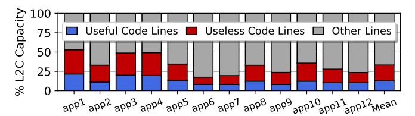
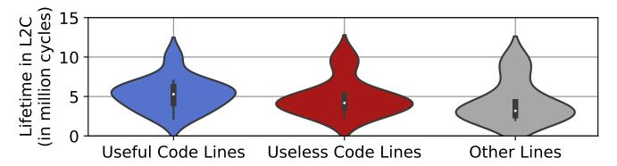

# C. Understanding Code Line Behavior in Unified L2Cs

As Section III-B showed, mobile workloads are predominantly front-end bound and instruction requests are the dominant cause of L2C misses. This result seemingly contrasts with the fact that the instruction working set (0.5MB - 2.3MB) should be able to fit into the 6MB unified L2C. While contention with the large data footprint of mobile workloads is a factor, we find that an important culprit behind the high instruction L2C misses lies in the BPU, which guides both front-end prefetching (through FDIP) and demand fetch.

Figure 4 quantifies the pressure that the studied mobile workloads exert on the BPU by reporting the total BPU MPKI (mispredictions per thousand instructions), *i.e.*, the total number of front-end resteers due to BPU mispredictions over the number of committed instructions. We additionally break down the BPU MPKI into resteers caused by last-level BTB misses (BTB MPKI) and those caused by branch direction or target misprediction (Direction/Target MPKI). Across our

(a) Fraction of L2C occupied by *useful* and *useless* code lines. The classification of code lines as *useful* or *useless* follows Definition 1.

(b) Lifetime of useful and useless code lines in L2C.

Fig. 5: Analysis of code lines in L2C.

mobile workloads, we observe an average BPU MPKI of 8.0, predominantly caused by BTB capacity misses.

Due to mispredictions, the FTQ is frequently re-steered. A key consequence of this behavior is that, on average, more than 50% of the code lines that enter the cache hierarchy do not contribute to committed instructions because they are either fetched or prefetched on the wrong execution path. The end result of this dynamics is that *over 50% of code lines that are inserted into the L2C are useless*. Definition 12 formalizes this concept, which we use throughout the paper.

**Definition 1.** A cached code line is useless if no instruction contained within that line commits before the line is evicted.

Note that a direct consequence of Definition 1 is that a hit to an instruction line does not indicate that the line is *useful*. Since wrong-path hits do not contribute to performance (because the corresponding instructions never commit), they cannot be considered *useful*.

1) Lifetime of Code Lines in the L2C: Intuitively, because useless code lines do not contribute to the execution of the program, they should be evicted as quickly as possible from the L2C, thus allowing other (useful) lines to stay longer and get more chances to exploit reuse through locality.

Alas, our analysis shows that this is not what happens in practice. Following Definition 1, Figure 5 breaks down L2C occupancy and lifetime into three categories: (i) *useless* code lines, (ii) *useful* code lines, and (iii) *other* lines (demand/prefetch data, MMU). Figure 5a shows that 17.5% to 52.8% (33.2% on average) of L2C capacity is occupied by code lines. Of those, over half (61.1% on average) are *useless* code lines. In fact, *useless* code lines occupy 20.3% of the entire L2C, amounting to over 1.2MB of capacity, on average.

Moreover, as Figure 5b shows, useless code lines exhibit remarkably similar lifetimes as useful code and other lines

in the L2C. This is problematic because *useless* code lines occupy valuable L2C space for extended periods, reducing the opportunity for other lines (useful code, data, MMU) to reside in the cache and, ultimately, harming performance. Therefore, we conclude that a scheme capable of meaningfully reducing the lifetime of *useless* code lines in the L2C has the potential to deliver great performance enhancements.

# C. Understanding Code Line Behavior in Unified L2Cs

As Section III-B showed, mobile workloads are predominantly front-end bound and instruction requests are the dominant cause of L2C misses. This result seemingly contrasts with the fact that the instruction working set (0.5MB - 2.3MB) should be able to fit into the 6MB unified L2C. While contention with the large data footprint of mobile workloads is a factor, we find that an important culprit behind the high instruction L2C misses lies in the BPU, which guides both front-end prefetching (through FDIP) and demand fetch.

Figure 4 quantifies the pressure that the studied mobile workloads exert on the BPU by reporting the total BPU MPKI (mispredictions per thousand instructions), *i.e.*, the total number of front-end resteers due to BPU mispredictions over the number of committed instructions. We additionally break down the BPU MPKI into resteers caused by last-level BTB misses (BTB MPKI) and those caused by branch direction or target misprediction (Direction/Target MPKI). Across our

(a) Fraction of L2C occupied by *useful* and *useless* code lines. The classification of code lines as *useful* or *useless* follows Definition 1.

(b) Lifetime of useful and useless code lines in L2C.

Fig. 5: Analysis of code lines in L2C.

mobile workloads, we observe an average BPU MPKI of 8.0, predominantly caused by BTB capacity misses.

Due to mispredictions, the FTQ is frequently re-steered. A key consequence of this behavior is that, on average, more than 50% of the code lines that enter the cache hierarchy do not contribute to committed instructions because they are either fetched or prefetched on the wrong execution path. The end result of this dynamics is that *over 50% of code lines that are inserted into the L2C are useless*. Definition 12 formalizes this concept, which we use throughout the paper.

**Definition 1.** A cached code line is useless if no instruction contained within that line commits before the line is evicted.

Note that a direct consequence of Definition 1 is that a hit to an instruction line does not indicate that the line is *useful*. Since wrong-path hits do not contribute to performance (because the corresponding instructions never commit), they cannot be considered *useful*.

1) Lifetime of Code Lines in the L2C: Intuitively, because useless code lines do not contribute to the execution of the program, they should be evicted as quickly as possible from the L2C, thus allowing other (useful) lines to stay longer and get more chances to exploit reuse through locality.

Alas, our analysis shows that this is not what happens in practice. Following Definition 1, Figure 5 breaks down L2C occupancy and lifetime into three categories: (i) *useless* code lines, (ii) *useful* code lines, and (iii) *other* lines (demand/prefetch data, MMU). Figure 5a shows that 17.5% to 52.8% (33.2% on average) of L2C capacity is occupied by code lines. Of those, over half (61.1% on average) are *useless* code lines. In fact, *useless* code lines occupy 20.3% of the entire L2C, amounting to over 1.2MB of capacity, on average.

Moreover, as Figure 5b shows, useless code lines exhibit remarkably similar lifetimes as useful code and other lines

in the L2C. This is problematic because *useless* code lines occupy valuable L2C space for extended periods, reducing the opportunity for other lines (useful code, data, MMU) to reside in the cache and, ultimately, harming performance. Therefore, we conclude that a scheme capable of meaningfully reducing the lifetime of *useless* code lines in the L2C has the potential to deliver great performance enhancements.

