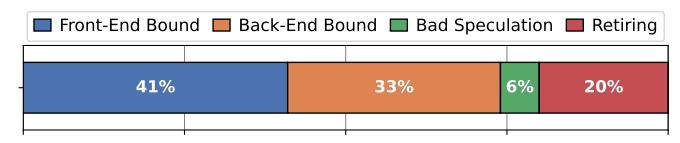
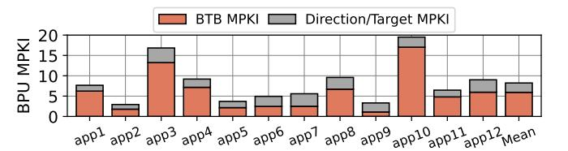

# I. INTRODUCTION

Modern high-end CPUs [\[1\]](#page-13-0)–[\[3\]](#page-13-1) dedicate significant resources to the front-end to sustain performance. Examples include sophisticated branch predictors [\[4\]](#page-13-2), multi-level Branch Target Buffers (BTBs), and large first-level instruction caches (L1I). To sustain high instruction supply bandwidth, they also decouple the Branch Prediction Unit (BPU) from the Instruction Fetch Unit (IFU) [\[5\]](#page-13-3) using the Fetch Target Queue (FTQ), while employing Fetch Directed Instruction Prefetching (FDIP) [\[6\]](#page-13-4) to exploit this decoupling to issue instruction prefetches into the L1I ahead of demand accesses.

Server workloads, with their large code footprint, have been shown to overwhelm front-end structures [\[7\]](#page-13-5), [\[8\]](#page-13-6) and have driven most recent research on improving the CPU front-end. Studies by Google [\[9\]](#page-13-7) and Meta [\[10\]](#page-13-8) demonstrated that frontend stalls account for 15–30% of pipeline slots in servers [\[2\]](#page-13-9), [\[11\]](#page-13-10). While the relevance of the front-end bottleneck is wellestablished for server workloads, mobile applications have remained comparatively underexplored, despite their ubiquity and demanding software stacks. We bridge this gap by characterizing real-world mobile workloads drawn from market research using an industry-grade, cycle-accurate simulator.

Our analysis [\[12\]](#page-13-11), [\[13\]](#page-13-12) demonstrates that contemporary mobile applications (i) have massive code and data footprints ranging between 0.5MB-2.3MB and 2.0MB-15.0MB, respectively, (ii) are heavily front-end bound, spending on average 41% of cycles waiting for front-end resources, and (iii) place substantial pressure on cache hierarchies representative of modern high-end mobile CPUs, with a notably-high L2 cache (L2C) MPKI for instruction lines[1](#page-0-0) (8.4 MPKI on average). Such high L2C instruction MPKI stems from a key front-end inefficiency: on average, more than 50% of the fetch blocks that insert code lines into the L2C are subsequently flushed due to front-end re-steers, caused by BTB misses and branch mispredictions. The combination of wrong-path execution and FDIP-directed prefetching on the wrong path results in the L2C being polluted with many *useless* code lines that do not result in any instructions being committed before their eviction. For a representative 6MB L2C design [\[2\]](#page-13-9), we found 20.3% of the L2C capacity, on average, to be occupied by *useless* code lines when running modern mobile applications.

We considered a number of microarchitectural options to mitigate code pollution in the L2C for modern mobile applications, but found that all fall short. For instance, the state-of-theart code-aware L2C replacement policy [\[14\]](#page-13-13) fails to mitigate L2C code pollution because it lacks the ability to discriminate between *useful* and *useless* code lines and, as a result, ends up prioritizing a large number of *useless* code lines that are allocated on the wrong path and whose instructions never commit. We also attempted tuning the FTQ size to manage the aggressiveness of FDIP and filtering prefetch requests [\[15\]](#page-13-14), but found this direction impractical: removing a large number of *useless* requests is required to realize meaningful performance gains, but filtering even a small fraction of *useful* requests can severely harm performance.

1We use *instruction line* and *code line* interchangeably throughout the paper.

Fig. 1: Decoupled front-end and Fetch Directed Instruction Prefetching (FDIP) deployed in a contemporary microarchitecture.

To enable effective capacity management of instruction lines in the L2C, we make a critical observation: The presence of *committed* instructions in L2C-resident code lines can be used as a reliable proxy for determining the lines' usefulness. By using this insight to discriminate *useful* and *useless* code lines, simple cache management policies can be deployed to prioritize the former and rapidly evict the latter.

Our work capitalizes on this insight and proposes *Bumper*, a low-cost microarchitectural scheme that distinguishes between *useful* and *useless* code lines in L2C. Bumper initially inserts all code lines into the L2C at low-priority and subsequently promotes only the ones it identifies as *useful*, *i.e.*, those that contain committed instructions. As a result, *useful* code lines have a chance to stay in the cache long enough to be reused, while the *useless* ones are rapidly evicted. The key challenge addressed in the design of Bumper is how to orchestrate the propagation of *usefulness* hints based on commit information across the CPU pipeline and cache hierarchy, while minimizing wiring, bandwidth, and implementation overheads.

Our evaluation of Bumper on a set of contemporary mobile applications shows its effectiveness in reducing the average lifetime of *useless* code lines in the L2C by 57.9%, which enables all other L2C-resident lines (code, data, MMU) to persist longer and experience more reuse. Bumper reduces the fraction of *useless* code lines in the L2C from an average of 20.3% in the baseline to 9.5%, which in turn leads to an improvement in application performance of 6.5% (on average). Notably, Bumper achieves these gains at a negligible storage cost of merely 422 bytes and minimal complexity atop an existing high-end mobile CPU. Finally, we demonstrate that Bumper amplifies the benefits of state-of-the-art L1I prefetchers by reducing the impact of their useless prefetch requests.

In summary, this paper makes the following contributions:

- We perform an in-depth characterization of real-world mobile applications (Section III-B) using a microarchitectural baseline representative of modern high-end mobile CPUs (Section VI). The key conclusions we draw are: (i) mobile applications are heavily front-end bound due to their massive code footprints and (ii) they suffer from a high L2C MPKI for instructions due to frequent wrong-path (pre)fetching that brings useless code into the L2C.
- We show that the presence of committed instructions in code lines is a reliable proxy for their usefulness, enabling precise identification of *useless* code lines (Section IV).
- We propose *Bumper*, a microarchitectural scheme that efficiently propagates commit hint information across the CPU

pipeline and the cache hierarchy to improve L2C management decisions (Section V). Bumper outperforms state-of-the-art schemes that dynamically filter IFU requests [15] or apply a code-aware replacement policy [14] by 5.4% and 7.5%, respectively, across a set of contemporary mobile applications, while requiring only 422 bytes of storage and low implementation complexity (Section VII).

#### II. BACKGROUND ON PROCESSOR FRONT-END

To sustain high instruction supply in increasingly wide and deep core designs, modern front-ends decouple the Branch Prediction Unit (BPU) from the Instruction Fetch Unit (IFU) [2], [5] by inserting a Fetch Target Queue (FTQ) between the BPU and the IFU, as depicted in Figure 1. Each FTQ entry represents a fetch block, which ends at a predicted taken branch or after a maximum size (*e.g.*, one cache line worth of instructions). The BPU predicts the next basic block to be fetched (start and end address) and appends a new entry to the tail of the FTQ. The instruction fetch pipeline pops the cacheline-aligned address of FTQ entries from the *Fetch Head* and uses it to issue memory requests to the cache hierarchy.

Building on top of the decoupled front-end, Fetch Directed Instruction Prefetching (FDIP) [6] adds a *Prefetch Head* to the FTQ to guide instruction prefetches into the L1I cache ahead of demand accesses, as shown in Figure 1. When the instruction fetch pipeline is not fully using the L1I cache bandwidth, FDIP continues issuing prefetch requests ahead of the *Fetch Head*, as long as there are fetch blocks available in the FTQ. FDIP reduces fetch L1I cache misses, thus mitigating the front-end stalls and improving front-end throughput.

FDIP has been a cornerstone in the front-end across CPU generations [5]. However, its efficacy is contingent on having a highly accurate branch predictor and low BTB miss rates. As Section III shows, contemporary mobile applications pose a growing challenge to the BPU, since their massive code footprints and complex dynamic behavior overwhelm state-of-the-art predictors and on-chip structures, leading to cache pollution due to inaccurate FDIP prefetches.

#### III. MOTIVATION

This section highlights that modern mobile applications are heavily front-end bound, explains why state-of-the-art approaches fail to reduce this bottleneck, and demonstrates that correlating committed instructions with the corresponding lines in the unified caches can provide significant benefits.

Fig. 2: Top-down analysis (average across all our mobile apps).

#### A. Front-End Bottleneck

Modern applications are increasingly complex, often featuring deep software stacks, and exhibit large code footprints that exceed the capacity of both the L1I cache and, in many cases, the L2C [8]. These large instruction working sets exert significant pressure on front-end structures (*e.g.*, L1I, BTB), making the processor front-end a dominant performance bottleneck. Studies from Google [9] and Meta [10] reveal that front-end stalls account for 15–30% of pipeline slots in datacenter workloads. As Section III-B shows, modern mobile applications also suffer from a severe front-end bottleneck due to their massive and rapidly expanding code footprints. Additionally, modern mobile CPUs employ aggressive prefetching for high performance [16], further exacerbating pressure on the on-chip resources.

## B. Analyzing Real-World Mobile Applications

To date, the computer architecture research community has put considerable of effort into characterizing and tackling the front-end bottlenecks in server workloads, while neglecting the mobile domain, despite the latter's ubiquity and importance. To bridge this gap, this section quantifies the impact of modern mobile applications on the processor front-end and cache subsystem, highlighting that these applications impose significant challenges that state-of-the-art microarchitectural schemes fail to address. To do so, we use an industrygrade simulator with ARM ISA modeling an out-of-order core with FDIP [6] and state-of-the-art front-end and back-end schemes including a multi-level Branch Target Buffer (BTB), large-capacity cache hierarchy, and multiple data hardware prefetchers equipped with adaptive throttling schemes. Our workloads consist of real-world applications representative of contemporary mobile workloads (e.g., games, web browsing, social networks) with substantial instruction and data footprints (code: 0.5 MB-2.3 MB, data: 2.0 MB-15.0 MB). Section VI presents the details of the simulation infrastructure and the properties of the considered mobile workloads.

- 1) Top Down Analysis: We use the top-down approach [12], [13] to break down execution cycles of the considered mobile applications across four categories: front-end bound, back-end bound, bad speculation, and retiring. Results, averaged across all studied mobile applications, are shown in Figure 2. We observe that a large fraction (41%) of pipeline slots are stalls attributed to the front-end, highlighting that front-end performance is a dominant bottleneck for contemporary mobile applications and pointing to the need for further improvements in front-end designs for mobile CPUs.
- 2) Impact on Cache Hierarchy: Next, we study the impact of modern mobile applications on the cache hierarchy. Our

Fig. 3: Impact of mobile applications on L2C MPKI.

Fig. 4: BPU MPKI of mobile applications.

aim is to understand the impact of caches on front-end efficiency. We evaluate a cache configuration representative of a state-of-the-art mobile CPU featuring a non-inclusive non-exclusive cache hierarchy with a 192KB L1I cache and a 6MB unified L2C (Table III). The L1I cache is non-coherent to L2C and it does not perform write-backs nor does the L2C track the presence of lines in the L1I cache [1], [3], [17], [18]. The mobile apps we study have large code and data footprints (code: 0.5-2.3MB, data: 2.0-15.0MB), which exceed the capacity of the L1 caches; therefore, we focus on the L2C.

Figure 3 breaks down the L2C Misses per Kilo Instructions (MPKI) caused by LSU (data load/store) and IFU (instruction) requests. The results reveal that contemporary mobile applications exert significant pressure on the L2C, with average MPKIs of 8.4 and 5.5 for code and data, respectively. Although the studied mobile applications have larger data footprints than code footprints, we observe lower data MPKIs than code MPKIs because data prefetchers eliminate a large fraction of the L2C data misses. The main conclusion is that mobile applications place significant pressure on the cache subsystem with a notably high L2C MPKI for instructions.

# I. INTRODUCTION

Modern high-end CPUs [\[1\]](#page-13-0)–[\[3\]](#page-13-1) dedicate significant resources to the front-end to sustain performance. Examples include sophisticated branch predictors [\[4\]](#page-13-2), multi-level Branch Target Buffers (BTBs), and large first-level instruction caches (L1I). To sustain high instruction supply bandwidth, they also decouple the Branch Prediction Unit (BPU) from the Instruction Fetch Unit (IFU) [\[5\]](#page-13-3) using the Fetch Target Queue (FTQ), while employing Fetch Directed Instruction Prefetching (FDIP) [\[6\]](#page-13-4) to exploit this decoupling to issue instruction prefetches into the L1I ahead of demand accesses.

Server workloads, with their large code footprint, have been shown to overwhelm front-end structures [\[7\]](#page-13-5), [\[8\]](#page-13-6) and have driven most recent research on improving the CPU front-end. Studies by Google [\[9\]](#page-13-7) and Meta [\[10\]](#page-13-8) demonstrated that frontend stalls account for 15–30% of pipeline slots in servers [\[2\]](#page-13-9), [\[11\]](#page-13-10). While the relevance of the front-end bottleneck is wellestablished for server workloads, mobile applications have remained comparatively underexplored, despite their ubiquity and demanding software stacks. We bridge this gap by characterizing real-world mobile workloads drawn from market research using an industry-grade, cycle-accurate simulator.

Our analysis [\[12\]](#page-13-11), [\[13\]](#page-13-12) demonstrates that contemporary mobile applications (i) have massive code and data footprints ranging between 0.5MB-2.3MB and 2.0MB-15.0MB, respectively, (ii) are heavily front-end bound, spending on average 41% of cycles waiting for front-end resources, and (iii) place substantial pressure on cache hierarchies representative of modern high-end mobile CPUs, with a notably-high L2 cache (L2C) MPKI for instruction lines[1](#page-0-0) (8.4 MPKI on average). Such high L2C instruction MPKI stems from a key front-end inefficiency: on average, more than 50% of the fetch blocks that insert code lines into the L2C are subsequently flushed due to front-end re-steers, caused by BTB misses and branch mispredictions. The combination of wrong-path execution and FDIP-directed prefetching on the wrong path results in the L2C being polluted with many *useless* code lines that do not result in any instructions being committed before their eviction. For a representative 6MB L2C design [\[2\]](#page-13-9), we found 20.3% of the L2C capacity, on average, to be occupied by *useless* code lines when running modern mobile applications.

We considered a number of microarchitectural options to mitigate code pollution in the L2C for modern mobile applications, but found that all fall short. For instance, the state-of-theart code-aware L2C replacement policy [\[14\]](#page-13-13) fails to mitigate L2C code pollution because it lacks the ability to discriminate between *useful* and *useless* code lines and, as a result, ends up prioritizing a large number of *useless* code lines that are allocated on the wrong path and whose instructions never commit. We also attempted tuning the FTQ size to manage the aggressiveness of FDIP and filtering prefetch requests [\[15\]](#page-13-14), but found this direction impractical: removing a large number of *useless* requests is required to realize meaningful performance gains, but filtering even a small fraction of *useful* requests can severely harm performance.

1We use *instruction line* and *code line* interchangeably throughout the paper.

Fig. 1: Decoupled front-end and Fetch Directed Instruction Prefetching (FDIP) deployed in a contemporary microarchitecture.

To enable effective capacity management of instruction lines in the L2C, we make a critical observation: The presence of *committed* instructions in L2C-resident code lines can be used as a reliable proxy for determining the lines' usefulness. By using this insight to discriminate *useful* and *useless* code lines, simple cache management policies can be deployed to prioritize the former and rapidly evict the latter.

Our work capitalizes on this insight and proposes *Bumper*, a low-cost microarchitectural scheme that distinguishes between *useful* and *useless* code lines in L2C. Bumper initially inserts all code lines into the L2C at low-priority and subsequently promotes only the ones it identifies as *useful*, *i.e.*, those that contain committed instructions. As a result, *useful* code lines have a chance to stay in the cache long enough to be reused, while the *useless* ones are rapidly evicted. The key challenge addressed in the design of Bumper is how to orchestrate the propagation of *usefulness* hints based on commit information across the CPU pipeline and cache hierarchy, while minimizing wiring, bandwidth, and implementation overheads.

Our evaluation of Bumper on a set of contemporary mobile applications shows its effectiveness in reducing the average lifetime of *useless* code lines in the L2C by 57.9%, which enables all other L2C-resident lines (code, data, MMU) to persist longer and experience more reuse. Bumper reduces the fraction of *useless* code lines in the L2C from an average of 20.3% in the baseline to 9.5%, which in turn leads to an improvement in application performance of 6.5% (on average). Notably, Bumper achieves these gains at a negligible storage cost of merely 422 bytes and minimal complexity atop an existing high-end mobile CPU. Finally, we demonstrate that Bumper amplifies the benefits of state-of-the-art L1I prefetchers by reducing the impact of their useless prefetch requests.

In summary, this paper makes the following contributions:

- We perform an in-depth characterization of real-world mobile applications (Section III-B) using a microarchitectural baseline representative of modern high-end mobile CPUs (Section VI). The key conclusions we draw are: (i) mobile applications are heavily front-end bound due to their massive code footprints and (ii) they suffer from a high L2C MPKI for instructions due to frequent wrong-path (pre)fetching that brings useless code into the L2C.
- We show that the presence of committed instructions in code lines is a reliable proxy for their usefulness, enabling precise identification of *useless* code lines (Section IV).
- We propose *Bumper*, a microarchitectural scheme that efficiently propagates commit hint information across the CPU

pipeline and the cache hierarchy to improve L2C management decisions (Section V). Bumper outperforms state-of-the-art schemes that dynamically filter IFU requests [15] or apply a code-aware replacement policy [14] by 5.4% and 7.5%, respectively, across a set of contemporary mobile applications, while requiring only 422 bytes of storage and low implementation complexity (Section VII).

#### II. BACKGROUND ON PROCESSOR FRONT-END

To sustain high instruction supply in increasingly wide and deep core designs, modern front-ends decouple the Branch Prediction Unit (BPU) from the Instruction Fetch Unit (IFU) [2], [5] by inserting a Fetch Target Queue (FTQ) between the BPU and the IFU, as depicted in Figure 1. Each FTQ entry represents a fetch block, which ends at a predicted taken branch or after a maximum size (*e.g.*, one cache line worth of instructions). The BPU predicts the next basic block to be fetched (start and end address) and appends a new entry to the tail of the FTQ. The instruction fetch pipeline pops the cacheline-aligned address of FTQ entries from the *Fetch Head* and uses it to issue memory requests to the cache hierarchy.

Building on top of the decoupled front-end, Fetch Directed Instruction Prefetching (FDIP) [6] adds a *Prefetch Head* to the FTQ to guide instruction prefetches into the L1I cache ahead of demand accesses, as shown in Figure 1. When the instruction fetch pipeline is not fully using the L1I cache bandwidth, FDIP continues issuing prefetch requests ahead of the *Fetch Head*, as long as there are fetch blocks available in the FTQ. FDIP reduces fetch L1I cache misses, thus mitigating the front-end stalls and improving front-end throughput.

FDIP has been a cornerstone in the front-end across CPU generations [5]. However, its efficacy is contingent on having a highly accurate branch predictor and low BTB miss rates. As Section III shows, contemporary mobile applications pose a growing challenge to the BPU, since their massive code footprints and complex dynamic behavior overwhelm state-of-the-art predictors and on-chip structures, leading to cache pollution due to inaccurate FDIP prefetches.

#### III. MOTIVATION

This section highlights that modern mobile applications are heavily front-end bound, explains why state-of-the-art approaches fail to reduce this bottleneck, and demonstrates that correlating committed instructions with the corresponding lines in the unified caches can provide significant benefits.

Fig. 2: Top-down analysis (average across all our mobile apps).

#### A. Front-End Bottleneck

Modern applications are increasingly complex, often featuring deep software stacks, and exhibit large code footprints that exceed the capacity of both the L1I cache and, in many cases, the L2C [8]. These large instruction working sets exert significant pressure on front-end structures (*e.g.*, L1I, BTB), making the processor front-end a dominant performance bottleneck. Studies from Google [9] and Meta [10] reveal that front-end stalls account for 15–30% of pipeline slots in datacenter workloads. As Section III-B shows, modern mobile applications also suffer from a severe front-end bottleneck due to their massive and rapidly expanding code footprints. Additionally, modern mobile CPUs employ aggressive prefetching for high performance [16], further exacerbating pressure on the on-chip resources.

## B. Analyzing Real-World Mobile Applications

To date, the computer architecture research community has put considerable of effort into characterizing and tackling the front-end bottlenecks in server workloads, while neglecting the mobile domain, despite the latter's ubiquity and importance. To bridge this gap, this section quantifies the impact of modern mobile applications on the processor front-end and cache subsystem, highlighting that these applications impose significant challenges that state-of-the-art microarchitectural schemes fail to address. To do so, we use an industrygrade simulator with ARM ISA modeling an out-of-order core with FDIP [6] and state-of-the-art front-end and back-end schemes including a multi-level Branch Target Buffer (BTB), large-capacity cache hierarchy, and multiple data hardware prefetchers equipped with adaptive throttling schemes. Our workloads consist of real-world applications representative of contemporary mobile workloads (e.g., games, web browsing, social networks) with substantial instruction and data footprints (code: 0.5 MB-2.3 MB, data: 2.0 MB-15.0 MB). Section VI presents the details of the simulation infrastructure and the properties of the considered mobile workloads.

- 1) Top Down Analysis: We use the top-down approach [12], [13] to break down execution cycles of the considered mobile applications across four categories: front-end bound, back-end bound, bad speculation, and retiring. Results, averaged across all studied mobile applications, are shown in Figure 2. We observe that a large fraction (41%) of pipeline slots are stalls attributed to the front-end, highlighting that front-end performance is a dominant bottleneck for contemporary mobile applications and pointing to the need for further improvements in front-end designs for mobile CPUs.
- 2) Impact on Cache Hierarchy: Next, we study the impact of modern mobile applications on the cache hierarchy. Our

Fig. 3: Impact of mobile applications on L2C MPKI.

Fig. 4: BPU MPKI of mobile applications.

aim is to understand the impact of caches on front-end efficiency. We evaluate a cache configuration representative of a state-of-the-art mobile CPU featuring a non-inclusive non-exclusive cache hierarchy with a 192KB L1I cache and a 6MB unified L2C (Table III). The L1I cache is non-coherent to L2C and it does not perform write-backs nor does the L2C track the presence of lines in the L1I cache [1], [3], [17], [18]. The mobile apps we study have large code and data footprints (code: 0.5-2.3MB, data: 2.0-15.0MB), which exceed the capacity of the L1 caches; therefore, we focus on the L2C.

Figure 3 breaks down the L2C Misses per Kilo Instructions (MPKI) caused by LSU (data load/store) and IFU (instruction) requests. The results reveal that contemporary mobile applications exert significant pressure on the L2C, with average MPKIs of 8.4 and 5.5 for code and data, respectively. Although the studied mobile applications have larger data footprints than code footprints, we observe lower data MPKIs than code MPKIs because data prefetchers eliminate a large fraction of the L2C data misses. The main conclusion is that mobile applications place significant pressure on the cache subsystem with a notably high L2C MPKI for instructions.

