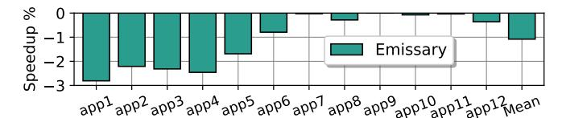
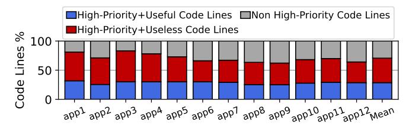

# E. Can we Filter Useless IFU Requests?

Since improving the BPU accuracy is not a practical approach, we also attempted to filter the IFU requests so as to reduce the impact of wrong-path fetching. One obvious attempt is to disable FDIP (i.e., only send fetch and no prefetch requests from the FTQ), since prefetch requests are inherently more speculative and more likely to cause insertion of useless code lines. We found that disabling FDIP does mitigate the pollution problem: the average fraction of the L2C occupied by useless code lines is reduced from 20.3% to only 4.0%. However, disabling FDIP also leads to an average performance slowdown of 14.6%, indicating that, despite issuing many inaccurate prefetch requests that pollute the L2C, FDIP does provide substantial performance benefits and cannot be trivially disabled. We also experimented with prior art that tunes the FTQ size so as to keep the ability of FDIP to prefetch, while tuning its aggressiveness [15]. We

&lt;sup>2The definition could be generalized to also apply to data lines; since this paper focuses on instruction lines, we leave such discussion to future work.

(a) Performance of Emissary [14] on mobile workloads.

(b) Breakdown of all code lines ever inserted into the L2C according to Emissary's *high-priority* metric and our *usefuleness* metric.

Fig. 6: Evaluation of Emissary [14] on mobile workloads.

found that this approach provides limited gains on our mobile workloads. Additionally, we experimented with two other approaches to throttle FDIP requests: (i) throttling prefetching after several consecutive fall-through fetch blocks, interpreting such a case as an indicator of cold code suffering from BTB misses, and (ii) using UDP [15]. We found that both of these approaches provide similar benefits as throttling the FTQ size; Section VII-A provides a detailed evaluation.

In our attempts to accurately filter *useless* IFU requests, we observed that the trade-off between filtering *useless* and *useful* prefetch requests is highly asymmetric: while removing a large number of *useless* IFU requests is required to get performance gains, filtering even a small fraction of *useful* ones can severely harm performance. We were unable to identify a simple scheme to preemptively throttle only polluting IFU requests and turned our attention to cache replacement policies.

# E. Can we Filter Useless IFU Requests?

Since improving the BPU accuracy is not a practical approach, we also attempted to filter the IFU requests so as to reduce the impact of wrong-path fetching. One obvious attempt is to disable FDIP (i.e., only send fetch and no prefetch requests from the FTQ), since prefetch requests are inherently more speculative and more likely to cause insertion of useless code lines. We found that disabling FDIP does mitigate the pollution problem: the average fraction of the L2C occupied by useless code lines is reduced from 20.3% to only 4.0%. However, disabling FDIP also leads to an average performance slowdown of 14.6%, indicating that, despite issuing many inaccurate prefetch requests that pollute the L2C, FDIP does provide substantial performance benefits and cannot be trivially disabled. We also experimented with prior art that tunes the FTQ size so as to keep the ability of FDIP to prefetch, while tuning its aggressiveness [15]. We

&lt;sup>2The definition could be generalized to also apply to data lines; since this paper focuses on instruction lines, we leave such discussion to future work.

(a) Performance of Emissary [14] on mobile workloads.

(b) Breakdown of all code lines ever inserted into the L2C according to Emissary's *high-priority* metric and our *usefuleness* metric.

Fig. 6: Evaluation of Emissary [14] on mobile workloads.

found that this approach provides limited gains on our mobile workloads. Additionally, we experimented with two other approaches to throttle FDIP requests: (i) throttling prefetching after several consecutive fall-through fetch blocks, interpreting such a case as an indicator of cold code suffering from BTB misses, and (ii) using UDP [15]. We found that both of these approaches provide similar benefits as throttling the FTQ size; Section VII-A provides a detailed evaluation.

In our attempts to accurately filter *useless* IFU requests, we observed that the trade-off between filtering *useless* and *useful* prefetch requests is highly asymmetric: while removing a large number of *useless* IFU requests is required to get performance gains, filtering even a small fraction of *useful* ones can severely harm performance. We were unable to identify a simple scheme to preemptively throttle only polluting IFU requests and turned our attention to cache replacement policies.

