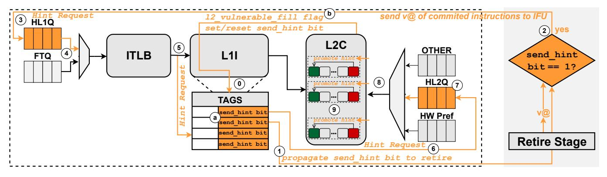

# A. Discriminating Useful from Useless L2C Code Lines

A naive approach to track the usefulness of code lines and inform L2C management decisions would imply sending a signal, which we call a *hint*, from the Retire pipeline stage to the L2C for each committed instruction. Upon receiving this hint, the L2C would promote the corresponding line, thus extending its lifetime. However, such approach has two major drawbacks that prevent its implementation: (i) L2Cs are typically implemented as physically-indexed physically-tagged

Fig. 9: Bumper integrated in a microarchitecture. Bumper's components and operation are highlighted in orange.

(PIPT) structures, but the physical address (PA) of an instruction is typically not available at retirement, and (ii) sending hints for each committed instruction (or group of instructions) would be prohibitively expensive and consume significant energy and bandwidth, as we show in Section VII-D. Thus, a more practical approach to tracking *useful* code lines and propagating this information to L2C is needed.

Overview of Bumper's Approach: When a request for a code line misses in the L2C, it is installed in a vulnerable position (RRPV=3) and the L1I cache is informed of this fact via a dedicated hint bit. The hint bit is propagated through the pipeline along with the first instruction in the fetch bundle reading that line. If the instruction commits, the hint bit indicates that the line is in a vulnerable position in the L2C and should be promoted. The L1I cache is informed at which point a promotion signal is sent to the L2C and the hint bit is cleared in the L1I cache. Once the bit is cleared, no additional signaling associated with that line takes place either in the pipeline or through the cache hierarchy for the whole residency of the line in the L1I cache, thus avoiding unnecessary bandwidth and energy overhead. The rest of the section elaborates on this core idea.

1) Managing Usefulness (Commit) Hints: Instead of trying to directly send hints from the Retire pipeline stage to the L2C, Bumper smoothly integrates its hint-passing mechanism with the existing cache hierarchy, in a place where (i) the PA is available and (ii) the L2C traffic can be effectively filtered: the L1I tags. Specifically, Bumper extends each L1I tag with a new bit called send\_hint bit (Figure 9 (a)).

The purpose of the send\_hint bit is to limit the traffic to the L2C by sending a promotion hint only when the first instruction fetched from a code line makes it to retirement, rather than for every committed instruction within that L1I line. The send\_hint bit is set when the line is filled into the L1I cache and, once a promotion signal is sent to the L2C, the send\_hint bit is reset.

To further reduce the impact of promotion hints on the precious L2C bandwidth, Bumper ensures that the send\_hint bit is set *only* if the line is in a vulnerable position in the L2C. That is accomplished through the addition of a 1-bit flag (12\_vulnerable\_fill) **(b)** to the cache response

transaction that fills lines into L1I. This flag indicates whether the corresponding line in the L2C is in a vulnerable position (RRPV=3). If that is the case, the corresponding send\_hint bit in the L1I tags is set to 1; otherwise, it will be reset to 0.

The combination of the 12\_vulnerable\_fill signal and the send\_hint bit ensures that at most one promotion signal is sent to the L2C in the entire lifetime of the code block in the L1I cache. The promotion happens only when the line is in a vulnerable position in the L2C and an instruction from that line commits, thus indicating its usefulness. In all other cases, promotion signaling is avoided, thus achieving the stated goal of minimal bandwidth and energy overhead associated with propagating the commit information to the L2C.

- 2) Carrying Hints Through Retire Stage and Back: Once the send\_hint bit is set in the L1I cache for a code line, Bumper waits for the first instruction fetched from that line to retire, indicating that the line is useful and should be promoted in the L2C. For that purpose, Bumper propagates the send hint bit for the first instruction (and, later, the first uop) from a line that has its send\_hint bit set (1) through the pipeline. This is accomplished by adding a 1bit flag to each ROB entry (or an alternative order-preserving structure) to carry the flag until the corresponding instruction (or its first uop) retires. Eventually, when an instruction with a send\_hint bit set to 1 retires (2), Bumper sends its virtual address (VA), which is already available for recovery purposes, back to the IFU to check if a promotion hint should be sent to the L2C. If that is the case, the promotion hint clears the corresponding send\_hint bit in the L1I cache, preventing further hints for this cache line for its entire lifetime in the L1I cache. As our evaluation shows (Section VII-D), this approach effectively minimizes Bumper's L1I bandwidth impact.
- 3) Generating L2C Promotion Hint Requests: Once the IFU receives the VA of a retired instruction that should generate a promotion hint ②, it first needs to retrieve the corresponding physical address (PA) in order to find the corresponding line in the L2C. To do so, Bumper uses the existing address translation structures. In practice, Bumper uses a Hint Lookup Queue (HL1Q) ③ that stores Hint Requests that opportunistically accesses the ITLB whenever the FTO requests do not use the full ITLB bandwidth ④.

| L2C Request Type & Status | Action                           |
|---------------------------|----------------------------------|
| IFU Request Miss          | Insert with RRPV=3               |
| IFU Request Hit           | Promote to RRPV=0 only if RRPV<3 |
| Hint Request Hit          | Promote to RRPV=0                |
| Hint Request Miss         | No action                        |
| Other Requests            | No change to the baseline policy |

TABLE I: Changes to the RRPV-based L2C management.

After address translation, the Hint Request proceeds to the L1I cache where, like a regular FTQ request, it accesses the L1I tags (5). If the send\_hint bit (1) of the hit entry is set, Bumper resets it before sending the promotion signal to the L2C, because there might be multiple instructions of the same cache line in the pipeline and Bumper wants to send only one promotion signal to the L2C per L1I cache line. Assuming that the send hint bit of an L1I line is set, Bumper resets it and the Hint Request proceeds to the L2C (6) to promote the corresponding code line. At the L2C, the Hint Request is queued in another *Hint Lookup Queue*  $(HL2Q)^4$  (7), similar to step (3). Hint Requests from HL2Q are arbitrated with all other requests (e.g., LSU requests, data prefetch requests). Finally, the promotion request can finally access the L2C with the PA of the line that should be promoted (8) and trigger Bumper's updated L2C management policy, explained in Section V-B.

#### B. Commit-Aware Unified Cache Management with Bumper

Bumper leverages the commit hints, as explained in Section V-A to guide a modified L2C management policy that promotes the *useful* code lines once they are identified. Table I presents how Bumper changes the baseline replacement policy [37]: These generic changes apply to any RRPV-based policy.

First, all code lines brought into the L2C are statically inserted with low priority (RRPV=3) to minimize the pollution caused by *useless* code lines. Hint requests that hit in L2C indicate that the corresponding line has been identified as *useful* (9) in Figure 9); therefore, the L2C policy bumps the RRPV value for that line to 0 (highest priority). We experimentally confirmed that <0.1% of the hint requests ever miss in the ITLB, L1I, or L2C; these events are rare because these structures are large enough to hold the corresponding information for the time between a code line being fetched and the time its first instruction retires. In the event of a hint request missing in the L2C, Bumper does not trigger any action.

Another important modification introduced by Bumper to the baseline replacement policy concerns IFU requests that hit in the L2C. As explained in Section V-A1, IFU requests that hit in an L2C code line with RRPV=3 (lowest priority) set the 12\_vulnerable\_fill flag in the corresponding response to the L1I cache, which in turn causes the send\_hint bit to be set and a promotion hint to be generated if an instruction from that line eventually retires. Crucially, until the promotion hint reaches the L2C, the corresponding line is kept at RRPV=3. In contrast, if the L2C code line that experiences a

| Component & Description                               | Size (in bytes) |
|-------------------------------------------------------|-----------------|
| send_hint bits in the L1I; 1 bit per tag              | 256 bytes       |
| send_hint bit in the ROB; 1 bit per uop               | 80 bytes        |
| HL1Q, 42bit (VA[47:6]) $\times$ 8 entries             | 43 bytes        |
| HL2Q, 42bit (VA[47:6]) $\times$ 8 entries             | 43 bytes        |
| 12_vulnerable_fill (1 bit in the L2C-to-L1I response) | -               |
| Total: 422 bytes (0.41KB)                             |                 |

TABLE II: Storage overhead of Bumper.

hit is *not* in the most vulnerable position (RRPV<3), Bumper uses the baseline policy and upgrades the priority of that line to least vulnerable (RRPV=0). In other words, Bumper promotes L2C code lines upon a hit only if their RRPV is not 3.

The rationale behind this policy is that an L2C code line with RRPV of 3 (lowest priority) is either (i) recently inserted and *useful* but not yet promoted; (ii) *useless* (will never be promoted and should be evicted quickly); or (iii) previously found *useful* and promoted but later aged again towards the lowest priority. In the first case, Bumper waits for the promotion hint to (potentially) reach L2C later if the line is found *useful*, rather than promoting a potentially *useless* line right away. In the second case, decreasing the RRPV value would clearly be counterproductive. In the third case, Bumper treats the line the same way as a newly-inserted line since, in both cases, its RRPV=3. In other words, the line will be promoted only if and when it is found *useful*. We did not find alternative policies, which treat newly-inserted lines differently from aged lines that reach RRPV=3, to be beneficial.

# A. Discriminating Useful from Useless L2C Code Lines

A naive approach to track the usefulness of code lines and inform L2C management decisions would imply sending a signal, which we call a *hint*, from the Retire pipeline stage to the L2C for each committed instruction. Upon receiving this hint, the L2C would promote the corresponding line, thus extending its lifetime. However, such approach has two major drawbacks that prevent its implementation: (i) L2Cs are typically implemented as physically-indexed physically-tagged

Fig. 9: Bumper integrated in a microarchitecture. Bumper's components and operation are highlighted in orange.

(PIPT) structures, but the physical address (PA) of an instruction is typically not available at retirement, and (ii) sending hints for each committed instruction (or group of instructions) would be prohibitively expensive and consume significant energy and bandwidth, as we show in Section VII-D. Thus, a more practical approach to tracking *useful* code lines and propagating this information to L2C is needed.

Overview of Bumper's Approach: When a request for a code line misses in the L2C, it is installed in a vulnerable position (RRPV=3) and the L1I cache is informed of this fact via a dedicated hint bit. The hint bit is propagated through the pipeline along with the first instruction in the fetch bundle reading that line. If the instruction commits, the hint bit indicates that the line is in a vulnerable position in the L2C and should be promoted. The L1I cache is informed at which point a promotion signal is sent to the L2C and the hint bit is cleared in the L1I cache. Once the bit is cleared, no additional signaling associated with that line takes place either in the pipeline or through the cache hierarchy for the whole residency of the line in the L1I cache, thus avoiding unnecessary bandwidth and energy overhead. The rest of the section elaborates on this core idea.

1) Managing Usefulness (Commit) Hints: Instead of trying to directly send hints from the Retire pipeline stage to the L2C, Bumper smoothly integrates its hint-passing mechanism with the existing cache hierarchy, in a place where (i) the PA is available and (ii) the L2C traffic can be effectively filtered: the L1I tags. Specifically, Bumper extends each L1I tag with a new bit called send\_hint bit (Figure 9 (a)).

The purpose of the send\_hint bit is to limit the traffic to the L2C by sending a promotion hint only when the first instruction fetched from a code line makes it to retirement, rather than for every committed instruction within that L1I line. The send\_hint bit is set when the line is filled into the L1I cache and, once a promotion signal is sent to the L2C, the send\_hint bit is reset.

To further reduce the impact of promotion hints on the precious L2C bandwidth, Bumper ensures that the send\_hint bit is set *only* if the line is in a vulnerable position in the L2C. That is accomplished through the addition of a 1-bit flag (12\_vulnerable\_fill) **(b)** to the cache response

transaction that fills lines into L1I. This flag indicates whether the corresponding line in the L2C is in a vulnerable position (RRPV=3). If that is the case, the corresponding send\_hint bit in the L1I tags is set to 1; otherwise, it will be reset to 0.

The combination of the 12\_vulnerable\_fill signal and the send\_hint bit ensures that at most one promotion signal is sent to the L2C in the entire lifetime of the code block in the L1I cache. The promotion happens only when the line is in a vulnerable position in the L2C and an instruction from that line commits, thus indicating its usefulness. In all other cases, promotion signaling is avoided, thus achieving the stated goal of minimal bandwidth and energy overhead associated with propagating the commit information to the L2C.

- 2) Carrying Hints Through Retire Stage and Back: Once the send\_hint bit is set in the L1I cache for a code line, Bumper waits for the first instruction fetched from that line to retire, indicating that the line is useful and should be promoted in the L2C. For that purpose, Bumper propagates the send hint bit for the first instruction (and, later, the first uop) from a line that has its send\_hint bit set (1) through the pipeline. This is accomplished by adding a 1bit flag to each ROB entry (or an alternative order-preserving structure) to carry the flag until the corresponding instruction (or its first uop) retires. Eventually, when an instruction with a send\_hint bit set to 1 retires (2), Bumper sends its virtual address (VA), which is already available for recovery purposes, back to the IFU to check if a promotion hint should be sent to the L2C. If that is the case, the promotion hint clears the corresponding send\_hint bit in the L1I cache, preventing further hints for this cache line for its entire lifetime in the L1I cache. As our evaluation shows (Section VII-D), this approach effectively minimizes Bumper's L1I bandwidth impact.
- 3) Generating L2C Promotion Hint Requests: Once the IFU receives the VA of a retired instruction that should generate a promotion hint ②, it first needs to retrieve the corresponding physical address (PA) in order to find the corresponding line in the L2C. To do so, Bumper uses the existing address translation structures. In practice, Bumper uses a Hint Lookup Queue (HL1Q) ③ that stores Hint Requests that opportunistically accesses the ITLB whenever the FTO requests do not use the full ITLB bandwidth ④.

| L2C Request Type & Status | Action                           |
|---------------------------|----------------------------------|
| IFU Request Miss          | Insert with RRPV=3               |
| IFU Request Hit           | Promote to RRPV=0 only if RRPV<3 |
| Hint Request Hit          | Promote to RRPV=0                |
| Hint Request Miss         | No action                        |
| Other Requests            | No change to the baseline policy |

TABLE I: Changes to the RRPV-based L2C management.

After address translation, the Hint Request proceeds to the L1I cache where, like a regular FTQ request, it accesses the L1I tags (5). If the send\_hint bit (1) of the hit entry is set, Bumper resets it before sending the promotion signal to the L2C, because there might be multiple instructions of the same cache line in the pipeline and Bumper wants to send only one promotion signal to the L2C per L1I cache line. Assuming that the send hint bit of an L1I line is set, Bumper resets it and the Hint Request proceeds to the L2C (6) to promote the corresponding code line. At the L2C, the Hint Request is queued in another *Hint Lookup Queue*  $(HL2Q)^4$  (7), similar to step (3). Hint Requests from HL2Q are arbitrated with all other requests (e.g., LSU requests, data prefetch requests). Finally, the promotion request can finally access the L2C with the PA of the line that should be promoted (8) and trigger Bumper's updated L2C management policy, explained in Section V-B.

#### B. Commit-Aware Unified Cache Management with Bumper

Bumper leverages the commit hints, as explained in Section V-A to guide a modified L2C management policy that promotes the *useful* code lines once they are identified. Table I presents how Bumper changes the baseline replacement policy [37]: These generic changes apply to any RRPV-based policy.

First, all code lines brought into the L2C are statically inserted with low priority (RRPV=3) to minimize the pollution caused by *useless* code lines. Hint requests that hit in L2C indicate that the corresponding line has been identified as *useful* (9) in Figure 9); therefore, the L2C policy bumps the RRPV value for that line to 0 (highest priority). We experimentally confirmed that <0.1% of the hint requests ever miss in the ITLB, L1I, or L2C; these events are rare because these structures are large enough to hold the corresponding information for the time between a code line being fetched and the time its first instruction retires. In the event of a hint request missing in the L2C, Bumper does not trigger any action.

Another important modification introduced by Bumper to the baseline replacement policy concerns IFU requests that hit in the L2C. As explained in Section V-A1, IFU requests that hit in an L2C code line with RRPV=3 (lowest priority) set the 12\_vulnerable\_fill flag in the corresponding response to the L1I cache, which in turn causes the send\_hint bit to be set and a promotion hint to be generated if an instruction from that line eventually retires. Crucially, until the promotion hint reaches the L2C, the corresponding line is kept at RRPV=3. In contrast, if the L2C code line that experiences a

| Component & Description                               | Size (in bytes) |
|-------------------------------------------------------|-----------------|
| send_hint bits in the L1I; 1 bit per tag              | 256 bytes       |
| send_hint bit in the ROB; 1 bit per uop               | 80 bytes        |
| HL1Q, 42bit (VA[47:6]) $\times$ 8 entries             | 43 bytes        |
| HL2Q, 42bit (VA[47:6]) $\times$ 8 entries             | 43 bytes        |
| 12_vulnerable_fill (1 bit in the L2C-to-L1I response) | -               |
| Total: 422 bytes (0.41KB)                             |                 |

TABLE II: Storage overhead of Bumper.

hit is *not* in the most vulnerable position (RRPV<3), Bumper uses the baseline policy and upgrades the priority of that line to least vulnerable (RRPV=0). In other words, Bumper promotes L2C code lines upon a hit only if their RRPV is not 3.

The rationale behind this policy is that an L2C code line with RRPV of 3 (lowest priority) is either (i) recently inserted and *useful* but not yet promoted; (ii) *useless* (will never be promoted and should be evicted quickly); or (iii) previously found *useful* and promoted but later aged again towards the lowest priority. In the first case, Bumper waits for the promotion hint to (potentially) reach L2C later if the line is found *useful*, rather than promoting a potentially *useless* line right away. In the second case, decreasing the RRPV value would clearly be counterproductive. In the third case, Bumper treats the line the same way as a newly-inserted line since, in both cases, its RRPV=3. In other words, the line will be promoted only if and when it is found *useful*. We did not find alternative policies, which treat newly-inserted lines differently from aged lines that reach RRPV=3, to be beneficial.

