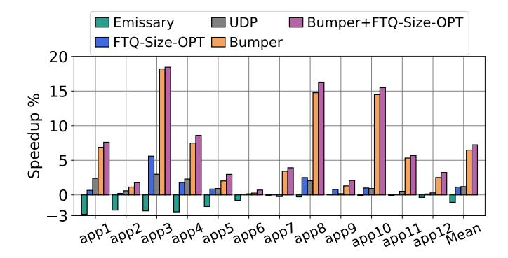
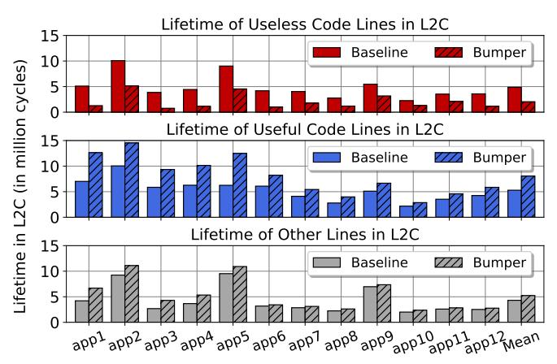
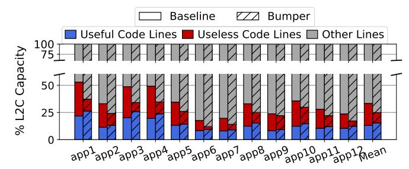
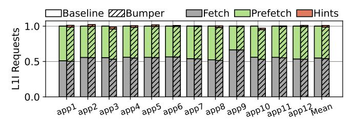
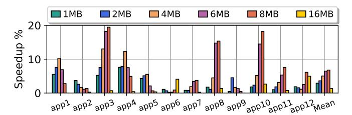

# C. Storage and Area Overheads

Bumper's design philosophy focuses on minimizing traffic across the pipeline and caches so as to reap the largest benefits from reducing code line pollution in the L2C with minimal bandwidth and energy overhead. We also designed Bumper to minimize storage requirements and implementation complexity on top of a typical out-of-order core microarchitecture.

Table II breaks down and quantifies the storage required for implementing Bumper on top of our baseline. In total, Bumper necessitates a mere 422 bytes of state. Additionally, in contrast to previous work [14], Bumper's storage overhead scales only with the size of L1I and not the L2C, thus facilitating Bumper's adoption in future designs with even larger L2Cs. The extra management logic to implement Bumper, shown in Section V, is limited to simple operations that are off the critical path. We conclude that the area and complexity overhead of Bumper is negligible in a high-performance mobile CPU.

#### D. L2C Inclusion Policy

While we designed Bumper for a non-inclusive, non-exclusive L2C with respect to the L1I cache (Section VI), it can be adapted to any other inclusion policy. In an exclusive L2C scenario, a code line will be inserted into the L2C upon an L1I cache eviction. The priority chosen at insertion would then be based on the send\_hint value: a committed L1I cache line would be inserted at high priority, while a non-committed line would either be inserted at low priority or discarded, *i.e.*, not inserted at all. For an inclusive L2C where a L2C code

&lt;sup>4We empirically found that an 8-entry *HL1Q* and an 8-entry *HL2Q* are adequate to extract the full potential of Bumper.

| Core                         | 620-entry ROB, 32-entry (fetch blocks) FTQ, FDIP [6] 16-wide fetch, 10-wide retire |  |
|------------------------------|------------------------------------------------------------------------------------|--|
| Branch Prediction Unit (BPU) | 64KB TAGE-SC [38], [39] and iTAGE, 1K-entry L1-BTB, 16K-entry L2-BTB, RAS          |  |
| ITLB, DTLB, L2TLB            | 256-entry, 224-entry, 4096-entry                                                   |  |
| L1I                          | 192KB, 6-way, pLRU                                                                 |  |
| L1D                          | 128KB, 4-way, pLRU                                                                 |  |
| L2C                          | 6MB [1], 12-way, DRRIP [36]                                                        |  |
| Memory                       | DDR5-8800                                                                          |  |

TABLE III: Baseline system configuration.

line cannot be evicted as long as it also resides in L1I cache, then Bumper would send the hints upon L1I cache invalidation or writeback, similar to the case of an exclusive L2C.

#### VI. EXPERIMENTAL METHODOLOGY

Our evaluation uses an industry-grade cycle-accurate simulator with ARM ISA simulating a modern high-end mobile CPU [1], [2] with a decoupled front-end [5], FDIP [6], 64KB TAGE-SC branch predictor [38], [39], a two-level BTB hierarchy [40], which only stores committed taken branches, post-fetch correction [5], and a non-inclusive non-exclusive cache hierarchy. L1I is non-coherent with respect to L2C, meaning that L1I does not perform write-backs nor does L2C track the presence of lines in the L1I [1], [3], [17], [18]. L2C uses DRRIP [36], a replacement policy that uses Re-Reference Prediction Values (RRPVs) to approximate reuse of cache lines; RRPVs range from 0 (high chance of reuse) to 3 (low chance of reuse). We also optimize the insertion and promotion policies of DRRIP per line type [41].

Contemporary mobile CPUs [1], [2] typically use clusters of 2 to 4 cores sharing the same L2C. The total L2C capacity, shared across these cores, ranges between 8MB and 24MB. As this work focuses on single-core performance, and assuming the L2C is shared roughly equally between cores in the same cluster, we size the L2C to 6MB. Section VII-F evaluates Bumper's effectiveness at various L2C sizes. While we do not evaluate L2C sharing among cores, we note that Bumper is beneficial in such a scenario because it reduces cache pressure due to useless code lines brought in by each core.

In modern client SoCs (e.g., Qualcomm's Oryon [2]), the LLC is a system-level cache (SLC) shared across multiple CPU clusters, the GPU, and other accelerators. Its primary purpose is to facilitate efficient data sharing between heterogeneous compute units rather than to act as an additional cache level for CPUs. Given the limited effective SLC capacity available for lines coming from each CPU core and the transient residency of CPU cache lines, the SLC has negligible impact on the performance of user-level applications running on CPU cores. Consequently, we do not model the SLC in our simulations, since it would not alter the conclusions of this work. The results of the L2C sensitivity study (Section VII-F) can be used to understand the impact of having additional on-chip storage available.

The modeled system also includes multiple data prefetchers with adaptive throttling and coordination schemes [42]–[44], a 5-level radix tree page table, MMU Caches [45], hardware

|        | Code Footprint (MB) | Data Footprint (MB) | Description                    |
|--------|---------------------|---------------------|--------------------------------|
| app 1  | 2.2                 | 7.1                 | Client for a search engine     |
| app 2  | 1.0                 | 5.9                 | Social media-online video app  |
| app 3  | 2.0                 | 4.3                 | Chat app                       |
| app 4  | 2.3                 | 5.5                 | Online shopping app            |
| app 5  | 1.1                 | 4.9                 | Content creation app           |
| app 6  | 1.5                 | 15.0                | News app                       |
| app 7  | 1.0                 | 5.7                 | Messaging and social media app |
| app 8  | 1.2                 | 4.4                 | Mobile game (rpg)              |
| app 9  | 0.5                 | <b>2.0</b>          | Mobile game (role play)        |
| app 10 | 1.2                 | 2.2                 | Mobile game (strategy)         |
| app 11 | 1.0                 | 4.7                 | Mobile game (racing)           |
| app 12 | 1.4                 | 8.4                 | Mobile game (moba)             |
|        |                     |                     |                                |

TABLE IV: Properties of the considered mobile applications.

page table walker [46], and accounts for cache locality in page walks [46]–[49]. Table III lists the details of the baseline system.

Workloads: We use a set of real-world applications drawn from market research on commercial mobile products. These workloads were selected through performance-critical scenario analysis targeting user experience and span diverse domains (e.g., games, commerce platforms). Each application represents distinct patterns of system demands, user interaction, algorithmic complexity, and workload characteristics. Table IV reports the data and code footprint and a brief description of each application. Although the total memory footprints of some applications are close to the modeled L2C capacity, this does not imply that the L2C operates under low pressure. Aggressive data prefetching, which is critical for high performance [11], [50], significantly increase L2C pressure by bringing additional data into the cache. Furthermore, instructions fetched on the wrong-path, particularly due to high BTB MPKI (Figure 4), cause additional cache pollution, as Section VII-B shows, exacerbating L2C pressure. To further demonstrate the robustness of our proposal, Section VII-F shows that Bumper consistently improves performance across different L2C sizes, clarifying that its advantages are not limited to scenarios where application footprints are close to the L2C size.

We refer to these applications as mobile applications and keep their names anonymous for business reasons. A modeling team identified relevant scenarios, corresponding code regions and inputs for each application that represent common user behavior and use cases and consist of at least 100M instructions. Each simulation includes a sufficient warm-up period for all on-chip resources (*e.g.*, caches and in-core structures). We also evaluate the SPEC 2017 [51] and Geekbench [52] benchmarks in Section VII-A to show that Bumper does not harm non front-end bound applications.

## VII. EVALUATION

In this section, we evaluate Bumper's performance, contrast it with related work, and provide additional studies that characterize its behavior and highlight its benefits.

#### A. Performance

We compare Bumper with two state-of-the-art techniques that target the front-end bottleneck: Emissary [14] and UDP [15]. We tune Emissary through parameter exploration

Fig. 10: Performance comparison. Higher is better.

to its best configuration (max 25% of ways can be pinned with probability 1/16). For UDP, we consider two different designs as presented in the original paper. First, we use the optimal FTQ size per each app, found via offline exploration, as an upper-bound reference for the dynamic FTQ sizing of UDP; we refer to this version as FTQ-Size-OPT. Second, we implement UDP's filtering approach using the confidence of the TAGE branch predictor; we refer to this design as *UDP*.

Figure 10 presents the performance comparison. Emissary degrades performance in modern mobile applications because these applications have many performance-critical code lines, leading Emissary to pin many lines in the L2C. This excessive pinning increases cache contention instead of mitigating pollution, as discussed in Section III-F. FTQ-Size-OPT achieves modest gains (1.1% speedup, on average) through better balancing of FDIP aggressiveness with prefetch accuracy, which improves performance in some workloads. UDP also provides modest speedups (1.2% on average) by using the TAGE confidence to filter out likely-wrong-path FDIP prefetches. The reason for such modest benefit from UDP is the high BTB MPKI. Whenever a BTB miss occurs, the associated branch is not predicted by TAGE and, as a result, branch confidence cannot be used to throttle FTO prefetches. The result is a high incidence of prefetches on the wrong path stemming from BTB misses. Bumper consistently improves performance (average speedup of 6.5%) by dynamically identifying and retaining useful code lines in the L2C while promptly evicting useless ones, as Section VII-B shows in more detail. We also evaluate Bumper in conjunction with FTQ-Size-OPT (Bumper+FTQ-Size-OPT) and find that it slightly improves performance over Bumper alone. Overall, Bumper outperforms Emissary by 7.5%, FTQ-Size-OPT by 5.4%, and can be combined with FTQ-Size-OPT to yield an additional 0.8% performance gain. We also evaluated composite designs where Bumper is combined with Emissary or UDP; however, such combinations did not provide any benefit over Bumper alone.

Notably, we found that the optimal FTQ sizes for Bumper+FTQ-Size-OPT are consistently larger than those found for FTQ-Size-OPT alone. As Figure 11 shows, the average optimal FTO size grows from 26 (for FTO-Size-OPT) to 51 (for Bumper+FTQ-Size-OPT). By mitigating the impact of aggressive FDIP through rapid eviction of useless L2C code

Fig. 11: Analysis on optimal FTQ size per application. Bumper enables larger FTQs since it reduces L2C code pollution.

Fig. 12: Lifetime (in million cycles) of L2C lines.

lines, Bumper facilitates deeper speculation with a larger FTO.

To ensure that Bumper does not harm workloads that are not front-end bound, we evaluated it on SPEC 2017 [51] and Geekbench [52] benchmarks and found that it does not impact performance (results not shown). The instruction working sets of these workloads fit in L1I, so distinguishing useful

from useless code lines in L2C does not affect performance. These results confirm that Bumper does not cause performance degradation for applications with small code footprints.

#### B. Lifetime in the L2 Cache

This section quantifies the impact of Bumper on the lifetime of L2C lines. Figure 12 presents the lifetimes of useful code lines, useless code lines, as per Definition 1, and other lines (demand data, prefetch data, MMU) in L2C, following the same methodology as Figure 5b. We observe that across all studied applications, Bumper significantly shortens the lifetime of useless code lines compared to the baseline. This reduction allows other valuable lines to remain in the cache longer, thereby reducing the Memory Wall bottleneck. Specifically, the lifetime of useful code lines and other line types increase by an average of 52.5% and 21.5% over the baseline, respectively. Meanwhile, the lifetime of useless code lines decreases drastically by an average of 57.9% over the baseline.

Figure 13 further highlights the benefits of Bumper by breaking down the L2C occupancy into useful code lines, useless code lines, and other lines (demand data, prefetch data, MMU), similar to Figure 5(a). The main takeaway is that compared to the baseline, Bumper enables the L2C to store more useful code lines (baseline: 12.9%, Bumper: 15.4% of

Fig. 13: L2C occupancy breakdown.

Fig. 14: Performance of different Bumper versions.

L2C capacity) and fewer *useless* code lines (baseline: 20.3%, Bumper: 9.5% of L2C capacity).

## C. Performance Breakdown

Figure 14 evaluates different Bumper versions to justify our design choices: (i) Bumper-L1I-Hit-Always classifies a code line as *useful* if it experiences at least one L1I hit before eviction (*i.e.*, regardless of whether any instructions commit) and always sends promotion hints to the L2C (without using the 12\_vulnerable\_fill flag, see Figure 9 (b); (ii) Bumper-L1I-Hit behaves the same as the former, but it uses the 12\_vulnerable\_fill flag to filter out unnecessary hints; (iii) Bumper-Always uses commit information to identify *useful* code lines, but it does not use the 12\_vulnerable\_fill flag.

We observe that Bumper-L1I-Hit-Always yields 3.8% average speedup over the baseline, showing that even this simplified policy is beneficial. Bumper-L1I-Hit improves upon this result and provides a 4.5% average speedup because it reduces the overhead on L2C traffic by filtering out unnecessary promotion signals. Leveraging commit information has an even higher impact: except in isolated cases, Bumper-Always outperforms both previous variants (5.8% average speedup over the baseline). Finally, Bumper provides the largest speedups (6.5% on average) by both leveraging commit information and reducing L2C traffic. Given the low implementation cost for propagating the commit information and filtering superfluous cache traffic, we believe that Bumper is the preferred option for future mobile processors. In case very low implementation cost is a priority, Bumper-L1-Hit and Bumper-L1-Hit-Always are attractive design points, both of which deliver over half of the benefit of Bumper without propagating the commit information through the pipeline.

Fig. 15: L2C requests from IFU and Hint Requests.

Fig. 16: L1I requests.

#### D. Impact of Bumper on Cache Bandwidth

Bumper introduces additional cache traffic due to the new hint requests used to (i) propagate promotion hints from the L1I to the L2C (Figure 9, 6), and (ii) manage the send\_hint bits in the L1I tags (Figure 9, 5). These requests compete for bandwidth with regular requests and, as we discussed in Section V, we designed Bumper to minimize their overhead. Figure 15 and Figure 16 quantify this impact by analyzing the total number of IFU requests that come to the L2C and L1I cache, respectively. Both figures report the number of IFU requests in each benchmark relative to the baseline and break it down by request type: (i) Fetch requests from the fetch pipeline, (ii) Prefetch requests from FDIP, and (iii) Hint requests that Bumper introduces. Overall, we find that Bumper has negligible impact on the cache traffic.

Figure 15 shows that Bumper reduces the number of IFU requests to the L2C by 1.8% on average, despite adding a non-negligible fraction of hint requests to the L2C in some cases. In particular, for the second half of the benchmarks (from app6 onward), hint requests increase the total number of requests by up to 10.4% compared to the baseline. This result is caused by the long reuse distance of code lines of mobile workloads, which causes some useful L2C code lines to age to RRPV=3 or even be evicted between two uses. On re-use of these lines, Bumper requires a hint to be sent, as explained in Section V-B, thus increasing the ratio of hint requests with respect to other requests. This overhead, however, is counterbalanced by a reduction of the number of Prefetch requests (FDIP) to the L2C: thanks to reduced pollution in the L2C, Bumper improves the instruction supply to the IFU, with the fetch pipeline experiencing less frequent L2C misses and using more of the L1I bandwidth, which leads to a reduction of Prefetch requests.5 In fact, the prefetch traffic at the L2C is 1.2%-9.1% (5.7% on average) lower in Bumper compared to the baseline.

&lt;sup>5FDIP uses the L1I bandwidth left over by the fetch pipeline (Section II).

Fig. 17: Impact of Bumper on L1I prefetching.

Fig. 18: Impact of L2C size on Bumper's performance.

Figure 16 shows that the impact of the hint requests on the L1I cache is negligible (max. 2.3%, avg. 0.4%). This stems from the fact that Bumper only adds one additional hint request for those L1I lines that see at least one committed instruction over their lifetime in the L1I cache. Since L1I lines experience high reuse, sending one additional hint for some of the lines represents a negligible overhead.

## E. L11 Prefetching

To quantify the impact of L1I prefetching on Bumper's performance, we consider DJOLT [53], a state-of-the-art L1I prefetcher and among the winners of IPC1 [54]. We evaluate DJOLT alone and in combination with Bumper. Figure 17 presents the performance comparison.

We observe that DJOLT provides performance gains due to additional coverage over FDIP. Still, Bumper outperforms DJOLT because, in mobile workloads, reducing L2C code pollution is more beneficial than complementing FDIP with an L1I prefetcher. We further find that DJOLT and Bumper complement each other, improving performance by an average of 9.7% over the FDIP-only baseline and by 3.2% over Bumper alone. The complementarity arises from the fact that while combining the two prefetchers (FDIP and DJOLT) improves miss coverage, it comes at the cost of high L2C pollution. Bumper helps quickly evict useless lines brought in by both prefetchers while extending the lifetime of *useful* lines in L2C. The main takeaway is that Bumper on top of FDIP delivers consistent benefits compared to, and combined with, an L1I prefetcher. Section VIII provides a broader discussion of prior work on L1I prefetching, where we highlight that Bumper is orthogonal and complementary to existing L1I prefetching mechanisms and can benefit from advances in that domain.

# C. Storage and Area Overheads

Bumper's design philosophy focuses on minimizing traffic across the pipeline and caches so as to reap the largest benefits from reducing code line pollution in the L2C with minimal bandwidth and energy overhead. We also designed Bumper to minimize storage requirements and implementation complexity on top of a typical out-of-order core microarchitecture.

Table II breaks down and quantifies the storage required for implementing Bumper on top of our baseline. In total, Bumper necessitates a mere 422 bytes of state. Additionally, in contrast to previous work [14], Bumper's storage overhead scales only with the size of L1I and not the L2C, thus facilitating Bumper's adoption in future designs with even larger L2Cs. The extra management logic to implement Bumper, shown in Section V, is limited to simple operations that are off the critical path. We conclude that the area and complexity overhead of Bumper is negligible in a high-performance mobile CPU.

#### D. L2C Inclusion Policy

While we designed Bumper for a non-inclusive, non-exclusive L2C with respect to the L1I cache (Section VI), it can be adapted to any other inclusion policy. In an exclusive L2C scenario, a code line will be inserted into the L2C upon an L1I cache eviction. The priority chosen at insertion would then be based on the send\_hint value: a committed L1I cache line would be inserted at high priority, while a non-committed line would either be inserted at low priority or discarded, *i.e.*, not inserted at all. For an inclusive L2C where a L2C code

&lt;sup>4We empirically found that an 8-entry *HL1Q* and an 8-entry *HL2Q* are adequate to extract the full potential of Bumper.

| Core                         | 620-entry ROB, 32-entry (fetch blocks) FTQ, FDIP [6] 16-wide fetch, 10-wide retire |  |
|------------------------------|------------------------------------------------------------------------------------|--|
| Branch Prediction Unit (BPU) | 64KB TAGE-SC [38], [39] and iTAGE, 1K-entry L1-BTB, 16K-entry L2-BTB, RAS          |  |
| ITLB, DTLB, L2TLB            | 256-entry, 224-entry, 4096-entry                                                   |  |
| L1I                          | 192KB, 6-way, pLRU                                                                 |  |
| L1D                          | 128KB, 4-way, pLRU                                                                 |  |
| L2C                          | 6MB [1], 12-way, DRRIP [36]                                                        |  |
| Memory                       | DDR5-8800                                                                          |  |

TABLE III: Baseline system configuration.

line cannot be evicted as long as it also resides in L1I cache, then Bumper would send the hints upon L1I cache invalidation or writeback, similar to the case of an exclusive L2C.

#### VI. EXPERIMENTAL METHODOLOGY

Our evaluation uses an industry-grade cycle-accurate simulator with ARM ISA simulating a modern high-end mobile CPU [1], [2] with a decoupled front-end [5], FDIP [6], 64KB TAGE-SC branch predictor [38], [39], a two-level BTB hierarchy [40], which only stores committed taken branches, post-fetch correction [5], and a non-inclusive non-exclusive cache hierarchy. L1I is non-coherent with respect to L2C, meaning that L1I does not perform write-backs nor does L2C track the presence of lines in the L1I [1], [3], [17], [18]. L2C uses DRRIP [36], a replacement policy that uses Re-Reference Prediction Values (RRPVs) to approximate reuse of cache lines; RRPVs range from 0 (high chance of reuse) to 3 (low chance of reuse). We also optimize the insertion and promotion policies of DRRIP per line type [41].

Contemporary mobile CPUs [1], [2] typically use clusters of 2 to 4 cores sharing the same L2C. The total L2C capacity, shared across these cores, ranges between 8MB and 24MB. As this work focuses on single-core performance, and assuming the L2C is shared roughly equally between cores in the same cluster, we size the L2C to 6MB. Section VII-F evaluates Bumper's effectiveness at various L2C sizes. While we do not evaluate L2C sharing among cores, we note that Bumper is beneficial in such a scenario because it reduces cache pressure due to useless code lines brought in by each core.

In modern client SoCs (e.g., Qualcomm's Oryon [2]), the LLC is a system-level cache (SLC) shared across multiple CPU clusters, the GPU, and other accelerators. Its primary purpose is to facilitate efficient data sharing between heterogeneous compute units rather than to act as an additional cache level for CPUs. Given the limited effective SLC capacity available for lines coming from each CPU core and the transient residency of CPU cache lines, the SLC has negligible impact on the performance of user-level applications running on CPU cores. Consequently, we do not model the SLC in our simulations, since it would not alter the conclusions of this work. The results of the L2C sensitivity study (Section VII-F) can be used to understand the impact of having additional on-chip storage available.

The modeled system also includes multiple data prefetchers with adaptive throttling and coordination schemes [42]–[44], a 5-level radix tree page table, MMU Caches [45], hardware

|        | Code Footprint (MB) | Data Footprint (MB) | Description                    |
|--------|---------------------|---------------------|--------------------------------|
| app 1  | 2.2                 | 7.1                 | Client for a search engine     |
| app 2  | 1.0                 | 5.9                 | Social media-online video app  |
| app 3  | 2.0                 | 4.3                 | Chat app                       |
| app 4  | 2.3                 | 5.5                 | Online shopping app            |
| app 5  | 1.1                 | 4.9                 | Content creation app           |
| app 6  | 1.5                 | 15.0                | News app                       |
| app 7  | 1.0                 | 5.7                 | Messaging and social media app |
| app 8  | 1.2                 | 4.4                 | Mobile game (rpg)              |
| app 9  | 0.5                 | <b>2.0</b>          | Mobile game (role play)        |
| app 10 | 1.2                 | 2.2                 | Mobile game (strategy)         |
| app 11 | 1.0                 | 4.7                 | Mobile game (racing)           |
| app 12 | 1.4                 | 8.4                 | Mobile game (moba)             |
|        |                     |                     |                                |

TABLE IV: Properties of the considered mobile applications.

page table walker [46], and accounts for cache locality in page walks [46]–[49]. Table III lists the details of the baseline system.

Workloads: We use a set of real-world applications drawn from market research on commercial mobile products. These workloads were selected through performance-critical scenario analysis targeting user experience and span diverse domains (e.g., games, commerce platforms). Each application represents distinct patterns of system demands, user interaction, algorithmic complexity, and workload characteristics. Table IV reports the data and code footprint and a brief description of each application. Although the total memory footprints of some applications are close to the modeled L2C capacity, this does not imply that the L2C operates under low pressure. Aggressive data prefetching, which is critical for high performance [11], [50], significantly increase L2C pressure by bringing additional data into the cache. Furthermore, instructions fetched on the wrong-path, particularly due to high BTB MPKI (Figure 4), cause additional cache pollution, as Section VII-B shows, exacerbating L2C pressure. To further demonstrate the robustness of our proposal, Section VII-F shows that Bumper consistently improves performance across different L2C sizes, clarifying that its advantages are not limited to scenarios where application footprints are close to the L2C size.

We refer to these applications as mobile applications and keep their names anonymous for business reasons. A modeling team identified relevant scenarios, corresponding code regions and inputs for each application that represent common user behavior and use cases and consist of at least 100M instructions. Each simulation includes a sufficient warm-up period for all on-chip resources (*e.g.*, caches and in-core structures). We also evaluate the SPEC 2017 [51] and Geekbench [52] benchmarks in Section VII-A to show that Bumper does not harm non front-end bound applications.

## VII. EVALUATION

In this section, we evaluate Bumper's performance, contrast it with related work, and provide additional studies that characterize its behavior and highlight its benefits.

#### A. Performance

We compare Bumper with two state-of-the-art techniques that target the front-end bottleneck: Emissary [14] and UDP [15]. We tune Emissary through parameter exploration

Fig. 10: Performance comparison. Higher is better.

to its best configuration (max 25% of ways can be pinned with probability 1/16). For UDP, we consider two different designs as presented in the original paper. First, we use the optimal FTQ size per each app, found via offline exploration, as an upper-bound reference for the dynamic FTQ sizing of UDP; we refer to this version as FTQ-Size-OPT. Second, we implement UDP's filtering approach using the confidence of the TAGE branch predictor; we refer to this design as *UDP*.

Figure 10 presents the performance comparison. Emissary degrades performance in modern mobile applications because these applications have many performance-critical code lines, leading Emissary to pin many lines in the L2C. This excessive pinning increases cache contention instead of mitigating pollution, as discussed in Section III-F. FTQ-Size-OPT achieves modest gains (1.1% speedup, on average) through better balancing of FDIP aggressiveness with prefetch accuracy, which improves performance in some workloads. UDP also provides modest speedups (1.2% on average) by using the TAGE confidence to filter out likely-wrong-path FDIP prefetches. The reason for such modest benefit from UDP is the high BTB MPKI. Whenever a BTB miss occurs, the associated branch is not predicted by TAGE and, as a result, branch confidence cannot be used to throttle FTO prefetches. The result is a high incidence of prefetches on the wrong path stemming from BTB misses. Bumper consistently improves performance (average speedup of 6.5%) by dynamically identifying and retaining useful code lines in the L2C while promptly evicting useless ones, as Section VII-B shows in more detail. We also evaluate Bumper in conjunction with FTQ-Size-OPT (Bumper+FTQ-Size-OPT) and find that it slightly improves performance over Bumper alone. Overall, Bumper outperforms Emissary by 7.5%, FTQ-Size-OPT by 5.4%, and can be combined with FTQ-Size-OPT to yield an additional 0.8% performance gain. We also evaluated composite designs where Bumper is combined with Emissary or UDP; however, such combinations did not provide any benefit over Bumper alone.

Notably, we found that the optimal FTQ sizes for Bumper+FTQ-Size-OPT are consistently larger than those found for FTQ-Size-OPT alone. As Figure 11 shows, the average optimal FTO size grows from 26 (for FTO-Size-OPT) to 51 (for Bumper+FTQ-Size-OPT). By mitigating the impact of aggressive FDIP through rapid eviction of useless L2C code

Fig. 11: Analysis on optimal FTQ size per application. Bumper enables larger FTQs since it reduces L2C code pollution.

Fig. 12: Lifetime (in million cycles) of L2C lines.

lines, Bumper facilitates deeper speculation with a larger FTO.

To ensure that Bumper does not harm workloads that are not front-end bound, we evaluated it on SPEC 2017 [51] and Geekbench [52] benchmarks and found that it does not impact performance (results not shown). The instruction working sets of these workloads fit in L1I, so distinguishing useful

from useless code lines in L2C does not affect performance. These results confirm that Bumper does not cause performance degradation for applications with small code footprints.

#### B. Lifetime in the L2 Cache

This section quantifies the impact of Bumper on the lifetime of L2C lines. Figure 12 presents the lifetimes of useful code lines, useless code lines, as per Definition 1, and other lines (demand data, prefetch data, MMU) in L2C, following the same methodology as Figure 5b. We observe that across all studied applications, Bumper significantly shortens the lifetime of useless code lines compared to the baseline. This reduction allows other valuable lines to remain in the cache longer, thereby reducing the Memory Wall bottleneck. Specifically, the lifetime of useful code lines and other line types increase by an average of 52.5% and 21.5% over the baseline, respectively. Meanwhile, the lifetime of useless code lines decreases drastically by an average of 57.9% over the baseline.

Figure 13 further highlights the benefits of Bumper by breaking down the L2C occupancy into useful code lines, useless code lines, and other lines (demand data, prefetch data, MMU), similar to Figure 5(a). The main takeaway is that compared to the baseline, Bumper enables the L2C to store more useful code lines (baseline: 12.9%, Bumper: 15.4% of

Fig. 13: L2C occupancy breakdown.

Fig. 14: Performance of different Bumper versions.

L2C capacity) and fewer *useless* code lines (baseline: 20.3%, Bumper: 9.5% of L2C capacity).

## C. Performance Breakdown

Figure 14 evaluates different Bumper versions to justify our design choices: (i) Bumper-L1I-Hit-Always classifies a code line as *useful* if it experiences at least one L1I hit before eviction (*i.e.*, regardless of whether any instructions commit) and always sends promotion hints to the L2C (without using the 12\_vulnerable\_fill flag, see Figure 9 (b); (ii) Bumper-L1I-Hit behaves the same as the former, but it uses the 12\_vulnerable\_fill flag to filter out unnecessary hints; (iii) Bumper-Always uses commit information to identify *useful* code lines, but it does not use the 12\_vulnerable\_fill flag.

We observe that Bumper-L1I-Hit-Always yields 3.8% average speedup over the baseline, showing that even this simplified policy is beneficial. Bumper-L1I-Hit improves upon this result and provides a 4.5% average speedup because it reduces the overhead on L2C traffic by filtering out unnecessary promotion signals. Leveraging commit information has an even higher impact: except in isolated cases, Bumper-Always outperforms both previous variants (5.8% average speedup over the baseline). Finally, Bumper provides the largest speedups (6.5% on average) by both leveraging commit information and reducing L2C traffic. Given the low implementation cost for propagating the commit information and filtering superfluous cache traffic, we believe that Bumper is the preferred option for future mobile processors. In case very low implementation cost is a priority, Bumper-L1-Hit and Bumper-L1-Hit-Always are attractive design points, both of which deliver over half of the benefit of Bumper without propagating the commit information through the pipeline.

Fig. 15: L2C requests from IFU and Hint Requests.

Fig. 16: L1I requests.

#### D. Impact of Bumper on Cache Bandwidth

Bumper introduces additional cache traffic due to the new hint requests used to (i) propagate promotion hints from the L1I to the L2C (Figure 9, 6), and (ii) manage the send\_hint bits in the L1I tags (Figure 9, 5). These requests compete for bandwidth with regular requests and, as we discussed in Section V, we designed Bumper to minimize their overhead. Figure 15 and Figure 16 quantify this impact by analyzing the total number of IFU requests that come to the L2C and L1I cache, respectively. Both figures report the number of IFU requests in each benchmark relative to the baseline and break it down by request type: (i) Fetch requests from the fetch pipeline, (ii) Prefetch requests from FDIP, and (iii) Hint requests that Bumper introduces. Overall, we find that Bumper has negligible impact on the cache traffic.

Figure 15 shows that Bumper reduces the number of IFU requests to the L2C by 1.8% on average, despite adding a non-negligible fraction of hint requests to the L2C in some cases. In particular, for the second half of the benchmarks (from app6 onward), hint requests increase the total number of requests by up to 10.4% compared to the baseline. This result is caused by the long reuse distance of code lines of mobile workloads, which causes some useful L2C code lines to age to RRPV=3 or even be evicted between two uses. On re-use of these lines, Bumper requires a hint to be sent, as explained in Section V-B, thus increasing the ratio of hint requests with respect to other requests. This overhead, however, is counterbalanced by a reduction of the number of Prefetch requests (FDIP) to the L2C: thanks to reduced pollution in the L2C, Bumper improves the instruction supply to the IFU, with the fetch pipeline experiencing less frequent L2C misses and using more of the L1I bandwidth, which leads to a reduction of Prefetch requests.5 In fact, the prefetch traffic at the L2C is 1.2%-9.1% (5.7% on average) lower in Bumper compared to the baseline.

&lt;sup>5FDIP uses the L1I bandwidth left over by the fetch pipeline (Section II).

Fig. 17: Impact of Bumper on L1I prefetching.

Fig. 18: Impact of L2C size on Bumper's performance.

Figure 16 shows that the impact of the hint requests on the L1I cache is negligible (max. 2.3%, avg. 0.4%). This stems from the fact that Bumper only adds one additional hint request for those L1I lines that see at least one committed instruction over their lifetime in the L1I cache. Since L1I lines experience high reuse, sending one additional hint for some of the lines represents a negligible overhead.

## E. L11 Prefetching

To quantify the impact of L1I prefetching on Bumper's performance, we consider DJOLT [53], a state-of-the-art L1I prefetcher and among the winners of IPC1 [54]. We evaluate DJOLT alone and in combination with Bumper. Figure 17 presents the performance comparison.

We observe that DJOLT provides performance gains due to additional coverage over FDIP. Still, Bumper outperforms DJOLT because, in mobile workloads, reducing L2C code pollution is more beneficial than complementing FDIP with an L1I prefetcher. We further find that DJOLT and Bumper complement each other, improving performance by an average of 9.7% over the FDIP-only baseline and by 3.2% over Bumper alone. The complementarity arises from the fact that while combining the two prefetchers (FDIP and DJOLT) improves miss coverage, it comes at the cost of high L2C pollution. Bumper helps quickly evict useless lines brought in by both prefetchers while extending the lifetime of *useful* lines in L2C. The main takeaway is that Bumper on top of FDIP delivers consistent benefits compared to, and combined with, an L1I prefetcher. Section VIII provides a broader discussion of prior work on L1I prefetching, where we highlight that Bumper is orthogonal and complementary to existing L1I prefetching mechanisms and can benefit from advances in that domain.

