# CAPA: Manufacturing Carbon Estimation for Advanced-Packaged Architectures

Jingyang Liu, Gwenith Bowker-Bafna, Yuke Zhang, Natalie Enright Jerger *University of Toronto* Toronto, Canada

{jingyang.liu, gwenith.bowkerbafna}@mail.utoronto.ca, {yuke.zhang, natalie.enrightjerger}@utoronto.ca

*Abstract*—To meet growing compute demand, hyperscalers are rapidly deploying new data centre hardware, which embodies significant carbon. This aggressive growth of compute infrastructure jeopardizes their carbon reduction goals. While existing carbon tools estimate the manufacturing carbon footprint of integrated circuits (ICs), they do not reasonably model the highperformance advanced-packaged processors that dominate data centres and supercomputers. To bridge this gap, we propose a tool called CAPA, which models manufacturing Carbon for Advanced-Packaged Architectures. CAPA incorporates a binning yield model, high-bandwidth memory (HBM) carbon estimates, and support for complex architectures that use a mixture of integration techniques, such as 3.5D. By using CAPA to study widely used high-performance processors, we reveal opportunities for carbon savings through systematic binning and testing strategies, and we highlight HBM as a major carbon contributor. CAPA provides insights about the carbon footprint of cuttingedge architectures, opening new avenues for mitigating the environmental impact of the ever-growing computing industry.

#### I. INTRODUCTION

Over the past five years, the compute needed for training one machine learning model has increased at least 100× [23]. In the same time period, the number of large-scale AI models has grown by 76× [69]. To support this rapidly growing compute demand, hyperscalers have expanded data centre infrastructure and deployed new computing hardware, such as advancedpackaged accelerators and high-performance processors.

This super-linear growth of compute infrastructure capacity comes with non-negligible environmental impacts [32], [90]. To curb climate change, major hyperscalers set carbon reduction goals in 2020: Microsoft announced the goal of being carbon negative by 2030 [76] and Google announced several sustainability goals, including operating fully on renewable energy by 2030 [66]. Now halfway through the decade, the progress towards these goals is concerning. Fig. 1 shows the 2020-21 and 2024-25 greenhouse gas (GHG) emissions in metric tonnes for Microsoft [56], Meta [55], and Google [28], three of the largest hyperscalers. Their annual emissions saw increases of 25%, 46%, and 50%. The largest portion of the total emissions is attributed to the expansion of data centre capacity and the manufacturing carbon of computing

This work was funded by AMD, the NSERC Alliance program (ALLRP 591075-2023), NSERC Discovery (RGPIN-2020-04179), the NSERC CRE-ATE program on Sustainable Data Systems for Data Science (CREATE 584767-2024), and the Canada Research Chair program (CRC-2022-00350).

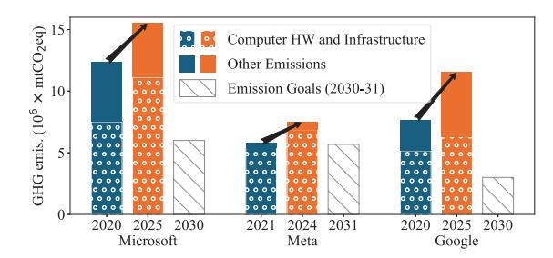

Fig. 1: GHG emissions (10<sup>6</sup>×mtCO2eq) of hyperscalers.

hardware [28], [55], [56]. The gap between where hyperscalers are and where they need to be is widening.

Commitments such as operating on renewable energy, only address one aspect of the sustainability problem: operational carbon. Yet, the total carbon footprint of computing systems encompasses two components: operational carbon, accounting for emissions from energy consumption during use; and embodied carbon, also known as manufacturing carbon, referring to emissions generated during the production, assembly, and deployment of computing hardware.

While prior works address carbon emissions from energy consumption during use, e.g., through renewable energy, temporal and spatial shifting of data centre workloads [1], and power usage effectiveness optimization [89], estimating embodied carbon remains a challenge. Fig. 1 shows embodied carbon contributes 54 − 91% of the total carbon [28], [55], [56]. Recently, various models have been developed to characterize the carbon footprint of ICs [4], [27], [37], [82], [93]. Although these are pioneering works in modeling manufacturing carbon, the approaches do not characterize several aspects of advanced-packaged architectures. First, the tools do not model functional binning, which is a common practice to improve yield. Second, they do not account for high-bandwidth memory (HBM), one of the key drivers of advanced packaging [48] and used by almost all state-of-theart high-performance processors [80]. Third, current tools do not support complex systems that use a mixture of integration techniques. For example, prior work fails to model 3.5D integration, which is the combination of 2.5D integration with 3D-stacked chips [51], [52].

We propose a new open-source tool: CAPA (Carbon for Advanced-Packaged Architectures) to address these three critical gaps. CAPA is user-friendly and accepts high-level inputs. To demonstrate the utility of CAPA, we model five widely deployed high-performance processors: Intel Sapphire Rapids [2], NVIDIA A100 [9], H100 [8], Google TPUv4 [42] and AMD MI300X [75]. Our results show that CAPA provides a more accurate model than prior tools [31], [82], [93], for both logic die carbon estimation and whole-package carbon estimation. Moreover, our analysis reveals opportunities for carbon reduction through systematic binning and testing strategies. We highlight HBM as a major contributor to manufacturing carbon that requires greater attention from both researchers and industry. Finally, we present several key insights to help drive future sustainable architecture designs.

Our key contributions are summarized as follows:

- We develop CAPA, an open-sourced1 manufacturing carbon estimation model with high-level input parameters. CAPA enables carbon modeling of functional binning, HBM integration, and 3.5D packaging.
- CAPA highlights that the granularity of binnable modules, the binning ratio, and binnable silicon area are important factors that computer architects should leverage to design carbon-friendly architectures.
- CAPA's insights demonstrate that HBM needs to be carefully considered and fully utilized as it is a significant carbon contributor in advanced-packaged architectures.

## II. BACKGROUND

This section introduces concepts fundamental to understanding our work, including binning and advanced packaging techniques. Prior work in carbon modeling is also covered.

#### *A. Semiconductor Binning Yield*

During semiconductor fabrication, defects can be introduced that cause circuit faults. Die yield is the number of functional dies out of all the dies fabricated. The yield percentage is usually a fab secret, yet it is an important factor in estimating manufacturing carbon. The negative binomial yield model [78] is considered closest to reality for very-large-scale-integration (VLSI) chips [5], [11], which states:

$$Y_{\text{die}} = \left(1 + \frac{A \times D_0}{\alpha}\right)^{-\alpha},\tag{1}$$

where A is the die area, α is a process-dependent clustering parameter, and D<sup>0</sup> is the defect density. As chip area increases, the yield decreases. For example, using Eqn. 1, when die area increases from 400 mm<sup>2</sup> to 800 mm<sup>2</sup> under a mature process of α = 10 and D<sup>0</sup> = 0.15 cm−<sup>2</sup> [13], the yield drops from approximately 56% to 32%.

A common practice to improve yield is functional binning, where part or all of the chip area is modularized and defective modules are disabled, leaving the rest of the chip functional [34], [44], [65]. For CPUs and GPUs, the binnable modules are usually individual or groups of cores, slices of caches, or memory controllers. Note that functional binning should not have performance implications since a binned-down version is equivalent to a lower-tiered version. Other forms of binning, such as performance binning, are outside our scope.

#### *B. Advanced Packaging*

In today's technology, the feature size disparity between silicon chips and packages is roughly 10,000× [39], translating to poorer performance for off-package links [64]. To avoid off-package links, chip designers use *advanced packaging techniques* to integrate as many components as possible in the same package. As yields for smaller dies are significantly better than for larger dies, assembling a system from multiple small dies reduces manufacturing cost up to 40% compared to a hypothetical monolithic approach [58], [81], making chiplet architectures attractive to the semiconductor industry.

The most commonly used advanced packaging techniques are 2.5D integration, with silicon bridges or a passive silicon interposer, and 3D stacking, with microbumps or hybrid bonding [3], [15], [45], [77]. Fig. 2 illustrates the cross-section of these integration techniques. Silicon bridges (Fig. 2a), also known as embedded multi-die interconnect bridge (EMIB) [50] by Intel, use small silicon dies to enable localized die-to-die connections with low cost and improved yield due to minimal silicon usage. Silicon interposer-based 2.5D integration (Fig. 2b) employs a silicon interposer to provide high-density interconnects across a large area, making it suitable for bandwidth-intensive applications like integrating HBMs. 3D stacking with microbumps (Fig. 2c) and hybrid bonding (HB) (Fig. 2d) are two advanced vertical integration techniques for chiplet interconnections. The former stacks dies using microbumps to enable vertical connectivity, while the latter uses copper-to-copper hybrid bonding. 3D stacking allows architectural implementations, such as compute-oncache, to improve performance and power [91]. State-ofthe-art processors employ a mixture of 2.5D integration and 3D stacking, known as 3.5D integration [51], [52]. Fig. 3 shows an example of a 3.5D integration, which combines 2.5D integration using a silicon interposer with two 3Dstacked ICs, one using microbumps and the other using hybrid bonding, enabling both horizontal and vertical high-density interconnects within a single package.

#### *C. Existing Carbon Modeling Tools*

IMEC publishes GHG emissions of generic high-volume manufacturing semiconductor fabrication [4], [27]. Its imec.netzero application provides data for CMOS logic nodes from 65nm to 2nm [5] and has become the standard of IC embodied carbon estimation [53], [86], [89]. We use data from imec.netzero as the reference for logic die manufacturing carbon emission. The public version of imec.netzero does not support binning, packaging, integration, or DRAM. To the best of our knowledge, there is no open-sourced reference for these techniques.

ACT [31] is a pioneering architectural carbon tool that enables carbon-driven design space exploration of computer systems. ACT models the manufacturing carbon by:

$$E_{SoC} = A \times CPA \times \frac{1}{Yield}, \tag{2}$$

$$CPA = GPA + CI_{fab} \times EPA + MPA, \tag{3}$$

<sup>1</sup>Available at https://doi.org/10.5281/zenodo.19744640

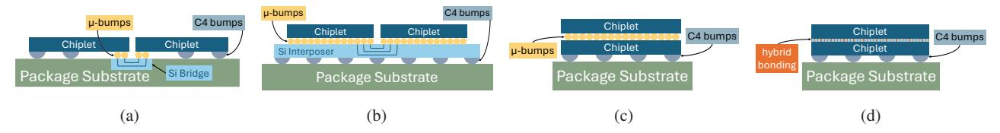

Fig. 2: (a) Silicon bridge. (b) Silicon interposer. (c) 3D stacking with microbumps. (d) 3D stacking with hybrid bonding.

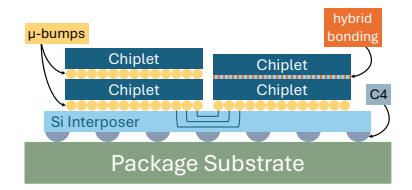

Fig. 3: 3.5D integration.

where ESoC, CPA, GPA, CIfab, EPA, and MPA stand for emissions per system-on-chip (SoC), carbon per area, gas per area, carbon intensity of the fabrication facility, energy per area, and materials per area, respectively. The GPA and EPA values are from Garcia Bardon et al. [27], and the MPA values are from Boyd [6].

ECO-Chip [82] models redistribution layer fan-out, silicon bridges, silicon interposers, and 3D stacking with microbumps. They add embodied carbon from wasted silicon to their logic die carbon model. ECO-Chip also enables chiplet architecture exploration of mixed technology nodes.

3D-Carbon [93] studies more integration options besides the ones covered in ECO-Chip, such as MCM-based, InFO-based, hybrid bonding based 3D stacking, and monolithic 3D, . Additionally, they discuss yield models for chip-first and chiplast 2.5D, wafer-to-wafer and die-to-wafer hybrid bonding.

## III. MOTIVATION

This section presents case studies which illustrate the motivating factors behind our tool's distinct features.

Case Study 1: Functional binning improves yield. Functional binning yield depends on the binnable area percentage of the chip, the binning granularity, and the binning ratio. Binnable area is the portion of the die that can be tested for functionality and binned, while non-binnable regions, such as those used for interconnect, power management, and clocking, cannot be binned. Binning granularity refers to the number of modules available for binning, where a finer granularity indicates more binnable modules. For example, "5/6" represents at least 5 functional modules of 6 binnable modules. Binning ratio is the ratio of functional modules to all binnable modules.

We present the yield vs. functional binning relationship in Fig. 4, where the left figure indicates functional binning leads to yield increase, and the right figure shows the potential yield increase if the binning granularity is finer. Notice that the three binning granularities result in the same binning ratio, and therefore the same functional silicon area, yet the finer the granularity, the higher the yield. For example, a 600 mm<sup>2</sup> die has a yield of 80% with the coarse granularity of 5/6, but

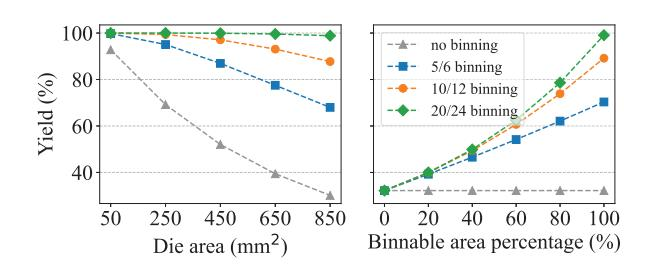

Fig. 4: Yield vs. die area with different binning granularities (left) yield vs. binnable area percentage of an 800mm<sup>2</sup> (right).

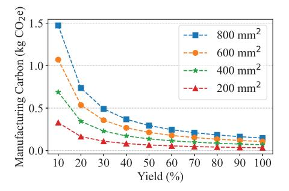

Fig. 5: Manufacturing carbon vs. yield using IMEC data [5].

a yield of 94% with the finer granularity of 10/12. We use the formulation in Stow et al. [79] to calculate yield under different binning granularities and binnable area percentages, while the "no binning" curve is derived from Eqn. 1.

Case Study 2: Yield affects carbon emissions. We present manufacturing carbon for different yields across varying die areas in Fig. 5 using data from IMEC [5]. The results demonstrate that yield has a significant impact on manufacturing carbon and lower yield leads to higher carbon emissions. Combined with our findings from Case Study 1, we conclude that functional binning also affects manufacturing carbon emissions. *These insights motivate the development of a carbon model capable of capturing the carbon emission of functional binning.*

Case Study 3: Misestimate of HBM's carbon contribution. We use 3D-Carbon and ECO-Chip to estimate the carbon breakdown of ICs and HBM in an NVIDIA GPU (Fig. 6), using the NVIDIA product carbon footprint (NV PCF) summary [62] as the reference. There is a substantial discrepancy between the estimates from 3D-Carbon, ECO-Chip and NV PCF, with differences around 45%. This suggests that although the tools target modeling 2.5D/3D ICs and traditional memory technologies like DDR and GDDR, neither 3D-Carbon

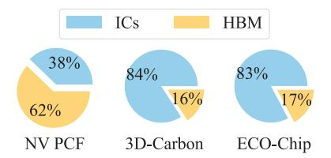

Fig. 6: Manufacturing carbon footprint breakdown between ICs and HBM for an NVIDIA GPU.

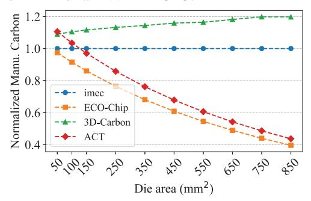

Fig. 7: Comparison of normalized manufacturing carbon estimates from prior tools [31], [82], [93] with imec.netzero [37].

nor ECO-Chip effectively captures the carbon emissions of HBM despite it being the primary contributor to the total carbon footprint in the NV PCF. This limitation motivates us to develop a carbon modeling tool that more accurately accounts for HBM's impact, especially in advanced-packaged architectures where HBM plays a central role.

Case Study 4: Limitations of existing tools. We compare the normalized manufacturing carbon of a single logic die estimated by ACT, ECO-Chip, and 3D-Carbon against the imec.netzero reference [37] (Fig. 7). All three tools exhibit non-negligible discrepancies from the reference values. With a small die size around 100 mm², all the tools show a small error margin to imec.netzero. As die size increases, 3D-Carbon is more consistent than other tools, although it always overestimates by 10% to 20%, while ACT and 3D-Carbon further underestimate. Additionally, ECO-Chip and 3D-Carbon only support one integration technology per system, so are unable to model complex heterogeneous architectures, such as 3.5D integration. These insights motivate us to design a carbon model that accurately captures different die sizes and includes advanced features such as 3.5D integration.

**Summary.** Our case studies address the need for a more advanced manufacturing carbon modeling tool that captures the impact of functional binning and high-bandwidth memory (HBM), while also supporting heterogeneous architectures beyond the capabilities of existing tools. We compare CAPA with prior tools in Table I, and detail CAPA's features and implementation in the following sections.

## IV. CAPA: CARBON FOR ADVANCED-PACKAGED ARCHITECTURES TOOL

We propose CAPA (Carbon for Advanced-Packaged Architectures) to estimate the manufacturing carbon of advanced-

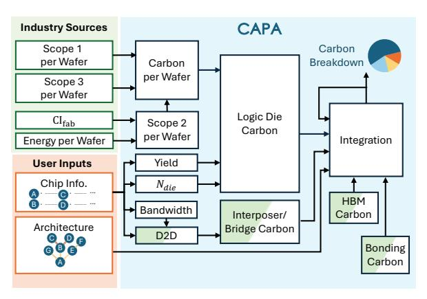

Fig. 8: Overview of CAPA.

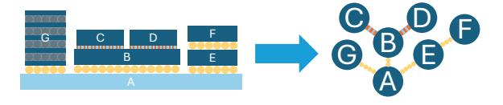

Fig. 9: N-ary tree representation of a complex advanced-packaged processor.

packaged high-performance processors. Fig. 8 gives an overview of CAPA. The user provides an architecture description, with the topology represented as an N-ary tree, as shown in Fig. 9, where the nodes are chips, e.g., logic, interposer, HBM, etc., and the edges are a bond, e.g., hybrid bonding or microbumps. The user also provides details of the chips used in the design; this list contains the design parameters of different components, detailed in Table II. We provide some examples of architecture description (arch.json) and chiplet information (chiplets.json) in Appendix A. Fig. 26 is the input for AMD MI300X described in Sec. V-A and Fig. 27 describes the architecture of Fig. 9.

CAPA performs a depth-first post-order traversal of the N-ary tree representing the architecture. For each node visited, CAPA processes the chip information and uses the appropriate carbon model for the chip type. After all child nodes are visited, CAPA estimates the bonding process given by the edge information, which represents the bonding parameters, such as type and area. The carbon breakdown of the child nodes are integrated when the parent node is visited, as indicated by the feedback connection in Fig. 8. The N-ary tree representation of an advanced-packaged architecture and CAPA's traversal of it supports mixtures of integration technologies, such as 3.5D integration. CAPA also supports the case where the N-ary tree is only one node, i.e., a monolithic IC. Finally, CAPA outputs the manufacturing carbon breakdown.

### A. Logic Die Carbon Model

**Carbon Per Wafer (CPW):** In our logic die model, the manufacturing carbon of an entire wafer is distributed to individual dies using a gross die per wafer model (Eqn. 6) and yield model. Manufacturing carbon per wafer is split into scopes 1, 2, and 3. We source scope 1 per wafer (S1PW), energy per

TABLE I: Comparison of carbon estimation tools

|                       | CAPA     | 3D-Carbon [93] | ECO-CHIP [82] | ACT [31]     | imec.netzero [37] |
|-----------------------|----------|----------------|---------------|--------------|-------------------|
| Accurate die model    | <b>√</b> | <b>√</b>       | ×             | ×            | <b>√</b>          |
| 2.5D integration      | <b>√</b> | $\checkmark$   | $\checkmark$  | ×            | ×                 |
| 3D stacking           | ✓        | $\checkmark$   | $\checkmark$  | ×            | ×                 |
| 3.5D integration      | ✓        | ×              | ×             | ×            | ×                 |
| DDR/GDDR estimation   | <b>√</b> | $\checkmark$   | $\checkmark$  | $\checkmark$ | ×                 |
| <b>HBM</b> estimation | <b>√</b> | ×              | ×             | ×            | ×                 |
| Operational carbon    | ×        | $\checkmark$   | ✓             | $\checkmark$ | ×                 |

TABLE II: Model parameters

| Model      | Parameters        | Description                      | Source     |
|------------|-------------------|----------------------------------|------------|
|            | $D_0$             | defect density                   | [13], [25] |
|            | $\alpha$          | clustering parameter             | [11], [25] |
|            | CPW               | carbon per wafer                 | [37]       |
| Die        | CI <sub>fab</sub> | carbon intensity of fab location | [37]       |
|            | Node              | process node                     | user input |
|            | Area              | die area                         | user input |
|            | g/c               | binning granularity              | user input |
|            | $1-\eta$          | binnable area percentage         | user input |
| Interposer | silicon area      | Si int or EMIB area              | user input |
|            | metal area        | metal layer area for D2D         | D2D model  |
| НВМ        | HBM type          | HBM2e, 3, 3e or 4                | [62], [70] |
|            | capacity          | capacity of HBM                  | user input |
| bonding    | bonding type      | TCB or HB                        | [93]       |
|            | bonding yield     | yield of a bonding process       | [93]       |

wafer (EPW), carbon intensity of the fab location (CI<sub>fab</sub>), and scope 3 per wafer (S3PW) data from imec.netzero [37] for technology nodes from N65 to N2, with extreme ultraviolet (EUV) introduced at N7. Scope 2 carbon per wafer (S2PW) is the product of energy per wafer and carbon intensity of the fab location. The total carbon per wafer (CPW) is:

$$CPW = S1PW + S2PW + S3PW, (4)$$

$$S2PW = EPW \times CI_{fab}.$$
 (5)

We assume that all the metal layers available to a technology node are utilized, which is safe for high performance processors. If different technology nodes and processes are used, including different lithography types, number of metal layers used, foundry energy mix, etc., the individual terms of CPW can be customized to reflect those effects.

**Die Per Wafer** ( $N_{\text{die}}$ ): Gross die per wafer, or the number of dies that can be cut out of a wafer,  $N_{\text{die}}$ , is [16]:

$$N_{\rm die} = \frac{\pi \times (\phi_{\rm wafer}/2)^2}{A_{\rm die}} - \frac{F_{\rm Corr} \times \pi \times \phi_{\rm wafer}}{\sqrt{A_{\rm die}}}, \qquad (6)$$

where  $A_{\rm die}$  is the die area,  $\phi_{\rm wafer}$  is the wafer diameter, typically 300 mm, and  $F_{\rm Corr}$  is a correlation factor, 0.51 by default [5]. The edge of a wafer is excluded from processing, known as edge exclusion, and the dies are separated by a scribe line, or kerf. We take typical values of 3 mm and 60  $\mu$ m for edge exclusion and kerf [5], respectively, resulting in a smaller wafer diameter and larger die area. This gross die per wafer calculation accounts for all wasted and unpatterned wafer area during processing.

**Single Region Binning Yield:** To model the yield of functional binning, we follow the formulation by Stow et al. [79]

reproduced in Eqns. 7-9. First, using the negative binomial yield model [78], the probability of a die with d defects is:

$$P_{\text{defect}}(d) = \frac{\Gamma(d+\alpha)}{d! \times \Gamma(\alpha)} \times \frac{\beta^d}{(\beta+1)^{d+\alpha}},\tag{7}$$

where  $\Gamma(x)$  is the gamma function and  $\beta$  is defined using the same parameters  $D_0$ ,  $\alpha$ , and die area A in Eqn. 1 as  $\beta = \frac{D_0 \times A}{\alpha}$ . When d = 0, Eqn. 7 simplifies to Eqn. 1, giving us the probability of a die with zero defects.

Assuming that defects are randomly distributed within a local area on single die, i.e., Poisson [79], the probability a die with a non-binnable area percentage  $\eta$ , d defects and c binnable modules has exactly g good modules is:

$$P_{\text{bin},\eta}(\eta, d, c, g) = \frac{S(d, c - g)\binom{c}{c - g}(c - g)!}{c^d} \times (1 - \eta)^d, (8)$$

where S(n,k) is the Stirling number of the second kind, which counts the number of ways to partition a set of n labeled objects into k non-empty unlabeled subsets.

The die yield of at least g functional modules of c binnable modules with a non-binnable area  $\eta$ , can be determined by summing the product of Eqns. 7 and 8 across all defect counts, i.e.,

$$Y(\eta, c, g) = \sum_{d=0}^{\text{all possible } d} P_{\text{defect}}(d) \times P_{\text{bin}, \eta}(\eta, d, c, g).$$
 (9)

Multiple Regions Binning Yield: Although Eqns. 7-9 cover the common case where cores are binnable and other regions are not, we observe that recent chip designs can have more than one binnable area. These areas can have different granularities and different modules, such as cores, memory controllers, shared cache slices, etc. Expanding single region binning to an arbitrary number of regions is non-trivial, but we illustrate how to expand to two regions. Given two binnable regions,  $b_1$  and  $b_2$ , and a non-binnable region  $\eta$ , where  $\eta + b_1 + b_2 = 1$ , we expand Eqn. 8 to:

$$P_{\text{bin},b1,b2}(d,b_1,c_1,g_1,b_2,c_2,g_2) =$$

$$\sum_{i=0}^{d} \binom{d}{d-i} \times b_1^{d-i} P_{\text{bin}}(d-i, c_1, g_1) \times b_2^{i} P_{\text{bin}}(i, c_2, g_2), \tag{10}$$

where  $P_{\text{bin}}$  is Eqn. 8 with  $\eta = 0$ .

Then we formulate the yield similar to Eqn. 9, as:

$$Y = \sum_{d=0}^{\text{all possible } d} P_{\text{defect}}(d) \times P_{\text{bin},b1,b2}$$
 (11)

TABLE III: HBM emissions from TechInsights [70]

| HBM Type                         | 2e    | 3     | 3e    | 4      |
|----------------------------------|-------|-------|-------|--------|
| Stack height                     | 8Hi   | 8Hi   | 12Hi  | 16Hi   |
| Capacity per layer (GB)          | 2     | 2     | 2     | 3      |
| Capacity per stack (GB)          | 16    | 16    | 24    | 48     |
| Emissions per stack<br>(kgCO2eq) | 18.16 | 19.95 | 27.83 | 43.50  |
| Emissions per GB<br>(kgCO2eq)    | 1.135 | 1.247 | 1.160 | 0.9063 |

Logic Die Carbon: Finally, the carbon per logic die is calculated by distributing the carbon footprint of processing the whole wafer among the functional dies:

$$C_{\rm die} = \frac{\rm CPW}{N_{\rm die} \times Y_{die}},\tag{12}$$

where CPW is carbon per wafer, Ndie is the number of dies per wafer from Eqn. 6, and Ydie is the die yield from one of the three yield models: Eqns. 1, 9 and 11.

## *B. Advanced Packaging*

HBM: HBM vendors follow specifications from the Joint Electron Device Engineering Council (JEDEC) [40], making the hardware composition predictable. As such, embodied carbon per GB is a reasonable metric for HBMs due to their standardization. Our main data source is TechInsights [70], which reports the carbon of HBM2e, 3, 3e, and 4, as shown in Table III. The product carbon footprint (PCF) summary for NVIDIA HGX H100 [62], which contains eight H100 GPUs also provides data on HBM carbon. Each H100 GPU has only five HBM3 stacks active out of the six stacks on package [61]. The PCF reports the total memory carbon footprint but does not specify the methodology of HBM3 carbon accounting, which leaves ambiguity of whether the inactive HBM3 stacks are considered. The emissions per GB inferred from the PCF report ranges from 0.71 to 0.85, while TechInsights reports 1.247. Given this discrepancy, we show a range of HBM carbon when appropriate. The HBM carbon model is:

$$C_{\rm HBM} = C_{\rm per \ GB} \times {\rm Capacity}.$$
 (13)

Die-to-Die Modeling: The main usage of die-to-die (D2D) area modeling is for the metal layer area, AD2D, on the passive silicon interposer. For HBMs, we calculate the PHY areas based on the JEDEC specification of different HBM types [40]. Regarding custom D2D connections, i.e., between logic dies, we calculate the PHY area per chip based on the bandwidth requirement, D2D bandwidth, and bandwidth per area as reported by the chip vendor:

$$A_{\rm D2D} = \frac{\rm D2D~Bandwidth}{\rm Bandwidth~/~Area}.$$
 (14)

For example, AMD MI300X [74] reports a bandwidth per area of 4.38 Tbps/mm<sup>2</sup> with a minimum microbump pitch of 35 μm. Given their D2D bandwidth requirement of 10.8 TBps (86.4 Tbps) per chiplet, we estimate the metal layer area per chiplet, as AD2D = 86.4/4.38 = 19.7 mm<sup>2</sup>.

Silicon Interposers and Bridges (CSi): We model a passive silicon interposer as a piece of blank silicon with five metal layers of die-to-die interconnect area [36]. Using the die-todie area model (Eqn. 14) for each die on the interposer, we calculate the total metal area (AD2D,total) required. Similarly, we model silicon bridges as passive silicon dies with four layers of metal [50]. We then use the following equation to estimate the embodied carbon of a silicon interposer or bridge:

$$C_{\rm Si} = \frac{\rm CPW_{\rm Si}}{N_{\rm Si} \times Y_{\rm Si}}.$$
 (15)

NSi is calculated with Eqn. 6 using silicon interposer/bridge area, ASi. We calculate yield (YSi) with Eqn. 1 using the total metal layer area, AD2D,total. Since there are no direct sources that report carbon characterization of silicon interposers or bridges, we provide a low and high estimate for the CPWSi term. In the low estimate, we do not include scope 1. We use energy per area data of five or four metal layers from Garcia Bardon et al. [27] as scope 2, and bare silicon wafer carbon from Boakes et al. [4] as scope 3, both of which are consistent across process nodes. In the high estimate, we use 65nm [48] process data for scope 1, 2 and 3, with a defect density of 0.06 cm−<sup>2</sup> and α = 6 per prior art [25], [93].

Bonding Techniques: For bonding, we use models for chiplast microbumps using thermal compression bonding (TCB) and die-to-wafer (D2W) hybrid bonding (HB). These two processes allow testing before bonding so that the knowngood die (KGD) methodology can be employed. We follow 3D-Carbon [93] for modeling the bonding process carbon:

$$C_{\text{bond}} = (\text{EPA}_{\text{bond}} \times \text{CI} \times A_{\text{bond}}) \frac{1}{Y_{\text{bond}}},$$
 (16)

where EPAbond is the energy per area of the bonding process, CI is the carbon intensity of the bonding facility location, Abond is the bonding area, and Ybond is the yield of the bonding process. We use the default yield values of 95% and 96% for HB and TCB processes, respectively [93].

3D Integration (C3D): For 3D stacking, we sum the carbon of the bottom and top die, along with the bonding process carbon from Eqn. 16 and scale by bonding yield:

$$C_{3D} = (C_{\text{bottom die}} + C_{\text{top die}} + C_{\text{bond}}) \frac{1}{Y_{\text{bond}}}.$$
 (17)

For stacks of more than two dies, we repeat this process.

2.5D and 3.5D Integration: To model the overall carbon of a 2.5D bonded system, we follow prior art [18], [25], [29], [79], [82], [93]:

$$C_{2.5D} = \left(C_{Si} + \sum_{i=1}^{N} (C_i + C_{bond_i})\right) \frac{1}{\prod_{j=1}^{N} Y_{bond_j}}, \quad (18)$$

where CSi is from Eqn. 15, N is the number of dies bonded to the interposer or bridges, C<sup>i</sup> can be carbon of a logic die from Eqn. 12 or HBM from Eqn. 13, Cbond<sup>i</sup> is from Eqn. 16, and Ybond is the yield of a bonding step. To model a 3.5D system, we replace the appropriate C<sup>i</sup> with C3D from Eqn. 17.

Alternative Bonding Strategy: Eqn. 18 represents the case where testing is done before and after all components are bonded. We also model the case where testing is done after each component is bonded:

$$C_{2.5D} = \dots ((C_{Si} + C_1^*) \frac{1}{Y_{bond}} + C_2^*) \frac{1}{Y_{bond}} + \dots$$

$$= \frac{C_{Si}}{Y_{bond}^N} + \sum_{i=1}^N \frac{C_i^*}{Y_{bond}^{N+1-i}},$$
(19)

where  $C_i^* = C_i + C_{bond_i}$ .

Extensibility: CAPA is designed to be modular, customizable, and adaptable to new technology. Other technology nodes can be supported by updating a few parameters in carbon per wafer (CPW). The maturity of a node can be represented by tweaking defect density in the yield models and CPW. Emerging package-level technologies, such as co-packaged optics for inter-die communication [24], [54], can be integrated as a module similar to logic die carbon or HBM. Note that communication solutions that are implemented on-die, like NVLink [38], are already captured in our logic die carbon model. Regarding even larger scale processors, CAPA is readily capable of modeling wafer-scale integration [35], [63], [84] since these architectures are essentially many chiplets 2.5D integrated on a wafer-sized interposer. On the other hand, for wafer-scale processors like Cerebras' WSE-3 [85], CAPA needs a distinct yield model to properly estimate carbon.

#### V. COMPARISON TO PRIOR WORK

To demonstrate the effectiveness of our tool, we compare our results with prior art, specifically, 3D-Carbon [93], ECO-CHIP [82], and ACT [31]. We model five widely used commercial products: Intel Sapphire Rapids, NVIDIA A100 and H100, AMD MI300X, and Google TPUv4. Sec. V-A introduces the necessary details of these processors for carbon estimations. For logic die carbon, imec.netzero [37] has the most trusted results since they validate their model against data from industry partners like TSMC and ASML. Sec. V-B shows how prior art and our tool compare to imec.netzero for logic dies. For advanced packaging, we validate CAPA against ECO-Chip and 3D-Carbon with Google's published embodied carbon number of their TPUv4 in Sec. V-C.

## A. High-Performance Advanced-Packaged Processors

The high-performance, advanced-packaged processors used in our experiments include Intel Sapphire Rapids (SPR) [2], [59], NVIDIA A100 [9], [10], [60], H100 [8], [61], AMD MI300X [57], [74], [75], and Google TPUv4 [42]. These three processors serve as the input designs for CAPA and the analysis in the following sections.

Intel Sapphire Rapids (SPR) [2], [59] is a server-class CPU. Fig. 10a shows its annotated die photo. The CPU consists of four chiplets, connected with ten EMIBs of three different sizes [49]. Each CPU die houses 15 cores with different product stock keeping units (SKUs) corresponding to various binned-down versions. The dies are fabricated in Intel 7 process, which is a 10nm process [12], so we use a 10nm process for modeling.

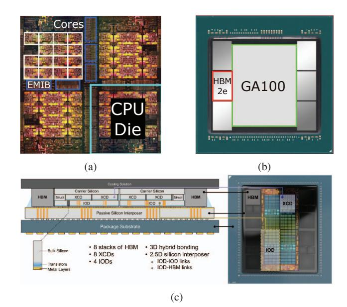

Fig. 10: (a) Annotated Intel Sapphire Rapids [59]. (b) Annotated NVIDIA A100 [60]. (c) AMD MI300X [74].

**NVIDIA A100** [9], [10], [60] is a 2.5D integrated package with one monolithic GPU die and six stacks of HBM2e on top of a passive silicon interposer. Fig. 10b shows the annotated package. The GPU die employs a complicated binning strategy, where one of six stacks of HBM2e is disabled, with the corresponding HBM PHY, HBM controllers, slices of caches and cores also disabled. We modeled it as a 5/6 binning with 75% binnable GPU die area for simplicity.

AMD MI300X [57], [74], [75] is a 3.5D server-class GPU consisting of four silicon-on-integrated-circuits (SoICs) and eight HBM3 stacks on a passive silicon interposer (Fig. 10c). Each SoIC is two 5nm accelerator complex dies (XCDs) vertically stacked on top of one 6nm I/O die (IOD) using hybrid bonding. The IODs house the last level cache, HBM controllers and PHYs, D2D links, etc.

Table IV summarizes the details of the three processors which are inputs to the tools in the following sections. We have also included some details on H100 to provide a comparison across different generations of NVIDIA chips, and estimated numbers of Google TPUv4 for further validation. For logic dies, the defect density is higher for more advanced nodes. The carbon intensity for the components corresponds to their manufacturing location, e.g., the SPR logic die is us\_arizona, the EMIB is us\_new\_mexico, and others are taiwan.

## B. Logic Die Validation

In this section, we validate our logic die carbon model against imec.netzero and show the results of ACT, 3D-Carbon, and ECO-Chip. We use the logic chips in each processor as the target, i.e., the Sapphire Rapids CPU Die, the A100 GPU die, the MI300X XCD, and the MI300X IOD in Table IV. The input parameters of the same chip to all the tools are as similar as possible, e.g., technology node, fab location and yield

TABLE IV: Details of high-performance processors

|                 | Component  | $Area \ (mm^2)$ | Node    | Number | Bonding                            |
|-----------------|------------|-----------------|---------|--------|------------------------------------|
| Intel           | CPU Die    | 419             | Intel 7 | 4      | 55μm μbump                         |
| Sapphire Rapids | EMIB       | $\sim$ 28.22    | -       | 10     | $55\mu\mathrm{m}~\mu\mathrm{bump}$ |
| NVIDIA<br>A100  | GA100      | 826             | N7      | 1      | 55μm μbump                         |
|                 | HBM2e      | -               | HBM2e   | 6      | $55\mu \text{m} \ \mu \text{bump}$ |
|                 | Interposer | $\sim 1575$     | -       | 1      | $55\mu\mathrm{m}~\mu\mathrm{bump}$ |
| NVIDIA<br>H100  | GH100      | 814             | N5      | 1      | 55μm μbump                         |
|                 | HBM3       | -               | HBM3    | 6      | $55\mu \text{m} \ \mu \text{bump}$ |
|                 | Interposer | $\sim 1623$     | -       | 1      | $55\mu\mathrm{m}~\mu\mathrm{bump}$ |
| Google<br>TPUv4 | ASIC       | 598             | N7      | 1      | 55μm μbump                         |
|                 | HBM2       | -               | HBM2    | 4      | $55\mu \text{m} \ \mu \text{bump}$ |
|                 | Interposer | ~1119           | -       | 1      | $55\mu\mathrm{m}~\mu\mathrm{bump}$ |
| AMD             | XCD        | ~125            | N5      | 2      | 9μm hb                             |
| MI300X SoIC     | IOD        | 377             | N6      | 1      | $9\mu$ m hb                        |
| AMD<br>MI300X   | SoIC       | 377             | N5+N6   | 4      | $35\mu \text{m} \mu \text{bump}$   |
|                 | HBM3       | N5              | HBM3    | 8      | $45\mu \text{m} \ \mu \text{bump}$ |
|                 | Interposer | $\sim \! 3000$  | -       | 1      | $\mu$ bump                         |

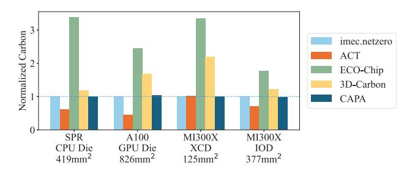

Fig. 11: Comparison of logic die carbon.

parameters when applicable. We disable binning yield and use the negative binomial yield model, Eqn. 1, for consistent comparisons among the tools. Fig. 11 shows the results normalized to the output of imec.netzero. CAPA is consistently the closest to imec.netzero, with the largest error margin of 3.23%. ACT always underestimates for larger dies, with the 826 mm² die showing a 55% difference to imec.netzero. 3D-Carbon always overestimates, with the largest difference being 118% for the 125 mm² XCD. ECO-Chip shows the largest difference to imec.netzero, ranging from 76% to 338%.

The underestimation by ACT of large dies is due to its carbon per area modeling. The unit of production is a wafer, so the carbon emission per wafer is fixed. To get carbon per area, one should distribute the carbon emission per wafer to the useful silicon area, which is dependent on die size (Eqn. 6). Larger die area results in more wasted silicon area in a wafer because there is more waste at the edges as fewer larger rectangles can fit into a circular wafer. Additionally, any defect would cause a larger area of wasted silicon. Consider 800 mm<sup>2</sup> dies with a defect density of 0.1/cm<sup>2</sup>. ACT use the CPA from 100% yield 100 mm<sup>2</sup> dies (~618 can fit), which is  $CPW/(618 \times 100) = CPW/61800$ , then scaled by the die area of 800 mm<sup>2</sup> and yield of 47% as  $(\text{CPW}/61800) \times (800/(47\%)) \approx 0.006 CPW$ . In reality, the CPA would be  $CPW/(68 \times 800) = CPW/54400$  since only  $\sim$ 68 800 mm<sup>2</sup> dies can fit in a wafer and the die carbon should be  $CPW/(68 \times 47\%) \approx 0.03 CPW$  which is higher than what ACT estimates.

On the other hand, 3D-Carbon overestimates due to cal-

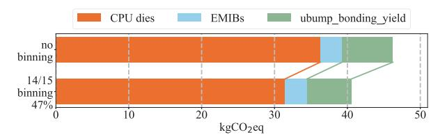

Fig. 12: Intel Sapphire Rapids embodied carbon breakdown.

culating carbon per wafer by multiplying the entire wafer area and carbon per area data, leading to extra carbon per wafer. We note that ECO-Chip does not have an option for fab location, so its errors are likely due to different carbon intensity assumptions. Fig. 7 gives a fairer comparison of previous tools by removing the variable of different data assumptions and only evaluating the model.

This comparison gives us confidence in CAPA's logic die model. Additionally, the results suggest that CAPA is the best available tool for monolithic ICs besides imec.netzero.

## C. Google TPUv4 Validation

We validate whole-package carbon emissions on Google TPUv4 [42]. We assume TPUv4 uses a monolithic die, with four HBM2 stacks on a silicon interposer, similar to the NVIDIA A/H100 architectures. Google reported 91.5 kgCO<sub>2</sub>eq for TPUv4 [72]. However, ACT, ECO-Chip, and 3D-Carbon report 42.4, 73.3 and 80.9 kgCO<sub>2</sub>eq, respectively, corresponding to 54%, 20%, and 12% differences. These mismatches stem from inaccurate logic die models and lack of proper HBM modeling in the existing tools. In contrast, CAPA's estimation for TPUv4 is 91.9 kgCO<sub>2</sub>eq which is 0.4% different than Google's report, suggesting that CAPA is accurate in methodology and data.<sup>2</sup>

#### VI. CAPA ANALYSIS

In this section, we present the embodied carbon breakdowns from CAPA's analysis of the targeted architectures. We reveal the high carbon contributors of each architecture and provide potential solutions with the most benefits.

#### A. Intel Sapphire Rapids

The top-of-the-line SKUs are a 60-core version, where each CPU die has all 15 functional cores, and a 56-core binned version with 14/15 active cores per CPU die. Fig. 12 illustrates the carbon breakdown of components in Sapphire Rapids, where we combined the total embodied carbon of four CPU dies and ten EMIBs for cleaner visuals. In the top bar, each chiplet contributes to 20% of the total embodied carbon. Yield loss from bonding the chiplets to the EMIBs accounts for 15%. The bottom bar shows the 14/15 binning with 47% binnable area. The binning strategy of the 56-core SKU improves the CPU die yield from 66% to 79%, leading to a 16% reduction in CPU carbon and 15% reduction in total embodied carbon.

To explore the range of carbon saving through lowering binning ratio in Intel Sapphire Rapids, Fig. 13 shows the

 $<sup>^2 \</sup>rm Using~D_0=0.1~cm^{-2}.$  Setting  $D_0=0.09~\rm cm^{-2}$  results in 90.25 kgCO2eq, which is 1.4% error.

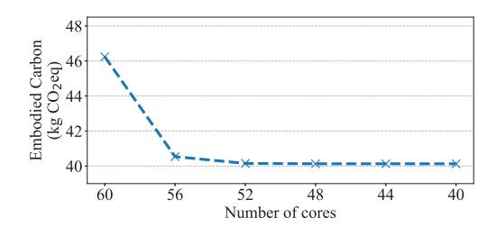

Fig. 13: Embodied carbon of top six Sapphire Rapids SKUs.

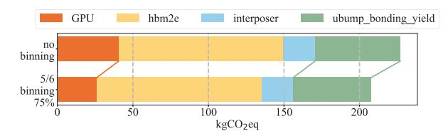

Fig. 14: NVIDIA A100 embodied carbon breakdown.

embodied carbon of the top six SKUs, ranging from a full 60-core SKU to a 40-core SKU, where 0 to 5 cores were disabled in each CPU die. Embodied carbon quickly reaches an asymptote as the yield improvement of lower binning ratios is limited by the binnable area. Due to 47% binnable area in Sapphire Rapids, even when all cores are disabled, the yield is effectively the same as a 48-core SKU.

We then investigate hypothetical, more binnable versions of Sapphire Rapids assuming other modules like accelerators and I/O blocks are binnable. The asymptotic embodied carbon of a sweep of binnable area percentage from the default 47% to an unrealistic 97% shows an almost linear reduction from 40 kgCO2eq to 34.6 kgCO2eq. Comparing the 97% binnable area to the default 47%, we see a 14% reduction in asymptotic embodied carbon which is significant if we can make use of a die with fewer memory controllers, PCIe lanes, or accelerators.

## *B. NVIDIA A100 and H100*

The NVIDIA A100 GPU die employs a binning strategy [60], which we model as 5/6 binning with 75% binnable area. We show the embodied carbon breakdown with no binning and binning in Fig. 14. The embodied carbon of the GPU die decreases by 38% because of the yield improves from 45% to 72.6% due to its binning strategy, and the total embodied carbon decreases by 9.5%. We make a few observations from the data in Figs. 12 and 14. First, Sapphire Rapids employs a smaller die with a finer-grained binning strategy but lower binnable area compared to the A100 GPU: 419 mm<sup>2</sup>, 14/15 with 47% vs. 826 mm<sup>2</sup>, 5/6 with 75%, respectively. The resulting carbon savings of these dies alone are 16% vs. 38%. Large dies benefit more from yield improvement than small dies, as shown in Fig. 5. Binnable area, binning granularity, and binning ratio all affect the final yield improvement. Generally, larger binnable area, finer-grained, and smaller binning ratio lead to better yield improvement. Second, although A100 benefits more from binning, the embodied carbon of the whole package is more dominated by HBM and wasted carbon from bonding yields, unlike Sapphire Rapids where the CPU

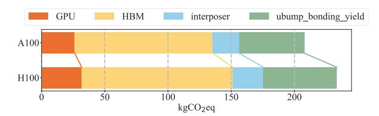

Fig. 15: NVIDIA A100 and H100 comparison.

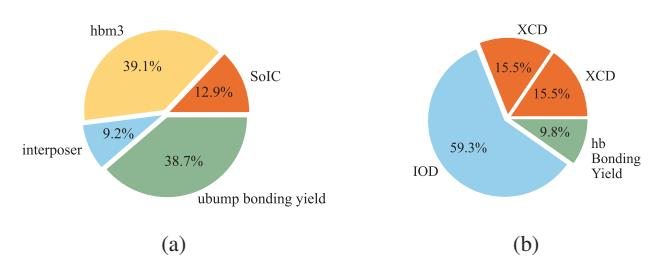

Fig. 16: (a) Embodied carbon breakdown of MI300X. (b) Embodied carbon breakdown of an MI300X SoIC.

embodied carbon contributes to 80%. We next analyze the HBM and bonding yield carbon of A100.

From the breakdown, the two biggest contributors are the six stacks of HBMs and bond yield contribution. Six stacks of HBM2e sum to 108.96 kgCO2eq, occupying 47% and 52% in the two bars in Fig. 14. Additionally, 25% embodied carbon is wasted due to a 96% bonding yield raised to the power of seven, since one GPU die and six stacks of HBMs are bonded to the interposer, as formulated in Eqn. 18.

The successor to the A100 GPU is the H100 [8], [61], which consists of a 814 mm<sup>2</sup> N5 die, 6 stacks of HBM3 (only 5 active), and a <sup>∼</sup>1623 mm<sup>2</sup> silicon interposer. Fig. 15 shows the embodied carbon breakdown comparison of A100 and H100. The newer GPU sees a 10% increase in embodied carbon, due to the more advanced technology node used for the compute die, a newer generation of HBM, and a larger silicon interposer to accommodate the slightly larger HBMs.

## *C. AMD MI300X*

Fig. 16a shows the percentage breakdown of AMD MI300X, and Fig. 16b shows an SoIC. Similar to the A100 analysis, HBMs and wasted carbon from bonding yield are the biggest contributors, with eight stacks of HBM3 and twelve bonding processes. The XCD employs 38/40 binning with 85% binnable die area, which improves the yield from 87% to 98%. The total embodied carbon savings due to XCD binning is less than 2% as XCDs only contribute 5% in total.

In Fig. 17, we show the breakdown given two different assumptions for HBM3 embodied carbon per capacity where the lower estimate is 43% lower than the high estimate. The bottom bar shows a 27% reduction in total embodied carbon from both lower HBM estimates and less wasted carbon from bonding. One could interpret Fig. 17 in two ways. First, high data uncertainty in a large carbon contributor can lead to high carbon uncertainty in the whole system. Second, if the chip

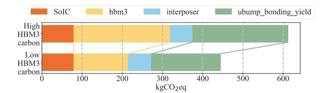

Fig. 17: AMD MI300X embodied carbon breakdown; the high HBM carbon estimate is from TechInsights [70] the low HBM estimates is from an industry carbon footprint report [62].

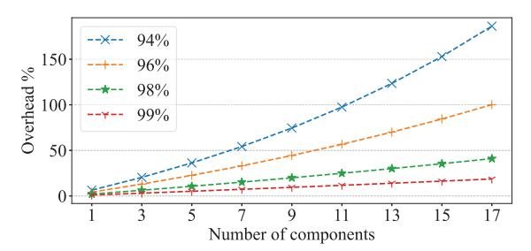

Fig. 18: Carbon overhead of bonding yield.

vendor can source HBM with lower embodied carbon, the total embodied carbon footprint can be significantly lowered.

#### *D. Additional Explorations*

Carbon Overhead of Bonding Yield: The bonding yield carbon percentage increases across Figs. 12, 14, and 17 as more ICs are bonded to the EMIBs or interposer. Fig. 18 shows the carbon overhead due to bonding yield of a varying number of components with four bonding yields, 94%, 96%, 98%, and 99%. The percentage overhead increases exponentially with more components and lower bonding yields. Improving bonding yields drastically improves carbon overhead, for example, with 11 components, a bonding yield improvement of 94% to 96% reduces the overhead from 97% to 57%. Therefore, knowing the bonding yield is critical to making the architectural decision on number of components, as higher bonding yield affords more components and vice versa. For example, when the overhead target is less than 100%, the system can only have a maximum of 11 components with 94% bonding yield but 17 components if bonding yield improves to 96%. The overall embodied carbon is highly sensitive to the bonding yield which incentivizes solutions and designs that could improve bonding yield. For example, any I/O redundancy improves bonding yield. More advanced testing is also promising, which we will discuss in the next paragraph as a potential strategy to increase bonding yield.

Bonding Tests: From Fig. 16a, wasted embodied carbon contributes to 39% of total carbon due to bonding 12 ICs onto the interposer with a 96% bonding yield per IC. Eqn. 19 suggests overall bonding yield can be improved by testing after each IC is bonded, and more embodied carbon can be saved if ICs with less carbon are bonded earlier than high-carbon ICs. The middle two bars of Fig. 19 show these effects on MI300X. By carrying out bonding tests after bonding each component in an optimal order, i.e., lowest carbon component first, the

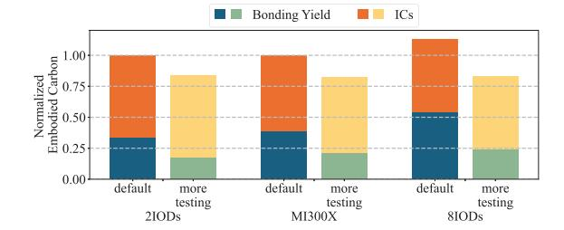

Fig. 19: Normalized embodied carbon of MI300X and its alternative architectures.

wasted carbon from bonding yield sees a 46% reduction, leading to 18% carbon reduction for the full system.

Alternative Architectures: Fig. 18 suggests that fewer components incur less overhead. In reality, changing this parameter has many implications. For example, splitting an IC into more components, i.e., chiplet methodology, improves the yield per chiplet, but incurs area overhead due to die-todie communication, which also has performance implications. Conversely, fewer chiplets result in less area overhead and bonding yield overhead, but each chiplet has lower yield.

To illustrate these intricate trade-offs, we consider two alternative architectures to the MI300X, while keeping performance similar by carefully adjusting die-to-die requirements. For the first alternative (2IODs), we merge two IODs into one, so that the resulting architecture has only two IODs instead of four, and each IOD has four XCDs on top instead of two. We deduct the D2D area when merging the IODs. For the second alternative (8IODs), we split each IOD into two, resulting in eight IODs in total, with one XCD on top of each IOD. We add D2D area overhead due to the disintegration.

We use CAPA to analyze the breakdown of the two alternative architectures against the original design, focusing on the bonding yield overhead, and explore how an optimal bonding strategy affects each architecture (Fig. 19). Looking at the left bars, the 2IODs version shows similar total carbon compared to the original, although the bonding yield overhead is smaller. The 8IODs version shows a larger total carbon increase as the wastage from bonding yield overshadows the savings from smaller ICs.

When using an optimal bonding order, i.e., lowest carbon IC first, and conducting bonding test after each bond, all three architectures show different savings while the total carbon is similar for each configuration. Both 2IODs and 8IODs versions reduce bonding yield overhead by 50%, but for different reasons. The 2IODs version benefits more from optimal bonding order due to high carbon per logic IC, while the 8IODs version benefits from more testing due to the number of components. This experiment showcases how CAPA helps computer architects navigate the trade-off of bonding yield, level of integration, and effect of bonding tests and orders.

Alternative Integration Technique: In Fig. 20, we investigate the embodied carbon impact of using EMIBs instead of a silicon interposer for H100 and MI300X. We try to match the die-to-die bandwidth of the hypothetical EMIBs to that of the

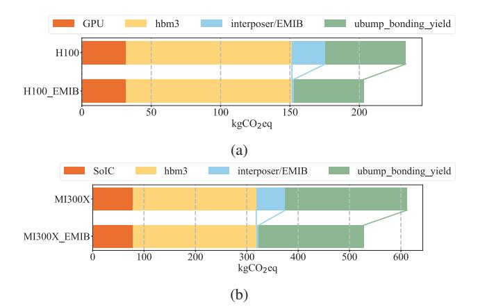

Fig. 20: (a) H100 with silicon interposer or EMIBs. (b) MI300X with silicon interposer or EMIBs.

original silicon interposer. Both cases show ∼14% reduction in total embodied carbon due to replacing the large silicon interposer with many pieces of EMIBs. This is a beneficial design choice for embodied carbon, although it may come with complications such as different physical design, and potential assembly problems due to more components.

## *E. Summary of Insights*

Binning: From previously proposed logic die carbon models [17], [31], [82], [93], only die area and process node can affect the embodied carbon, which leaves computer architects with limited options. A more detailed yield model that includes binning opens a new avenue that can drastically reduce the manufacturing carbon footprint. The binnable silicon area, the granularity of binnable modules, and the binning ratio are important factors that computer architects can leverage. The results from Figs. 12 and 14 also indicate that yield improvement from binning is more influential in overall embodied carbon if the system is dominated by binnable ICs.

HBM: As HBM incurs a large amount of embodied carbon, it overshadows the other ICs in the architectures we study. This requires attention on multiple fronts. Computer architects should deliberate on whether to use HBM instead of traditional memory technologies and the capacity of the stacks. Memory vendors should prioritize carbon reduction in the manufacturing of HBM. Software engineers should fully utilize HBM to better amortize its embodied carbon.

Carbon Overhead of Bonding Yield: We showcase the carbon impact of the bonding process and trade-offs. Bonding yield greatly affects the overall embodied carbon due to the number of components bonded. By carrying out bonding tests after each bonded component and applying an optimal bonding order, 16–27% of embodied carbon can be saved without changing the architecture according to Fig. 19. CAPA enables the trade-off exploration of bonding yield, level of integration, and effect of bonding tests and orders.

Low Carbon Design Guidelines: The total embodied carbon is closely related to the overall silicon area fabricated, including stacked and unstacked silicon from logic, memory, and

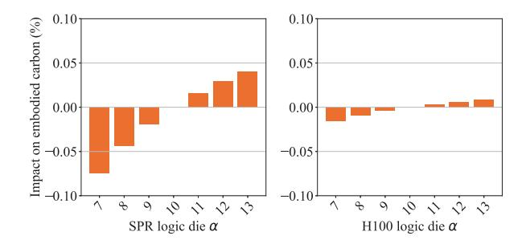

Fig. 21: Impact of logic die α on the embodied carbon of a 56-core Sapphire Rapids (left) and H100 (right).

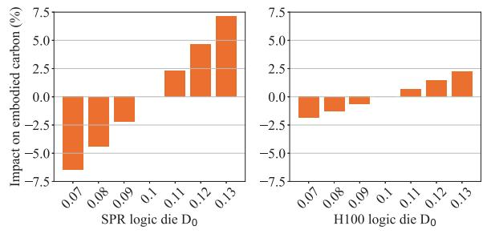

Fig. 22: Impact of logic die D<sup>0</sup> on the embodied carbon of a 56-core Sapphire Rapids (left) and H100 (right).

interconnect. Any architectural or design technique that can improve yield would be beneficial to embodied carbon, such as binning and testing. Techniques that reduce area or the number of required components will also have carbon benefits.

#### VII. SENSITIVITY ANALYSIS

In this section, we conduct sensitivity analyses on some key parameters, i.e., clustering parameter α, defect density D0, and HBM carbon/GB to show how their uncertainty propagates to CAPA's final estimates. We use the Intel SPR 56-core SKU as an example of logic die dominating the embodied carbon, as shown in Fig. 12, and NVIDIA H100 as an example of HBM dominating the embodied carbon, as shown in Fig. 15.

First, we look at how a logic die's clustering parameter α and defect density D<sup>0</sup> affect the overall embodied carbon. The default values are α = 10 and D<sup>0</sup> = 0.1 cm−<sup>2</sup>. We sweep α from -3 to +3 of the default value, and -0.03 to +0.03 for D0. Impact of the clustering parameter α is minimal, less than 0.075% (Fig. 21). In comparison, defect density D<sup>0</sup> has much higher impact due to it heavily affecting yield and therefore logic die embodied carbon, which also affects bonding yield carbon (Fig. 22). Further, since the logic die carbon contributes 78% in the 56-core SPR and only 13% in H100, the impact of D<sup>0</sup> shows much higher variance in Sapphire Rapids at 7.12% maximum compared to 2.24% maximum in H100 (Fig. 22).

Next, we do the same sweep of α and D<sup>0</sup> for the EMIB (Fig. 23) and silicon interposer (Fig. 24) in these two processors, but with different default values of 6 and 0.06 cm−<sup>2</sup>. Note that all four figures have different y-axis ranges. These sweeps show minimal impact, with the largest being ∼1% on D<sup>0</sup> for the silicon interposer for H100. The main reason is

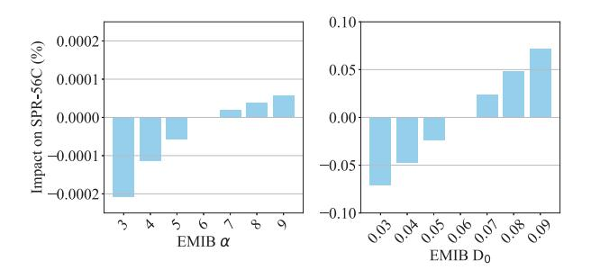

Fig. 23: Impact of EMIB α (left) and D<sup>0</sup> (right) on a 56-core Sapphire Rapids embodied carbon.

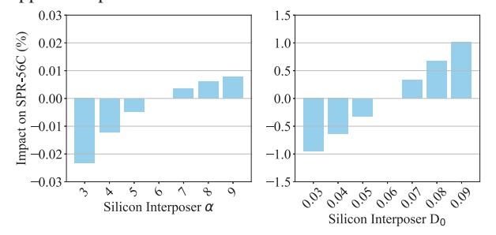

Fig. 24: Impact of silicon interposer α (left) and D<sup>0</sup> (right) on H100 embodied carbon.

that EMIB and silicon interposer only contributes to 7% and 10.4% embodied carbon, respectively, in their processors.

Finally, we sweep HBM carbon/GB in the H100 from 0.7 to 1.3 kgCO2eq. We use 1.247 for HBM3 from Table III for H100 in Sec. VI-B and 0.7 [62] is lowest number from available HBM carbon data sources. Changing the HBM carbon/GB has a large impact as HBM carbon contributes ∼50% of total embodied carbon, which also affects bonding yield carbon. This further corroborates our insights in Sec. VI-E that the usage and size of HBM should be carefully considered by computer architects, memory vendors and software engineers.

## VIII. LIMITATIONS

Physical Design Details. Designed for computer architects to estimate manufacturing carbon of high-performance processors, CAPA has limitations due to its high-level nature. First, we did not include modeling for through-silicon vias (TSVs). Details about TSVs, such as width and pitch are usually only available after the physical design stage, and can be highly inaccurate to estimate during early stages of design. Also, embodied carbon characterization of TSVs for high-volume manufacturing of high-performance processors is lacking. Second, other advanced packaging techniques, e.g., integrated fan-out (InFO), are not considered due to their limited usage in our target processors. CAPA is intentionally less detailed in many physical design related aspects and more detailed in modeling the embodied carbon contribution of high-level parameters to guide early-stage design decisions.

Operational Carbon and Performance. We study three very distinct architectures with different performance goals and power envelopes. Embodied carbon should not be considered

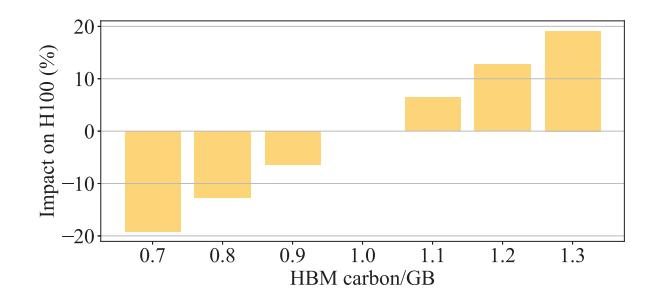

Fig. 25: Impact of HBM carbon/GB on H100 embodied.

in isolation and should be coupled with an analysis of operational carbon. Prior tools attempt to consider both for specific scenarios, e.g., 3D-Carbon for autonomous vehicle and ACT for mobile AI inference (see Table I). Yet none target highperformance processors. Performance-driven choices such as interconnect bandwidth between chiplets will feed back into the embodied carbon cost of a processor. We leave an optimization across both embodied and operational carbon for advanced-packaged architectures as future work.

Validation. Prior art attempts validation by comparing their results with vendor life cycle assessment (LCA) reports. However, there are no reasonable LCA report that include these processors. For example, in the commonly cited Dell R740 LCA [7], the Intel Xeon Gold 6152 CPUs are modeled with a 32nm node although they are manufactured in a 14nm node. In another Dell Server LCA [71], the AMD EPYC 7452 CPUs are modeled with eight ICs in a 14nm node, but actually consist of four 7nm core complex dies and one 14nm I/O die. Due to this mismatch, we do not believe these LCA reports are good references. While performance-focused analytical models can be validated against performance on real hardware, no similar solution exists for carbon modeling tools. For logic dies, we used imec.netzero for validation, and results show that CAPA is the most accurate. For a whole package, the only validation data point we can find is the Google TPUv4; again, CAPA reports the most accurate result at 0.4% error compared to previous tools' 54%, 20% and 12% as reported in Sec. V-C. CAPA provides a more robust model than prior art.

## IX. RELATED WORK

The last several years have witnessed a substantial increase in research related to sustainable computer systems, acknowledging the impact of architectural choices on both embodied and operational carbon. In addition to the tools and models already discussed, FOCAL [17] is a first-order model that can assess the carbon impact of various microarchitectural trade-offs. CAPA provides another level of insight into various architectural design choices for advanced packaging. Researchers have also studied how various architectural choices impact embodied carbon including reconfigurable architectures [14], superscalar designs [73], and server configurations [41]. Another proposed approach to reducing embodied carbon is to reuse or repurpose old hardware such as GreenSKU [86] and Junkyard Computing [83].

At the level of processing technology, lithography, various etching and deposition are responsible for most of the manufacturing carbon emissions. With advancing technology nodes, the number of process steps and chemical usage rises, leading to higher embodied emission for more advanced nodes. However, some lithography advances can improve semiconductor manufacturing sustainability [26], such as the deployment of extreme ultraviolet (EUV) vs. deep ultraviolet (DUV), and high numerical aperture (NA) EUV vs. low NA EUV. Other than lithography, atomic layer deposition (ALD), a subclass of chemical vapor deposition (CVD), which is widely used semiconductor manufacturing, can benefit from greener chemistry and process optimization to lower waste and emissions [88]. At the circuit design and physical design levels, optimizing for fewer metal layers with place-and-route can have a dramatic reduction in carbon emissions [21].

Beyond embodied carbon, additional research looks at operational carbon. These studies propose optimizing workload configuration [33], renewable energy integration [1], and carbon-aware scheduling [1] to reduce runtime emissions. Another line of work explores carbon optimal specialized hardware, including optimizing carbon per application on specialized hardware (AR/VR/XR) and developing carbonaware design frameworks of computing systems [20], and datacenters [1], [19], [68]. More recently, emerging and non-silicon technologies, like nanotube field-effect transistors (CNFETs) and indium gallium zinc oxide (IGZO) FETs, are modeled for power, performance, area and total carbon footprint that enables optimization for carbon efficiency [30]. Although CAPA does not consider operational carbon, it can be used in conjunction with operational carbon studies to understand various complex trade-offs.

Longstanding work on redundancy and fault-tolerance can reduce carbon due to their impact on improving yield. Architectural core salvaging [67] exploits redundancy in multi-core processors to utilize partially defective cores instead of disable them. This can improve yield and therefore embodied carbon and improve performance compared to lower core count SKU. Uncore components like on-chip interconnect, memory controller, and other I/O controllers, occupy comparable silicon area to the cores but are more sensitive to defects due to less coarse grain redundancy. Therefore, self-repair techniques for uncore components can increase the non-defect-critical area, which can improve yield [47]. Such techniques should be explored in light of emerging packaging technologies.

Frameworks that target total cost of ownership (TCO), typically consists of capital expenditure and operational expenditure which are analogous to embodied and operational carbon emission, provide valuable insights when navigating the trade-offs at a higher level and are closely related to total carbon emissions. Therefore, TCO frameworks can provide insight for carbon modeling. For example, HP Labs [46] proposed TCO modeling for integrating more I/O components into a server SoC, such as PCIe, SATA and networking before this paradigm became the norm. Additionally, Kleanthous et al. [43] explored TCO modeling of 3D-stacked DRAM-onCPU servers and incorporated considerations of reliability. Ideas such as these that benefit TCO are worth revisiting for carbon efficiency given the prevalent use of heterogeneous cores, disintegrating SoCs into chiplet-based architectures, and emerging I/Os like co-packaged optics.

Beyond carbon emissions, the environmental impact of the semiconductor industry encompasses broader challenges. These include the use of forever chemicals in the fabrication process, such as per- and polyfluoroalkyl substances (PFAS) [22], the emission of air pollutants beyond greenhouse gases, e.g., volatile organic compounds (VOCs) and acidic gases [92], and the generation of solid waste [87]. While there is still a long journey toward fully addressing the challenging environmental impact of semiconductor systems, our work takes an important step in that direction by providing a practical carbon modeling tool for advanced-packaged architectures and offering valuable insights into opportunities for manufacturing carbon reduction.

## X. CONCLUSION

We propose CAPA, a manufacturing carbon tool for advanced packaged processors to address three critical gaps in modeling high-performance processors: binning, HBM, and 3.5D integration. CAPA exposes binning as another dimension for logic die carbon reduction, rather than considering only die area and technology node. The granularity of binning modules, the binning ratio and binnable silicon area are the key factors that computer architects can leverage. CAPA highlights HBM as a major embodied carbon contributor that needs to be carefully considered and fully utilized in advanced-packaged architectures. CAPA identifies the bonding process as a primary player in overall embodied carbon. Employing more bonding tests and optimal bonding ordering lowers emissions without any architecture changes. The level of integration should be explored with the bonding process in mind. Analyses of five widely deployed high-performance processors showcase CAPA's utility in helping computer architects navigate the high carbon impact trade-offs at early stages of design.

## ACKNOWLEDGMENT

We thank the anonymous reviewers from ISCA and previous submission for their thoughtful reviews and feedback on this work. We also thank the members of the NEJ group, along with Gabriel Loh and Srilatha Manne from AMD for their valuable feedback and support.

## REFERENCES

- [1] B. Acun, B. Lee, F. Kazhamiaka, K. Maeng, U. Gupta, M. Chakkaravarthy, D. Brooks, and C.-J. Wu, "Carbon Explorer: A Holistic Framework for Designing Carbon Aware Datacenters," in *Proceedings of the 28th ACM International Conference on Architectural Support for Programming Languages and Operating Systems, Volume 2*. New York, NY, USA: Association for Computing Machinery, 2023, p. 118–132. [Online]. Available: https://doi.org/10.1145/3575693.3575754
- [2] A. Biswas, "Sapphire Rapids," in *IEEE Hot Chips 33 Symposium (HCS)*. Los Alamitos, CA, USA: IEEE Computer Society, Aug. 2021, pp. 1–22. [Online]. Available: https://doi.ieeecomputersociety.org/10. 1109/HCS52781.2021.9566865

- [3] B. Black, M. Annavaram, N. Brekelbaum, J. DeVale, L. Jiang, G. H. Loh, D. McCaule, P. Morrow, D. W. Nelson, D. Pantuso, P. Reed, J. Rupley, S. Shankar, J. Shen, and C. Webb, "Die Stacking (3D) Microarchitecture," in *39th Annual IEEE/ACM International Symposium on Microarchitecture (MICRO'06)*, 2006, pp. 469–479.
- [4] L. Boakes, M. Garcia Bardon, V. Schellekens, I.-Y. Liu, B. Vanhouche, G. Mirabelli, F. Sebaai, L. Van Winckel, E. Gallagher, C. Rolin, and L.- A. Ragnarsson, "Cradle-to-gate Life Cycle Assessment of CMOS Logic ˚ Technologies," in *International Electron Devices Meeting (IEDM)*, 2023, pp. 1–4.
- [5] L. Boakes, L.-A. Ragnarsson, C. Rolin, I.-Y. Liu, B. Vanhouche, ˚ V. Schellekens, J. Soethoudt, and M. Cauwe, "IMEC's Sustainable Semiconductor Technologies & Systems (SSTS): Life cycle assessment methodology for imec.netzero," imec, Tech. Rep., 2025, https://netzero.imec-int.com/methodology.
- [6] S. B. Boyd, "Life-cycle Assessment of Semiconductors," Ph.D. dissertation, 2009, copyright - Database copyright ProQuest LLC; ProQuest does not claim copyright in the individual underlying works; Last updated - 2023-03-03.
- [7] A. Busa, M. Hegeman, J. Vickers, N. Duque-Ciceri, and C. Herrmann, "Life Cycle Assessment of Dell R740," https: //www.delltechnologies.com/asset/en-us/products/servers/technicalsupport/Full LCA Dell R740.pdf, 2019.
- [8] J. Choquette, "NVIDIA Hopper GPU: Scaling Performance," in *IEEE Hot Chips 34 Symposium (HCS)*. Los Alamitos, CA, USA: IEEE Computer Society, Aug. 2022, pp. 1–46. [Online]. Available: https://doi.ieeecomputersociety.org/10.1109/HCS55958.2022.9895592
- [9] J. Choquette and W. Gandhi, "NVIDIA A100 GPU: Performance & Innovation for GPU Computing," in *IEEE Hot Chips 32 Symposium (HCS)*. Los Alamitos, CA, USA: IEEE Computer Society, Aug. 2020, pp. 1–43. [Online]. Available: https://doi.ieeecomputersociety.org/10. 1109/HCS49909.2020.9220622
- [10] J. Choquette, E. Lee, R. Krashinsky, V. Balan, and B. Khailany, "The A100 datacenter GPU and Ampere architecture," in *IEEE International Solid-State Circuits Conference (ISSCC)*, vol. 64, 2021, pp. 48–50.
- [11] J. Cunningham, "The use and evaluation of yield models in integrated circuit manufacturing," *IEEE Transactions on Semiconductor Manufacturing*, vol. 3, no. 2, pp. 60–71, 1990.
- [12] I. Cutress, "Intel's Process Roadmap to 2025: with 4nm, 3nm, 20A and 18A?!" https://www.anandtech.com/show/16823/intel-acceleratedoffensive-process-roadmap-updates-to-10nm-7nm-4nm-3nm-20a-18apackaging-foundry-emib-foveros.
- [13] ——, "'Better Yield on 5nm than 7nm': TSMC Update on Defect Rates for N5," https://www.anandtech.com/show/16028/better-yield-on-5nmthan-7nm-tsmc-update-on-defect-rates-for-n5, 2020.
- [14] P. Dangi, T. K. Bandara, S. Sheikhpour, T. Mitra, and L. Eeckhout, "Sustainable Hardware Specialization," in *Proceedings of the 43rd IEEE/ACM International Conference on Computer-Aided Design*. New York, NY, USA: Association for Computing Machinery, 2025. [Online]. Available: https://doi.org/10.1145/3676536.3676777
- [15] J. Danskin and D. Foley, "Pascal GPU with NVLink," in *IEEE Hot Chips 28 Symposium (HCS)*, 2016, pp. 1–24.
- [16] D. K. de Vries, "Investigation of gross die per wafer formulas," *IEEE Transactions on Semiconductor Manufacturing*, vol. 18, no. 1, pp. 136– 139, 2005.
- [17] L. Eeckhout, "FOCAL: A First-Order Carbon Model to Assess Processor Sustainability," in *Proceedings of the 29th ACM International Conference on Architectural Support for Programming Languages and Operating Systems*, 2024.
- [18] P. Ehrett, T. Austin, and V. Bertacco, "Chopin: Composing Cost-Effective Custom Chips with Algorithmic Chiplets," in *IEEE 39th International Conference on Computer Design (ICCD)*, 2021, pp. 395– 399.
- [19] T. Eilam, P. Bose, L. P. Carloni, A. Cidon, H. Franke, M. A. Kim, E. K. Lee, M. Naghshineh, P. Parida, C. S. Stein *et al.*, "Reducing datacenter compute carbon footprint by harnessing the power of specialization: Principles, metrics, challenges and opportunities," *IEEE Transactions on Semiconductor Manufacturing*, 2024.
- [20] M. Elgamal, D. Carmean, E. Ansari, O. Zed, R. Peri, S. Manne, U. Gupta, G.-Y. Wei, D. Brooks, G. Hills, and C.-J. Wu, "CORDOBA: Carbon-Efficient Optimization Framework for Computing Systems," in *IEEE International Symposium on High Performance Computer Architecture (HPCA)*, 2025, pp. 1289–1303.
- [21] M. Elgamal, A. Mahmoud, G.-Y. Wei, D. Brooks, and G. Hills, "Modeling PFAS in Semiconductor Manufacturing to Quantify Trade-

- offs in Energy Efficiency and Environmental Impact of Computing Systems," 2025. [Online]. Available: https://arxiv.org/abs/2505.06727
- [22] ——, "PFASware: Quantifying the Environmental Impact of Per- and Polyfluoroalkyl Substances (PFAS) in Computing Systems," in *Design, Automation & Test in Europe Conference (DATE)*, 2025, pp. 1–2.
- [23] Epoch AI, "Parameter, Compute and Data Trends in Machine Learning," 2022, accessed: 2025-07-10. [Online]. Available: https: //epoch.ai/data/notable-ai-models
- [24] S. Fathololoumi, "4 Tb/s Optical Compute Interconnect Chiplet for XPU-to-XPU Connectivity," in *IEEE Hot Chips 36 Symposium (HCS)*. Los Alamitos, CA, USA: IEEE Computer Society, Aug. 2024, pp. 1–18. [Online]. Available: https://doi.ieeecomputersociety.org/10.1109/ HCS61935.2024.10665032
- [25] Y. Feng and K. Ma, "Chiplet actuary: a quantitative cost model and multi-chiplet architecture exploration," in *Proceedings of the 59th ACM/IEEE Design Automation Conference*. New York, NY, USA: Association for Computing Machinery, 2022, p. 121–126. [Online]. Available: https://doi.org/10.1145/3489517.3530428
- [26] E. Gallagher, L.-A. Ragnarsson, and C. Rolin, "Sustainable Semicon- ˚ ductor Manufacturing: The Role of Lithography," *IEEE Transactions on Semiconductor Manufacturing*, vol. 37, no. 4, pp. 440–444, 2024.
- [27] M. Garcia Bardon, P. Wuytens, L.-A. Ragnarsson, G. Mirabelli, D. Jang, ˚ G. Willems, A. Mallik, A. Spessot, J. Ryckaert, and B. Parvais, "DTCO including Sustainability: Power-Performance-Area-Cost-Environmental score (PPACE) Analysis for Logic Technologies," in *IEEE International Electron Devices Meeting (IEDM)*, 2020, pp. 41.4.1–41.4.4.
- [28] "Google Environmental Report 2025," https://www.gstatic.com/ gumdrop/sustainability/google-2025-environmental-report.pdf, Google.
- [29] A. Graening, S. Pal, and P. Gupta, "Chiplets: How Small is too Small?" in *60th ACM/IEEE Design Automation Conference (DAC)*, 2023, pp. 1–6.
- [30] D. Grey-Stewart, D. Kong, M. Elgamal, G. Kyriazidis, J. Morris, and G. Hills, "Quantifying Trade-Offs in Power, Performance, Area, and Total Carbon Footprint of Future Three-Dimensional Integrated Computing Systems," in *Design, Automation & Test in Europe Conference (DATE)*, 2025, pp. 1–7.
- [31] U. Gupta, M. Elgamal, G. Hills, G.-Y. Wei, H.-H. S. Lee, D. Brooks, and C.-J. Wu, "ACT: designing sustainable computer systems with an architectural carbon modeling tool," in *Proceedings of the 49th Annual International Symposium on Computer Architecture*. New York, NY, USA: Association for Computing Machinery, 2022, p. 784–799. [Online]. Available: https://doi.org/10.1145/3470496.3527408
- [32] U. Gupta, Y. G. Kim, S. Lee, J. Tse, H.-H. S. Lee, G.-Y. Wei, D. Brooks, and C.-J. Wu, "Chasing Carbon: The Elusive Environmental Footprint of Computing," in *IEEE International Symposium on High-Performance Computer Architecture (HPCA)*, 2021, pp. 854–867.
- [33] L. Han, J. Kakadia, B. C. Lee, and U. Gupta, "Fair-CO2: Fair attribution for cloud carbon emissions," in *Proceedings of the 52nd Annual International Symposium on Computer Architecture*, 2025, pp. 646–663.
- [34] H. Hofstee, "Power efficient processor architecture and the cell processor," in *11th IEEE International Symposium on High-Performance Computer Architecture*, 2005, pp. 258–262.
- [35] Y. Hu, X. Lin, H. Wang, Z. He, X. Yu, J. Zhang, Q. Yang, Z. Xu, S. Guan, J. Fang, H. Shang, X. Tang, X. Dai, S. Wei, and S. Yin, "Wafer-Scale Computing: Advancements, Challenges, and Future Perspectives [Feature]," *IEEE Circuits and Systems Magazine*, vol. 24, no. 1, pp. 52–81, 2024.
- [36] P. K. Huang, C. Y. Lu, W. H. Wei, C. Chiu, K. C. Ting, C. Hu, C. Tsai, S. Y. Hou, W. C. Chiou, C. T. Wang, and D. Yu, "Wafer Level System Integration of the Fifth Generation CoWoS®-S with High Performance Si Interposer at 2500 mm2," in *IEEE 71st Electronic Components and Technology Conference (ECTC)*, 2021, pp. 101–104.
- [37] imec, "imec.netzero," https://netzero.imec-int.com/.
- [38] A. Ishii and R. Wells, "The NVLink-Network Switch: NVIDIA's Switch Chip for High Communication-Bandwidth Superpods," in *IEEE Hot Chips 34 Symposium (HCS)*. Los Alamitos, CA, USA: IEEE Computer Society, Aug. 2022, pp. 1–23. [Online]. Available: https://doi.ieeecomputersociety.org/10.1109/HCS55958.2022.9895480
- [39] S. S. Iyer, "Heterogeneous Integration for Performance and Scaling," *IEEE Transactions on Components, Packaging and Manufacturing Technology*, vol. 6, no. 7, pp. 973–982, 2016.
- [40] JEDEC, "Main Memory: DDR SDRAM, HBM," https://www.jedec.org/ category/technology-focus-area/main-memory-ddr-sdram.

- [41] S. Ji, Z. Yang, X. Chen, S. Cahoon, J. Hu, Y. Shi, A. K. Jones, and P. Zhou, "SCARIF: Towards Carbon Modeling of Cloud Servers with Accelerators," in *IEEE Computer Society Annual Symposium on VLSI (ISVLSI)*, 2024, pp. 496–501.
- [42] N. Jouppi, G. Kurian, S. Li, P. Ma, R. Nagarajan, L. Nai, N. Patil, S. Subramanian, A. Swing, B. Towles, C. Young, X. Zhou, Z. Zhou, and D. A. Patterson, "TPU v4: An Optically Reconfigurable Supercomputer for Machine Learning with Hardware Support for Embeddings," in *Proceedings of the 50th Annual International Symposium on Computer Architecture*. New York, NY, USA: Association for Computing Machinery, 2023. [Online]. Available: https://doi.org/10.1145/3579371.3589350
- [43] M. Kleanthous, Y. Sazeides, E. Ozer, C. Nicopoulos, P. Nikolaou, and ¨ Z. Hadjilambrou, "Toward Multi-Layer Holistic Evaluation of System Designs," *IEEE Computer Architecture Letters*, vol. 15, no. 1, pp. 58–61, 2016.
- [44] J. Kurzak, A. Buttari, P. Luszczek, and J. Dongarra, "The PlayStation 3 for High-Performance Scientific Computing," *Computing in Science & Engineering*, vol. 10, no. 3, pp. 84–87, 2008.
- [45] J. H. Lau, "Recent Advances and Trends in Advanced Packaging," *IEEE Transactions on Components, Packaging and Manufacturing Technology*, vol. 12, no. 2, pp. 228–252, 2022.
- [46] S. Li, K. Lim, P. Faraboschi, J. Chang, P. Ranganathan, and N. P. Jouppi, "System-level integrated server architectures for scaleout datacenters," in *Proceedings of the 44th Annual IEEE/ACM International Symposium on Microarchitecture*. New York, NY, USA: Association for Computing Machinery, 2011, p. 260–271. [Online]. Available: https://doi.org/10.1145/2155620.2155651
- [47] Y. Li, E. Cheng, S. Makar, and S. Mitra, "Self-repair of uncore components in robust system-on-chips: An OpenSPARC T2 case study," in *IEEE International Test Conference (ITC)*, 2013, pp. 1–10.
- [48] J. Macri, "AMD's next generation GPU and high bandwidth memory architecture: FURY," in *IEEE Hot Chips 27 Symposium (HCS)*, 2015, pp. 1–26.
- [49] R. Mahajan and S. Sane, "Advanced Packaging Technologies for Heterogeneous Integration (HI)," https://hc33.hotchips.org/assets/ program/tutorials/Tutorial Mahajan Sane HotChips 2021 Talk final Formatted 1.pdf, 2021.
- [50] R. Mahajan, R. Sankman, N. Patel, D.-W. Kim, K. Aygun, Z. Qian, Y. Mekonnen, I. Salama, S. Sharan, D. Iyengar, and D. Mallik, "Embedded Multi-die Interconnect Bridge (EMIB) – A High Density, High Bandwidth Packaging Interconnect," in *IEEE 66th Electronic Components and Technology Conference (ECTC)*, 2016, pp. 557–565.
- [51] C. S. Mandalapu, C. Buch, P. Shah, R. Topacio, P. Cheng, L. Wang, R. Swaminathan, A. Smith, J. Wuu, K. Mysore, and A. Alam, "3.5D Advanced Packaging Enabling Heterogenous Integration of HPC and AI Accelerators," in *IEEE 74th Electronic Components and Technology Conference (ECTC)*, 2024, pp. 798–802.
- [52] E. J. Marinissen, T. McLaurin, and H. Jiao, "IEEE Std P1838: DfT standard-under-development for 2.5D-, 3D-, and 5.5D-SICs," in *21th IEEE European Test Symposium (ETS)*, 2016, pp. 1–10.
- [53] S. Mcallister, F. Kazhamiaka, D. S. Berger, R. Fonseca, K. Frost, A. Ogus, M. Sah, R. Bianchini, G. Amvrosiadis, N. Beckmann, and G. R. Ganger, "A Call for Research on Storage Emissions," *SIGENERGY Energy Inform. Rev.*, vol. 4, no. 5, p. 67–75, Apr. 2025. [Online]. Available: https://doi.org/10.1145/3727200.3727211
- [54] M. Mehta, "An AI Compute ASIC with Optical Attach to Enable Next Generation Scale-Up Architectures," in *IEEE Hot Chips 36 Symposium (HCS)*, 2024, pp. 1–30.
- [55] "2024 Sustainability Report," https://sustainability.atmeta.com/wpcontent/uploads/2024/08/Meta-2024-Sustainability-Report.pdf, Meta.
- [56] "2025 Environmental Sustainability Report," https://cdn-dynmedia-1.microsoft.com/is/content/microsoftcorp/microsoft/msc/documents/ presentations/CSR/2025-Microsoft-Environmental-Sustainability-Report.pdf, Microsoft.
- [57] S. K. Moore, "Advanced Packaging Technologies for Heterogeneous Integration (HI)," https://spectrum.ieee.org/amd-mi300, 2023.
- [58] S. Naffziger, N. Beck, T. Burd, K. Lepak, G. H. Loh, M. Subramony, and S. White, "Pioneering Chiplet Technology and Design for the AMD EPYC™ and Ryzen™ Processor Families : Industrial Product," in *ACM/IEEE 48th Annual International Symposium on Computer Architecture (ISCA)*, 2021, pp. 57–70.
- [59] N. Nassif, A. O. Munch, C. L. Molnar, G. Pasdast, S. V. Lyer, Z. Yang, O. Mendoza, M. Huddart, S. Venkataraman, S. Kandula, R. Marom,

- A. M. Kern, B. Bowhill, D. R. Mulvihill, S. Nimmagadda, V. Kalidindi, J. Krause, M. M. Haq, R. Sharma, and K. Duda, "Sapphire Rapids: The Next-Generation Intel Xeon Scalable Processor," in *IEEE International Solid-State Circuits Conference (ISSCC)*, vol. 65, 2022, pp. 44–46.
- [60] NVIDIA, "NVIDIA A100 Tensor Core GPU Architecture," https://www.nvidia.com/content/dam/en-zz/Solutions/Data-Center/nvidia-ampere-architecture-whitepaper.pdf.
- [61] ——, "NVIDIA H100 Tensor Core GPU Architecture," https://resources. nvidia.com/en-us-hopper-architecture/nvidia-h100-tensor-c.
- [62] ——, "Product Carbon Footprint (PCF) Summary for HGX H100," https://images.nvidia.com/aem-dam/Solutions/documents/HGX-H100- PCF-Summary.pdf.
- [63] S. Pal, J. Liu, I. Alam, N. Cebry, H. Suhail, S. Bu, S. S. Iyer, S. Pamarti, R. Kumar, and P. Gupta, "Designing a 2048-Chiplet, 14336- Core Waferscale Processor," in *58th ACM/IEEE Design Automation Conference (DAC)*, 2021, pp. 1183–1188.
- [64] S. Pal, D. Petrisko, A. A. Bajwa, P. Gupta, S. S. Iyer, and R. Kumar, "A Case for Packageless Processors," in *IEEE International Symposium on High Performance Computer Architecture (HPCA)*, 2018, pp. 466–479.
- [65] D. Pham, T. Aipperspach, D. Boerstler, M. Bolliger, R. Chaudhry, D. Cox, P. Harvey, P. Harvey, H. Hofstee, C. Johns, J. Kahle, A. Kameyama, J. Keaty, Y. Masubuchi, M. Pham, J. Pille, S. Posluszny, M. Riley, D. Stasiak, M. Suzuoki, O. Takahashi, J. Warnock, S. Weitzel, D. Wendel, and K. Yazawa, "Overview of the architecture, circuit design, and physical implementation of a first-generation cell processor," *IEEE Journal of Solid-State Circuits*, vol. 41, no. 1, pp. 179–196, 2006.
- [66] S. Pichai, "Our third decade of climate action: Realizing a carbonfree future," https://blog.google/outreach-initiatives/sustainability/ourthird-decade-climate-action-realizing-carbon-free-future/.
- [67] M. D. Powell, A. Biswas, S. Gupta, and S. S. Mukherjee, "Architectural core salvaging in a multi-core processor for hard-error tolerance," in *Proceedings of the 36th Annual International Symposium on Computer Architecture*. New York, NY, USA: Association for Computing Machinery, 2009, p. 93–104. [Online]. Available: https://doi.org/10.1145/1555754.1555769
- [68] A. Radovanovic, R. Koningstein, I. Schneider, B. Chen, A. Duarte, ´ B. Roy, D. Xiao, M. Haridasan, P. Hung, N. Care *et al.*, "Carbonaware computing for datacenters," *IEEE Transactions on Power Systems*, vol. 38, no. 2, pp. 1270–1280, 2022.
- [69] R. Rahman, D. Owen, and J. You, "Tracking Compute-Intensive AI Models," https://epoch.ai/blog/tracking-compute-intensive-ai-models.
- [70] S. Russell, "Hybrid Bonding Increases Complexity and Carbon Intensity," https://library.techinsights.com/public/hg-asset/554b00a7- 6022-4b3a-9d2e-f0f190cd0bc6, 2025.
- [71] A. Saraev, M. Gama, F. M. Piontek, and P. Negi, "Life Cycle Assessment – Dell Servers R6515, R7515, R6525, R7525," https://www.delltechnologies.com/asset/en-us/products/servers/ technical-support/full-lca-of-dell-severs-r6515-r7515-r6525-r7525.pdf, 2021.
- [72] I. Schneider, H. Xu, S. Benecke, D. Patterson, K. Huang, P. Ranganathan, and C. Elsworth, "An Introduction to Life-Cycle Emissions of Artificial Intelligence Hardware," *IEEE Micro*, vol. 45, no. 5, pp. 9–19, 2025.
- [73] S. Sheikhpour, D. Z. Metz, E. Jellum, M. Sjalander, and L. Eeckhout, ¨ "Sustainable High-Performance Instruction Selection for Superscalar Processors," in *Proceedings of the 43rd IEEE/ACM International Conference on Computer-Aided Design*. New York, NY, USA: Association for Computing Machinery, 2025. [Online]. Available: https://doi.org/10.1145/3676536.3676757
- [74] A. Smith, G. H. Loh, S. Naffziger, J. Wuu, N. Kalyanasundharam, E. Chapman, R. Swaminathan, T. Huang, W. Jung, A. Kaganov, H. McIntyre, and R. Mangaser, "Interconnect Design for Heterogeneous Integration of Chiplets in the AMD Instinct MI300X Accelerator," *IEEE Micro*, vol. 45, no. 1, pp. 57–66, 2025.
- [75] A. Smith, G. H. Loh, M. J. Schulte, M. Ignatowski, S. Naffziger, M. Mantor, M. F. N. Kalyanasundharam, V. Alla, N. Malaya, J. L. Greathouse, E. Chapman, and R. Swaminathan, "Realizing the AMD Exascale Heterogeneous Processor Vision : Industry Product," in *ACM/IEEE 51st Annual International Symposium on Computer Architecture (ISCA)*, 2024, pp. 876–889.
- [76] B. Smith, "Microsoft will be carbon negative by 2030," https://blogs.microsoft.com/blog/2020/01/16/microsoft-will-be-carbonnegative-by-2030/.

- [77] D. Soltis and S. Robinson, "Clearwater Forest the Next Generation Intel® Xeon® Processor with Efficiency Cores," in *2025 IEEE Hot Chips 37 Symposium (HCS)*. Los Alamitos, CA, USA: IEEE Computer Society, Aug. 2025, pp. 1–15. [Online]. Available: https://doi.ieeecomputersociety.org/10.1109/HCS66204.2025.11154401
- [78] C. H. Stapper, "Defect density distribution for LSI yield calculations," *IEEE Transactions on Electron Devices*, vol. 20, no. 7, pp. 655–657, 1973.
- [79] D. Stow, Y. Xie, T. Siddiqua, and G. H. Loh, "Cost-effective design of scalable high-performance systems using active and passive interposers," in *IEEE/ACM International Conference on Computer-Aided Design (ICCAD)*, 2017, pp. 728–735.
- [80] E. Strohmaier, J. Dongarra, H. Simon, and M. Meuer, "TOP500," https: //www.top500.org/lists/top500/.
- [81] L. T. Su, S. Naffziger, and M. Papermaster, "Multi-chip technologies to unleash computing performance gains over the next decade," in *IEEE International Electron Devices Meeting (IEDM)*, 2017, pp. 1.1.1–1.1.8.
- [82] C. C. Sudarshan, N. Matkar, S. Vrudhula, S. S. Sapatnekar, and V. A. Chhabria, "ECO-CHIP: Estimation of Carbon Footprint of Chiplet-based Architectures for Sustainable VLSI," in *IEEE International Symposium on High-Performance Computer Architecture (HPCA)*, 2024, pp. 671– 685.
- [83] J. Switzer, G. Marcano, R. Kastner, and P. Pannuto, "Junkyard Computing: Repurposing Discarded Smartphones to Minimize Carbon," in *Proceedings of the 28th ACM International Conference on Architectural Support for Programming Languages and Operating Systems, Volume 2*. New York, NY, USA: Association for Computing Machinery, 2023, p. 400–412. [Online]. Available: https://doi.org/10. 1145/3575693.3575710
- [84] E. Talpes, D. Williams, and D. D. Sarma, "DOJO: The Microarchitecture of Tesla's Exa-Scale Computer," in *IEEE Hot Chips 34 Symposium (HCS)*, 2022, pp. 1–28.
- [85] J. Wang, "100x Defect Tolerance: How Cerebras Solved the Yield Problem - Cerebras," https://www.cerebras.ai/blog/100x-defect-tolerancehow-cerebras-solved-the-yield-problem.
- [86] J. Wang, D. S. Berger, F. Kazhamiaka, C. Irvene, C. Zhang, E. Choukse, K. Frost, R. Fonseca, B. Warrier, C. Bansal, J. Stern, R. Bianchini,

- and A. Sriraman, "Designing Cloud Servers for Lower Carbon," in *ACM/IEEE 51st Annual International Symposium on Computer Architecture (ISCA)*, 2024, pp. 452–470.
- [87] Q. Wang, N. Huang, Z. Chen, X. Chen, H. Cai, and Y. Wu, "Environmental data and facts in the semiconductor manufacturing industry: An unexpected high water and energy consumption situation," *Water Cycle*, vol. 4, pp. 47–54, 2023.
- [88] M. Weber, N. Boysen, O. Graniel, A. Sekkat, C. Dussarrat, P. Wiff, A. Devi, and D. Munoz-Rojas, "Assessing the Environmental Impact ˜ of Atomic Layer Deposition (ALD) Processes and Pathways to Lower It," *ACS Materials Au*, vol. 3, no. 4, pp. 274–298, 2023. [Online]. Available: https://doi.org/10.1021/acsmaterialsau.3c00002
- [89] C.-J. Wu, B. Acun, R. Raghavendra, and K. Hazelwood, "Beyond Efficiency: Scaling AI Sustainably," *IEEE Micro*, pp. 1–8, 2024.
- [90] C.-J. Wu, R. Raghavendra, U. Gupta, B. Acun, N. Ardalani, K. Maeng, G. Chang, F. Aga, J. Huang, C. Bai, M. Gschwind, A. Gupta, M. Ott, A. Melnikov, S. Candido, D. Brooks, G. Chauhan, B. Lee, H.-H. Lee, B. Akyildiz, M. Balandat, J. Spisak, R. Jain, M. Rabbat, and K. Hazelwood, "Sustainable AI: Environmental Implications, Challenges and Opportunities," in *Proceedings of Machine Learning and Systems*, D. Marculescu, Y. Chi, and C. Wu, Eds., vol. 4, 2022, pp. 795–813. [Online]. Available: https://proceedings.mlsys.org/paper files/paper/2022/file/462211f67c7d858f663355eff93b745e-Paper.pdf
- [91] J. Wuu, M. Mantor, G. H. Loh, A. Smith, D. Johnson, D. Fisher, B. Johnson, C. Henrion, R. Schreiber, J. Lucas, S. Dussinger, A. Tomlinson, W. Walker, P. Moyer, D. Kulkarni, D. Ng, W. Jung, R. Swaminathan, and S. Naffziger, "Coevolution of Chiplet Technology and Cache Architecture for AI and Compute," in *IEEE International Electron Devices Meeting (IEDM)*, 2024, pp. 1–4.
- [92] Y. Yin and Y. Yang, "Sustainable Transition of the Global Semiconductor Industry: Challenges, Strategies, and Future Directions," *Sustainability*, vol. 17, no. 7, p. 3160, 2025.
- [93] Y. Zhao, Y. K. Zhao, C. Wan, and Y. C. Lin, "3D-Carbon: An Analytical Carbon Modeling Tool for 3D and 2.5D Integrated Circuits," in *Proceedings of the 61st ACM/IEEE Design Automation Conference*. New York, NY, USA: Association for Computing Machinery, 2024. [Online]. Available: https://doi.org/10.1145/3649329.3658482

## APPENDIX A ARTIFACT APPENDIX

#### A. Abstract

This artifact contains our proposed tool CAPA, Carbon for Advanced-Packaged Architectures, described in Sec. IV. We include a selection of parameters and examples of architectural description files used in our paper. For artifact evaluation, we also provide a collection of scripts to reproduce the key results from our paper, including Figures 12, 14, 15, 17, and 20.

#### B. Artifact check-list (meta-information)

- Program: Python 3.9+.
- Run-time environment: Python 3.9+.
- Hardware: Any hardware that can run Python 3.9+.
- Run-time state: Not sensitive to run-time state.
- Execution: No specific conditions. One estimation takes around 2 seconds on an Apple Macbook Air M2.
- Metrics: Manufacturing carbon emission in kgCO<sub>2</sub>eq.
- Output: Total and breakdown of manufacturing carbon emission of a given design in the form of a .csv and .pdf file. The key results, as in Figures 12, 14, 15, 17, and 20, can be generated by provided bash scripts.
- Experiments: Provided bash scripts.
- How much disk space required (approximately)?: Less than 300MB including the python packages installed inside python virtual environment.
- How much time is needed to prepare workflow (approximately)?: Less than a minute.
- How much time is needed to complete experiments (approximately)?: Less than a minute.
- Publicly available?: Yes, at Zenodo: https://doi.org/10.5281/zenodo.19744640
- Archived (provide DOI)?: Yes. DOI: https://doi.org/10.5281/zenodo.19744640

## C. Description

- 1) How to access: Download CAPA-AE.zip at Zenodo: https://doi.org/10.5281/zenodo.19744640.
- 2) Hardware dependencies: Any hardware that can run Python 3.9+.
- *3) Software dependencies:* Any UNIX-like OS with BASH. Python 3 packages needed can be install in requirements.txt, which includes *numpy*, *scipy-1.12+*, and *matplotlib*.

#### D. Installation

- 1) Unzip CAPA-AE.zip and go inside CAPA-AE.
- 2) If the required packages are already installed, then skip to Experiments. Otherwise, in the CAPA directory, run python3 -m venv capa\_venv
- 3) Activate the virtual environment: source capa\_venv/bin/activate
- 4) Install the required packages: pip3 install -r requirements.txt

#### E. Experiment workflow

- 1) Go to experiments/scripts
- 2) Execute the run\_all script: sh run\_all.sh
- 3) Generated figures (fig12.pdf, fig14.pdf, fig15.pdf, fig17.pdf, fig20a.pdf and fig20b.pdf) are in experiments.

#### F. Evaluation and expected results

All evaluation results, the .csv files and .pdf figures, will be inside the same directory alongside the architecture description files under arch\_description. The expected results are figures shown in the paper (Figures 12, 14, 15, 17, and 20).

#### G. Experiment customization

- arch\_description/SPR/SPR\_56C\_us provides examples of customizing fab location, bonding location and low-estimate option for interposer/EMIB.
- Fig. 19 can be reproduced by fig19\_TI.sh, and fig19\_low.sh can produce an alternative version using low estimate for HBM3 and fixed  $D_0 = 0.1 \, \mathrm{cm}^{-2}$ .

```
{
    "Top": "MI300X",
    "SoIC": {
        "xCD": {
            "stack": 1,
            "number": 2,
            "bonding": "hb",
            "pitch": 9
    },
    "IOD": 0
    },
    "MI300X": {
        "soIC": {
            "stack": 1,
            "number": 4,
            "bonding": "ubump",
            "pitch": 35,
            "bandwidth": 10.8
    },
    "hbm3": {
            "stack": 1,
            "number": 8,
            "bonding": "ubump",
            "pitch": 45
    },
        "interposer": 0
}

(a)
```

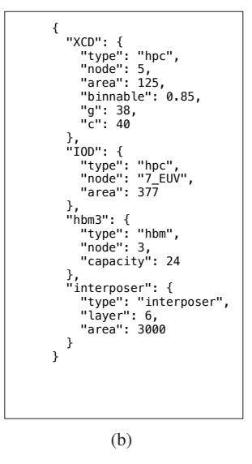

Fig. 26: (a) arch.json. (b) chiplets.json.

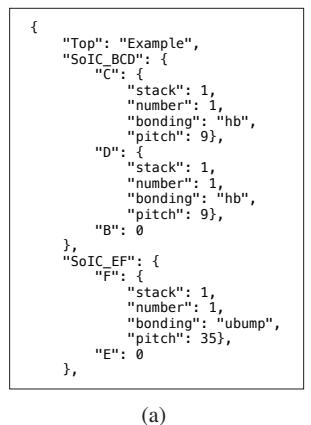

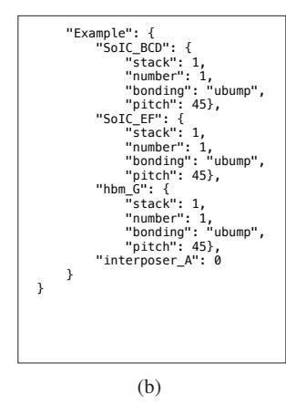

Fig. 27: (a) example\_arch.json first half. (b) example\_arch.json second half.

#### H. Methodology

Submission, reviewing and badging methodology:

- https://www.acm.org/publications/policies/artifactreview-and-badging-current
- https://cTuning.org/ae# CAPA: Manufacturing Carbon Estimation for Advanced-Packaged Architectures

Jingyang Liu, Gwenith Bowker-Bafna, Yuke Zhang, Natalie Enright Jerger *University of Toronto* Toronto, Canada

{jingyang.liu, gwenith.bowkerbafna}@mail.utoronto.ca, {yuke.zhang, natalie.enrightjerger}@utoronto.ca

*Abstract*—To meet growing compute demand, hyperscalers are rapidly deploying new data centre hardware, which embodies significant carbon. This aggressive growth of compute infrastructure jeopardizes their carbon reduction goals. While existing carbon tools estimate the manufacturing carbon footprint of integrated circuits (ICs), they do not reasonably model the highperformance advanced-packaged processors that dominate data centres and supercomputers. To bridge this gap, we propose a tool called CAPA, which models manufacturing Carbon for Advanced-Packaged Architectures. CAPA incorporates a binning yield model, high-bandwidth memory (HBM) carbon estimates, and support for complex architectures that use a mixture of integration techniques, such as 3.5D. By using CAPA to study widely used high-performance processors, we reveal opportunities for carbon savings through systematic binning and testing strategies, and we highlight HBM as a major carbon contributor. CAPA provides insights about the carbon footprint of cuttingedge architectures, opening new avenues for mitigating the environmental impact of the ever-growing computing industry.

#### I. INTRODUCTION

Over the past five years, the compute needed for training one machine learning model has increased at least 100× [23]. In the same time period, the number of large-scale AI models has grown by 76× [69]. To support this rapidly growing compute demand, hyperscalers have expanded data centre infrastructure and deployed new computing hardware, such as advancedpackaged accelerators and high-performance processors.

This super-linear growth of compute infrastructure capacity comes with non-negligible environmental impacts [32], [90]. To curb climate change, major hyperscalers set carbon reduction goals in 2020: Microsoft announced the goal of being carbon negative by 2030 [76] and Google announced several sustainability goals, including operating fully on renewable energy by 2030 [66]. Now halfway through the decade, the progress towards these goals is concerning. Fig. 1 shows the 2020-21 and 2024-25 greenhouse gas (GHG) emissions in metric tonnes for Microsoft [56], Meta [55], and Google [28], three of the largest hyperscalers. Their annual emissions saw increases of 25%, 46%, and 50%. The largest portion of the total emissions is attributed to the expansion of data centre capacity and the manufacturing carbon of computing

This work was funded by AMD, the NSERC Alliance program (ALLRP 591075-2023), NSERC Discovery (RGPIN-2020-04179), the NSERC CRE-ATE program on Sustainable Data Systems for Data Science (CREATE 584767-2024), and the Canada Research Chair program (CRC-2022-00350).


Fig. 1: GHG emissions (10<sup>6</sup>×mtCO2eq) of hyperscalers.

hardware [28], [55], [56]. The gap between where hyperscalers are and where they need to be is widening.

Commitments such as operating on renewable energy, only address one aspect of the sustainability problem: operational carbon. Yet, the total carbon footprint of computing systems encompasses two components: operational carbon, accounting for emissions from energy consumption during use; and embodied carbon, also known as manufacturing carbon, referring to emissions generated during the production, assembly, and deployment of computing hardware.

While prior works address carbon emissions from energy consumption during use, e.g., through renewable energy, temporal and spatial shifting of data centre workloads [1], and power usage effectiveness optimization [89], estimating embodied carbon remains a challenge. Fig. 1 shows embodied carbon contributes 54 − 91% of the total carbon [28], [55], [56]. Recently, various models have been developed to characterize the carbon footprint of ICs [4], [27], [37], [82], [93]. Although these are pioneering works in modeling manufacturing carbon, the approaches do not characterize several aspects of advanced-packaged architectures. First, the tools do not model functional binning, which is a common practice to improve yield. Second, they do not account for high-bandwidth memory (HBM), one of the key drivers of advanced packaging [48] and used by almost all state-of-theart high-performance processors [80]. Third, current tools do not support complex systems that use a mixture of integration techniques. For example, prior work fails to model 3.5D integration, which is the combination of 2.5D integration with 3D-stacked chips [51], [52].

We propose a new open-source tool: CAPA (Carbon for Advanced-Packaged Architectures) to address these three critical gaps. CAPA is user-friendly and accepts high-level inputs. To demonstrate the utility of CAPA, we model five widely deployed high-performance processors: Intel Sapphire Rapids [2], NVIDIA A100 [9], H100 [8], Google TPUv4 [42] and AMD MI300X [75]. Our results show that CAPA provides a more accurate model than prior tools [31], [82], [93], for both logic die carbon estimation and whole-package carbon estimation. Moreover, our analysis reveals opportunities for carbon reduction through systematic binning and testing strategies. We highlight HBM as a major contributor to manufacturing carbon that requires greater attention from both researchers and industry. Finally, we present several key insights to help drive future sustainable architecture designs.

Our key contributions are summarized as follows:

- We develop CAPA, an open-sourced1 manufacturing carbon estimation model with high-level input parameters. CAPA enables carbon modeling of functional binning, HBM integration, and 3.5D packaging.
- CAPA highlights that the granularity of binnable modules, the binning ratio, and binnable silicon area are important factors that computer architects should leverage to design carbon-friendly architectures.
- CAPA's insights demonstrate that HBM needs to be carefully considered and fully utilized as it is a significant carbon contributor in advanced-packaged architectures.

## II. BACKGROUND

This section introduces concepts fundamental to understanding our work, including binning and advanced packaging techniques. Prior work in carbon modeling is also covered.

#### *A. Semiconductor Binning Yield*

During semiconductor fabrication, defects can be introduced that cause circuit faults. Die yield is the number of functional dies out of all the dies fabricated. The yield percentage is usually a fab secret, yet it is an important factor in estimating manufacturing carbon. The negative binomial yield model [78] is considered closest to reality for very-large-scale-integration (VLSI) chips [5], [11], which states:

$$Y_{\text{die}} = \left(1 + \frac{A \times D_0}{\alpha}\right)^{-\alpha},\tag{1}$$

where A is the die area, α is a process-dependent clustering parameter, and D<sup>0</sup> is the defect density. As chip area increases, the yield decreases. For example, using Eqn. 1, when die area increases from 400 mm<sup>2</sup> to 800 mm<sup>2</sup> under a mature process of α = 10 and D<sup>0</sup> = 0.15 cm−<sup>2</sup> [13], the yield drops from approximately 56% to 32%.

A common practice to improve yield is functional binning, where part or all of the chip area is modularized and defective modules are disabled, leaving the rest of the chip functional [34], [44], [65]. For CPUs and GPUs, the binnable modules are usually individual or groups of cores, slices of caches, or memory controllers. Note that functional binning should not have performance implications since a binned-down version is equivalent to a lower-tiered version. Other forms of binning, such as performance binning, are outside our scope.

#### *B. Advanced Packaging*

In today's technology, the feature size disparity between silicon chips and packages is roughly 10,000× [39], translating to poorer performance for off-package links [64]. To avoid off-package links, chip designers use *advanced packaging techniques* to integrate as many components as possible in the same package. As yields for smaller dies are significantly better than for larger dies, assembling a system from multiple small dies reduces manufacturing cost up to 40% compared to a hypothetical monolithic approach [58], [81], making chiplet architectures attractive to the semiconductor industry.

The most commonly used advanced packaging techniques are 2.5D integration, with silicon bridges or a passive silicon interposer, and 3D stacking, with microbumps or hybrid bonding [3], [15], [45], [77]. Fig. 2 illustrates the cross-section of these integration techniques. Silicon bridges (Fig. 2a), also known as embedded multi-die interconnect bridge (EMIB) [50] by Intel, use small silicon dies to enable localized die-to-die connections with low cost and improved yield due to minimal silicon usage. Silicon interposer-based 2.5D integration (Fig. 2b) employs a silicon interposer to provide high-density interconnects across a large area, making it suitable for bandwidth-intensive applications like integrating HBMs. 3D stacking with microbumps (Fig. 2c) and hybrid bonding (HB) (Fig. 2d) are two advanced vertical integration techniques for chiplet interconnections. The former stacks dies using microbumps to enable vertical connectivity, while the latter uses copper-to-copper hybrid bonding. 3D stacking allows architectural implementations, such as compute-oncache, to improve performance and power [91]. State-ofthe-art processors employ a mixture of 2.5D integration and 3D stacking, known as 3.5D integration [51], [52]. Fig. 3 shows an example of a 3.5D integration, which combines 2.5D integration using a silicon interposer with two 3Dstacked ICs, one using microbumps and the other using hybrid bonding, enabling both horizontal and vertical high-density interconnects within a single package.

#### *C. Existing Carbon Modeling Tools*

IMEC publishes GHG emissions of generic high-volume manufacturing semiconductor fabrication [4], [27]. Its imec.netzero application provides data for CMOS logic nodes from 65nm to 2nm [5] and has become the standard of IC embodied carbon estimation [53], [86], [89]. We use data from imec.netzero as the reference for logic die manufacturing carbon emission. The public version of imec.netzero does not support binning, packaging, integration, or DRAM. To the best of our knowledge, there is no open-sourced reference for these techniques.

ACT [31] is a pioneering architectural carbon tool that enables carbon-driven design space exploration of computer systems. ACT models the manufacturing carbon by:

$$E_{SoC} = A \times CPA \times \frac{1}{Yield}, \tag{2}$$

$$CPA = GPA + CI_{fab} \times EPA + MPA, \tag{3}$$

<sup>1</sup>Available at https://doi.org/10.5281/zenodo.19744640


Fig. 2: (a) Silicon bridge. (b) Silicon interposer. (c) 3D stacking with microbumps. (d) 3D stacking with hybrid bonding.


Fig. 3: 3.5D integration.

where ESoC, CPA, GPA, CIfab, EPA, and MPA stand for emissions per system-on-chip (SoC), carbon per area, gas per area, carbon intensity of the fabrication facility, energy per area, and materials per area, respectively. The GPA and EPA values are from Garcia Bardon et al. [27], and the MPA values are from Boyd [6].

ECO-Chip [82] models redistribution layer fan-out, silicon bridges, silicon interposers, and 3D stacking with microbumps. They add embodied carbon from wasted silicon to their logic die carbon model. ECO-Chip also enables chiplet architecture exploration of mixed technology nodes.

3D-Carbon [93] studies more integration options besides the ones covered in ECO-Chip, such as MCM-based, InFO-based, hybrid bonding based 3D stacking, and monolithic 3D, . Additionally, they discuss yield models for chip-first and chiplast 2.5D, wafer-to-wafer and die-to-wafer hybrid bonding.

## III. MOTIVATION

This section presents case studies which illustrate the motivating factors behind our tool's distinct features.

Case Study 1: Functional binning improves yield. Functional binning yield depends on the binnable area percentage of the chip, the binning granularity, and the binning ratio. Binnable area is the portion of the die that can be tested for functionality and binned, while non-binnable regions, such as those used for interconnect, power management, and clocking, cannot be binned. Binning granularity refers to the number of modules available for binning, where a finer granularity indicates more binnable modules. For example, "5/6" represents at least 5 functional modules of 6 binnable modules. Binning ratio is the ratio of functional modules to all binnable modules.

We present the yield vs. functional binning relationship in Fig. 4, where the left figure indicates functional binning leads to yield increase, and the right figure shows the potential yield increase if the binning granularity is finer. Notice that the three binning granularities result in the same binning ratio, and therefore the same functional silicon area, yet the finer the granularity, the higher the yield. For example, a 600 mm<sup>2</sup> die has a yield of 80% with the coarse granularity of 5/6, but


Fig. 4: Yield vs. die area with different binning granularities (left) yield vs. binnable area percentage of an 800mm<sup>2</sup> (right).


Fig. 5: Manufacturing carbon vs. yield using IMEC data [5].

a yield of 94% with the finer granularity of 10/12. We use the formulation in Stow et al. [79] to calculate yield under different binning granularities and binnable area percentages, while the "no binning" curve is derived from Eqn. 1.

Case Study 2: Yield affects carbon emissions. We present manufacturing carbon for different yields across varying die areas in Fig. 5 using data from IMEC [5]. The results demonstrate that yield has a significant impact on manufacturing carbon and lower yield leads to higher carbon emissions. Combined with our findings from Case Study 1, we conclude that functional binning also affects manufacturing carbon emissions. *These insights motivate the development of a carbon model capable of capturing the carbon emission of functional binning.*

Case Study 3: Misestimate of HBM's carbon contribution. We use 3D-Carbon and ECO-Chip to estimate the carbon breakdown of ICs and HBM in an NVIDIA GPU (Fig. 6), using the NVIDIA product carbon footprint (NV PCF) summary [62] as the reference. There is a substantial discrepancy between the estimates from 3D-Carbon, ECO-Chip and NV PCF, with differences around 45%. This suggests that although the tools target modeling 2.5D/3D ICs and traditional memory technologies like DDR and GDDR, neither 3D-Carbon


Fig. 6: Manufacturing carbon footprint breakdown between ICs and HBM for an NVIDIA GPU.


Fig. 7: Comparison of normalized manufacturing carbon estimates from prior tools [31], [82], [93] with imec.netzero [37].

nor ECO-Chip effectively captures the carbon emissions of HBM despite it being the primary contributor to the total carbon footprint in the NV PCF. This limitation motivates us to develop a carbon modeling tool that more accurately accounts for HBM's impact, especially in advanced-packaged architectures where HBM plays a central role.

Case Study 4: Limitations of existing tools. We compare the normalized manufacturing carbon of a single logic die estimated by ACT, ECO-Chip, and 3D-Carbon against the imec.netzero reference [37] (Fig. 7). All three tools exhibit non-negligible discrepancies from the reference values. With a small die size around 100 mm², all the tools show a small error margin to imec.netzero. As die size increases, 3D-Carbon is more consistent than other tools, although it always overestimates by 10% to 20%, while ACT and 3D-Carbon further underestimate. Additionally, ECO-Chip and 3D-Carbon only support one integration technology per system, so are unable to model complex heterogeneous architectures, such as 3.5D integration. These insights motivate us to design a carbon model that accurately captures different die sizes and includes advanced features such as 3.5D integration.

**Summary.** Our case studies address the need for a more advanced manufacturing carbon modeling tool that captures the impact of functional binning and high-bandwidth memory (HBM), while also supporting heterogeneous architectures beyond the capabilities of existing tools. We compare CAPA with prior tools in Table I, and detail CAPA's features and implementation in the following sections.

## IV. CAPA: CARBON FOR ADVANCED-PACKAGED ARCHITECTURES TOOL

We propose CAPA (Carbon for Advanced-Packaged Architectures) to estimate the manufacturing carbon of advanced-


Fig. 8: Overview of CAPA.


Fig. 9: N-ary tree representation of a complex advanced-packaged processor.

packaged high-performance processors. Fig. 8 gives an overview of CAPA. The user provides an architecture description, with the topology represented as an N-ary tree, as shown in Fig. 9, where the nodes are chips, e.g., logic, interposer, HBM, etc., and the edges are a bond, e.g., hybrid bonding or microbumps. The user also provides details of the chips used in the design; this list contains the design parameters of different components, detailed in Table II. We provide some examples of architecture description (arch.json) and chiplet information (chiplets.json) in Appendix A. Fig. 26 is the input for AMD MI300X described in Sec. V-A and Fig. 27 describes the architecture of Fig. 9.

CAPA performs a depth-first post-order traversal of the N-ary tree representing the architecture. For each node visited, CAPA processes the chip information and uses the appropriate carbon model for the chip type. After all child nodes are visited, CAPA estimates the bonding process given by the edge information, which represents the bonding parameters, such as type and area. The carbon breakdown of the child nodes are integrated when the parent node is visited, as indicated by the feedback connection in Fig. 8. The N-ary tree representation of an advanced-packaged architecture and CAPA's traversal of it supports mixtures of integration technologies, such as 3.5D integration. CAPA also supports the case where the N-ary tree is only one node, i.e., a monolithic IC. Finally, CAPA outputs the manufacturing carbon breakdown.

### A. Logic Die Carbon Model

**Carbon Per Wafer (CPW):** In our logic die model, the manufacturing carbon of an entire wafer is distributed to individual dies using a gross die per wafer model (Eqn. 6) and yield model. Manufacturing carbon per wafer is split into scopes 1, 2, and 3. We source scope 1 per wafer (S1PW), energy per

TABLE I: Comparison of carbon estimation tools

|                       | CAPA     | 3D-Carbon [93] | ECO-CHIP [82] | ACT [31]     | imec.netzero [37] |
|-----------------------|----------|----------------|---------------|--------------|-------------------|
| Accurate die model    | <b>√</b> | <b>√</b>       | ×             | ×            | <b>√</b>          |
| 2.5D integration      | <b>√</b> | $\checkmark$   | $\checkmark$  | ×            | ×                 |
| 3D stacking           | ✓        | $\checkmark$   | $\checkmark$  | ×            | ×                 |
| 3.5D integration      | ✓        | ×              | ×             | ×            | ×                 |
| DDR/GDDR estimation   | <b>√</b> | $\checkmark$   | $\checkmark$  | $\checkmark$ | ×                 |
| <b>HBM</b> estimation | <b>√</b> | ×              | ×             | ×            | ×                 |
| Operational carbon    | ×        | $\checkmark$   | ✓             | $\checkmark$ | ×                 |

TABLE II: Model parameters

| Model      | Parameters        | Description                      | Source     |
|------------|-------------------|----------------------------------|------------|
|            | $D_0$             | defect density                   | [13], [25] |
|            | $\alpha$          | clustering parameter             | [11], [25] |
|            | CPW               | carbon per wafer                 | [37]       |
| Die        | CI <sub>fab</sub> | carbon intensity of fab location | [37]       |
|            | Node              | process node                     | user input |
|            | Area              | die area                         | user input |
|            | g/c               | binning granularity              | user input |
|            | $1-\eta$          | binnable area percentage         | user input |
| Interposer | silicon area      | Si int or EMIB area              | user input |
|            | metal area        | metal layer area for D2D         | D2D model  |
| НВМ        | HBM type          | HBM2e, 3, 3e or 4                | [62], [70] |
|            | capacity          | capacity of HBM                  | user input |
| bonding    | bonding type      | TCB or HB                        | [93]       |
|            | bonding yield     | yield of a bonding process       | [93]       |

wafer (EPW), carbon intensity of the fab location (CI<sub>fab</sub>), and scope 3 per wafer (S3PW) data from imec.netzero [37] for technology nodes from N65 to N2, with extreme ultraviolet (EUV) introduced at N7. Scope 2 carbon per wafer (S2PW) is the product of energy per wafer and carbon intensity of the fab location. The total carbon per wafer (CPW) is:

$$CPW = S1PW + S2PW + S3PW, (4)$$

$$S2PW = EPW \times CI_{fab}.$$
 (5)

We assume that all the metal layers available to a technology node are utilized, which is safe for high performance processors. If different technology nodes and processes are used, including different lithography types, number of metal layers used, foundry energy mix, etc., the individual terms of CPW can be customized to reflect those effects.

**Die Per Wafer** ( $N_{\text{die}}$ ): Gross die per wafer, or the number of dies that can be cut out of a wafer,  $N_{\text{die}}$ , is [16]:

$$N_{\rm die} = \frac{\pi \times (\phi_{\rm wafer}/2)^2}{A_{\rm die}} - \frac{F_{\rm Corr} \times \pi \times \phi_{\rm wafer}}{\sqrt{A_{\rm die}}}, \qquad (6)$$

where  $A_{\rm die}$  is the die area,  $\phi_{\rm wafer}$  is the wafer diameter, typically 300 mm, and  $F_{\rm Corr}$  is a correlation factor, 0.51 by default [5]. The edge of a wafer is excluded from processing, known as edge exclusion, and the dies are separated by a scribe line, or kerf. We take typical values of 3 mm and 60  $\mu$ m for edge exclusion and kerf [5], respectively, resulting in a smaller wafer diameter and larger die area. This gross die per wafer calculation accounts for all wasted and unpatterned wafer area during processing.

**Single Region Binning Yield:** To model the yield of functional binning, we follow the formulation by Stow et al. [79]

reproduced in Eqns. 7-9. First, using the negative binomial yield model [78], the probability of a die with d defects is:

$$P_{\text{defect}}(d) = \frac{\Gamma(d+\alpha)}{d! \times \Gamma(\alpha)} \times \frac{\beta^d}{(\beta+1)^{d+\alpha}},\tag{7}$$

where  $\Gamma(x)$  is the gamma function and  $\beta$  is defined using the same parameters  $D_0$ ,  $\alpha$ , and die area A in Eqn. 1 as  $\beta = \frac{D_0 \times A}{\alpha}$ . When d = 0, Eqn. 7 simplifies to Eqn. 1, giving us the probability of a die with zero defects.

Assuming that defects are randomly distributed within a local area on single die, i.e., Poisson [79], the probability a die with a non-binnable area percentage  $\eta$ , d defects and c binnable modules has exactly g good modules is:

$$P_{\text{bin},\eta}(\eta, d, c, g) = \frac{S(d, c - g)\binom{c}{c - g}(c - g)!}{c^d} \times (1 - \eta)^d, (8)$$

where S(n,k) is the Stirling number of the second kind, which counts the number of ways to partition a set of n labeled objects into k non-empty unlabeled subsets.

The die yield of at least g functional modules of c binnable modules with a non-binnable area  $\eta$ , can be determined by summing the product of Eqns. 7 and 8 across all defect counts, i.e.,

$$Y(\eta, c, g) = \sum_{d=0}^{\text{all possible } d} P_{\text{defect}}(d) \times P_{\text{bin}, \eta}(\eta, d, c, g).$$
 (9)

Multiple Regions Binning Yield: Although Eqns. 7-9 cover the common case where cores are binnable and other regions are not, we observe that recent chip designs can have more than one binnable area. These areas can have different granularities and different modules, such as cores, memory controllers, shared cache slices, etc. Expanding single region binning to an arbitrary number of regions is non-trivial, but we illustrate how to expand to two regions. Given two binnable regions,  $b_1$  and  $b_2$ , and a non-binnable region  $\eta$ , where  $\eta + b_1 + b_2 = 1$ , we expand Eqn. 8 to:

$$P_{\text{bin},b1,b2}(d,b_1,c_1,g_1,b_2,c_2,g_2) =$$

$$\sum_{i=0}^{d} \binom{d}{d-i} \times b_1^{d-i} P_{\text{bin}}(d-i, c_1, g_1) \times b_2^{i} P_{\text{bin}}(i, c_2, g_2), \tag{10}$$

where  $P_{\text{bin}}$  is Eqn. 8 with  $\eta = 0$ .

Then we formulate the yield similar to Eqn. 9, as:

$$Y = \sum_{d=0}^{\text{all possible } d} P_{\text{defect}}(d) \times P_{\text{bin},b1,b2}$$
 (11)

TABLE III: HBM emissions from TechInsights [70]

| HBM Type                         | 2e    | 3     | 3e    | 4      |
|----------------------------------|-------|-------|-------|--------|
| Stack height                     | 8Hi   | 8Hi   | 12Hi  | 16Hi   |
| Capacity per layer (GB)          | 2     | 2     | 2     | 3      |
| Capacity per stack (GB)          | 16    | 16    | 24    | 48     |
| Emissions per stack<br>(kgCO2eq) | 18.16 | 19.95 | 27.83 | 43.50  |
| Emissions per GB<br>(kgCO2eq)    | 1.135 | 1.247 | 1.160 | 0.9063 |

Logic Die Carbon: Finally, the carbon per logic die is calculated by distributing the carbon footprint of processing the whole wafer among the functional dies:

$$C_{\rm die} = \frac{\rm CPW}{N_{\rm die} \times Y_{die}},\tag{12}$$

where CPW is carbon per wafer, Ndie is the number of dies per wafer from Eqn. 6, and Ydie is the die yield from one of the three yield models: Eqns. 1, 9 and 11.

## *B. Advanced Packaging*

HBM: HBM vendors follow specifications from the Joint Electron Device Engineering Council (JEDEC) [40], making the hardware composition predictable. As such, embodied carbon per GB is a reasonable metric for HBMs due to their standardization. Our main data source is TechInsights [70], which reports the carbon of HBM2e, 3, 3e, and 4, as shown in Table III. The product carbon footprint (PCF) summary for NVIDIA HGX H100 [62], which contains eight H100 GPUs also provides data on HBM carbon. Each H100 GPU has only five HBM3 stacks active out of the six stacks on package [61]. The PCF reports the total memory carbon footprint but does not specify the methodology of HBM3 carbon accounting, which leaves ambiguity of whether the inactive HBM3 stacks are considered. The emissions per GB inferred from the PCF report ranges from 0.71 to 0.85, while TechInsights reports 1.247. Given this discrepancy, we show a range of HBM carbon when appropriate. The HBM carbon model is:

$$C_{\rm HBM} = C_{\rm per \ GB} \times {\rm Capacity}.$$
 (13)

Die-to-Die Modeling: The main usage of die-to-die (D2D) area modeling is for the metal layer area, AD2D, on the passive silicon interposer. For HBMs, we calculate the PHY areas based on the JEDEC specification of different HBM types [40]. Regarding custom D2D connections, i.e., between logic dies, we calculate the PHY area per chip based on the bandwidth requirement, D2D bandwidth, and bandwidth per area as reported by the chip vendor:

$$A_{\rm D2D} = \frac{\rm D2D~Bandwidth}{\rm Bandwidth~/~Area}.$$
 (14)

For example, AMD MI300X [74] reports a bandwidth per area of 4.38 Tbps/mm<sup>2</sup> with a minimum microbump pitch of 35 μm. Given their D2D bandwidth requirement of 10.8 TBps (86.4 Tbps) per chiplet, we estimate the metal layer area per chiplet, as AD2D = 86.4/4.38 = 19.7 mm<sup>2</sup>.

Silicon Interposers and Bridges (CSi): We model a passive silicon interposer as a piece of blank silicon with five metal layers of die-to-die interconnect area [36]. Using the die-todie area model (Eqn. 14) for each die on the interposer, we calculate the total metal area (AD2D,total) required. Similarly, we model silicon bridges as passive silicon dies with four layers of metal [50]. We then use the following equation to estimate the embodied carbon of a silicon interposer or bridge:

$$C_{\rm Si} = \frac{\rm CPW_{\rm Si}}{N_{\rm Si} \times Y_{\rm Si}}.$$
 (15)

NSi is calculated with Eqn. 6 using silicon interposer/bridge area, ASi. We calculate yield (YSi) with Eqn. 1 using the total metal layer area, AD2D,total. Since there are no direct sources that report carbon characterization of silicon interposers or bridges, we provide a low and high estimate for the CPWSi term. In the low estimate, we do not include scope 1. We use energy per area data of five or four metal layers from Garcia Bardon et al. [27] as scope 2, and bare silicon wafer carbon from Boakes et al. [4] as scope 3, both of which are consistent across process nodes. In the high estimate, we use 65nm [48] process data for scope 1, 2 and 3, with a defect density of 0.06 cm−<sup>2</sup> and α = 6 per prior art [25], [93].

Bonding Techniques: For bonding, we use models for chiplast microbumps using thermal compression bonding (TCB) and die-to-wafer (D2W) hybrid bonding (HB). These two processes allow testing before bonding so that the knowngood die (KGD) methodology can be employed. We follow 3D-Carbon [93] for modeling the bonding process carbon:

$$C_{\text{bond}} = (\text{EPA}_{\text{bond}} \times \text{CI} \times A_{\text{bond}}) \frac{1}{Y_{\text{bond}}},$$
 (16)

where EPAbond is the energy per area of the bonding process, CI is the carbon intensity of the bonding facility location, Abond is the bonding area, and Ybond is the yield of the bonding process. We use the default yield values of 95% and 96% for HB and TCB processes, respectively [93].

3D Integration (C3D): For 3D stacking, we sum the carbon of the bottom and top die, along with the bonding process carbon from Eqn. 16 and scale by bonding yield:

$$C_{3D} = (C_{\text{bottom die}} + C_{\text{top die}} + C_{\text{bond}}) \frac{1}{Y_{\text{bond}}}.$$
 (17)

For stacks of more than two dies, we repeat this process.

2.5D and 3.5D Integration: To model the overall carbon of a 2.5D bonded system, we follow prior art [18], [25], [29], [79], [82], [93]:

$$C_{2.5D} = \left(C_{Si} + \sum_{i=1}^{N} (C_i + C_{bond_i})\right) \frac{1}{\prod_{j=1}^{N} Y_{bond_j}}, \quad (18)$$

where CSi is from Eqn. 15, N is the number of dies bonded to the interposer or bridges, C<sup>i</sup> can be carbon of a logic die from Eqn. 12 or HBM from Eqn. 13, Cbond<sup>i</sup> is from Eqn. 16, and Ybond is the yield of a bonding step. To model a 3.5D system, we replace the appropriate C<sup>i</sup> with C3D from Eqn. 17.

Alternative Bonding Strategy: Eqn. 18 represents the case where testing is done before and after all components are bonded. We also model the case where testing is done after each component is bonded:

$$C_{2.5D} = \dots ((C_{Si} + C_1^*) \frac{1}{Y_{bond}} + C_2^*) \frac{1}{Y_{bond}} + \dots$$

$$= \frac{C_{Si}}{Y_{bond}^N} + \sum_{i=1}^N \frac{C_i^*}{Y_{bond}^{N+1-i}},$$
(19)

where  $C_i^* = C_i + C_{bond_i}$ .

Extensibility: CAPA is designed to be modular, customizable, and adaptable to new technology. Other technology nodes can be supported by updating a few parameters in carbon per wafer (CPW). The maturity of a node can be represented by tweaking defect density in the yield models and CPW. Emerging package-level technologies, such as co-packaged optics for inter-die communication [24], [54], can be integrated as a module similar to logic die carbon or HBM. Note that communication solutions that are implemented on-die, like NVLink [38], are already captured in our logic die carbon model. Regarding even larger scale processors, CAPA is readily capable of modeling wafer-scale integration [35], [63], [84] since these architectures are essentially many chiplets 2.5D integrated on a wafer-sized interposer. On the other hand, for wafer-scale processors like Cerebras' WSE-3 [85], CAPA needs a distinct yield model to properly estimate carbon.

#### V. COMPARISON TO PRIOR WORK

To demonstrate the effectiveness of our tool, we compare our results with prior art, specifically, 3D-Carbon [93], ECO-CHIP [82], and ACT [31]. We model five widely used commercial products: Intel Sapphire Rapids, NVIDIA A100 and H100, AMD MI300X, and Google TPUv4. Sec. V-A introduces the necessary details of these processors for carbon estimations. For logic die carbon, imec.netzero [37] has the most trusted results since they validate their model against data from industry partners like TSMC and ASML. Sec. V-B shows how prior art and our tool compare to imec.netzero for logic dies. For advanced packaging, we validate CAPA against ECO-Chip and 3D-Carbon with Google's published embodied carbon number of their TPUv4 in Sec. V-C.

## A. High-Performance Advanced-Packaged Processors

The high-performance, advanced-packaged processors used in our experiments include Intel Sapphire Rapids (SPR) [2], [59], NVIDIA A100 [9], [10], [60], H100 [8], [61], AMD MI300X [57], [74], [75], and Google TPUv4 [42]. These three processors serve as the input designs for CAPA and the analysis in the following sections.

Intel Sapphire Rapids (SPR) [2], [59] is a server-class CPU. Fig. 10a shows its annotated die photo. The CPU consists of four chiplets, connected with ten EMIBs of three different sizes [49]. Each CPU die houses 15 cores with different product stock keeping units (SKUs) corresponding to various binned-down versions. The dies are fabricated in Intel 7 process, which is a 10nm process [12], so we use a 10nm process for modeling.


Fig. 10: (a) Annotated Intel Sapphire Rapids [59]. (b) Annotated NVIDIA A100 [60]. (c) AMD MI300X [74].

**NVIDIA A100** [9], [10], [60] is a 2.5D integrated package with one monolithic GPU die and six stacks of HBM2e on top of a passive silicon interposer. Fig. 10b shows the annotated package. The GPU die employs a complicated binning strategy, where one of six stacks of HBM2e is disabled, with the corresponding HBM PHY, HBM controllers, slices of caches and cores also disabled. We modeled it as a 5/6 binning with 75% binnable GPU die area for simplicity.

AMD MI300X [57], [74], [75] is a 3.5D server-class GPU consisting of four silicon-on-integrated-circuits (SoICs) and eight HBM3 stacks on a passive silicon interposer (Fig. 10c). Each SoIC is two 5nm accelerator complex dies (XCDs) vertically stacked on top of one 6nm I/O die (IOD) using hybrid bonding. The IODs house the last level cache, HBM controllers and PHYs, D2D links, etc.

Table IV summarizes the details of the three processors which are inputs to the tools in the following sections. We have also included some details on H100 to provide a comparison across different generations of NVIDIA chips, and estimated numbers of Google TPUv4 for further validation. For logic dies, the defect density is higher for more advanced nodes. The carbon intensity for the components corresponds to their manufacturing location, e.g., the SPR logic die is us\_arizona, the EMIB is us\_new\_mexico, and others are taiwan.

## B. Logic Die Validation

In this section, we validate our logic die carbon model against imec.netzero and show the results of ACT, 3D-Carbon, and ECO-Chip. We use the logic chips in each processor as the target, i.e., the Sapphire Rapids CPU Die, the A100 GPU die, the MI300X XCD, and the MI300X IOD in Table IV. The input parameters of the same chip to all the tools are as similar as possible, e.g., technology node, fab location and yield

TABLE IV: Details of high-performance processors

|                 | Component  | $Area \ (mm^2)$ | Node    | Number | Bonding                            |
|-----------------|------------|-----------------|---------|--------|------------------------------------|
| Intel           | CPU Die    | 419             | Intel 7 | 4      | 55μm μbump                         |
| Sapphire Rapids | EMIB       | $\sim$ 28.22    | -       | 10     | $55\mu\mathrm{m}~\mu\mathrm{bump}$ |
| NVIDIA<br>A100  | GA100      | 826             | N7      | 1      | 55μm μbump                         |
|                 | HBM2e      | -               | HBM2e   | 6      | $55\mu \text{m} \ \mu \text{bump}$ |
|                 | Interposer | $\sim 1575$     | -       | 1      | $55\mu\mathrm{m}~\mu\mathrm{bump}$ |
| NVIDIA<br>H100  | GH100      | 814             | N5      | 1      | 55μm μbump                         |
|                 | HBM3       | -               | HBM3    | 6      | $55\mu \text{m} \ \mu \text{bump}$ |
|                 | Interposer | $\sim 1623$     | -       | 1      | $55\mu\mathrm{m}~\mu\mathrm{bump}$ |
| Google<br>TPUv4 | ASIC       | 598             | N7      | 1      | 55μm μbump                         |
|                 | HBM2       | -               | HBM2    | 4      | $55\mu \text{m} \ \mu \text{bump}$ |
|                 | Interposer | ~1119           | -       | 1      | $55\mu\mathrm{m}~\mu\mathrm{bump}$ |
| AMD             | XCD        | ~125            | N5      | 2      | 9μm hb                             |
| MI300X SoIC     | IOD        | 377             | N6      | 1      | $9\mu$ m hb                        |
| AMD<br>MI300X   | SoIC       | 377             | N5+N6   | 4      | $35\mu \text{m} \mu \text{bump}$   |
|                 | HBM3       | N5              | HBM3    | 8      | $45\mu \text{m} \ \mu \text{bump}$ |
|                 | Interposer | $\sim \! 3000$  | -       | 1      | $\mu$ bump                         |


Fig. 11: Comparison of logic die carbon.

parameters when applicable. We disable binning yield and use the negative binomial yield model, Eqn. 1, for consistent comparisons among the tools. Fig. 11 shows the results normalized to the output of imec.netzero. CAPA is consistently the closest to imec.netzero, with the largest error margin of 3.23%. ACT always underestimates for larger dies, with the 826 mm² die showing a 55% difference to imec.netzero. 3D-Carbon always overestimates, with the largest difference being 118% for the 125 mm² XCD. ECO-Chip shows the largest difference to imec.netzero, ranging from 76% to 338%.

The underestimation by ACT of large dies is due to its carbon per area modeling. The unit of production is a wafer, so the carbon emission per wafer is fixed. To get carbon per area, one should distribute the carbon emission per wafer to the useful silicon area, which is dependent on die size (Eqn. 6). Larger die area results in more wasted silicon area in a wafer because there is more waste at the edges as fewer larger rectangles can fit into a circular wafer. Additionally, any defect would cause a larger area of wasted silicon. Consider 800 mm<sup>2</sup> dies with a defect density of 0.1/cm<sup>2</sup>. ACT use the CPA from 100% yield 100 mm<sup>2</sup> dies (~618 can fit), which is  $CPW/(618 \times 100) = CPW/61800$ , then scaled by the die area of 800 mm<sup>2</sup> and yield of 47% as  $(\text{CPW}/61800) \times (800/(47\%)) \approx 0.006 CPW$ . In reality, the CPA would be  $CPW/(68 \times 800) = CPW/54400$  since only  $\sim$ 68 800 mm<sup>2</sup> dies can fit in a wafer and the die carbon should be  $CPW/(68 \times 47\%) \approx 0.03 CPW$  which is higher than what ACT estimates.

On the other hand, 3D-Carbon overestimates due to cal-


Fig. 12: Intel Sapphire Rapids embodied carbon breakdown.

culating carbon per wafer by multiplying the entire wafer area and carbon per area data, leading to extra carbon per wafer. We note that ECO-Chip does not have an option for fab location, so its errors are likely due to different carbon intensity assumptions. Fig. 7 gives a fairer comparison of previous tools by removing the variable of different data assumptions and only evaluating the model.

This comparison gives us confidence in CAPA's logic die model. Additionally, the results suggest that CAPA is the best available tool for monolithic ICs besides imec.netzero.

## C. Google TPUv4 Validation

We validate whole-package carbon emissions on Google TPUv4 [42]. We assume TPUv4 uses a monolithic die, with four HBM2 stacks on a silicon interposer, similar to the NVIDIA A/H100 architectures. Google reported 91.5 kgCO<sub>2</sub>eq for TPUv4 [72]. However, ACT, ECO-Chip, and 3D-Carbon report 42.4, 73.3 and 80.9 kgCO<sub>2</sub>eq, respectively, corresponding to 54%, 20%, and 12% differences. These mismatches stem from inaccurate logic die models and lack of proper HBM modeling in the existing tools. In contrast, CAPA's estimation for TPUv4 is 91.9 kgCO<sub>2</sub>eq which is 0.4% different than Google's report, suggesting that CAPA is accurate in methodology and data.<sup>2</sup>

#### VI. CAPA ANALYSIS

In this section, we present the embodied carbon breakdowns from CAPA's analysis of the targeted architectures. We reveal the high carbon contributors of each architecture and provide potential solutions with the most benefits.

#### A. Intel Sapphire Rapids

The top-of-the-line SKUs are a 60-core version, where each CPU die has all 15 functional cores, and a 56-core binned version with 14/15 active cores per CPU die. Fig. 12 illustrates the carbon breakdown of components in Sapphire Rapids, where we combined the total embodied carbon of four CPU dies and ten EMIBs for cleaner visuals. In the top bar, each chiplet contributes to 20% of the total embodied carbon. Yield loss from bonding the chiplets to the EMIBs accounts for 15%. The bottom bar shows the 14/15 binning with 47% binnable area. The binning strategy of the 56-core SKU improves the CPU die yield from 66% to 79%, leading to a 16% reduction in CPU carbon and 15% reduction in total embodied carbon.

To explore the range of carbon saving through lowering binning ratio in Intel Sapphire Rapids, Fig. 13 shows the

 $<sup>^2 \</sup>rm Using~D_0=0.1~cm^{-2}.$  Setting  $D_0=0.09~\rm cm^{-2}$  results in 90.25 kgCO2eq, which is 1.4% error.


Fig. 13: Embodied carbon of top six Sapphire Rapids SKUs.


Fig. 14: NVIDIA A100 embodied carbon breakdown.

embodied carbon of the top six SKUs, ranging from a full 60-core SKU to a 40-core SKU, where 0 to 5 cores were disabled in each CPU die. Embodied carbon quickly reaches an asymptote as the yield improvement of lower binning ratios is limited by the binnable area. Due to 47% binnable area in Sapphire Rapids, even when all cores are disabled, the yield is effectively the same as a 48-core SKU.

We then investigate hypothetical, more binnable versions of Sapphire Rapids assuming other modules like accelerators and I/O blocks are binnable. The asymptotic embodied carbon of a sweep of binnable area percentage from the default 47% to an unrealistic 97% shows an almost linear reduction from 40 kgCO2eq to 34.6 kgCO2eq. Comparing the 97% binnable area to the default 47%, we see a 14% reduction in asymptotic embodied carbon which is significant if we can make use of a die with fewer memory controllers, PCIe lanes, or accelerators.

## *B. NVIDIA A100 and H100*

The NVIDIA A100 GPU die employs a binning strategy [60], which we model as 5/6 binning with 75% binnable area. We show the embodied carbon breakdown with no binning and binning in Fig. 14. The embodied carbon of the GPU die decreases by 38% because of the yield improves from 45% to 72.6% due to its binning strategy, and the total embodied carbon decreases by 9.5%. We make a few observations from the data in Figs. 12 and 14. First, Sapphire Rapids employs a smaller die with a finer-grained binning strategy but lower binnable area compared to the A100 GPU: 419 mm<sup>2</sup>, 14/15 with 47% vs. 826 mm<sup>2</sup>, 5/6 with 75%, respectively. The resulting carbon savings of these dies alone are 16% vs. 38%. Large dies benefit more from yield improvement than small dies, as shown in Fig. 5. Binnable area, binning granularity, and binning ratio all affect the final yield improvement. Generally, larger binnable area, finer-grained, and smaller binning ratio lead to better yield improvement. Second, although A100 benefits more from binning, the embodied carbon of the whole package is more dominated by HBM and wasted carbon from bonding yields, unlike Sapphire Rapids where the CPU


Fig. 15: NVIDIA A100 and H100 comparison.


Fig. 16: (a) Embodied carbon breakdown of MI300X. (b) Embodied carbon breakdown of an MI300X SoIC.

embodied carbon contributes to 80%. We next analyze the HBM and bonding yield carbon of A100.

From the breakdown, the two biggest contributors are the six stacks of HBMs and bond yield contribution. Six stacks of HBM2e sum to 108.96 kgCO2eq, occupying 47% and 52% in the two bars in Fig. 14. Additionally, 25% embodied carbon is wasted due to a 96% bonding yield raised to the power of seven, since one GPU die and six stacks of HBMs are bonded to the interposer, as formulated in Eqn. 18.

The successor to the A100 GPU is the H100 [8], [61], which consists of a 814 mm<sup>2</sup> N5 die, 6 stacks of HBM3 (only 5 active), and a <sup>∼</sup>1623 mm<sup>2</sup> silicon interposer. Fig. 15 shows the embodied carbon breakdown comparison of A100 and H100. The newer GPU sees a 10% increase in embodied carbon, due to the more advanced technology node used for the compute die, a newer generation of HBM, and a larger silicon interposer to accommodate the slightly larger HBMs.

## *C. AMD MI300X*

Fig. 16a shows the percentage breakdown of AMD MI300X, and Fig. 16b shows an SoIC. Similar to the A100 analysis, HBMs and wasted carbon from bonding yield are the biggest contributors, with eight stacks of HBM3 and twelve bonding processes. The XCD employs 38/40 binning with 85% binnable die area, which improves the yield from 87% to 98%. The total embodied carbon savings due to XCD binning is less than 2% as XCDs only contribute 5% in total.

In Fig. 17, we show the breakdown given two different assumptions for HBM3 embodied carbon per capacity where the lower estimate is 43% lower than the high estimate. The bottom bar shows a 27% reduction in total embodied carbon from both lower HBM estimates and less wasted carbon from bonding. One could interpret Fig. 17 in two ways. First, high data uncertainty in a large carbon contributor can lead to high carbon uncertainty in the whole system. Second, if the chip


Fig. 17: AMD MI300X embodied carbon breakdown; the high HBM carbon estimate is from TechInsights [70] the low HBM estimates is from an industry carbon footprint report [62].


Fig. 18: Carbon overhead of bonding yield.

vendor can source HBM with lower embodied carbon, the total embodied carbon footprint can be significantly lowered.

#### *D. Additional Explorations*

Carbon Overhead of Bonding Yield: The bonding yield carbon percentage increases across Figs. 12, 14, and 17 as more ICs are bonded to the EMIBs or interposer. Fig. 18 shows the carbon overhead due to bonding yield of a varying number of components with four bonding yields, 94%, 96%, 98%, and 99%. The percentage overhead increases exponentially with more components and lower bonding yields. Improving bonding yields drastically improves carbon overhead, for example, with 11 components, a bonding yield improvement of 94% to 96% reduces the overhead from 97% to 57%. Therefore, knowing the bonding yield is critical to making the architectural decision on number of components, as higher bonding yield affords more components and vice versa. For example, when the overhead target is less than 100%, the system can only have a maximum of 11 components with 94% bonding yield but 17 components if bonding yield improves to 96%. The overall embodied carbon is highly sensitive to the bonding yield which incentivizes solutions and designs that could improve bonding yield. For example, any I/O redundancy improves bonding yield. More advanced testing is also promising, which we will discuss in the next paragraph as a potential strategy to increase bonding yield.

Bonding Tests: From Fig. 16a, wasted embodied carbon contributes to 39% of total carbon due to bonding 12 ICs onto the interposer with a 96% bonding yield per IC. Eqn. 19 suggests overall bonding yield can be improved by testing after each IC is bonded, and more embodied carbon can be saved if ICs with less carbon are bonded earlier than high-carbon ICs. The middle two bars of Fig. 19 show these effects on MI300X. By carrying out bonding tests after bonding each component in an optimal order, i.e., lowest carbon component first, the


Fig. 19: Normalized embodied carbon of MI300X and its alternative architectures.

wasted carbon from bonding yield sees a 46% reduction, leading to 18% carbon reduction for the full system.

Alternative Architectures: Fig. 18 suggests that fewer components incur less overhead. In reality, changing this parameter has many implications. For example, splitting an IC into more components, i.e., chiplet methodology, improves the yield per chiplet, but incurs area overhead due to die-todie communication, which also has performance implications. Conversely, fewer chiplets result in less area overhead and bonding yield overhead, but each chiplet has lower yield.

To illustrate these intricate trade-offs, we consider two alternative architectures to the MI300X, while keeping performance similar by carefully adjusting die-to-die requirements. For the first alternative (2IODs), we merge two IODs into one, so that the resulting architecture has only two IODs instead of four, and each IOD has four XCDs on top instead of two. We deduct the D2D area when merging the IODs. For the second alternative (8IODs), we split each IOD into two, resulting in eight IODs in total, with one XCD on top of each IOD. We add D2D area overhead due to the disintegration.

We use CAPA to analyze the breakdown of the two alternative architectures against the original design, focusing on the bonding yield overhead, and explore how an optimal bonding strategy affects each architecture (Fig. 19). Looking at the left bars, the 2IODs version shows similar total carbon compared to the original, although the bonding yield overhead is smaller. The 8IODs version shows a larger total carbon increase as the wastage from bonding yield overshadows the savings from smaller ICs.

When using an optimal bonding order, i.e., lowest carbon IC first, and conducting bonding test after each bond, all three architectures show different savings while the total carbon is similar for each configuration. Both 2IODs and 8IODs versions reduce bonding yield overhead by 50%, but for different reasons. The 2IODs version benefits more from optimal bonding order due to high carbon per logic IC, while the 8IODs version benefits from more testing due to the number of components. This experiment showcases how CAPA helps computer architects navigate the trade-off of bonding yield, level of integration, and effect of bonding tests and orders.

Alternative Integration Technique: In Fig. 20, we investigate the embodied carbon impact of using EMIBs instead of a silicon interposer for H100 and MI300X. We try to match the die-to-die bandwidth of the hypothetical EMIBs to that of the


Fig. 20: (a) H100 with silicon interposer or EMIBs. (b) MI300X with silicon interposer or EMIBs.

original silicon interposer. Both cases show ∼14% reduction in total embodied carbon due to replacing the large silicon interposer with many pieces of EMIBs. This is a beneficial design choice for embodied carbon, although it may come with complications such as different physical design, and potential assembly problems due to more components.

## *E. Summary of Insights*

Binning: From previously proposed logic die carbon models [17], [31], [82], [93], only die area and process node can affect the embodied carbon, which leaves computer architects with limited options. A more detailed yield model that includes binning opens a new avenue that can drastically reduce the manufacturing carbon footprint. The binnable silicon area, the granularity of binnable modules, and the binning ratio are important factors that computer architects can leverage. The results from Figs. 12 and 14 also indicate that yield improvement from binning is more influential in overall embodied carbon if the system is dominated by binnable ICs.

HBM: As HBM incurs a large amount of embodied carbon, it overshadows the other ICs in the architectures we study. This requires attention on multiple fronts. Computer architects should deliberate on whether to use HBM instead of traditional memory technologies and the capacity of the stacks. Memory vendors should prioritize carbon reduction in the manufacturing of HBM. Software engineers should fully utilize HBM to better amortize its embodied carbon.

Carbon Overhead of Bonding Yield: We showcase the carbon impact of the bonding process and trade-offs. Bonding yield greatly affects the overall embodied carbon due to the number of components bonded. By carrying out bonding tests after each bonded component and applying an optimal bonding order, 16–27% of embodied carbon can be saved without changing the architecture according to Fig. 19. CAPA enables the trade-off exploration of bonding yield, level of integration, and effect of bonding tests and orders.

Low Carbon Design Guidelines: The total embodied carbon is closely related to the overall silicon area fabricated, including stacked and unstacked silicon from logic, memory, and


Fig. 21: Impact of logic die α on the embodied carbon of a 56-core Sapphire Rapids (left) and H100 (right).


Fig. 22: Impact of logic die D<sup>0</sup> on the embodied carbon of a 56-core Sapphire Rapids (left) and H100 (right).

interconnect. Any architectural or design technique that can improve yield would be beneficial to embodied carbon, such as binning and testing. Techniques that reduce area or the number of required components will also have carbon benefits.

#### VII. SENSITIVITY ANALYSIS

In this section, we conduct sensitivity analyses on some key parameters, i.e., clustering parameter α, defect density D0, and HBM carbon/GB to show how their uncertainty propagates to CAPA's final estimates. We use the Intel SPR 56-core SKU as an example of logic die dominating the embodied carbon, as shown in Fig. 12, and NVIDIA H100 as an example of HBM dominating the embodied carbon, as shown in Fig. 15.

First, we look at how a logic die's clustering parameter α and defect density D<sup>0</sup> affect the overall embodied carbon. The default values are α = 10 and D<sup>0</sup> = 0.1 cm−<sup>2</sup>. We sweep α from -3 to +3 of the default value, and -0.03 to +0.03 for D0. Impact of the clustering parameter α is minimal, less than 0.075% (Fig. 21). In comparison, defect density D<sup>0</sup> has much higher impact due to it heavily affecting yield and therefore logic die embodied carbon, which also affects bonding yield carbon (Fig. 22). Further, since the logic die carbon contributes 78% in the 56-core SPR and only 13% in H100, the impact of D<sup>0</sup> shows much higher variance in Sapphire Rapids at 7.12% maximum compared to 2.24% maximum in H100 (Fig. 22).

Next, we do the same sweep of α and D<sup>0</sup> for the EMIB (Fig. 23) and silicon interposer (Fig. 24) in these two processors, but with different default values of 6 and 0.06 cm−<sup>2</sup>. Note that all four figures have different y-axis ranges. These sweeps show minimal impact, with the largest being ∼1% on D<sup>0</sup> for the silicon interposer for H100. The main reason is


Fig. 23: Impact of EMIB α (left) and D<sup>0</sup> (right) on a 56-core Sapphire Rapids embodied carbon.


Fig. 24: Impact of silicon interposer α (left) and D<sup>0</sup> (right) on H100 embodied carbon.

that EMIB and silicon interposer only contributes to 7% and 10.4% embodied carbon, respectively, in their processors.

Finally, we sweep HBM carbon/GB in the H100 from 0.7 to 1.3 kgCO2eq. We use 1.247 for HBM3 from Table III for H100 in Sec. VI-B and 0.7 [62] is lowest number from available HBM carbon data sources. Changing the HBM carbon/GB has a large impact as HBM carbon contributes ∼50% of total embodied carbon, which also affects bonding yield carbon. This further corroborates our insights in Sec. VI-E that the usage and size of HBM should be carefully considered by computer architects, memory vendors and software engineers.

## VIII. LIMITATIONS

Physical Design Details. Designed for computer architects to estimate manufacturing carbon of high-performance processors, CAPA has limitations due to its high-level nature. First, we did not include modeling for through-silicon vias (TSVs). Details about TSVs, such as width and pitch are usually only available after the physical design stage, and can be highly inaccurate to estimate during early stages of design. Also, embodied carbon characterization of TSVs for high-volume manufacturing of high-performance processors is lacking. Second, other advanced packaging techniques, e.g., integrated fan-out (InFO), are not considered due to their limited usage in our target processors. CAPA is intentionally less detailed in many physical design related aspects and more detailed in modeling the embodied carbon contribution of high-level parameters to guide early-stage design decisions.

Operational Carbon and Performance. We study three very distinct architectures with different performance goals and power envelopes. Embodied carbon should not be considered


Fig. 25: Impact of HBM carbon/GB on H100 embodied.

in isolation and should be coupled with an analysis of operational carbon. Prior tools attempt to consider both for specific scenarios, e.g., 3D-Carbon for autonomous vehicle and ACT for mobile AI inference (see Table I). Yet none target highperformance processors. Performance-driven choices such as interconnect bandwidth between chiplets will feed back into the embodied carbon cost of a processor. We leave an optimization across both embodied and operational carbon for advanced-packaged architectures as future work.

Validation. Prior art attempts validation by comparing their results with vendor life cycle assessment (LCA) reports. However, there are no reasonable LCA report that include these processors. For example, in the commonly cited Dell R740 LCA [7], the Intel Xeon Gold 6152 CPUs are modeled with a 32nm node although they are manufactured in a 14nm node. In another Dell Server LCA [71], the AMD EPYC 7452 CPUs are modeled with eight ICs in a 14nm node, but actually consist of four 7nm core complex dies and one 14nm I/O die. Due to this mismatch, we do not believe these LCA reports are good references. While performance-focused analytical models can be validated against performance on real hardware, no similar solution exists for carbon modeling tools. For logic dies, we used imec.netzero for validation, and results show that CAPA is the most accurate. For a whole package, the only validation data point we can find is the Google TPUv4; again, CAPA reports the most accurate result at 0.4% error compared to previous tools' 54%, 20% and 12% as reported in Sec. V-C. CAPA provides a more robust model than prior art.

## IX. RELATED WORK

The last several years have witnessed a substantial increase in research related to sustainable computer systems, acknowledging the impact of architectural choices on both embodied and operational carbon. In addition to the tools and models already discussed, FOCAL [17] is a first-order model that can assess the carbon impact of various microarchitectural trade-offs. CAPA provides another level of insight into various architectural design choices for advanced packaging. Researchers have also studied how various architectural choices impact embodied carbon including reconfigurable architectures [14], superscalar designs [73], and server configurations [41]. Another proposed approach to reducing embodied carbon is to reuse or repurpose old hardware such as GreenSKU [86] and Junkyard Computing [83].

At the level of processing technology, lithography, various etching and deposition are responsible for most of the manufacturing carbon emissions. With advancing technology nodes, the number of process steps and chemical usage rises, leading to higher embodied emission for more advanced nodes. However, some lithography advances can improve semiconductor manufacturing sustainability [26], such as the deployment of extreme ultraviolet (EUV) vs. deep ultraviolet (DUV), and high numerical aperture (NA) EUV vs. low NA EUV. Other than lithography, atomic layer deposition (ALD), a subclass of chemical vapor deposition (CVD), which is widely used semiconductor manufacturing, can benefit from greener chemistry and process optimization to lower waste and emissions [88]. At the circuit design and physical design levels, optimizing for fewer metal layers with place-and-route can have a dramatic reduction in carbon emissions [21].

Beyond embodied carbon, additional research looks at operational carbon. These studies propose optimizing workload configuration [33], renewable energy integration [1], and carbon-aware scheduling [1] to reduce runtime emissions. Another line of work explores carbon optimal specialized hardware, including optimizing carbon per application on specialized hardware (AR/VR/XR) and developing carbonaware design frameworks of computing systems [20], and datacenters [1], [19], [68]. More recently, emerging and non-silicon technologies, like nanotube field-effect transistors (CNFETs) and indium gallium zinc oxide (IGZO) FETs, are modeled for power, performance, area and total carbon footprint that enables optimization for carbon efficiency [30]. Although CAPA does not consider operational carbon, it can be used in conjunction with operational carbon studies to understand various complex trade-offs.

Longstanding work on redundancy and fault-tolerance can reduce carbon due to their impact on improving yield. Architectural core salvaging [67] exploits redundancy in multi-core processors to utilize partially defective cores instead of disable them. This can improve yield and therefore embodied carbon and improve performance compared to lower core count SKU. Uncore components like on-chip interconnect, memory controller, and other I/O controllers, occupy comparable silicon area to the cores but are more sensitive to defects due to less coarse grain redundancy. Therefore, self-repair techniques for uncore components can increase the non-defect-critical area, which can improve yield [47]. Such techniques should be explored in light of emerging packaging technologies.

Frameworks that target total cost of ownership (TCO), typically consists of capital expenditure and operational expenditure which are analogous to embodied and operational carbon emission, provide valuable insights when navigating the trade-offs at a higher level and are closely related to total carbon emissions. Therefore, TCO frameworks can provide insight for carbon modeling. For example, HP Labs [46] proposed TCO modeling for integrating more I/O components into a server SoC, such as PCIe, SATA and networking before this paradigm became the norm. Additionally, Kleanthous et al. [43] explored TCO modeling of 3D-stacked DRAM-onCPU servers and incorporated considerations of reliability. Ideas such as these that benefit TCO are worth revisiting for carbon efficiency given the prevalent use of heterogeneous cores, disintegrating SoCs into chiplet-based architectures, and emerging I/Os like co-packaged optics.

Beyond carbon emissions, the environmental impact of the semiconductor industry encompasses broader challenges. These include the use of forever chemicals in the fabrication process, such as per- and polyfluoroalkyl substances (PFAS) [22], the emission of air pollutants beyond greenhouse gases, e.g., volatile organic compounds (VOCs) and acidic gases [92], and the generation of solid waste [87]. While there is still a long journey toward fully addressing the challenging environmental impact of semiconductor systems, our work takes an important step in that direction by providing a practical carbon modeling tool for advanced-packaged architectures and offering valuable insights into opportunities for manufacturing carbon reduction.

## X. CONCLUSION

We propose CAPA, a manufacturing carbon tool for advanced packaged processors to address three critical gaps in modeling high-performance processors: binning, HBM, and 3.5D integration. CAPA exposes binning as another dimension for logic die carbon reduction, rather than considering only die area and technology node. The granularity of binning modules, the binning ratio and binnable silicon area are the key factors that computer architects can leverage. CAPA highlights HBM as a major embodied carbon contributor that needs to be carefully considered and fully utilized in advanced-packaged architectures. CAPA identifies the bonding process as a primary player in overall embodied carbon. Employing more bonding tests and optimal bonding ordering lowers emissions without any architecture changes. The level of integration should be explored with the bonding process in mind. Analyses of five widely deployed high-performance processors showcase CAPA's utility in helping computer architects navigate the high carbon impact trade-offs at early stages of design.

## ACKNOWLEDGMENT

We thank the anonymous reviewers from ISCA and previous submission for their thoughtful reviews and feedback on this work. We also thank the members of the NEJ group, along with Gabriel Loh and Srilatha Manne from AMD for their valuable feedback and support.

## REFERENCES

- [1] B. Acun, B. Lee, F. Kazhamiaka, K. Maeng, U. Gupta, M. Chakkaravarthy, D. Brooks, and C.-J. Wu, "Carbon Explorer: A Holistic Framework for Designing Carbon Aware Datacenters," in *Proceedings of the 28th ACM International Conference on Architectural Support for Programming Languages and Operating Systems, Volume 2*. New York, NY, USA: Association for Computing Machinery, 2023, p. 118–132. [Online]. Available: https://doi.org/10.1145/3575693.3575754
- [2] A. Biswas, "Sapphire Rapids," in *IEEE Hot Chips 33 Symposium (HCS)*. Los Alamitos, CA, USA: IEEE Computer Society, Aug. 2021, pp. 1–22. [Online]. Available: https://doi.ieeecomputersociety.org/10. 1109/HCS52781.2021.9566865

- [3] B. Black, M. Annavaram, N. Brekelbaum, J. DeVale, L. Jiang, G. H. Loh, D. McCaule, P. Morrow, D. W. Nelson, D. Pantuso, P. Reed, J. Rupley, S. Shankar, J. Shen, and C. Webb, "Die Stacking (3D) Microarchitecture," in *39th Annual IEEE/ACM International Symposium on Microarchitecture (MICRO'06)*, 2006, pp. 469–479.
- [4] L. Boakes, M. Garcia Bardon, V. Schellekens, I.-Y. Liu, B. Vanhouche, G. Mirabelli, F. Sebaai, L. Van Winckel, E. Gallagher, C. Rolin, and L.- A. Ragnarsson, "Cradle-to-gate Life Cycle Assessment of CMOS Logic ˚ Technologies," in *International Electron Devices Meeting (IEDM)*, 2023, pp. 1–4.
- [5] L. Boakes, L.-A. Ragnarsson, C. Rolin, I.-Y. Liu, B. Vanhouche, ˚ V. Schellekens, J. Soethoudt, and M. Cauwe, "IMEC's Sustainable Semiconductor Technologies & Systems (SSTS): Life cycle assessment methodology for imec.netzero," imec, Tech. Rep., 2025, https://netzero.imec-int.com/methodology.
- [6] S. B. Boyd, "Life-cycle Assessment of Semiconductors," Ph.D. dissertation, 2009, copyright - Database copyright ProQuest LLC; ProQuest does not claim copyright in the individual underlying works; Last updated - 2023-03-03.
- [7] A. Busa, M. Hegeman, J. Vickers, N. Duque-Ciceri, and C. Herrmann, "Life Cycle Assessment of Dell R740," https: //www.delltechnologies.com/asset/en-us/products/servers/technicalsupport/Full LCA Dell R740.pdf, 2019.
- [8] J. Choquette, "NVIDIA Hopper GPU: Scaling Performance," in *IEEE Hot Chips 34 Symposium (HCS)*. Los Alamitos, CA, USA: IEEE Computer Society, Aug. 2022, pp. 1–46. [Online]. Available: https://doi.ieeecomputersociety.org/10.1109/HCS55958.2022.9895592
- [9] J. Choquette and W. Gandhi, "NVIDIA A100 GPU: Performance & Innovation for GPU Computing," in *IEEE Hot Chips 32 Symposium (HCS)*. Los Alamitos, CA, USA: IEEE Computer Society, Aug. 2020, pp. 1–43. [Online]. Available: https://doi.ieeecomputersociety.org/10. 1109/HCS49909.2020.9220622
- [10] J. Choquette, E. Lee, R. Krashinsky, V. Balan, and B. Khailany, "The A100 datacenter GPU and Ampere architecture," in *IEEE International Solid-State Circuits Conference (ISSCC)*, vol. 64, 2021, pp. 48–50.
- [11] J. Cunningham, "The use and evaluation of yield models in integrated circuit manufacturing," *IEEE Transactions on Semiconductor Manufacturing*, vol. 3, no. 2, pp. 60–71, 1990.
- [12] I. Cutress, "Intel's Process Roadmap to 2025: with 4nm, 3nm, 20A and 18A?!" https://www.anandtech.com/show/16823/intel-acceleratedoffensive-process-roadmap-updates-to-10nm-7nm-4nm-3nm-20a-18apackaging-foundry-emib-foveros.
- [13] ——, "'Better Yield on 5nm than 7nm': TSMC Update on Defect Rates for N5," https://www.anandtech.com/show/16028/better-yield-on-5nmthan-7nm-tsmc-update-on-defect-rates-for-n5, 2020.
- [14] P. Dangi, T. K. Bandara, S. Sheikhpour, T. Mitra, and L. Eeckhout, "Sustainable Hardware Specialization," in *Proceedings of the 43rd IEEE/ACM International Conference on Computer-Aided Design*. New York, NY, USA: Association for Computing Machinery, 2025. [Online]. Available: https://doi.org/10.1145/3676536.3676777
- [15] J. Danskin and D. Foley, "Pascal GPU with NVLink," in *IEEE Hot Chips 28 Symposium (HCS)*, 2016, pp. 1–24.
- [16] D. K. de Vries, "Investigation of gross die per wafer formulas," *IEEE Transactions on Semiconductor Manufacturing*, vol. 18, no. 1, pp. 136– 139, 2005.
- [17] L. Eeckhout, "FOCAL: A First-Order Carbon Model to Assess Processor Sustainability," in *Proceedings of the 29th ACM International Conference on Architectural Support for Programming Languages and Operating Systems*, 2024.
- [18] P. Ehrett, T. Austin, and V. Bertacco, "Chopin: Composing Cost-Effective Custom Chips with Algorithmic Chiplets," in *IEEE 39th International Conference on Computer Design (ICCD)*, 2021, pp. 395– 399.
- [19] T. Eilam, P. Bose, L. P. Carloni, A. Cidon, H. Franke, M. A. Kim, E. K. Lee, M. Naghshineh, P. Parida, C. S. Stein *et al.*, "Reducing datacenter compute carbon footprint by harnessing the power of specialization: Principles, metrics, challenges and opportunities," *IEEE Transactions on Semiconductor Manufacturing*, 2024.
- [20] M. Elgamal, D. Carmean, E. Ansari, O. Zed, R. Peri, S. Manne, U. Gupta, G.-Y. Wei, D. Brooks, G. Hills, and C.-J. Wu, "CORDOBA: Carbon-Efficient Optimization Framework for Computing Systems," in *IEEE International Symposium on High Performance Computer Architecture (HPCA)*, 2025, pp. 1289–1303.
- [21] M. Elgamal, A. Mahmoud, G.-Y. Wei, D. Brooks, and G. Hills, "Modeling PFAS in Semiconductor Manufacturing to Quantify Trade-

- offs in Energy Efficiency and Environmental Impact of Computing Systems," 2025. [Online]. Available: https://arxiv.org/abs/2505.06727
- [22] ——, "PFASware: Quantifying the Environmental Impact of Per- and Polyfluoroalkyl Substances (PFAS) in Computing Systems," in *Design, Automation & Test in Europe Conference (DATE)*, 2025, pp. 1–2.
- [23] Epoch AI, "Parameter, Compute and Data Trends in Machine Learning," 2022, accessed: 2025-07-10. [Online]. Available: https: //epoch.ai/data/notable-ai-models
- [24] S. Fathololoumi, "4 Tb/s Optical Compute Interconnect Chiplet for XPU-to-XPU Connectivity," in *IEEE Hot Chips 36 Symposium (HCS)*. Los Alamitos, CA, USA: IEEE Computer Society, Aug. 2024, pp. 1–18. [Online]. Available: https://doi.ieeecomputersociety.org/10.1109/ HCS61935.2024.10665032
- [25] Y. Feng and K. Ma, "Chiplet actuary: a quantitative cost model and multi-chiplet architecture exploration," in *Proceedings of the 59th ACM/IEEE Design Automation Conference*. New York, NY, USA: Association for Computing Machinery, 2022, p. 121–126. [Online]. Available: https://doi.org/10.1145/3489517.3530428
- [26] E. Gallagher, L.-A. Ragnarsson, and C. Rolin, "Sustainable Semicon- ˚ ductor Manufacturing: The Role of Lithography," *IEEE Transactions on Semiconductor Manufacturing*, vol. 37, no. 4, pp. 440–444, 2024.
- [27] M. Garcia Bardon, P. Wuytens, L.-A. Ragnarsson, G. Mirabelli, D. Jang, ˚ G. Willems, A. Mallik, A. Spessot, J. Ryckaert, and B. Parvais, "DTCO including Sustainability: Power-Performance-Area-Cost-Environmental score (PPACE) Analysis for Logic Technologies," in *IEEE International Electron Devices Meeting (IEDM)*, 2020, pp. 41.4.1–41.4.4.
- [28] "Google Environmental Report 2025," https://www.gstatic.com/ gumdrop/sustainability/google-2025-environmental-report.pdf, Google.
- [29] A. Graening, S. Pal, and P. Gupta, "Chiplets: How Small is too Small?" in *60th ACM/IEEE Design Automation Conference (DAC)*, 2023, pp. 1–6.
- [30] D. Grey-Stewart, D. Kong, M. Elgamal, G. Kyriazidis, J. Morris, and G. Hills, "Quantifying Trade-Offs in Power, Performance, Area, and Total Carbon Footprint of Future Three-Dimensional Integrated Computing Systems," in *Design, Automation & Test in Europe Conference (DATE)*, 2025, pp. 1–7.
- [31] U. Gupta, M. Elgamal, G. Hills, G.-Y. Wei, H.-H. S. Lee, D. Brooks, and C.-J. Wu, "ACT: designing sustainable computer systems with an architectural carbon modeling tool," in *Proceedings of the 49th Annual International Symposium on Computer Architecture*. New York, NY, USA: Association for Computing Machinery, 2022, p. 784–799. [Online]. Available: https://doi.org/10.1145/3470496.3527408
- [32] U. Gupta, Y. G. Kim, S. Lee, J. Tse, H.-H. S. Lee, G.-Y. Wei, D. Brooks, and C.-J. Wu, "Chasing Carbon: The Elusive Environmental Footprint of Computing," in *IEEE International Symposium on High-Performance Computer Architecture (HPCA)*, 2021, pp. 854–867.
- [33] L. Han, J. Kakadia, B. C. Lee, and U. Gupta, "Fair-CO2: Fair attribution for cloud carbon emissions," in *Proceedings of the 52nd Annual International Symposium on Computer Architecture*, 2025, pp. 646–663.
- [34] H. Hofstee, "Power efficient processor architecture and the cell processor," in *11th IEEE International Symposium on High-Performance Computer Architecture*, 2005, pp. 258–262.
- [35] Y. Hu, X. Lin, H. Wang, Z. He, X. Yu, J. Zhang, Q. Yang, Z. Xu, S. Guan, J. Fang, H. Shang, X. Tang, X. Dai, S. Wei, and S. Yin, "Wafer-Scale Computing: Advancements, Challenges, and Future Perspectives [Feature]," *IEEE Circuits and Systems Magazine*, vol. 24, no. 1, pp. 52–81, 2024.
- [36] P. K. Huang, C. Y. Lu, W. H. Wei, C. Chiu, K. C. Ting, C. Hu, C. Tsai, S. Y. Hou, W. C. Chiou, C. T. Wang, and D. Yu, "Wafer Level System Integration of the Fifth Generation CoWoS®-S with High Performance Si Interposer at 2500 mm2," in *IEEE 71st Electronic Components and Technology Conference (ECTC)*, 2021, pp. 101–104.
- [37] imec, "imec.netzero," https://netzero.imec-int.com/.
- [38] A. Ishii and R. Wells, "The NVLink-Network Switch: NVIDIA's Switch Chip for High Communication-Bandwidth Superpods," in *IEEE Hot Chips 34 Symposium (HCS)*. Los Alamitos, CA, USA: IEEE Computer Society, Aug. 2022, pp. 1–23. [Online]. Available: https://doi.ieeecomputersociety.org/10.1109/HCS55958.2022.9895480
- [39] S. S. Iyer, "Heterogeneous Integration for Performance and Scaling," *IEEE Transactions on Components, Packaging and Manufacturing Technology*, vol. 6, no. 7, pp. 973–982, 2016.
- [40] JEDEC, "Main Memory: DDR SDRAM, HBM," https://www.jedec.org/ category/technology-focus-area/main-memory-ddr-sdram.

- [41] S. Ji, Z. Yang, X. Chen, S. Cahoon, J. Hu, Y. Shi, A. K. Jones, and P. Zhou, "SCARIF: Towards Carbon Modeling of Cloud Servers with Accelerators," in *IEEE Computer Society Annual Symposium on VLSI (ISVLSI)*, 2024, pp. 496–501.
- [42] N. Jouppi, G. Kurian, S. Li, P. Ma, R. Nagarajan, L. Nai, N. Patil, S. Subramanian, A. Swing, B. Towles, C. Young, X. Zhou, Z. Zhou, and D. A. Patterson, "TPU v4: An Optically Reconfigurable Supercomputer for Machine Learning with Hardware Support for Embeddings," in *Proceedings of the 50th Annual International Symposium on Computer Architecture*. New York, NY, USA: Association for Computing Machinery, 2023. [Online]. Available: https://doi.org/10.1145/3579371.3589350
- [43] M. Kleanthous, Y. Sazeides, E. Ozer, C. Nicopoulos, P. Nikolaou, and ¨ Z. Hadjilambrou, "Toward Multi-Layer Holistic Evaluation of System Designs," *IEEE Computer Architecture Letters*, vol. 15, no. 1, pp. 58–61, 2016.
- [44] J. Kurzak, A. Buttari, P. Luszczek, and J. Dongarra, "The PlayStation 3 for High-Performance Scientific Computing," *Computing in Science & Engineering*, vol. 10, no. 3, pp. 84–87, 2008.
- [45] J. H. Lau, "Recent Advances and Trends in Advanced Packaging," *IEEE Transactions on Components, Packaging and Manufacturing Technology*, vol. 12, no. 2, pp. 228–252, 2022.
- [46] S. Li, K. Lim, P. Faraboschi, J. Chang, P. Ranganathan, and N. P. Jouppi, "System-level integrated server architectures for scaleout datacenters," in *Proceedings of the 44th Annual IEEE/ACM International Symposium on Microarchitecture*. New York, NY, USA: Association for Computing Machinery, 2011, p. 260–271. [Online]. Available: https://doi.org/10.1145/2155620.2155651
- [47] Y. Li, E. Cheng, S. Makar, and S. Mitra, "Self-repair of uncore components in robust system-on-chips: An OpenSPARC T2 case study," in *IEEE International Test Conference (ITC)*, 2013, pp. 1–10.
- [48] J. Macri, "AMD's next generation GPU and high bandwidth memory architecture: FURY," in *IEEE Hot Chips 27 Symposium (HCS)*, 2015, pp. 1–26.
- [49] R. Mahajan and S. Sane, "Advanced Packaging Technologies for Heterogeneous Integration (HI)," https://hc33.hotchips.org/assets/ program/tutorials/Tutorial Mahajan Sane HotChips 2021 Talk final Formatted 1.pdf, 2021.
- [50] R. Mahajan, R. Sankman, N. Patel, D.-W. Kim, K. Aygun, Z. Qian, Y. Mekonnen, I. Salama, S. Sharan, D. Iyengar, and D. Mallik, "Embedded Multi-die Interconnect Bridge (EMIB) – A High Density, High Bandwidth Packaging Interconnect," in *IEEE 66th Electronic Components and Technology Conference (ECTC)*, 2016, pp. 557–565.
- [51] C. S. Mandalapu, C. Buch, P. Shah, R. Topacio, P. Cheng, L. Wang, R. Swaminathan, A. Smith, J. Wuu, K. Mysore, and A. Alam, "3.5D Advanced Packaging Enabling Heterogenous Integration of HPC and AI Accelerators," in *IEEE 74th Electronic Components and Technology Conference (ECTC)*, 2024, pp. 798–802.
- [52] E. J. Marinissen, T. McLaurin, and H. Jiao, "IEEE Std P1838: DfT standard-under-development for 2.5D-, 3D-, and 5.5D-SICs," in *21th IEEE European Test Symposium (ETS)*, 2016, pp. 1–10.
- [53] S. Mcallister, F. Kazhamiaka, D. S. Berger, R. Fonseca, K. Frost, A. Ogus, M. Sah, R. Bianchini, G. Amvrosiadis, N. Beckmann, and G. R. Ganger, "A Call for Research on Storage Emissions," *SIGENERGY Energy Inform. Rev.*, vol. 4, no. 5, p. 67–75, Apr. 2025. [Online]. Available: https://doi.org/10.1145/3727200.3727211
- [54] M. Mehta, "An AI Compute ASIC with Optical Attach to Enable Next Generation Scale-Up Architectures," in *IEEE Hot Chips 36 Symposium (HCS)*, 2024, pp. 1–30.
- [55] "2024 Sustainability Report," https://sustainability.atmeta.com/wpcontent/uploads/2024/08/Meta-2024-Sustainability-Report.pdf, Meta.
- [56] "2025 Environmental Sustainability Report," https://cdn-dynmedia-1.microsoft.com/is/content/microsoftcorp/microsoft/msc/documents/ presentations/CSR/2025-Microsoft-Environmental-Sustainability-Report.pdf, Microsoft.
- [57] S. K. Moore, "Advanced Packaging Technologies for Heterogeneous Integration (HI)," https://spectrum.ieee.org/amd-mi300, 2023.
- [58] S. Naffziger, N. Beck, T. Burd, K. Lepak, G. H. Loh, M. Subramony, and S. White, "Pioneering Chiplet Technology and Design for the AMD EPYC™ and Ryzen™ Processor Families : Industrial Product," in *ACM/IEEE 48th Annual International Symposium on Computer Architecture (ISCA)*, 2021, pp. 57–70.
- [59] N. Nassif, A. O. Munch, C. L. Molnar, G. Pasdast, S. V. Lyer, Z. Yang, O. Mendoza, M. Huddart, S. Venkataraman, S. Kandula, R. Marom,

- A. M. Kern, B. Bowhill, D. R. Mulvihill, S. Nimmagadda, V. Kalidindi, J. Krause, M. M. Haq, R. Sharma, and K. Duda, "Sapphire Rapids: The Next-Generation Intel Xeon Scalable Processor," in *IEEE International Solid-State Circuits Conference (ISSCC)*, vol. 65, 2022, pp. 44–46.
- [60] NVIDIA, "NVIDIA A100 Tensor Core GPU Architecture," https://www.nvidia.com/content/dam/en-zz/Solutions/Data-Center/nvidia-ampere-architecture-whitepaper.pdf.
- [61] ——, "NVIDIA H100 Tensor Core GPU Architecture," https://resources. nvidia.com/en-us-hopper-architecture/nvidia-h100-tensor-c.
- [62] ——, "Product Carbon Footprint (PCF) Summary for HGX H100," https://images.nvidia.com/aem-dam/Solutions/documents/HGX-H100- PCF-Summary.pdf.
- [63] S. Pal, J. Liu, I. Alam, N. Cebry, H. Suhail, S. Bu, S. S. Iyer, S. Pamarti, R. Kumar, and P. Gupta, "Designing a 2048-Chiplet, 14336- Core Waferscale Processor," in *58th ACM/IEEE Design Automation Conference (DAC)*, 2021, pp. 1183–1188.
- [64] S. Pal, D. Petrisko, A. A. Bajwa, P. Gupta, S. S. Iyer, and R. Kumar, "A Case for Packageless Processors," in *IEEE International Symposium on High Performance Computer Architecture (HPCA)*, 2018, pp. 466–479.
- [65] D. Pham, T. Aipperspach, D. Boerstler, M. Bolliger, R. Chaudhry, D. Cox, P. Harvey, P. Harvey, H. Hofstee, C. Johns, J. Kahle, A. Kameyama, J. Keaty, Y. Masubuchi, M. Pham, J. Pille, S. Posluszny, M. Riley, D. Stasiak, M. Suzuoki, O. Takahashi, J. Warnock, S. Weitzel, D. Wendel, and K. Yazawa, "Overview of the architecture, circuit design, and physical implementation of a first-generation cell processor," *IEEE Journal of Solid-State Circuits*, vol. 41, no. 1, pp. 179–196, 2006.
- [66] S. Pichai, "Our third decade of climate action: Realizing a carbonfree future," https://blog.google/outreach-initiatives/sustainability/ourthird-decade-climate-action-realizing-carbon-free-future/.
- [67] M. D. Powell, A. Biswas, S. Gupta, and S. S. Mukherjee, "Architectural core salvaging in a multi-core processor for hard-error tolerance," in *Proceedings of the 36th Annual International Symposium on Computer Architecture*. New York, NY, USA: Association for Computing Machinery, 2009, p. 93–104. [Online]. Available: https://doi.org/10.1145/1555754.1555769
- [68] A. Radovanovic, R. Koningstein, I. Schneider, B. Chen, A. Duarte, ´ B. Roy, D. Xiao, M. Haridasan, P. Hung, N. Care *et al.*, "Carbonaware computing for datacenters," *IEEE Transactions on Power Systems*, vol. 38, no. 2, pp. 1270–1280, 2022.
- [69] R. Rahman, D. Owen, and J. You, "Tracking Compute-Intensive AI Models," https://epoch.ai/blog/tracking-compute-intensive-ai-models.
- [70] S. Russell, "Hybrid Bonding Increases Complexity and Carbon Intensity," https://library.techinsights.com/public/hg-asset/554b00a7- 6022-4b3a-9d2e-f0f190cd0bc6, 2025.
- [71] A. Saraev, M. Gama, F. M. Piontek, and P. Negi, "Life Cycle Assessment – Dell Servers R6515, R7515, R6525, R7525," https://www.delltechnologies.com/asset/en-us/products/servers/ technical-support/full-lca-of-dell-severs-r6515-r7515-r6525-r7525.pdf, 2021.
- [72] I. Schneider, H. Xu, S. Benecke, D. Patterson, K. Huang, P. Ranganathan, and C. Elsworth, "An Introduction to Life-Cycle Emissions of Artificial Intelligence Hardware," *IEEE Micro*, vol. 45, no. 5, pp. 9–19, 2025.
- [73] S. Sheikhpour, D. Z. Metz, E. Jellum, M. Sjalander, and L. Eeckhout, ¨ "Sustainable High-Performance Instruction Selection for Superscalar Processors," in *Proceedings of the 43rd IEEE/ACM International Conference on Computer-Aided Design*. New York, NY, USA: Association for Computing Machinery, 2025. [Online]. Available: https://doi.org/10.1145/3676536.3676757
- [74] A. Smith, G. H. Loh, S. Naffziger, J. Wuu, N. Kalyanasundharam, E. Chapman, R. Swaminathan, T. Huang, W. Jung, A. Kaganov, H. McIntyre, and R. Mangaser, "Interconnect Design for Heterogeneous Integration of Chiplets in the AMD Instinct MI300X Accelerator," *IEEE Micro*, vol. 45, no. 1, pp. 57–66, 2025.
- [75] A. Smith, G. H. Loh, M. J. Schulte, M. Ignatowski, S. Naffziger, M. Mantor, M. F. N. Kalyanasundharam, V. Alla, N. Malaya, J. L. Greathouse, E. Chapman, and R. Swaminathan, "Realizing the AMD Exascale Heterogeneous Processor Vision : Industry Product," in *ACM/IEEE 51st Annual International Symposium on Computer Architecture (ISCA)*, 2024, pp. 876–889.
- [76] B. Smith, "Microsoft will be carbon negative by 2030," https://blogs.microsoft.com/blog/2020/01/16/microsoft-will-be-carbonnegative-by-2030/.

- [77] D. Soltis and S. Robinson, "Clearwater Forest the Next Generation Intel® Xeon® Processor with Efficiency Cores," in *2025 IEEE Hot Chips 37 Symposium (HCS)*. Los Alamitos, CA, USA: IEEE Computer Society, Aug. 2025, pp. 1–15. [Online]. Available: https://doi.ieeecomputersociety.org/10.1109/HCS66204.2025.11154401
- [78] C. H. Stapper, "Defect density distribution for LSI yield calculations," *IEEE Transactions on Electron Devices*, vol. 20, no. 7, pp. 655–657, 1973.
- [79] D. Stow, Y. Xie, T. Siddiqua, and G. H. Loh, "Cost-effective design of scalable high-performance systems using active and passive interposers," in *IEEE/ACM International Conference on Computer-Aided Design (ICCAD)*, 2017, pp. 728–735.
- [80] E. Strohmaier, J. Dongarra, H. Simon, and M. Meuer, "TOP500," https: //www.top500.org/lists/top500/.
- [81] L. T. Su, S. Naffziger, and M. Papermaster, "Multi-chip technologies to unleash computing performance gains over the next decade," in *IEEE International Electron Devices Meeting (IEDM)*, 2017, pp. 1.1.1–1.1.8.
- [82] C. C. Sudarshan, N. Matkar, S. Vrudhula, S. S. Sapatnekar, and V. A. Chhabria, "ECO-CHIP: Estimation of Carbon Footprint of Chiplet-based Architectures for Sustainable VLSI," in *IEEE International Symposium on High-Performance Computer Architecture (HPCA)*, 2024, pp. 671– 685.
- [83] J. Switzer, G. Marcano, R. Kastner, and P. Pannuto, "Junkyard Computing: Repurposing Discarded Smartphones to Minimize Carbon," in *Proceedings of the 28th ACM International Conference on Architectural Support for Programming Languages and Operating Systems, Volume 2*. New York, NY, USA: Association for Computing Machinery, 2023, p. 400–412. [Online]. Available: https://doi.org/10. 1145/3575693.3575710
- [84] E. Talpes, D. Williams, and D. D. Sarma, "DOJO: The Microarchitecture of Tesla's Exa-Scale Computer," in *IEEE Hot Chips 34 Symposium (HCS)*, 2022, pp. 1–28.
- [85] J. Wang, "100x Defect Tolerance: How Cerebras Solved the Yield Problem - Cerebras," https://www.cerebras.ai/blog/100x-defect-tolerancehow-cerebras-solved-the-yield-problem.
- [86] J. Wang, D. S. Berger, F. Kazhamiaka, C. Irvene, C. Zhang, E. Choukse, K. Frost, R. Fonseca, B. Warrier, C. Bansal, J. Stern, R. Bianchini,

- and A. Sriraman, "Designing Cloud Servers for Lower Carbon," in *ACM/IEEE 51st Annual International Symposium on Computer Architecture (ISCA)*, 2024, pp. 452–470.
- [87] Q. Wang, N. Huang, Z. Chen, X. Chen, H. Cai, and Y. Wu, "Environmental data and facts in the semiconductor manufacturing industry: An unexpected high water and energy consumption situation," *Water Cycle*, vol. 4, pp. 47–54, 2023.
- [88] M. Weber, N. Boysen, O. Graniel, A. Sekkat, C. Dussarrat, P. Wiff, A. Devi, and D. Munoz-Rojas, "Assessing the Environmental Impact ˜ of Atomic Layer Deposition (ALD) Processes and Pathways to Lower It," *ACS Materials Au*, vol. 3, no. 4, pp. 274–298, 2023. [Online]. Available: https://doi.org/10.1021/acsmaterialsau.3c00002
- [89] C.-J. Wu, B. Acun, R. Raghavendra, and K. Hazelwood, "Beyond Efficiency: Scaling AI Sustainably," *IEEE Micro*, pp. 1–8, 2024.
- [90] C.-J. Wu, R. Raghavendra, U. Gupta, B. Acun, N. Ardalani, K. Maeng, G. Chang, F. Aga, J. Huang, C. Bai, M. Gschwind, A. Gupta, M. Ott, A. Melnikov, S. Candido, D. Brooks, G. Chauhan, B. Lee, H.-H. Lee, B. Akyildiz, M. Balandat, J. Spisak, R. Jain, M. Rabbat, and K. Hazelwood, "Sustainable AI: Environmental Implications, Challenges and Opportunities," in *Proceedings of Machine Learning and Systems*, D. Marculescu, Y. Chi, and C. Wu, Eds., vol. 4, 2022, pp. 795–813. [Online]. Available: https://proceedings.mlsys.org/paper files/paper/2022/file/462211f67c7d858f663355eff93b745e-Paper.pdf
- [91] J. Wuu, M. Mantor, G. H. Loh, A. Smith, D. Johnson, D. Fisher, B. Johnson, C. Henrion, R. Schreiber, J. Lucas, S. Dussinger, A. Tomlinson, W. Walker, P. Moyer, D. Kulkarni, D. Ng, W. Jung, R. Swaminathan, and S. Naffziger, "Coevolution of Chiplet Technology and Cache Architecture for AI and Compute," in *IEEE International Electron Devices Meeting (IEDM)*, 2024, pp. 1–4.
- [92] Y. Yin and Y. Yang, "Sustainable Transition of the Global Semiconductor Industry: Challenges, Strategies, and Future Directions," *Sustainability*, vol. 17, no. 7, p. 3160, 2025.
- [93] Y. Zhao, Y. K. Zhao, C. Wan, and Y. C. Lin, "3D-Carbon: An Analytical Carbon Modeling Tool for 3D and 2.5D Integrated Circuits," in *Proceedings of the 61st ACM/IEEE Design Automation Conference*. New York, NY, USA: Association for Computing Machinery, 2024. [Online]. Available: https://doi.org/10.1145/3649329.3658482

## APPENDIX A ARTIFACT APPENDIX

#### A. Abstract

This artifact contains our proposed tool CAPA, Carbon for Advanced-Packaged Architectures, described in Sec. IV. We include a selection of parameters and examples of architectural description files used in our paper. For artifact evaluation, we also provide a collection of scripts to reproduce the key results from our paper, including Figures 12, 14, 15, 17, and 20.

#### B. Artifact check-list (meta-information)

- Program: Python 3.9+.
- Run-time environment: Python 3.9+.
- Hardware: Any hardware that can run Python 3.9+.
- Run-time state: Not sensitive to run-time state.
- Execution: No specific conditions. One estimation takes around 2 seconds on an Apple Macbook Air M2.
- Metrics: Manufacturing carbon emission in kgCO<sub>2</sub>eq.
- Output: Total and breakdown of manufacturing carbon emission of a given design in the form of a .csv and .pdf file. The key results, as in Figures 12, 14, 15, 17, and 20, can be generated by provided bash scripts.
- Experiments: Provided bash scripts.
- How much disk space required (approximately)?: Less than 300MB including the python packages installed inside python virtual environment.
- How much time is needed to prepare workflow (approximately)?: Less than a minute.
- How much time is needed to complete experiments (approximately)?: Less than a minute.
- Publicly available?: Yes, at Zenodo: https://doi.org/10.5281/zenodo.19744640
- Archived (provide DOI)?: Yes. DOI: https://doi.org/10.5281/zenodo.19744640

## C. Description

- 1) How to access: Download CAPA-AE.zip at Zenodo: https://doi.org/10.5281/zenodo.19744640.
- 2) Hardware dependencies: Any hardware that can run Python 3.9+.
- *3) Software dependencies:* Any UNIX-like OS with BASH. Python 3 packages needed can be install in requirements.txt, which includes *numpy*, *scipy-1.12+*, and *matplotlib*.

#### D. Installation

- 1) Unzip CAPA-AE.zip and go inside CAPA-AE.
- 2) If the required packages are already installed, then skip to Experiments. Otherwise, in the CAPA directory, run python3 -m venv capa\_venv
- 3) Activate the virtual environment: source capa\_venv/bin/activate
- 4) Install the required packages: pip3 install -r requirements.txt

#### E. Experiment workflow

- 1) Go to experiments/scripts
- 2) Execute the run\_all script: sh run\_all.sh
- 3) Generated figures (fig12.pdf, fig14.pdf, fig15.pdf, fig17.pdf, fig20a.pdf and fig20b.pdf) are in experiments.

#### F. Evaluation and expected results

All evaluation results, the .csv files and .pdf figures, will be inside the same directory alongside the architecture description files under arch\_description. The expected results are figures shown in the paper (Figures 12, 14, 15, 17, and 20).

#### G. Experiment customization

- arch\_description/SPR/SPR\_56C\_us provides examples of customizing fab location, bonding location and low-estimate option for interposer/EMIB.
- Fig. 19 can be reproduced by fig19\_TI.sh, and fig19\_low.sh can produce an alternative version using low estimate for HBM3 and fixed  $D_0 = 0.1 \, \mathrm{cm}^{-2}$ .

```
{
    "Top": "MI300X",
    "SoIC": {
        "xCD": {
            "stack": 1,
            "number": 2,
            "bonding": "hb",
            "pitch": 9
    },
    "IOD": 0
    },
    "MI300X": {
        "soIC": {
            "stack": 1,
            "number": 4,
            "bonding": "ubump",
            "pitch": 35,
            "bandwidth": 10.8
    },
    "hbm3": {
            "stack": 1,
            "number": 8,
            "bonding": "ubump",
            "pitch": 45
    },
        "interposer": 0
}

(a)
```


Fig. 26: (a) arch.json. (b) chiplets.json.


Fig. 27: (a) example\_arch.json first half. (b) example\_arch.json second half.

#### H. Methodology

Submission, reviewing and badging methodology:

- https://www.acm.org/publications/policies/artifactreview-and-badging-current
- https://cTuning.org/ae