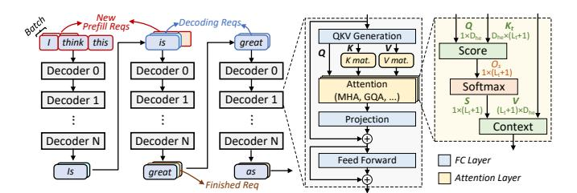
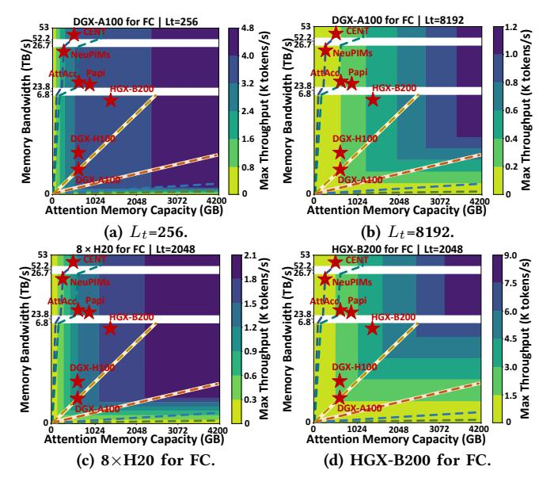

# I. IntRoduction

*"A plant's growth is limited by the nutrient in shortest supply, regardless of how abundant other nutrients may be."*

—*Liebig's Law* [[75\]](#page-16-0), Justus von Liebig (1803-1873).

The demand for Large Language Models (LLMs) to process and generate longer sequences is rapidly increasing, driven by applications like long reasoning and complex code generation [\[16\]](#page-13-0),[[21](#page-13-1)], [\[29\]](#page-14-0),[[65](#page-15-0)], [\[81\]](#page-16-1),[[82](#page-16-2)]. In these longcontext scenarios, the decoding process becomes a significant performance bottleneck. Moreover, the increasingly longer KV cache imposes growing memory capacity and bandwidth demands on the inference system.

To tackle this memory challenge, Attention-FC Disaggregation (AFD) has emerged as a promising solution[[27\]](#page-14-1), [\[28](#page-14-2)], [[30\]](#page-14-3), [\[61\]](#page-15-1), [\[71\]](#page-16-3), [\[72\]](#page-16-4), [\[83\]](#page-16-5). AFD systems partition the LLM inference workload: the memory-intensive Attention operations and KV cache are offloaded to a specialized memoryrich device (hereafter referred to as the *"accelerator"*), while the compute-intensive Fully-Connected (FC) operations remain on the GPU or NPU. For example, leveraging HBMbased Processing-in-Memory (HBM-PIM) can dramatically

∗Co-first author.

reduce the latency of Attention[[27\]](#page-14-1), [\[28\]](#page-14-2), [\[61](#page-15-1)] with significantly increased bandwidth. In conclusion, AFD systems show the potential for higher throughput.

However, the promise of AFD architecture is not always straightforward to realize. Our investigation reveals a critical yet counter-intuitive phenomenon: **simply enhancing the accelerator does not always guarantee better system performance.** In an evaluation on GPT-175B with OpenR1 [\[5\]](#page-13-2), we found that equipping DGX-A100's HBMs with PIM from 1*×* to 16*×* higher bandwidth only leads to <1% throughput improvement. This puzzling outcome cannot be explained by existing performance models, such as the classic roofline model[[76](#page-16-6)], which analyzes devices in isolation and fails to capture the complex interplay between disaggregated components in an AFD system.

To address this, we design the **Disaggregated Roofline Model (DRM)**(§[III\)](#page-2-0), the first general performance model to analyze how AFD systems perform in various scenarios. DRM holistically characterizes the performance of both the accelerator and the GPU, crucially modeling their interdependencies. Using DRM, we conclude a principle guiding the design for AFD systems: the system's throughput is limited by the scarcest resource, be it the accelerator's memory bandwidth or capacity. Crucially, improvements to any non-bottleneck resource will result in diminishing or even negligible returns. It explains the phenomenon described in the previous paragraph, and motivates the design of a new accelerator that achieves a more balanced tradeoff among capacity, bandwidth, and scalability.

In this paper, we show that PIM integrated with *DIMM*, i.e., equipping host memory modules with bank-level processing units, constitutes a case of a new accelerator that strikes this balance. Therefore, we propose AFD systems that leverage *DIMM-PIM*. Compared to prior HBM/GDDR-PIM solutions[[22](#page-14-4)],[[27\]](#page-14-1), [\[28\]](#page-14-2), [\[61](#page-15-1)], an AFD system with DIMM-PIM gains three key advantages. First, it directly alleviates the capacity bottleneck of HBM-PIM while providing significantly higher bandwidth than standard host memory, enabling higher overall throughput. Second, it inherits the superior scalability and configurability of the standard DIMM interface, making the system adaptable and future-proof for diverse memory demands. Third, as analyzed in [§III-C,](#page-4-0) it offers higher economic efficiency, which could be cheaper than HBM/GDDR-PIM and suffer less memory wastage.

However, effectively leveraging DIMM-PIM in AFD systems is non-trivial. A naive integration of DIMM-PIM introduces additional synchronization overheads both within the PIM hardware and across the inference system, including transfer, layout, and progress synchronization, which can severely stall inference. Specifically:

First, compared with prior HBM-PIM/GDDR-PIM architectures[[22](#page-14-4)],[[27\]](#page-14-1), [\[28\]](#page-14-2),[[61](#page-15-1)], the DIMM-PIM architecture features *multiple distributed, cooperating DRAM chips*, which aggravate two synchronization overheads: (1) *Data synchronization:* attention computation distributed across multiple DRAM chips necessitates data synchronization via cross-chip transfers, e.g., accumulating partial outputs across chips for "softmax". (2) *Layout synchronization:* the DIMM-based data storage layout may not match the layout required by PIM computation: for instance, a single element may be striped across several chips, while PIM computation requires each element resides in a single chip. Aligning the layout thus becomes a prerequisite for attention execution. These overheads introduce substantial stalls in PIM execution, preventing DIMM-PIM from achieving its theoretical performance.

Second, the disaggregation of the inference process between the GPU and DIMM-PIM also introduces two types of synchronization overhead: (1) *Data synchronization:* PIM needs to fetch the Q,K,V tensors from the GPU and return the attention outputs to the GPU. These transfers via PCIe can stall PIM execution. (2) *Progress synchronization:* when parallel operations on the PIM and GPU have imbalanced completion times, the device that finishes earlier is forced to wait, creating idle "bubbles". This issue is compounded by the fact that the execution latencies of parallelizable tasks can vary, making workload alignment more challenging.

To address these challenges, we propose CHIME, the first AFD system that integrates a novel DIMM-PIM design as the accelerator, reducing synchronization overheads from the hardware internals to the overall system. First, we design CHIME-PIM ([§V\)](#page-5-0), a DIMM-PIM hardware for efficient attention computation. It eliminates the overheads of data and layout synchronization with two key techniques respectively: *bubble-free pipelining* and *hybrid-grained relayout*. Specifically, the pipeline overlaps data transfer with concurrent bank PU execution to hide the transfer overheads, which further enables bubble-free with specific head mapping according to a quantitative analysis. The hybrid-grained relayout performs data layout transformation at element level (coarse-grained) and bit level (fine-grained) to address the layout mismatch with minimum latency.

Second, we design CHIME-sys (§[VI](#page-7-0)), a DIMM-PIM integrated inference system that reduces the overheads of data and progress synchronization respectively with *rankset-granular communication computation overlapping* and *alignment-predicting scheduling*. Rankset-granular communication computation overlapping exploits the finest granularity of independent communication and computation, i.e., *the rankset*, which consists of one rank from each channel. This

Fig. 1. **LLM inference process.**

design achieves parallel communication and computation across ranksets to support asynchronous data transfer, effectively hiding the communication overhead between the GPU and CHIME-PIM with computation. Alignment-predicting scheduling selects requests to form sub-batches with the ability of modeling the performance of operations on both devices, selecting requests accordingly to form sub-batches whose predicted latencies on the two devices are aligned. This maximizes the parallel execution on the two devices with minimum idle bubbles.

Comprehensive evaluations on three LLM models and three real-world traces [\[2](#page-13-3)], [\[5](#page-13-2)], [\[6](#page-13-4)], [\[11\]](#page-13-5) show that CHIME achieves up to 5.15*×* speedup over state-of-the-art HBM-PIM solutions[[28](#page-14-2)], [\[61](#page-15-1)] with significantly improved batch sizes.

## II. The Rise of AF-DisaggRegated Systems

## *A. LLM Inference Process*

Fig. [1](#page-1-0) illustrates the LLM inference process[[9](#page-13-6)], [\[19](#page-13-7)], [\[21](#page-13-1)], [[33\]](#page-14-5), which includes two stages, i.e., prefilling and decoding. The LLM model constitutes a sequence of layers, each comprising two major kinds of operations: (1) attention operations[[73](#page-16-7)] and (2) fully-connected (FC) operations, which encompass QKV Gen, projection, Feed-forward Network, etc. MHA and GQA are leading attention operators, with MHA computing each head independently and GQA grouping query heads for parallel processing. The computations of attention consist of independent heads, each following score (*Q × Kt*), softmax, and context computations (*S × V* ).

## *B. Attention-FC Disaggregated Inference System*

Attention and FC operations typically have different characteristics. Specifically, benefiting from batching[[8](#page-13-8)], [\[41](#page-15-2)], [[78\]](#page-16-8), FC operations are compute-intensive and demand compute resources for acceleration. On the contrary, decoding attention is typically bandwidth-intensive [\[61\]](#page-15-1) and does not benefit from batching, since the KV cache is distinct and specific for each request. The latency of attention is primarily determined by memory bandwidth for loading the KV cache. Considering the different characteristics of the two operations, some current works, i.e., Attention-FC disaggregated inference systems ("AFD systems" in short), disaggregate the attention and FC operations on different hardware platforms. Specifically, they batch FC operations on the compute-rich GPU/NPU, while offloading the KV cache and the decoding attention to a platform (called *accelerators*) better suited for its memory-intensive nature.

Fig. 2. CHIME's Disaggregated Roofline Model and case studies. "DIMM-PIM" denotes CHIME's proposal, leveraging DIMM-based host memory with bank-level PUs as the accelerator. "Throughput" denotes tokens per second.

To improve the overall utilization, current AFD systems typically apply *sub-batch scheduling* [28], [30], [83], making two (or even more) interleaved sub-batches to run in parallel across the two devices, as shown in Fig. 2-a. During inference, the execution of an individual batch cannot be parallelized on two devices, e.g., GPU has to wait for the completion of attention before starting FC. Sub-batch scheduling enables attention and FC of different batches to run concurrently on the two devices, which could improve the throughput and resource utilization of AFD systems.

#### C. Processing-In-Memory (PIM)

PIM is a promising solution to offer high aggregated bandwidth by integrating processing units (PUs) in memory devices, such as HBM [26], [38], [39], [46], [49], GDDR [36], [42], [43], [47], [48], and DIMM [18], [34], [35], [44]. For example, with two DIMMs (e.g., two ranks of 16 banks per DIMM) in one channel, placing PUs near ranks (**rank PU**) can achieve about  $4\times$  the bandwidth of host CPU, while integrating PUs near banks (**bank PU**) can improve bandwidth by more than  $30\times$ . In this case, some state-of-theart AFD systems are built upon PIM devices, such as HBM-PIM [27], [28], [61] or GDDR-PIM [22], delivering substantial performance gains over GPUs.

#### III. CHARACTERIZING AFD SYSTEMS WITH DRM

In this section, we first introduce **Disaggregated Roofline Model (DRM)**, a unique analytical model specifically designed for AFD systems, characterizing the performance across diverse scenarios. Based on the model, we analyze the memory bottlenecks for current AFD systems whose attention is offloaded to various memory-enhanced devices, including HBM-PIM, which boosts bandwidth, and CPUs

(with host memory), which expand capacity. According to the analysis, we conclude how the "Liebig's Law" manifests for AFD systems, which informs the design of accelerators with effective memory enhancement to achieve high throughput.

## A. DRM Modeling and Bottleneck Analysis

Characterizing the throughput of AFD systems requires comprehensively considering two factors: the throughput on the GPU side for executing FC operations, and the throughput on the accelerator side for executing attention operations. We first identify that when the throughputs on the two devices are not equal, the throughput of the inference system is only affected by the device that becomes the bottleneck. For example in the right of Fig. 2-a, the bottleneck is the GPU, and the accelerator suffers idle bubbles consequently. In this case, increasing the throughput on the accelerator side will only result in more idle bubbles, having no effect on improving the overall throughput. The left of Fig. 2-a shows an opposite example. In conclusion:

**Implication I** The overall inference throughput of AFD systems is determined by the lower throughputs of the two devices that separately execute the FC and attention.

Construction of DRM. Fig. 2-b presents a conceptual illustration of the DRM, which uniformly characterizes the performance of two disaggregated devices by modeling the relationship between batch size and token throughput (tokens per second). Token throughput is derived from two key metrics: (1) floating point operations per second, which is dictated by the batch-size-dependent arithmetic intensity based on traditional roofline model. (2) floating point operations, which scales with the batch size. Line-FC shows the GPU token throughput for executing the FC, which increases with the growth of batch size until the GPU is fully utilized, i.e., when the batch size reaches  $B_{\text{target}}$ , the GPU achieves peak throughput  $T_{\text{max\_gpu}}$ . Line-ATTN-1, 2, 3 show the token throughputs of different accelerators for executing the attention respectively. Since the arithmetic intensity of attention remains constant and low, these throughputs are typically positively correlated with accelerator memory bandwidth, regardless of batch size. Moreover, The performance curves in Fig. 2-b can be not only theoretical, but also profiled.

Bandwidth constraints. According to Implication I, the throughput of an AFD system is determined by the lower value between the throughput curves of the GPU and the accelerator. There can be two types of situations: First, the throughput curves of the GPU and the accelerator intersect, e.g., when the accelerator is the CPU. The GPU throughput may initially be lower than that of the CPU when the batch size is very low, and the throughput of the AFD system is determined by Line-FC. As the batch size increases, the GPU throughput quickly rises to  $T_{\rm bw\_cpu}$ , after which the throughput of the AFD system is determined by Line-ATTN-3, which is constrained by the CPU memory bandwidth. Second, if the throughput curves of the GPU and the accelerator do

not intersect, the throughput of the AFD system is always determined by the lower curve. E.g., if the accelerator is HBM-PIM in Fig. [2-](#page-2-1)b, the throughput is always limited by the GPU side (Line-FC).

**Implication II** *The bandwidth of the accelerator limits the throughput of AFD systems when the attention becomes the bottleneck.*

*Capacity constraint.* Another factor is the memory capacity on the accelerator side to store the KV cache. Insufficient memory capacity restricts the maximum number of requests that can be accommodated, preventing the GPU side from fully utilizing GPU resources. In Fig. [2-](#page-2-1)b, Line-Cap-1, 2, 3 show the maximum batch sizes that can be accommodated by various accelerators, i.e., *B*hp, *B*dp, *B*cpu for HBM-PIM, DIMM-PIM and CPU respectively. The GPU throughput for executing the FC is thus limited by these maximum batch sizes. For example, when the accelerator is the HBM-PIM, the maximum GPU throughput on Line-FC is limited below *T*cap\_hp, since the batch size of this AFD system is at most *B*hp. When the bottleneck is on the GPU side, e.g., HBM-PIM as the accelerator, the AFD system's throughput is constrained by the limited batch size.

**Implication III** *The capacity that stores the KV cache limits the overall throughput of AFD systems when the FC becomes the bottleneck.*

*Dynamic workloads and shifting rooflines.* As DRM is an analytical model for design-time architectural analysis, its purpose is not to predict the precise latency of a given request [\[32\]](#page-14-10),[[70\]](#page-16-9). Nevertheless, DRM could also illustrate how the performance rooflines shift in response to varying runtime workload characteristics. For example, with longer context, the maximum batch size that can be accommodated within the same capacity and the throughput of processing a larger KV cache with the same bandwidth decreases, so it causes the capacity lines (Line-Cap-1, 2, 3 in Fig. [2-](#page-2-1)b) to shift leftward and the Line-ATTN-1, 2, 3 to shift downward, while for the GPU, Line-FC remains almost unchanged. Consequently, it illustrates how longer contexts exacerbate memory bottlenecks along both the bandwidth and capacity.

*Characterizing communication overhead.* The methodology of DRM is also capable of characterizing the communication overhead between GPUs and attention accelerators, considering it as a part of attention overhead. Within the DRM, the decrease of communication bandwidth (e.g., utilizing PCIe 3.0 instead of PCIe 4.0) results in a downward shift of the attention performance curve. According to our detailed analysis in [§VI-A,](#page-7-1) the communication overhead in AFD systems is constant, and is optimized by our design.

*The "Liebig's Law" for AFD systems.* Considering Implication II and III, for a given GPU configuration that executes FC, the accelerator's memory bandwidth and capacity respectively limit the throughput when the attention or FC becomes the bottleneck. Further, according to Implication I, this indicates that the overall throughput is determined by the memory capacity or bandwidth whose throughput limit is lower, which we refer to as the weaker point of memory. We conclude that the accelerator's memory impact on overall throughput follows Liebig's Law, that is:

**Liebig's Law:** *The throughput of an AFD system is constrained by the weaker point in terms of either memory capacity or bandwidth.*

Although Liebig's Law is a general principle applicable to any system, the analysis methodology with DRM first reveals how the Law manifests for AFD systems.

*Case study.* Fig. [2-](#page-2-1)c extracts concrete examples from Fig. [2](#page-2-1) b as case studies. The weaker point of the "CPU" is the limited bandwidth of the host memory, so the throughput of the CPU AFD system is constrained by *T*bw\_cpu even if it has sufficient memory capacity to accommodate larger batch sizes. The weaker point of the "HBM-PIM" is the limited HBM capacity, so the throughput is constrained by *T*cap\_hp even if it can execute attention extremely quickly.

*Quantitative analysis on Liebig's Law.* To illustrate Liebig's Law quantitatively, we extend the illustrative figure of Fig. [2](#page-2-1) to Fig. [3.](#page-4-1) Fig. [3](#page-4-1) quantifies the throughput limitation assuming 8*×*A100 of DGX-A100 are used for computing FC, while using accelerators for attention with various memory configurations. It clearly demonstrates Liebig's Law, i.e., better throughput can only be achieved when both capacity and bandwidth are scaled simultaneously. If only one of them is scaled, for example, fixing the capacity and scaling the bandwidth, the throughput will only improve with increasing bandwidth until the bandwidth reaches a certain point. Beyond that point, higher bandwidth yields no further improvement, as capacity becomes the bottleneck.

## *B. Limitations on Prior Works*

Existing works have made considerable efforts to enhance memory for improving inference throughput. However, they mainly focus on addressing one dimension of the memory bottleneck, either capacity or bandwidth. Their neglect of Liebig's Law renders the resulting performance gains potentially inefficient or insufficient. To illustrate, we plot the hardware configurations of various hardware types under scaling scenarios in Fig. [3](#page-4-1): including HBM2e, GDDR, two types of DDR4 memory and their PIM variants. Some listed systems[[22](#page-14-4)] in Fig. [3](#page-4-1) are not specifically designed for AFD, and we mainly consider their hardware for executing attention. We can conclude that prior works suffer from the "Liebig's Law" in the following aspects:

*Insufficient memory enhancement.* First, without adequate scaling, these memory enhancement techniques could be insufficient to prevent memory from becoming a throughput bottleneck. This can be illustrated by examining the hardware parameters claimed in their respective papers in

Fig. 3. Contour plot of the throughput with memory bottlenecks. " $L_t$ =2048" above denotes that each request has a context length of 2048 tokens. Memory configurations of "PAPI", "NeuPIMs", "AttAcc" and "CENT" are derived from the papers [22], [27], [28], [61]. "DGX-A100", "DGX-H100" and "HGX-B200" [1], [57], [58] represents using GPUs for attention. DIMM-S, DIMM-L denote two different types of DDR4 memory. Every point represents the total memory capacity and bandwidth under the corresponding number of memory chips, for example, the point "64×" on the "DIMM-L" line (green line) represents the memory capacity and bandwidth corresponding to 64× DIMM-L memory chips. We assume that the PIM performance of each memory device can reach the ideal case, i.e., the equivalent memory bandwidth is scaled by  $16\times$ . The performance is simulated with AttAcc [61] simulator with GPT-175B model.

conjunction with Fig. 3. Specifically, works based on HBM-PIM could suffer from insufficient memory capacity [27], [28], [61], while others suffer from insufficient memory bandwidth of DIMMs [30], [52].

Inefficient memory enhancement. Further, current works suffer from excessive memory resources. For example, although current GDDR/HBM-PIM based methods [22], [27], [28], [61] are limited by capacity, their bandwidth could be orders of magnitude larger than the requirement, which provides almost no benefit to throughput. Moreover, even if scaling them could potentially achieve high throughput, such scaling could simultaneously lead to substantial bandwidth waste, as illustrated in Fig. 3.

#### C. Proposal of Choosing DIMM for PIM Intergration

Based on our analysis, we find that integrating PIM with DIMMs (i.e., DIMM-PIM) is a promising accelerator for attention. Specifically, DIMM-PIM augments DIMM-based host memory with bank-level PIM units, combining the strengths of PIM and DIMMs. Therefore, we propose AFD systems that integrate DIMM-PIM, which offer the following benefits:

Better performance with more balanced memory configuration. Typically, DIMM-PIM can alleviate the capacity bottleneck of HBM-PIM and the bandwidth bottleneck of CPU offloading. As illustrated in Fig. 2-b, c, this means that

Fig. 4. Contour plot of the throughput for four scenarios. This figure shares the legend with Fig. 3. Compared to the scenario in Fig. 3, (a) and (b) vary the context lengths, while (c) and (d) adjust the number of GPUs used for FC computation.

DIMM-PIM potentially improves the overall throughput with a more balanced memory configuration. As shown in Fig. 3, since the DGX-A100 is equipped with 2TB of DIMM memory (DDR4) and 640GB of HBM memory, equipping the DIMMs with PIMs already significantly outperforms equipping the HBMs with PIMs.

Scalable and configurable. DIMM-PIM offers scalability via the standard DIMM form factor, enabling plug-and-play capacity/bandwidth scaling on compatible platforms, and can be further scaled using interconnects such as CXL. This allows DIMM-PIM to not only achieve better performance but also potentially adapt to a broader range of scenarios.

**Economic efficiency.** Beyond performance considerations, DIMM-PIM also offers a significant cost advantage over GDDR- and HBM-based alternatives. First, the per-GB cost of HBM2e can be over  $6 \times$  higher than DDR4 [3], [4], [7], which represents a substantial difference, regardless of whether PIM is integrated. Second, Fig. 3 shows that, the more balanced performance of DIMM-PIM avoids the significant resource over-provisioning inherent in HBM/GDDR-PIM solutions, enabling more cost-effective performance scaling.

# I. IntRoduction

*"A plant's growth is limited by the nutrient in shortest supply, regardless of how abundant other nutrients may be."*

—*Liebig's Law* [[75\]](#page-16-0), Justus von Liebig (1803-1873).

The demand for Large Language Models (LLMs) to process and generate longer sequences is rapidly increasing, driven by applications like long reasoning and complex code generation [\[16\]](#page-13-0),[[21](#page-13-1)], [\[29\]](#page-14-0),[[65](#page-15-0)], [\[81\]](#page-16-1),[[82](#page-16-2)]. In these longcontext scenarios, the decoding process becomes a significant performance bottleneck. Moreover, the increasingly longer KV cache imposes growing memory capacity and bandwidth demands on the inference system.

To tackle this memory challenge, Attention-FC Disaggregation (AFD) has emerged as a promising solution[[27\]](#page-14-1), [\[28](#page-14-2)], [[30\]](#page-14-3), [\[61\]](#page-15-1), [\[71\]](#page-16-3), [\[72\]](#page-16-4), [\[83\]](#page-16-5). AFD systems partition the LLM inference workload: the memory-intensive Attention operations and KV cache are offloaded to a specialized memoryrich device (hereafter referred to as the *"accelerator"*), while the compute-intensive Fully-Connected (FC) operations remain on the GPU or NPU. For example, leveraging HBMbased Processing-in-Memory (HBM-PIM) can dramatically

∗Co-first author.

reduce the latency of Attention[[27\]](#page-14-1), [\[28\]](#page-14-2), [\[61](#page-15-1)] with significantly increased bandwidth. In conclusion, AFD systems show the potential for higher throughput.

However, the promise of AFD architecture is not always straightforward to realize. Our investigation reveals a critical yet counter-intuitive phenomenon: **simply enhancing the accelerator does not always guarantee better system performance.** In an evaluation on GPT-175B with OpenR1 [\[5\]](#page-13-2), we found that equipping DGX-A100's HBMs with PIM from 1*×* to 16*×* higher bandwidth only leads to <1% throughput improvement. This puzzling outcome cannot be explained by existing performance models, such as the classic roofline model[[76](#page-16-6)], which analyzes devices in isolation and fails to capture the complex interplay between disaggregated components in an AFD system.

To address this, we design the **Disaggregated Roofline Model (DRM)**(§[III\)](#page-2-0), the first general performance model to analyze how AFD systems perform in various scenarios. DRM holistically characterizes the performance of both the accelerator and the GPU, crucially modeling their interdependencies. Using DRM, we conclude a principle guiding the design for AFD systems: the system's throughput is limited by the scarcest resource, be it the accelerator's memory bandwidth or capacity. Crucially, improvements to any non-bottleneck resource will result in diminishing or even negligible returns. It explains the phenomenon described in the previous paragraph, and motivates the design of a new accelerator that achieves a more balanced tradeoff among capacity, bandwidth, and scalability.

In this paper, we show that PIM integrated with *DIMM*, i.e., equipping host memory modules with bank-level processing units, constitutes a case of a new accelerator that strikes this balance. Therefore, we propose AFD systems that leverage *DIMM-PIM*. Compared to prior HBM/GDDR-PIM solutions[[22](#page-14-4)],[[27\]](#page-14-1), [\[28\]](#page-14-2), [\[61](#page-15-1)], an AFD system with DIMM-PIM gains three key advantages. First, it directly alleviates the capacity bottleneck of HBM-PIM while providing significantly higher bandwidth than standard host memory, enabling higher overall throughput. Second, it inherits the superior scalability and configurability of the standard DIMM interface, making the system adaptable and future-proof for diverse memory demands. Third, as analyzed in [§III-C,](#page-4-0) it offers higher economic efficiency, which could be cheaper than HBM/GDDR-PIM and suffer less memory wastage.

However, effectively leveraging DIMM-PIM in AFD systems is non-trivial. A naive integration of DIMM-PIM introduces additional synchronization overheads both within the PIM hardware and across the inference system, including transfer, layout, and progress synchronization, which can severely stall inference. Specifically:

First, compared with prior HBM-PIM/GDDR-PIM architectures[[22](#page-14-4)],[[27\]](#page-14-1), [\[28\]](#page-14-2),[[61](#page-15-1)], the DIMM-PIM architecture features *multiple distributed, cooperating DRAM chips*, which aggravate two synchronization overheads: (1) *Data synchronization:* attention computation distributed across multiple DRAM chips necessitates data synchronization via cross-chip transfers, e.g., accumulating partial outputs across chips for "softmax". (2) *Layout synchronization:* the DIMM-based data storage layout may not match the layout required by PIM computation: for instance, a single element may be striped across several chips, while PIM computation requires each element resides in a single chip. Aligning the layout thus becomes a prerequisite for attention execution. These overheads introduce substantial stalls in PIM execution, preventing DIMM-PIM from achieving its theoretical performance.

Second, the disaggregation of the inference process between the GPU and DIMM-PIM also introduces two types of synchronization overhead: (1) *Data synchronization:* PIM needs to fetch the Q,K,V tensors from the GPU and return the attention outputs to the GPU. These transfers via PCIe can stall PIM execution. (2) *Progress synchronization:* when parallel operations on the PIM and GPU have imbalanced completion times, the device that finishes earlier is forced to wait, creating idle "bubbles". This issue is compounded by the fact that the execution latencies of parallelizable tasks can vary, making workload alignment more challenging.

To address these challenges, we propose CHIME, the first AFD system that integrates a novel DIMM-PIM design as the accelerator, reducing synchronization overheads from the hardware internals to the overall system. First, we design CHIME-PIM ([§V\)](#page-5-0), a DIMM-PIM hardware for efficient attention computation. It eliminates the overheads of data and layout synchronization with two key techniques respectively: *bubble-free pipelining* and *hybrid-grained relayout*. Specifically, the pipeline overlaps data transfer with concurrent bank PU execution to hide the transfer overheads, which further enables bubble-free with specific head mapping according to a quantitative analysis. The hybrid-grained relayout performs data layout transformation at element level (coarse-grained) and bit level (fine-grained) to address the layout mismatch with minimum latency.

Second, we design CHIME-sys (§[VI](#page-7-0)), a DIMM-PIM integrated inference system that reduces the overheads of data and progress synchronization respectively with *rankset-granular communication computation overlapping* and *alignment-predicting scheduling*. Rankset-granular communication computation overlapping exploits the finest granularity of independent communication and computation, i.e., *the rankset*, which consists of one rank from each channel. This

Fig. 1. **LLM inference process.**

design achieves parallel communication and computation across ranksets to support asynchronous data transfer, effectively hiding the communication overhead between the GPU and CHIME-PIM with computation. Alignment-predicting scheduling selects requests to form sub-batches with the ability of modeling the performance of operations on both devices, selecting requests accordingly to form sub-batches whose predicted latencies on the two devices are aligned. This maximizes the parallel execution on the two devices with minimum idle bubbles.

Comprehensive evaluations on three LLM models and three real-world traces [\[2](#page-13-3)], [\[5](#page-13-2)], [\[6](#page-13-4)], [\[11\]](#page-13-5) show that CHIME achieves up to 5.15*×* speedup over state-of-the-art HBM-PIM solutions[[28](#page-14-2)], [\[61](#page-15-1)] with significantly improved batch sizes.

## II. The Rise of AF-DisaggRegated Systems

## *A. LLM Inference Process*

Fig. [1](#page-1-0) illustrates the LLM inference process[[9](#page-13-6)], [\[19](#page-13-7)], [\[21](#page-13-1)], [[33\]](#page-14-5), which includes two stages, i.e., prefilling and decoding. The LLM model constitutes a sequence of layers, each comprising two major kinds of operations: (1) attention operations[[73](#page-16-7)] and (2) fully-connected (FC) operations, which encompass QKV Gen, projection, Feed-forward Network, etc. MHA and GQA are leading attention operators, with MHA computing each head independently and GQA grouping query heads for parallel processing. The computations of attention consist of independent heads, each following score (*Q × Kt*), softmax, and context computations (*S × V* ).

## *B. Attention-FC Disaggregated Inference System*

Attention and FC operations typically have different characteristics. Specifically, benefiting from batching[[8](#page-13-8)], [\[41](#page-15-2)], [[78\]](#page-16-8), FC operations are compute-intensive and demand compute resources for acceleration. On the contrary, decoding attention is typically bandwidth-intensive [\[61\]](#page-15-1) and does not benefit from batching, since the KV cache is distinct and specific for each request. The latency of attention is primarily determined by memory bandwidth for loading the KV cache. Considering the different characteristics of the two operations, some current works, i.e., Attention-FC disaggregated inference systems ("AFD systems" in short), disaggregate the attention and FC operations on different hardware platforms. Specifically, they batch FC operations on the compute-rich GPU/NPU, while offloading the KV cache and the decoding attention to a platform (called *accelerators*) better suited for its memory-intensive nature.

Fig. 2. CHIME's Disaggregated Roofline Model and case studies. "DIMM-PIM" denotes CHIME's proposal, leveraging DIMM-based host memory with bank-level PUs as the accelerator. "Throughput" denotes tokens per second.

To improve the overall utilization, current AFD systems typically apply *sub-batch scheduling* [28], [30], [83], making two (or even more) interleaved sub-batches to run in parallel across the two devices, as shown in Fig. 2-a. During inference, the execution of an individual batch cannot be parallelized on two devices, e.g., GPU has to wait for the completion of attention before starting FC. Sub-batch scheduling enables attention and FC of different batches to run concurrently on the two devices, which could improve the throughput and resource utilization of AFD systems.

#### C. Processing-In-Memory (PIM)

PIM is a promising solution to offer high aggregated bandwidth by integrating processing units (PUs) in memory devices, such as HBM [26], [38], [39], [46], [49], GDDR [36], [42], [43], [47], [48], and DIMM [18], [34], [35], [44]. For example, with two DIMMs (e.g., two ranks of 16 banks per DIMM) in one channel, placing PUs near ranks (**rank PU**) can achieve about  $4\times$  the bandwidth of host CPU, while integrating PUs near banks (**bank PU**) can improve bandwidth by more than  $30\times$ . In this case, some state-of-theart AFD systems are built upon PIM devices, such as HBM-PIM [27], [28], [61] or GDDR-PIM [22], delivering substantial performance gains over GPUs.

#### III. CHARACTERIZING AFD SYSTEMS WITH DRM

In this section, we first introduce **Disaggregated Roofline Model (DRM)**, a unique analytical model specifically designed for AFD systems, characterizing the performance across diverse scenarios. Based on the model, we analyze the memory bottlenecks for current AFD systems whose attention is offloaded to various memory-enhanced devices, including HBM-PIM, which boosts bandwidth, and CPUs

(with host memory), which expand capacity. According to the analysis, we conclude how the "Liebig's Law" manifests for AFD systems, which informs the design of accelerators with effective memory enhancement to achieve high throughput.

## A. DRM Modeling and Bottleneck Analysis

Characterizing the throughput of AFD systems requires comprehensively considering two factors: the throughput on the GPU side for executing FC operations, and the throughput on the accelerator side for executing attention operations. We first identify that when the throughputs on the two devices are not equal, the throughput of the inference system is only affected by the device that becomes the bottleneck. For example in the right of Fig. 2-a, the bottleneck is the GPU, and the accelerator suffers idle bubbles consequently. In this case, increasing the throughput on the accelerator side will only result in more idle bubbles, having no effect on improving the overall throughput. The left of Fig. 2-a shows an opposite example. In conclusion:

**Implication I** The overall inference throughput of AFD systems is determined by the lower throughputs of the two devices that separately execute the FC and attention.

Construction of DRM. Fig. 2-b presents a conceptual illustration of the DRM, which uniformly characterizes the performance of two disaggregated devices by modeling the relationship between batch size and token throughput (tokens per second). Token throughput is derived from two key metrics: (1) floating point operations per second, which is dictated by the batch-size-dependent arithmetic intensity based on traditional roofline model. (2) floating point operations, which scales with the batch size. Line-FC shows the GPU token throughput for executing the FC, which increases with the growth of batch size until the GPU is fully utilized, i.e., when the batch size reaches  $B_{\text{target}}$ , the GPU achieves peak throughput  $T_{\text{max\_gpu}}$ . Line-ATTN-1, 2, 3 show the token throughputs of different accelerators for executing the attention respectively. Since the arithmetic intensity of attention remains constant and low, these throughputs are typically positively correlated with accelerator memory bandwidth, regardless of batch size. Moreover, The performance curves in Fig. 2-b can be not only theoretical, but also profiled.

Bandwidth constraints. According to Implication I, the throughput of an AFD system is determined by the lower value between the throughput curves of the GPU and the accelerator. There can be two types of situations: First, the throughput curves of the GPU and the accelerator intersect, e.g., when the accelerator is the CPU. The GPU throughput may initially be lower than that of the CPU when the batch size is very low, and the throughput of the AFD system is determined by Line-FC. As the batch size increases, the GPU throughput quickly rises to  $T_{\rm bw\_cpu}$ , after which the throughput of the AFD system is determined by Line-ATTN-3, which is constrained by the CPU memory bandwidth. Second, if the throughput curves of the GPU and the accelerator do

not intersect, the throughput of the AFD system is always determined by the lower curve. E.g., if the accelerator is HBM-PIM in Fig. [2-](#page-2-1)b, the throughput is always limited by the GPU side (Line-FC).

**Implication II** *The bandwidth of the accelerator limits the throughput of AFD systems when the attention becomes the bottleneck.*

*Capacity constraint.* Another factor is the memory capacity on the accelerator side to store the KV cache. Insufficient memory capacity restricts the maximum number of requests that can be accommodated, preventing the GPU side from fully utilizing GPU resources. In Fig. [2-](#page-2-1)b, Line-Cap-1, 2, 3 show the maximum batch sizes that can be accommodated by various accelerators, i.e., *B*hp, *B*dp, *B*cpu for HBM-PIM, DIMM-PIM and CPU respectively. The GPU throughput for executing the FC is thus limited by these maximum batch sizes. For example, when the accelerator is the HBM-PIM, the maximum GPU throughput on Line-FC is limited below *T*cap\_hp, since the batch size of this AFD system is at most *B*hp. When the bottleneck is on the GPU side, e.g., HBM-PIM as the accelerator, the AFD system's throughput is constrained by the limited batch size.

**Implication III** *The capacity that stores the KV cache limits the overall throughput of AFD systems when the FC becomes the bottleneck.*

*Dynamic workloads and shifting rooflines.* As DRM is an analytical model for design-time architectural analysis, its purpose is not to predict the precise latency of a given request [\[32\]](#page-14-10),[[70\]](#page-16-9). Nevertheless, DRM could also illustrate how the performance rooflines shift in response to varying runtime workload characteristics. For example, with longer context, the maximum batch size that can be accommodated within the same capacity and the throughput of processing a larger KV cache with the same bandwidth decreases, so it causes the capacity lines (Line-Cap-1, 2, 3 in Fig. [2-](#page-2-1)b) to shift leftward and the Line-ATTN-1, 2, 3 to shift downward, while for the GPU, Line-FC remains almost unchanged. Consequently, it illustrates how longer contexts exacerbate memory bottlenecks along both the bandwidth and capacity.

*Characterizing communication overhead.* The methodology of DRM is also capable of characterizing the communication overhead between GPUs and attention accelerators, considering it as a part of attention overhead. Within the DRM, the decrease of communication bandwidth (e.g., utilizing PCIe 3.0 instead of PCIe 4.0) results in a downward shift of the attention performance curve. According to our detailed analysis in [§VI-A,](#page-7-1) the communication overhead in AFD systems is constant, and is optimized by our design.

*The "Liebig's Law" for AFD systems.* Considering Implication II and III, for a given GPU configuration that executes FC, the accelerator's memory bandwidth and capacity respectively limit the throughput when the attention or FC becomes the bottleneck. Further, according to Implication I, this indicates that the overall throughput is determined by the memory capacity or bandwidth whose throughput limit is lower, which we refer to as the weaker point of memory. We conclude that the accelerator's memory impact on overall throughput follows Liebig's Law, that is:

**Liebig's Law:** *The throughput of an AFD system is constrained by the weaker point in terms of either memory capacity or bandwidth.*

Although Liebig's Law is a general principle applicable to any system, the analysis methodology with DRM first reveals how the Law manifests for AFD systems.

*Case study.* Fig. [2-](#page-2-1)c extracts concrete examples from Fig. [2](#page-2-1) b as case studies. The weaker point of the "CPU" is the limited bandwidth of the host memory, so the throughput of the CPU AFD system is constrained by *T*bw\_cpu even if it has sufficient memory capacity to accommodate larger batch sizes. The weaker point of the "HBM-PIM" is the limited HBM capacity, so the throughput is constrained by *T*cap\_hp even if it can execute attention extremely quickly.

*Quantitative analysis on Liebig's Law.* To illustrate Liebig's Law quantitatively, we extend the illustrative figure of Fig. [2](#page-2-1) to Fig. [3.](#page-4-1) Fig. [3](#page-4-1) quantifies the throughput limitation assuming 8*×*A100 of DGX-A100 are used for computing FC, while using accelerators for attention with various memory configurations. It clearly demonstrates Liebig's Law, i.e., better throughput can only be achieved when both capacity and bandwidth are scaled simultaneously. If only one of them is scaled, for example, fixing the capacity and scaling the bandwidth, the throughput will only improve with increasing bandwidth until the bandwidth reaches a certain point. Beyond that point, higher bandwidth yields no further improvement, as capacity becomes the bottleneck.

## *B. Limitations on Prior Works*

Existing works have made considerable efforts to enhance memory for improving inference throughput. However, they mainly focus on addressing one dimension of the memory bottleneck, either capacity or bandwidth. Their neglect of Liebig's Law renders the resulting performance gains potentially inefficient or insufficient. To illustrate, we plot the hardware configurations of various hardware types under scaling scenarios in Fig. [3](#page-4-1): including HBM2e, GDDR, two types of DDR4 memory and their PIM variants. Some listed systems[[22](#page-14-4)] in Fig. [3](#page-4-1) are not specifically designed for AFD, and we mainly consider their hardware for executing attention. We can conclude that prior works suffer from the "Liebig's Law" in the following aspects:

*Insufficient memory enhancement.* First, without adequate scaling, these memory enhancement techniques could be insufficient to prevent memory from becoming a throughput bottleneck. This can be illustrated by examining the hardware parameters claimed in their respective papers in

Fig. 3. Contour plot of the throughput with memory bottlenecks. " $L_t$ =2048" above denotes that each request has a context length of 2048 tokens. Memory configurations of "PAPI", "NeuPIMs", "AttAcc" and "CENT" are derived from the papers [22], [27], [28], [61]. "DGX-A100", "DGX-H100" and "HGX-B200" [1], [57], [58] represents using GPUs for attention. DIMM-S, DIMM-L denote two different types of DDR4 memory. Every point represents the total memory capacity and bandwidth under the corresponding number of memory chips, for example, the point "64×" on the "DIMM-L" line (green line) represents the memory capacity and bandwidth corresponding to 64× DIMM-L memory chips. We assume that the PIM performance of each memory device can reach the ideal case, i.e., the equivalent memory bandwidth is scaled by  $16\times$ . The performance is simulated with AttAcc [61] simulator with GPT-175B model.

conjunction with Fig. 3. Specifically, works based on HBM-PIM could suffer from insufficient memory capacity [27], [28], [61], while others suffer from insufficient memory bandwidth of DIMMs [30], [52].

Inefficient memory enhancement. Further, current works suffer from excessive memory resources. For example, although current GDDR/HBM-PIM based methods [22], [27], [28], [61] are limited by capacity, their bandwidth could be orders of magnitude larger than the requirement, which provides almost no benefit to throughput. Moreover, even if scaling them could potentially achieve high throughput, such scaling could simultaneously lead to substantial bandwidth waste, as illustrated in Fig. 3.

#### C. Proposal of Choosing DIMM for PIM Intergration

Based on our analysis, we find that integrating PIM with DIMMs (i.e., DIMM-PIM) is a promising accelerator for attention. Specifically, DIMM-PIM augments DIMM-based host memory with bank-level PIM units, combining the strengths of PIM and DIMMs. Therefore, we propose AFD systems that integrate DIMM-PIM, which offer the following benefits:

Better performance with more balanced memory configuration. Typically, DIMM-PIM can alleviate the capacity bottleneck of HBM-PIM and the bandwidth bottleneck of CPU offloading. As illustrated in Fig. 2-b, c, this means that

Fig. 4. Contour plot of the throughput for four scenarios. This figure shares the legend with Fig. 3. Compared to the scenario in Fig. 3, (a) and (b) vary the context lengths, while (c) and (d) adjust the number of GPUs used for FC computation.

DIMM-PIM potentially improves the overall throughput with a more balanced memory configuration. As shown in Fig. 3, since the DGX-A100 is equipped with 2TB of DIMM memory (DDR4) and 640GB of HBM memory, equipping the DIMMs with PIMs already significantly outperforms equipping the HBMs with PIMs.

Scalable and configurable. DIMM-PIM offers scalability via the standard DIMM form factor, enabling plug-and-play capacity/bandwidth scaling on compatible platforms, and can be further scaled using interconnects such as CXL. This allows DIMM-PIM to not only achieve better performance but also potentially adapt to a broader range of scenarios.

**Economic efficiency.** Beyond performance considerations, DIMM-PIM also offers a significant cost advantage over GDDR- and HBM-based alternatives. First, the per-GB cost of HBM2e can be over  $6 \times$  higher than DDR4 [3], [4], [7], which represents a substantial difference, regardless of whether PIM is integrated. Second, Fig. 3 shows that, the more balanced performance of DIMM-PIM avoids the significant resource over-provisioning inherent in HBM/GDDR-PIM solutions, enabling more cost-effective performance scaling.

