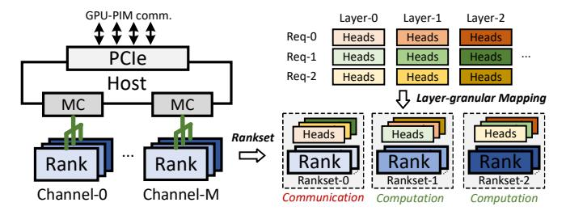
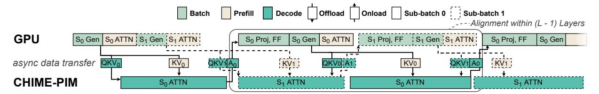

# IV. Overview of CHIME

#### A. Design Overview

To support the proposal of integrating DIMM-PIM, as shown in Fig. 6, we propose CHIME that consists of two parts: (1) CHIME-PIM, our specifically designed DIMM-PIM hardware for efficient attention execution; and (2) CHIME-sys, a scalable AFD system which coordinates the computation on GPU and CHIME-PIM and aims at maximizing the inference throughput.

*Inference workflow of CHIME.* CHIME-sys inherits the sub-batch scheduling technique [28], [30], selecting requests

Fig. 6. CHIME overview.

to form sub-batches for each iteration. Initially, for each sub-batch, QKV Generation of all requests is batched and executed on the GPU. Then, prefilling and decoding attention are processed concurrently on the GPU and CHIME-PIM respectively. CHIME aggregates attention outputs from all requests in the batch, and then performs batched execution of subsequent operations (projection, Feed-forward, etc). PCIe interconnects the GPU and CHIME-PIM.

Addressing the challenges of integrating DIMM-PIM. As outlined in §I, integrating DIMM-PIM introduces architectural disaggregation and, consequently, synchronization overheads: within a DIMM, distributed chips incur both datasynchronization and layout-synchronization costs, while the disaggregation between DIMM-PIM and the GPU adds the overhead of cross-device data synchronization and progress synchronization. To address the former, CHIME-PIM employs bubble-free pipelining (§V-A) and hybrid-grained re-layout (§V-B); to address the latter, CHIME-sys employs rankset-granular communication-computation overlapping (§VI-A) and alignment-predicting scheduling (§VI-B).

## V. ATTENTION ACCELERATION ON CHIME-PIM

This section describes CHIME-PIM, a novel DIMM-PIM hardware design for efficient attention computation.

Hardware components. As shown in Fig. 7-a, CHIME-PIM integrates co-operated processing units (PUs) across both bank and rank levels. The bank PUs are integrated near DRAM banks with DRAM process, fetching KV cache from banks and performing score and context computation, while a shared buffer is leveraged to broadcast input vectors to all bank PUs. The bank PUs in all DRAM chips perform multiplication-and-accumulation (MAC) concurrently and generate outputs to the result buffer. Softmax unit, adder unit, and re-layout unit are integrated on the buffer chip with logic process as a part of the rank PU, which can execute in an asynchronous manner with bank PUs.

The CHIME-PIM workflow avoids modifications to host CPU memory controllers, which works as follows: first, CPU offloads PIM requests to the rank PU via normal writes, which are further decoded to PIM commands. Then, a dedicated PIM controller issues PIM commands on standard DDR interface to DRAM chips to trigger corresponding operations.

Fig. 7. **CHIME-PIM design with bubble-free pipelining.**

PIM commands include the ones for metadata setup and data movement, and some key commands are listed as follows. PIM\_WR\_R writes necessary information to registers, such as configurations of computing paradigm (adder tree or accumulator), self-incrementing index mechanisms of buffers, and so on. PIM\_LD\_SB loads data from a certain bank to the shared buffer, while PIM\_WR\_SB writes data from rank PU to the shared buffer. PIM\_MAC executes MAC operations in all banks while reading necessary data from DRAM cells and shared buffer. PIM\_RD\_RB loads data from result buffers of all banks to rank PU.

## *A. Bubble-free pipelining*

To eliminate data-synchronization overhead in attention computation, the key is to leverage DIMM-PIM's unique architecture to design a pipelined attention execution that hides communication behind computation. Furthermore, through quantitative analysis and a tailored head-mapping method, we ensure that the communication cost is completely hidden.

*Orchestrating the pipeline with decoupled memory buses and kernel fusion.* We orchestrate a pipelined execution for attention kernels in PIM that aggressively overlaps computation and communication, grounded in two architectural observations. First, the internal memory buses (servicing bank PUs accessing banks) and external memory buses (handling rank PUs accessing bank PUs or shared buffer) can be decoupled[[13\]](#page-13-14), enabling simultaneous execution of compute kernels on bank PUs and data transfer from/to rank PU, as shown in Fig. [7-](#page-6-1)b. Second, inspired by FlashAttention's kernel fusion technique[[15\]](#page-13-15) (where attention is computed in chunked tiles), we orchestrate fine-grained kernel pipelining to maximize concurrency while constraining the intermediate head footprint on rank PUs.

Concretely, during the scoring phase, when each bank PU computes a token-specific output *Os* and stages it in its local result buffer, the rank PU immediately fetches it via otherwise-idle external buses. Our attention kernel operates at the granularity of chunked tiles, where each chunk consists of data generated in parallel by a single head across (possibly) multiple bank PUs. After accumulation in adder unit, the softmax unit applies per-chunk softmax operations. In this way, score and softmax computations are pipelined between bank PUs and rank PU in a chunk-based manner. Following the processing of all tokens, a final cross-chunk normalization pass produces the globally-correct softmax output *S*, which is also performed in a streaming, chunk-wise manner. It allows the computation of finalized *S* elements, the writeback communication of *S* to DRAM chips, and subsequent context computations to be pipelined.

*Enabling bubble-free with quantitative analysis and specific head mapping.* Due to the nature of DIMM that multiple co-operated DRAM chips form a rank, KV matrix (cache) and related computation would be distributed across these DRAM chips. It multiplies the amount of data transfer between buffer chip and DRAM chips, which we refer to as the cross-chip data transfer. The cross-chip transfer overhead, even if being overlapped with the execution of the bank PU, can still lead to bubbles in pipelining execution and become the bottleneck due to the limited bandwidth of rank PU. To address these challenges, we first quantize the cost of crosschip data transfer considering the configurations of LLM models, hardware parameters, and head mapping methods. Then, we enable bubble-free pipelining with specific head mapping methods. The analysis takes score computation of one head as an example, while context computation can follow the similar analysis.

The overheads for transferring score outputs *Os* can be denoted as *Tcomm*, following *Tcomm* = *Ncomm*/*Bcomm*, where *Ncomm* is the amount of cross-chip data transfer, and *Bcomm* is the related bandwidth. Specifically:

$$N_{comm} = L_t \times N_{gqa} \times N_{hc}, B_{comm} = (B_{rk} \times N_{hc})/N_{chips}$$

where *Lt* is token length, *Ngqa* is GQA group size, *Nhc* is the number of chips allocated for the head, *Brk* is rank bandwidth, and *Nchips* is total DRAM chips in the rank. Thus, the communication time is:

$$T_{comm} = (L_t \times N_{gqa} \times N_{chips})/B_{rk}$$

which implies that with DIMM's distributed chips, the data transfer could incur *Nchips×* additional overhead, while GQA size further exacerbates it.

With the pipelined execution, the key of achieving bubblefree overlapping is *Tcomm ≤ Tcomp*, i.e., the transfer can be fully overlapped by the bank PU computation. *Tcomp* can be calculated by *Tcomp* = *Ncomp*/*Bcomp*, where *Ncomp* is the amount of bank PU data (K Cache) fetching, and *Bcomp* is the aggregated bank PU bandwidth. Specifically:

$$N_{comp} = L_t \times E_h \times \lceil N_{gqa}/N_{cmr} \rceil, B_{comp} = B_{bk} \times N_{bk} \times N_{hc}$$

Fig. 8. Hybrid re-layout with  $8 \times 8$  chips as an example. E0-E127: elements 0-127 in a head. C0-C7: DRAM Chip 0-7.

where  $E_h$  is head embedding size,  $B_{bk}$  is bank PU bandwidth,  $N_{bk}$  is bank number, and  $N_{cmr}$  denotes the compute-memory ratio of arithmetic units in the bank PU. Generally,  $N_{cmr}$ =1 can maximize bandwidth utilization for MHA computation, while  $N_{cmr}$ =8 for GQA-8 computation [61]. Thus, the computation time is

$$T_{comp} = (L_t \times E_h \times \lceil N_{qqa}/N_{cmr} \rceil) / (B_{bk} \times N_{bk} \times N_{hc})$$

Considering both  $T_{comm}$  and  $T_{comp}$ , the key for ensuring bubble-free is  $T_{comm} \leq T_{comp}$ :

$$\frac{L_t \times N_{gqa} \times N_{chips}}{B_{rk}} \leq \frac{L_t \times E_h \times \lceil N_{gqa}/N_{cmr} \rceil}{B_{bk} \times N_{bk} \times N_{bc}}$$

To satisfy the inequation, we identify given specific model and hardware configurations, the head mapping method  $(N_{hc})$  is the only tunable variable. This requires our head mapping to satisfy the following condition:

$$N_{hc} \le \frac{E_h \times B_{rk} \times \lceil N_{gqa}/N_{cmr} \rceil}{B_{bk} \times N_{bk} \times N_{qqa} \times N_{chips}} \tag{1}$$

For example, referring configurations in Table I and II, our system requires  $N_{hc} \leq 8$  for MHA  $(N_{gqa}=1)$  and  $N_{hc} \leq 1$  for GQA-8  $(N_{gqa}=8)$ . In this paper, we apply  $N_{hc}=8$  for MHA and  $N_{hc}=1$  for GQA-8, since mapping a head to more chips potentially simplifies rank-level load balance because heads of models can be mapped to more ranks.

#### B. Hybrid-grained Re-layout

Besides specific head-mapping layouts, DIMMs with distributed DRAM chips also impose constraints on element layout, as shown in Fig. 8-a. For contiguous transfers on the data buses, a single element may span multiple DRAM chips (e.g., an FP16 element across two ×8 chips), which fundamentally prevents PIM execution. Prior CPU-assisted

Fig. 9. Hiding data transfer overhead with rankset-granular communication computation overlapping.

re-layout schemes [10], [18], [24], [37], [45] require repeated memory accesses, incurring non-negligible overhead (§VII-C). To address this, we propose *hybrid-grained relayout*, which leverages the rank PU's re-layout unit to perform inflight data transformation during communication.

The left of Fig. 8 shows the re-layout process with data offloading as an example. The QKV vectors are first buffered in the rank PU's on-chip SRAM rather than being written directly to DRAM banks. After re-layout, the vectors are then stored in the DRAM chips. The re-layout unit addresses mismatches between element mapping and head mapping via fine-grained and coarse-grained re-layout, respectively: First, for fine-grained re-layout, the re-layout unit ensures that each element resides on a single chip. As shown in Fig. 8, the bits of a single element are arranged in contiguous burst beats to be stored in one chip (brown dashed block). For instance, the 16 bits of element 0 (E0) are transferred in two contiguous burst beats (within a single DDR burst), and are thus stored in Chip 0 (C0). Second, for coarse-grained re-layout, the relayout unit maps each head to  $N_{hc}$  chips. Elements from a certain number of heads are scheduled together to follow the head mapping(blue dashed block). For example, in Fig. 8b where  $N_{hc} = 8$ , each burst beat contains elements from a single head after re-layout, so one head is transferred to 8 chips. In Fig. 8-c, elements from 8 heads are placed in one burst beat, so each head is transferred to a single chip. For data onloading, the re-layout performs the reverse process.

#### VI. COORDINATED CROSS-DEVICE INFERENCE

This section describes CHIME-sys, the CHIME-PIM integrated AFD system with hardware-software co-design to achieve high throughput, addressing the challenges of interdevice data and progress synchronization overheads.

#### A. Rankset-granular Comm-Comp Overlapping

Data synchronization between the GPU and CHIME-PIM includes transferring the following data: (1) prefilling KVs (proportional to the lengths of inputs); (2) decoding QKV (a token for each request), and (3) decoding attention results (a token for each request). Ideally, with sub-batch scheduling, the data can be transferred asynchronously, e.g., sending the decoding QKV for a sub-batch when executing the other sub-batch. However, GPU-PIM data communication and attention computation on the CHIME-PIM share the memory buses, which indicates that the communication would block

Fig. 10. Coordinating cross-device inference with CHIME-sys. CHIME hides the communication cost and aligns the parallel executions across devices. "ATTN" denotes decoding or prefilling attention, "Gen" denotes QKV Generation and "Proj, FF" denotes the projection and feed-forward operations.

the computation. This blocking prevents asynchronous data transfer, incurring non-negligible overhead since the PCIe bandwidth [64] could be orders of magnitude lower than that of CHIME-PIM (Table I).

We identify that the challenge arises from the coarse granularity, i.e., treating all ranks as a whole, for doing either communication or computation. The key to address the challenge is finding the finest granularity of independent and concurrent communication and computation.

Rankset-granular communication-computation over-lapping. Our key observation is that, due to the shared memory buses, only one rank can be accessed in a channel at the same time during communication, while other ranks remain idle. This motivates our proposal of the rankset, which is composed of one rank from every channel, forming the basic granularity of independent communication and computation. In this case, a rankset is the minimum set of ranks to fully utilize all channels. As shown in Fig. 9, each channel has three ranks, forming three ranksets. During the communication of one rankset, other ranksets can perform independent computation without blocking, which could preserve 2/3 of computational power during communication.

Moreover, we achieve rankset-granular load balance leveraging the feature of identical KV cache sizes among layers. Specifically, we store the KV cache of each request at the granularity of layers in an interleaved manner. It ensures load balance of each rankset transfers, avoiding the rankset transferring the most data slows down the overall progress.

#### B. Alignment Predicting Scheduling

To prevent idle bubbles caused by synchronizing the progress of parallel operations across the two devices, the key for CHIME's scheduler is to properly select requests to form sub-batches, aligning the execution latencies of parallel operations on the two devices. However, LLM's auto-regressive nature makes the alignment challenging, since the execution latencies could vary with factors such as the number of processed tokens, the batch sizes, etc. Prior AFD systems fall short in achieving that goal: for HBM-PIM-based AFD systems [28], [61], the latencies on the PIM side could always be smaller than that on the GPU (as shown in Fig. 2-b). For CPU-based AFD systems [30], they lack modeling the execution latencies of each operation when scheduling. Moreover, the computation time on the CPU side can be interfered by other CPU applications and may lack predictability [17], [53], [54].

Opportunity of performance modeling. To address the challenge, CHIME proposes Alignment-predicting scheduling, whose key feature is modeling and predicting the execution latencies on the two devices that helps to align the parallel execution latencies. Leveraging the feature, it selects requests to form sub-batches, whose predicted latencies on the two devices are aligned, as shown in Fig. 10. CHIME exploits the following opportunities to achieve performance predictability. First, the execution with the CHIME-PIM is interference-free. Second, the factors that affect the batch performances (e.g., the batch size, number of processed tokens, etc.) are known in advance. Third, abundant prior works have explored methods for predicting the execution on the GPU [14], [23], [77].

# IV. Overview of CHIME

#### A. Design Overview

To support the proposal of integrating DIMM-PIM, as shown in Fig. 6, we propose CHIME that consists of two parts: (1) CHIME-PIM, our specifically designed DIMM-PIM hardware for efficient attention execution; and (2) CHIME-sys, a scalable AFD system which coordinates the computation on GPU and CHIME-PIM and aims at maximizing the inference throughput.

*Inference workflow of CHIME.* CHIME-sys inherits the sub-batch scheduling technique [28], [30], selecting requests

Fig. 6. CHIME overview.

to form sub-batches for each iteration. Initially, for each sub-batch, QKV Generation of all requests is batched and executed on the GPU. Then, prefilling and decoding attention are processed concurrently on the GPU and CHIME-PIM respectively. CHIME aggregates attention outputs from all requests in the batch, and then performs batched execution of subsequent operations (projection, Feed-forward, etc). PCIe interconnects the GPU and CHIME-PIM.

Addressing the challenges of integrating DIMM-PIM. As outlined in §I, integrating DIMM-PIM introduces architectural disaggregation and, consequently, synchronization overheads: within a DIMM, distributed chips incur both datasynchronization and layout-synchronization costs, while the disaggregation between DIMM-PIM and the GPU adds the overhead of cross-device data synchronization and progress synchronization. To address the former, CHIME-PIM employs bubble-free pipelining (§V-A) and hybrid-grained re-layout (§V-B); to address the latter, CHIME-sys employs rankset-granular communication-computation overlapping (§VI-A) and alignment-predicting scheduling (§VI-B).

## V. ATTENTION ACCELERATION ON CHIME-PIM

This section describes CHIME-PIM, a novel DIMM-PIM hardware design for efficient attention computation.

Hardware components. As shown in Fig. 7-a, CHIME-PIM integrates co-operated processing units (PUs) across both bank and rank levels. The bank PUs are integrated near DRAM banks with DRAM process, fetching KV cache from banks and performing score and context computation, while a shared buffer is leveraged to broadcast input vectors to all bank PUs. The bank PUs in all DRAM chips perform multiplication-and-accumulation (MAC) concurrently and generate outputs to the result buffer. Softmax unit, adder unit, and re-layout unit are integrated on the buffer chip with logic process as a part of the rank PU, which can execute in an asynchronous manner with bank PUs.

The CHIME-PIM workflow avoids modifications to host CPU memory controllers, which works as follows: first, CPU offloads PIM requests to the rank PU via normal writes, which are further decoded to PIM commands. Then, a dedicated PIM controller issues PIM commands on standard DDR interface to DRAM chips to trigger corresponding operations.

Fig. 7. **CHIME-PIM design with bubble-free pipelining.**

PIM commands include the ones for metadata setup and data movement, and some key commands are listed as follows. PIM\_WR\_R writes necessary information to registers, such as configurations of computing paradigm (adder tree or accumulator), self-incrementing index mechanisms of buffers, and so on. PIM\_LD\_SB loads data from a certain bank to the shared buffer, while PIM\_WR\_SB writes data from rank PU to the shared buffer. PIM\_MAC executes MAC operations in all banks while reading necessary data from DRAM cells and shared buffer. PIM\_RD\_RB loads data from result buffers of all banks to rank PU.

## *A. Bubble-free pipelining*

To eliminate data-synchronization overhead in attention computation, the key is to leverage DIMM-PIM's unique architecture to design a pipelined attention execution that hides communication behind computation. Furthermore, through quantitative analysis and a tailored head-mapping method, we ensure that the communication cost is completely hidden.

*Orchestrating the pipeline with decoupled memory buses and kernel fusion.* We orchestrate a pipelined execution for attention kernels in PIM that aggressively overlaps computation and communication, grounded in two architectural observations. First, the internal memory buses (servicing bank PUs accessing banks) and external memory buses (handling rank PUs accessing bank PUs or shared buffer) can be decoupled[[13\]](#page-13-14), enabling simultaneous execution of compute kernels on bank PUs and data transfer from/to rank PU, as shown in Fig. [7-](#page-6-1)b. Second, inspired by FlashAttention's kernel fusion technique[[15\]](#page-13-15) (where attention is computed in chunked tiles), we orchestrate fine-grained kernel pipelining to maximize concurrency while constraining the intermediate head footprint on rank PUs.

Concretely, during the scoring phase, when each bank PU computes a token-specific output *Os* and stages it in its local result buffer, the rank PU immediately fetches it via otherwise-idle external buses. Our attention kernel operates at the granularity of chunked tiles, where each chunk consists of data generated in parallel by a single head across (possibly) multiple bank PUs. After accumulation in adder unit, the softmax unit applies per-chunk softmax operations. In this way, score and softmax computations are pipelined between bank PUs and rank PU in a chunk-based manner. Following the processing of all tokens, a final cross-chunk normalization pass produces the globally-correct softmax output *S*, which is also performed in a streaming, chunk-wise manner. It allows the computation of finalized *S* elements, the writeback communication of *S* to DRAM chips, and subsequent context computations to be pipelined.

*Enabling bubble-free with quantitative analysis and specific head mapping.* Due to the nature of DIMM that multiple co-operated DRAM chips form a rank, KV matrix (cache) and related computation would be distributed across these DRAM chips. It multiplies the amount of data transfer between buffer chip and DRAM chips, which we refer to as the cross-chip data transfer. The cross-chip transfer overhead, even if being overlapped with the execution of the bank PU, can still lead to bubbles in pipelining execution and become the bottleneck due to the limited bandwidth of rank PU. To address these challenges, we first quantize the cost of crosschip data transfer considering the configurations of LLM models, hardware parameters, and head mapping methods. Then, we enable bubble-free pipelining with specific head mapping methods. The analysis takes score computation of one head as an example, while context computation can follow the similar analysis.

The overheads for transferring score outputs *Os* can be denoted as *Tcomm*, following *Tcomm* = *Ncomm*/*Bcomm*, where *Ncomm* is the amount of cross-chip data transfer, and *Bcomm* is the related bandwidth. Specifically:

$$N_{comm} = L_t \times N_{gqa} \times N_{hc}, B_{comm} = (B_{rk} \times N_{hc})/N_{chips}$$

where *Lt* is token length, *Ngqa* is GQA group size, *Nhc* is the number of chips allocated for the head, *Brk* is rank bandwidth, and *Nchips* is total DRAM chips in the rank. Thus, the communication time is:

$$T_{comm} = (L_t \times N_{gqa} \times N_{chips})/B_{rk}$$

which implies that with DIMM's distributed chips, the data transfer could incur *Nchips×* additional overhead, while GQA size further exacerbates it.

With the pipelined execution, the key of achieving bubblefree overlapping is *Tcomm ≤ Tcomp*, i.e., the transfer can be fully overlapped by the bank PU computation. *Tcomp* can be calculated by *Tcomp* = *Ncomp*/*Bcomp*, where *Ncomp* is the amount of bank PU data (K Cache) fetching, and *Bcomp* is the aggregated bank PU bandwidth. Specifically:

$$N_{comp} = L_t \times E_h \times \lceil N_{gqa}/N_{cmr} \rceil, B_{comp} = B_{bk} \times N_{bk} \times N_{hc}$$

Fig. 8. Hybrid re-layout with  $8 \times 8$  chips as an example. E0-E127: elements 0-127 in a head. C0-C7: DRAM Chip 0-7.

where  $E_h$  is head embedding size,  $B_{bk}$  is bank PU bandwidth,  $N_{bk}$  is bank number, and  $N_{cmr}$  denotes the compute-memory ratio of arithmetic units in the bank PU. Generally,  $N_{cmr}$ =1 can maximize bandwidth utilization for MHA computation, while  $N_{cmr}$ =8 for GQA-8 computation [61]. Thus, the computation time is

$$T_{comp} = (L_t \times E_h \times \lceil N_{qqa}/N_{cmr} \rceil) / (B_{bk} \times N_{bk} \times N_{hc})$$

Considering both  $T_{comm}$  and  $T_{comp}$ , the key for ensuring bubble-free is  $T_{comm} \leq T_{comp}$ :

$$\frac{L_t \times N_{gqa} \times N_{chips}}{B_{rk}} \leq \frac{L_t \times E_h \times \lceil N_{gqa}/N_{cmr} \rceil}{B_{bk} \times N_{bk} \times N_{bc}}$$

To satisfy the inequation, we identify given specific model and hardware configurations, the head mapping method  $(N_{hc})$  is the only tunable variable. This requires our head mapping to satisfy the following condition:

$$N_{hc} \le \frac{E_h \times B_{rk} \times \lceil N_{gqa}/N_{cmr} \rceil}{B_{bk} \times N_{bk} \times N_{qqa} \times N_{chips}} \tag{1}$$

For example, referring configurations in Table I and II, our system requires  $N_{hc} \leq 8$  for MHA  $(N_{gqa}=1)$  and  $N_{hc} \leq 1$  for GQA-8  $(N_{gqa}=8)$ . In this paper, we apply  $N_{hc}=8$  for MHA and  $N_{hc}=1$  for GQA-8, since mapping a head to more chips potentially simplifies rank-level load balance because heads of models can be mapped to more ranks.

#### B. Hybrid-grained Re-layout

Besides specific head-mapping layouts, DIMMs with distributed DRAM chips also impose constraints on element layout, as shown in Fig. 8-a. For contiguous transfers on the data buses, a single element may span multiple DRAM chips (e.g., an FP16 element across two ×8 chips), which fundamentally prevents PIM execution. Prior CPU-assisted

Fig. 9. Hiding data transfer overhead with rankset-granular communication computation overlapping.

re-layout schemes [10], [18], [24], [37], [45] require repeated memory accesses, incurring non-negligible overhead (§VII-C). To address this, we propose *hybrid-grained relayout*, which leverages the rank PU's re-layout unit to perform inflight data transformation during communication.

The left of Fig. 8 shows the re-layout process with data offloading as an example. The QKV vectors are first buffered in the rank PU's on-chip SRAM rather than being written directly to DRAM banks. After re-layout, the vectors are then stored in the DRAM chips. The re-layout unit addresses mismatches between element mapping and head mapping via fine-grained and coarse-grained re-layout, respectively: First, for fine-grained re-layout, the re-layout unit ensures that each element resides on a single chip. As shown in Fig. 8, the bits of a single element are arranged in contiguous burst beats to be stored in one chip (brown dashed block). For instance, the 16 bits of element 0 (E0) are transferred in two contiguous burst beats (within a single DDR burst), and are thus stored in Chip 0 (C0). Second, for coarse-grained re-layout, the relayout unit maps each head to  $N_{hc}$  chips. Elements from a certain number of heads are scheduled together to follow the head mapping(blue dashed block). For example, in Fig. 8b where  $N_{hc} = 8$ , each burst beat contains elements from a single head after re-layout, so one head is transferred to 8 chips. In Fig. 8-c, elements from 8 heads are placed in one burst beat, so each head is transferred to a single chip. For data onloading, the re-layout performs the reverse process.

#### VI. COORDINATED CROSS-DEVICE INFERENCE

This section describes CHIME-sys, the CHIME-PIM integrated AFD system with hardware-software co-design to achieve high throughput, addressing the challenges of interdevice data and progress synchronization overheads.

#### A. Rankset-granular Comm-Comp Overlapping

Data synchronization between the GPU and CHIME-PIM includes transferring the following data: (1) prefilling KVs (proportional to the lengths of inputs); (2) decoding QKV (a token for each request), and (3) decoding attention results (a token for each request). Ideally, with sub-batch scheduling, the data can be transferred asynchronously, e.g., sending the decoding QKV for a sub-batch when executing the other sub-batch. However, GPU-PIM data communication and attention computation on the CHIME-PIM share the memory buses, which indicates that the communication would block

Fig. 10. Coordinating cross-device inference with CHIME-sys. CHIME hides the communication cost and aligns the parallel executions across devices. "ATTN" denotes decoding or prefilling attention, "Gen" denotes QKV Generation and "Proj, FF" denotes the projection and feed-forward operations.

the computation. This blocking prevents asynchronous data transfer, incurring non-negligible overhead since the PCIe bandwidth [64] could be orders of magnitude lower than that of CHIME-PIM (Table I).

We identify that the challenge arises from the coarse granularity, i.e., treating all ranks as a whole, for doing either communication or computation. The key to address the challenge is finding the finest granularity of independent and concurrent communication and computation.

Rankset-granular communication-computation over-lapping. Our key observation is that, due to the shared memory buses, only one rank can be accessed in a channel at the same time during communication, while other ranks remain idle. This motivates our proposal of the rankset, which is composed of one rank from every channel, forming the basic granularity of independent communication and computation. In this case, a rankset is the minimum set of ranks to fully utilize all channels. As shown in Fig. 9, each channel has three ranks, forming three ranksets. During the communication of one rankset, other ranksets can perform independent computation without blocking, which could preserve 2/3 of computational power during communication.

Moreover, we achieve rankset-granular load balance leveraging the feature of identical KV cache sizes among layers. Specifically, we store the KV cache of each request at the granularity of layers in an interleaved manner. It ensures load balance of each rankset transfers, avoiding the rankset transferring the most data slows down the overall progress.

#### B. Alignment Predicting Scheduling

To prevent idle bubbles caused by synchronizing the progress of parallel operations across the two devices, the key for CHIME's scheduler is to properly select requests to form sub-batches, aligning the execution latencies of parallel operations on the two devices. However, LLM's auto-regressive nature makes the alignment challenging, since the execution latencies could vary with factors such as the number of processed tokens, the batch sizes, etc. Prior AFD systems fall short in achieving that goal: for HBM-PIM-based AFD systems [28], [61], the latencies on the PIM side could always be smaller than that on the GPU (as shown in Fig. 2-b). For CPU-based AFD systems [30], they lack modeling the execution latencies of each operation when scheduling. Moreover, the computation time on the CPU side can be interfered by other CPU applications and may lack predictability [17], [53], [54].

Opportunity of performance modeling. To address the challenge, CHIME proposes Alignment-predicting scheduling, whose key feature is modeling and predicting the execution latencies on the two devices that helps to align the parallel execution latencies. Leveraging the feature, it selects requests to form sub-batches, whose predicted latencies on the two devices are aligned, as shown in Fig. 10. CHIME exploits the following opportunities to achieve performance predictability. First, the execution with the CHIME-PIM is interference-free. Second, the factors that affect the batch performances (e.g., the batch size, number of processed tokens, etc.) are known in advance. Third, abundant prior works have explored methods for predicting the execution on the GPU [14], [23], [77].

